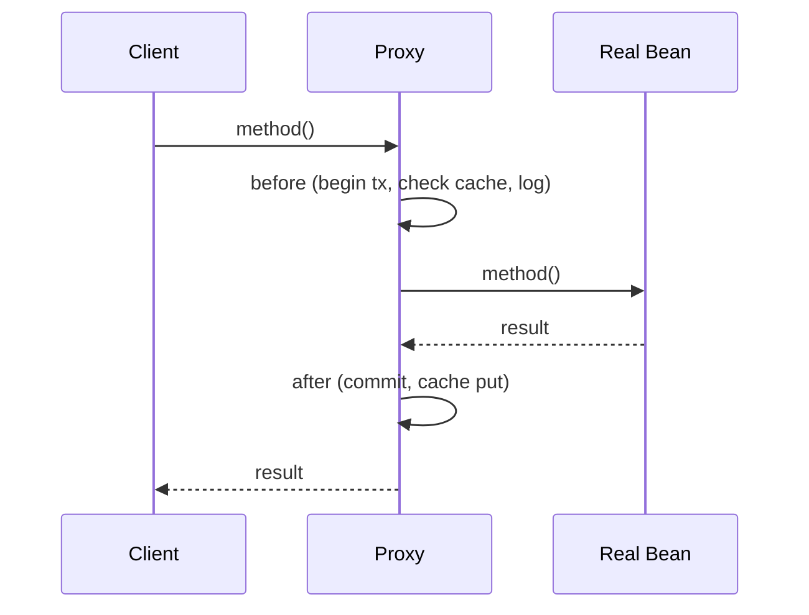

# Common Design Patterns in Java and Spring

**Date:** 2026-04-17
**Tags:** java, design-patterns, spring, oop, architecture

## Table of Contents

- [Summary](#summary)
- [Creational Patterns Overview](#creational-patterns-overview)
- [Builder Pattern](#builder-pattern)
- [Factory Method / Static Factory](#factory-method--static-factory)
- [Singleton — and Why Spring Makes It Obsolete](#singleton--and-why-spring-makes-it-obsolete)
- [Structural Patterns Overview](#structural-patterns-overview)
- [Proxy Pattern — The Heart of Spring AOP](#proxy-pattern--the-heart-of-spring-aop)
- [Decorator Pattern](#decorator-pattern)
- [Adapter Pattern](#adapter-pattern)
- [Behavioral Patterns Overview](#behavioral-patterns-overview)
- [Strategy Pattern](#strategy-pattern)
- [Template Method](#template-method)
- [Chain of Responsibility](#chain-of-responsibility)
- [Observer Pattern](#observer-pattern)
- [Dependency Injection — The Meta-Pattern](#dependency-injection--the-meta-pattern)
- [Repository Pattern](#repository-pattern)
- [Immutable Object Pattern](#immutable-object-pattern)
- [Anti-Patterns to Avoid](#anti-patterns-to-avoid)
- [Pattern-to-Spring-Annotation Cheat Sheet](#pattern-to-spring-annotation-cheat-sheet)
- [Related](#related)
- [References](#references)

---

## Summary

Java leans heavily on classical design patterns because the language does not have TypeScript's flexibility — no structural typing, no duck typing, no first-class functions until lambdas arrived, and no ad-hoc object literals. To compose behavior, Java developers codified repeatable structural solutions decades ago, and Spring wired many of them directly into its programming model. Dependency Injection is the pattern behind `@Autowired`. Strategy is behind `@Primary` bean selection. Template Method underpins `JdbcTemplate` and its cousins. Proxy is what `@Transactional` and `@Cacheable` actually are. Once you recognize these patterns, Spring stops feeling magical and starts feeling intentional — each annotation is a named application of a pattern you already understand from any OO language.

---

## Creational Patterns Overview

Creational patterns answer the question: **how do I construct objects without tangling construction logic into the caller?** The three you will see daily in Spring codebases:

- **Builder** — step-by-step construction for objects with many fields or optional parameters.
- **Factory Method / Static Factory** — named construction with extra semantics (caching, subtype selection, parsing).
- **Singleton** — one instance per process, usually supplied by Spring rather than by your code.

---

## Builder Pattern

If you use Spring and Lombok, you see the Builder pattern every day:

```java
@Builder
public record HttpRequest(
    String url,
    HttpMethod method,
    Map<String, String> headers,
    String body
) {}

var req = HttpRequest.builder()
    .url("https://api.example.com")
    .method(HttpMethod.POST)
    .body("{}")
    .build();
```

**When to use:**

- More than 3-4 constructor parameters.
- Several optional parameters.
- You want fluent, self-documenting construction calls.

TypeScript developers: this is the type-safe cousin of `{ ...defaults, ...overrides }`. You get IDE completion on each `.field()` call, and the compiler catches missing required fields when configured.

**Manual builder (what Lombok generates):**

```java
public final class HttpRequest {
    private final String url;
    private final HttpMethod method;
    // other fields...

    private HttpRequest(Builder b) {
        this.url = b.url;
        this.method = b.method;
    }

    public static Builder builder() { return new Builder(); }

    public static class Builder {
        private String url;
        private HttpMethod method;

        public Builder url(String u) { this.url = u; return this; }
        public Builder method(HttpMethod m) { this.method = m; return this; }
        public HttpRequest build() { return new HttpRequest(this); }
    }
}
```

**You will see this everywhere in Spring:**

- `WebClient.builder()` — reactive HTTP client.
- `RestClient.builder()` — synchronous HTTP client.
- `HttpRequest.newBuilder()` — JDK 11+ HTTP client.
- `UriComponentsBuilder` — URI construction.

---

## Factory Method / Static Factory

Instead of a public constructor, expose a `static` method with a descriptive name:

```java
public final class Money {
    private final BigDecimal amount;
    private final Currency currency;

    private Money(BigDecimal amount, Currency currency) {
        this.amount = amount;
        this.currency = currency;
    }

    public static Money of(BigDecimal amount, Currency currency) {
        return new Money(amount, currency);
    }

    public static Money zero(Currency currency) {
        return new Money(BigDecimal.ZERO, currency);
    }

    public static Money fromString(String s) {
        // parse "USD 12.50" etc.
    }
}
```

**Benefits over raw constructors:**

- Descriptive names clarify intent (`zero`, `fromString`, `of`).
- Can cache and return shared instances (e.g., `Boolean.valueOf`).
- Can return a subtype (interface-returning factories).
- No `new` noise at call sites.

**Examples in the JDK:**

- `List.of(...)`, `Map.of(...)`, `Set.of(...)` — immutable collections.
- `Optional.of(...)`, `Optional.empty()`, `Optional.ofNullable(...)`.
- `Instant.now()`, `LocalDate.parse("2026-04-17")`.
- `Stream.of(...)`, `Collectors.toList()`.

---

## Singleton — and Why Spring Makes It Obsolete

The canonical thread-safe singleton in Java uses an enum:

```java
public enum Settings {
    INSTANCE;

    private final Properties props = loadProps();

    public String get(String key) {
        return props.getProperty(key);
    }

    private static Properties loadProps() { /* ... */ }
}
```

The JVM guarantees enum constants are initialized exactly once, and reflection cannot break the invariant.

**But in Spring you rarely need to write this.** Every `@Service`, `@Component`, `@Repository`, and `@Controller` is a singleton by default — the `ApplicationContext` creates exactly one instance and injects it wherever requested. If you find yourself hand-rolling a singleton inside a Spring app, that is almost always a signal to declare a bean instead.

```java
@Service
public class Settings { // Spring manages the single instance
    public String get(String key) { /* ... */ }
}
```

---

## Structural Patterns Overview

Structural patterns compose classes and objects into larger structures while keeping them flexible:

- **Proxy** — stand-in that intercepts calls to a real object.
- **Decorator** — wraps an object to add behavior without changing its interface.
- **Adapter** — translates one interface into another.
- **Facade** — simplifies a complex subsystem behind a single entry point.

---

## Proxy Pattern — The Heart of Spring AOP



When you `@Autowired OrderService`, Spring may not give you the real `OrderService` instance. It often gives you a **CGLIB subclass** or a **JDK dynamic proxy** that wraps the real bean. The proxy intercepts every method call and runs cross-cutting logic around it.

This is how all of these work:

- `@Transactional` — proxy opens a transaction, calls the method, commits or rolls back.
- `@Cacheable` — proxy checks the cache, calls the method only on miss, stores the result.
- `@Async` — proxy submits the call to a `TaskExecutor` and returns immediately.
- `@Secured` / `@PreAuthorize` — proxy checks authentication before delegating.

See [Spring Fundamentals — AOP and Proxies](../spring-fundamentals.md#aop-and-proxies--the-magic-explained).

**The self-invocation trap** is a direct consequence of the proxy pattern — a method calling another `@Transactional` method on `this` bypasses the proxy entirely, because `this` is the real object, not the wrapper. If you have been bitten by "my `@Transactional` did not work," it is almost always this.

---

## Decorator Pattern

Decorators wrap objects to add behavior while keeping the same interface. Java's IO library is the textbook example:

```java
Reader r = new BufferedReader(
    new InputStreamReader(
        new FileInputStream("file.txt")));
```

Each wrapper adds capability: `FileInputStream` provides bytes, `InputStreamReader` decodes them to characters, `BufferedReader` adds line buffering. Every layer exposes the same base interface, so callers do not care how deep the stack goes.

Spring uses this pattern for `HandlerInterceptor` chains, `DataSource` wrappers (e.g., `TransactionAwareDataSourceProxy`), and many places where behavior is composed from layers.

---

## Adapter Pattern

Adapter bridges two incompatible interfaces. Common Spring and JDK examples:

- `HandlerAdapter` — adapts different controller types (`@Controller`, `HttpRequestHandler`, legacy `Controller`) to a uniform interface that `DispatcherServlet` can call.
- `Spliterators.spliteratorUnknownSize(iterator, ...)` — adapts a classic `Iterator` into a `Spliterator` so it can feed a `Stream`.
- `Arrays.asList(array)` — adapts an array into a `List`.

Adapters are particularly valuable when integrating legacy code with modern APIs without rewriting either side.

---

## Behavioral Patterns Overview

Behavioral patterns describe how objects collaborate:

- **Strategy** — swap algorithms at runtime.
- **Template Method** — fix the skeleton, vary the steps.
- **Chain of Responsibility** — pass requests through a series of handlers.
- **Observer** — publish events to unknown subscribers.

All four are first-class citizens in Spring.

---

## Strategy Pattern

Pick an algorithm at runtime by injecting one of several implementations of a common interface:

```java
public interface PaymentProcessor {
    void charge(Order order);
}

@Component
@Primary
public class StripeProcessor implements PaymentProcessor { /* ... */ }

@Component("paypal")
public class PayPalProcessor implements PaymentProcessor { /* ... */ }

@Service
@RequiredArgsConstructor
public class CheckoutService {
    // Gets the @Primary bean automatically
    private final PaymentProcessor processor;

    // Or inject all implementations:
    // private final List<PaymentProcessor> processors;

    // Or pick by qualifier:
    // public CheckoutService(@Qualifier("paypal") PaymentProcessor p) { ... }
}
```

TypeScript developers: think of it as injecting a function implementation — except Spring handles the registry, selection, and lifecycle. Spring's entire DI story is Strategy pattern operationalized across an application.

---

## Template Method

A parent class defines the algorithm skeleton and fixes the order of operations; subclasses fill in the variable steps:

```java
public abstract class ReportGenerator {
    public final String generate() {
        var data = loadData();
        var formatted = format(data);
        return header() + formatted + footer();
    }

    protected abstract List<Row> loadData();
    protected abstract String format(List<Row> data);
    protected String header() { return "=== REPORT ===\n"; }
    protected String footer() { return "\n=== END ==="; }
}
```

Subclasses override `loadData` and `format`. The `generate` method is `final` so the sequence cannot be broken.

**Spring classes named `*Template` are literally this pattern:**

- `JdbcTemplate` — you supply the SQL and row mapper; it handles connection, exception translation, and resource cleanup.
- `RestTemplate` / `RestClient` — you supply URL and payload; it handles serialization, error mapping, and response parsing.
- `TransactionTemplate` — you supply the work; it handles begin/commit/rollback.

The word "template" is not marketing — it is the pattern name.

---

## Chain of Responsibility

A request flows through a chain of handlers; each decides to handle it, pass it along, or reject it.

- **Spring Security filter chain** — each filter either authenticates, denies, or passes to the next.
- **Servlet `Filter`** — same pattern at the servlet container level.
- **Spring MVC `HandlerInterceptor`** — pre/post hooks around controller execution.
- **WebFlux `WebFilter`** — reactive equivalent.

See [Filters and Interceptors](../web-layer/filters-and-interceptors.md) for how Spring wires these.

---

## Observer Pattern

Publishers emit events without knowing who listens; subscribers register independently. Spring's built-in event system is an Observer implementation:

```java
// Publisher — does not know or care about listeners
@Service
@RequiredArgsConstructor
public class OrderService {
    private final ApplicationEventPublisher publisher;

    public void place(Order order) {
        // ...
        publisher.publishEvent(new OrderPlacedEvent(order));
    }
}

// Subscriber — registered automatically
@Component
public class EmailNotifier {
    @EventListener
    public void on(OrderPlacedEvent event) { /* send email */ }
}
```

See [Application Events](../events-async/application-events.md).

---

## Dependency Injection — The Meta-Pattern

Dependency Injection is the pattern that makes every other Spring pattern ergonomic. Without a container, wiring looks like this:

```java
var dataSource = new HikariDataSource(/* config */);
var orderRepo = new OrderRepository(dataSource);
var smtpClient = new SmtpClient(/* config */);
var emailSender = new EmailSender(smtpClient);
var service = new OrderService(orderRepo, emailSender);
```

Every caller needs to know every transitive dependency, and changing one signature cascades upward. With Spring, you declare dependencies and the container wires them:

```java
@Service
@RequiredArgsConstructor
public class OrderService {
    private final OrderRepository repo;
    private final EmailSender email;
}
```

The container reads your component graph, resolves the topology, and injects. See [Spring Fundamentals](../spring-fundamentals.md#dependency-injection).

---

## Repository Pattern

Abstract persistence behind a narrow interface so business logic never talks to the database directly. Spring Data takes this further — you declare the interface and Spring generates the implementation:

```java
public interface OrderRepository extends JpaRepository<Order, Long> {
    List<Order> findByCustomerId(Long customerId);
    Optional<Order> findByExternalReference(String ref);
}
```

No implementation class required. Spring Data parses the method names, generates queries, and proxies calls at runtime.

TypeScript developers: conceptually similar to a DAO layer or a typed ORM repository class, but with method-name-driven query generation. See [Repository Interfaces](../data-repositories/repository-interfaces.md).

---

## Immutable Object Pattern

Immutable objects can be shared freely across threads with no locking, no defensive copies, and no surprise mutations. Modern Java uses records:

```java
public record Money(BigDecimal amount, Currency currency) {
    public Money add(Money other) {
        if (!currency.equals(other.currency)) {
            throw new IllegalArgumentException("Currency mismatch");
        }
        return new Money(amount.add(other.amount), currency);
    }
}
```

Operations return new instances instead of mutating. Thread-safe by construction. Safe to cache, safe to use as `Map` keys, safe to share across services.

See [Modern Java Features](modern-java-features.md) for more on records.

---

## Anti-Patterns to Avoid

| Anti-Pattern | Why It Hurts | Fix |
|--------------|--------------|-----|
| `@Autowired` field injection | Hidden dependencies, impossible to test without Spring, breaks `final` | Use constructor injection (`@RequiredArgsConstructor`) |
| Service locator (beans looking up other beans from `ApplicationContext`) | Reintroduces the global lookups DI was meant to eliminate | Inject dependencies through the constructor |
| Singleton with mutable state in a web app | Thread-unsafe; data leaks between requests | Keep singletons stateless; use request-scoped beans for per-request data |
| Giant static utility classes (`StringUtils` with 80 methods) | Nothing is cohesive, testing is awkward, low discoverability | Break into focused classes grouped by concern |
| Using exceptions for control flow | Slow, surprising, hard to reason about | Return `Optional`, sentinel values, or dedicated result types |
| Premature abstraction (interface with one implementation, forever) | Adds indirection with no payoff | YAGNI — start concrete, extract an interface only when a second implementation appears |

---

## Pattern-to-Spring-Annotation Cheat Sheet

| Pattern | Spring Realization |
|---------|-------------------|
| Dependency Injection | `@Autowired`, constructor injection via `@RequiredArgsConstructor` |
| Strategy | Multiple `@Component`s implementing the same interface + `@Qualifier` / `@Primary` |
| Proxy | `@Transactional`, `@Cacheable`, `@Async`, `@Secured`, `@PreAuthorize` |
| Template Method | `JdbcTemplate`, `RestTemplate`, `RestClient`, `TransactionTemplate`, `RedisTemplate` |
| Observer | `@EventListener`, `ApplicationEventPublisher`, `@TransactionalEventListener` |
| Chain of Responsibility | `Filter`, `HandlerInterceptor`, `WebFilter`, Spring Security filter chain |
| Repository | `JpaRepository`, `CrudRepository`, `ReactiveMongoRepository` |
| Factory Method | `@Bean` methods in `@Configuration` classes |
| Builder | `WebClient.builder()`, `RestClient.builder()`, Lombok `@Builder` |
| Adapter | `HandlerAdapter`, `ReactiveAdapterRegistry` |
| Decorator | `TransactionAwareDataSourceProxy`, nested `HandlerInterceptor` chain |
| Singleton | Default bean scope for every `@Component` |

---

## Related

- [Spring Fundamentals](../spring-fundamentals.md) — how Spring's IoC container and AOP turn these patterns into annotations.
- [Type System for TS Devs](type-system-for-ts-devs.md) — why Java uses patterns where TS uses structural types.
- [Modern Java Features](modern-java-features.md) — records, sealed types, pattern matching.
- [Lombok and Boilerplate](lombok-and-boilerplate.md) — `@Builder`, `@RequiredArgsConstructor`, and friends.
- [Application Events](../events-async/application-events.md) — Observer pattern in Spring.
- [Filters and Interceptors](../web-layer/filters-and-interceptors.md) — Chain of Responsibility in the web layer.
- [Repository Interfaces](../data-repositories/repository-interfaces.md) — Repository pattern with Spring Data.

---

## References

- Joshua Bloch, *Effective Java* (3rd ed.) — Items 1-9 cover static factories, builders, singletons, and immutability.
- Freeman, Robson, Bates, Sierra, *Head First Design Patterns* — approachable tour of GoF patterns with runnable Java examples.
- [refactoring.guru/design-patterns](https://refactoring.guru/design-patterns) — illustrated catalog with Java code samples.
- Spring Framework Reference: [Core Technologies](https://docs.spring.io/spring-framework/reference/core.html) — canonical docs for IoC, AOP, and events.
- Martin Fowler, *Patterns of Enterprise Application Architecture* — Repository, Service Layer, and other patterns that shaped Spring.
