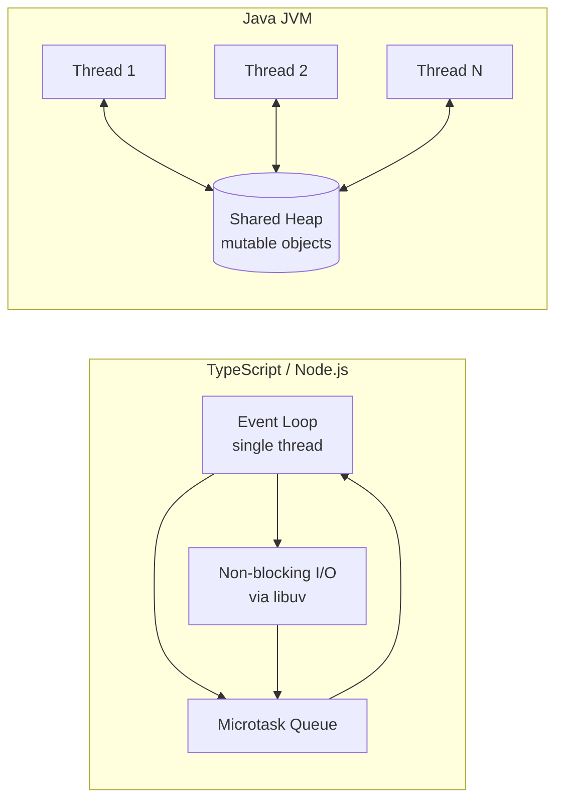
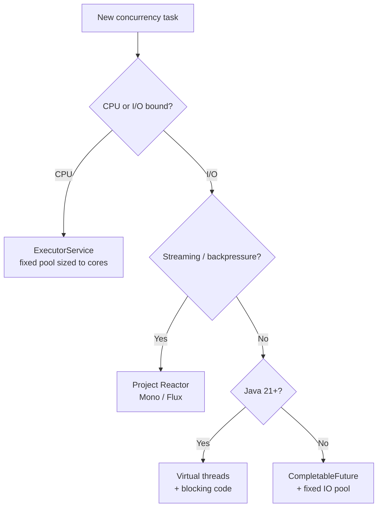

# Java Concurrency Basics for TypeScript Developers

**Date:** 2026-04-17
**Updated:** 2026-04-24
**Tags:** java, concurrency, threads, completablefuture, virtual-threads, reactive

## Table of Contents

- [Summary](#summary)
- [The Core Mental Shift](#the-core-mental-shift)
- [Threads — The Primitive](#threads--the-primitive)
- [ExecutorService — Thread Pools](#executorservice--thread-pools)
- [CompletableFuture — Java's Promise](#completablefuture--javas-promise)
- [The Async Suffix Rule](#the-async-suffix-rule)
- [Virtual Threads (Java 21)](#virtual-threads-java-21)
- [Thread Safety — The Hard Part](#thread-safety--the-hard-part)
- [synchronized — The Basic Mutex](#synchronized--the-basic-mutex)
- [volatile — Visibility, Not Atomicity](#volatile--visibility-not-atomicity)
- [java.util.concurrent.atomic — Lock-Free Atomicity](#javautilconcurrentatomic--lock-free-atomicity)
- [Concurrent Collections](#concurrent-collections)
- [ThreadLocal — Per-Thread State](#threadlocal--per-thread-state)
- [Reactive Streams — The Other Model](#reactive-streams--the-other-model)
- [When to Use Which](#when-to-use-which)
- [Common Bugs](#common-bugs)
- [Spring's @Async vs CompletableFuture](#springs-async-vs-completablefuture)
- [Related](#related)
- [References](#references)

---

## Summary

TypeScript/JavaScript has a single-threaded event loop — no shared memory, no race conditions, no locks. Java is multi-threaded with shared memory — you get real parallelism but also real concurrency bugs. Modern Java offers three concurrency models: thread pools (classic), `CompletableFuture` (like TS Promises), and reactive streams (Project Reactor). Java 21 adds virtual threads for cheap I/O concurrency. Understanding these — plus the thread-safety rules — is what separates hobbyist Java code from production Java code. If you want to refresh the Node side of that mental model first, see [Event Loop Internals](../../typescript/runtime/event-loop-internals.md) and [Worker Threads & Concurrency](../../typescript/runtime/worker-threads.md).

---

## The Core Mental Shift

TypeScript is cooperative. Java is preemptive. In TS, your code runs in atomic turns on a single thread — any I/O yields back to the [event loop](../../typescript/runtime/event-loop-internals.md) via callbacks, Promises, or `await`. In Java, the OS scheduler can pause your thread mid-instruction and hand CPU to another thread that may touch the same memory.



**Implications:**

- **TS:** no data races — a callback runs to completion before the next one starts. `count++` is effectively atomic.
- **Java:** any shared mutable state is a potential race. `count++` is three instructions (read, add, write) and can be interleaved.
- **TS:** 1000 concurrent I/O operations are trivial — the event loop handles them all with one thread.
- **Java (classic):** 1000 threads means thousands of MB of stack memory and heavy context switches.
- **Java (virtual threads):** 1 million concurrent tasks are no problem — the JVM multiplexes them onto a small pool of OS carrier threads.

You never had to learn about memory barriers in TS. You will in Java.

---

## Threads — The Primitive

A `Thread` represents an OS thread of execution. You hand it a `Runnable` (a no-arg lambda).

```java
Thread t = new Thread(() -> {
    System.out.println("Running on " + Thread.currentThread().getName());
});
t.start();   // kick off
t.join();    // block until the thread finishes
```

Two ways to create one:

1. Extend `Thread` and override `run()` — rare, older style.
2. Pass a `Runnable` or lambda to the constructor — preferred.

Direct `Thread` usage is uncommon in modern code. You almost always reach for `ExecutorService` instead — it manages lifecycle, reuses threads, and gives you return values via `Future`.

---

## ExecutorService — Thread Pools

Instead of manually creating threads, submit tasks to a pool.

```java
ExecutorService executor = Executors.newFixedThreadPool(10);

Future<Integer> future = executor.submit(() -> {
    Thread.sleep(1000);
    return 42;
});

Integer result = future.get();  // blocks until done
executor.shutdown();
```

**Pool factory methods:**

| Factory | Behavior |
|---------|----------|
| `newFixedThreadPool(n)` | Exactly n threads, queue unbounded |
| `newCachedThreadPool()` | Grows on demand, reuses idle threads (risky under load) |
| `newSingleThreadExecutor()` | One worker, serialized execution |
| `newVirtualThreadPerTaskExecutor()` | Java 21+, one virtual thread per task |
| `newScheduledThreadPool(n)` | For delayed / periodic tasks |

Always call `shutdown()` (or use try-with-resources on Java 21+ — `ExecutorService` is now `AutoCloseable`). Forgetting it leaves non-daemon threads alive and prevents JVM exit.

---

## CompletableFuture — Java's Promise

`CompletableFuture<T>` is the closest analog to a TypeScript `Promise<T>`. It represents a value that will arrive later, and it composes via chained methods. The closest Node mental model is still "Promise chaining on top of the event loop," not a Java thread magically suspended by `await`; for a refresher on where promise continuations actually run, see [Event Loop Internals](../../typescript/runtime/event-loop-internals.md).

```java
CompletableFuture<String> future = CompletableFuture
    .supplyAsync(() -> fetchUser(id))        // like an async function
    .thenApply(user -> user.getName())        // like .then(user => user.name)
    .thenCompose(name -> fetchOrders(name))   // like .then(name => fetchOrders(name))
    .exceptionally(ex -> {                    // like .catch
        log.error("failed", ex);
        return "default";
    });

String result = future.get();  // blocks — rarely done in production code
```

**TS → Java method map:**

| TypeScript | Java |
|------------|------|
| `new Promise((res) => ...)` | `CompletableFuture.supplyAsync(() -> ...)` |
| `.then(x => y)` | `.thenApply(x -> y)` |
| `.then(x => promise)` | `.thenCompose(x -> completableFuture)` |
| `.catch(e => ...)` | `.exceptionally(e -> ...)` |
| `Promise.all([p1, p2])` | `CompletableFuture.allOf(f1, f2)` |
| `Promise.race([p1, p2])` | `CompletableFuture.anyOf(f1, f2)` |
| `await promise` | `.get()` or `.join()` (blocking!) |

The key mental note: Java has no `await` keyword. Chaining with `thenApply` / `thenCompose` is how you sequence async work without blocking. Calling `.get()` or `.join()` on a future blocks the current thread — avoid it in request-handling code. In Node, `await` pauses only the async function and resumes via the microtask queue; in Java, `.get()` parks or blocks a thread.

---

## The Async Suffix Rule

Most `CompletableFuture` chain methods have an `Async` variant. The suffix controls **where** the continuation runs.

- `.thenApply(fn)` — runs on the thread that completed the previous stage (could be the caller's thread).
- `.thenApplyAsync(fn)` — runs on the ForkJoinPool common pool.
- `.thenApplyAsync(fn, executor)` — runs on the executor you supply.

Rule of thumb: use the `Async` variants (with your own executor) for any work that might be slow — otherwise you risk long-running continuations executing on unintended threads (including request threads in a web app).

```java
ExecutorService io = Executors.newFixedThreadPool(20);

CompletableFuture.supplyAsync(() -> loadFromDb(id), io)
    .thenApplyAsync(row -> transform(row), io)
    .thenAcceptAsync(result -> respond(result), io);
```

---

## Virtual Threads (Java 21)

Virtual threads are lightweight JVM threads multiplexed onto a small pool of OS carrier threads. Blocking I/O unmounts the virtual thread from its carrier — so blocking calls become cheap.

```java
try (var executor = Executors.newVirtualThreadPerTaskExecutor()) {
    for (int i = 0; i < 1_000_000; i++) {
        executor.submit(() -> {
            Thread.sleep(1000);  // blocks the virtual thread, NOT the OS thread
            return "done";
        });
    }
}
```

Consequences:

- Millions of concurrent tasks on a laptop are feasible.
- Classic blocking code (`JdbcTemplate`, `RestTemplate`, `HttpClient.send`) stops being a scalability problem.
- For pure I/O-bound workloads, virtual threads remove much of the motivation for writing reactive code.

Caveats: virtual threads do **not** help CPU-bound work (still bound by core count), and `synchronized` blocks still pin a virtual thread to its carrier (fixed in [JDK 24, JEP 491](https://openjdk.org/jeps/491)) — prefer [`ReentrantLock`](multithreading-deep-dive.md#reentrantlock) in hot paths on older JDKs.

For the full story: [Virtual Threads in Java](virtual-threads.md) covers internals, pinning, and Spring integration. [Multithreading Deep Dive](multithreading-deep-dive.md) covers `ReentrantLock`, `StampedLock`, `ThreadPoolExecutor` internals, and the Java Memory Model.

---

## Thread Safety — The Hard Part

Shared mutable state is the source of almost every Java concurrency bug.

```java
public class Counter {
    private int count = 0;
    public void increment() { count++; }  // NOT thread-safe
}
```

`count++` is really:

1. Read `count` from memory to register.
2. Add 1 in the register.
3. Write the register back to memory.

Two threads running concurrently can both read `5`, both compute `6`, and both write `6` — losing one increment. TS developers never have to think about this because only one callback ever runs at a time on the main JS thread. That changes if you opt into [worker threads and shared memory](../../typescript/runtime/worker-threads.md).

Beyond atomicity, Java also has **visibility** issues: a write from Thread A may not be seen by Thread B without proper synchronization, because of CPU caches and JIT reordering. This is where `synchronized`, `volatile`, and the atomics come in.

---

## synchronized — The Basic Mutex

`synchronized` provides mutual exclusion on an object monitor, plus a happens-before memory barrier.

```java
public synchronized void increment() { count++; }

// Equivalent:
public void increment() {
    synchronized (this) { count++; }
}
```

Only one thread holds the monitor at a time. Simple and correct, but:

- Under contention it serializes work and can kill throughput.
- On virtual threads, it pins the carrier (through Java 21).
- Nested locks introduce deadlock risk.

For anything more nuanced than "one method, rarely contended," prefer `ReentrantLock` or the atomic classes below.

---

## volatile — Visibility, Not Atomicity

```java
private volatile boolean running = true;
```

Guarantees that:

- Reads always see the latest write from any thread.
- Reads and writes cannot be reordered around the volatile access.

Does **not** make compound operations atomic — `counter++` on a `volatile int` is still racy. Use `volatile` for flags, single-writer state, and publication of immutable references.

---

## java.util.concurrent.atomic — Lock-Free Atomicity

The `atomic` package uses CPU compare-and-swap (CAS) instructions under the hood. No locks, no blocking. If you've seen `SharedArrayBuffer` + `Atomics` in Node worker threads, this is the same family of "safe read-modify-write across shared memory" problems, just expressed through Java's standard library.

```java
private final AtomicInteger count = new AtomicInteger();

count.incrementAndGet();   // atomic read-modify-write
count.addAndGet(5);
count.compareAndSet(expected, next);
```

Also available: `AtomicLong`, `AtomicBoolean`, `AtomicReference<T>`, `LongAdder` (preferred for very high-contention counters), `AtomicIntegerArray`, etc.

Prefer atomics over `synchronized` for simple counters, flags, and single-reference updates. They're faster and scale better under contention.

---

## Concurrent Collections

Replace hand-rolled `synchronized` wrappers with purpose-built concurrent collections.

| Instead of | Use |
|------------|-----|
| `HashMap` with synchronized wrapper | `ConcurrentHashMap` |
| `ArrayList` with sync | `CopyOnWriteArrayList` (read-heavy, rare writes) |
| Manual producer/consumer queue | `ConcurrentLinkedQueue`, `BlockingQueue`, `LinkedBlockingQueue` |
| `TreeMap` + sync | `ConcurrentSkipListMap` |

`ConcurrentHashMap` has atomic compound operations that read like magic:

```java
Map<String, User> cache = new ConcurrentHashMap<>();

// Atomic: get or compute-and-insert, no external locking
User u = cache.computeIfAbsent(id, key -> loadUser(key));
```

Use these instead of `Collections.synchronizedMap(...)` — they're faster and have richer atomic APIs.

---

## ThreadLocal — Per-Thread State

`ThreadLocal<T>` gives each thread its own copy of a value. Common uses: non-thread-safe helpers (classic `SimpleDateFormat`), per-request context in web apps, MDC logging.

```java
private static final ThreadLocal<SimpleDateFormat> FORMATTER =
    ThreadLocal.withInitial(() -> new SimpleDateFormat("yyyy-MM-dd"));

String today = FORMATTER.get().format(new Date());
```

**Warning:** with thread pools, threads are reused. A `ThreadLocal` set on one request will leak to the next unless you `remove()` it in a `finally`. With virtual threads, prefer `ScopedValue` (Java 21+) for structured per-scope context.

---

## Reactive Streams — The Other Model

Project Reactor (used by Spring WebFlux) offers non-blocking, backpressure-aware async composition.

```java
Mono<User> userMono = userRepository.findById(id)          // non-blocking
    .flatMap(user -> orderRepository.findByUser(user))      // like thenCompose
    .timeout(Duration.ofSeconds(5));
```

- `Mono<T>` — 0 or 1 async values.
- `Flux<T>` — 0 to N async values, a non-blocking stream.
- Backpressure — consumers can signal how much they can handle.

Deeper dive in the dedicated doc: see [Reactive Programming in Java](../reactive-programming-java.md).

With virtual threads available, reactive is now mostly justified by streaming semantics and backpressure, not by raw I/O concurrency.

---

## When to Use Which



| Scenario | Use |
|----------|-----|
| CPU-bound parallel work | `ExecutorService` sized to core count |
| Chained async operations | `CompletableFuture` |
| High-concurrency I/O on Java 21+ | Virtual threads + blocking code |
| Streaming, backpressure, composition | Project Reactor (`Mono` / `Flux`) |
| Simple counters / flags | `AtomicInteger`, `AtomicReference` |
| Shared maps under concurrency | `ConcurrentHashMap` |
| Per-request context | `ThreadLocal` (classic) or `ScopedValue` (J21+) |

---

## Common Bugs

- **Missing `volatile`.** A worker thread reads a flag once and caches it — your `stop` signal never arrives.
- **Not shutting down `ExecutorService`.** Non-daemon threads prevent JVM exit; the process hangs after `main` returns.
- **Deadlock.** Thread A holds lock X and waits for Y; Thread B holds Y and waits for X. Always acquire locks in a consistent order.
- **Check-then-act races.**

  ```java
  // BUG: another thread may put between the get and the put
  if (map.get(k) == null) map.put(k, v);

  // FIX: atomic compound op
  map.putIfAbsent(k, v);
  // or
  map.computeIfAbsent(k, key -> v);
  ```

- **Blocking inside Reactor operators.** A `Thread.sleep` or blocking JDBC call on an event-loop thread starves all other in-flight work. Use `publishOn(Schedulers.boundedElastic())` for unavoidable blocking.
- **Using `Future.get()` on the request thread.** Defeats the purpose of async. Chain with `thenApply` / `thenCompose` instead.
- **Mutating shared state from a lambda passed to a stream's `parallel()`.** Parallel streams share the common ForkJoinPool; accumulating to a plain `ArrayList` is a race.

---

## Spring's @Async vs CompletableFuture

Spring offers `@Async` as a declarative shortcut.

```java
@Service
public class ReportService {
    @Async
    public CompletableFuture<Report> generate(long id) {
        // runs on Spring's configured TaskExecutor
        return CompletableFuture.completedFuture(buildReport(id));
    }
}
```

- Requires `@EnableAsync` on a config class.
- Uses Spring's `TaskExecutor` (configure a `ThreadPoolTaskExecutor` bean).
- Self-invocation does not trigger the proxy — call through the bean.

See the dedicated doc: [Async Processing](../events-async/async-processing.md).

---

## Related

- [Multithreading Deep Dive](multithreading-deep-dive.md) — JMM, `ReentrantLock`, `StampedLock`, synchronizers, `ThreadPoolExecutor` internals.
- [Virtual Threads in Java](virtual-threads.md) — full JEP 444 deep dive, pinning, carriers, Spring integration.
- [Structured Concurrency](structured-concurrency.md) — `StructuredTaskScope` and `ScopedValue`.
- [Modern Java Features](modern-java-features.md) — records, sealed types, pattern matching.
- [Reactive Programming in Java](../reactive-programming-java.md) — the non-blocking alternative concurrency model.
- [Async Processing](../events-async/async-processing.md) — Spring's `@Async` and `TaskExecutor`.
- [Spring Fundamentals](../spring-fundamentals.md) — IoC container and AOP proxies.
- [Scaling MVC Before Virtual Threads](../web-layer/mvc-high-throughput.md) — applied thread pool tuning and `CompletableFuture` controllers.
- [Event Loop Internals](../../typescript/runtime/event-loop-internals.md) — the Node/libuv side of callbacks, microtasks, and scheduling.
- [Worker Threads & Concurrency](../../typescript/runtime/worker-threads.md) — Node's real parallelism model, `SharedArrayBuffer`, and `Atomics`.

---

## References

- Oracle — [Java Concurrency Tutorial](https://docs.oracle.com/javase/tutorial/essential/concurrency/)
- JEP 444 — [Virtual Threads](https://openjdk.org/jeps/444)
- Javadoc — [`CompletableFuture`](https://docs.oracle.com/en/java/javase/21/docs/api/java.base/java/util/concurrent/CompletableFuture.html)
- Javadoc — [`java.util.concurrent`](https://docs.oracle.com/en/java/javase/21/docs/api/java.base/java/util/concurrent/package-summary.html)
- Project Reactor — [Reference Guide](https://projectreactor.io/docs/core/release/reference/)
- Brian Goetz et al. — *Java Concurrency in Practice*
