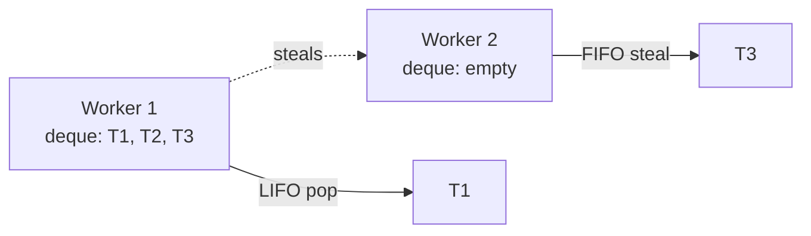

# ForkJoinPool and Parallel Streams — Work Stealing, RecursiveTask, commonPool

**Date:** 2026-04-24 | **Updated:** 2026-04-24
**Tags:** `java` `concurrency` `forkjoinpool` `parallel-streams` `work-stealing`

## Table of Contents

- [Summary](#summary)
- [Work-Stealing Model](#work-stealing-model)
- [RecursiveTask and RecursiveAction](#recursivetask-and-recursiveaction)
- [Thresholds — The 80% of Getting It Right](#thresholds--the-80-of-getting-it-right)
- [ManagedBlocker — Blocking Without Starving the Pool](#managedblocker--blocking-without-starving-the-pool)
- [commonPool — The Shared Default](#commonpool--the-shared-default)
- [Custom ForkJoinPool Instances](#custom-forkjoinpool-instances)
- [Parallel Streams — What It Actually Does](#parallel-streams--what-it-actually-does)
- [Spliterator — Custom Splitting](#spliterator--custom-splitting)
- [When Parallel Streams Lose](#when-parallel-streams-lose)
- [ForkJoinPool vs Virtual Threads](#forkjoinpool-vs-virtual-threads)
- [Related](#related)
- [References](#references)

---

## Summary

[`ForkJoinPool`](https://docs.oracle.com/en/java/javase/21/docs/api/java.base/java/util/concurrent/ForkJoinPool.html) (Java 7, Doug Lea) is the work-stealing executor behind parallel streams, `CompletableFuture.commonPool`, and — with carrier threads — virtual threads. Its core idea: each worker has a private deque; when idle, it steals work from someone else's deque. This gives great CPU utilization on recursive divide-and-conquer problems (sort, fold, reduce). The two traps: submitting blocking I/O tasks to `commonPool` (which is shared across the JVM) starves every other library using it, and parallel streams lose to sequential streams on surprisingly many real workloads. This doc covers the pool model, `RecursiveTask`, threshold tuning, `ManagedBlocker`, and the decision of when parallel streams are worth the complexity.

---

## Work-Stealing Model

Each worker thread in a ForkJoinPool owns a **deque** (double-ended queue) of tasks:



- Self-access: LIFO (stack). Most recently forked task has warmest cache → pop from top.
- Steal: FIFO (queue). Least recently forked, largest task → least likely to conflict with the owner's local work.

This protocol minimizes contention: workers rarely touch each other's queues except when idle. It's the reason ForkJoinPool scales better than a single shared queue for CPU-bound recursive work.

---

## RecursiveTask and RecursiveAction

Two base classes for fork-join tasks:

- [`RecursiveTask<V>`](https://docs.oracle.com/en/java/javase/21/docs/api/java.base/java/util/concurrent/RecursiveTask.html) — returns a value.
- [`RecursiveAction`](https://docs.oracle.com/en/java/javase/21/docs/api/java.base/java/util/concurrent/RecursiveAction.html) — void.

Classic parallel sum:

```java
class SumTask extends RecursiveTask<Long> {
    private static final int THRESHOLD = 10_000;
    private final long[] arr;
    private final int lo, hi;

    SumTask(long[] arr, int lo, int hi) {
        this.arr = arr; this.lo = lo; this.hi = hi;
    }

    @Override
    protected Long compute() {
        if (hi - lo <= THRESHOLD) {
            long s = 0;
            for (int i = lo; i < hi; i++) s += arr[i];
            return s;
        }
        int mid = (lo + hi) >>> 1;
        SumTask left  = new SumTask(arr, lo, mid);
        SumTask right = new SumTask(arr, mid, hi);
        left.fork();                      // submit left to pool
        long rightResult = right.compute(); // run right directly on this thread
        long leftResult  = left.join();   // wait for left
        return leftResult + rightResult;
    }
}

long total = ForkJoinPool.commonPool().invoke(new SumTask(arr, 0, arr.length));
```

Idiom: fork one half, compute the other directly. Avoids unnecessary thread hops for the last piece.

---

## Thresholds — The 80% of Getting It Right

The `THRESHOLD` above — when does splitting stop paying off?

Rules of thumb:
- **Too small** (e.g., THRESHOLD=1): fork/join overhead dominates; parallelism loses.
- **Too large** (e.g., THRESHOLD=1_000_000 for a 2M array): never splits; only 2 tasks for a 16-core box.
- **Right**: 8×–16× the parallelism. If you have 8 cores, aim for 64–128 leaf tasks.

For a 10M-element sum: THRESHOLD ~100k (→ 100 leaf tasks, plenty of work stealing).

Measure with JMH. Doug Lea's guideline: **computation should take 100 μs to 10 ms per leaf task**. Less → overhead wins. More → load-imbalance.

---

## ManagedBlocker — Blocking Without Starving the Pool

If a ForkJoin task blocks (e.g., waits for a result, does I/O, holds a lock), the whole pool can deadlock: all N workers are blocked, no one can unblock them.

Fix: [`ManagedBlocker`](https://docs.oracle.com/en/java/javase/21/docs/api/java.base/java/util/concurrent/ForkJoinPool.ManagedBlocker.html). When a task is about to block, it tells the pool, which spawns a compensating thread:

```java
public class BlockingLookup implements ForkJoinPool.ManagedBlocker {
    volatile String result;
    private final String key;

    BlockingLookup(String key) { this.key = key; }

    @Override
    public boolean block() throws InterruptedException {
        if (result == null) result = slowLookup(key);  // blocking call
        return true;
    }

    @Override
    public boolean isReleasable() { return result != null; }

    public String get() throws InterruptedException {
        ForkJoinPool.managedBlock(this);
        return result;
    }
}
```

Rare in application code; mostly used by JDK internals (e.g., `CompletableFuture.join()` in commonPool uses this). If your FJ task needs to block, seriously reconsider whether FJ is the right tool — usually you want a separate executor for blocking I/O.

---

## commonPool — The Shared Default

`ForkJoinPool.commonPool()` is a JVM-wide default pool used by:
- `Stream.parallel()`.
- `CompletableFuture.supplyAsync(supplier)` (no-executor overload).
- `Arrays.parallelSort(...)`.
- Various JDK internals.

Default size: `Runtime.getRuntime().availableProcessors() - 1`. Override with `-Djava.util.concurrent.ForkJoinPool.common.parallelism=N`.

**The Trap**: any blocking work submitted to commonPool starves everyone else. A parallel stream, a CompletableFuture chain, and `Arrays.parallelSort` all fight over the same N threads.

Symptoms:
- Parallel streams slow down mysteriously when another library runs an async workload.
- `CompletableFuture` chains hang in integration tests.
- JDBC call in `supplyAsync(() -> db.query())` blocks a common-pool worker → starvation.

Rule: **never submit blocking work to commonPool**. Use a dedicated executor:

```java
Executor io = Executors.newFixedThreadPool(50);
CompletableFuture.supplyAsync(() -> db.query(), io);   // NOT commonPool
```

Or on Java 21+, use a virtual-thread executor:

```java
Executor vt = Executors.newVirtualThreadPerTaskExecutor();
CompletableFuture.supplyAsync(() -> db.query(), vt);   // cheap, isolated
```

---

## Custom ForkJoinPool Instances

When you want parallelism without sharing commonPool:

```java
ForkJoinPool custom = new ForkJoinPool(16);

// CPU-bound work on custom pool
Long result = custom.submit(() ->
    LongStream.range(0, 10_000_000).parallel().sum()   // parallelizes on `custom`, not commonPool!
).get();
```

Submitting a parallel-stream pipeline to a custom FJP routes the parallelism through it. This is the only way to isolate parallel streams from commonPool.

Caveats:
- More threads ≠ more throughput. CPU-bound peaks at cores; beyond, you're context-switching.
- Don't create custom FJPs per request — cache them.

---

## Parallel Streams — What It Actually Does

`.parallel()` splits the stream's source via [`Spliterator.trySplit()`](https://docs.oracle.com/en/java/javase/21/docs/api/java.base/java/util/Spliterator.html#trySplit()), forks tasks to commonPool, and joins.

```java
long sum = list.parallelStream()
    .mapToLong(Item::size)
    .sum();
```

Good candidates:
- Large source (N > ~10k).
- CPU-bound per-element work.
- Stateless, non-blocking operations.
- The result can be combined associatively (`+`, `max`, `min`, `String.concat`, `Collectors.toList`).

Bad candidates:
- Small source (parallelism overhead dominates).
- I/O-bound per-element work (submits to commonPool — starvation).
- Stateful lambdas (closures over shared mutable state).
- `Collectors.toList()` that must preserve insertion order from a spliterator that doesn't (rare).

---

## Spliterator — Custom Splitting

For custom data sources, parallel streams only parallelize if the [`Spliterator`](https://docs.oracle.com/en/java/javase/21/docs/api/java.base/java/util/Spliterator.html) can split cheaply:

```java
public class RangeSpliterator implements Spliterator.OfInt {
    private int start, end;
    // ...

    @Override
    public Spliterator.OfInt trySplit() {
        int mid = (start + end) >>> 1;
        if (mid - start < 16) return null;      // too small to split
        RangeSpliterator left = new RangeSpliterator(start, mid);
        this.start = mid;
        return left;
    }

    @Override public int characteristics() {
        return ORDERED | SIZED | SUBSIZED | IMMUTABLE | NONNULL;
    }
    @Override public long estimateSize() { return end - start; }
    // forEachRemaining, tryAdvance...
}
```

Out of the box, `ArrayList.stream().parallel()` splits well (arrays are cheap to subdivide). `LinkedList.stream().parallel()` does not — must walk, no O(1) middle. `Files.lines(path).parallel()` is often a pessimization for the same reason.

---

## When Parallel Streams Lose

Counterintuitive benchmark results:

| Scenario | Why parallel loses |
|----------|-------------------|
| Source < ~10k elements | Fork/join overhead > work |
| `.forEachOrdered()` | Forces serialization at collect |
| `.collect(Collectors.toList())` on small lists | Merging overhead |
| I/O inside the lambda | Blocks commonPool |
| Stream from `LinkedList` or `Iterator` | Spliterator can't split well |
| Autoboxed `Stream<Integer>` | Boxing wrecks cache behavior |

JMH measurement rules:
1. Benchmark both sequential and parallel.
2. Warm up the JIT.
3. Measure end-to-end, not just `.sum()`.
4. Use `@Benchmark(batchSize = N)` to amortize overhead.

Rule: parallel streams are the right tool for large CPU-bound data transformations with associative combining. Everywhere else, they're a trap.

---

## ForkJoinPool vs Virtual Threads

Virtual threads also use a ForkJoinPool internally — the **carrier pool** — to run unmounted continuations. Same library, different use.

| Aspect | FJP (user-submitted tasks) | VT carrier pool |
|--------|---------------------------|-----------------|
| Workload | CPU-bound recursive | Blocking I/O |
| Task size | ms-scale | arbitrary |
| Scheduling | Work-stealing of RecursiveTasks | Work-stealing of continuations |
| Pool size | Typically N cores | Configurable, defaults to N cores |
| Blocking is OK? | No (starves pool) | Yes (unmounts VT) |

Rule:
- **CPU-bound divide-and-conquer → FJP** (RecursiveTask, parallel streams on custom pool).
- **I/O-bound "many concurrent requests" → VT** (virtual-thread-per-task executor).
- **Mixed (bulk parallel HTTP, for instance) → VT** (each call cheap; VT unmounts during I/O).

See [virtual-threads.md](virtual-threads.md) for the VT internals.

---

## Related

- [Concurrency Basics](concurrency-basics.md) — thread pool basics.
- [Multithreading Deep Dive](multithreading-deep-dive.md) — `ThreadPoolExecutor` for comparison.
- [CompletableFuture Deep Dive](completablefuture-deep-dive.md) — why `CF.supplyAsync(..)` without executor uses commonPool.
- [Virtual Threads](virtual-threads.md) — carrier pool is also ForkJoinPool.
- [Structured Concurrency](structured-concurrency.md) — `StructuredTaskScope` as a modern RecursiveTask-like API.
- [Concurrent Collections](concurrent-collections.md) — deques underpin FJP work stealing.
- [Collections and Streams](../collections-and-streams.md) — Stream API basics.
- [Performance Testing](../../testing/performance-testing.md) — JMH for measuring parallel stream speedup.

---

## References

- [`ForkJoinPool` Javadoc (JDK 21)](https://docs.oracle.com/en/java/javase/21/docs/api/java.base/java/util/concurrent/ForkJoinPool.html)
- [`RecursiveTask` Javadoc](https://docs.oracle.com/en/java/javase/21/docs/api/java.base/java/util/concurrent/RecursiveTask.html)
- [Doug Lea — "A Java Fork/Join Framework" (2000)](https://gee.cs.oswego.edu/dl/papers/fj.pdf)
- [Brian Goetz et al. — *Java Concurrency in Practice*](https://jcip.net/) — Chapter 11 & 12.
- [Aleksey Shipilëv — JVM Anatomy Quarks](https://shipilev.net/jvm/anatomy-quarks/) — thread scheduling.
- [Paul Sandoz — Parallel Streams performance talks](https://www.youtube.com/results?search_query=paul+sandoz+parallel+streams)
- [JEP 444: Virtual Threads](https://openjdk.org/jeps/444) — VT carrier thread model.
