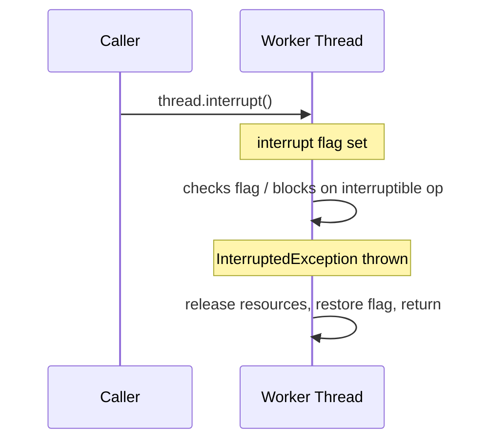

# Interruption and Cancellation in Java — The InterruptedException Idiom

**Date:** 2026-04-24 | **Updated:** 2026-04-24
**Tags:** `java` `concurrency` `interruption` `cancellation` `executor-service`

## Table of Contents

- [Summary](#summary)
- [Cooperative Cancellation — Java's Only Model](#cooperative-cancellation--javas-only-model)
- [Thread.interrupt Semantics](#threadinterrupt-semantics)
- [The InterruptedException Idiom](#the-interruptedexception-idiom)
- [Interruption-Aware Blocking Calls](#interruption-aware-blocking-calls)
- [Non-Interruptible Blocking and InterruptibleChannel](#non-interruptible-blocking-and-interruptiblechannel)
- [ExecutorService Shutdown](#executorservice-shutdown)
- [Future.cancel and Its Caveats](#futurecancel-and-its-caveats)
- [Poison Pills](#poison-pills)
- [Reactive Cancellation](#reactive-cancellation)
- [Virtual Threads and Structured Cancellation](#virtual-threads-and-structured-cancellation)
- [Common Bugs](#common-bugs)
- [Related](#related)
- [References](#references)

---

## Summary

Java cancellation is **cooperative**. There is no `Thread.stop()` that safely halts a running thread — cancelling means asking the thread politely via an interrupt, and the thread has to check. Code that swallows [`InterruptedException`](https://docs.oracle.com/en/java/javase/21/docs/api/java.base/java/lang/InterruptedException.html), or loops without polling the interrupt flag, ignores cancellation — that's the single most common bug. This doc covers the `Thread.interrupt()` semantic, the canonical `InterruptedException` idiom, `ExecutorService` shutdown, `Future.cancel(true)`, poison pills for queues, reactive `Disposable`, and how structured concurrency in Java 21+ made most of this easier.

---

## Cooperative Cancellation — Java's Only Model

[`Thread.stop()`](https://docs.oracle.com/en/java/javase/21/docs/api/java.base/java/lang/Thread.html#stop()) was deprecated in 1998 and has been "degraded" to always throw `UnsupportedOperationException` since JDK 20. Forcibly stopping a thread is unsafe — it could leave data structures half-modified, locks held, connections dangling.

The replacement: **interrupt and let the thread respond**. `Thread.interrupt()` sets a boolean flag on the target thread. Well-written code checks the flag or lets blocking calls throw `InterruptedException` and cleanly unwinds.



The contract is social: both sides have to participate. If the worker never checks the flag and never calls an interruptible method, it ignores the interrupt. That's a real bug, not a feature.

---

## Thread.interrupt Semantics

Three interrupt-related methods:

| Method | Behavior |
|--------|----------|
| `Thread.interrupt()` | Sets the flag. Wakes blocking calls with `InterruptedException`. |
| `Thread.interrupted()` | Checks **and clears** the flag on the current thread. |
| `Thread.currentThread().isInterrupted()` | Checks the flag without clearing. |

```java
// Loop that responds to cancellation
while (!Thread.currentThread().isInterrupted()) {
    doWork();
}
```

The difference matters:

```java
if (Thread.interrupted()) {       // clears flag
    log.info("cancelled");
    return;
}
// if you reach here and later block, you WON'T see InterruptedException —
// because you already cleared the flag
```

Rule: prefer `isInterrupted()` unless you explicitly want to consume the flag.

---

## The InterruptedException Idiom

When a blocking call throws `InterruptedException`, the flag is **cleared by the throw**. If you catch it without restoring the flag, higher-level code can't detect the cancellation.

The canonical idiom:

```java
try {
    Thread.sleep(1000);
} catch (InterruptedException e) {
    Thread.currentThread().interrupt();   // restore the flag
    // clean up, then exit normally (or rethrow)
    return;
}
```

Three legitimate responses to `InterruptedException`:

1. **Propagate** — declare `throws InterruptedException` and let the caller decide. Best for library code.
2. **Restore + return** — catch, call `Thread.currentThread().interrupt()`, clean up, exit. Best for task-level code where you can't add `throws`.
3. **Wrap** — catch, wrap in a runtime exception (`RuntimeException` or a domain-specific unchecked). Acceptable but rare — loses type information.

**Anti-pattern**: catch and swallow.

```java
try { Thread.sleep(1000); } catch (InterruptedException e) { /* ignore */ }   // BUG
```

The flag is lost forever. Every `Thread.sleep` inside that task ignores future interrupts. Cancellation is broken for the rest of the stack.

---

## Interruption-Aware Blocking Calls

These throw `InterruptedException` and respond to `Thread.interrupt()`:

- `Thread.sleep(long)` / `Thread.sleep(long, int)`.
- `Object.wait(...)`.
- `Thread.join(...)`.
- `BlockingQueue.put/take(...)`, `offer/poll(timeout)`.
- `Lock.lockInterruptibly()` — but **not** `Lock.lock()`.
- `Condition.await(...)`.
- `Future.get(...)`.
- `CountDownLatch.await(...)`, `CyclicBarrier.await(...)`, `Semaphore.acquire()`.
- `Selector.select(...)` (NIO).
- Modern `HttpClient.send(...)` and other async-client blocking waits.

These do **not** throw `InterruptedException`:

- `Lock.lock()` — use `lockInterruptibly()` instead.
- `synchronized` block entry — acquisition is uninterruptible.
- `ReentrantLock.lock()` — same.
- Reading a legacy `InputStream.read()` on a non-channel-backed stream.
- JNI calls to native code.

This is the heart of cooperative cancellation: use the interruptible API where possible.

---

## Non-Interruptible Blocking and InterruptibleChannel

Pre-NIO I/O (`Socket.getInputStream().read()`, `FileInputStream.read()`) is not interruptible. A thread blocked in a socket read won't respond to `interrupt()`.

Fix: use NIO channels. [`InterruptibleChannel`](https://docs.oracle.com/en/java/javase/21/docs/api/java.base/java/nio/channels/InterruptibleChannel.html) closes the channel on interrupt and throws `ClosedByInterruptException`:

```java
try (SocketChannel ch = SocketChannel.open(remote)) {
    ch.read(buf);   // throws ClosedByInterruptException on interrupt; channel is closed
}
```

For legacy blocking I/O where you can't switch to channels, your only option is to close the socket from another thread — the blocked read will throw `SocketException`. Ugly but works.

Virtual threads in JDK 21+ make this partially moot for HTTP: virtual threads using `HttpClient` handle interruption correctly.

---

## ExecutorService Shutdown

```java
ExecutorService executor = Executors.newFixedThreadPool(10);
// ... submit tasks ...

executor.shutdown();                                  // stop accepting new tasks
boolean done = executor.awaitTermination(30, SECONDS); // wait for existing to finish
if (!done) {
    List<Runnable> pending = executor.shutdownNow();  // interrupt running, drop queued
    // pending = tasks that hadn't started
    if (!executor.awaitTermination(10, SECONDS)) {
        log.warn("executor did not terminate");
    }
}
```

The two methods:

- `shutdown()` — reject new tasks; let existing ones finish. Doesn't interrupt.
- `shutdownNow()` — reject new tasks, interrupt running ones, return unstarted tasks.

The graceful-shutdown idiom above (shutdown → await → shutdownNow → await) is what you want for JVM shutdown hooks. Don't just call `shutdownNow()` — that skips clean completion of in-flight work.

**In Spring**: the container calls `shutdown()` on `TaskExecutor` beans automatically. For custom `ExecutorService`s, register them as beans or add an `@PreDestroy` hook.

---

## Future.cancel and Its Caveats

```java
Future<Result> future = executor.submit(() -> doWork());
boolean cancelled = future.cancel(true);   // mayInterruptIfRunning
```

`cancel(mayInterruptIfRunning)` behavior:

| State | `cancel(true)` | `cancel(false)` |
|-------|----------------|-----------------|
| Not started | Removed from queue, returns `true`. | Same. |
| Running | Interrupts the worker thread, returns `true`. | Returns `false` (no-op). |
| Completed | Returns `false` (too late). | Same. |

**`cancel(true)` only interrupts — the task must cooperate**. If the task swallows `InterruptedException` or never blocks on an interruptible call, `cancel(true)` does nothing visible.

**CompletableFuture caveat**: `CompletableFuture.cancel(true)` does NOT interrupt the underlying computation. It only completes the CF exceptionally. The `supplyAsync` body keeps running. This is a known rough edge — use structured concurrency or a manual executor reference for true cancellation.

---

## Poison Pills

A clean way to shut down a producer-consumer pipeline: producers send a special "poison" value that consumers treat as "stop":

```java
private static final String POISON = "__SHUTDOWN__";

// Producer
void shutdown() {
    for (int i = 0; i < numConsumers; i++) queue.put(POISON);
}

// Consumer
while (true) {
    String item = queue.take();
    if (item == POISON) break;
    process(item);
}
```

Advantages:

- Every in-flight item gets processed before the consumer stops.
- No `InterruptedException` handling required for normal shutdown.
- Clean termination — consumers exit their loops.

Caveats:

- Need one poison pill per consumer (or re-poison after taking).
- Doesn't help if the producer is stuck or the queue is full.
- Combine with interrupt as a fallback for stuck producers.

See [producer-consumer-patterns.md](producer-consumer-patterns.md) for the full pattern family.

---

## Reactive Cancellation

Reactor propagates cancellation upstream automatically through [`Disposable`](https://projectreactor.io/docs/core/release/api/reactor/core/Disposable.html):

```java
Disposable sub = flux.subscribe(item -> log.info("{}", item));

// Cancel from another thread
sub.dispose();
```

When `dispose()` is called:

1. The downstream subscription sends a cancel signal upstream.
2. Every operator in the chain propagates cancel.
3. The source (e.g., a timer, a scheduled task, a DB query) sees the cancel and stops.

This "automatic cancellation propagation" is one of the killer features of reactive — manual CompletableFuture chains can't do it. See [reactive-programming-java.md](../../reactive-programming-java.md).

Operators that support cancellation:
- `takeUntil(predicate)` — cancel when predicate is true.
- `take(n)` — cancel after n items.
- `timeout(duration)` — cancel (with error) after a timeout.

---

## Virtual Threads and Structured Cancellation

[Structured concurrency](structured-concurrency.md) (JEP 480/499 preview, Java 21+) solves the "cancellation doesn't compose" problem:

```java
try (var scope = new StructuredTaskScope.ShutdownOnFailure()) {
    Subtask<User>   userT   = scope.fork(() -> loadUser(id));
    Subtask<Orders> ordersT = scope.fork(() -> loadOrders(id));

    scope.join().throwIfFailed();    // any failure cancels all siblings
    return new Profile(userT.get(), ordersT.get());
}
```

When the scope is closed or any subtask throws, all other subtasks are interrupted. This is the correct fan-out model: cancellation is automatic, no manual `Future.cancel()` cleanup, no leaked threads.

On virtual threads, this is practically free — spawning and cancelling thousands of VTs is cheap. The only coordination left is the [interrupt idiom](#the-interruptedexception-idiom).

---

## Common Bugs

1. **Swallowed `InterruptedException`** — `catch (InterruptedException e) { /* nothing */ }`. Cancellation silently breaks.
2. **Restored flag but then blocked on uninterruptible call** — order matters. `Thread.currentThread().interrupt()` right before `lock.lock()` won't trigger.
3. **Tight loop with no `isInterrupted()` check** — CPU-bound loops must poll periodically.
4. **`CompletableFuture.cancel()` assumed to kill computation** — it doesn't; the task keeps running.
5. **`shutdownNow()` without `shutdown()` first** — drops in-flight work.
6. **Leaked worker thread on `Future.cancel(false)`** — task keeps running, consumer thinks it's done.
7. **`Thread.currentThread().interrupt()` forgotten in a catch** — the rest of the stack won't know.
8. **Treating `InterruptedException` as a runtime error** — it's not a failure; it's a signal to stop.
9. **Assuming JDBC / legacy I/O is interruptible** — it's not. Close the connection from another thread.

---

## Related

- [Concurrency Basics](concurrency-basics.md) — threads and basic executor lifecycle.
- [Multithreading Deep Dive](multithreading-deep-dive.md) — locks (`lockInterruptibly`), synchronizers with `await`.
- [CompletableFuture Deep Dive](completablefuture-deep-dive.md) — `Future.cancel`, `orTimeout` semantics.
- [Virtual Threads](virtual-threads.md) — interruptible by default; `synchronized` pinning affects cancellation.
- [Structured Concurrency](structured-concurrency.md) — `ShutdownOnFailure` as scoped cancellation.
- [Producer-Consumer Patterns](producer-consumer-patterns.md) — poison pills, `BlockingQueue` cancellation.
- [Concurrency Debugging](concurrency-debugging.md) — detecting stuck / un-interrupted threads.
- [Reactive Programming in Java](../../reactive-programming-java.md) — reactive `Disposable` as alternative.

---

## References

- [`InterruptedException` Javadoc (JDK 21)](https://docs.oracle.com/en/java/javase/21/docs/api/java.base/java/lang/InterruptedException.html)
- [`Thread.interrupt` Javadoc](https://docs.oracle.com/en/java/javase/21/docs/api/java.base/java/lang/Thread.html#interrupt())
- [`InterruptibleChannel` Javadoc](https://docs.oracle.com/en/java/javase/21/docs/api/java.base/java/nio/channels/InterruptibleChannel.html)
- [Brian Goetz et al. — *Java Concurrency in Practice*](https://jcip.net/) — Chapter 7 ("Cancellation and Shutdown") is the canonical reference.
- [JEP 480: Structured Concurrency (Third Preview)](https://openjdk.org/jeps/480)
- [IBM developerWorks — "Dealing with InterruptedException"](https://www.ibm.com/developerworks/java/library/j-jtp05236/) — Brian Goetz's original article.
- [Reactor — Disposable](https://projectreactor.io/docs/core/release/api/reactor/core/Disposable.html)
