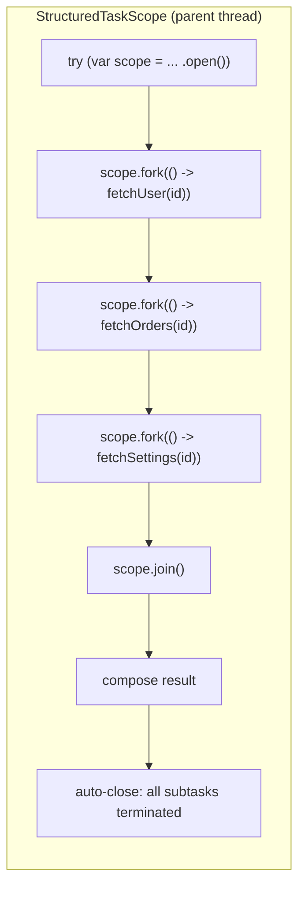
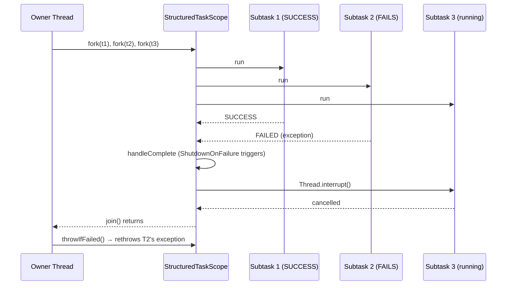

# Structured Concurrency in Java — StructuredTaskScope, ScopedValue, and the End of CompletableFuture Hell

**Date:** 2026-04-17 | **Updated:** 2026-04-24
**Tags:** `java` `concurrency` `structured-concurrency` `virtual-threads` `scopedvalue`

## Table of Contents

- [Summary](#summary)
- [The Problem Structured Concurrency Solves](#the-problem-structured-concurrency-solves)
- [Core Concept — Treat Subtasks as a Family](#core-concept--treat-subtasks-as-a-family)
- [StructuredTaskScope API](#structuredtaskscope-api)
  - [JDK 21 API (First Preview)](#jdk-21-api-first-preview)
  - [JDK 25+ API (`open()` / `Joiner`)](#jdk-25-api-open--joiner)
- [ShutdownOnFailure — All-or-Nothing Fan-Out](#shutdownonfailure--all-or-nothing-fan-out)
- [ShutdownOnSuccess — Race for the First Result](#shutdownonsuccess--race-for-the-first-result)
- [Custom Policies](#custom-policies)
- [Cancellation and Error Propagation](#cancellation-and-error-propagation)
- [ScopedValue — The Structured Replacement for ThreadLocal](#scopedvalue--the-structured-replacement-for-threadlocal)
- [Structured Concurrency + Virtual Threads](#structured-concurrency--virtual-threads)
- [Spring Boot Integration](#spring-boot-integration)
- [Migrating from CompletableFuture](#migrating-from-completablefuture)
- [Preview Status and Version Evolution](#preview-status-and-version-evolution)
- [Common Patterns](#common-patterns)
- [Anti-Patterns and Pitfalls](#anti-patterns-and-pitfalls)
- [Related](#related)
- [References](#references)

---

## Summary

Structured concurrency treats a group of related concurrent subtasks as a single unit of work with a clear lexical lifetime — the same way try-with-resources treats a resource. When you `fork` subtasks inside a `StructuredTaskScope`, they must all complete (or be cancelled) before control leaves the scope, and if one fails the scope can cancel its siblings automatically. Introduced as a preview in [JEP 453 (JDK 21)](https://openjdk.org/jeps/453) and iterated through [JEP 525 (JDK 26)](https://openjdk.org/jeps/525) with API refinements, it pairs with [virtual threads](virtual-threads.md) and [`ScopedValue`](https://openjdk.org/jeps/506) to deliver the Loom trifecta: cheap threads, bounded lifetimes, and immutable context propagation. For a TypeScript developer, it's the closest thing Java has to `Promise.all` / `Promise.race` with first-class cancellation and structured error handling. If you want the JavaScript side of that comparison, see [Structured Concurrency Before Project Loom](structured-concurrency-before-loom.md), which links the model back to `Promise.all`, `AbortController`, and other pre-structured patterns.

---

## The Problem Structured Concurrency Solves

Pre-Java 21, splitting a task into parallel subtasks meant one of these painful patterns:

```java
// Pattern 1: ExecutorService + Future — leaky, no cancellation propagation
ExecutorService exec = Executors.newFixedThreadPool(4);
Future<User> userF = exec.submit(() -> fetchUser(id));
Future<List<Order>> ordersF = exec.submit(() -> fetchOrders(id));

User user = userF.get();                    // what if this throws?
List<Order> orders = ordersF.get();         // the userF thread keeps running
// Did we remember to shut down the executor? Do siblings cancel on error?
```

```java
// Pattern 2: CompletableFuture — async-callback spaghetti
CompletableFuture<User> userCF = CompletableFuture.supplyAsync(() -> fetchUser(id));
CompletableFuture<List<Order>> ordersCF = CompletableFuture.supplyAsync(() -> fetchOrders(id));

CompletableFuture<Profile> profile = userCF.thenCombine(ordersCF, Profile::new)
    .exceptionally(ex -> { /* what about the still-running sibling? */ });
```

Both have the same fundamental defect: **the lifetime of the subtasks is decoupled from the enclosing method's lifetime.** A subtask can outlive its caller (leak), a failure in one doesn't automatically cancel siblings (wasted work), and the control flow is invisible from a stack trace.

Structured concurrency's insight — borrowed from [the Kotlin coroutines community](https://kotlinlang.org/docs/coroutines-basics.html) and [Nathaniel J. Smith's "Notes on structured concurrency"](https://vorpus.org/blog/notes-on-structured-concurrency-or-go-statement-considered-harmful/) — is that concurrent subtasks should nest lexically, just like function calls.

---

## Core Concept — Treat Subtasks as a Family



The rules enforced by the runtime:

1. **All subtasks run in child threads** spawned by the scope — typically virtual threads, so forking is cheap.
2. **The scope must be closed.** `try-with-resources` is non-negotiable; exiting the scope without calling `close()` throws `StructureViolationException`.
3. **`fork()` can only be called by the scope's owner thread** — no one else can silently add work to the scope.
4. **`join()` blocks the owner until all subtasks complete** or the shutdown policy triggers.
5. **If the owner is interrupted, the scope cancels its subtasks.**
6. **Subtasks inherit [`ScopedValue`](https://openjdk.org/jeps/506) bindings** from the enclosing scope (not `ThreadLocal` by default in newer APIs).

The net effect: the lifetime of every subtask is bounded by the scope's try-with-resources block. No leaks. No orphans. No "fire-and-forget that accidentally never finishes."

---

## StructuredTaskScope API

### JDK 21 API (First Preview)

This is the API you'll see in existing code and documentation. Available with `--enable-preview` in JDK 21:

```java
try (var scope = new StructuredTaskScope.ShutdownOnFailure()) {
    Subtask<User> userTask = scope.fork(() -> fetchUser(id));
    Subtask<List<Order>> ordersTask = scope.fork(() -> fetchOrders(id));

    scope.join()              // wait for all subtasks
         .throwIfFailed();    // propagate first failure

    return new Profile(userTask.get(), ordersTask.get());
}
```

Key members:

| Member | Purpose |
|--------|---------|
| `fork(Callable<T>)` | Submit a subtask; returns `Subtask<T>` handle |
| `join()` | Block owner thread until all subtasks terminate or shutdown triggers |
| `joinUntil(Instant)` | Same with deadline |
| `shutdown()` | Cancel remaining subtasks |
| `close()` | Called by try-with-resources; ensures cleanup |
| `Subtask.get()` | Retrieve result (throws if subtask failed or was cancelled) |
| `Subtask.state()` | `UNAVAILABLE`, `SUCCESS`, `FAILED` |
| `Subtask.exception()` | Throwable if the subtask failed |

### JDK 25+ API (`open()` / `Joiner`)

[JEP 505](https://openjdk.org/jeps/505) refines the API — `StructuredTaskScope` is no longer instantiated via public constructors. Instead, static factory methods open scopes with named policies:

```java
// JDK 25+ style
try (var scope = StructuredTaskScope.open(Joiner.<String>allSuccessfulOrThrow())) {
    scope.fork(() -> fetchUser(id));
    scope.fork(() -> fetchOrders(id));
    var results = scope.join();   // returns the joined result directly
    return combine(results);
}
```

Benefits:

- Clearer defaults (virtual threads, sensible timeouts)
- Composable `Joiner` types that encapsulate both the shutdown policy and the join-result shape
- Paves the way for first-class deadlines and richer result-aggregation patterns

For production code on JDK 21 today, use the original API. When you upgrade to JDK 25+, migrating is mechanical: replace `new StructuredTaskScope.Xxx()` with `StructuredTaskScope.open(Joiner.yyy())`.

---

## ShutdownOnFailure — All-or-Nothing Fan-Out

The most common policy: fan out several required subtasks, cancel everything if any one fails. Perfect for composing API responses from multiple upstream calls.

```java
public Profile loadProfile(String userId) throws InterruptedException {
    try (var scope = new StructuredTaskScope.ShutdownOnFailure()) {
        Subtask<User> userTask     = scope.fork(() -> userService.find(userId));
        Subtask<List<Order>> ordersTask = scope.fork(() -> orderService.findByUser(userId));
        Subtask<Settings> settingsTask  = scope.fork(() -> settingsService.find(userId));

        scope.join()
             .throwIfFailed(e -> new ServiceException("profile load failed", e));

        return new Profile(
            userTask.get(),
            ordersTask.get(),
            settingsTask.get()
        );
    }
}
```

Flow when `orderService.findByUser` throws:

1. The failing subtask transitions to `FAILED`.
2. The scope invokes `shutdown()`, which interrupts the still-running `userService.find` and `settingsService.find` subtasks.
3. `join()` returns as soon as the shutdown completes.
4. `throwIfFailed(...)` maps the first recorded exception into your domain exception and rethrows.

This is the [Oracle-documented canonical pattern](https://docs.oracle.com/en/java/javase/21/core/structured-concurrency.html) for "invoke all, fail fast." [`StructuredTaskScope.ShutdownOnFailure` javadoc](https://docs.oracle.com/en/java/javase/21/docs/api/java.base/java/util/concurrent/StructuredTaskScope.ShutdownOnFailure.html) covers the semantics in full.

---

## ShutdownOnSuccess — Race for the First Result

Fan out racing implementations and take the first success. Useful for querying redundant services, fallback hierarchies, or fastest-of-N reads:

```java
public Weather fetchWeather(String city) throws InterruptedException, ExecutionException {
    try (var scope = new StructuredTaskScope.ShutdownOnSuccess<Weather>()) {
        scope.fork(() -> providerA.get(city));
        scope.fork(() -> providerB.get(city));
        scope.fork(() -> providerC.get(city));

        return scope.join().result();   // first successful result wins; siblings cancelled
    }
}
```

`join().result()` returns the first subtask's successful value. If all subtasks fail, it throws `ExecutionException` wrapping the last failure.

When to reach for this:

- **Redundant upstream providers** — weather, geocoding, currency rates
- **Cache + origin race** — try the cache and the origin in parallel; take whichever returns first
- **Circuit-breaker fallbacks** — primary + secondary region, pick the healthy one

---

## Custom Policies

Beyond `ShutdownOnFailure` and `ShutdownOnSuccess`, you can subclass `StructuredTaskScope` directly for bespoke policies. Example: "succeed if at least 2 of N succeed":

```java
public class QuorumScope<T> extends StructuredTaskScope<T> {
    private final int required;
    private final List<T> results = new CopyOnWriteArrayList<>();

    public QuorumScope(int required) {
        super("quorum", Thread.ofVirtual().factory());
        this.required = required;
    }

    @Override
    protected void handleComplete(Subtask<? extends T> subtask) {
        if (subtask.state() == Subtask.State.SUCCESS) {
            results.add(subtask.get());
            if (results.size() >= required) shutdown();
        }
    }

    public List<T> results() { return results; }
}
```

The custom hook `handleComplete` runs as each subtask finishes. This is how you encode policies like "majority wins," "N-of-M completion," or "stream partial results as they arrive."

---

## Cancellation and Error Propagation

Structured concurrency uses **cooperative cancellation** through thread interruption, inheriting Java's standard mechanism:



Key rules:

- Subtasks should treat `InterruptedException` as "stop ASAP and clean up."
- `Thread.interrupted()` resets the interrupt flag — don't swallow it silently.
- `Thread.sleep`, blocking I/O, lock acquisition, and `BlockingQueue.take` all respond to interrupts.
- CPU-bound loops need to check `Thread.currentThread().isInterrupted()` manually.
- Owner thread interruption is propagated to all subtasks.

---

## ScopedValue — The Structured Replacement for ThreadLocal

[`ScopedValue`](https://openjdk.org/jeps/506), previewed in [JEP 446 (JDK 21)](https://openjdk.org/jeps/446) and delivered in [JEP 506 (JDK 25)](https://openjdk.org/jeps/506), is designed to pair with structured concurrency. It solves the same use case as `ThreadLocal` — passing context implicitly — but with structured semantics.

```java
public static final ScopedValue<User> CURRENT_USER = ScopedValue.newInstance();

public void handleRequest(Request req) {
    User user = authenticate(req);

    ScopedValue.where(CURRENT_USER, user).run(() -> {
        processRequest(req);   // CURRENT_USER.get() returns `user` here
    });
    // Outside the block, CURRENT_USER is unbound again.
}

// Deep in the call tree
public void audit(String action) {
    log.info("user {} did {}", CURRENT_USER.get(), action);
}
```

Comparison with `ThreadLocal`:

| Aspect | ThreadLocal | ScopedValue |
|--------|-------------|-------------|
| Mutability | Mutable — any thread can overwrite | Immutable within its scope |
| Lifetime | Until thread dies or `remove()` called | Bounded by the lexical block |
| Child-thread inheritance | `InheritableThreadLocal` (copy on spawn) | Automatic inheritance, zero-copy |
| Memory cost | Per-thread map entry forever unless removed | Released when the scope exits |
| Fits virtual threads | Leaks risk if not cleaned up | Designed for millions of threads |

Why it matters for virtual threads: with millions of virtual threads, a `ThreadLocal` leak scales into a serious memory problem. `ScopedValue` is structurally safe and integrates with `StructuredTaskScope` so child subtasks automatically see the parent's bindings.

---

## Structured Concurrency + Virtual Threads

Structured concurrency is the programming model that virtual threads enable. Together they form Project Loom's core story:

- **Virtual threads** make concurrent subtasks almost free.
- **Structured concurrency** constrains their lifetimes to prevent leaks.
- **`ScopedValue`** propagates context across them safely.

Without virtual threads, forking 100 subtasks was prohibitively expensive — each platform thread cost ~1 MB. Without structured concurrency, virtual threads were cheap but still leak-prone. The triad is designed to be used together.

A typical modern handler:

```java
public OrderDetail loadOrderDetail(String orderId) throws Exception {
    try (var scope = new StructuredTaskScope.ShutdownOnFailure()) {
        Subtask<Order> orderTask       = scope.fork(() -> orderRepo.find(orderId));
        Subtask<Customer> custTask      = scope.fork(() -> customerRepo.find(orderId));
        Subtask<List<Item>> itemsTask   = scope.fork(() -> itemRepo.findByOrder(orderId));
        Subtask<ShipStatus> shipTask    = scope.fork(() -> shippingApi.getStatus(orderId));

        scope.join().throwIfFailed();

        return OrderDetail.combine(
            orderTask.get(), custTask.get(), itemsTask.get(), shipTask.get()
        );
    }
}
```

This runs on a single virtual thread in the controller. The four subtasks run on four more virtual threads. All five unmount whenever they block on I/O, so the OS-thread footprint stays tiny. Four parallel fetches means the endpoint latency is max(all) instead of sum(all).

---

## Spring Boot Integration

Spring Boot 3.2+ has no *special* structured-concurrency support yet — because there's nothing to do. Structured concurrency is a standard JDK API:

1. Use Java 21+.
2. Enable preview features: `--enable-preview` in your `build.gradle` or `pom.xml` until structured concurrency goes final.
3. Optionally enable virtual threads: `spring.threads.virtual.enabled=true` (see [Task Execution and Scheduling — Spring Boot Reference](https://docs.spring.io/spring-boot/reference/features/task-execution-and-scheduling.html)).
4. Import `StructuredTaskScope` and use it directly in your services.

Gradle preview config:

```groovy
tasks.withType(JavaCompile).configureEach {
    options.compilerArgs += ['--enable-preview']
}
tasks.withType(Test).configureEach {
    jvmArgs += ['--enable-preview']
}
tasks.named('bootRun').configure {
    jvmArgs += ['--enable-preview']
}
```

Because virtual threads are the default carrier for `StructuredTaskScope` subtasks, you get the scalability benefits for free — no executor to configure, no pool to size.

---

## Migrating from CompletableFuture

The most common migration path is replacing fan-out-then-combine `CompletableFuture` code:

Before:

```java
CompletableFuture<User> userCF = CompletableFuture.supplyAsync(() -> fetchUser(id), exec);
CompletableFuture<List<Order>> ordersCF = CompletableFuture.supplyAsync(() -> fetchOrders(id), exec);

try {
    CompletableFuture.allOf(userCF, ordersCF).join();
    return new Profile(userCF.get(), ordersCF.get());
} catch (CompletionException e) {
    // Sibling that finished successfully is already wasted work
    throw new ServiceException("profile load failed", e.getCause());
}
```

After:

```java
try (var scope = new StructuredTaskScope.ShutdownOnFailure()) {
    Subtask<User> userTask = scope.fork(() -> fetchUser(id));
    Subtask<List<Order>> ordersTask = scope.fork(() -> fetchOrders(id));

    scope.join().throwIfFailed(e -> new ServiceException("profile load failed", e));

    return new Profile(userTask.get(), ordersTask.get());
}
```

Wins:

- **Readability** — the control flow is imperative, top to bottom. No callback chains.
- **Correctness** — a failure in either subtask cancels the other.
- **Resource safety** — no leaked executor, no stranded subtasks.
- **Stack traces** — they actually reflect the call path.
- **Checked exceptions** — you can throw checked exceptions from `Callable`, unlike `supplyAsync`.

When to **keep** `CompletableFuture`:

- Reactive pipelines where chaining (`thenApply`, `thenCompose`) models your logic naturally.
- Dynamic fan-out where each subtask spawns more subtasks based on its own result.
- Code that must remain non-blocking on specific threads (e.g., reactive event loops).

OpenJDK has been explicit: [structured concurrency does not replace `CompletableFuture`](https://www.javacodegeeks.com/2026/03/structured-concurrency-in-java-why-its-better-than-completablefuture-and-what-it-still-cant-do.html). The two tools serve overlapping but distinct needs.

---

## Preview Status and Version Evolution

Structured concurrency is still a **preview feature** as of 2026. API changes are likely between releases. The progression:

| Release | JEP | Status | Notable Change |
|---------|-----|--------|----------------|
| JDK 19 | JEP 428 | Incubating | Initial incubation in `jdk.incubator.concurrent` |
| JDK 20 | JEP 437 | Incubating (2nd) | — |
| JDK 21 | JEP 453 | Preview (1st) | Moved to `java.util.concurrent`; `fork` returns `Subtask` |
| JDK 22 | JEP 462 | Preview (2nd) | Minor refinements |
| JDK 23 | JEP 480 | Preview (3rd) | — |
| JDK 24 | JEP 499 | Preview (4th) | — |
| JDK 25 | JEP 505 | Preview (5th) | `open()` factory methods replace constructors; `Joiner` types |
| JDK 26 | JEP 525 | Preview (6th) | Latest preview as of 2026 |

Practical guidance:

- **Spring Boot production on JDK 21:** use the JEP 453 API with `--enable-preview`. Be prepared for small migrations.
- **Spring Boot production on JDK 25+:** use the JEP 505 `open()`/`Joiner` API.
- **Don't wait for GA to start learning.** The mental model (lexical scopes, fork/join-as-unit, fail-fast cancellation) is what matters — the API will stabilize around those concepts.

---

## Common Patterns

**1. Fan-out, aggregate (ShutdownOnFailure):**

```java
try (var scope = new StructuredTaskScope.ShutdownOnFailure()) {
    var results = services.stream()
        .map(s -> scope.fork(() -> s.fetch(id)))
        .toList();
    scope.join().throwIfFailed();
    return results.stream().map(Subtask::get).toList();
}
```

**2. Race (ShutdownOnSuccess):**

```java
try (var scope = new StructuredTaskScope.ShutdownOnSuccess<Response>()) {
    replicas.forEach(replica -> scope.fork(() -> replica.query(req)));
    return scope.join().result();
}
```

**3. Deadline-bounded work:**

```java
try (var scope = new StructuredTaskScope.ShutdownOnFailure()) {
    var task = scope.fork(() -> slowService.call());
    scope.joinUntil(Instant.now().plusSeconds(2));  // throws TimeoutException if not done
    scope.throwIfFailed();
    return task.get();
}
```

**4. Nested scopes for hierarchical fan-out:**

```java
try (var outer = new StructuredTaskScope.ShutdownOnFailure()) {
    var a = outer.fork(() -> {
        try (var inner = new StructuredTaskScope.ShutdownOnFailure()) {
            var x = inner.fork(() -> fetchX());
            var y = inner.fork(() -> fetchY());
            inner.join().throwIfFailed();
            return combine(x.get(), y.get());
        }
    });
    var b = outer.fork(() -> fetchB());
    outer.join().throwIfFailed();
    return merge(a.get(), b.get());
}
```

**5. Inheriting `ScopedValue` context through the scope:**

```java
ScopedValue.where(REQUEST_ID, UUID.randomUUID().toString()).run(() -> {
    try (var scope = new StructuredTaskScope.ShutdownOnFailure()) {
        scope.fork(() -> { log.info("fetching user, req={}", REQUEST_ID.get()); return fetchUser(); });
        scope.fork(() -> { log.info("fetching orders, req={}", REQUEST_ID.get()); return fetchOrders(); });
        scope.join().throwIfFailed();
        // ...
    }
});
```

The subtasks see the parent's `REQUEST_ID` binding automatically.

---

## Anti-Patterns and Pitfalls

| Anti-pattern | Why it's bad | Fix |
|--------------|--------------|-----|
| Forgetting try-with-resources | `close()` is not called; compiler warns but allows it if you suppress | Always use `try (var scope = ...)` |
| Calling `fork()` from a non-owner thread | Throws `WrongThreadException` at runtime | Only the thread that opened the scope may fork |
| Calling `Subtask.get()` before `join()` | Throws `IllegalStateException` (result isn't ready) | Always `join()` first |
| Swallowing `InterruptedException` in a subtask | Cancellation stops working | Let it propagate or at least `Thread.currentThread().interrupt()` |
| Holding a long-running lock inside a subtask (JDK 21–23) | Pins the carrier — see [virtual threads pinning](virtual-threads.md#the-pinning-problem) | Use `ReentrantLock`, or upgrade to JDK 24+ |
| Infinite CPU loop without `isInterrupted()` check | Scope can't cancel it | Insert `if (Thread.currentThread().isInterrupted()) throw new InterruptedException();` |
| Returning the `Subtask` itself instead of `.get()` | Caller sees a handle to an already-closed scope → `IllegalStateException` | Extract the value before the try block exits |
| Using `ThreadLocal` for request-scoped data | Does not propagate correctly and leaks in virtual-thread pools | Use `ScopedValue` |
| Creating scopes inside a tight loop with blocking join | Defeats parallelism — each scope runs sequentially | Fork everything inside ONE scope, then join once |

---

## Related

- [Virtual Threads in Java — Project Loom](virtual-threads.md) — the runtime primitive structured concurrency is designed for
- [Concurrency Basics](concurrency-basics.md) — threads, `ExecutorService`, `CompletableFuture` — the predecessor tools being replaced
- [Modern Java Features](modern-java-features.md) — records, pattern matching, and other Java 21 features that pair well with structured concurrency
- [Exceptions and Error Handling](exceptions-and-error-handling.md) — `InterruptedException` and cancellation semantics
- [Async Processing in Spring](../events-async/async-processing.md) — `@Async` and how it relates to structured concurrency
- [Reactive Programming in Java](../reactive-programming-java.md) — the non-blocking alternative model
- [Worker Threads & Concurrency](../../typescript/runtime/worker-threads.md) — Node's explicit parallelism model when `Promise` alone is not enough.

## References

- [JEP 453: Structured Concurrency (Preview)](https://openjdk.org/jeps/453) — first preview in JDK 21; the canonical starting point for existing code examples
- [JEP 505: Structured Concurrency (Fifth Preview)](https://openjdk.org/jeps/505) — JDK 25 refinement introducing `open()` factories and `Joiner` types
- [JEP 525: Structured Concurrency (Sixth Preview)](https://openjdk.org/jeps/525) — latest preview as of this writing
- [Structured Concurrency — Oracle Java 21 Core Libraries Guide](https://docs.oracle.com/en/java/javase/21/core/structured-concurrency.html) — official walkthrough with full examples
- [StructuredTaskScope Javadoc (JDK 21)](https://docs.oracle.com/en/java/javase/21/docs/api/java.base/java/util/concurrent/StructuredTaskScope.html) — complete API reference
- [StructuredTaskScope.ShutdownOnFailure Javadoc](https://docs.oracle.com/en/java/javase/21/docs/api/java.base/java/util/concurrent/StructuredTaskScope.ShutdownOnFailure.html) — built-in fail-fast policy
- [JEP 446: Scoped Values (Preview)](https://openjdk.org/jeps/446) — initial `ScopedValue` preview
- [JEP 506: Scoped Values](https://openjdk.org/jeps/506) — final spec for the `ThreadLocal` replacement
- [Notes on structured concurrency — Nathaniel J. Smith](https://vorpus.org/blog/notes-on-structured-concurrency-or-go-statement-considered-harmful/) — the foundational blog post that inspired the industry shift
- [Structured Concurrency and Scoped Values — SoftwareMill](https://softwaremill.com/structured-concurrency-and-scoped-values-in-java/) — practical walkthrough with realistic examples
- [Structured Concurrency in Java — Baeldung](https://www.baeldung.com/java-structured-concurrency) — tutorial-style introduction
