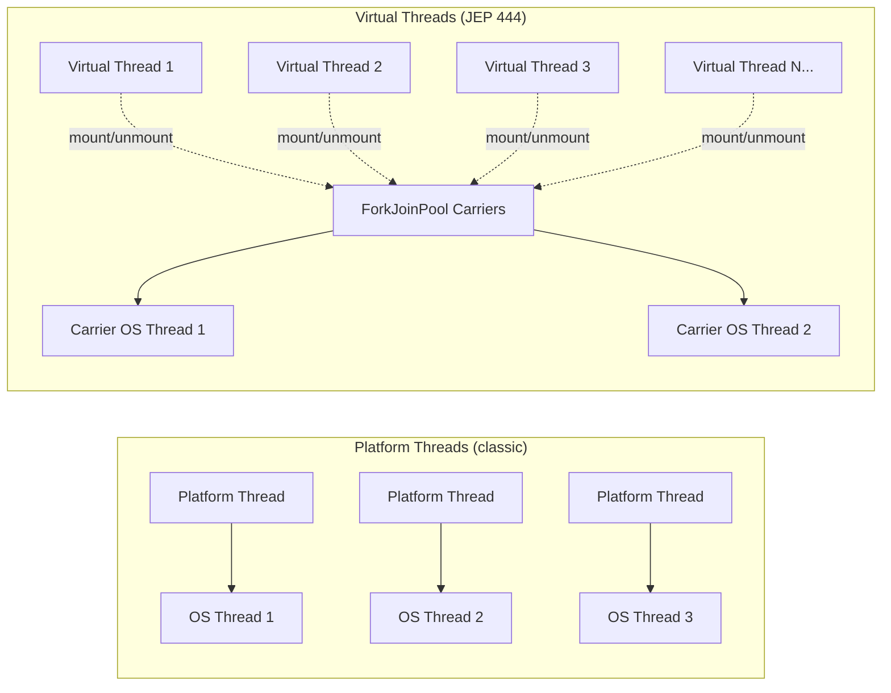
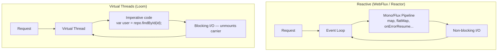
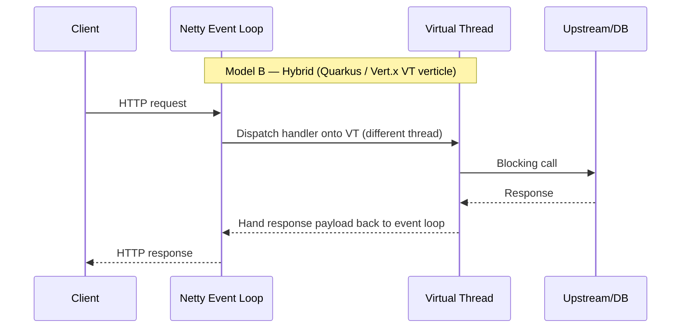

# Virtual Threads in Java — Project Loom, JEP 444, and the Return of Thread-per-Request

**Date:** 2026-04-17 | **Updated:** 2026-04-27
**Tags:** `java` `concurrency` `virtual-threads` `project-loom` `spring-boot`

## Table of Contents

- [Virtual Threads in Java — Project Loom, JEP 444, and the Return of Thread-per-Request](#virtual-threads-in-java--project-loom-jep-444-and-the-return-of-thread-per-request)
  - [Table of Contents](#table-of-contents)
  - [Summary](#summary)
  - [The Problem Virtual Threads Solve](#the-problem-virtual-threads-solve)
  - [Platform Threads vs Virtual Threads](#platform-threads-vs-virtual-threads)
  - [How Virtual Threads Work Internally](#how-virtual-threads-work-internally)
    - [Carrier Threads](#carrier-threads)
    - [Continuations](#continuations)
    - [Mount and Unmount](#mount-and-unmount)
  - [Creating and Using Virtual Threads](#creating-and-using-virtual-threads)
    - [Direct Creation](#direct-creation)
    - [ExecutorService](#executorservice)
    - [Thread Builder](#thread-builder)
  - [The Pinning Problem](#the-pinning-problem)
    - [What Causes Pinning](#what-causes-pinning)
    - [Detecting Pinning](#detecting-pinning)
    - [The ReentrantLock Fix](#the-reentrantlock-fix)
  - [JEP 491: Synchronize Without Pinning (Java 24)](#jep-491-synchronize-without-pinning-java-24)
  - [Spring Boot Integration](#spring-boot-integration)
  - [Virtual Threads vs Reactive WebFlux](#virtual-threads-vs-reactive-webflux)
    - [Loom on Netty: Deep Dive](#loom-on-netty-deep-dive)
  - [Structured Concurrency](#structured-concurrency)
  - [Common Pitfalls](#common-pitfalls)
  - [When to Use Virtual Threads](#when-to-use-virtual-threads)
  - [Migration Path for an Existing Spring MVC App](#migration-path-for-an-existing-spring-mvc-app)
  - [Related](#related)
  - [References](#references)

---

## Summary

Virtual threads, delivered as a full feature in [JEP 444 (Java 21)](https://openjdk.org/jeps/444), are lightweight threads managed by the JVM rather than the operating system. They let you write simple thread-per-request blocking code at the scale — millions of concurrent tasks — that previously forced you into asynchronous, callback-heavy, or reactive styles. For a TypeScript developer, the easiest way to frame virtual threads is as "Node's event-loop scalability for I/O, but you keep writing synchronous imperative code." For existing Spring MVC apps on Java 21+, flipping a single config flag (`spring.threads.virtual.enabled=true`) is often enough to switch the server and task executors to virtual threads, trading a little complexity for large throughput gains.

---

## The Problem Virtual Threads Solve

Before Java 21, a Java server had three realistic concurrency models, each with a painful trade-off:

| Model | Scales to | Programming model | Cost |
|-------|-----------|-------------------|------|
| **Thread-per-request** (Tomcat, classic Spring MVC) | ~500 concurrent requests per box | Simple, blocking, imperative | OS thread is ~1 MB stack + kernel context — runs out fast |
| **Async / `CompletableFuture`** | 100K+ | Callback chains, harder to debug | Stack traces fragmented, easy to leak |
| **Reactive** (WebFlux, Project Reactor) | 100K+ | `Mono`/`Flux` pipelines | Steep learning curve, harder debugging, viral type changes |

A platform thread in Java maps 1:1 to an OS thread. Each OS thread reserves a large fixed stack (typically 1 MB on Linux), plus kernel-level bookkeeping. On a 16 GB machine you can realistically run a few thousand before context-switching costs dominate. That ceiling is why thread-per-request worked for early-2000s workloads but falls over for modern, I/O-bound, high-concurrency services where most threads are blocked on network or database calls anyway.

[Virtual threads](https://docs.oracle.com/en/java/javase/21/core/virtual-threads.html) break this ceiling. They are scheduled by the JVM onto a small pool of carrier OS threads. When a virtual thread blocks on I/O, the JVM unmounts it from its carrier so the OS thread is free to run another virtual thread. Memory per virtual thread is a few hundred bytes to a few KB, not 1 MB. You can run a million on a laptop.

The trade-off the language designers made: **keep the familiar `Thread` API and blocking imperative code; change the runtime, not the programming model.**

---

## Platform Threads vs Virtual Threads



| Aspect | Platform Thread | Virtual Thread |
|--------|-----------------|----------------|
| Backed by | One OS thread (1:1) | Shared pool of carrier OS threads (M:N) |
| Stack size | ~1 MB fixed | Grows dynamically, starts at a few hundred bytes |
| Creation cost | Expensive (OS syscall) | Cheap (Java object allocation) |
| Scheduled by | OS kernel | JVM (ForkJoinPool) |
| Daemon | Optional | Always daemon — cannot be non-daemon |
| Priority | `Thread.setPriority` honored | `NORM_PRIORITY` fixed, `setPriority` is a no-op |
| Good for | CPU-bound work, long-running tasks | I/O-bound work, massive concurrency |
| API | `Thread` constructors, `Executors.newFixedThreadPool(n)` | `Thread.ofVirtual()`, `Executors.newVirtualThreadPerTaskExecutor()` |

Critically: **virtual threads are instances of `java.lang.Thread`.** Existing code that accepts a `Runnable` or interacts with a `Thread` works unchanged. `ThreadLocal` works. Stack traces look normal. The API surface was preserved on purpose.

---

## How Virtual Threads Work Internally

### Carrier Threads

The JVM maintains a [`ForkJoinPool`](https://docs.oracle.com/en/java/javase/21/docs/api/java.base/java/util/concurrent/ForkJoinPool.html) of platform threads called **carriers**. By default the pool size matches `Runtime.getRuntime().availableProcessors()`. Virtual threads are scheduled onto these carriers. You can tune the pool size with the system property `-Djdk.virtualThreadScheduler.parallelism=N`.

### Continuations

A virtual thread's execution state (the call stack at any point in time) is wrapped in a `Continuation` — an internal construct that can be paused and resumed. When a virtual thread hits a blocking I/O call, the JVM captures its continuation, stores it on the heap, and releases the carrier thread so it can run another virtual thread. When the I/O completes, the continuation is resumed on (potentially) a different carrier.

### Mount and Unmount

- **Mount**: A virtual thread attaches to a carrier and runs its code on it.
- **Unmount**: The virtual thread detaches from its carrier (usually because it blocks on I/O). Its stack is copied to the heap; the carrier is free.
- **Remount**: When the blocking operation completes, the scheduler picks a free carrier and restores the stack.

The entire cycle is invisible to user code. `Thread.sleep(1000)`, `InputStream.read()`, `Socket.accept()` — all these "blocking" calls now yield cooperatively to the scheduler when invoked on a virtual thread. From the programmer's view the thread appears to block; from the carrier's view the OS thread is never idle.

---

## Creating and Using Virtual Threads

### Direct Creation

```java
// Start a virtual thread immediately
Thread t = Thread.startVirtualThread(() -> {
    System.out.println("Hello from " + Thread.currentThread());
});
t.join();
```

Output shows something like `VirtualThread[#23]/runnable@ForkJoinPool-1-worker-3`.

### ExecutorService

The recommended idiom for production code — treat each task as its own virtual thread, no pool sizing:

```java
try (ExecutorService executor = Executors.newVirtualThreadPerTaskExecutor()) {
    for (int i = 0; i < 10_000; i++) {
        int taskId = i;
        executor.submit(() -> {
            Thread.sleep(1000);          // cheap — unmounts the carrier
            return "done-" + taskId;
        });
    }
}  // try-with-resources auto-closes; awaits completion
```

Because virtual threads are cheap, you submit one per task rather than sharing a fixed pool. Pooling virtual threads is an anti-pattern — the pool becomes the bottleneck you were trying to remove.

### Thread Builder

For full control (naming, inheritability, scheduling):

```java
Thread.Builder builder = Thread.ofVirtual()
    .name("worker-", 0)                       // worker-0, worker-1, ...
    .uncaughtExceptionHandler((t, ex) -> log.error("failed on {}", t.getName(), ex));

Thread t1 = builder.start(() -> doWork());
Thread t2 = builder.unstarted(() -> doMoreWork());  // start later
```

For platform threads, use `Thread.ofPlatform()` instead. The dual-builder API makes the kind of thread explicit at the call site.

---

## The Pinning Problem

Virtual threads only deliver their benefit when they can unmount. If a virtual thread blocks in a way the JVM cannot unmount, it gets **pinned** to its carrier — the carrier OS thread is stuck until the virtual thread resumes, and you lose the scalability you came for.

### What Causes Pinning

Prior to Java 24, two situations pinned a virtual thread:

1. **Blocking inside a `synchronized` block or method.** The synchronized monitor uses native OS-level lock primitives, and the JVM cannot safely unmount a thread that holds one.
2. **Calling into native code (JNI / FFM).** Native frames sit on the OS stack and cannot be moved to the heap.

A classic trap: legacy libraries (logging, SQL drivers, connection pools) often use `synchronized` internally. Calling them from a virtual thread can silently pin it.

```java
// DANGER on Java 21–23: this pins the virtual thread during the blocking I/O
public synchronized String fetchFromRemote() {
    return httpClient.send(request).body();   // blocks → pinned
}
```

### Detecting Pinning

Add the JVM flag `-Djdk.tracePinnedThreads=full` (verbose) or `=short` to log pinning events with stack traces. [Netflix's engineering post on pinning](https://netflixtechblog.com/java-21-virtual-threads-dude-wheres-my-lock-3052540e231d) is the canonical guide to diagnosing real-world occurrences — their case involved a deadlock where one carrier thread got pinned and blocked all remaining virtual thread progress.

For production monitoring, JDK Flight Recorder (JFR) emits `jdk.VirtualThreadPinned` events when pinning happens.

### The ReentrantLock Fix

On Java 21–23, the recommended fix is to replace `synchronized` with [`java.util.concurrent.locks.ReentrantLock`](https://docs.oracle.com/en/java/javase/21/docs/api/java.base/java/util/concurrent/locks/ReentrantLock.html). `ReentrantLock` is implemented at the JVM level without native monitors, so the JVM can still unmount a virtual thread that holds the lock:

```java
private final ReentrantLock lock = new ReentrantLock();

public String fetchFromRemote() {
    lock.lock();
    try {
        return httpClient.send(request).body();   // blocks → unmounts cleanly
    } finally {
        lock.unlock();
    }
}
```

Rule of thumb for Java 21–23: in any code that runs on virtual threads and performs I/O inside a critical section, prefer `ReentrantLock` over `synchronized`.

---

## JEP 491: Synchronize Without Pinning (Java 24)

[JEP 491](https://openjdk.org/jeps/491), delivered in Java 24, eliminates most pinning caused by `synchronized`. The JVM now tracks monitor ownership off-heap and can unmount virtual threads holding monitors. After migrating to Java 24+, the `synchronized`-vs-`ReentrantLock` debate for virtual thread code largely goes away — you can use whichever reads more naturally.

Native-code pinning (JNI frames) still exists. It's rarer in idiomatic Java code but remains a consideration for apps using FFM (Foreign Function & Memory) or native bridges.

---

## Spring Boot Integration

Spring Boot 3.2+ adds first-class support. One property:

```yaml
spring:
  threads:
    virtual:
      enabled: true
```

When enabled on Java 21+:

- **Embedded Tomcat and Jetty** handle each HTTP request on a virtual thread.
- **`SimpleAsyncTaskExecutor`** (the auto-configured executor for `@Async`) uses virtual threads.
- **`SimpleAsyncTaskScheduler`** (for `@Scheduled`) uses virtual threads.
- **`TaskExecutionAutoConfiguration`** and **`TaskSchedulingAutoConfiguration`** wire the virtual-thread-aware builders.

See the [Spring Boot Task Execution and Scheduling reference](https://docs.spring.io/spring-boot/reference/features/task-execution-and-scheduling.html) for the complete picture.

What this does NOT automatically fix:

- **JDBC drivers and connection pools** that use `synchronized` internally — on Java 21–23, check whether your driver (Postgres, MySQL, MongoDB sync driver) pins virtual threads. Most modern drivers are virtual-thread-aware by 2025.
- **Your own code.** Audit any `synchronized` critical section that does I/O and migrate to `ReentrantLock` on Java 21–23.
- **WebFlux endpoints.** Spring Boot uses Reactor Netty by default for WebFlux, but WebFlux itself is not limited to Netty. In standard Spring Boot setups, virtual-thread mode and reactive request handling are alternative defaults, not both active for the same request pipeline. See the comparison below.

---

## Virtual Threads vs Reactive WebFlux

This is the decision point for this project. Both solve the same core problem — high-concurrency I/O — with different models.



| Aspect | Virtual Threads | Reactive WebFlux |
|--------|-----------------|------------------|
| **Programming model** | Imperative, blocking — write linear code | Functional pipelines, non-blocking |
| **Debugging** | Normal stack traces | Fragmented; Reactor adds `onAssembly` helpers to improve |
| **Backpressure** | None built-in — rely on bounded input | First-class via Reactive Streams |
| **Learning curve** | Trivial for any Java dev | Steep; different mental model |
| **Library support** | Works with blocking JDBC, sync Mongo driver, etc. | Requires reactive drivers (R2DBC, reactive Mongo) |
| **Streaming (SSE, WebSockets)** | Possible but awkward | Natural fit |
| **Max concurrency** | Millions | Millions |
| **CPU-bound work** | Fine (uses platform thread under the hood) | Must offload via `publishOn(Schedulers.parallel())` |

**Rule of thumb (2026):**

- **Existing Spring MVC on Java 21+:** turn on virtual threads. It's a config flag; performance is comparable to reactive in most scenarios.
- **Existing WebFlux:** keep it. It's not worse than virtual threads; it has real advantages for streaming, backpressure, and complex event pipelines. Mass migration isn't worth the churn.
- **New service, mostly CRUD + REST:** Spring MVC + virtual threads. Simpler code, easier hiring pool.
- **New service, streaming / WebSockets / complex async orchestration:** WebFlux. Its abstractions are worth the learning curve.

Benchmark evidence from [Chris Gleissner's loom-webflux comparisons](https://github.com/chrisgleissner/loom-webflux-benchmarks) shows virtual threads on Netty leading in ~45% of scenarios and Reactor leading in ~30%. The rest are roughly tied. That percentage split comes from the **Netty-only comparison** (`loom-netty` vs `webflux-netty`); the full benchmark matrix also includes `loom-tomcat` (and often `platform-tomcat`). Performance is rarely the deciding factor — code style, team skill, and ecosystem match are.

### Loom on Netty: Deep Dive

The reason you mostly see Loom paired with Tomcat is that Spring Boot's `spring.threads.virtual.enabled=true` flag wires virtual threads into the **servlet container** (Tomcat by default, Jetty optionally) — there is no built-in Spring Boot mode that combines a Netty server with virtual-thread request handling for Spring MVC. The servlet stack was a natural fit: requests already block on a per-request thread, so swapping that platform thread for a virtual thread is a one-line change. Netty, by contrast, was designed around non-blocking event loops, and "blocking on Netty" sounds like an oxymoron at first. Loom-on-Netty exists, but it lives outside the default Spring Boot path — in frameworks that built it deliberately.

There are three distinct architectural models that all get called "Loom on Netty," and they are not interchangeable:

| Model | What runs on virtual threads | Who owns sockets | Examples |
|-------|------------------------------|------------------|----------|
| **A. Replace Netty entirely** | Everything — accept, read, parse, handle | A from-scratch blocking server (no Netty at all) | [Helidon 4 / Níma](https://medium.com/helidon/helidon-n%C3%ADma-helidon-on-virtual-threads-130bb2ea2088) |
| **B. Hybrid: Netty I/O + VT handlers** | Application handler / controller logic | Netty event loops (unchanged) | [Quarkus `@RunOnVirtualThread`](https://quarkus.io/guides/virtual-threads), [Vert.x `ThreadingModel.VIRTUAL_THREAD`](https://vertx.io/docs/vertx-core/java/) |
| **C. Loom carrier on event loop** | Virtual threads are scheduled directly onto Netty event-loop threads (instead of the default JDK ForkJoinPool) | Netty event loops, doubling as VT carriers | [Micronaut 4.9 experimental loom-carrier](https://micronaut.io/2025/06/30/transitioning-to-virtual-threads-using-the-micronaut-loom-carrier/) |

```mermaid
flowchart TB
  subgraph A["A. Replace Netty (Helidon 4 / Níma)"]
    A1[Client] --> A2[Blocking listener]
    A2 --> A3["Virtual thread per request<br/>(no Netty, no event loop)"]
    A3 --> A4[Blocking I/O — unmounts]
  end
  subgraph B["B. Hybrid (Quarkus, Vert.x VT verticle)"]
    B1[Client] --> B2[Netty event loop]
    B2 --> B3["@RunOnVirtualThread<br/>handler dispatch"]
    B3 --> B4[Virtual thread]
    B4 --> B5[Blocking I/O — unmounts]
  end
  subgraph C["C. Carrier-on-event-loop (Micronaut 4.9 experimental)"]
    C1[Client] --> C2[Netty event loop]
    C2 -.serves as carrier.-> C3[Virtual thread]
    C3 --> C4[Blocking I/O — unmounts<br/>back to event loop]
  end
```



**Model A — Helidon 4 / Níma: replace Netty.** Helidon 3 was a Netty-based reactive stack. For Helidon 4 (October 2023), Oracle [rewrote the web server from scratch](https://medium.com/helidon/helidon-4-is-released-a06756e1562a) on a thread-per-request virtual-thread model and dropped Netty. Their stated motivation: once virtual threads exist, the engineering complexity of running Netty pipelines plus reactive operators stops paying for itself. Helidon 4 mandates Java 21+. Performance reportedly matches the Netty-based predecessor. This is the purest "Loom server" — no event loop at all — and it is the canonical evidence that you can match Netty's throughput without Netty.

**Model B — Quarkus and Vert.x: Netty I/O, virtual-thread handlers.** This is the most common production pattern that genuinely runs on Netty. Quarkus is built on a [reactive engine of Netty + Eclipse Vert.x](https://quarkus.io/guides/virtual-threads). The Netty event loops still own all socket I/O. When you annotate a JAX-RS handler with `@RunOnVirtualThread`, Quarkus dispatches that handler off the event loop onto a fresh virtual thread:

```java
@GET
@Path("/profile/{id}")
@RunOnVirtualThread
public Profile profile(@PathParam("id") long id) {
    var user = userRepo.findById(id);          // blocking JDBC — fine on a VT
    var orders = orderRepo.findByUser(id);     // also blocking
    return new Profile(user, orders);
}
```

Vert.x 4.5+ exposes the same idea as a verticle threading model — `new DeploymentOptions().setThreadingModel(ThreadingModel.VIRTUAL_THREAD)` — and adds `Future.await()` so a virtual-thread verticle can call Vert.x async APIs in straight-line synchronous style. The contract in both frameworks is identical: never block on the event-loop thread, but the application code on the virtual thread can block freely.

**Model C — Micronaut 4.9 loom-carrier: virtual threads scheduled by Netty itself.** Released [June 2025 as experimental](https://micronaut.io/2025/06/30/transitioning-to-virtual-threads-using-the-micronaut-loom-carrier/), this is the most aggressive integration. Instead of the default JVM scheduler (a `ForkJoinPool` of carrier threads), Micronaut uses internal JDK APIs to make Netty's event-loop threads themselves act as virtual-thread carriers. The result: when a virtual thread parks on I/O, the same Netty event loop that was carrying it can immediately go back to dispatching its socket events; when the I/O completes, the same event loop resumes the virtual thread. Micronaut reports latency and CPU cost close to its async path and "far better than Loom with FJP" — at the cost of lower peak request rate compared to pure async Netty. Configuration lives under `micronaut.netty.loom-carrier` with knobs like `timeSliceLatency`, `taskFifoThreshold`, and `workSpillThreshold`; the docs explicitly warn these are subject to change in patch releases.



Why these models exist at all (the throughput intuition):

- Netty's event-loop thread is precious — it must never block. Anything that blocks must be offloaded.
- The classic offload target was a fixed worker pool (`executeBlocking`, `@Blocking`) — bounded, prone to queueing.
- Virtual threads make offload essentially free. The hybrid model swaps a finite worker pool for an effectively unlimited virtual-thread executor.
- Model C goes further: it removes the offload itself. The event loop and the carrier are the same OS thread, so handoff overhead disappears.

Operational guardrails for any Loom+Netty setup:

- **Never block on the event loop.** This was already true for Netty. Virtual threads do not relax it. A blocking call on the event-loop thread still freezes that loop's connections.
- **Audit `ThreadLocal` use.** Netty's `FastThreadLocal` and many older filters were designed for a small, stable set of carrier threads. With one virtual thread per request, naive `ThreadLocal` use [allocates per virtual thread](https://github.com/netty/netty/issues/15449) and balloons memory. Migrate hot-path context to [`ScopedValue`](modern-java-features.md) or framework-managed context propagation.
- **Tune both schedulers together.** Event-loop pool sizing (`io.netty.eventLoopThreads`, framework equivalents) and virtual-thread carrier parallelism (`jdk.virtualThreadScheduler.parallelism`) are no longer independent — especially in Model C where they are the same threads.
- **Watch tail latency, not averages.** P99/P99.9 are the only numbers that catch event-loop blocking, pinning, and carrier saturation under spikes.
- **Outbound HTTP and JDBC pool sizes still matter.** Too-small pools cap throughput regardless of how cheap virtual threads are.

How to interpret the loom-vs-webflux 45% vs 30% benchmark result correctly:

- The split is from [`loom-webflux-benchmarks`](https://github.com/chrisgleissner/loom-webflux-benchmarks) and reflects scenario wins, not a universal verdict.
- The ~45% vs ~30% number specifically compares **`loom-netty` vs `webflux-netty`** — the dedicated Loom-on-Netty research configuration, not stock Spring Boot. The full benchmark matrix also includes `loom-tomcat` and `platform-tomcat`.
- Scenarios that simulate upstream I/O wait favor virtual threads; CPU-bound or very small endpoints can flip the result.
- This benchmark is a research artifact. Spring Boot's default supported pairings remain MVC+Tomcat (with virtual threads as a flag) and WebFlux+Netty (reactive). "Spring Boot MVC on Netty with virtual threads" is not a default option.

Decision rule, distilled:

- New Java service, blocking-style code preferred → **Helidon 4 / Níma** (pure Loom, no Netty) or **Spring Boot MVC + virtual threads on Tomcat** (most familiar).
- Already on Quarkus → **Quarkus `@RunOnVirtualThread`** (Model B).
- Already on Vert.x → **`ThreadingModel.VIRTUAL_THREAD` verticles** (Model B).
- Already on Micronaut and willing to run experimental → **loom-carrier mode** (Model C).
- Streaming, WebSockets, or heavy backpressure-sensitive pipelines → **WebFlux + Netty** stays the right tool; Loom does not replace Reactive Streams semantics.

See also [this project's WebFlux reactive guide](../../reactive-programming-java.md) for the alternative model.

---

## Structured Concurrency

Virtual threads pair naturally with [structured concurrency](https://docs.oracle.com/en/java/javase/21/core/structured-concurrency.html), currently previewing via [JEP 453 (Java 21)](https://openjdk.org/jeps/453) and iterating through JEP 462 / 480 / 499 / 505 / 525 / 533 in subsequent releases. The core idea: treat concurrent subtasks as a single unit of work with a lexical lifetime, much like try-with-resources does for resources.

```java
try (var scope = new StructuredTaskScope.ShutdownOnFailure()) {
    Subtask<User> userTask = scope.fork(() -> fetchUser(id));
    Subtask<List<Order>> orderTask = scope.fork(() -> fetchOrders(id));

    scope.join();                 // wait for both
    scope.throwIfFailed();        // propagate first failure, cancel siblings

    return new Profile(userTask.get(), orderTask.get());
}
```

Properties:

- Subtasks share the enclosing virtual thread's context (name, scoped values).
- If one fails, the `ShutdownOnFailure` policy cancels the siblings.
- Exiting the try-with-resources block guarantees all subtasks are done.
- `ShutdownOnSuccess` is the dual: first success cancels the rest.

Because the API is still in preview as of mid-2026, use it behind `--enable-preview` and expect minor API changes between releases. For production code on Java 21, use `CompletableFuture.allOf` or an explicit `ExecutorService` with virtual threads. The structured-concurrency API is the future but not yet stable.

---

## Common Pitfalls

| Pitfall | What happens | Fix |
|---------|--------------|-----|
| Pooling virtual threads | Pool becomes the bottleneck; defeats the point | Use `newVirtualThreadPerTaskExecutor()` — one per task |
| `synchronized` over I/O on Java 21–23 | Thread pins carrier; carrier can't run other virtual threads | Replace with `ReentrantLock`, or upgrade to Java 24+ |
| `ThreadLocal` with large data | Each virtual thread still has its own copy; memory balloons | Use `ScopedValue` (delivered in Java 25; preview on earlier releases) or keep thread-locals small |
| CPU-bound work on virtual threads | Carrier threads saturate; no benefit over platform threads | Offload with `Executors.newFixedThreadPool(numCores)` |
| Pinning from native / JNI frames | Same effect as `synchronized` pre-JEP-491 | Minimize native calls in hot paths |
| Expecting `Thread.sleep` to use OS sleep | The virtual thread unmounts — fine — but behavior for VERY short sleeps differs from platform threads | Acceptable; test if you relied on precise scheduling |
| JDBC driver with internal `synchronized` | Pinning on every DB call | Check driver version — most 2024+ drivers are Loom-aware |
| Running a fixed-pool executor on virtual threads | Unnecessary indirection | Use `newVirtualThreadPerTaskExecutor` directly |

---

## When to Use Virtual Threads

**Use virtual threads when:**

- Your code is I/O-bound — HTTP calls, database queries, file I/O, message queues.
- You want to keep writing imperative, blocking code.
- You're already running Spring MVC and want more throughput without rewriting to reactive.
- You need many concurrent operations (thousands to millions) per process.

**Don't (or reconsider) use virtual threads when:**

- Your workload is CPU-bound (crypto, image processing, big computation). Use a fixed-size platform-thread pool sized to CPU cores.
- You're already successfully on WebFlux — switching isn't going to make things meaningfully faster in most cases.
- You depend on libraries that heavily pin on Java 21–23 and you can't upgrade.
- You need fine-grained thread priorities (virtual threads don't support them).

---

## Migration Path for an Existing Spring MVC App

A pragmatic order of operations on Java 21+:

```bash
# 1. Upgrade to Java 21 (or 24 for pinning-free synchronized).
./gradlew --stop
sdk install java 21.0.5-tem  # or 24.x.y-tem
```

```groovy
// 2. build.gradle — set the toolchain
java { toolchain { languageVersion = JavaLanguageVersion.of(21) } }
```

```groovy
// 3. Ensure Spring Boot 3.2+
plugins {
    id 'org.springframework.boot' version '3.3.0'
}
```

```yaml
# 4. application.yml — flip the flag
spring:
  threads:
    virtual:
      enabled: true
```

```bash
# 5. Run load tests — capture baseline vs. virtual-thread mode
./gradlew bootRun -Djdk.tracePinnedThreads=short
```

Look in the log for `jdk.tracePinnedThreads` output. Each entry is a call site that pinned — migrate those to `ReentrantLock` first. On Java 24+ the same flag will typically be silent.

```bash
# 6. In production, watch these metrics:
# - Active OS threads (should stay low — pool size ~= cores)
# - Virtual thread count (can be thousands)
# - P99 latency (usually improves)
# - jdk.VirtualThreadPinned JFR events
```

---

## Related

- [Concurrency Basics](concurrency-basics.md) — threads, `ExecutorService`, `CompletableFuture` — the prerequisite.
- [Multithreading Deep Dive](multithreading-deep-dive.md) — JMM, locks, `ThreadPoolExecutor` — the deeper layer VTs sit on.
- [Structured Concurrency](structured-concurrency.md) — `StructuredTaskScope`, `ScopedValue` — pairs naturally with VTs.
- [Virtual Threads and Spring Boot](../spring-virtual-threads.md) — enabling VTs in Spring, JDBC+VTs, migration guide.
- [Modern Java Features](modern-java-features.md) — Java 25 finalized `ScopedValue` for VT-friendly context sharing.
- [GC Impact on Reactive and Streaming](../jvm-gc/reactive-impact.md) — VT stack scanning cost, why Generational ZGC pairs with VTs.
- [Async Processing in Spring](../events-async/async-processing.md) — `@Async` with virtual thread executors.
- [Reactive Programming in Java](../reactive-programming-java.md) — the alternative concurrency model.
- [Scaling MVC Before Virtual Threads](../web-layer/mvc-high-throughput.md) — the pre-VT concurrency toolkit VTs replace.

## References

- [JEP 444: Virtual Threads](https://openjdk.org/jeps/444) — the canonical specification, delivered in Java 21
- [Virtual Threads — Oracle Java 21 Core Libraries Guide](https://docs.oracle.com/en/java/javase/21/core/virtual-threads.html) — official usage documentation with examples
- [JEP 491: Synchronize Virtual Threads without Pinning](https://openjdk.org/jeps/491) — Java 24 feature that eliminates most `synchronized`-caused pinning
- [JEP 453: Structured Concurrency (Preview)](https://openjdk.org/jeps/453) — `StructuredTaskScope` API
- [Structured Concurrency — Oracle Java 21 Core Libraries Guide](https://docs.oracle.com/en/java/javase/21/core/structured-concurrency.html) — official guide with full examples
- [Task Execution and Scheduling — Spring Boot Reference](https://docs.spring.io/spring-boot/reference/features/task-execution-and-scheduling.html) — how Spring Boot 3.2+ auto-configures virtual threads
- [All together now: Spring Boot 3.2, GraalVM native images, Java 21, and virtual threads](https://spring.io/blog/2023/09/09/all-together-now-spring-boot-3-2-graalvm-native-images-java-21-and-virtual/) — Spring team's launch post
- [Java 21 Virtual Threads — Dude, Where's My Lock? (Netflix TechBlog)](https://netflixtechblog.com/java-21-virtual-threads-dude-wheres-my-lock-3052540e231d) — production incident write-up on pinning
- [loom-webflux-benchmarks (GitHub)](https://github.com/chrisgleissner/loom-webflux-benchmarks) — empirical performance comparison between virtual threads and WebFlux, including the `loom-netty` vs `webflux-netty` matrix
- [Working with Virtual Threads in Spring — Baeldung](https://www.baeldung.com/spring-6-virtual-threads) — practical walkthrough across Spring Boot features
- [Helidon Níma — Helidon on Virtual Threads (Tomas Langer)](https://medium.com/helidon/helidon-n%C3%ADma-helidon-on-virtual-threads-130bb2ea2088) — the from-scratch Loom server that replaced Netty in Helidon 4
- [Helidon 4 released! (Helidon team)](https://medium.com/helidon/helidon-4-is-released-a06756e1562a) — release post documenting the Netty → Níma transition
- [Virtual Thread support reference — Quarkus](https://quarkus.io/guides/virtual-threads) — `@RunOnVirtualThread`, Netty + Vert.x event-loop interaction, pinning caveats
- [Vert.x Core Manual — Virtual Threads / `ThreadingModel.VIRTUAL_THREAD`](https://vertx.io/docs/vertx-core/java/) — virtual-thread verticles, `Future.await`, threading-model semantics
- [Transitioning to virtual threads using the Micronaut loom carrier](https://micronaut.io/2025/06/30/transitioning-to-virtual-threads-using-the-micronaut-loom-carrier/) — Micronaut 4.9's experimental Netty-event-loop-as-VT-carrier mode
- [`LoomCarrierConfiguration` (Micronaut API docs)](https://docs.micronaut.io/latest/api/io/micronaut/http/netty/channel/loom/LoomCarrierConfiguration.html) — tuning knobs for the Netty loom carrier
- [Netty issue #15449 — `FastThreadLocal` with virtual threads](https://github.com/netty/netty/issues/15449) — context for the `ThreadLocal` allocation pitfall on Loom+Netty
