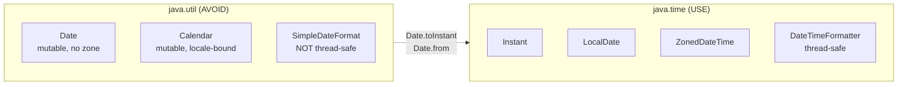
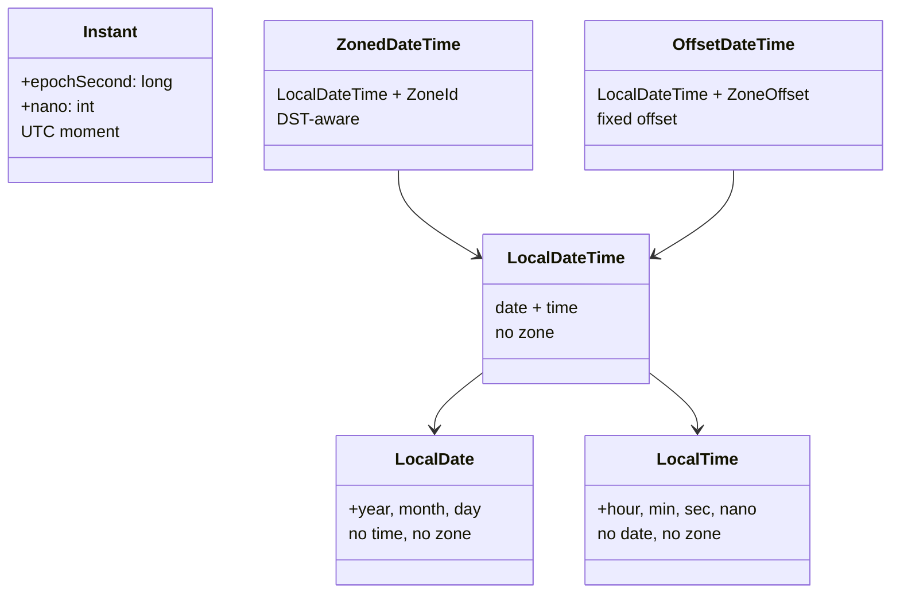
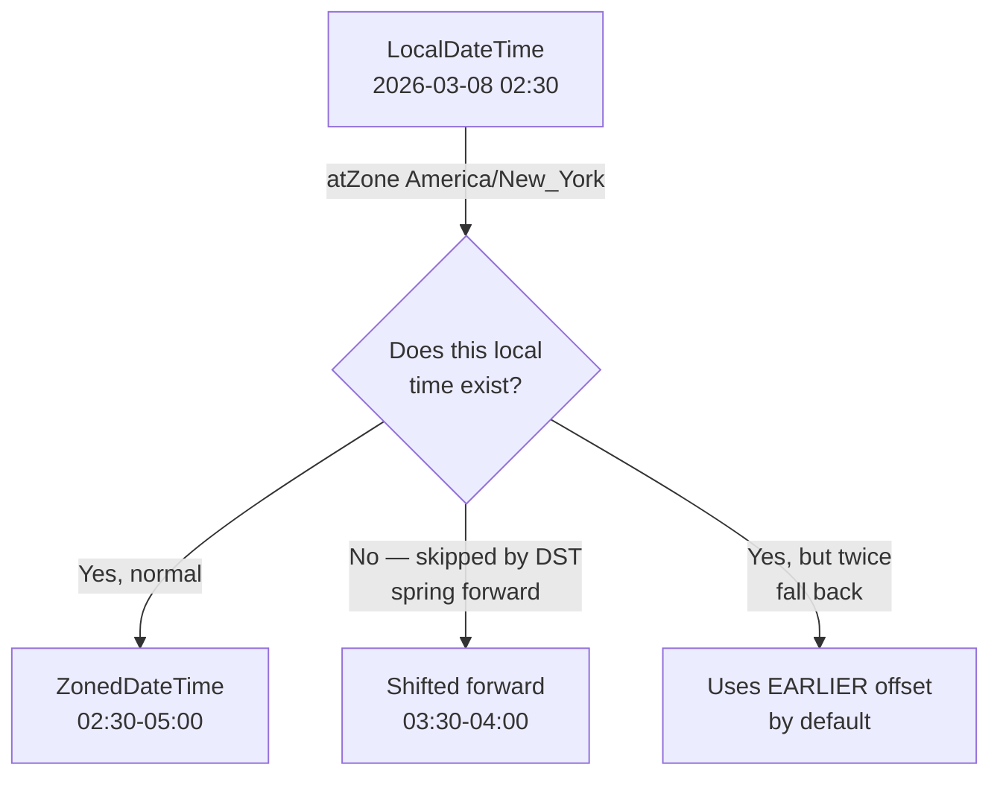

# Date and Time API for TypeScript Developers

**Date:** 2026-04-17  
**Tags:** `java` `datetime` `java-time` `jsr-310`

## Table of Contents

1. [Summary](#summary)
2. [Why `java.time` Exists](#why-javatime-exists)
   - [Legacy `Date` and `Calendar` Pitfalls](#legacy-date-and-calendar-pitfalls)
3. [The Core Types](#the-core-types)
   - [`Instant` — A Moment on the Timeline](#instant--a-moment-on-the-timeline)
   - [`LocalDate`, `LocalTime`, `LocalDateTime`](#localdate-localtime-localdatetime)
   - [`ZonedDateTime` and `OffsetDateTime`](#zoneddatetime-and-offsetdatetime)
   - [Choosing Between Them](#choosing-between-them)
4. [`Duration` vs `Period`](#duration-vs-period)
5. [Parsing and Formatting](#parsing-and-formatting)
   - [Built-in Formatters](#built-in-formatters)
   - [Pattern Syntax](#pattern-syntax)
   - [Locale-Aware Formatting](#locale-aware-formatting)
6. [Time Zones and DST](#time-zones-and-dst)
   - [`ZoneId` vs `ZoneOffset`](#zoneid-vs-zoneoffset)
   - [DST Ambiguity — `atZone` Surprises](#dst-ambiguity--atzone-surprises)
7. [Arithmetic and Adjusters](#arithmetic-and-adjusters)
8. [Comparing and Measuring](#comparing-and-measuring)
9. [Legacy Interop](#legacy-interop)
   - [`java.util.Date` ↔ `Instant`](#javautildate--instant)
   - [`java.sql.Date` Caveats](#javasqldate-caveats)
10. [JSON Serialization with Jackson](#json-serialization-with-jackson)
11. [Spring Boot Request Binding](#spring-boot-request-binding)
12. [Common Pitfalls](#common-pitfalls)
    - [`LocalDateTime` in Public APIs](#localdatetime-in-public-apis)
    - [Injecting `Clock` for Testability](#injecting-clock-for-testability)
13. [TS→Java Cheat Sheet](#tsjava-cheat-sheet)
14. [Related](#related)
15. [References](#references)

---

## Summary

Java's date/time story is effectively two stories: the old `java.util.Date` / `Calendar` / `SimpleDateFormat` trio from Java 1.0–1.1 (which you should avoid), and the `java.time` package introduced in Java 8 via **JSR 310**. If you've been bitten by JavaScript's `Date` (single type, implicit local time, mutable, months 0-indexed), `java.time` will feel like a revelation — it splits concerns into distinct types (`Instant`, `LocalDate`, `ZonedDateTime`, `Duration`, `Period`), everything is immutable, and the API is explicit about what "time" you actually mean. This doc is the crash course for a TS developer writing modern Spring Boot code.

---

## Why `java.time` Exists

TypeScript devs only have `Date` (and maybe `Temporal` in newer runtimes). Java had a worse situation for 15 years: `java.util.Date` was a mutable timestamp that also pretended to be a date, `Calendar` was a mutable builder with a global instance per `Locale`, and `SimpleDateFormat` was famously not thread-safe. `java.time` replaces all of that.

### Legacy `Date` and `Calendar` Pitfalls



The classic offenders:

| Legacy pain | What actually happens |
|---|---|
| `new Date(2026, 4, 17)` | Year is offset from 1900 → year 3926, month is 0-indexed → May, not April. |
| `Date` is mutable | Passing one to another method lets callee mutate your "constant". |
| `Calendar.getInstance()` | Returns a `GregorianCalendar` tied to the default locale and zone. Hidden global state. |
| `SimpleDateFormat` | Shared instance across threads causes garbage output or `NumberFormatException`. |
| `Date` has no zone | `new Date()` is a UTC millisecond count, but `toString()` formats in the default zone. Prints look wrong in CI but right on your laptop. |

```java
// DO NOT DO THIS — legacy, thread-unsafe
SimpleDateFormat fmt = new SimpleDateFormat("yyyy-MM-dd");
Date parsed = fmt.parse("2026-04-17");  // Throws checked ParseException too

// DO THIS — java.time
LocalDate parsed = LocalDate.parse("2026-04-17");  // ISO_LOCAL_DATE by default
```

If you're maintaining a codebase that still uses `Date`, the migration boundary is usually at the persistence layer and the HTTP layer. Everything in between should be `java.time`.

---

## The Core Types

The single most important insight: **Java splits "a date", "a time of day", "a moment in UTC", and "a moment with a timezone" into different types.** You pick the one that matches the real-world concept. No more guessing what a `Date` "means".



### `Instant` — A Moment on the Timeline

An `Instant` is a count of nanoseconds from the epoch (1970-01-01T00:00:00Z). It's always UTC, has no zone, no calendar concept. Closest TS equivalent: `Date.now()` returning a timestamp.

```java
Instant now = Instant.now();            // 2026-04-17T14:23:05.123Z
Instant epoch = Instant.EPOCH;          // 1970-01-01T00:00:00Z
Instant fromMillis = Instant.ofEpochMilli(1_713_360_185_000L);
long ms = now.toEpochMilli();
```

Use `Instant` for:

- Storing timestamps in a database (`created_at`, `updated_at`)
- Logging, metrics, event times
- Anything that is an absolute moment, not "wall clock" time

### `LocalDate`, `LocalTime`, `LocalDateTime`

`Local*` types have **no timezone**. They describe a calendar concept that is ambiguous without a zone.

```java
LocalDate birthday = LocalDate.of(1990, Month.JUNE, 15);
LocalTime lunch = LocalTime.of(12, 30);
LocalDateTime meeting = LocalDateTime.of(2026, 4, 17, 14, 0);

LocalDate today = LocalDate.now();        // Uses default zone! Be careful.
LocalDate todayUtc = LocalDate.now(ZoneOffset.UTC);
```

`Month` is an enum (`Month.APRIL`, not 3). This is a deliberate fix for the `Calendar` 0-indexed month trap.

Use `LocalDate` for:

- Birthdays, holidays, contract start dates — things that don't shift when you fly to Tokyo
- SQL `DATE` columns

Use `LocalDateTime` only when zone is truly irrelevant or supplied elsewhere. In public APIs it's almost always the wrong choice — see [pitfalls](#localdatetime-in-public-apis).

### `ZonedDateTime` and `OffsetDateTime`

Both combine a `LocalDateTime` with zone information, but:

- `ZonedDateTime` — carries a full `ZoneId` (e.g. `America/New_York`), so it knows about DST rules.
- `OffsetDateTime` — carries only a fixed `ZoneOffset` (e.g. `-05:00`). No DST awareness.

```java
ZonedDateTime meeting = ZonedDateTime.of(
    LocalDateTime.of(2026, 4, 17, 14, 0),
    ZoneId.of("America/New_York")
);

OffsetDateTime logged = OffsetDateTime.now(ZoneOffset.UTC);
```

For database timestamps with zone (Postgres `timestamptz`), `OffsetDateTime` is usually the right JDBC mapping. For user-facing scheduling (alarms, calendar events), `ZonedDateTime` preserves the zone across DST transitions.

### Choosing Between Them

| Real-world concept | Type |
|---|---|
| UTC timestamp stored in DB | `Instant` or `OffsetDateTime` |
| Birthday, holiday, "2026-04-17" | `LocalDate` |
| "9am" opening time | `LocalTime` |
| Meeting "April 17 at 2pm New York" | `ZonedDateTime` |
| Bank transaction in `-05:00` | `OffsetDateTime` |
| "Event at time T, zone TBD" | `LocalDateTime` (internal only) |

---

## `Duration` vs `Period`

Two types of elapsed time. The distinction matters around DST and month lengths.

| | `Duration` | `Period` |
|---|---|---|
| Unit basis | Time — seconds, nanoseconds | Date — years, months, days |
| Applies to | `Instant`, `LocalTime`, `LocalDateTime` | `LocalDate`, `LocalDateTime` |
| DST-aware? | No — "1 hour" is always 3600 seconds | Handled correctly when added to `ZonedDateTime` |
| "1 month" | Not supported | `Period.ofMonths(1)` |
| "90 minutes" | `Duration.ofMinutes(90)` | Not supported |

```java
Duration timeout = Duration.ofSeconds(30);
Duration halfHour = Duration.ofMinutes(30);

Period subscription = Period.ofMonths(1);
Period trial = Period.of(0, 0, 14);  // 14 days

LocalDate start = LocalDate.of(2026, 1, 31);
LocalDate plusMonth = start.plus(Period.ofMonths(1));   // 2026-02-28 (clamped)
```

Rule of thumb: `Duration` for machine-time things (HTTP timeouts, rate limits, retry backoff), `Period` for human calendar things (subscriptions, due dates, contract length).

---

## Parsing and Formatting

`DateTimeFormatter` replaces `SimpleDateFormat`. It's **immutable and thread-safe**, so you can (and should) store one in a `static final` field and share it.

```java
private static final DateTimeFormatter LOG_FMT =
    DateTimeFormatter.ofPattern("yyyy-MM-dd HH:mm:ss.SSS");

String formatted = LOG_FMT.format(Instant.now().atZone(ZoneOffset.UTC));
```

### Built-in Formatters

Most of the time you don't need a custom pattern. Java ships canonical ISO 8601 formatters:

| Formatter | Example output |
|---|---|
| `ISO_INSTANT` | `2026-04-17T14:23:05.123Z` |
| `ISO_LOCAL_DATE` | `2026-04-17` |
| `ISO_LOCAL_TIME` | `14:23:05.123` |
| `ISO_LOCAL_DATE_TIME` | `2026-04-17T14:23:05.123` |
| `ISO_OFFSET_DATE_TIME` | `2026-04-17T14:23:05.123-05:00` |
| `ISO_ZONED_DATE_TIME` | `2026-04-17T14:23:05.123-05:00[America/New_York]` |
| `ISO_DATE` | `2026-04-17` or `2026-04-17-05:00` |
| `BASIC_ISO_DATE` | `20260417` |

And `.parse(CharSequence)` on each `java.time` type defaults to the appropriate ISO formatter:

```java
Instant i = Instant.parse("2026-04-17T14:23:05Z");
LocalDate d = LocalDate.parse("2026-04-17");
OffsetDateTime odt = OffsetDateTime.parse("2026-04-17T14:23:05-05:00");
```

### Pattern Syntax

Mostly familiar, with a few Java-specific letters:

| Letter | Meaning | Example |
|---|---|---|
| `yyyy` | Year | `2026` |
| `MM` | Month (01–12) | `04` |
| `MMM` | Month short name | `Apr` |
| `MMMM` | Month full name | `April` |
| `dd` | Day of month | `17` |
| `HH` | Hour (00–23) | `14` |
| `hh` | Hour (01–12) | `02` |
| `mm` | Minute | `23` |
| `ss` | Second | `05` |
| `SSS` | Millisecond | `123` |
| `a` | AM/PM | `PM` |
| `XXX` | Zone offset | `-05:00` |
| `VV` | Zone ID | `America/New_York` |

Common gotcha from TS/Moment: `mm` is **minutes**, `MM` is **months**. Getting them confused has produced more bugs than DST.

### Locale-Aware Formatting

For user-facing display, attach a `Locale`:

```java
DateTimeFormatter jp = DateTimeFormatter
    .ofLocalizedDateTime(FormatStyle.LONG)
    .withLocale(Locale.JAPAN);

String out = jp.format(ZonedDateTime.now());  // 2026年4月17日 14:23:05 JST
```

`FormatStyle` values: `SHORT`, `MEDIUM`, `LONG`, `FULL`. Use localized formatters when rendering for humans; use ISO formatters for machine interchange (logs, APIs, storage).

---

## Time Zones and DST

### `ZoneId` vs `ZoneOffset`

- `ZoneId` is a region identifier like `Europe/London` or `America/New_York`. It knows the rules (DST start/end, historical changes).
- `ZoneOffset` is a fixed numeric offset from UTC, like `+00:00` or `-05:00`. No DST.

```java
ZoneId ny = ZoneId.of("America/New_York");
ZoneOffset utc = ZoneOffset.UTC;
ZoneOffset minusFive = ZoneOffset.of("-05:00");

Set<String> allZones = ZoneId.getAvailableZoneIds();   // ~600 IDs
ZoneId systemDefault = ZoneId.systemDefault();          // JVM default — avoid in logic
```

Avoid `ZoneId.systemDefault()` in business logic — it tests pass on your laptop in `America/New_York` and fail in CI running UTC. Either inject the zone or default to UTC.

### DST Ambiguity — `atZone` Surprises

Converting `LocalDateTime` to `ZonedDateTime` via `.atZone(zoneId)` can hit three cases during DST transitions:



- **Gap** (spring forward): 2:30 AM on DST start doesn't exist. `atZone` shifts forward to 3:30 AM.
- **Overlap** (fall back): 1:30 AM on DST end happens twice. `atZone` picks the earlier occurrence. Use `.withEarlierOffsetAtOverlap()` or `.withLaterOffsetAtOverlap()` to be explicit.

```java
LocalDateTime ambiguous = LocalDateTime.of(2025, 11, 2, 1, 30);  // fall back date
ZonedDateTime early = ambiguous.atZone(ZoneId.of("America/New_York"));
ZonedDateTime late = early.withLaterOffsetAtOverlap();
// early != late even though LocalDateTime is identical
```

For logic that compares times across DST (scheduling, billing), always convert through `Instant` — which is unambiguous by definition.

---

## Arithmetic and Adjusters

All `java.time` types are immutable — every mutation returns a new instance (same pattern as TS `Date` methods would be if they were sane).

```java
LocalDate next = today.plusDays(7);
LocalDate prev = today.minusWeeks(2);
Instant later = now.plus(Duration.ofHours(3));
LocalDate firstOfMonth = today.withDayOfMonth(1);
LocalTime startOfHour = time.withMinute(0).withSecond(0).withNano(0);
```

`ChronoUnit` provides unit constants for generic arithmetic:

```java
Instant deadline = Instant.now().plus(10, ChronoUnit.MINUTES);
```

`TemporalAdjusters` covers the calendar gymnastics you'd otherwise hand-roll:

```java
import static java.time.temporal.TemporalAdjusters.*;

LocalDate lastDayOfMonth = today.with(lastDayOfMonth());
LocalDate firstMondayNextMonth = today
    .with(firstDayOfNextMonth())
    .with(nextOrSame(DayOfWeek.MONDAY));
LocalDate nextFriday = today.with(next(DayOfWeek.FRIDAY));
```

---

## Comparing and Measuring

All types implement `Comparable`, but the named methods are more readable:

```java
boolean overdue = dueDate.isBefore(LocalDate.now());
boolean upcoming = dueDate.isAfter(LocalDate.now());
boolean same = dueDate.isEqual(other);
```

For distance between two temporals, use `ChronoUnit.between`:

```java
long daysUntil = ChronoUnit.DAYS.between(LocalDate.now(), dueDate);
long minutesLate = ChronoUnit.MINUTES.between(expected, actual);

Duration elapsed = Duration.between(start, end);
Period age = Period.between(birthday, LocalDate.now());
int years = age.getYears();
```

Note that `Duration.between` requires both arguments to support time (so `Instant`, `LocalDateTime`, `ZonedDateTime` — not `LocalDate`). Use `ChronoUnit.DAYS.between` for date-only math.

---

## Legacy Interop

You will meet old APIs that still use `java.util.Date`. The bridge is straightforward.

### `java.util.Date` ↔ `Instant`

```java
Date legacy = Date.from(Instant.now());
Instant modern = legacy.toInstant();

// util.Date ↔ LocalDateTime (needs a zone)
LocalDateTime ldt = legacy.toInstant().atZone(ZoneId.systemDefault()).toLocalDateTime();
Date back = Date.from(ldt.atZone(ZoneId.systemDefault()).toInstant());
```

Convert at the API boundary. Don't let `Date` leak into the service layer.

### `java.sql.Date` Caveats

`java.sql.Date` extends `java.util.Date` but is "truncated to midnight in the JVM timezone." It's a landmine:

- `java.sql.Date.toInstant()` **throws** `UnsupportedOperationException` (it's a date, not an instant).
- `new java.sql.Date(millis)` implicitly uses the JVM zone to decide which calendar day you get.
- `.toLocalDate()` gives you the safe conversion.

Modern JDBC (Postgres driver, JPA 2.2+) maps `java.time` types directly — `LocalDate` ↔ `DATE`, `OffsetDateTime` ↔ `TIMESTAMP WITH TIME ZONE`, `Instant` ↔ `TIMESTAMP WITH TIME ZONE`. Prefer those mappings in entity fields and avoid `java.sql.Date` entirely.

---

## JSON Serialization with Jackson

By default, Jackson doesn't know about `java.time` types. If you serialize an `Instant` without configuration, you get either a giant numeric timestamp or a serialization error depending on version.

Spring Boot auto-registers the `JavaTimeModule` and disables timestamp output, so ISO strings are the default:

```json
{ "createdAt": "2026-04-17T14:23:05.123Z" }
```

If you're constructing `ObjectMapper` yourself (tests, WebClient codecs, batch jobs), register it manually:

```java
ObjectMapper mapper = new ObjectMapper()
    .registerModule(new JavaTimeModule())
    .disable(SerializationFeature.WRITE_DATES_AS_TIMESTAMPS);
```

Without `WRITE_DATES_AS_TIMESTAMPS` disabled, `Instant` serializes as `1713360185.123` — not what you want in an API response.

The project's [`configurations/java-bean-config.md`](../configurations/java-bean-config.md#objectmapper-customization) covers the three patterns for customizing the Spring-managed `ObjectMapper` (`Jackson2ObjectMapperBuilderCustomizer`, full replacement bean, and scoped named beans). All three should register `JavaTimeModule`; the Spring Boot default already does this for the primary mapper — you only need to worry about it if you build a fresh `ObjectMapper` outside the Spring context.

Field-level formatting (e.g. if an external system insists on a non-ISO format):

```java
public record Event(
    @JsonFormat(shape = JsonFormat.Shape.STRING, pattern = "yyyy-MM-dd HH:mm:ss", timezone = "UTC")
    LocalDateTime occurredAt
) {}
```

---

## Spring Boot Request Binding

Spring MVC and WebFlux know `java.time`. For `@RequestParam` and `@PathVariable`, they accept ISO 8601 by default:

```java
@GetMapping("/events")
Flux<Event> byRange(
    @RequestParam @DateTimeFormat(iso = ISO.DATE) LocalDate from,
    @RequestParam @DateTimeFormat(iso = ISO.DATE_TIME) OffsetDateTime to
) { ... }
```

`@DateTimeFormat` is optional for ISO formats but required for custom patterns:

```java
@RequestParam
@DateTimeFormat(pattern = "yyyyMMdd")
LocalDate date
```

For `@RequestBody`, Jackson does the work — so config lives in the `ObjectMapper` (see above). The global pattern for request/response bodies is "always ISO 8601, always UTC for instants" unless you have a specific interop constraint.

You can tweak parameter parsing globally via `spring.mvc.format.date`, `spring.mvc.format.date-time`, and `spring.webflux.format.*` properties.

---

## Common Pitfalls

### `LocalDateTime` in Public APIs

A `LocalDateTime` in a REST response looks fine but carries no zone. Consumers guess — one assumes UTC, another assumes local, and audit logs disagree. **Never** put `LocalDateTime` on an API boundary unless you have an explicit zone contract alongside it.

```java
// BAD — what zone is this?
public record EventDto(String id, LocalDateTime createdAt) {}

// GOOD — unambiguous
public record EventDto(String id, Instant createdAt) {}
// or
public record EventDto(String id, OffsetDateTime createdAt) {}
```

Same rule for database columns. Use `timestamptz` (Postgres) with `Instant` or `OffsetDateTime`, not `timestamp` with `LocalDateTime`, unless you really mean "floating time" (rare).

### Injecting `Clock` for Testability

Calling `Instant.now()` directly makes tests hard — you can't control time. `java.time.Clock` is the dependency you inject:

```java
@Service
public class OrderService {
    private final Clock clock;

    public OrderService(Clock clock) { this.clock = clock; }

    public Order place(Cart cart) {
        return new Order(cart, Instant.now(clock));
    }
}

@Configuration
class TimeConfig {
    @Bean Clock clock() { return Clock.systemUTC(); }
}
```

In tests, inject a fixed clock:

```java
Clock fixed = Clock.fixed(Instant.parse("2026-04-17T14:00:00Z"), ZoneOffset.UTC);
OrderService service = new OrderService(fixed);
```

`Clock.fixed(...)`, `Clock.offset(baseClock, Duration.ofHours(1))`, and `Clock.tickSeconds(zone)` cover most test scenarios. All `java.time` factories that take no args have a `.now(Clock)` overload — use it.

---

## TS→Java Cheat Sheet

| TypeScript | Java |
|---|---|
| `new Date()` | `Instant.now()` (UTC) or `ZonedDateTime.now(zone)` |
| `Date.now()` | `Instant.now().toEpochMilli()` |
| `new Date("2026-04-17")` | `LocalDate.parse("2026-04-17")` |
| `date.getTime()` | `instant.toEpochMilli()` |
| `date.toISOString()` | `instant.toString()` (`ISO_INSTANT`) |
| `date.getUTCHours()` | `instant.atOffset(ZoneOffset.UTC).getHour()` |
| `addDays(date, 7)` (date-fns) | `localDate.plusDays(7)` |
| `differenceInDays(a, b)` | `ChronoUnit.DAYS.between(b, a)` |
| `formatInTimeZone(d, "Europe/Paris", "...")` | `zdt.withZoneSameInstant(ZoneId.of("Europe/Paris")).format(fmt)` |
| `Temporal.Instant` (proposal) | `Instant` |
| `Temporal.PlainDate` | `LocalDate` |
| `Temporal.ZonedDateTime` | `ZonedDateTime` |
| `Temporal.Duration` | `Duration` / `Period` (split) |

---

## Related

- [`../configurations/java-bean-config.md`](../configurations/java-bean-config.md) — `ObjectMapper` customization patterns for registering `JavaTimeModule` and controlling date serialization format across the app.
- [`type-system-for-ts-devs.md`](./type-system-for-ts-devs.md) — How Java's immutability, `final`, and value-type thinking map onto `java.time`'s immutable design.
- [`modern-java-features.md`](./modern-java-features.md) — Records pair naturally with `java.time` types for DTOs; text blocks are useful for literal ISO strings in tests.

---

## References

- [Oracle — The Java Tutorials: Date Time](https://docs.oracle.com/javase/tutorial/datetime/index.html)
- [JSR 310: Date and Time API](https://jcp.org/en/jsr/detail?id=310)
- [`java.time` package Javadoc (Java 21)](https://docs.oracle.com/en/java/javase/21/docs/api/java.base/java/time/package-summary.html)
- [Jackson `JavaTimeModule` documentation](https://github.com/FasterXML/jackson-modules-java8/tree/master/datetime)
- [Stephen Colebourne — ThreeTen-Extra (JSR 310 follow-ups)](https://www.threeten.org/threeten-extra/)
- [IANA Time Zone Database](https://www.iana.org/time-zones) — the canonical source for `ZoneId` rules
- [Spring Framework — `@DateTimeFormat`](https://docs.spring.io/spring-framework/reference/core/validation/format.html#format-CustomFormatAnnotations)
