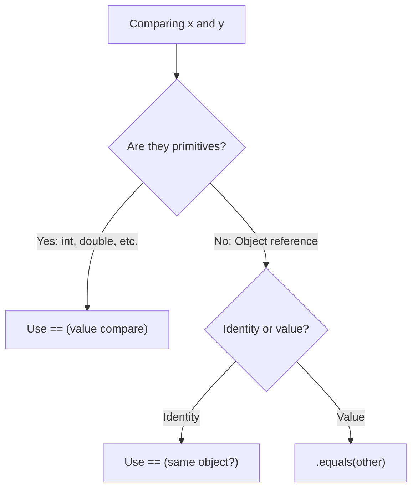
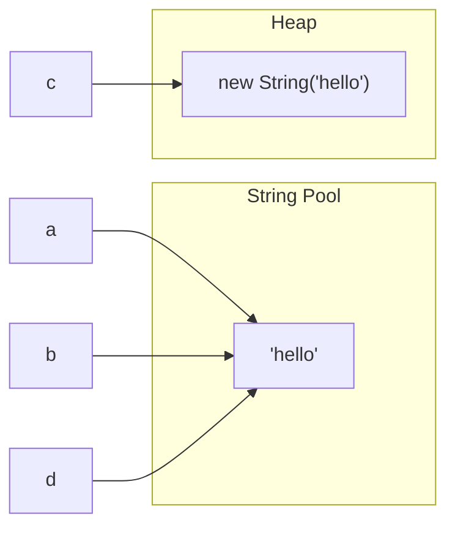
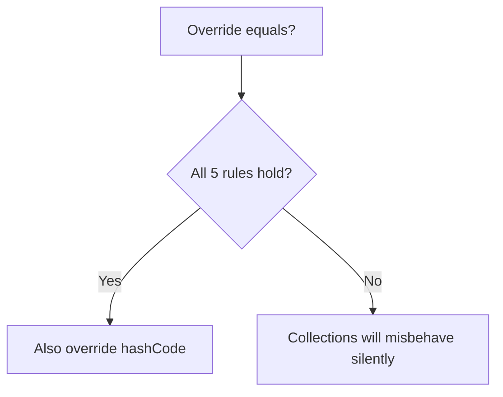
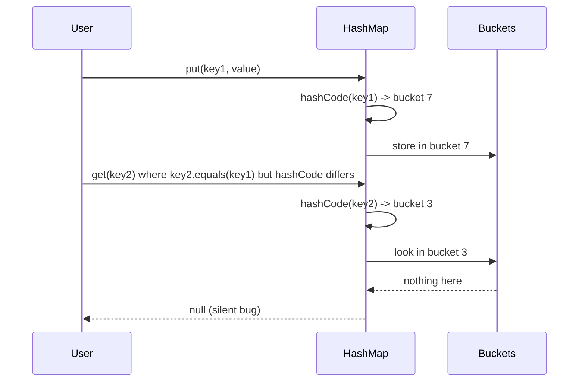
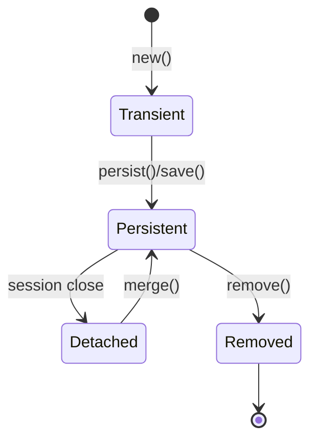

# Equality and Identity in Java (for TypeScript Developers)

**Date:** 2026-04-17
**Tags:** `java` `equality` `hashcode` `comparator` `jpa` `lombok`

## Table of Contents

1. [Summary](#summary)
2. [`==` vs `.equals()`](#-vs-equals)
3. [String Interning](#string-interning)
4. [Primitive Wrappers Trap](#primitive-wrappers-trap)
5. [The `equals()` Contract](#the-equals-contract)
6. [The `hashCode()` Contract](#the-hashcode-contract)
7. [Writing `equals()` and `hashCode()` Manually](#writing-equals-and-hashcode-manually)
8. [Records — The Easy Way](#records--the-easy-way)
9. [Lombok `@EqualsAndHashCode`](#lombok-equalsandhashcode)
10. [Entity Identity — JPA/Hibernate Special Case](#entity-identity--jpahibernate-special-case)
11. [Comparable vs Comparator](#comparable-vs-comparator)
12. [`compareTo` Contract](#compareto-contract)
13. [TS to Java Equality Cheat Sheet](#ts-to-java-equality-cheat-sheet)
14. [Common Bugs](#common-bugs)
15. [Related](#related)
16. [References](#references)

---

## Summary

In TypeScript, `===` does identity check for objects and value check for primitives, and you mostly don't worry about it — deep equality is a library function (lodash, etc.) you reach for when needed. In Java, the distinction is **baked into the language**: `==` is ALWAYS identity (reference equality) for objects, and `.equals()` is value equality. Getting this wrong silently breaks `List.contains()`, `HashMap` lookups, and `Set` uniqueness — your code compiles and runs, it just returns the wrong answer. And there's a twin rule that trips up most newcomers: if you override `equals()` you **MUST** override `hashCode()` too, or hash-based collections break in mysterious ways.

---

## `==` vs `.equals()`

The core rule is simple but load-bearing:

- **`==`** compares references — "are these two names pointing at the same object in memory?"
- **`.equals(other)`** compares values — "are these objects logically equal?"
- For **primitives** (`int`, `long`, `double`, `boolean`, `char`...), `==` is value comparison, because primitives don't have references.



The classic trap:

```java
String a = "hello";
String b = "hello";
String c = new String("hello");

a == b;        // true  — string literal interning (same pooled object)
a == c;        // false — c is a brand-new heap object
a.equals(c);   // true  — same character sequence
```

TS analogue for intuition: think of `==` as `Object.is(a, b)` applied strictly to reference cells, and `.equals()` as a user-defined deep-equality method the class overrode.

---

## String Interning

Why does `"hello" == "hello"` return `true`? The JVM maintains a **string pool**. Every string literal in source code is interned — two identical literals refer to the same `String` object. But `new String("hello")` bypasses the pool and forces a fresh allocation on the heap.

```java
String a = "hello";
String b = "hello";
String c = new String("hello");
String d = c.intern();   // force it into the pool

a == b;   // true
a == c;   // false
a == d;   // true  — intern() returns the pooled version
```



**Rule of thumb: never use `==` for strings.** Always `.equals()` or `.equalsIgnoreCase()`. The one exception is `switch` on a string, which uses `.equals()` internally — that's safe.

---

## Primitive Wrappers Trap

Java has primitive types (`int`, `long`, `double`...) and their object wrappers (`Integer`, `Long`, `Double`...). Autoboxing silently converts between them. The wrappers cache small values — typically `-128` to `127` — via `Integer.valueOf()`:

```java
Integer x = 100;
Integer y = 100;
x == y;           // true  — both pulled from the cache

Integer a = 200;
Integer b = 200;
a == b;           // false — outside cache range, separate objects
a.equals(b);      // true
```

Even worse, mixed comparisons unbox:

```java
Integer boxed = 200;
int raw = 200;
boxed == raw;     // true — Integer gets unboxed to int, value compare
```

**Rule of thumb:** use `.equals()` for any wrapper type, or stick to primitive `int`/`long` if you don't need nullability.

---

## The `equals()` Contract

`Object.equals(Object)` specifies five properties that any override MUST preserve. Violate them and collections silently misbehave.

| Property | Meaning |
|----------|---------|
| **Reflexive** | `x.equals(x)` is always `true` |
| **Symmetric** | `x.equals(y)` iff `y.equals(x)` |
| **Transitive** | `x.equals(y)` and `y.equals(z)` implies `x.equals(z)` |
| **Consistent** | Repeated calls return the same answer as long as the objects don't change |
| **Non-null** | `x.equals(null)` is `false` — never throws `NullPointerException` |

The most common violations are **symmetry** (a subclass accepts a superclass counterpart but not vice versa) and **transitivity** (mixing `Point` with `ColorPoint` hierarchies). Effective Java Item 10 discusses this at length.



---

## The `hashCode()` Contract

Equally critical — and this is where most bugs hide:

1. If `a.equals(b)` is `true`, then `a.hashCode() == b.hashCode()` **MUST** hold.
2. If `a.hashCode() != b.hashCode()`, then `a.equals(b)` MUST be `false`.
3. Equal hash codes do **NOT** imply equal objects — collisions are permitted and common.

**The consequence:** override `equals()` → you MUST override `hashCode()` together. This is so important that IDEs and Lombok generate them as a pair.

### Why does it matter?

Hash-based collections (`HashMap`, `HashSet`, `Hashtable`, `LinkedHashMap`, `ConcurrentHashMap`) work in two steps:

1. Compute `hashCode()` → select a bucket.
2. Walk the bucket comparing with `equals()` → find the entry.

If two "equal" objects have different hash codes, they land in different buckets. `map.get(key)` looks in bucket A, the entry sits in bucket B, and you get `null`. Silently. No error, just wrong.



---

## Writing `equals()` and `hashCode()` Manually

The canonical pattern, using modern Java (16+) pattern matching:

```java
public final class Point {
    private final int x;
    private final int y;

    public Point(int x, int y) {
        this.x = x;
        this.y = y;
    }

    @Override
    public boolean equals(Object o) {
        if (this == o) return true;                    // identity fast path
        if (!(o instanceof Point other)) return false; // type + null check
        return x == other.x && y == other.y;           // field-by-field
    }

    @Override
    public int hashCode() {
        return Objects.hash(x, y);
    }
}
```

Key moves:

- `this == o` — cheap identity short-circuit.
- `instanceof Type other` — pattern matching binds `other` only on success; also rejects `null` (since `null instanceof Anything` is `false`).
- Compare **primitives with `==`**, **objects with `.equals()`** (or `Objects.equals()` to handle nulls).
- For `double`/`float`, use `Double.compare(a, b) == 0` to handle NaN and +/- zero correctly.
- `Objects.hash(...)` is safe and readable. For performance-critical hot paths, hand-roll with `31 * result + field` to avoid varargs allocation.

### `Objects.equals` — null-safe equality

```java
// instead of
(a == null ? b == null : a.equals(b))

// write
Objects.equals(a, b);
```

---

## Records — The Easy Way

Since Java 14 (stable in 16), **records** auto-generate correct `equals`, `hashCode`, `toString`, and a canonical constructor for you:

```java
public record Point(int x, int y) {}
```

That's it. `equals` compares all components. `hashCode` hashes all components. You can still add methods, validate in a compact constructor, or implement interfaces:

```java
public record Money(long cents, String currency) {
    public Money {
        Objects.requireNonNull(currency);
        if (cents < 0) throw new IllegalArgumentException("negative amount");
    }

    public Money add(Money other) {
        if (!currency.equals(other.currency)) {
            throw new IllegalArgumentException("mixed currencies");
        }
        return new Money(cents + other.cents, currency);
    }
}
```

Records are final, immutable, and their semantics exactly match what a careful hand-written `equals`/`hashCode` would do. **Prefer records for data-carrier classes** — DTOs, value objects, tuple-like return types.

---

## Lombok `@EqualsAndHashCode`

For classic mutable classes, Lombok generates both methods from annotations:

```java
import lombok.EqualsAndHashCode;

@EqualsAndHashCode
public class Order {
    private Long id;
    private String sku;
    private int quantity;
}
```

Variants you'll encounter:

```java
// Exclude a field (e.g., audit timestamps)
@EqualsAndHashCode(exclude = "createdAt")
public class Order { /* ... */ }

// Only include explicitly marked fields
@EqualsAndHashCode(onlyExplicitlyIncluded = true)
public class Order {
    @EqualsAndHashCode.Include private Long id;
    private String sku;      // ignored
    private int quantity;    // ignored
}

// When extending a class with its own equals/hashCode
@EqualsAndHashCode(callSuper = true)
public class PriorityOrder extends Order { /* ... */ }
```

**Warning:** Lombok's default includes all non-static, non-transient fields. On entities and aggregates that's usually wrong (see next section).

---

## Entity Identity — JPA/Hibernate Special Case

This is where `equals`/`hashCode` gets genuinely tricky, and where naive `@EqualsAndHashCode` or `@Data` causes real production bugs. A JPA `@Entity` has three lifecycle states:



Problems that emerge:

1. **Generated IDs change.** A transient entity has `id == null`. After `save()`, the DB assigns an ID. If you put the entity in a `HashSet` while transient, then save it, its hash code changes — you can no longer find it in the set.
2. **Lazy-loaded associations explode `equals`.** If `equals` touches a `@OneToMany` collection, calling it outside a session throws `LazyInitializationException`. Inside a session, it triggers unexpected queries.
3. **All-fields equality breaks detached identity.** Two proxies representing the same row can have different field snapshots mid-transaction.

### Idiomatic approaches

**Option A — Business key (preferred when available).** Use a naturally unique, immutable attribute (email, ISBN, order number):

```java
@Entity
@EqualsAndHashCode(onlyExplicitlyIncluded = true)
public class User {
    @Id @GeneratedValue private Long id;

    @EqualsAndHashCode.Include
    @Column(unique = true, nullable = false, updatable = false)
    private String email;

    // other mutable fields ignored
}
```

**Option B — ID-based with careful null handling.** Used when no business key exists. The trick: `hashCode` must return a constant so transient-then-persistent transitions don't relocate the object in a hash bucket:

```java
@Entity
public class Order {
    @Id @GeneratedValue private Long id;

    @Override
    public boolean equals(Object o) {
        if (this == o) return true;
        if (!(o instanceof Order other)) return false;
        return id != null && id.equals(other.id);
    }

    @Override
    public int hashCode() {
        // Constant! Must not depend on id because id changes on save.
        return getClass().hashCode();
    }
}
```

This looks weird but is the standard Hibernate recommendation. All entities of a type share a bucket; `equals` disambiguates. Fine as long as the set size is bounded.

**Rules of thumb for entities:**

- Never use `@Data` or default `@EqualsAndHashCode` on an `@Entity`.
- Never include lazy associations.
- Never use mutable fields unless they're truly immutable from construction.
- Prefer records or DTOs at the boundary; keep JPA entities internal.

---

## Comparable vs Comparator

TypeScript: `arr.sort((a, b) => a.age - b.age)` — one pattern. Java separates natural ordering from external ordering:

| API | Where it lives | How many per class |
|-----|---------------|---------------------|
| `Comparable<T>` | On the class itself | One (the "natural" order) |
| `Comparator<T>` | External object | Any number |

### `Comparable` — natural ordering

```java
public class Person implements Comparable<Person> {
    private final String name;
    private final int age;

    @Override
    public int compareTo(Person other) {
        return Integer.compare(this.age, other.age);
    }
}

List<Person> people = ...;
Collections.sort(people);     // uses compareTo
TreeSet<Person> sorted = new TreeSet<>(people);
```

### `Comparator` — external ordering

```java
Comparator<Person> byName = Comparator.comparing(Person::getName);
Comparator<Person> byAgeDesc = Comparator
        .comparingInt(Person::getAge)
        .reversed();

// Chaining
Comparator<Person> byLastThenFirst = Comparator
        .comparing(Person::getLastName)
        .thenComparing(Person::getFirstName);

// Null handling
Comparator<Person> nullSafe = Comparator
        .nullsFirst(Comparator.comparing(Person::getName));

people.sort(byName);
people.stream().sorted(byAgeDesc).toList();
```

The fluent builder factory methods (`comparing`, `comparingInt`, `thenComparing`, `reversed`, `nullsFirst`, `nullsLast`) cover 95% of real-world cases without hand-written lambdas.

---

## `compareTo` Contract

The `Comparable.compareTo` contract mirrors `equals`:

- `sgn(x.compareTo(y)) == -sgn(y.compareTo(x))` — antisymmetric.
- Transitive: `x > y` and `y > z` implies `x > z`.
- `x.compareTo(y) == 0` **SHOULD** mean `x.equals(y)`. It's not strictly required, but violating it makes `TreeSet`/`TreeMap` diverge from `HashSet`/`HashMap` — the same objects behave like duplicates in one and unique in the other. Effective Java Item 14.
- **Never use `a - b` for int comparison** — it silently overflows:

```java
// WRONG — overflows when a is large positive and b is large negative
return a - b;

// CORRECT
return Integer.compare(a, b);
```

---

## TS to Java Equality Cheat Sheet

| TypeScript | Java | Notes |
|-----------|------|-------|
| `a === b` on primitives | `a == b` on primitives | Direct value compare |
| `a === b` on objects | `a == b` | Reference identity only |
| Deep equality (lodash `isEqual`) | `a.equals(b)` | Requires proper override |
| `a === null` | `a == null` | Only place `==` on objects is idiomatic |
| `new Set([a, b])` dedup by identity | `HashSet` — needs `equals` + `hashCode` | Otherwise duplicates slip in |
| `map.get(key)` by key identity | `HashMap.get(key)` — needs `hashCode`+`equals` | Silent miss if contract broken |
| `arr.sort((a, b) => a.n - b.n)` | `list.sort(Comparator.comparingInt(X::getN))` | Or implement `Comparable` |
| `arr.sort()` on strings | `list.sort(Comparator.naturalOrder())` | `String` implements `Comparable` |
| `Object.is(NaN, NaN)` → `true` | `Double.compare(NaN, NaN) == 0` → `true` | `==` on `NaN` is `false` |

---

## Common Bugs

1. **Using `==` on strings.** The literal `"hello" == "hello"` happens to work due to interning, so bugs hide until a value comes from `BufferedReader`, JSON parser, or `new String(...)`. Fix: always `.equals()`.

2. **Overriding `equals` without `hashCode`.** The canonical silent bug. `HashMap.get(key)` returns `null` for a key you just inserted. IDE warnings catch this — don't dismiss them.

3. **Mutating fields used in `hashCode` while in a `HashSet`.** The object lands in bucket A, then you mutate, and it's "lost" — physically still in bucket A but hash says bucket B. Fix: make hash-relevant fields `final`, or remove-before-mutate-then-re-add.

4. **Entity equality on mutable ID.** Pre-save `id == null`, post-save `id == 42`. Object migrates between buckets, collection consistency breaks. Fix: constant `hashCode` returning `getClass().hashCode()`.

5. **Using `a - b` in `compareTo`.** Overflows for large values. Fix: `Integer.compare(a, b)`.

6. **Forgetting `callSuper = true` on `@EqualsAndHashCode` in subclasses.** Lombok warns; heed the warning.

7. **Mixing `Integer` and `==`.** `Integer.valueOf(1000) == Integer.valueOf(1000)` is `false`. Fix: `.equals()` or primitive `int`.

8. **Comparator returning `int` math that overflows.** `(a, b) -> a.getTimestamp() - b.getTimestamp()` with `long` timestamps truncates then overflows. Fix: `Comparator.comparingLong(...)`.

---

## Related

- [Type System for TS Devs](type-system-for-ts-devs.md) — primitives vs references, autoboxing fundamentals.
- [Collections and Streams](collections-and-streams.md) — where `equals`/`hashCode` actually gets called.
- [Modern Java Features](modern-java-features.md) — records, pattern matching, `var`.
- [Lombok and Boilerplate](lombok-and-boilerplate.md) — `@EqualsAndHashCode`, `@Data`, `@Value`.

---

## References

- Oracle Javadoc — [`Object.equals(Object)`](https://docs.oracle.com/en/java/javase/21/docs/api/java.base/java/lang/Object.html#equals(java.lang.Object))
- Oracle Javadoc — [`Object.hashCode()`](https://docs.oracle.com/en/java/javase/21/docs/api/java.base/java/lang/Object.html#hashCode())
- Oracle Javadoc — [`Comparable<T>`](https://docs.oracle.com/en/java/javase/21/docs/api/java.base/java/lang/Comparable.html) and [`Comparator<T>`](https://docs.oracle.com/en/java/javase/21/docs/api/java.base/java/util/Comparator.html)
- Joshua Bloch, *Effective Java* (3rd ed.)
  - Item 10 — Obey the general contract when overriding `equals`
  - Item 11 — Always override `hashCode` when you override `equals`
  - Item 12 — Always override `toString`
  - Item 13 — Override `clone` judiciously
  - Item 14 — Consider implementing `Comparable`
- Vlad Mihalcea — [The best way to implement `equals`, `hashCode`, and `toString` with JPA and Hibernate](https://vladmihalcea.com/the-best-way-to-implement-equals-hashcode-and-tostring-with-jpa-and-hibernate/)
- JEP 395 — [Records](https://openjdk.org/jeps/395)
- JEP 394 — [Pattern Matching for `instanceof`](https://openjdk.org/jeps/394)
