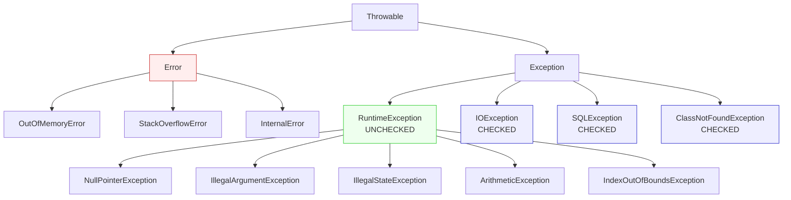

# Exceptions and Error Handling

**Date:** 2026-04-17
**Tags:** `java` · `exceptions` · `error-handling` · `checked-exceptions` · `try-with-resources` · `ts-to-java`

## Table of Contents

1. [Summary](#summary)
2. [Exception Hierarchy](#exception-hierarchy)
3. [Checked vs Unchecked — The Core Difference](#checked-vs-unchecked--the-core-difference)
4. [try / catch / finally](#try--catch--finally)
5. [try-with-resources — Java's RAII](#try-with-resources--javas-raii)
6. [Throwing Exceptions](#throwing-exceptions)
7. [Custom Exceptions](#custom-exceptions)
8. [The Checked-Exception Problem with Lambdas](#the-checked-exception-problem-with-lambdas)
9. [Common Runtime Exceptions You Will See](#common-runtime-exceptions-you-will-see)
10. [Exception Handling Best Practices](#exception-handling-best-practices)
11. [Exception Handling in Spring Boot](#exception-handling-in-spring-boot)
12. [Related](#related)
13. [References](#references)

---

## Summary

Java has two exception categories that TypeScript does not distinguish — **checked** (compiler-enforced, part of a method's signature) and **unchecked** (runtime errors, optional to handle). This is Java's most controversial language feature and the biggest mental shift when coming from TypeScript, where every `throw` is untyped and invisible to the compiler. Java also offers `try-with-resources`, a lightweight RAII mechanism for deterministic cleanup of files, sockets, database connections, and anything else implementing `AutoCloseable`. Modern Java style (and the consensus since *Effective Java*) favors **unchecked exceptions** for most domain errors — checked exceptions compose poorly with lambdas, streams, and reactive pipelines, so they are increasingly viewed as a historical wart rather than a feature to embrace.

---

## Exception Hierarchy

Every throwable thing in Java descends from `java.lang.Throwable`. The split between `Error`, checked `Exception`, and `RuntimeException` determines whether the compiler forces you to handle it.



**The rule that matters:**

- Anything extending `RuntimeException` (or `Error`) is **unchecked** — compiler does not require handling.
- Anything else extending `Exception` is **checked** — compiler forces you to either `catch` it or declare `throws` on the method.
- `Error` represents JVM-level failures (out of memory, stack overflow). **Do not catch them.** They are unchecked technically, but treat them as fatal.

TypeScript analogue: everything in TS behaves like `RuntimeException` — there is no compile-time contract around what a function throws.

---

## Checked vs Unchecked — The Core Difference

| Aspect                   | Checked                                                      | Unchecked (`RuntimeException`)                               |
| ------------------------ | ------------------------------------------------------------ | ------------------------------------------------------------ |
| Compiler enforcement     | Must `throws` or `try/catch`                                 | Optional                                                     |
| In method signature      | Yes, declared with `throws`                                  | No                                                           |
| Examples                 | `IOException`, `SQLException`, `ClassNotFoundException`, `InterruptedException` | `NullPointerException`, `IllegalArgumentException`, `IllegalStateException`, `ArithmeticException` |
| Philosophical intent     | Recoverable, external, expected failures                     | Programming bugs / precondition violations                   |
| Works with lambdas       | Poorly — requires wrapping                                   | Cleanly                                                      |
| Modern guidance          | Avoid when possible                                          | Use for most application errors                              |

### What a checked exception looks like

```java
public String readFile(String path) throws IOException {
    return Files.readString(Path.of(path));
}
```

The `throws IOException` clause is **part of the method's public contract**. Every caller must either:

```java
// Option 1: catch it
try {
    var text = readFile("config.yml");
} catch (IOException e) {
    log.error("read failed", e);
}

// Option 2: propagate by declaring it themselves
public void load() throws IOException {
    var text = readFile("config.yml");
}
```

There is no third option. Omitting both is a compile error.

### TypeScript comparison

```typescript
// TS: throws type is invisible. Caller has no compile-time clue.
function readFile(path: string): string {
  return fs.readFileSync(path, 'utf8');  // may throw — compiler silent
}
```

```java
// Java checked: throws is in the signature. Compiler enforces handling.
public String readFile(String path) throws IOException { ... }
```

This is the single biggest behavioral difference between TS error handling and Java error handling.

---

## try / catch / finally

TypeScript has `try/catch/finally` with one `catch` block that binds `unknown`. Java allows multiple typed `catch` blocks, ordered from most specific to most general, plus multi-catch syntax.

```java
try {
    riskyOperation();
} catch (SpecificException e) {
    // handle specific error
    log.warn("specific failure: {}", e.getMessage());
} catch (IOException | SQLException e) {
    // multi-catch (Java 7+): group unrelated exceptions that share handling
    log.error("I/O or DB failure", e);
    throw new ServiceException("infra down", e);
} catch (Exception e) {
    // catch-all — avoid. Prefer specific types.
    log.error("unexpected", e);
    throw new IllegalStateException(e);
} finally {
    // always runs, even on return or exception
    cleanup();
}
```

**Ordering rule:** catch clauses are evaluated top to bottom. A more general type (`Exception`) above a more specific one (`IOException`) is a compile error — the specific clause would be unreachable.

**Multi-catch restriction:** the types in a `catch (A | B e)` clause must not be in an inheritance relationship with each other. You cannot write `catch (IOException | Exception e)`.

**`finally` gotcha:** a `return` inside `finally` silently overrides any return or exception from the `try` block. Don't do it.

---

## try-with-resources — Java's RAII

TypeScript has no direct equivalent (though the `using` keyword from TC39 proposal 3 now exists in newer TS/Node, it is not yet idiomatic). Java has had `try-with-resources` since Java 7, and it is the single cleanest ergonomic win the language offers over hand-written cleanup.

Any class implementing `AutoCloseable` (which includes `Closeable`) can be declared in the resource header:

```java
try (var reader = new BufferedReader(new FileReader("file.txt"))) {
    return reader.readLine();
}
// reader.close() is called automatically here — on normal exit,
// on exception, on early return. Always.
```

### Multiple resources

```java
try (var in  = new FileInputStream(src);
     var out = new FileOutputStream(dst)) {
    in.transferTo(out);
}
// out.close() is called first, then in.close() — reverse declaration order.
// Both are called even if the first close() throws; the second exception
// becomes a "suppressed" exception, accessible via Throwable#getSuppressed().
```

### What this replaces

The old, noisy pattern that dominated Java before Java 7:

```java
// DO NOT write this anymore — purely for historical comparison
BufferedReader reader = null;
try {
    reader = new BufferedReader(new FileReader("file.txt"));
    return reader.readLine();
} finally {
    if (reader != null) {
        try {
            reader.close();
        } catch (IOException e) {
            // silently swallow or log awkwardly
        }
    }
}
```

Use `try-with-resources` for: files, streams, sockets, JDBC `Connection`/`Statement`/`ResultSet`, HTTP clients that are `AutoCloseable`, locks (via helpers), and your own `AutoCloseable` domain objects.

---

## Throwing Exceptions

```java
throw new IllegalArgumentException("name must not be null");
throw new IOException("file not found: " + path);
```

Any `Throwable` can be thrown. `throw` is a statement, not an expression (unlike some languages).

### Chaining causes — critical for debugging

When you catch a low-level exception and wrap it in a domain-level one, **always pass the original as the cause**:

```java
try {
    loadConfig();
} catch (IOException e) {
    throw new IllegalStateException("Config load failed", e);  // pass cause
}
```

The full stack trace is preserved and printed as "Caused by: ..." in logs. Losing the cause (`throw new IllegalStateException("Config load failed")` with no `e`) is a debugging war crime.

### Rethrowing

```java
} catch (IOException e) {
    metrics.recordFailure();
    throw e;   // rethrow unchanged
}
```

Since Java 7, the compiler performs precise rethrow analysis — if the code in the try block can only throw `IOException`, declaring `throws Exception` on the enclosing method is not required.

---

## Custom Exceptions

Create a custom exception when:

- You need to signal a **domain-specific** error distinguishable by type in catch blocks.
- You want to attach **structured context** (IDs, states, input values) beyond a message.

### Template

```java
public class MovieInfoNotFoundException extends RuntimeException {

    private final String movieId;

    public MovieInfoNotFoundException(String movieId) {
        super("MovieInfo not found: " + movieId);
        this.movieId = movieId;
    }

    public MovieInfoNotFoundException(String movieId, Throwable cause) {
        super("MovieInfo not found: " + movieId, cause);
        this.movieId = movieId;
    }

    public String getMovieId() {
        return movieId;
    }
}
```

### Rules of thumb

- **Extend `RuntimeException`** for domain errors in modern code. Callers who want to handle them still can; callers who want to let them bubble up to a global handler are not forced to clutter their signatures.
- **Extend `Exception`** (checked) only when you genuinely want the compiler to force every caller to deal with it — rare in practice, and painful once lambdas and streams enter the picture.
- **Make fields `final`**. Exceptions are data-carrying values and should be effectively immutable.
- **Attach relevant context** as fields — IDs, state snapshots, input values. Global exception handlers can then render structured error responses.
- **Don't build deep hierarchies.** A flat family of 3–10 exception types per domain is plenty. Multi-level inheritance of exceptions rarely pays for itself.
- **Always provide a `(String message, Throwable cause)` constructor** so chaining works.

---

## The Checked-Exception Problem with Lambdas

This is the single biggest real-world friction point with checked exceptions and the reason modern Java leans so hard away from them.

```java
// DOES NOT COMPILE — Files.readString throws IOException (checked)
List<String> contents = paths.stream()
    .map(p -> Files.readString(p))  // compile error
    .toList();
```

### Why it fails

`Stream#map` takes a `Function<T, R>`, defined as:

```java
@FunctionalInterface
public interface Function<T, R> {
    R apply(T t);   // no throws clause
}
```

There is no `throws` in `apply`, so a lambda body cannot throw a checked exception out. The compiler blocks it.

### Solution 1 — wrap inside the lambda (idiomatic)

```java
List<String> contents = paths.stream()
    .map(p -> {
        try {
            return Files.readString(p);
        } catch (IOException e) {
            throw new UncheckedIOException(e);  // JDK-provided wrapper
        }
    })
    .toList();
```

`UncheckedIOException` specifically exists in the JDK for this purpose. For other checked exceptions, wrap in a `RuntimeException` subclass that makes sense for your domain.

### Solution 2 — extract a helper method

```java
List<String> contents = paths.stream()
    .map(this::readOrThrow)
    .toList();

private String readOrThrow(Path p) {
    try {
        return Files.readString(p);
    } catch (IOException e) {
        throw new UncheckedIOException(e);
    }
}
```

### Solution 3 — Lombok's `@SneakyThrows`

```java
@SneakyThrows
private String read(Path p) {
    return Files.readString(p);   // Lombok erases the throws at bytecode level
}
```

Controversial. Works, but hides a checked exception from the compiler without properly converting it. Use sparingly and only in code where a global handler will catch everything anyway.

### Solution 4 — Vavr or similar libraries

Libraries like Vavr provide `CheckedFunction1` and friends, plus `Try<T>` monadic types that encapsulate success/failure. Useful in functional-leaning codebases; adds a dependency.

**Bottom line:** checked exceptions and lambdas do not compose cleanly, and this is the strongest argument for defaulting to `RuntimeException` in new code.

---

## Common Runtime Exceptions You Will See

| Exception                          | When it fires                                                                 |
| ---------------------------------- | ----------------------------------------------------------------------------- |
| `NullPointerException` (NPE)       | Dereferencing a `null` reference — calling a method or accessing a field on null |
| `IllegalArgumentException`         | Argument to a method is invalid (e.g., negative where non-negative required) |
| `IllegalStateException`            | Object is in the wrong state for the operation (e.g., `Iterator.remove()` before `next()`) |
| `IndexOutOfBoundsException`        | Array or list index outside `[0, size)`                                       |
| `ClassCastException`               | Downcast at runtime failed (`(String) someObject` where `someObject` is an `Integer`) |
| `UnsupportedOperationException`    | Operation not supported — e.g., mutating a `List.of(...)` immutable list     |
| `NumberFormatException`            | `Integer.parseInt("abc")` and friends                                         |
| `ConcurrentModificationException`  | Structurally modifying a collection while iterating it (non-concurrent collections) |
| `ArithmeticException`              | Integer division by zero (floating-point division by zero yields `Infinity`, not this) |
| `StackOverflowError`               | Unbounded recursion — technically an `Error`, not a `RuntimeException`       |

NPE is overwhelmingly the most common. Java's lack of non-nullable types at the language level (unlike Kotlin or modern TS with `strictNullChecks`) means every reference is implicitly nullable. See [Type System for TS Devs](type-system-for-ts-devs.md) for `Optional<T>` and null-safety strategies.

---

## Exception Handling Best Practices

1. **Throw early, catch late.** Validate inputs at boundaries and throw immediately; handle the exception at the highest layer that can actually do something meaningful (typically a global handler).

2. **Never swallow exceptions silently.**

   ```java
   // CRIME
   try {
       doThing();
   } catch (Exception e) {
       // empty
   }
   ```

   An empty catch is a promise to the next debugger that they will spend three hours finding why nothing happened. At minimum, log. Better, rethrow.

3. **Log or rethrow, never both.** Logging and rethrowing produces duplicate log entries from every layer on the way up. Let the global handler log once at the top.

4. **Always preserve the cause when wrapping.** `throw new ServiceException("msg", e)` — never `throw new ServiceException("msg")`.

5. **Do not use exceptions for control flow.** Exceptions are expensive (stack trace capture) and make code hard to read. If something is a normal case, model it as a return value (`Optional<T>`, a sealed result type, a boolean).

6. **Prefer unchecked exceptions for new code.** This is the modern consensus from *Effective Java* and most Java style guides. Checked exceptions should be the exception, not the default.

7. **Use `Objects.requireNonNull` for fail-fast null checks.**

   ```java
   public User(String id, String email) {
       this.id    = Objects.requireNonNull(id, "id");
       this.email = Objects.requireNonNull(email, "email");
   }
   ```

   Fails immediately at the constructor with a clear NPE rather than 30 frames deep in a mystery method.

8. **Catch specific types, not `Exception`.** Catching `Exception` hides bugs — every unrelated failure becomes handled by the same path.

9. **Never catch `Error` or `Throwable`.** These signal JVM-level failures you cannot recover from meaningfully.

10. **Write exceptions that help the person reading the stack trace at 3am.** Include the offending ID, the state, the input. `"Invalid status transition from ACTIVE to ACTIVE for order 12345"` beats `"Illegal state"`.

---

## Exception Handling in Spring Boot

Spring Boot layers several mechanisms on top of raw Java exceptions. Brief pointers — see [Exception Handling in Spring Boot](../validation/exception-handling.md) for the full picture.

### Global handlers (web MVC / WebFlux)

```java
@ControllerAdvice
public class GlobalExceptionHandler {

    @ExceptionHandler(MovieInfoNotFoundException.class)
    public ResponseEntity<ErrorResponse> handleNotFound(MovieInfoNotFoundException e) {
        return ResponseEntity.status(HttpStatus.NOT_FOUND)
            .body(new ErrorResponse(e.getMovieId(), e.getMessage()));
    }
}
```

`@ControllerAdvice` + `@ExceptionHandler` lets you translate domain exceptions into HTTP responses in one place, instead of repeating `try/catch` in every controller.

### `ResponseStatusException`

For quick HTTP-coded errors directly in a controller:

```java
throw new ResponseStatusException(HttpStatus.NOT_FOUND, "movie not found: " + id);
```

### Reactive error handling

In WebFlux / Project Reactor, exceptions flow through operators rather than unwinding the stack:

```java
movieRepo.findById(id)
    .switchIfEmpty(Mono.error(new MovieInfoNotFoundException(id)))
    .onErrorMap(DuplicateKeyException.class,
                e -> new ConflictException("movie exists", e))
    .onErrorResume(InfraException.class,
                   e -> Mono.just(fallback));
```

Key operators: `onErrorMap` (transform), `onErrorResume` (recover with a value), `onErrorReturn` (recover with a constant). Exceptions thrown synchronously inside a lambda are captured and propagated through the reactive signal.

---

## Related

- [Type System for TS Devs](type-system-for-ts-devs.md) — `Optional<T>` and null handling
- [Exception Handling in Spring Boot](../validation/exception-handling.md) — `@ControllerAdvice`, `ProblemDetail`, reactive error operators
- [Modern Java Features](modern-java-features.md) — records, sealed types, pattern matching

---

## References

- Oracle Java Tutorials — [Lesson: Exceptions](https://docs.oracle.com/javase/tutorial/essential/exceptions/)
- *Effective Java* (3rd ed.), Joshua Bloch — Chapter 10 (Items 69–77)
  - Item 69: Use exceptions only for exceptional conditions
  - Item 70: Use checked exceptions for recoverable conditions and runtime exceptions for programming errors
  - Item 71: Avoid unnecessary use of checked exceptions
  - Item 72: Favor the use of standard exceptions
  - Item 73: Throw exceptions appropriate to the abstraction
  - Item 74: Document all exceptions thrown by each method
  - Item 75: Include failure-capture information in detail messages
  - Item 76: Strive for failure atomicity
  - Item 77: Don't ignore exceptions
- [JEP 213: Milling Project Coin](https://openjdk.org/jeps/213) — try-with-resources enhancements
- [JLS §11 — Exceptions](https://docs.oracle.com/javase/specs/jls/se21/html/jls-11.html)
