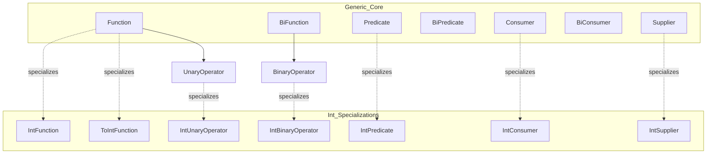

# Functional Interfaces and Lambdas (for TypeScript Developers)

**Date:** 2026-04-17
**Tags:** java, functional, lambda, streams

> TypeScript treats functions as first-class values. Java does not — every "function" in Java is an **object** implementing a single-abstract-method interface. Lambdas are compiler sugar for constructing those objects. This doc shows how to fluently read, write, and compose Java functions from a TS mental model.

## Table of Contents

1. [Summary](#summary)
2. [`@FunctionalInterface` and the SAM Rule](#functionalinterface-and-the-sam-rule)
3. [The `java.util.function` Package](#the-javautilfunction-package)
4. [Lambda Syntax](#lambda-syntax)
5. [Lambda Bodies: Expression vs Block](#lambda-bodies-expression-vs-block)
6. [Method References](#method-references)
7. [Variable Capture: Effectively Final](#variable-capture-effectively-final)
8. [Composition](#composition)
9. [Writing Custom Functional Interfaces](#writing-custom-functional-interfaces)
10. [Checked Exceptions in Lambdas](#checked-exceptions-in-lambdas)
11. [Common Usage Patterns](#common-usage-patterns)
12. [TS to Java Cheat Sheet](#ts-to-java-cheat-sheet)
13. [Gotchas](#gotchas)
14. [Related](#related)
15. [References](#references)

---

## Summary

In TypeScript, a function is a value:

```ts
const add = (x: number, y: number) => x + y;
const double: (n: number) => number = (n) => n * 2;
```

In Java, **there are no standalone function values**. A function-looking value is always an **object** whose class implements an interface with exactly one abstract method (a "Single Abstract Method" or **SAM** interface). The lambda expression `(x, y) -> x + y` is not a function literal — it is a compact way to create an anonymous object that implements whatever SAM interface the compiler expects in that position.

Three things follow from this:

1. **Every lambda has a target type.** The compiler has to know which functional interface to instantiate. `var f = (x) -> x + 1;` does **not** compile — there is no inferable target.
2. **Function "types" are nominal, not structural.** `Function<String, Integer>` and `ToIntFunction<String>` are not assignable to each other even though their shape is identical.
3. **You compose functions with helper methods** like `.andThen(...)` and `.compose(...)`, because `Function` is an object that can carry methods — not a bare callable.

The JDK ships a toolbox of general-purpose functional interfaces in `java.util.function` (`Function`, `Predicate`, `Consumer`, `Supplier`, …), and most libraries (Streams, Optional, Reactor, Spring) are written against those types.

---

## `@FunctionalInterface` and the SAM Rule

### What counts as a functional interface?

Any interface is a functional interface if it has **exactly one abstract method**. `default` methods, `static` methods, and methods inherited from `java.lang.Object` (like `equals`, `hashCode`, `toString`) do **not** count toward the SAM tally.

```java
@FunctionalInterface
public interface Runnable {
    void run();
}

@FunctionalInterface
public interface Comparator<T> {
    int compare(T a, T b);

    // default and static methods allowed — SAM count is still 1
    default Comparator<T> reversed() { /* ... */ }
    static <T> Comparator<T> naturalOrder() { /* ... */ }
    // inherited Object methods (equals) don't count either
    boolean equals(Object obj);
}
```

### The `@FunctionalInterface` annotation

`@FunctionalInterface` is **optional documentation plus a compile-time check**. Putting it on an interface tells the compiler: "fail the build if this ever stops being a SAM." The interface is still a functional interface without the annotation — but adding it protects you against future maintainers accidentally adding a second abstract method.

```java
@FunctionalInterface
public interface NotActuallyFunctional {
    void a();
    void b(); // compile error: "Invalid '@FunctionalInterface' annotation; not a functional interface"
}
```

Mental model: `@FunctionalInterface` is to SAM interfaces what `@Override` is to method overrides — an opt-in guardrail.

---

## The `java.util.function` Package

Instead of a single "function type," Java ships a family of specialized interfaces, each covering a common arity/return shape. You will see these everywhere — Streams, Reactor, Spring APIs, your own code.

### Core types

| Interface | Signature | TS equivalent |
|---|---|---|
| `Function<T, R>` | `R apply(T t)` | `(t: T) => R` |
| `BiFunction<T, U, R>` | `R apply(T t, U u)` | `(t: T, u: U) => R` |
| `Predicate<T>` | `boolean test(T t)` | `(t: T) => boolean` |
| `BiPredicate<T, U>` | `boolean test(T t, U u)` | `(t: T, u: U) => boolean` |
| `Consumer<T>` | `void accept(T t)` | `(t: T) => void` |
| `BiConsumer<T, U>` | `void accept(T t, U u)` | `(t: T, u: U) => void` |
| `Supplier<T>` | `T get()` | `() => T` |
| `UnaryOperator<T>` | `T apply(T t)` — extends `Function<T, T>` | `(t: T) => T` |
| `BinaryOperator<T>` | `T apply(T a, T b)` — extends `BiFunction<T, T, T>` | `(a: T, b: T) => T` |
| `Runnable` | `void run()` | `() => void` |
| `Callable<V>` | `V call() throws Exception` | `() => Promise<V>` (loosely) |

`UnaryOperator<T>` and `BinaryOperator<T>` are not new shapes — they are named specializations used when input and output are the same type (e.g. `String::trim` fits `UnaryOperator<String>`).

### Type hierarchy



### Primitive specializations (and why)

Generics in Java only hold reference types — you cannot write `Function<int, int>`. Using `Function<Integer, Integer>` forces **autoboxing** on every call, which is both slower and allocates heap objects. To avoid that, `java.util.function` ships primitive variants for `int`, `long`, and `double`:

| Pattern | Examples |
|---|---|
| `Int*Function` — produces `int` output | `IntSupplier`, `ToIntFunction<T>`, `ToIntBiFunction<T,U>` |
| `*ToInt*` — input is generic, output is `int` | `ToIntFunction<T>` |
| `IntFunction<R>` — input is `int`, output is generic | `IntFunction<R>` |
| `IntUnaryOperator` | `int applyAsInt(int)` |
| `IntBinaryOperator` | `int applyAsInt(int, int)` |
| `IntPredicate` | `boolean test(int)` |
| `IntConsumer` | `void accept(int)` |
| Same for `Long*` and `Double*` | `LongFunction`, `DoubleSupplier`, `LongToDoubleFunction`, etc. |

Example of where this shows up:

```java
IntStream.range(0, 1_000_000)
    .filter(n -> n % 2 == 0)            // IntPredicate — no boxing
    .map(n -> n * n)                     // IntUnaryOperator
    .sum();                              // returns int
```

If this were `Stream<Integer>` every element would be boxed. Primitive specializations matter most in hot loops and streams.

---

## Lambda Syntax

A lambda is `(params) -> body`. Everything else is shorthand.

```java
// Full form
BiFunction<Integer, Integer, Integer> add = (Integer x, Integer y) -> { return x + y; };

// Parameter types inferred from target type
BiFunction<Integer, Integer, Integer> add2 = (x, y) -> x + y;

// Single parameter — parens optional when type is inferred
Function<String, String> upper = x -> x.toUpperCase();

// Single explicit-typed parameter — parens REQUIRED
Function<String, Integer> len = (String s) -> s.length();

// Zero parameters
Supplier<String> hello = () -> "hi";

// Void return
Consumer<String> log = msg -> System.out.println(msg);
```

Rules worth internalising:

- **Parameter parens are optional** only when there is exactly one parameter **and** its type is inferred.
- **You cannot mix inferred and explicit parameter types.** Either all params have declared types, or none do.
- **`var` is allowed on parameters** (Java 11+): `(var x, var y) -> x + y` — but mostly useful for adding annotations: `(@NonNull var s) -> s.length()`.

---

## Lambda Bodies: Expression vs Block

Two body shapes:

**Expression body** — a single expression, no braces, no `return`:

```java
Function<Integer, Integer> doubler = x -> x * 2;
Predicate<String> isEmpty = s -> s.isEmpty();
```

**Block body** — braces, statements, explicit `return` if the target type is non-void:

```java
Function<String, Integer> parseOrZero = s -> {
    try {
        return Integer.parseInt(s);
    } catch (NumberFormatException e) {
        return 0;
    }
};

Consumer<String> logAndStore = msg -> {
    System.out.println(msg);
    history.add(msg);
    // no return needed — target is Consumer (void)
};
```

In a block body for a non-void functional interface, **every path must return**. The compiler enforces this the same way it does for regular methods.

---

## Method References

Method references are even shorter shorthand for "call this existing method." Four flavours:

| Form | Meaning | Equivalent lambda |
|---|---|---|
| `ClassName::staticMethod` | call a static method | `(args) -> ClassName.staticMethod(args)` |
| `instance::method` | bound — call a method on a specific object | `(args) -> instance.method(args)` |
| `ClassName::instanceMethod` | unbound — first arg is the receiver | `(x, args) -> x.instanceMethod(args)` |
| `ClassName::new` | constructor reference | `(args) -> new ClassName(args)` |

```java
// Static
Function<String, Integer> parse = Integer::parseInt;
// same as: s -> Integer.parseInt(s)

// Bound instance — this particular logger
Logger log = LoggerFactory.getLogger(MyService.class);
Consumer<String> info = log::info;
// same as: msg -> log.info(msg)

// Unbound instance — method on the argument
Function<String, String> upper = String::toUpperCase;
// same as: s -> s.toUpperCase()

// Constructor
Function<String, BigDecimal> toDecimal = BigDecimal::new;
// same as: s -> new BigDecimal(s)

// Constructor with arrays
IntFunction<String[]> stringArray = String[]::new;
// same as: size -> new String[size]
```

The unbound form (`ClassName::instanceMethod`) is the one that trips people up. Read it as: "a function that takes the receiver as its first argument."

```java
List<String> names = List.of("bob", "alice", "carol");
names.stream()
    .map(String::toUpperCase)          // Function<String, String> — unbound
    .forEach(System.out::println);     // Consumer<String> — bound to System.out
```

---

## Variable Capture: Effectively Final

A lambda (or inner class) can read local variables from the enclosing scope, but only if they are **final or effectively final** — meaning they are assigned exactly once.

```java
String prefix = "user-";                  // effectively final — never reassigned
Function<String, String> prefixed = s -> prefix + s;  // OK

String greeting = "hi";
greeting = "hello";                        // reassigned
Function<String, String> bad = s -> greeting + s;     // compile error
```

**Why this restriction exists:** The JVM implements lambda capture by copying the value into the generated class. If the outer variable could be reassigned later, the lambda would silently hold a stale value. Rather than wallpaper over that footgun, Java forbids it.

### Contrast with TypeScript

TS closures capture **variable bindings** — a lambda reading `x` will see reassignments made later:

```ts
let count = 0;
const log = () => console.log(count);
count = 10;
log(); // 10
```

In Java you cannot do this with a local. Workarounds:

- **Use a mutable container** — `AtomicInteger`, `int[] counter = {0}`, or an object field.
- **Refactor to a field** on an enclosing class (fields are not subject to the effectively-final rule; only locals are).

```java
AtomicInteger count = new AtomicInteger(0);
Runnable log = () -> System.out.println(count.get());
count.set(10);
log.run();  // 10
```

This restriction also makes lambdas safer to pass to other threads — the captured state is immutable (at least the reference), and if you really need mutability you have to reach for a concurrency-aware primitive.

---

## Composition

Because lambdas are objects implementing interfaces, the interfaces themselves can carry helper `default` methods. `Function` and `Predicate` in particular have rich composition APIs.

### `Function<T, R>` composition

```java
Function<String, String> trim = String::trim;
Function<String, Integer> len  = String::length;

// andThen: apply this, then feed result into g — left to right
Function<String, Integer> trimmedLen = trim.andThen(len);
trimmedLen.apply("  hi  ");  // 2

// compose: apply g first, then this — right to left
Function<String, Integer> trimmedLen2 = len.compose(trim);
// equivalent to trim.andThen(len)
```

Read `a.andThen(b)` as "a, then b"; read `a.compose(b)` as "b, then a" (like math `(a ∘ b)(x) = a(b(x))`).

### `Predicate<T>` composition

```java
Predicate<String> notBlank  = s -> !s.isBlank();
Predicate<String> isShort   = s -> s.length() < 20;

Predicate<String> valid     = notBlank.and(isShort);
Predicate<String> anyOf     = notBlank.or(isShort);
Predicate<String> invalid   = notBlank.negate();         // equivalent to !notBlank

Predicate<String> isNull    = Objects::isNull;
Predicate<String> isNonNull = Predicate.not(isNull);      // static form (Java 11+)
```

### `Consumer<T>` composition

```java
Consumer<String> log   = System.out::println;
Consumer<String> store = history::add;

Consumer<String> both = log.andThen(store);
both.accept("hello");  // prints, then stores — in that order
```

`BiFunction`, `BiPredicate`, and `BiConsumer` all expose `andThen(...)` (adapted to their arity). `Supplier` does not — with no input, there is nothing to pipe.

---

## Writing Custom Functional Interfaces

When the JDK types do not express the intent you want, define your own SAM. Give it a **domain-meaningful name** and a method named for its behavior.

```java
@FunctionalInterface
public interface RetryPolicy {
    boolean shouldRetry(int attempt, Throwable error);
}

@FunctionalInterface
public interface PriceCalculator<I extends Item> {
    Money priceFor(I item, Customer customer);
}

@FunctionalInterface
public interface TriFunction<A, B, C, R> {
    R apply(A a, B b, C c);
}
```

Reasons to prefer a custom interface over `BiFunction<Integer, Throwable, Boolean>`:

- **Readability** — call sites read as `policy.shouldRetry(3, err)`, not `policy.apply(3, err)`.
- **Arity beyond two** — the JDK stops at `Bi*`. Need three inputs? Write your own `TriFunction` or a domain-named interface.
- **Checked exceptions** — see next section.
- **Documentation** — Javadoc the contract (e.g. "must be pure and idempotent").

Keep the interface small and focused. If you find yourself adding a second abstract method, it is no longer functional — consider a regular interface or a `record`.

---

## Checked Exceptions in Lambdas

Java's checked-exception system is the single biggest friction point for functional code. Most JDK functional interfaces declare **no checked exceptions**, so any lambda body that calls a method throwing `IOException`, `SQLException`, etc. will not compile.

```java
Function<Path, String> readFile = p -> Files.readString(p);
// compile error: unhandled IOException
```

### Option 1: wrap and rethrow as unchecked

```java
Function<Path, String> readFile = p -> {
    try {
        return Files.readString(p);
    } catch (IOException e) {
        throw new UncheckedIOException(e);
    }
};
```

Verbose, but honest. The JDK even ships `UncheckedIOException` specifically for this pattern.

### Option 2: helper that wraps for you

```java
public final class Unchecked {
    @FunctionalInterface
    public interface IOFunction<T, R> {
        R apply(T t) throws IOException;
    }

    public static <T, R> Function<T, R> io(IOFunction<T, R> fn) {
        return t -> {
            try { return fn.apply(t); }
            catch (IOException e) { throw new UncheckedIOException(e); }
        };
    }
}

// Usage:
paths.stream()
     .map(Unchecked.io(Files::readString))
     .forEach(System.out::println);
```

This is the pattern most codebases settle on — a small utility with `IOFunction`, `SqlFunction`, etc., each paired with a wrapping adapter.

### Option 3: Lombok `@SneakyThrows`

Lombok's `@SneakyThrows` removes the compiler's checked-exception check without changing the throw. You can attach it to a method and use that method from a lambda:

```java
@SneakyThrows
static String readFileSneaky(Path p) {
    return Files.readString(p);
}

Function<Path, String> read = Main::readFileSneaky;
```

Use sparingly. Callers cannot see that `IOException` might fly out of `read.apply(...)`, which is a debugging hazard.

### Option 4: libraries like Vavr

Vavr provides `CheckedFunction0..8`, `CheckedRunnable`, `CheckedPredicate`, etc., whose SAMs declare `throws Throwable`. You can compose them, map exceptions, or convert to `Try<R>`:

```java
CheckedFunction1<Path, String> read = Files::readString;
Try<String> result = Try.of(() -> read.apply(path));
result
    .onSuccess(System.out::println)
    .onFailure(e -> log.error("read failed", e));
```

If you live in a functional codebase, Vavr (or a smaller equivalent) pays for itself quickly.

---

## Common Usage Patterns

### Streams — the main consumer of functional interfaces

```java
List<User> activeAdmins = users.stream()
    .filter(User::isActive)                            // Predicate<User>
    .filter(u -> u.role() == Role.ADMIN)               // Predicate<User>
    .sorted(Comparator.comparing(User::createdAt))     // Comparator via Function
    .toList();

Map<Department, List<User>> byDept = users.stream()
    .collect(Collectors.groupingBy(User::department)); // Function<User, Department>

int totalAge = users.stream()
    .mapToInt(User::age)                               // ToIntFunction<User>
    .sum();

users.forEach(u -> audit.record(u.id()));              // Consumer<User>
```

### `Optional`

```java
Optional<User> maybe = repo.findById(id);

// Transform if present
Optional<String> name = maybe.map(User::name);         // Function

// Chain optional-returning calls
Optional<Address> addr = maybe.flatMap(User::primaryAddress);

// Default supplier (lazy)
User u = maybe.orElseGet(User::guest);                 // Supplier<User>

// Side effect
maybe.ifPresent(user -> log.info("loaded {}", user));  // Consumer<User>

// Filter
Optional<User> active = maybe.filter(User::isActive);  // Predicate<User>
```

### Reactor (`Mono` / `Flux`)

```java
Mono<UserDto> result = userRepo.findById(id)            // Mono<User>
    .filter(User::isActive)                              // Predicate<User>
    .map(UserMapper::toDto)                              // Function<User, UserDto>
    .flatMap(dto -> enrichmentClient.enrich(dto))        // Function<UserDto, Mono<UserDto>>
    .doOnNext(dto -> log.info("enriched {}", dto.id())) // Consumer<UserDto>
    .defaultIfEmpty(UserDto.EMPTY);
```

Reactor's operators take the same JDK functional interfaces — `map` takes `Function`, `filter` takes `Predicate`, `doOnNext` takes `Consumer`. Everything you learn about `Stream` transfers.

### Spring — `WebClient` and more

```java
userClient.get()
    .uri("/users/{id}", id)
    .retrieve()
    .onStatus(
        HttpStatusCode::is4xxClientError,                         // Predicate<HttpStatusCode>
        response -> Mono.error(new UserLookupException(id))       // Function<ClientResponse, Mono<Throwable>>
    )
    .bodyToMono(User.class);

// @Bean factory methods are full of lambdas
@Bean
public RouterFunction<ServerResponse> routes(UserHandler handler) {
    return RouterFunctions.route()
        .GET("/users/{id}", handler::getById)            // method reference as HandlerFunction
        .POST("/users", handler::create)
        .build();
}

// Security config — lambda DSL everywhere
@Bean
public SecurityFilterChain filterChain(HttpSecurity http) throws Exception {
    return http
        .authorizeHttpRequests(auth -> auth
            .requestMatchers("/public/**").permitAll()
            .anyRequest().authenticated())
        .oauth2ResourceServer(oauth2 -> oauth2.jwt(Customizer.withDefaults()))
        .build();
}
```

---

## TS to Java Cheat Sheet

| TypeScript | Java |
|---|---|
| `(x: T) => R` | `Function<T, R>` |
| `(x: T) => boolean` | `Predicate<T>` |
| `(x: T) => void` | `Consumer<T>` |
| `() => T` | `Supplier<T>` |
| `() => void` | `Runnable` |
| `(x: T, y: U) => R` | `BiFunction<T, U, R>` |
| `(x: T, y: U) => boolean` | `BiPredicate<T, U>` |
| `(x: T, y: U) => void` | `BiConsumer<T, U>` |
| `(x: T) => T` | `UnaryOperator<T>` |
| `(a: T, b: T) => T` | `BinaryOperator<T>` |
| `(n: number) => number` (hot loop) | `IntUnaryOperator` (avoid boxing) |
| `x => x.field` | `x -> x.getField()` or `T::getField` |
| `x => x.method()` | `T::method` |
| Arrow fn in callback | Lambda or method reference |
| `arr.map(f)` | `stream.map(f).toList()` |
| `arr.filter(p)` | `stream.filter(p).toList()` |
| `arr.forEach(fn)` | `list.forEach(fn)` or `stream.forEach(fn)` |
| `arr.reduce((a, b) => a + b, 0)` | `stream.reduce(0, Integer::sum)` |
| `f(g(x))` | `f.compose(g).apply(x)` or `g.andThen(f).apply(x)` |
| `(x) => !p(x)` | `p.negate()` or `Predicate.not(p)` |
| `(x) => p1(x) && p2(x)` | `p1.and(p2)` |

---

## Gotchas

### 1. Target type is required

```java
var f = (String s) -> s.length(); // compile error — no target type for var
```

The compiler cannot decide between `Function<String, Integer>`, `ToIntFunction<String>`, a custom SAM, etc. Fix: declare the type explicitly.

```java
Function<String, Integer> f = s -> s.length();   // OK
ToIntFunction<String> g = String::length;        // OK
```

### 2. Ambiguous overloads

```java
void schedule(Runnable r) { ... }
void schedule(Callable<?> c) { ... }

schedule(() -> doThing());  // ambiguous — could be either
```

Both interfaces are SAMs with `()` arity. The compiler cannot pick. Fix with an explicit cast or pass a typed variable:

```java
schedule((Runnable) () -> doThing());
```

This often bites you when a method is overloaded with `Consumer<X>` and `Function<X, Y>`.

### 3. Nominal typing — interfaces are not interchangeable

```java
Function<String, String> f = String::trim;
UnaryOperator<String> g = f;   // compile error
```

Even though every `UnaryOperator<String>` *is a* `Function<String, String>` (by inheritance), the reverse is not true. The compiler treats them as distinct nominal types. A cast works only if the runtime object actually implements the target interface.

### 4. Primitive boxing sneaks in

```java
Function<Integer, Integer> square = x -> x * x;   // boxes on every call
IntUnaryOperator fastSquare = x -> x * x;         // no boxing
```

In a hot path, always reach for the `Int*`/`Long*`/`Double*` primitives.

### 5. `this` in lambdas vs anonymous classes

Inside a lambda, `this` refers to the **enclosing instance** (same as outside the lambda). Inside an anonymous class, `this` refers to the anonymous object itself.

```java
class MyService {
    private final String name = "svc";

    Runnable asLambda = () -> System.out.println(this.name);      // "svc"
    Runnable asAnon = new Runnable() {
        @Override public void run() {
            // System.out.println(this.name); // compile error — Runnable has no `name`
            System.out.println(MyService.this.name);               // explicit outer
        }
    };
}
```

This is one of the real semantic differences between lambdas and anonymous classes — lambdas do **not** create a new `this` scope.

### 6. `null` and generic primitive specializations

`ToIntFunction<T>` must return a real `int`. A lambda that "returns null" will not compile for the primitive variants. Use the boxed `Function<T, Integer>` if `null` is a possible result — and handle it at the call site.

### 7. Stream elements and `Function.identity()`

When you need a no-op function (common in collectors), use `Function.identity()`:

```java
Map<UUID, User> byId = users.stream()
    .collect(Collectors.toMap(User::id, Function.identity()));
```

It is equivalent to `u -> u`, but clearer and avoids a tiny object allocation on each call.

### 8. `Comparator` building

`Comparator.comparing(Function)` and its primitive cousins produce composable comparators:

```java
Comparator<User> byLastThenFirst =
    Comparator.comparing(User::lastName)
              .thenComparing(User::firstName)
              .thenComparingInt(User::age);
```

Much nicer than writing `(a, b) -> ...` by hand, and gets primitive specialization for `thenComparingInt`/`Long`/`Double`.

---

## Related

- [`type-system-for-ts-devs.md`](./type-system-for-ts-devs.md) — generics, variance, and how `Function<T, R>` interacts with Java's type system.
- [`collections-and-streams.md`](./collections-and-streams.md) — where you will use most of these functional interfaces in practice.
- [`modern-java-features.md`](./modern-java-features.md) — pattern matching, records, switch expressions that pair well with functional style.
- [`../reactive-programming-java.md`](../reactive-programming-java.md) — applying lambdas in Reactor pipelines.

## References

- Oracle, *Java Tutorials: Lambda Expressions* — https://docs.oracle.com/javase/tutorial/java/javaOO/lambdaexpressions.html
- Oracle, *Java Tutorials: Method References* — https://docs.oracle.com/javase/tutorial/java/javaOO/methodreferences.html
- Javadoc, *package `java.util.function`* — https://docs.oracle.com/en/java/javase/21/docs/api/java.base/java/util/function/package-summary.html
- JSR 335, *Lambda Expressions for the Java Programming Language* — the spec that introduced lambdas in Java 8.
- Brian Goetz, *State of the Lambda* (design rationale) — https://cr.openjdk.org/~briangoetz/lambda/lambda-state-final.html
- Vavr, *Functional Interfaces and `Try`* — https://docs.vavr.io/
- Project Lombok, *`@SneakyThrows`* — https://projectlombok.org/features/SneakyThrows
