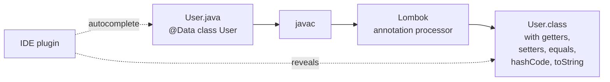
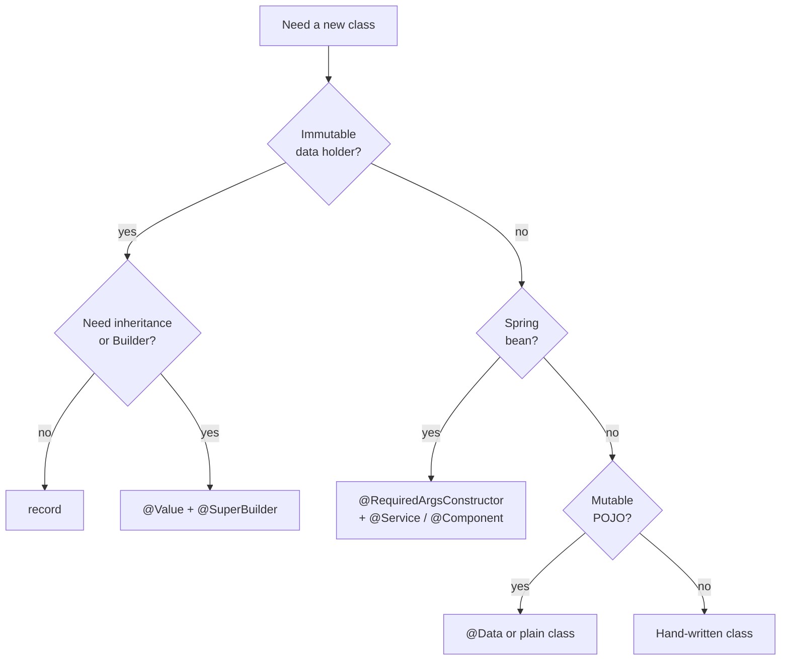

# Lombok and the Java Boilerplate Problem

Date: 2026-04-17
Tags: java, lombok, annotations, boilerplate, spring, records

## Table of Contents

1. [Summary](#summary)
2. [How Lombok Works](#how-lombok-works)
3. [Common Annotations](#common-annotations)
4. [@Data — The Swiss Army Knife](#data--the-swiss-army-knife)
5. [@RequiredArgsConstructor — Spring's Best Friend](#requiredargsconstructor--springs-best-friend)
6. [@Builder — Fluent Object Construction](#builder--fluent-object-construction)
7. [@Value — Immutable Classes Before Records](#value--immutable-classes-before-records)
8. [@Slf4j — Zero-Boilerplate Logging](#slf4j--zero-boilerplate-logging)
9. [@SneakyThrows — The Controversial One](#sneakythrows--the-controversial-one)
10. [@NonNull — Runtime Null Check Generation](#nonnull--runtime-null-check-generation)
11. [Records vs Lombok — Decision Tree](#records-vs-lombok--decision-tree)
12. [Lombok + IDE Quirks](#lombok--ide-quirks)
13. [Common Mistakes](#common-mistakes)
14. [When NOT to Use Lombok](#when-not-to-use-lombok)
15. [The Project's Patterns](#the-projects-patterns)
16. [Related](#related)
17. [References](#references)

---

## Summary

Lombok is a Java annotation processor that generates boilerplate code at compile time — getters, setters, constructors, `equals`/`hashCode`, `toString`, builders, and loggers. It makes a Java class look closer to a TypeScript `interface`, `type`, or a modern `record`: a short declaration of the fields, with the mechanics filled in for you. Every Spring project you touch will use it. The catch: because Lombok silently writes bytecode, when something breaks — a cyclic `toString`, a broken `equals`, a missing constructor at injection time — you are debugging code you never wrote. The best mental model is: "Lombok is an IDE-assisted macro." Know what each annotation generates, because that generated code is real, it runs, and it can bite.

---

## How Lombok Works

Lombok plugs into `javac` via the standard Java annotation processor API. During compilation:

1. `javac` parses your source.
2. Annotation processors (including Lombok) inspect the AST.
3. Lombok adds additional methods and fields directly into the bytecode.
4. Your `.java` file stays clean; your `.class` file has the generated methods.



TS analogy: imagine a TS transformer that reads `@Data` decorators and, at `tsc` time, emits the getter/setter methods into the `.d.ts` and `.js` — but the `.ts` source file never shows them. That's Lombok.

### Setup (Gradle)

```groovy
dependencies {
    compileOnly 'org.projectlombok:lombok'
    annotationProcessor 'org.projectlombok:lombok'
}
```

Both entries matter:

- `compileOnly` — Lombok annotations are visible during compile but not shipped at runtime (they're discarded after processing).
- `annotationProcessor` — registers the processor with `javac` so it actually runs.

Missing `annotationProcessor` is the #1 Lombok setup bug: the code "compiles" in the IDE (because the IntelliJ plugin handles it) but Gradle fails with "cannot find symbol getName()".

---

## Common Annotations

| Annotation | Generates |
|---|---|
| `@Getter` | public getter for every field (or just the annotated field) |
| `@Setter` | public setter for every non-final field |
| `@NoArgsConstructor` | no-arg constructor |
| `@AllArgsConstructor` | constructor with all fields |
| `@RequiredArgsConstructor` | constructor with `final` + `@NonNull` fields |
| `@ToString` | `toString()` built from field values |
| `@EqualsAndHashCode` | `equals()` and `hashCode()` built from fields |
| `@Data` | `@Getter` + `@Setter` + `@ToString` + `@EqualsAndHashCode` + `@RequiredArgsConstructor` |
| `@Value` | Immutable `@Data` — all fields `final`, no setters, class `final` |
| `@Builder` | Builder pattern (fluent construction) |
| `@Slf4j` | Adds `private static final Logger log = ...` |
| `@SneakyThrows` | Lets you throw checked exceptions without declaring them |
| `@NonNull` | Generates a null check on parameters/fields |

TS mental map:

- `@Data` class ≈ mutable TS class with public fields
- `@Value` class ≈ `readonly` TS class / `Readonly<T>`
- `record` (native Java 14+) ≈ TS `type` or discriminated-union payload
- `@Builder` ≈ fluent builder like `knex().select().where().limit()`
- `@Slf4j` ≈ `const log = getLogger(__filename)` at the top of a module

---

## @Data — The Swiss Army Knife

```java
@Data
public class User {
    private Long id;
    private String name;
    private String email;
}
```

Expands (conceptually) to:

```java
public class User {
    private Long id;
    private String name;
    private String email;

    public User() {}                                   // from @RequiredArgsConstructor (no required fields here)
    public Long getId() { return id; }
    public void setId(Long id) { this.id = id; }
    public String getName() { return name; }
    public void setName(String name) { this.name = name; }
    public String getEmail() { return email; }
    public void setEmail(String email) { this.email = email; }

    @Override public boolean equals(Object o) { /* compares id, name, email */ }
    @Override public int hashCode() { /* hashes id, name, email */ }
    @Override public String toString() { return "User(id=" + id + ", name=" + name + ", email=" + email + ")"; }
}
```

### Warnings

`@Data` is convenient but loaded with footguns:

- **Mutable by default.** Setters on every field. Domain entities usually want invariants, not open setters.
- **`equals`/`hashCode` on all fields.** If you mutate a field after adding the object to a `HashSet` or using it as a `HashMap` key, you lose the object — the hash moved but the bucket did not.
- **JPA entities + `@Data` = trouble.** The generated `equals` touches every field, including lazy-loaded associations. That triggers N+1 fetches or `LazyInitializationException`, and can easily cause infinite recursion on bidirectional relationships.

**Rules of thumb:**

- DTOs in new code → prefer `record` (Java 17+).
- Immutable values → `@Value` or `record`.
- Simple mutable POJOs (form binding, legacy shapes) → `@Data` is fine.
- JPA entities → never `@Data`. Use `@Getter`/`@Setter` selectively and write `equals`/`hashCode` by hand (usually on the ID only).

---

## @RequiredArgsConstructor — Spring's Best Friend

This is the most important Lombok annotation in a modern Spring codebase.

```java
@Service
@RequiredArgsConstructor
public class OrderService {
    private final OrderRepository repo;
    private final EmailSender emailer;

    public void placeOrder(Order order) {
        repo.save(order);
        emailer.send(order);
    }
}
```

Lombok generates:

```java
public OrderService(OrderRepository repo, EmailSender emailer) {
    this.repo = repo;
    this.emailer = emailer;
}
```

Spring sees a single constructor and uses it for dependency injection automatically (no `@Autowired` needed since Spring 4.3). The `final` fields guarantee the service is fully initialised and immutable after construction.

TS parallel: it is functionally similar to TypeScript's parameter-property constructor shorthand:

```ts
class OrderService {
  constructor(
    private readonly repo: OrderRepository,
    private readonly emailer: EmailSender,
  ) {}
}
```

You will see `@RequiredArgsConstructor` on essentially every `@Service`, `@Component`, `@Controller`, and `@Repository` in a current-generation Spring codebase.

---

## @Builder — Fluent Object Construction

```java
@Builder
public class HttpRequest {
    private String url;
    private HttpMethod method;
    private Map<String, String> headers;
    private String body;
}

HttpRequest request = HttpRequest.builder()
    .url("https://api.example.com")
    .method(HttpMethod.POST)
    .body("{}")
    .build();
```

Useful when:

- A class has many optional fields (avoids telescoping constructors).
- You want named arguments at call sites (Java has no native named args).
- You want to build objects step by step, sometimes conditionally.

### Useful options

```java
@Builder
public class HttpRequest {
    private String url;
    @Builder.Default
    private HttpMethod method = HttpMethod.GET;      // default value in builder

    @Singular
    private List<String> tags;                       // adds .tag("a") and .tags(list)
}
```

- `@Builder.Default` — preserve default values when the caller omits the field.
- `@Singular` — collection fields get a singular adder (`.tag("foo")`) plus the plural (`.tags(list)`).
- `@Builder(toBuilder = true)` — adds `instance.toBuilder()` to create a builder pre-populated from an existing instance. This is the Java equivalent of `{ ...existing, field: newValue }`.

```java
HttpRequest updated = request.toBuilder().body("new body").build();
```

### Inheritance — `@SuperBuilder`

Plain `@Builder` does not handle inheritance correctly. If `Subclass extends Superclass` and both are `@Builder`, the subclass builder cannot set superclass fields. Use `@SuperBuilder` on both to fix this.

---

## @Value — Immutable Classes Before Records

```java
@Value
public class Point {
    int x;
    int y;
}
```

Generates (conceptually):

```java
public final class Point {
    private final int x;
    private final int y;

    public Point(int x, int y) { this.x = x; this.y = y; }
    public int getX() { return x; }
    public int getY() { return y; }
    // equals, hashCode, toString based on x, y
}
```

The class is `final`, fields are `private final`, there are no setters. This is Lombok's answer to the "value object" shape — predating records.

Records (Java 14+) supersede `@Value` for new code. You will still see `@Value` in codebases that started before Java 14 or that mix domain patterns records cannot express (e.g. inheritance, `@Builder` integration via `@Value @Builder`).

---

## @Slf4j — Zero-Boilerplate Logging

```java
@Service
@Slf4j
public class OrderService {
    public void placeOrder(Order order) {
        log.info("Placing order {}", order.getId());
    }
}
```

Generates:

```java
private static final org.slf4j.Logger log =
    org.slf4j.LoggerFactory.getLogger(OrderService.class);
```

Variants:

- `@Slf4j` — SLF4J facade. The canonical choice in Spring.
- `@Log4j2` — direct Log4j 2.
- `@CommonsLog` — Apache Commons Logging.
- `@Log` — `java.util.logging`.

Stick with `@Slf4j` unless the project says otherwise. Spring Boot's default logging backend (Logback) implements SLF4J.

---

## @SneakyThrows — The Controversial One

Java has checked exceptions — exceptions you must either `catch` or declare with `throws`. Lambdas hate checked exceptions because the functional interfaces (`Function`, `Consumer`, `Supplier`) do not declare them.

```java
@SneakyThrows
public String readFile(String path) {
    return Files.readString(Paths.get(path));   // IOException — but no "throws" clause
}
```

Under the hood `@SneakyThrows` uses a JVM trick: checked exceptions can be thrown without declaration if the compiler is told (via an unchecked cast in bytecode) that they are unchecked. The exception still propagates normally — callers just cannot catch it by its checked type without a workaround.

Pros:

- Cleans up lambdas that wrap I/O calls.
- Removes noise in throwaway glue code.

Cons:

- Hides the exception from the type system. Callers are surprised.
- Makes error handling flow ambiguous.

Use sparingly, and never on public API of a library.

---

## @NonNull — Runtime Null Check Generation

```java
public void setName(@NonNull String name) {
    this.name = name;
}
```

Generates a fail-fast check:

```java
if (name == null) {
    throw new NullPointerException("name is marked non-null but is null");
}
```

Also works on fields when combined with `@RequiredArgsConstructor` or `@AllArgsConstructor` — the generated constructor null-checks each `@NonNull` field. This is cheap, safe, and useful at boundary layers (controllers, service entry points) where null should never arrive.

Note: `lombok.NonNull` is not the same as `jakarta.validation.constraints.NotNull`. The former is a runtime guard; the latter is a Bean Validation constraint.

---

## Records vs Lombok — Decision Tree

| What you want | Reach for |
|---|---|
| Immutable value holder with data | `record` |
| Immutable value with custom methods or complex `equals` | `record` with custom methods |
| Mutable data holder (form, legacy shape) | `@Data` or plain class |
| Spring `@Service` with DI | `@RequiredArgsConstructor` + `@Service` |
| Complex multi-field construction | `@Builder` (or `record` + static factory) |
| Logging | `@Slf4j` |
| Inheritance + value semantics | `@Value` + `@SuperBuilder` (records don't extend) |



Records ate most of Lombok's territory for value types. But `@RequiredArgsConstructor`, `@Builder`, and `@Slf4j` remain essential even in a records-first codebase.

---

## Lombok + IDE Quirks

Because Lombok modifies bytecode, the IDE does not see the generated methods from the `.java` source alone. You need plugin support:

- **IntelliJ IDEA**: Lombok support is built in. Enable *Build, Execution, Deployment → Compiler → Annotation Processors → Enable annotation processing*.
- **VS Code**: the Microsoft Java extension pack handles Lombok out of the box after a reload.
- **Eclipse**: run `lombok.jar` once to install the agent into your Eclipse install.

Without the plugin/agent: red squiggles on `user.getName()` ("method not found"), even though the code compiles fine on the command line. If you see that, suspect IDE config, not your code.

---

## Common Mistakes

1. **Forgetting `annotationProcessor` in Gradle.** `compileOnly` alone does not trigger generation. Symptom: command-line build fails with "cannot find symbol getName()" even though IntelliJ is green.
2. **`@Data` on JPA entities.** The generated `equals`/`hashCode`/`toString` touches every field, including lazy associations. You get `LazyInitializationException`, infinite recursion on bidirectional relations, and N+1 fetches on equality checks.
3. **Mutable fields in `@EqualsAndHashCode`.** Put the object in a `HashSet`, mutate a field, and the object disappears — the hash bucket no longer matches.
4. **Overriding a Lombok-generated method.** If you hand-write a method with the same signature, Lombok skips generation silently — your version wins. This is sometimes intentional, sometimes an accidental shadowing you won't notice.
5. **Forgetting `@SuperBuilder`.** A `@Builder` on a subclass will not set superclass fields. You need `@SuperBuilder` on both classes for inheritance-aware builders.
6. **Mixing `@Builder` with `@AllArgsConstructor(access = PRIVATE)`.** Legal and sometimes desired, but confusing if you forget the constructor is private.
7. **Using `@Data` when you meant `@Value`.** You silently ship mutable "value objects". Reviewers often miss this.

---

## When NOT to Use Lombok

- **Published libraries.** Downstream consumers do not need Lombok at runtime (annotations are discarded) but compiling *against* your sources requires Lombok on their classpath. This is a real friction point for library authors. Consider delombok'ing published sources, or using records / hand-written code.
- **Teams with strong explicit-code preference.** Some teams prefer the verbosity of hand-written getters for clarity and IDE "go to definition" ergonomics.
- **Code that must be compiled by non-standard toolchains** (some older annotation-processing tools, custom transpilers).

### Alternatives

- **Records** — native Java, zero tooling, covers ~70% of `@Value`/`@Data` cases.
- **Google AutoValue** — generates code but via standard APT, produces visible `.java` files.
- **Immutables.org** — similar, richer feature set (builders, with-ers, defaults).
- **Kotlin data classes** — if you control language choice and your team is open.

---

## The Project's Patterns

In this `reactive-spring-webflux` codebase you will typically see:

- `@RequiredArgsConstructor` on every `@Service`, `@RestController`, and `@Component` — constructor injection of `final` dependencies.
- `@Slf4j` on anything that logs, with `log.info("...", args)` parameterised format.
- `@Data` and/or `@Builder` on domain shapes like `MovieInfo`, `Review`, request/response bodies. These are good candidates for migration to `record` where mutability is not required.
- `@NonNull` at controller boundaries on request payloads that must be present.

Migration heuristic: if a class is a pure immutable carrier of values, replace `@Data` / `@Value` with `record`. If it mutates (partial updates, MongoDB document objects before save), keep `@Data` and accept the trade-off.

---

## Related

- [Type System for TS Devs](type-system-for-ts-devs.md)
- [Equality and Identity](equality-and-identity.md)
- [Modern Java Features](modern-java-features.md)
- [Spring Fundamentals](../spring-fundamentals.md)

---

## References

- [Project Lombok — official documentation](https://projectlombok.org/)
- [Lombok feature overview](https://projectlombok.org/features/)
- [delombok — see the generated code](https://projectlombok.org/features/delombok)
- [JEP 395: Records (Java 16)](https://openjdk.org/jeps/395)
- [Baeldung — Lombok and JPA: what could go wrong?](https://www.baeldung.com/java-jpa-lombok)
- [SLF4J — Simple Logging Facade for Java](https://www.slf4j.org/)
