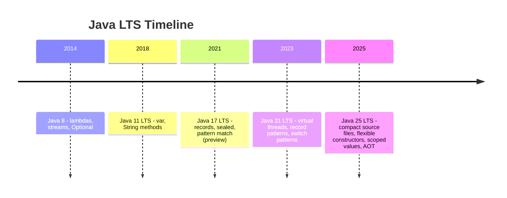
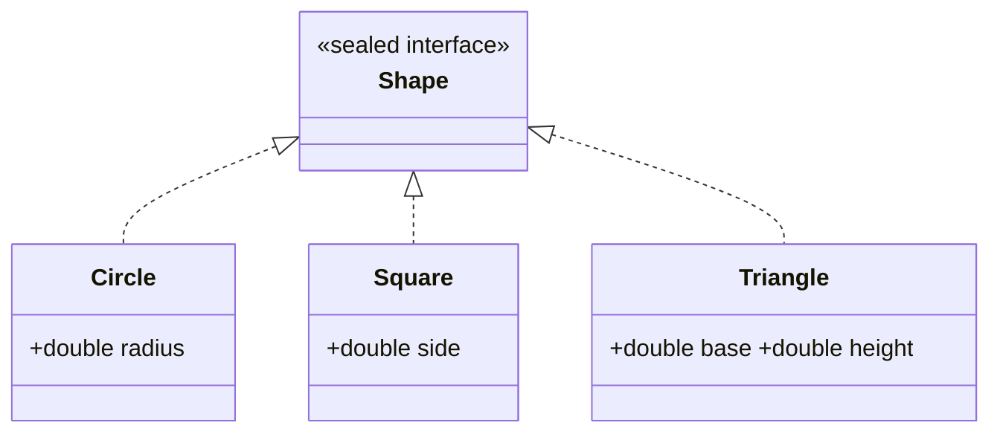
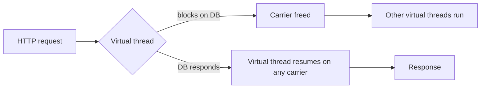

# Modern Java Features for TypeScript Developers

**Date:** 2026-04-17 | **Updated:** 2026-04-19
**Tags:** `java` `java17` `java21` `java25` `records` `sealed-types` `pattern-matching` `virtual-threads`

## Table of Contents

1. [Summary](#summary)
2. [Java Version Reality](#java-version-reality)
3. [Records — Immutable Data Classes](#records--immutable-data-classes)
4. [Sealed Types](#sealed-types)
5. [Pattern Matching](#pattern-matching)
6. [Record Patterns](#record-patterns)
7. [`var` — Local Variable Type Inference](#var--local-variable-type-inference)
8. [Text Blocks](#text-blocks)
9. [Switch Expressions (Deep Dive)](#switch-expressions-deep-dive)
10. [Stream Improvements](#stream-improvements)
11. [Virtual Threads](#virtual-threads)
12. [`Optional` Improvements](#optional-improvements)
13. [String API Modernization](#string-api-modernization)
14. [Java 25 LTS — What Changed Since 21](#java-25-lts--what-changed-since-21)
15. [What to Avoid in Modern Code](#what-to-avoid-in-modern-code)
16. [TS→Java Modern Feature Cheat Sheet](#tsjava-modern-feature-cheat-sheet)
17. [Related](#related)
18. [References](#references)

---

## Summary

Java evolved dramatically between 8 and 25. Modern Java (21 LTS / **25 LTS**) has **records**, **sealed types**, **pattern matching**, **`var`**, **text blocks**, **switch expressions**, **virtual threads**, **scoped values**, **compact source files**, **flexible constructor bodies**, and **module import declarations** — most of which bring Java closer to TypeScript's ergonomics while keeping static typing. Java 25 (GA September 2025) is the current LTS, adding AOT profiling, compact object headers, generational Shenandoah, and several language refinements. This doc is a tour of what a TS dev should reach for by default in new Java code. If you learned Java 8 patterns once and put it down, a lot of the verbosity you remember is gone.

---

## Java Version Reality



| Version | Year | Highlights |
|--------|------|-----------|
| Java 8 | 2014 | Lambdas, Streams, `Optional` — still widely deployed in legacy systems |
| Java 11 LTS | 2018 | `var`, new String methods, HTTP client |
| Java 17 LTS | 2021 | Records (stable), sealed types, pattern matching (preview), text blocks |
| Java 21 LTS | 2023 | Virtual threads, pattern matching for switch, record patterns |
| Java 22 | 2024 | Unnamed variables `_`, G1 region pinning, Gatherers (preview) |
| Java 23 | 2024 | Markdown javadoc, ZGC generational default, module imports (preview) |
| Java 24 | 2025 | `synchronized` no longer pins VTs, ClassFile API, post-quantum crypto, ZGC non-gen removed |
| **Java 25 LTS** | **2025** | **Compact source files, flexible constructors, scoped values, module imports, compact object headers, AOT profiling, generational Shenandoah** |

**Key constraint:** Spring Boot 3.x requires Java 17+. Java 25 is the current LTS target for new projects. Write modern Java 25 code — legacy patterns exist in old tutorials, but they are not what you should produce.

If a StackOverflow answer shows a 10-line `if (x instanceof Foo) { Foo f = (Foo) x; ... }` block, ignore it. There's a one-line version now.

---

## Records — Immutable Data Classes

Records (Java 16+, stable) are the **biggest quality-of-life change** for data-shaped classes.

```java
public record Point(int x, int y) {}
```

That single line auto-generates:

- All-args constructor `Point(int, int)`
- Accessor methods `x()` and `y()` — no `get` prefix
- `equals()`, `hashCode()`, `toString()`
- Fields are `private final` (immutable)

### Compact Constructor for Validation

```java
public record Email(String value) {
    public Email {
        if (value == null || !value.contains("@")) {
            throw new IllegalArgumentException("invalid email");
        }
    }
}
```

Note: no parameter list on the compact constructor. Validation runs before the fields are assigned.

### What Records Can Do

- Implement interfaces
- Declare static methods and static factories
- Declare nested records, enums, classes
- Have additional instance methods (derived from fields)
- Override the canonical constructor or accessors

```java
public record Money(long cents, String currency) {
    public static Money usd(long cents) {
        return new Money(cents, "USD");
    }
    public Money plus(Money other) {
        return new Money(cents + other.cents, currency);
    }
}
```

### What Records Cannot Do

- Extend another class (they implicitly `extends Record`)
- Add instance fields beyond the header
- Be mutable (fields are always `final`)

### When to Use

- DTOs
- Value objects (money, coordinates, identifiers)
- Tuples / intermediate return types
- API request and response bodies
- Event types

Compare to TypeScript:

```ts
// TS
interface Point { readonly x: number; readonly y: number }
```

```java
// Java
public record Point(int x, int y) {}
```

---

## Sealed Types

Sealed types (Java 17) give you **closed type hierarchies** — the closest Java has to TypeScript discriminated unions.

```java
public sealed interface Shape permits Circle, Square, Triangle {}

public record Circle(double radius) implements Shape {}
public record Square(double side) implements Shape {}
public record Triangle(double base, double height) implements Shape {}
```

The compiler enforces that **only the listed types** can implement `Shape`. This enables **exhaustive pattern matching** — the compiler knows the universe of subtypes.



### Variants

- `sealed interface` — preferred for data modeling (pair with records)
- `sealed class` — when you need shared implementation in a base class
- Permitted subtypes must declare themselves as one of:
  - `final` — no further extension
  - `sealed` — continue the sealing, declare its own permits
  - `non-sealed` — re-open the hierarchy for that branch

### Compare to TS

```ts
// TS discriminated union
type Shape =
  | { kind: 'circle'; radius: number }
  | { kind: 'square'; side: number }
  | { kind: 'triangle'; base: number; height: number };
```

```java
// Java
sealed interface Shape permits Circle, Square, Triangle {}
```

Java does not need a `kind` discriminant — the actual runtime type is the discriminator, and `instanceof` / pattern matching do the narrowing.

---

## Pattern Matching

Pattern matching is the major TS→Java ergonomic bridge. Three flavors:

### Pattern Matching for `instanceof` (Java 16)

```java
// Old — pre-Java-16 cast dance
if (shape instanceof Circle) {
    Circle c = (Circle) shape;
    return Math.PI * c.radius() * c.radius();
}

// New — pattern binding
if (shape instanceof Circle c) {
    return Math.PI * c.radius() * c.radius();
}
```

The binding `c` is scoped to the branch where the check is true. Flow-sensitive, like TS narrowing.

### Switch Expressions (Java 14)

```java
String size = switch (shape) {
    case Circle c   -> "round";
    case Square s   -> "square";
    default         -> "other";
};
```

- Returns a value, like `const x = someExpr` in TS
- **No fall-through** — arrow form auto-breaks
- No `break` needed
- Exhaustiveness checked at compile time

### Pattern Matching for Switch (Java 21)

```java
double area = switch (shape) {
    case Circle c   -> Math.PI * c.radius() * c.radius();
    case Square s   -> s.side() * s.side();
    case Triangle t -> 0.5 * t.base() * t.height();
};   // exhaustive — compiler knows Shape is sealed
```

No `default` needed — because `Shape` is sealed and all permitted types are covered, the compiler knows this is exhaustive. **This is the closest Java gets to TypeScript `switch` over a discriminated union.**

You can also add guards:

```java
String describe = switch (shape) {
    case Circle c when c.radius() > 100 -> "big circle";
    case Circle c                        -> "small circle";
    case Square s                        -> "a square";
    case Triangle t                      -> "a triangle";
};
```

---

## Record Patterns

Java 21 adds **deconstruction inside patterns** — destructuring at the language level.

```java
double area = switch (shape) {
    case Circle(double r)             -> Math.PI * r * r;
    case Square(double s)             -> s * s;
    case Triangle(double b, double h) -> 0.5 * b * h;
};
```

Nested deconstruction works too:

```java
record Line(Point start, Point end) {}

// Deconstruct two levels deep
if (line instanceof Line(Point(int x1, int y1), Point(int x2, int y2))) {
    // x1, y1, x2, y2 are all in scope
}
```

Comparable TS:

```ts
// TS destructuring inside case clauses (approximated)
switch (shape.kind) {
  case 'circle': { const { radius } = shape; return Math.PI * radius * radius; }
}
```

---

## `var` — Local Variable Type Inference

Java 10 added local-variable type inference via `var`.

```java
var list = new ArrayList<String>();    // ArrayList<String>
var map  = Map.of("a", 1, "b", 2);     // Map<String, Integer>
var user = userService.findById(id);   // whatever the return type is
```

### Rules

- **Local variables only** — no fields, no method parameters, no return types
- Must have an initializer on the same line
- Cannot initialize to `null` — nothing to infer from
- Cannot infer array literals without a type: `var a = {1, 2, 3};` fails

### When to Use

- The RHS makes the type obvious (constructor, literal, static factory)
- Verbosity hurts readability:
  ```java
  // Before
  Map<String, List<OrderLineItem>> groups = orderService.groupByCustomer(orders);
  // After
  var groups = orderService.groupByCustomer(orders);
  ```

### When Not to Use

- When the RHS is cryptic (`var x = compute();` — what is `x`?)
- When the inferred type is a non-obvious subtype you did not intend

`var` is to Java what `const` is to TS in terms of inference feel — but it is **not** a constness marker. For immutability use `final var`:

```java
final var result = compute();
```

---

## Text Blocks

Java 15 added multi-line string literals.

```java
String json = """
    {
      "name": "Batman",
      "year": 2022
    }
    """;
```

- Triple-quote delimiter
- Incidental leading whitespace is stripped based on the closing delimiter's indentation
- Escapes still work (`\n`, `\"`, etc.)

### No Interpolation (Yet)

Java does **not** have string interpolation. Your options:

```java
// Concatenation
String greet = "Hello " + name;

// String.format
String greet = String.format("Hello %s, age %d", name, age);

// String.formatted (Java 15+) — instance form, reads left-to-right
String greet = "Hello %s, age %d".formatted(name, age);
```

Compare to TS template literals:

```ts
const greet = `Hello ${name}, age ${age}`;
```

String templates were a preview feature in Java 21 but were withdrawn in Java 23 — the feature was pulled entirely. As of Java 25, there is no string interpolation in Java. Use `.formatted()` or concatenation.

---

## Switch Expressions (Deep Dive)

Switch expressions replace verbose if-else chains even without pattern matching. Multiple labels, arrow form, returns a value.

```java
int days = switch (month) {
    case JANUARY, MARCH, MAY, JULY, AUGUST, OCTOBER, DECEMBER -> 31;
    case APRIL, JUNE, SEPTEMBER, NOVEMBER                     -> 30;
    case FEBRUARY -> isLeapYear ? 29 : 28;
};
```

Multi-statement branches use `yield`:

```java
int result = switch (command) {
    case "add" -> a + b;
    case "mul" -> a * b;
    case "div" -> {
        if (b == 0) throw new ArithmeticException("divide by zero");
        yield a / b;
    }
    default -> throw new IllegalArgumentException("unknown: " + command);
};
```

Benefits over the old `switch` statement:

- Expression — can be assigned
- No accidental fall-through
- Exhaustiveness enforced for `enum` and sealed types
- Pattern matching composes cleanly (Java 21)

---

## Stream Improvements

Small but worth knowing:

- **`Stream.toList()`** (Java 16) — returns an immutable list, shorter than `.collect(Collectors.toList())`:
  ```java
  var names = users.stream().map(User::name).toList();
  ```
- **`Stream.mapMulti()`** (Java 16) — imperative alternative to `flatMap` when you want to emit 0..N items with a consumer rather than build an intermediate stream.
- **`Collectors.teeing()`** (Java 12) — fan out to two collectors and merge:
  ```java
  var stats = numbers.stream().collect(
      Collectors.teeing(
          Collectors.summingInt(Integer::intValue),
          Collectors.counting(),
          (sum, count) -> Map.of("sum", sum, "count", count)
      )
  );
  ```

---

## Virtual Threads

Java 21's headline feature. **Game-changing for I/O-bound servers.**

```java
try (var executor = Executors.newVirtualThreadPerTaskExecutor()) {
    for (var req : requests) {
        executor.submit(() -> handleRequest(req));
    }
}
```

### What They Are

- JVM-managed lightweight threads
- Mapped onto a small pool of OS carrier threads
- When a virtual thread blocks on I/O, the carrier is freed to run other virtual threads
- You can run **millions** of virtual threads simultaneously

### Why It Matters

Before virtual threads: blocking I/O was expensive because each OS thread costs ~1 MB stack + scheduler overhead. To serve many concurrent requests you had to go **reactive** (Project Reactor, Mono/Flux, callbacks, schedulers) — that's why Spring WebFlux exists.

With virtual threads: blocking code becomes cheap again. One virtual thread per request is fine. Plain imperative code performs like reactive for I/O-bound workloads.

### Spring Boot Integration

Spring Boot 3.2+:

```properties
spring.threads.virtual.enabled=true
```

This makes Tomcat, `@Async` executors, and scheduling use virtual threads.



### Relationship to Reactive

Virtual threads are a **relevant alternative** to reactive programming for many use cases — especially straightforward request/response APIs backed by blocking drivers. Reactive still wins for:

- Streaming / backpressure-driven data flows
- Composing many async operations with operators
- Highly parallel fan-out when you want fine control

---

## `Optional` Improvements

Java 9+ added useful methods:

- **`.ifPresentOrElse(action, elseAction)`** — both branches in one call:
  ```java
  user.ifPresentOrElse(
      u -> log.info("found {}", u),
      () -> log.warn("missing user")
  );
  ```
- **`.or(() -> otherOptional)`** — chain fallbacks without unwrapping:
  ```java
  var found = cache.get(id).or(() -> db.findById(id));
  ```
- **`.stream()`** — convert to a 0-or-1 element stream, handy in stream chains:
  ```java
  var names = ids.stream()
      .map(repo::findById)   // Stream<Optional<User>>
      .flatMap(Optional::stream)
      .map(User::name)
      .toList();
  ```
- **`.orElseThrow()`** (no args) — throws `NoSuchElementException`, clearer than `.get()`.

---

## String API Modernization

Java 11+ additions worth using:

| Method | Purpose |
|-------|---------|
| `isBlank()` | True for empty or whitespace-only strings |
| `strip()` | Unicode-aware `trim()` — prefer this |
| `stripLeading()` / `stripTrailing()` | One-sided strip |
| `lines()` | Stream of lines (handles `\n`, `\r\n`, `\r`) |
| `repeat(n)` | `"ab".repeat(3)` → `"ababab"` |
| `formatted(args)` (Java 15) | Instance-method form of `String.format` |

```java
if (input.isBlank()) return;
var cleaned = input.strip();
var banner  = "=".repeat(80);
var msg     = "User %s has %d orders".formatted(name, count);
```

---

## Java 25 LTS — What Changed Since 21

Java 25 (GA September 2025) is the current LTS. It includes [18 JEPs](https://openjdk.org/projects/jdk/25/), 11 finalized — the most impactful since Java 21. Key features for application developers:

### Compact Source Files and Instance Main Methods ([JEP 512](https://openjdk.org/jeps/512))

No more `public class Main { public static void main(String[] args) }` for simple programs. Java 25 lets you write:

```java
void main() {
    System.out.println("Hello, Java 25!");
}
```

No class declaration, no `static`, no `String[] args` (unless you need them). The compiler wraps the code in an implicit class. Great for scripts, prototyping, and teaching. In production services you'll still use explicit classes, but CLI tools and one-off utilities benefit enormously.

### Module Import Declarations ([JEP 511](https://openjdk.org/jeps/511))

Import everything a module exports with one statement:

```java
import module java.sql;

void main() {
    System.out.println(Connection.class.getName());
    System.out.println("Drivers = " + DriverManager.drivers().count());
}
```

No more hunting for which package a class lives in. `import module java.base` gives you the entire standard library. Pairs naturally with compact source files for scripting.

### Flexible Constructor Bodies ([JEP 513](https://openjdk.org/jeps/513))

You can now write code **before** `super()` or `this()` — the rigid "super must be first statement" rule from 1995 is gone:

```java
class OrderApiConfig extends BaseServiceConfig {
    OrderApiConfig(String inputHost, int inputPort) {
        // Validation and normalization BEFORE super()
        String normalizedHost = inputHost.isBlank() ? "127.0.0.1" : inputHost.trim();
        int normalizedPort = Math.max(1024, inputPort);
        super(normalizedHost, normalizedPort);
    }
}
```

This cleans up a decades-old pain point — no more static helper methods or factory-method workarounds just to validate before calling `super`.

### Scoped Values ([JEP 506](https://openjdk.org/jeps/506))

A thread-safe, immutable alternative to `ThreadLocal` that's designed for virtual threads and structured concurrency:

```java
private static final ScopedValue<String> REQUEST_ID = ScopedValue.newInstance();

// Set in the outer scope
ScopedValue.where(REQUEST_ID, "req-42").run(() -> {
    handleRequest();   // and all callees can read REQUEST_ID
});

// Read anywhere in the call chain
String id = REQUEST_ID.get();
```

Unlike `ThreadLocal`, scoped values are:
- **Immutable** within their scope — can't be secretly mutated.
- **Bounded** — lifetime is the lexical scope, not "until someone calls `.remove()`".
- **Virtual-thread-friendly** — no per-carrier-thread storage confusion.
- **Inherited** by child threads in structured concurrency automatically.

Use scoped values for request-scoped context (trace IDs, auth principals, tenant IDs) instead of `ThreadLocal` in all new code. See [structured-concurrency.md](structured-concurrency.md) and [virtual-threads.md](virtual-threads.md).

### Compact Object Headers ([JEP 519](https://openjdk.org/jeps/519))

Object headers shrink from 96–128 bits to 64 bits on 64-bit architectures. Enable with:

```bash
-XX:+UseCompactObjectHeaders
```

Every object on the heap saves 4 bytes. For applications with millions of small objects (strings, boxed types, cache entries), this measurably reduces heap size and GC pressure. See [jvm-gc/concepts.md](../jvm-gc/concepts.md) for heap layout.

### AOT Profiling and Command-Line Ergonomics ([JEP 515](https://openjdk.org/jeps/515), [JEP 514](https://openjdk.org/jeps/514))

Profile-guided AOT compilation saves method execution profiles to a cache, then uses them on subsequent startups to optimize faster — cutting warmup time without full native image. Combined with simpler CLI flags, AOT caching becomes practical for containerized services.

### Generational Shenandoah ([JEP 521](https://openjdk.org/jeps/521))

Shenandoah now has a generational mode — matching what ZGC got in JDK 21. This gives Red Hat / OpenJDK users the same generational-hypothesis benefit with sub-ms pauses. See [jvm-gc/collectors.md](../jvm-gc/collectors.md#shenandoah).

### Notable Stepping Stones (JDK 22–24)

Features that matured between 21 and 25 — you may encounter them on JDK 22/23/24 codebases:

- **JDK 22**: Unnamed variables `_` for unused bindings (`catch (Exception _)`), G1 region pinning for JNI.
- **JDK 23**: Markdown in Javadoc comments (`///` syntax), ZGC generational became the default.
- **JDK 24**: `synchronized` no longer pins virtual threads ([JEP 491](https://openjdk.org/jeps/491)), ClassFile API finalized, post-quantum cryptography (ML-KEM, ML-DSA), non-generational ZGC removed ([JEP 490](https://openjdk.org/jeps/490)).

### What's Still in Preview (JDK 25)

- **Primitive Types in Patterns** ([JEP 507](https://openjdk.org/jeps/507), 3rd preview) — `case int i when i > 0` in switch.
- **Structured Concurrency** ([JEP 505](https://openjdk.org/jeps/505), 5th preview) — still iterating.
- **Stable Values** ([JEP 502](https://openjdk.org/jeps/502), preview) — lazy immutable containers.
- **PEM Encodings** ([JEP 470](https://openjdk.org/jeps/470), preview) — read/write PEM-encoded crypto objects.
- **Vector API** ([JEP 508](https://openjdk.org/jeps/508), 10th incubator) — SIMD intrinsics; still incubating.

---

## What to Avoid in Modern Code

Legacy patterns you'll see in old tutorials but should skip in new code:

| Legacy | Modern Replacement |
|--------|--------------------|
| `Vector` | `ArrayList` (or `CopyOnWriteArrayList` if concurrent) |
| `Hashtable` | `HashMap` (or `ConcurrentHashMap`) |
| `StringBuffer` | `StringBuilder` (unless you actually need thread safety) |
| `Date` / `Calendar` | `java.time.*` — `Instant`, `LocalDate`, `LocalDateTime`, `ZonedDateTime` |
| Raw types `List x` | Always parameterize: `List<String> x` |
| `for (int i = 0; i < list.size(); i++)` | `for-each` loop or streams |
| `x.get()` on `Optional` | `x.orElseThrow()` or pattern-match |
| Manual getters/setters for DTOs | `record` |
| Large `if/else if` chains on types | `sealed` + `switch` pattern matching |
| `interface` with lots of constants | `enum` or `record` |

---

## TS→Java Modern Feature Cheat Sheet

| TypeScript | Modern Java (17/21) |
|-----------|---------------------|
| `interface Point { readonly x: number; readonly y: number }` | `record Point(int x, int y) {}` |
| Discriminated union `type Shape = Circle \| Square` | `sealed interface Shape permits Circle, Square {}` |
| `switch` over union with exhaustiveness | `switch` on sealed type with pattern matching (Java 21) |
| Destructuring `const { x, y } = point` | Record patterns `Point(int x, int y)` (Java 21) |
| `const x = ...` with inference | `var x = ...` |
| `readonly`, `const` | `final` keyword |
| Template literals `` `x: ${x}` `` | `"x: " + x` or `"x: %d".formatted(x)` |
| Multi-line string with backticks | Text blocks `"""..."""` |
| `async`/`await` over `Promise` | Virtual threads + plain blocking code (Java 21+) |
| `AsyncLocalStorage` (Node) | `ScopedValue` (Java 25) |
| Top-level `await` (no class needed) | Compact source files — `void main()` (Java 25) |
| `!` non-null assertion | `Optional.orElseThrow()` |
| `type Foo = ...` alias | No direct equivalent — use `record` or `interface` |
| Tuple `[string, number]` | `record Pair<A, B>(A first, B second)` |

---

## Related

- [Type System for TS Devs](type-system-for-ts-devs.md)
- [Collections and Streams](collections-and-streams.md)
- [Concurrency Basics](concurrency-basics.md)

---

## References

- [JEP 395: Records](https://openjdk.org/jeps/395)
- [JEP 409: Sealed Classes](https://openjdk.org/jeps/409)
- [JEP 394: Pattern Matching for `instanceof`](https://openjdk.org/jeps/394)
- [JEP 361: Switch Expressions](https://openjdk.org/jeps/361)
- [JEP 441: Pattern Matching for switch (Java 21)](https://openjdk.org/jeps/441)
- [JEP 440: Record Patterns (Java 21)](https://openjdk.org/jeps/440)
- [JEP 444: Virtual Threads (Java 21)](https://openjdk.org/jeps/444)
- [JEP 378: Text Blocks](https://openjdk.org/jeps/378)
- [JEP 286: Local-Variable Type Inference (`var`)](https://openjdk.org/jeps/286)
- [JEP 506: Scoped Values (Java 25)](https://openjdk.org/jeps/506)
- [JEP 511: Module Import Declarations (Java 25)](https://openjdk.org/jeps/511)
- [JEP 512: Compact Source Files and Instance Main Methods (Java 25)](https://openjdk.org/jeps/512)
- [JEP 513: Flexible Constructor Bodies (Java 25)](https://openjdk.org/jeps/513)
- [JEP 519: Compact Object Headers (Java 25)](https://openjdk.org/jeps/519)
- [JEP 515: Ahead-of-Time Method Profiling (Java 25)](https://openjdk.org/jeps/515)
- [JEP 521: Generational Shenandoah (Java 25)](https://openjdk.org/jeps/521)
- [JEP 491: Synchronize Virtual Threads Without Pinning (Java 24)](https://openjdk.org/jeps/491)
- [JEP 490: ZGC — Remove Non-Generational Mode (Java 24)](https://openjdk.org/jeps/490)
- [JDK 25 — all JEPs since JDK 21](https://openjdk.org/projects/jdk/25/jeps-since-jdk-21)
- [Spring Boot 3.2 Virtual Threads](https://spring.io/blog/2023/11/23/spring-boot-3-2-0-available-now)
