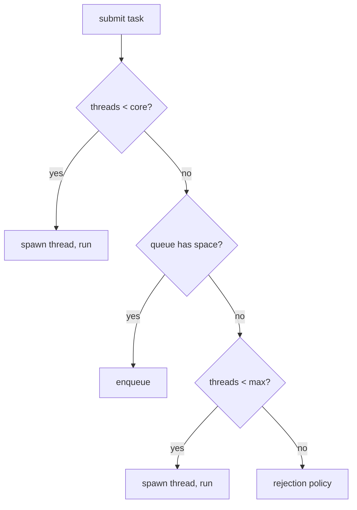

# Java Multithreading Deep Dive — Memory Model, Locks, Synchronizers, and Thread Pools

**Date:** 2026-04-18 | **Updated:** 2026-04-18
**Tags:** `java` `concurrency` `multithreading` `jmm` `locks` `thread-pools`

## Table of Contents

- [Summary](#summary)
- [What This Doc Is and Isn't](#what-this-doc-is-and-isnt)
- [The Java Memory Model](#the-java-memory-model)
  - [Why We Need a Memory Model](#why-we-need-a-memory-model)
  - [Happens-Before Edges](#happens-before-edges)
  - [volatile Semantics](#volatile-semantics)
  - [final Field Publication](#final-field-publication)
- [Locks Beyond `synchronized`](#locks-beyond-synchronized)
  - [ReentrantLock](#reentrantlock)
  - [ReadWriteLock](#readwritelock)
  - [StampedLock](#stampedlock)
  - [Condition](#condition)
- [Synchronizers](#synchronizers)
  - [CountDownLatch](#countdownlatch)
  - [CyclicBarrier](#cyclicbarrier)
  - [Semaphore](#semaphore)
  - [Phaser](#phaser)
  - [Exchanger](#exchanger)
- [Thread Pools — The Full Picture](#thread-pools--the-full-picture)
  - [ThreadPoolExecutor Internals](#threadpoolexecutor-internals)
  - [Rejection Policies](#rejection-policies)
  - [ThreadFactory](#threadfactory)
  - [ForkJoinPool and Work-Stealing](#forkjoinpool-and-work-stealing)
  - [ScheduledThreadPoolExecutor](#scheduledthreadpoolexecutor)
- [Producer-Consumer Patterns](#producer-consumer-patterns)
  - [BlockingQueue Implementations](#blockingqueue-implementations)
  - [TransferQueue](#transferqueue)
- [Deadlock, Livelock, Starvation](#deadlock-livelock-starvation)
  - [Detecting Deadlocks](#detecting-deadlocks)
  - [Avoiding Deadlocks](#avoiding-deadlocks)
- [Debugging Concurrency](#debugging-concurrency)
- [Related](#related)
- [References](#references)

---

## Summary

Serious multithreaded Java goes beyond `synchronized` and `volatile`. The three things that separate "I wrote a thread" from "I shipped a concurrent system" are: understanding the [Java Memory Model (JSR 133)](https://docs.oracle.com/javase/specs/jls/se21/html/jls-17.html#jls-17.4) and its happens-before relation so you know what writes a thread will actually observe; picking the right synchronization primitive from `java.util.concurrent` — [ReentrantLock](https://docs.oracle.com/en/java/javase/21/docs/api/java.base/java/util/concurrent/locks/ReentrantLock.html), [ReadWriteLock](https://docs.oracle.com/en/java/javase/21/docs/api/java.base/java/util/concurrent/locks/ReadWriteLock.html), [StampedLock](https://docs.oracle.com/en/java/javase/21/docs/api/java.base/java/util/concurrent/locks/StampedLock.html), [CountDownLatch](https://docs.oracle.com/en/java/javase/21/docs/api/java.base/java/util/concurrent/CountDownLatch.html), [Semaphore](https://docs.oracle.com/en/java/javase/21/docs/api/java.base/java/util/concurrent/Semaphore.html), [Phaser](https://docs.oracle.com/en/java/javase/21/docs/api/java.base/java/util/concurrent/Phaser.html); and configuring [ThreadPoolExecutor](https://docs.oracle.com/en/java/javase/21/docs/api/java.base/java/util/concurrent/ThreadPoolExecutor.html) correctly — core/max threads, queue choice, rejection policy, thread factory. This doc is the reference for the depth-level above `concurrency-basics.md`.

---

## What This Doc Is and Isn't

- **Is:** the deep-dive on the pre-Loom primitives that power every thread pool, every cache library, every Spring infrastructure class. Still the right toolkit for writing libraries, custom executors, or performance-critical concurrent code even after JDK 21.
- **Isn't:** a virtual-threads guide ([virtual-threads.md](virtual-threads.md)), a reactive guide ([reactive-programming-java.md](../reactive-programming-java.md)), or a basics primer ([concurrency-basics.md](concurrency-basics.md)). Read those first if the territory here is unfamiliar.

---

## The Java Memory Model

The [Java Memory Model (JMM)](https://docs.oracle.com/javase/specs/jls/se21/html/jls-17.html#jls-17.4) defines what writes one thread is **guaranteed** to see from another. Without it, "A = 1; B = 2" in one thread could be seen as "B = 2; A = 0" by another — CPUs reorder, caches are independent, compilers hoist loads out of loops.

### Why We Need a Memory Model

```java
// Thread A
x = 1;
flag = true;

// Thread B
if (flag) {
    System.out.println(x);   // could print 0 without JMM guarantees
}
```

Modern CPUs have per-core caches and out-of-order execution. JIT compilers reorder. Without synchronization, Thread B may observe `flag == true` before observing `x == 1`. The JMM specifies the rules for when cross-thread writes become visible.

### Happens-Before Edges

The **happens-before** relation defines ordering between actions across threads. If A happens-before B, then A's effects are visible to B. Edges that create happens-before:

| Edge | How |
|------|-----|
| Program order | Within a thread, each action happens-before the next. |
| Monitor lock | Unlock of monitor M happens-before every subsequent lock of M. |
| `volatile` | Write to a volatile field happens-before every subsequent read of it. |
| Thread start | `Thread.start()` happens-before any action in the started thread. |
| Thread join | Any action in a thread happens-before another thread's successful return from `join()` on it. |
| `final` publication | Fields marked `final` are safely published if `this` doesn't escape the constructor. |
| Transitivity | If A hb B and B hb C, then A hb C. |

The whole trick of concurrent Java is **arranging enough happens-before edges** that the data flow you wrote actually happens. Every safe publication pattern — `volatile` flag, `AtomicReference` CAS, `ConcurrentHashMap.put`, completing a `CompletableFuture` — creates a happens-before edge for you.

### volatile Semantics

`volatile` gives three guarantees:

1. **Visibility**: reads see the latest write.
2. **Ordering**: writes to a `volatile` field establish a happens-before edge with subsequent reads.
3. **No tearing**: reads and writes are atomic for all primitives, including `long` and `double` (which otherwise can tear on 32-bit JVMs).

What `volatile` does **not** give you: atomicity of compound actions. `count++` on a `volatile int` is still three operations (read, increment, write) and still races. Use `AtomicInteger.incrementAndGet()` for that.

### final Field Publication

Fields declared `final` in a constructor are safely visible to other threads **without synchronization**, as long as `this` didn't escape during construction. This is why immutable value classes (`String`, `Integer`, records) can be freely shared across threads.

"`this` escaping" means passing `this` to a method that stores it externally before the constructor finishes — registering an event listener, assigning `this` to a static field, starting a thread from the constructor. If any of those happens, the JMM's `final`-field guarantee is broken.

---

## Locks Beyond `synchronized`

`synchronized` (intrinsic monitor lock) is simple and fast, but limited. `java.util.concurrent.locks` provides richer alternatives.

### ReentrantLock

[`ReentrantLock`](https://docs.oracle.com/en/java/javase/21/docs/api/java.base/java/util/concurrent/locks/ReentrantLock.html) is `synchronized` with superpowers:

```java
private final ReentrantLock lock = new ReentrantLock();

public void transfer(Account from, Account to, BigDecimal amount) {
    if (lock.tryLock(100, TimeUnit.MILLISECONDS)) {
        try {
            // critical section
        } finally {
            lock.unlock();
        }
    } else {
        throw new TimeoutException("couldn't acquire lock");
    }
}
```

Features `synchronized` doesn't have:

- **`tryLock(timeout)`**: give up after a timeout instead of blocking forever.
- **`lockInterruptibly()`**: acquire the lock but respond to `Thread.interrupt()`.
- **Fairness option**: `new ReentrantLock(true)` grants the lock in FIFO order (slower but prevents starvation).
- **Condition variables**: multiple named conditions per lock (see [Condition](#condition)).

Cost: you **must** unlock in `finally`. `synchronized` unlocks automatically. One forgotten `unlock()` = permanent deadlock.

### ReadWriteLock

[`ReadWriteLock`](https://docs.oracle.com/en/java/javase/21/docs/api/java.base/java/util/concurrent/locks/ReadWriteLock.html) splits access into read (shared) and write (exclusive):

```java
private final ReadWriteLock rw = new ReentrantReadWriteLock();

public V get(K key) {
    rw.readLock().lock();
    try { return map.get(key); }
    finally { rw.readLock().unlock(); }
}

public void put(K key, V value) {
    rw.writeLock().lock();
    try { map.put(key, value); }
    finally { rw.writeLock().unlock(); }
}
```

Multiple readers run concurrently; writers get exclusive access. Useful when reads dominate writes (say 10:1 or higher). For lower ratios, plain `synchronized` / `ReentrantLock` is usually faster — the RW lock's bookkeeping overhead outweighs parallelism.

### StampedLock

[`StampedLock`](https://docs.oracle.com/en/java/javase/21/docs/api/java.base/java/util/concurrent/locks/StampedLock.html) adds **optimistic reads** — read without any lock and validate afterward:

```java
private final StampedLock sl = new StampedLock();
private double x, y;

public double distanceFromOrigin() {
    long stamp = sl.tryOptimisticRead();
    double cx = x, cy = y;
    if (!sl.validate(stamp)) {         // someone wrote while we read
        stamp = sl.readLock();
        try { cx = x; cy = y; }
        finally { sl.unlockRead(stamp); }
    }
    return Math.sqrt(cx*cx + cy*cy);
}
```

Fastest reader-heavy path in the standard library. Caveats:

- **Not reentrant** — a thread that already holds the lock will deadlock on re-acquire.
- **No Condition support.**
- **Tricky to get right.** Read the Javadoc carefully.

### Condition

[`Condition`](https://docs.oracle.com/en/java/javase/21/docs/api/java.base/java/util/concurrent/locks/Condition.html) is `wait`/`notify` on steroids. Unlike intrinsic monitor `wait()`, you can have multiple conditions per lock:

```java
final Lock lock = new ReentrantLock();
final Condition notFull = lock.newCondition();
final Condition notEmpty = lock.newCondition();
final Object[] items = new Object[100];
int putIdx, takeIdx, count;

public void put(Object x) throws InterruptedException {
    lock.lock();
    try {
        while (count == items.length) notFull.await();
        items[putIdx] = x;
        if (++putIdx == items.length) putIdx = 0;
        count++;
        notEmpty.signal();
    } finally { lock.unlock(); }
}

public Object take() throws InterruptedException {
    lock.lock();
    try {
        while (count == 0) notEmpty.await();
        Object x = items[takeIdx];
        items[takeIdx] = null;
        if (++takeIdx == items.length) takeIdx = 0;
        count--;
        notFull.signal();
        return x;
    } finally { lock.unlock(); }
}
```

This is the textbook bounded-buffer producer-consumer. In practice, use `ArrayBlockingQueue` — it's implemented this way internally.

---

## Synchronizers

High-level coordination primitives in `java.util.concurrent`. Each solves one coordination problem.

### CountDownLatch

A one-shot "wait for N events" gate:

```java
CountDownLatch ready = new CountDownLatch(3);

for (int i = 0; i < 3; i++) {
    executor.submit(() -> {
        warmUp();
        ready.countDown();
    });
}

ready.await();   // blocks until all 3 call countDown()
startMainWork();
```

Uses:
- Wait for N services to be ready before starting.
- Fan-out / fan-in where you know N upfront.
- Test coordination — ensure all setup threads finished before assertions.

Cannot be reset. For reusable "wait for everyone", use [CyclicBarrier](#cyclicbarrier) or [Phaser](#phaser).

### CyclicBarrier

Reusable "wait until N threads all arrive":

```java
CyclicBarrier barrier = new CyclicBarrier(4, () -> {
    // optional: runs when the last thread arrives
    System.out.println("phase complete");
});

for (int i = 0; i < 4; i++) {
    executor.submit(() -> {
        for (int step = 0; step < 10; step++) {
            doStep(step);
            barrier.await();   // wait for other 3
        }
    });
}
```

Useful for parallel algorithms with phase boundaries (simulations, batch processing with synchronization points).

### Semaphore

Bounded concurrent access permits:

```java
Semaphore permits = new Semaphore(10);   // at most 10 in parallel

public void doWork() throws InterruptedException {
    permits.acquire();
    try { expensiveOp(); }
    finally { permits.release(); }
}
```

Uses:
- Rate limiting concurrent access to a resource (DB connections, third-party API, expensive computation).
- Implementing bulkhead patterns without Resilience4j.
- A semaphore of 1 is essentially a `ReentrantLock` but explicitly non-reentrant.

### Phaser

More flexible than `CyclicBarrier` — parties can dynamically join/leave, and phases have integer IDs:

```java
Phaser phaser = new Phaser(1);   // main thread registers

for (int i = 0; i < 3; i++) {
    phaser.register();
    executor.submit(() -> {
        try {
            doPhase1();
            phaser.arriveAndAwaitAdvance();
            doPhase2();
            phaser.arriveAndAwaitAdvance();
        } finally {
            phaser.arriveAndDeregister();
        }
    });
}

phaser.arriveAndDeregister();   // main thread leaves
```

Reach for `Phaser` when the number of parties changes across phases or you need per-phase callbacks.

### Exchanger

Two-thread rendezvous point. Threads exchange objects:

```java
Exchanger<Buffer> exchanger = new Exchanger<>();

// Producer
Buffer full = exchanger.exchange(filled);   // hands filled, gets empty back

// Consumer
Buffer empty = exchanger.exchange(drained); // hands drained, gets filled back
```

Rarely used but useful in pipelined producer/consumer without a queue. If you can use a `BlockingQueue`, prefer that.

---

## Thread Pools — The Full Picture

`Executors.newFixedThreadPool(n)` and friends are convenience wrappers around [`ThreadPoolExecutor`](https://docs.oracle.com/en/java/javase/21/docs/api/java.base/java/util/concurrent/ThreadPoolExecutor.html). For serious use, configure `ThreadPoolExecutor` directly — the convenience methods hide dangerous defaults.

### ThreadPoolExecutor Internals

```java
new ThreadPoolExecutor(
    10,                                        // corePoolSize
    50,                                        // maximumPoolSize
    60L, TimeUnit.SECONDS,                     // keepAliveTime (for non-core)
    new LinkedBlockingQueue<>(1000),           // workQueue
    new CustomThreadFactory("worker-"),        // threadFactory
    new ThreadPoolExecutor.CallerRunsPolicy()  // rejection policy
);
```

Task submission algorithm:



Critical insight: **the pool only grows past core size when the queue is full**. Using an unbounded `LinkedBlockingQueue` (the default in `newFixedThreadPool`) means the pool never exceeds core — and memory can grow unbounded. Always pick a bounded queue and a sensible rejection policy in production.

### Rejection Policies

- **`AbortPolicy`** (default): throws `RejectedExecutionException`. Good when rejection is an error condition.
- **`CallerRunsPolicy`**: the submitting thread runs the task itself. Natural back-pressure — producers slow down when the pool is full.
- **`DiscardPolicy`**: silently drops the task. Dangerous; logs nothing.
- **`DiscardOldestPolicy`**: drops the oldest queued task. Useful for "latest data matters" queues.

For request-handling executors, `CallerRunsPolicy` is often the right default — it trades latency for stability. For fire-and-forget background work, `AbortPolicy` with monitoring is safer.

### ThreadFactory

Always provide a custom `ThreadFactory` so thread names are meaningful in stack traces and thread dumps:

```java
public class NamedThreadFactory implements ThreadFactory {
    private final AtomicInteger count = new AtomicInteger();
    private final String prefix;

    public NamedThreadFactory(String prefix) { this.prefix = prefix; }

    @Override
    public Thread newThread(Runnable r) {
        Thread t = new Thread(r, prefix + count.incrementAndGet());
        t.setDaemon(false);
        t.setUncaughtExceptionHandler((th, ex) -> log.error("uncaught in {}", th.getName(), ex));
        return t;
    }
}
```

Or use Spring's `CustomizableThreadFactory`. Either way, never ship `pool-1-thread-5` names to production.

### ForkJoinPool and Work-Stealing

[`ForkJoinPool`](https://docs.oracle.com/en/java/javase/21/docs/api/java.base/java/util/concurrent/ForkJoinPool.html) is a specialized pool where threads steal tasks from each other's queues when idle. Use it for CPU-bound recursive decomposition:

```java
ForkJoinPool pool = new ForkJoinPool(8);
Integer result = pool.invoke(new SumTask(array, 0, array.length));

class SumTask extends RecursiveTask<Integer> {
    private static final int THRESHOLD = 1000;
    private final int[] arr;
    private final int lo, hi;

    public SumTask(int[] arr, int lo, int hi) {
        this.arr = arr; this.lo = lo; this.hi = hi;
    }

    @Override
    protected Integer compute() {
        if (hi - lo <= THRESHOLD) {
            int sum = 0;
            for (int i = lo; i < hi; i++) sum += arr[i];
            return sum;
        }
        int mid = (lo + hi) >>> 1;
        SumTask left = new SumTask(arr, lo, mid);
        SumTask right = new SumTask(arr, mid, hi);
        left.fork();
        int rightResult = right.compute();
        int leftResult = left.join();
        return leftResult + rightResult;
    }
}
```

`ForkJoinPool.commonPool()` is the default for parallel streams and `CompletableFuture.supplyAsync(...)` (the no-executor overload). Never submit blocking I/O to the common pool — it starves parallel streams across your whole JVM.

### ScheduledThreadPoolExecutor

For delayed and periodic tasks:

```java
ScheduledExecutorService ses = Executors.newScheduledThreadPool(2, factory);

ses.schedule(this::oneShot, 5, TimeUnit.SECONDS);
ses.scheduleAtFixedRate(this::periodic, 0, 1, TimeUnit.SECONDS);
ses.scheduleWithFixedDelay(this::periodicBetween, 0, 1, TimeUnit.SECONDS);
```

Difference between `atFixedRate` vs `withFixedDelay`: the former starts each run at a fixed wall-clock cadence (may pile up if slow); the latter measures the delay from the end of the previous run.

---

## Producer-Consumer Patterns

### BlockingQueue Implementations

| Queue | Capacity | Notes |
|-------|----------|-------|
| [`ArrayBlockingQueue`](https://docs.oracle.com/en/java/javase/21/docs/api/java.base/java/util/concurrent/ArrayBlockingQueue.html) | Bounded, fixed | FIFO. Lock-based. Predictable memory. |
| [`LinkedBlockingQueue`](https://docs.oracle.com/en/java/javase/21/docs/api/java.base/java/util/concurrent/LinkedBlockingQueue.html) | Optionally bounded | FIFO. Two locks (head/tail) — higher throughput under contention. |
| [`PriorityBlockingQueue`](https://docs.oracle.com/en/java/javase/21/docs/api/java.base/java/util/concurrent/PriorityBlockingQueue.html) | Unbounded | Heap-ordered. Use with `Comparable` tasks. |
| [`SynchronousQueue`](https://docs.oracle.com/en/java/javase/21/docs/api/java.base/java/util/concurrent/SynchronousQueue.html) | Zero | Hand-off only. Every put waits for a take. |
| [`DelayQueue`](https://docs.oracle.com/en/java/javase/21/docs/api/java.base/java/util/concurrent/DelayQueue.html) | Unbounded | Elements become available only after their delay expires. |
| [`LinkedTransferQueue`](https://docs.oracle.com/en/java/javase/21/docs/api/java.base/java/util/concurrent/LinkedTransferQueue.html) | Unbounded | Higher-performance; supports `transfer()` for synchronous handoff. |

Default choice: `LinkedBlockingQueue` with an explicit capacity. `ArrayBlockingQueue` when you want absolute memory determinism.

### TransferQueue

`LinkedTransferQueue` + `transfer(E)` waits until a consumer takes the element. Useful for back-pressure: producers block when no consumer is available. Better than `put` on a `SynchronousQueue` because it doesn't force hand-off when a consumer is already waiting.

---

## Deadlock, Livelock, Starvation

Three failure modes of concurrent systems.

- **Deadlock**: threads hold resources and wait for each other in a cycle. Nothing progresses.
- **Livelock**: threads keep reacting to each other but do no useful work (two people dodging in a hallway).
- **Starvation**: a thread never gets to run because others keep grabbing the resource first.

### Detecting Deadlocks

In production:

```bash
jcmd <pid> Thread.print
# or
jstack <pid>
```

Modern JDKs explicitly report `Found one Java-level deadlock:` at the end of the dump with the cycle of lock ownership. [JFR](https://docs.oracle.com/en/java/javase/21/jfapi/) records deadlock events automatically.

Programmatically:

```java
ThreadMXBean bean = ManagementFactory.getThreadMXBean();
long[] ids = bean.findDeadlockedThreads();
if (ids != null) {
    ThreadInfo[] infos = bean.getThreadInfo(ids, true, true);
    // log or alert
}
```

Run this in a scheduled task so you get paged before customers notice.

### Avoiding Deadlocks

1. **Acquire locks in a global order.** If every thread locks A before B, cycles are impossible.
2. **Use `tryLock(timeout)`**. Give up and retry rather than waiting forever.
3. **Hold locks for short periods.** Longer locks = bigger window for cycles.
4. **Never call foreign code under a lock.** A callback you hand to a library may lock something you don't know about.
5. **Prefer immutable data and lock-free structures** (`ConcurrentHashMap`, `AtomicReference`) — no locks, no deadlocks.

---

## Debugging Concurrency

- **Thread dumps**: `jcmd <pid> Thread.print`. First tool for every incident.
- **Flight Recorder**: always-on low-overhead capture of thread events, lock contention, monitor wait times.
- **[async-profiler](https://github.com/async-profiler/async-profiler)** with `-e lock` shows contention flame graphs.
- **[Java Concurrency Stress Tests (jcstress)](https://github.com/openjdk/jcstress)**: Shipilëv's harness for testing JMM-level correctness. The only real way to validate non-obvious lock-free code.
- **Logging thread names**: configure Logback to include `%thread` — useful for tracing which executor handled what.
- **Flaky tests**: if a test fails "sometimes", it is almost always a missing happens-before edge. Add synchronization, not `Thread.sleep()`.

---

## Related

- [Concurrency Basics](concurrency-basics.md) — foundational `Thread`, `ExecutorService`, `CompletableFuture`, `synchronized`, `volatile`.
- [Virtual Threads in Java](virtual-threads.md) — JDK 21 lightweight threads; most of this doc still applies.
- [Structured Concurrency in Java](structured-concurrency.md) — `StructuredTaskScope` as a higher-level alternative.
- [Structured Concurrency Before Project Loom](structured-concurrency-before-loom.md) — how earlier languages and libraries solved the same problems.
- [Scaling Spring MVC Before Virtual Threads](../web-layer/mvc-high-throughput.md) — applied thread-pool tuning and Resilience4j.
- [Async Processing in Spring](../events-async/async-processing.md) — Spring's `@Async` / `TaskExecutor`.
- [Reactive Programming in Java](../reactive-programming-java.md) — the reactive alternative.
- [JVM Concepts — Safepoints](../jvm-gc/concepts.md#safepoints-and-why-stw-exists) — the GC side of "stopping threads".

---

## References

- [JSR 133: Java Memory Model and Thread Specification](https://jcp.org/en/jsr/detail?id=133) — the normative source.
- [Java Language Specification §17 — Threads and Locks (JLS 21)](https://docs.oracle.com/javase/specs/jls/se21/html/jls-17.html) — happens-before, volatile, final-field publication.
- [`java.util.concurrent` Javadoc (JDK 21)](https://docs.oracle.com/en/java/javase/21/docs/api/java.base/java/util/concurrent/package-summary.html) — locks, synchronizers, atomics, executors.
- [Brian Goetz et al. — *Java Concurrency in Practice*](https://jcip.net/) — the definitive book; still accurate for everything except virtual threads.
- [Aleksey Shipilëv — "JVM Anatomy Quarks"](https://shipilev.net/jvm/anatomy-quarks/) — deep-dives including memory model, safepoints, volatile.
- [Doug Lea — `java.util.concurrent` design notes](https://gee.cs.oswego.edu/dl/cpj/) — the author's own papers on the library.
- [jcstress — Java Concurrency Stress Tests](https://github.com/openjdk/jcstress) — tests for JMM-level correctness.
- [Oracle Tutorial: Concurrency](https://docs.oracle.com/javase/tutorial/essential/concurrency/) — beginner-friendly refresher.
- [JEP 444: Virtual Threads](https://openjdk.org/jeps/444) — the post-Loom story.
