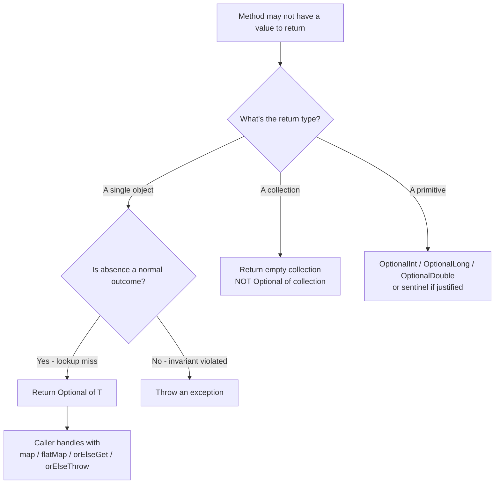
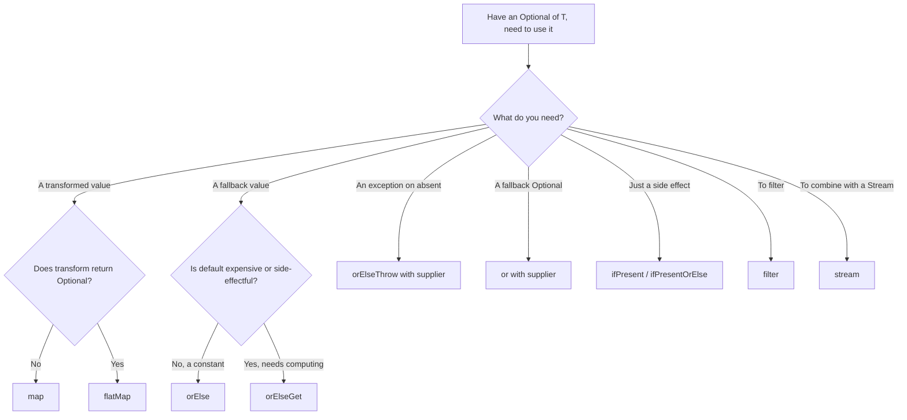

# Optional<T> Deep Dive

**Date:** 2026-04-17 • **Tags:** java, optional, null-safety

## Table of Contents

- [Summary](#summary)
- [The Problem `Optional` Solves (and Doesn't)](#the-problem-optional-solves-and-doesnt)
- [Creating an Optional](#creating-an-optional)
- [Checking Presence: `isPresent` / `isEmpty`](#checking-presence-ispresent--isempty)
- [Consuming a Value](#consuming-a-value)
- [Transforming: `map` vs `flatMap`](#transforming-map-vs-flatmap)
- [Filtering: `filter`](#filtering-filter)
- [Unwrapping with a Default: `orElse` vs `orElseGet`](#unwrapping-with-a-default-orelse-vs-orelseget)
- [Unwrapping with an Error: `orElseThrow`](#unwrapping-with-an-error-orelsethrow)
- [Chaining: `or` and `stream`](#chaining-or-and-stream)
- [When NOT to Use `Optional`](#when-not-to-use-optional)
- [Optional vs `@Nullable` vs Kotlin `T?`](#optional-vs-nullable-vs-kotlin-t)
- [Antipattern Gallery](#antipattern-gallery)
- [Reactive-Adjacent Note: `Mono<T>` and `Optional<T>`](#reactive-adjacent-note-monot-and-optionalt)
- [Decision Flow](#decision-flow)
- [Related](#related)
- [References](#references)

---

## Summary

`Optional<T>` is a container object that either holds exactly one non-null value or holds nothing. It was added in Java 8 (`java.util.Optional`) and its **primary, intended use** is as a return type for methods that might not have a meaningful value to return. Using it that way forces the caller to confront the absence case at compile time rather than at runtime via `NullPointerException`.

A TypeScript mental model: treat `Optional<T>` roughly like a single-valued array — `T[]` where length is always 0 or 1. It is **not** a replacement for TypeScript's `T | null` / `T | undefined` union; it is an explicit wrapper type with its own API, and the language does not enforce its use.

```java
// Idiomatic: return type signaling "may not exist"
Optional<User> findByEmail(String email);

// Caller is forced to think about the empty case
User user = findByEmail("a@b.com")
    .orElseThrow(() -> new UserNotFoundException("a@b.com"));
```

---

## The Problem `Optional` Solves (and Doesn't)

### What it solves

Before `Optional`, a Java method that could fail to find something had three bad options:

1. Return `null` — callers forget to check, `NullPointerException` in production.
2. Throw a checked exception — heavy, wrong tool for "not found" in a lookup.
3. Return a sentinel value — brittle, easy to mistake for real data.

`Optional` encodes "may be absent" directly in the type signature. The caller *cannot* accidentally dereference the value; they must go through a method that forces the decision.

```java
// Before
User u = repo.findByEmail(email);      // null? who knows
String name = u.getName();             // NPE waiting to happen

// After
String name = repo.findByEmail(email)  // Optional<User>
    .map(User::getName)
    .orElse("Anonymous");
```

### What it does NOT solve

`Optional` is **not** a full null-safety system. Differences from TypeScript's `T | null`:

| Concern                               | TypeScript `T \| null` | Java `Optional<T>`                |
|---------------------------------------|-----------------------|-----------------------------------|
| Compiler enforces null handling       | Yes (strict mode)     | No                                |
| Works on any variable                 | Yes                   | Only the wrapper; raw refs can still be null |
| Zero runtime cost                     | Yes                   | No — an allocation per call (in hot paths, measurable) |
| Fields can be null-typed              | Yes                   | Discouraged as field type          |
| Parameters can be null-typed          | Yes                   | Discouraged as parameter type      |

In Java you still work with raw references that **can** be `null`. `Optional` is a tool for one specific problem (return values communicating absence), not a language-wide null-safety feature.

---

## Creating an Optional

Three factory methods, and the choice among them is semantic, not stylistic.

```java
// 1. Optional.of(x) — x MUST be non-null; throws NPE if null.
//    Use when you know the value is present and want to signal that intent.
Optional<String> a = Optional.of("hello");
Optional<String> bad = Optional.of(null);   // NullPointerException

// 2. Optional.ofNullable(x) — wraps x, returns empty if x is null.
//    Use at the boundary with legacy / nullable code.
Optional<String> maybe = Optional.ofNullable(couldBeNull);

// 3. Optional.empty() — the absent case, a singleton under the hood.
Optional<String> none = Optional.empty();
```

### Rule of thumb

- `Optional.of` — "I am asserting this value is present. Fail loudly if I'm wrong."
- `Optional.ofNullable` — "I have a reference from a legacy/nullable source, normalize it."
- `Optional.empty` — "I definitively have no value."

### Diagram: the three states

```mermaid
stateDiagram-v2
    [*] --> Created
    Created --> Present: Optional.of(x) where x != null
    Created --> Empty: Optional.empty()
    Created --> Present: Optional.ofNullable(x) where x != null
    Created --> Empty: Optional.ofNullable(x) where x == null
    Created --> NPE: Optional.of(null)

    Present --> Unwrapped: get() / orElse / orElseThrow
    Empty --> Default: orElse(default) / orElseGet(supplier)
    Empty --> Thrown: orElseThrow()

    note right of Present
      Holds a non-null T
    end note
    note right of Empty
      Holds nothing;
      never null itself
    end note
```

A critical property: **an `Optional` reference itself should never be `null`**. If you hold an `Optional<T>` variable, it is always either present or empty. Returning `null` from a method whose return type is `Optional<T>` is the worst of both worlds.

---

## Checking Presence: `isPresent` / `isEmpty`

```java
Optional<User> maybe = repo.findByEmail(email);

if (maybe.isPresent()) {                 // Java 8+
    User u = maybe.get();                // tolerated but not idiomatic
}

if (maybe.isEmpty()) {                   // Java 11+
    // handle absent
}
```

Functionally fine, but **these should usually be avoided**. They reduce `Optional` to a glorified null check and discard the whole point of the type.

```java
// ANTIPATTERN — verbose, null-check in disguise
if (maybe.isPresent()) {
    return maybe.get().getName();
} else {
    return "Anonymous";
}

// IDIOMATIC — express intent
return maybe.map(User::getName).orElse("Anonymous");
```

When is `isPresent` / `isEmpty` legitimately useful? Mostly logging, metrics, and branching that produces **side effects** rather than values — and even there, `ifPresent` / `ifPresentOrElse` usually read better.

---

## Consuming a Value

For side effects (logging, publishing an event, mutating something external):

```java
// ifPresent — only run if present
repo.findByEmail(email)
    .ifPresent(user -> logger.info("Found {}", user.getId()));

// ifPresentOrElse — Java 9+, handle both sides
repo.findByEmail(email)
    .ifPresentOrElse(
        user -> logger.info("Found {}", user.getId()),
        ()   -> logger.warn("No user for {}", email)
    );
```

These are terminal: they consume the `Optional` and return `void`. For anything that needs to produce a value, use `map` / `flatMap` / `orElse*`.

---

## Transforming: `map` vs `flatMap`

This is the part TypeScript developers pick up fastest — it's a functor/monad. The distinction matters.

### `map(fn)`

Applies `fn` to the contained value **if present**, wrapping the result in a new `Optional`. If the input is empty, returns empty. If `fn` returns `null`, the result is empty (`map` uses `ofNullable` internally).

```java
Optional<User> maybeUser = repo.findByEmail(email);

// User -> String, so result is Optional<String>
Optional<String> name = maybeUser.map(User::getName);
```

### `flatMap(fn)`

Use when `fn` **itself returns an `Optional`**. Without `flatMap`, you would get `Optional<Optional<T>>`, which is useless.

```java
class User {
    Optional<Address> getPrimaryAddress() { ... }
}

Optional<User> maybeUser = repo.findByEmail(email);

// WRONG — Optional<Optional<Address>>
Optional<Optional<Address>> bad = maybeUser.map(User::getPrimaryAddress);

// RIGHT — Optional<Address>
Optional<Address> good = maybeUser.flatMap(User::getPrimaryAddress);
```

### Decision rule

- The function returns a plain `T`  → `map`.
- The function returns an `Optional<T>`  → `flatMap`.

### Chained example

```java
String city = repo.findByEmail(email)          // Optional<User>
    .flatMap(User::getPrimaryAddress)          // Optional<Address>
    .map(Address::getCity)                     // Optional<String>
    .map(String::toUpperCase)                  // Optional<String>
    .orElse("UNKNOWN");
```

Each link short-circuits: if any step is absent, the rest are skipped and the final `orElse` kicks in.

---

## Filtering: `filter`

Drops the value if a predicate fails, returning empty. If already empty, stays empty.

```java
Optional<User> activeUser = repo.findByEmail(email)
    .filter(User::isActive);

String label = repo.findByEmail(email)
    .filter(User::isActive)
    .map(User::getName)
    .orElse("No active user");
```

---

## Unwrapping with a Default: `orElse` vs `orElseGet`

**This is the single most-misused pair in the whole API.** Read this section carefully.

```java
// orElse(T other) — returns the value if present, else returns `other`.
String a = maybeName.orElse("Anonymous");

// orElseGet(Supplier<? extends T> supplier) — returns value if present,
// else calls supplier.get() and returns the result.
String b = maybeName.orElseGet(() -> computeDefault());
```

They look interchangeable. They are not.

### The trap: `orElse` **always evaluates** its argument

`orElse`'s argument is a regular value. Java evaluates arguments eagerly, so the default is computed **before** `orElse` is called — whether the `Optional` is present or not.

```java
// Looks innocent
String a = maybeName.orElse(expensiveDefault());

// Actually:
String tmp = expensiveDefault();    // ALWAYS runs
String a = maybeName.orElse(tmp);   // then this
```

If `expensiveDefault()` hits a database, does I/O, constructs a big object, or — worse — has side effects you only wanted on the empty path, you have a silent performance and correctness bug.

### `orElseGet` is lazy

```java
String b = maybeName.orElseGet(() -> expensiveDefault());
// expensiveDefault() only runs when maybeName is empty.
```

### Extreme case: side effects

```java
// BUG — user is always created, even when we found one!
User u = repo.findById(id).orElse(createNewUser());

// CORRECT — createNewUser only runs on miss
User u = repo.findById(id).orElseGet(this::createNewUser);
```

### Rule of thumb

- Default is a **constant** or already-computed value → `orElse`.
- Default requires **any computation** (method call, allocation, I/O) → `orElseGet`.

When in doubt, reach for `orElseGet`. The only downside is a lambda allocation, which is negligible compared to the risk of accidentally running work unnecessarily.

---

## Unwrapping with an Error: `orElseThrow`

When absence is genuinely exceptional, throw.

```java
// Java 10+ no-arg form — throws NoSuchElementException with a terse message.
User u = repo.findById(id).orElseThrow();

// Custom exception — the idiomatic choice in application code.
User u = repo.findById(id)
    .orElseThrow(() -> new UserNotFoundException("id=" + id));
```

The supplier form is lazy (like `orElseGet`), so constructing the exception — including any string formatting — only happens on the empty path.

Prefer a domain-specific exception over `NoSuchElementException`; it makes error handling meaningful downstream (e.g., mapped to HTTP 404 in a Spring controller advice).

---

## Chaining: `or` and `stream`

### `or(Supplier<Optional<T>>)` — Java 9+

Fall back to another `Optional` source if empty. Useful for tiered lookups (cache then DB, primary then backup).

```java
Optional<User> result = cache.find(id)
    .or(() -> primaryRepo.findById(id))
    .or(() -> backupRepo.findById(id));
```

The supplier is lazy, so each subsequent lookup only runs when the preceding one was empty.

### `stream()` — Java 9+

Converts the `Optional` into a `Stream` of zero or one element. Mostly useful when collecting or flat-mapping across a collection of `Optional`s.

```java
List<Long> ids = List.of(1L, 2L, 3L, 4L);

// Pre-Java 9: awkward
List<User> users = ids.stream()
    .map(repo::findById)
    .filter(Optional::isPresent)
    .map(Optional::get)
    .toList();

// Java 9+: clean
List<User> users = ids.stream()
    .map(repo::findById)
    .flatMap(Optional::stream)
    .toList();
```

---

## When NOT to Use `Optional`

`Optional` was designed as a **return type** for "may be absent" results. Brian Goetz has stated this explicitly (see References). Using it elsewhere ranges from mildly awkward to actively harmful.

### Never as a field

```java
// BAD
public class User {
    private Optional<String> nickname;    // don't do this
}
```

Reasons:

- `Optional` is not `Serializable` — breaks Java serialization, JPA entities, many frameworks.
- Adds an extra allocation per instance.
- Confusing semantics: can the field itself be `null`? (Yes, and now you have two kinds of "absent".)
- JSON serializers handle it inconsistently; you often need custom config.

Prefer a plain nullable field with clear documentation, or a domain-specific empty value:

```java
public class User {
    private String nickname;              // nullable, documented

    public Optional<String> nickname() {  // Optional at the boundary
        return Optional.ofNullable(nickname);
    }
}
```

### Never as a method parameter

```java
// BAD
void greet(Optional<String> name) { ... }

// Callers now write one of:
greet(Optional.of("Quan"));
greet(Optional.empty());
greet(Optional.ofNullable(maybe));  // and can still pass null as the Optional!
```

The parameter is just as nullable as before (callers can still pass `null` as the `Optional`), plus every call site is noisier. Use overloads or a nullable parameter documented with `@Nullable`.

```java
// Better
void greet(String name) { ... }         // required
void greet() { ... }                    // no name overload
// or
void greet(@Nullable String name) { ... }
```

### Never as a collection element

```java
// BAD
List<Optional<User>> results;    // what does this even mean?

// GOOD — empty collection = "no results"
List<User> results;              // can be empty
```

Same for `Map<K, Optional<V>>` — if a key is absent, the map's `get` already returns `null`; wrap at the lookup site if needed.

### Avoid `Optional<Optional<T>>`

This is always a bug, usually caused by using `map` where `flatMap` was needed. Fix it at the source.

### Primitive specializations exist

For `int`, `long`, `double`, Java provides `OptionalInt`, `OptionalLong`, `OptionalDouble` to avoid boxing. Same API shape, same caveats. For any other primitive you're stuck with `Optional<Integer>` etc.

---

## Optional vs `@Nullable` vs Kotlin `T?`

| Feature                  | `Optional<T>` (Java)              | `@Nullable` annotations          | Kotlin `T?`                   |
|--------------------------|-----------------------------------|----------------------------------|-------------------------------|
| Enforcement              | Runtime, API convention           | Static analysis (IDE/linter)     | Compiler-enforced             |
| Runtime cost             | One allocation per wrap           | Zero                             | Zero                          |
| Works on fields          | Discouraged                       | Yes                              | Yes                           |
| Works on parameters      | Discouraged                       | Yes                              | Yes                           |
| Works on return types    | Intended use                      | Yes                              | Yes                           |
| Rich transformation API  | Yes (`map`, `flatMap`, etc.)      | No                               | Partial (`?.`, `?:`, `let`)   |
| Interop story            | Any JVM language                  | Depends on annotation source     | Seamless with Java            |
| Standard in the ecosystem | Built in                         | Multiple competing standards (JSR-305, JetBrains, Checker, Spring) | Built in |

In a Java codebase using Spring, a common practical blend is: **`Optional<T>` for return types that may be absent, `@Nullable` / `@NonNull` from `jakarta.annotation` or Spring for fields and parameters.**

If you have the option to use Kotlin end-to-end, its null-safety is strictly better. `Optional` is Java's pragmatic retrofit.

---

## Antipattern Gallery

### 1. Manual presence check instead of `orElse`

```java
// BAD
String name = opt.isPresent() ? opt.get() : "Anon";

// GOOD
String name = opt.orElse("Anon");
```

### 2. Calling `get()` without a guard

```java
// BAD — may throw NoSuchElementException at runtime
User u = repo.findById(id).get();

// GOOD — intent is explicit, message is useful
User u = repo.findById(id)
    .orElseThrow(() -> new UserNotFoundException(id));
```

Treat bare `opt.get()` as a code smell. It's the `@ts-ignore` of `Optional`.

### 3. `Optional<List<T>>` / `Optional<Map<K,V>>`

```java
// BAD — three states: null Optional, empty Optional, empty list. Pick one.
Optional<List<Order>> findOrders(Long userId);

// GOOD — empty list means "no orders"
List<Order> findOrders(Long userId);   // may return List.of()
```

Same rule: **for collections, empty IS the absent state.** Don't double-wrap it.

### 4. `map` when you meant `flatMap`

```java
// BAD — Optional<Optional<Address>>
user.map(User::getPrimaryAddress);

// GOOD — Optional<Address>
user.flatMap(User::getPrimaryAddress);
```

If your IDE's inferred type looks like `Optional<Optional<...>>`, stop and switch to `flatMap`.

### 5. `orElse` with a computed default

```java
// BAD — query runs on every call, even on hit
return cache.get(key).orElse(db.load(key));

// GOOD — query runs only on miss
return cache.get(key).orElseGet(() -> db.load(key));
```

### 6. Returning `null` from a method that returns `Optional<T>`

```java
// UNFORGIVABLE
public Optional<User> findByEmail(String email) {
    if (db.isDown()) {
        return null;      // NO. Never. Return Optional.empty().
    }
    ...
}
```

The consumer will write `.map(...)` and get NPE on the `Optional` itself. You've taken away the one thing `Optional` was supposed to provide.

### 7. Chaining `isPresent` across multiple Optionals

```java
// BAD
if (a.isPresent() && b.isPresent()) {
    use(a.get(), b.get());
}

// BETTER — nested flatMap/map
a.flatMap(av -> b.map(bv -> use(av, bv)));

// OR — if you only need side effects
a.ifPresent(av -> b.ifPresent(bv -> use(av, bv)));
```

For more than two, consider restructuring: if your logic genuinely needs N values all present, maybe a validation step that collects errors is a better fit than a cascade of `Optional`s.

---

## Reactive-Adjacent Note: `Mono<T>` and `Optional<T>`

In Project Reactor (Spring WebFlux), `Mono<T>` is the reactive analog of `Optional<T>`: it represents 0 or 1 **future** value. The API shape is deliberately similar — `map`, `flatMap`, `filter`, `switchIfEmpty` (≈ `or`), `defaultIfEmpty` (≈ `orElse`).

```java
Mono<User> byId = repo.findById(id)                    // Mono<User>, may be empty
    .switchIfEmpty(Mono.error(new UserNotFoundException(id)));
```

Key differences:

- `Optional` is synchronous and eager; `Mono` is asynchronous and lazy until subscribed.
- `Mono` also carries error as a first-class signal; `Optional` does not — absence is the only "not-value" state.
- Never wrap `Mono<Optional<T>>`. It's always wrong, same root cause as `Optional<Optional<T>>`: use empty `Mono` to signal absence.

See `reactive-programming-java.md` for the full treatment. The `Optional` habits you build here (especially `map` vs `flatMap`, and avoiding `get`-equivalents) transfer directly to reactive code.

---

## Decision Flow

When you have a method that might not return a value, use this to decide what to return — and callers can use the second diagram to decide how to unwrap.





---

## Related

- [type-system-for-ts-devs.md](./type-system-for-ts-devs.md) — how Java's type system differs from TypeScript's, including nullability.
- [modern-java-features.md](./modern-java-features.md) — records, pattern matching, and other language features that complement `Optional`.
- [exceptions-and-error-handling.md](./exceptions-and-error-handling.md) — when to throw vs return `Optional.empty()`, checked vs unchecked.

## References

- Oracle Java SE Documentation — `java.util.Optional`: <https://docs.oracle.com/en/java/javase/21/docs/api/java.base/java/util/Optional.html>
- Oracle Java Tutorials — Using `Optional`: <https://docs.oracle.com/javase/tutorial/java/javaOO/optional.html>
- Joshua Bloch, *Effective Java, 3rd Edition*, Item 55: "Return optionals judiciously" — the canonical style guide entry.
- Brian Goetz, "Stuart Marks's Optional rules" (StackOverflow, referenced in many talks) — <https://stackoverflow.com/a/26328555> — the original design intent from the Java architect who shepherded `Optional` in.
- Stuart Marks, JavaOne talk "Optional – The Mother of All Bikesheds" — definitive tour of correct/incorrect uses.
- JEP 269 / JDK release notes for Java 9 (`or`, `ifPresentOrElse`, `stream`), Java 10 (`orElseThrow()` no-arg), Java 11 (`isEmpty`).
