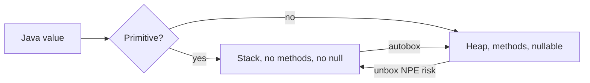
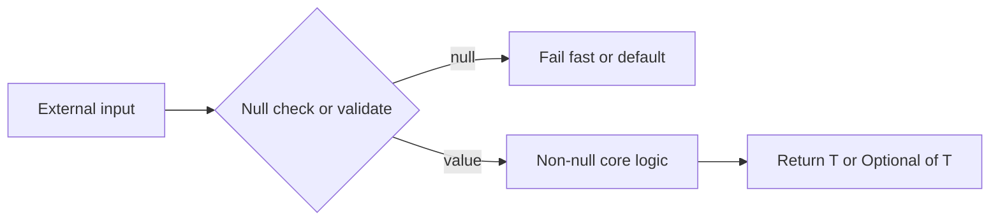

# Java Type System for TypeScript Developers

**Date:** 2026-04-17 | **Updated:** 2026-04-24
**Tags:** `java` `typescript` `type-system` `generics` `nullability` `fundamentals`

## Table of Contents

- [Summary](#summary)
- [Nominal vs Structural](#nominal-vs-structural)
- [Primitives vs Reference Types](#primitives-vs-reference-types)
- [No Union Types — Enter Polymorphism & Sealed Types](#no-union-types--enter-polymorphism--sealed-types)
- [Generics with Type Erasure](#generics-with-type-erasure)
  - [Bounded Types](#bounded-types)
  - [Wildcards and PECS](#wildcards-and-pecs)
- [Nullability — The Billion-Dollar Problem](#nullability--the-billion-dollar-problem)
- [Variables, `var`, and Type Inference](#variables-var-and-type-inference)
- [Access Modifiers](#access-modifiers)
- [Interfaces and Default Methods](#interfaces-and-default-methods)
- [Abstract Classes vs Interfaces](#abstract-classes-vs-interfaces)
- [Records — Java's Type Alias + Data Class](#records--javas-type-alias--data-class)
- [Enums Are Rich](#enums-are-rich)
- [Common TS→Java Cheat Sheet](#common-tsjava-cheat-sheet)
- [Related](#related)
- [References](#references)

---

## Summary

Java has a **nominal, class-based** type system with **static type checking at compile time** and type information that is *mostly* erased at runtime (class identity survives; generic parameters do not). TypeScript, by contrast, is **structural** and **entirely erased** at runtime — types are a compile-time fiction layered on JavaScript. The biggest surprises when moving from TS to Java:

- **No union types** — `string | number` has no direct equivalent. You reach for polymorphism, `sealed` hierarchies, or `Object`.
- **No structural duck-typing** — two classes with identical shapes are not interchangeable. You must explicitly `implements SomeInterface`.
- **Generics are erased** — just like TS, but with sharper consequences (`new T()` is illegal, `instanceof List<String>` is illegal).
- **Checked exceptions** are part of the method signature — the type system forces you to `throws` or `try/catch`.
- **Everything that isn't a primitive can be `null`** — there is no `String | null`, it's just `String`, and `null` is always possible.

This doc is a TS→Java translation guide for the type system specifically. If you already know the shape of a `class`, `method`, and `interface`, this focuses on what will actually trip you up. For the TypeScript side of the same comparison, jump to [Structural Typing & Type Compatibility](../../typescript/type-system/structural-typing.md) and [Generics & Constraints in Practice](../../typescript/type-system/generics-and-constraints.md).

---

## Nominal vs Structural

TypeScript uses **structural typing**: if the shape matches, the type matches.

```ts
// TypeScript
interface Named { name: string }
function greet(x: Named) { return `Hi ${x.name}` }

greet({ name: "Quan" });                    // OK
greet({ name: "Quan", age: 40 });           // OK — extra props fine
class Dog { constructor(public name: string) {} }
greet(new Dog("Rex"));                      // OK — Dog has name:string
```

Java uses **nominal typing**: names (and the explicit `implements` relation) matter. Two types with identical shapes are not compatible unless one declares the relationship.

```java
// Java
interface Named { String name(); }

record Person(String name) {}               // does NOT implement Named
record Dog(String name) implements Named {} // explicit

void greet(Named x) { System.out.println(x.name()); }

greet(new Dog("Rex"));       // OK
greet(new Person("Quan"));   // COMPILE ERROR — Person is not Named
```

| Aspect | TypeScript | Java |
|---|---|---|
| Type identity | Shape-based | Name + declared hierarchy |
| Anonymous object types | `{ x: number }` | Not a thing (pre-records) |
| Implicit interface satisfaction | Yes | No |
| Extra fields | Assignable (width subtyping) | Not relevant — by-name |
| Refactoring "same shape" | Silently compatible | Must wire `implements` |

The mental shift: in Java, "same shape" means nothing. If you want polymorphism, you *declare* it. This is verbose but removes a whole class of accidental coupling.

---

## Primitives vs Reference Types

Java has two entirely separate type families. TypeScript has one.

**Primitives** (lowercase, stack-allocated, no methods, cannot be `null`):

| Primitive | Size | Wrapper |
|---|---|---|
| `boolean` | 1 bit | `Boolean` |
| `byte` | 8-bit | `Byte` |
| `short` | 16-bit | `Short` |
| `char` | 16-bit UTF-16 | `Character` |
| `int` | 32-bit | `Integer` |
| `long` | 64-bit | `Long` |
| `float` | 32-bit | `Float` |
| `double` | 64-bit | `Double` |

**Reference types**: everything else (classes, interfaces, arrays, records, enums). Heap-allocated, can be `null`, carry methods.

```java
int x = 5;              // primitive, cannot be null
Integer y = 5;          // reference (wrapper), can be null — autoboxed
List<int> bad;          // COMPILE ERROR — generics need references
List<Integer> good;     // OK
```

**Autoboxing** converts between the two automatically:

```java
Integer boxed = 5;          // int → Integer (autobox)
int unboxed = boxed;        // Integer → int (unbox)
int crash = (Integer) null; // NullPointerException at unbox
```

TS equivalent thinking: in TS, `number` is a single type. In Java you must pick — `int` for locals/fields you know will fit and not be null, `long` for millis/IDs, `double` for fractional, `Integer` when it may be `null` or sits in a collection. Getting this wrong costs performance (unnecessary boxing) or correctness (silent truncation).



---

## No Union Types — Enter Polymorphism & Sealed Types

TS union types have no direct Java equivalent pre-Java 17.

```ts
// TypeScript — discriminated union
type Shape =
  | { kind: "circle"; radius: number }
  | { kind: "square"; side: number };

function area(s: Shape): number {
  switch (s.kind) {
    case "circle": return Math.PI * s.radius ** 2;
    case "square": return s.side * s.side;
  }
}
```

### Option 1 — Abstract class + subclasses (classic OO)

```java
abstract class Shape { abstract double area(); }

final class Circle extends Shape {
  private final double radius;
  Circle(double r) { this.radius = r; }
  @Override double area() { return Math.PI * radius * radius; }
}

final class Square extends Shape {
  private final double side;
  Square(double s) { this.side = s; }
  @Override double area() { return side * side; }
}
```

Problem: the hierarchy is **open** — anyone can `extends Shape`, so the compiler can't prove your `switch` is exhaustive.

### Option 2 — Sealed types (Java 17+) + pattern matching (Java 21+)

```java
sealed interface Shape permits Circle, Square {}
record Circle(double radius) implements Shape {}
record Square(double side)   implements Shape {}

double area(Shape s) {
    return switch (s) {
        case Circle c -> Math.PI * c.radius() * c.radius();
        case Square q -> q.side() * q.side();
        // no default needed — compiler knows the permitted set
    };
}
```

This is as close as Java gets to a TS discriminated union: closed set of variants, exhaustive pattern matching, each variant can carry its own data. Use `sealed` any time you'd have reached for a union in TS.

| Feature | TS `A \| B` | Java `sealed A permits B, C` |
|---|---|---|
| Closed set | Yes | Yes (compile-time) |
| Exhaustive switch | Yes | Yes (Java 21 pattern matching) |
| Add variant without touching consumers | No | No |
| Primitive union (`"a" \| "b"`) | Yes | Use `enum` |

---

## Generics with Type Erasure

Both TS and Java erase generics at runtime, but Java's erasure has teeth.

```java
List<String> a = new ArrayList<>();
List<Integer> b = new ArrayList<>();
a.getClass() == b.getClass();   // true — both are just ArrayList at runtime
```

Consequences — things that feel like they should work but don't:

```java
<T> T makeOne() { return new T(); }               // ERROR — no new T()
if (obj instanceof List<String>) { ... }          // ERROR — illegal
void f(List<String> x) {}
void f(List<Integer> x) {}                        // ERROR — same erasure
```

Workarounds the ecosystem uses:

- Pass `Class<T>` tokens: `<T> T make(Class<T> cls) { return cls.getDeclaredConstructor().newInstance(); }`
- `TypeReference<T>` / `ParameterizedTypeReference<T>` (Jackson, Spring) — captures the generic type via an anonymous subclass.
- Unchecked casts with `@SuppressWarnings("unchecked")` at framework boundaries.

TS developers recognize this pattern — `T` doesn't exist at runtime, so you pass a runtime witness (constructor, zod schema, etc.). Java is the same; the API patterns just look more ceremonious.

### Bounded Types

```java
// T must be Comparable to itself
<T extends Comparable<T>> T max(List<T> items) { ... }
```

TS equivalent:

```ts
function max<T extends Comparable<T>>(items: T[]): T { ... }
```

Multiple bounds are allowed with `&`: `<T extends Number & Comparable<T>>`.

### Wildcards and PECS

Java has **use-site variance** through wildcards. TS has **declaration-site variance** through `in`/`out` (for interfaces) and relies heavily on structural subtyping elsewhere. The syntax is different but the underlying idea is the same.

```java
List<? extends Number> producer;  // covariant — can read Number out
List<? super Integer> consumer;   // contravariant — can write Integer in
```

**PECS**: *Producer Extends, Consumer Super*.

- If a collection **produces** `T` values you read out: `? extends T`.
- If a collection **consumes** `T` values you write in: `? super T`.

```java
// Copy from any list of Number subtype into any list of Number supertype
<T> void copy(List<? extends T> src, List<? super T> dst) {
    for (T item : src) dst.add(item);
}
```

```ts
// TS roughly
function copy<T>(src: readonly T[], dst: { push(x: T): void }): void {
  for (const x of src) dst.push(x);
}
```

The Java wildcard syntax is the main tax. The intuition is identical: readers tolerate subtypes, writers tolerate supertypes.

---

## Nullability — The Billion-Dollar Problem

TypeScript with `strict` treats `null`/`undefined` as part of the type. `string` means "not null"; to allow null you write `string | null`.

Java has **no null tracking in the type system** by default. Any reference type can be `null`.

```java
String name = someMethod();   // could be null — type doesn't say
name.length();                 // NullPointerException — only found at runtime
```

**`Optional<T>`** is a convention, not a type-system feature:

```java
Optional<User> findUser(String id);   // "might not find one"

findUser(id)
    .map(User::email)
    .orElse("unknown@example.com");
```

Rules of thumb the ecosystem has settled on:

- Use `Optional<T>` **only** as a **return type** of methods that may legitimately return nothing.
- **Do not** use `Optional` for fields, parameters, or collection elements. It's not `Serializable`, costs an allocation, and signals nothing the parameter's `@Nullable` annotation couldn't.
- `Optional<T>` is *not* a null-safety guarantee — an `Optional<String>` variable can itself be `null`. Treat it purely as documentation + a chainable API.

**Annotations** fill the null-safety gap via tooling (IntelliJ, Spring, Kotlin interop, NullAway):

```java
import org.springframework.lang.NonNull;
import org.springframework.lang.Nullable;

@NonNull User loadUser(@NonNull String id);
@Nullable String middleName();
```

These are checked by the IDE/linters, not the Java compiler. Treat them like JSDoc hints that happen to be machine-checked.

**Defensive posture**: guard at boundaries (controller input, external API responses, database reads that can return `null`). Once inside a well-typed core, assume non-null and document exceptions with `@Nullable`.



---

## Variables, `var`, and Type Inference

Java 10 added `var` for **local-variable type inference**. It's roughly equivalent to a TS `const` / `let` where the type comes from the initializer.

```java
var users = new ArrayList<User>();           // ArrayList<User>
var count = 0;                               // int
var name  = "Quan";                          // String
for (var u : users) { ... }                  // User
```

Limitations — `var` cannot be used for:

- Fields (class-level state)
- Method parameters or return types
- Lambda parameters (though Java 11+ allows `(var x, var y) -> ...`)
- Uninitialized declarations: `var x;` is illegal
- `null` initializer: `var x = null;` is illegal — compiler has no type to infer

Guidance: use `var` when the RHS makes the type obvious (`new Foo()`, a well-named factory). Don't use it to hide a return type whose shape the reader needs: `var result = svc.process();` is often worse than the explicit type.

TS analogue: `const x = foo()` is fine when `foo`'s return type is obvious; you reach for an explicit annotation when it isn't. Same rule.

---

## Access Modifiers

Java has **four** visibility levels to TS's three (plus `#private`).

| Modifier | Visibility | TS equivalent |
|---|---|---|
| `private` | Same class only | `private` / `#private` |
| *(no modifier)* | Same **package** | No direct equivalent |
| `protected` | Same package **or** subclasses | `protected` (roughly) |
| `public` | Everywhere | `public` / `export` |

**Package-private** (the default with no modifier) is the interesting one — TS has nothing like it. It's a powerful encapsulation tool for internal APIs.

```java
// com/example/orders/OrderEngine.java
package com.example.orders;

public class OrderEngine {            // visible to other packages
    public Order place(...) { ... }
    OrderValidator validator;          // package-private — hidden from outside
}

// com/example/orders/OrderValidator.java
package com.example.orders;

class OrderValidator {                 // package-private — not a public API
    boolean isValid(Order o) { ... }
}
```

Code outside `com.example.orders` sees only the `public` surface. You can freely refactor the package internals without breaking consumers. This is how Spring, Jackson, and most serious Java libraries hide implementation classes. Treat package boundaries as the real module boundary.

---

## Interfaces and Default Methods

Java interfaces do more than TS interfaces.

| Member | Notes |
|---|---|
| Constants | Implicitly `public static final` |
| Abstract methods | Implicitly `public abstract` |
| `default` methods | Have a body — inherited unless overridden |
| `static` methods | Called as `Foo.bar()` |
| `private` methods (Java 9+) | Helpers for default/static methods |

```java
public interface Greeter {
    String name();

    default String greet() {                   // mixin-style behavior
        return "Hello, " + normalize(name());
    }

    static Greeter of(String n) {              // factory on the interface
        return () -> n;
    }

    private String normalize(String s) {       // internal helper
        return s == null ? "stranger" : s.trim();
    }
}
```

TS interfaces are declaration-only — no implementation. To get Java-style `default` methods in TS you'd typically use a class or a mixin pattern. Java bakes this in, which is why interfaces are often the primary abstraction in Spring code.

A class can `implements` **many** interfaces, which is how Java avoids needing multiple inheritance.

---

## Abstract Classes vs Interfaces

| | Abstract class | Interface |
|---|---|---|
| State (fields) | Yes | No (only constants) |
| Constructors | Yes | No |
| Inheritance | **Single** `extends` | **Multiple** `implements` |
| Implementation | Any methods | `default` + `static` + `private` only |
| Access modifiers on members | Full range | Effectively `public` |

Rule of thumb:

- Use an **interface** for a **capability** or role (`Comparable`, `Iterable`, `OrderValidator`).
- Use an **abstract class** when you need **shared state** or a **template method** with hook points.
- Prefer interfaces + composition to abstract-class inheritance. Spring's codebase leans heavily this way.

TS doesn't have `abstract class` in the same load-bearing role. In Java, sharing implementation across siblings usually means either an abstract base class or a `default` method on an interface.

---

## Records — Java's Type Alias + Data Class

Java 14+ `record` gives you an immutable data carrier in one line.

```java
public record Point(int x, int y) {}
```

The compiler generates:

- A canonical constructor `Point(int, int)`
- Accessors `x()` and `y()` (no `get` prefix)
- `equals`, `hashCode`, `toString`
- All fields `private final`

TS analogue:

```ts
type Point = { readonly x: number; readonly y: number };
```

Records add behavior TS `type` cannot:

- Nominal identity (a `Point` is not a `Pair` even with the same shape)
- Value equality out of the box
- Can `implements` interfaces
- Can have a **compact constructor** for validation:

```java
public record Email(String value) {
    public Email {
        if (value == null || !value.contains("@"))
            throw new IllegalArgumentException("bad email");
    }
}
```

Use records for DTOs, request/response bodies, config holders, and anything you'd reach for a TS `type`/`readonly` object for. Do **not** use records for JPA entities (they need mutability and no-arg constructors).

---

## Enums Are Rich

TS `enum` is a trivial map of names to numbers or strings. Java `enum` is a full class with a fixed set of instances.

```java
public enum Status {
    PENDING("pending", 0),
    ACTIVE ("active",  1),
    CLOSED ("closed",  2);

    private final String code;
    private final int   weight;

    Status(String code, int weight) {
        this.code = code;
        this.weight = weight;
    }

    public String code()   { return code; }
    public int    weight() { return weight; }

    public boolean isTerminal() { return this == CLOSED; }
}
```

Enum instances are singletons, usable in `switch`, comparable with `==`, and can implement interfaces. You can even give each constant its own behavior by overriding methods per-constant — classic "enum as strategy" pattern.

```java
public enum Op {
    ADD { public int apply(int a, int b) { return a + b; } },
    MUL { public int apply(int a, int b) { return a * b; } };

    public abstract int apply(int a, int b);
}
```

TS `const enum` is erased to literals. Java enums are real objects with identity — more power, higher memory cost, and they serialize predictably.

---

## Common TS→Java Cheat Sheet

| TypeScript | Java |
|---|---|
| `const x = 5` | `final int x = 5;` or `var x = 5;` (if effectively final) |
| `let x = 5` | `int x = 5;` |
| `string` | `String` |
| `string[]` | `String[]` or `List<String>` |
| `number` | `int`, `long`, or `double` — pick one |
| `bigint` | `long` or `BigInteger` |
| `boolean` | `boolean` (primitive) or `Boolean` (wrapper) |
| `readonly` field | `final` on the field |
| `T \| null` | `Optional<T>` return / `@Nullable T` param |
| `T \| undefined` | Same — Java has no `undefined` |
| `type Foo = ...` | No direct equivalent — use `class`, `record`, or `interface` |
| `interface Foo {}` | `interface Foo {}` (nominal, can have `default` methods) |
| `A \| B` (discriminated) | `sealed interface X permits A, B` |
| `A & B` (intersection) | Type parameter bound `<T extends A & B>` |
| `enum` | `enum` (full classes, not just literals) |
| `never` | `Void` return, or throw an unchecked exception |
| `unknown` | `Object` |
| `any` | `Object` (avoid — same smell) |
| `async function foo(): Promise<T>` | `CompletableFuture<T> foo()` or `Mono<T> foo()` |
| `Array.map(...)` | `stream().map(...).toList()` |
| `Record<K, V>` | `Map<K, V>` |
| Destructuring | None — use record accessors or locals |
| Optional chaining `a?.b` | `Optional.ofNullable(a).map(A::b)` |
| Nullish coalescing `a ?? b` | `Objects.requireNonNullElse(a, b)` |

---

## Related

- [Collections and Streams](collections-and-streams.md) — `List`/`Set`/`Map` hierarchy, Stream API, generics in practice.
- [Functional Interfaces and Lambdas](functional-interfaces-and-lambdas.md) — `Function<T,R>`, `Predicate<T>`, method references.
- [Exceptions and Error Handling](exceptions-and-error-handling.md) — checked vs unchecked, try-with-resources.
- [Modern Java Features](modern-java-features.md) — records, sealed types, pattern matching, `var`.
- [Optional Deep Dive](optional-deep-dive.md) — `Optional<T>` as Java's null-safety story.
- [Equality and Identity](equality-and-identity.md) — `==` vs `.equals()`, `hashCode` contract.
- [Spring Fundamentals](../spring-fundamentals.md) — how the type system shapes DI and proxying.
- [Structural Typing & Type Compatibility](../../typescript/type-system/structural-typing.md) — the TypeScript side of nominal vs structural typing.
- [Generics & Constraints in Practice](../../typescript/type-system/generics-and-constraints.md) — TS generics, inference, and structural bounds.

---

## References

- [Java Language Specification (JLS) — SE 21](https://docs.oracle.com/javase/specs/jls/se21/html/index.html)
- [Oracle Java Tutorials — Generics](https://docs.oracle.com/javase/tutorial/java/generics/index.html)
- [JEP 409 — Sealed Classes](https://openjdk.org/jeps/409)
- [JEP 395 — Records](https://openjdk.org/jeps/395)
- [JEP 441 — Pattern Matching for switch (Java 21)](https://openjdk.org/jeps/441)
- [JEP 286 — Local Variable Type Inference (`var`)](https://openjdk.org/jeps/286)
- [Java Tutorials — Wildcards and PECS](https://docs.oracle.com/javase/tutorial/java/generics/wildcards.html)
- [Java API — `java.util.Optional`](https://docs.oracle.com/en/java/javase/21/docs/api/java.base/java/util/Optional.html)
- Effective Java, 3rd Ed. — Joshua Bloch (Items 28–33 on generics, Items 34–41 on enums and annotations, Item 55 on `Optional`)
