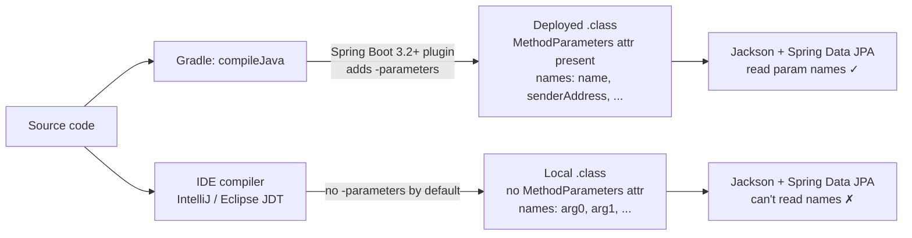

# The javac `-parameters` Flag — Why Local Spring Boot Differs from Deployed

**Date:** 2026-04-15 | **Updated:** 2026-04-15
**Tags:** `spring-boot` `gradle` `lombok` `jackson` `jpa` `tooling`

## Table of Contents

- [Summary](#summary)
- [The Two Symptoms](#the-two-symptoms)
  - [Symptom A — Spring Data JPA named parameters](#symptom-a--spring-data-jpa-named-parameters)
  - [Symptom B — Jackson can't deserialize `@Data @Builder` DTOs](#symptom-b--jackson-cant-deserialize-data-builder-dtos)
- [Why Deployed Works but Local Fails](#why-deployed-works-but-local-fails)
- [Why Lombok `@Data @Builder` Alone Doesn't Generate a No-Arg Constructor](#why-lombok-data-builder-alone-doesnt-generate-a-no-arg-constructor)
- [The Fix](#the-fix)
  - [Step 1 — Enable `-parameters` in build.gradle](#step-1--enable-parameters-in-buildgradle)
  - [Step 2 — Make your IDE honor it](#step-2--make-your-ide-honor-it)
- [Bonus Pitfall — Hypersistence JsonBinaryType Still Needs No-Arg Constructor](#bonus-pitfall--hypersistence-jsonbinarytype-still-needs-no-arg-constructor)
- [Verification](#verification)
- [Related](#related)
- [References](#references)

## Summary

Spring Boot code that works in production can silently break when you run it locally through an IDE debugger. The root cause is bytecode produced without the `-parameters` javac flag: Spring Data JPA can't bind `:namedParam` queries, and Jackson can't construct `@Data @Builder` request DTOs. Spring Boot's Gradle plugin adds `-parameters` by default, but IDE compilers (IntelliJ's built-in, VSCode's Eclipse JDT) don't inherit it unless explicitly configured. The fix is one line in `build.gradle` plus a one-time IDE project reload.

## The Two Symptoms

Both appear only on local runs. Both succeed on the deployed container.

### Symptom A — Spring Data JPA named parameters

```java
@Query("SELECT e FROM EmailEvent e WHERE e.stepId = :stepId AND e.status = :status")
EmailEvent findByStepIdAndStatus(UUID stepId, String status);   // no @Param
```

Runtime error:

```text
org.springframework.dao.InvalidDataAccessApiUsageException:
For queries with named parameters you need to provide names for method parameters;
Use @Param for query method parameters, or when on Java 8+ use the javac flag -parameters
```

### Symptom B — Jackson can't deserialize `@Data @Builder` DTOs

```java
@Data
@Builder
public class CreateEmailSequenceRequest {
  private String name;
  private String senderAddress;
  // ...
}
```

`POST /api/...` with a valid JSON body throws:

```text
Cannot construct instance of CreateEmailSequenceRequest
(no Creators, like default constructor, exist):
cannot deserialize from Object value (no delegate- or property-based Creator)
```

The usual "fix" is to add `@NoArgsConstructor @AllArgsConstructor`. That works, but it papers over the real issue — and the annotations spread across every request DTO in the project.

## Why Deployed Works but Local Fails

Different compilers emit different bytecode for the same source.



**Deployed:** The container's `Dockerfile` typically runs `./gradlew bootJar`. The [Spring Boot Gradle plugin 3.2+](https://github.com/spring-projects/spring-boot/wiki/Spring-Boot-3.2-Release-Notes#java-parameters-flag) auto-adds `-parameters` to every `JavaCompile` task. With `-parameters`, javac writes a `MethodParameters` attribute into the `.class` file, preserving `name`, `senderAddress`, `stepId`, `status`, etc.

With parameter names in bytecode:
- [Spring Data JPA](https://docs.spring.io/spring-data/jpa/reference/jpa/query-methods.html) matches `:stepId` in the `@Query` to the method parameter of the same name.
- [Jackson's `ParameterNamesModule`](https://github.com/FasterXML/jackson-modules-java8/tree/master/parameter-names) (auto-registered by Spring Boot) reads constructor parameter names and uses them to match JSON keys to constructor arguments — even for the package-private all-args constructor Lombok's `@Builder` generates.

**Local:** When you launch through IntelliJ's "Run" or VSCode's Java debugger, the IDE compiles the source with its own compiler — not Gradle. [IntelliJ's built-in compiler](https://www.jetbrains.com/help/idea/configuring-compiler-settings.html) and [Eclipse JDT](https://www.eclipse.org/jdt/) both default to *not* emitting `MethodParameters`. Parameter names in the resulting `.class` file become `arg0`, `arg1`, etc.

- Spring Data JPA sees `arg0` and `arg1` when trying to bind `:stepId`/`:status` → fails.
- Jackson sees the same generic names → can't match JSON keys → falls back to looking for a no-arg constructor and setters → doesn't exist on `@Data @Builder` → fails.

## Why Lombok `@Data @Builder` Alone Doesn't Generate a No-Arg Constructor

Worth naming explicitly because it's subtle.

[Lombok's `@Data`](https://projectlombok.org/features/Data) pulls in [`@RequiredArgsConstructor`](https://projectlombok.org/features/constructor), which generates a constructor for `final` and `@NonNull` fields. If the class has neither, `@RequiredArgsConstructor` would normally generate a no-arg constructor.

But `@RequiredArgsConstructor` is **additive** — if another constructor already exists, it skips. [`@Builder`](https://projectlombok.org/features/Builder) generates a package-private all-args constructor for the builder to call. That constructor's existence tells Lombok "a constructor is already present," so `@RequiredArgsConstructor` doesn't emit the no-arg one.

Result: a `@Data @Builder` class with no `final`/`@NonNull` fields has **exactly one constructor** — package-private, all-args, no annotations. Jackson can only reach it via parameter-name matching, which needs `-parameters`.

## The Fix

### Step 1 — Enable `-parameters` in build.gradle

One block, append to the bottom of `build.gradle`:

```groovy
tasks.withType(JavaCompile).configureEach {
    options.compilerArgs << '-parameters'
}
```

This makes the flag explicit rather than depending on the Spring Boot Gradle plugin default. IDEs that read their javac args from the Gradle project model (which includes VSCode's Red Hat Java extension) will pick it up.

### Step 2 — Make your IDE honor it

**VSCode (Red Hat Java extension):**

1. Command Palette (⌘⇧P) → **Java: Clean Java Language Server Workspace** → choose **Restart and delete**. This flushes the cached Gradle project model.
2. Optionally, add a `preLaunchTask` to `.vscode/launch.json` to force Gradle to compile before debug sessions (guarantees parity with deployed):
   ```json
   {
     "type": "java",
     "name": "MyApp",
     "request": "launch",
     "mainClass": "com.example.MyApp",
     "projectName": "my-project",
     "preLaunchTask": "gradle: compileJava"
   }
   ```

**IntelliJ IDEA:**

- Settings → Build, Execution, Deployment → Build Tools → Gradle → **Build and run using**: set both dropdowns to **Gradle**. This tells IntelliJ to delegate compilation to Gradle, which already has `-parameters` configured.
- Alternative if you prefer IntelliJ's own compiler: Settings → Build, Execution, Deployment → Compiler → Java Compiler → **Additional command line parameters**: add `-parameters`. Per-developer setting, not source-controlled — the Gradle approach is more reliable for teams.

## Bonus Pitfall — Hypersistence JsonBinaryType Still Needs No-Arg Constructor

Even with `-parameters` enabled, JSONB-mapped entity fields using [Hypersistence Utils](https://github.com/vladmihalcea/hypersistence-utils) have a **separate** requirement.

```java
@Type(JsonBinaryType.class)
@Column(name = "metadata", columnDefinition = "jsonb")
private MyMetadataDto metadata;
```

Hibernate's dirty-checking calls `deepCopy()` on mutable column values. For `JsonBinaryType`, deepCopy serializes to JSON bytes and deserializes back — and Hypersistence's internal `ObjectMapperWrapper` does **not** register `ParameterNamesModule`. So it can't use parameter names to find a constructor.

Failure:

```text
Cannot construct instance of MyMetadataDto
(no Creators, like default constructor, exist)
```

Fix: JSONB-mapped DTOs need an explicit no-arg constructor.

```java
@Data
@Builder
@NoArgsConstructor       // required for Hypersistence JsonBinaryType
@AllArgsConstructor      // required because @Builder's constructor vanishes once @NoArgsConstructor exists
public class MyMetadataDto {
  private String useCaseId;
  private String emailType;
}
```

This applies *only* to DTOs mapped as JSONB via `JsonBinaryType` (or stored via Hibernate's mutable type cloning). HTTP request/response DTOs that only flow through Jackson don't need the extra annotations once `-parameters` is on.

## Verification

1. **Clean build**: `./gradlew clean build` succeeds.
2. **Bytecode inspection**: `javap -v build/classes/java/main/path/to/Class.class | grep -A 2 MethodParameters` should show real names (not `arg0`, `arg1`).
3. **IDE reload**: VSCode "Clean Java Language Server Workspace" → Restart and delete.
4. **Symptom A repro**: A `@Query` method without `@Param` should work.
5. **Symptom B repro**: A `@Data @Builder` request DTO without `@NoArgsConstructor` should deserialize successfully.
6. **JSONB sanity check**: Confirm JSONB-mapped DTOs still have `@NoArgsConstructor @AllArgsConstructor` — those are still required for Hypersistence.

## Related

- [Fixing WebClient DNS Resolution Failures — Netty vs JDK Resolver](webclient-netty-dns-resolver-fix.md) — another "works on deployed, fails locally" gotcha, same shape: Netty's own implementation differs from the OS-level default, and the fix is forcing the standard path.
- [JPA Transactions in Spring Boot — With Reactive WebFlux Caveats](jpa-transactions.md) — related because JSONB mutability-cloning happens inside JPA transactions; understanding dirty checking clarifies why `deepCopy` runs at all.

## References

- [Spring Boot 3.2 Release Notes — `-parameters` default](https://github.com/spring-projects/spring-boot/wiki/Spring-Boot-3.2-Release-Notes#java-parameters-flag) — the release that made the Gradle plugin auto-add the flag.
- [Spring Data JPA — Using `@Param`](https://docs.spring.io/spring-data/jpa/reference/jpa/query-methods.html#jpa.query-methods.at-query) — official explanation of named parameter binding and when `@Param` is required.
- [Jackson Parameter Names Module](https://github.com/FasterXML/jackson-modules-java8/tree/master/parameter-names) — how Jackson discovers constructor parameter names from `MethodParameters` bytecode.
- [Project Lombok — `@Data`](https://projectlombok.org/features/Data) — full annotation behavior and the implicit `@RequiredArgsConstructor` rule.
- [Project Lombok — `@Builder`](https://projectlombok.org/features/Builder) — what constructor `@Builder` generates and its visibility.
- [JEP 118 — Access to Parameter Names at Runtime](https://openjdk.org/jeps/118) — the JDK feature `-parameters` enables, added in Java 8.
- [Hypersistence Utils — `JsonBinaryType`](https://github.com/vladmihalcea/hypersistence-utils#hibernate-types) — canonical reference for JSONB mapping in Hibernate 6+.
- [Spring Boot Gradle Plugin — Java Compilation](https://docs.spring.io/spring-boot/gradle-plugin/reacting.html) — documents the plugin's reactive customizations including compile options.
