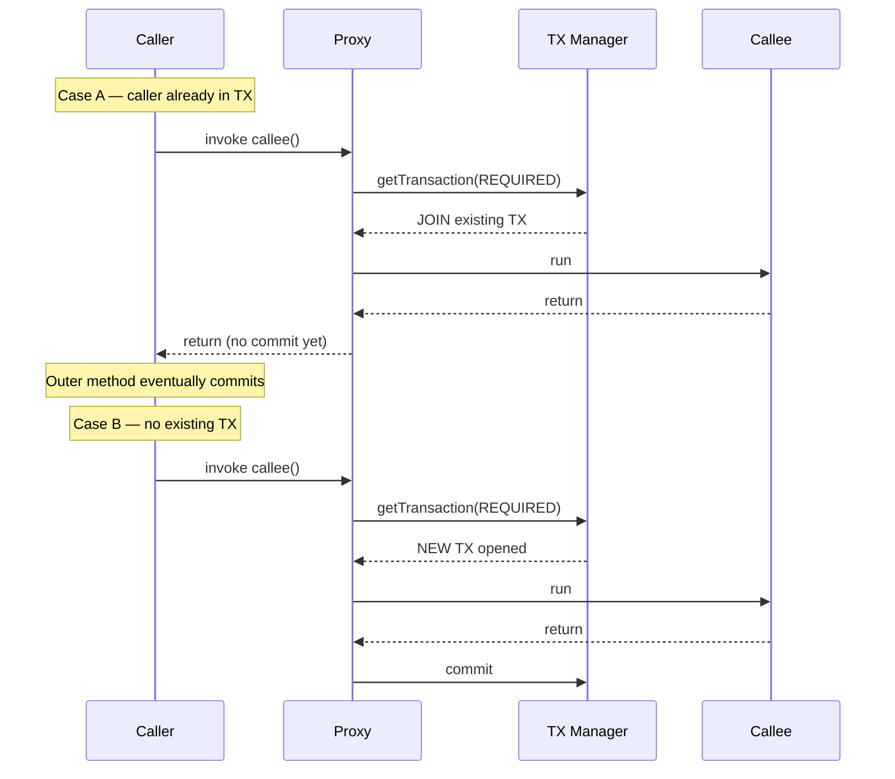
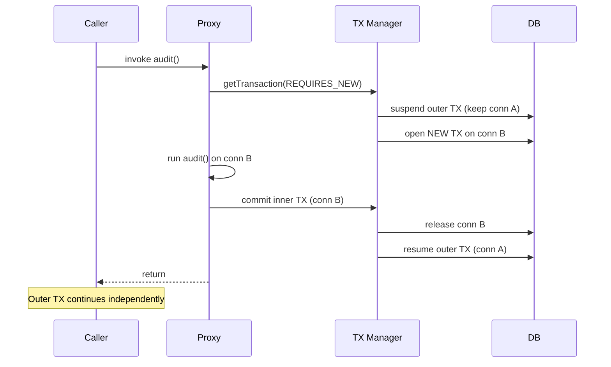
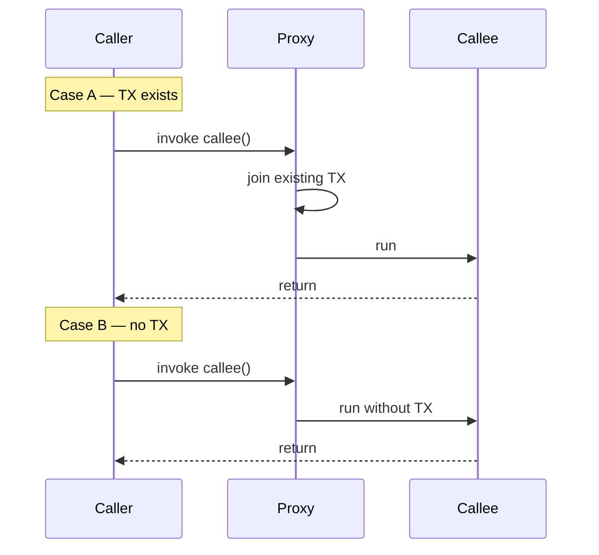
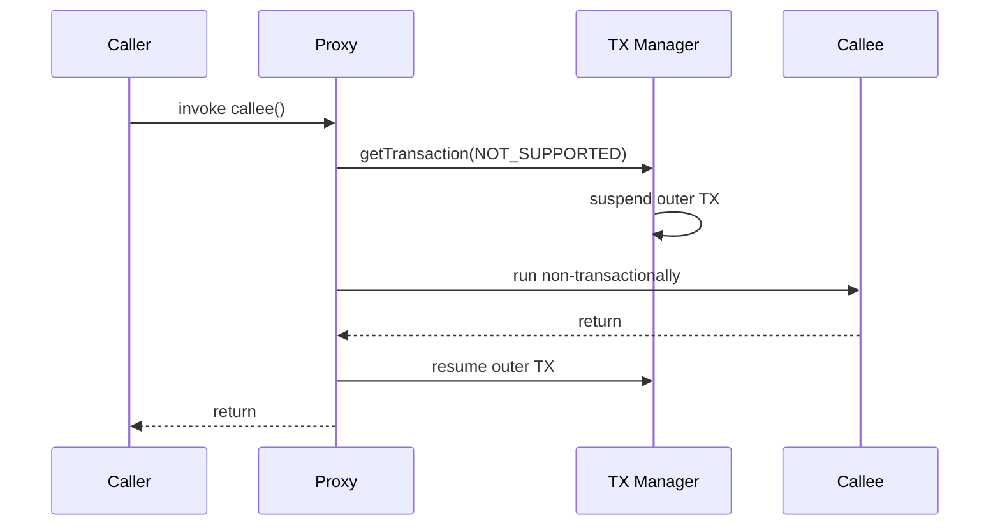
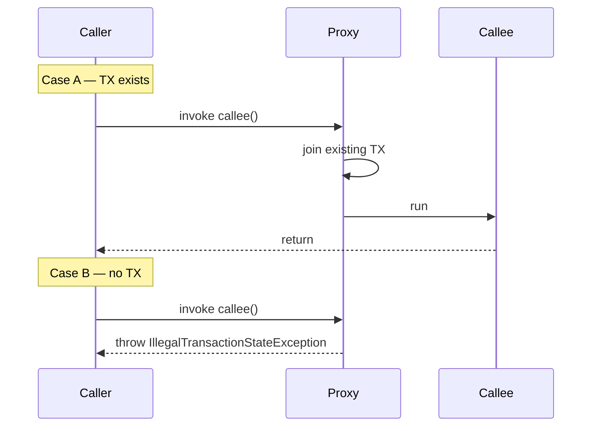
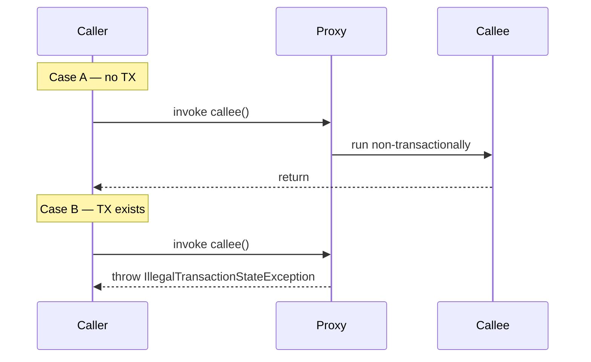

# JPA Transaction Propagation and Isolation — In Depth

**Date:** 2026-04-17 | **Updated:** 2026-04-17
**Tags:** `jpa` `transactions` `propagation` `isolation` `spring`

## Table of Contents

- [Summary](#summary)
- [Recap — How @Transactional Works](#recap--how-transactional-works)
- [Propagation Levels](#propagation-levels)
  - [REQUIRED (default)](#required-default)
  - [REQUIRES_NEW](#requires_new)
  - [NESTED](#nested)
  - [SUPPORTS](#supports)
  - [NOT_SUPPORTED](#not_supported)
  - [MANDATORY](#mandatory)
  - [NEVER](#never)
- [Common Usage Patterns](#common-usage-patterns)
- [Propagation and Self-Invocation](#propagation-and-self-invocation)
- [Isolation Levels](#isolation-levels)
  - [Read Phenomena](#read-phenomena)
  - [The Five Levels](#the-five-levels)
  - [Picking a Level](#picking-a-level)
- [Rollback Rules](#rollback-rules)
- [Read-Only Transactions](#read-only-transactions)
- [Timeout](#timeout)
- [Programmatic Transactions with TransactionTemplate](#programmatic-transactions-with-transactiontemplate)
- [Reactive Caveat](#reactive-caveat)
- [Common Bugs](#common-bugs)
- [Related](#related)
- [References](#references)

---

## Summary

**Propagation** defines how a `@Transactional` method behaves when it is invoked from *another* transactional context. Should it join the caller's transaction? Suspend it and run independently? Refuse to run without one? Spring offers seven propagation modes, each answering this question differently.

**Isolation** defines what *concurrent* transactions see of each other's uncommitted or in-flight data. It controls the tradeoff between consistency and throughput. Spring exposes the standard SQL isolation levels plus a `DEFAULT` that delegates to the database.

Together, propagation and isolation shape two orthogonal axes of transactional behavior:

- Propagation: *scope* — which transaction am I in?
- Isolation: *visibility* — what can I see while I am in it?

Both settings live on the same `@Transactional` annotation and both have traps that silently break correctness when misused. This document covers each option with concrete diagrams and examples.

---

## Recap — How @Transactional Works

Spring's `@Transactional` is implemented via an **AOP proxy**. When a bean is annotated (or has annotated methods), Spring wraps it in a proxy that intercepts external calls, opens a transaction via the configured `PlatformTransactionManager`, invokes the real method, and then commits or rolls back based on the outcome.

See [`jpa-transactions.md`](./jpa-transactions.md) for the full proxy model, `readOnly` semantics, rollback rules, and JPA-specific behaviors like dirty checking and flush modes. This document assumes you already understand those basics.

**The one trap you must remember before proceeding:**

```java
@Service
public class OrderService {

    @Transactional
    public void placeOrder(Order o) {
        // ...
        this.writeAudit(o);   // BYPASSES the proxy — no new transaction
    }

    @Transactional(propagation = Propagation.REQUIRES_NEW)
    public void writeAudit(Order o) { /* ... */ }
}
```

The `this.writeAudit(...)` call does **not** go through the proxy. No matter what propagation you declare, the annotation is silently ignored. Every propagation mode assumes the call crosses the proxy boundary. If it doesn't, nothing applies.

---

## Propagation Levels

Spring defines seven propagation modes in `org.springframework.transaction.annotation.Propagation`. For every diagram below:

- **Caller** = outer method (has or does not have an existing transaction)
- **Callee** = inner `@Transactional` method with the propagation under discussion
- **TX Manager** = `PlatformTransactionManager` (typically `JpaTransactionManager`)

---

### REQUIRED (default)

**Rule:** Join the caller's transaction if one exists. Otherwise, create a new one.

This is the default because it is almost always what you want: the caller and callee share a single atomic unit of work. Rollback in the callee marks the whole transaction rollback-only, and the commit happens at the outer boundary.



**Behavior:** A rollback inside the joined transaction marks it rollback-only. If the outer method then tries to commit, Spring throws `UnexpectedRollbackException`. This prevents half-committed state but can surprise callers who did not know an inner method rolled back.

---

### REQUIRES_NEW

**Rule:** Always create a brand-new transaction. If one exists, **suspend** it for the duration of the call and resume it afterward.

The inner transaction commits or rolls back *independently* of the outer one. This requires the transaction manager to actually suspend the outer transaction — which in practice means allocating a second physical database connection.



**Key property:** The inner transaction is durable even if the outer one later rolls back. This is the primary reason to reach for `REQUIRES_NEW` — audit logs, [outbox](graphql/multi-database-patterns.md#outbox-pattern) writes, counters, and anything that must persist regardless of the outer outcome.

**Warning:** Suspending consumes a second connection. In a hot path with a small connection pool, naive use of `REQUIRES_NEW` deadlocks the pool (the outer transaction holds one connection and waits for the inner, which waits for another free connection).

---

### NESTED

**Rule:** Run inside a **savepoint** within the caller's transaction. Commit of the inner scope releases the savepoint; rollback of the inner scope rolls back to the savepoint without aborting the outer.

This is a *single* physical transaction with a savepoint in the middle — not two transactions.

```mermaid
sequenceDiagram
    participant Caller
    participant Proxy
    participant TXM as TX Manager
    participant DB

    Caller->>Proxy: invoke riskyStep()
    Proxy->>TXM: getTransaction(NESTED)
    TXM->>DB: SAVEPOINT sp1
    Proxy->>Proxy: run riskyStep()
    alt step succeeds
        Proxy->>TXM: release savepoint
    else step throws
        Proxy->>TXM: rollback to sp1
    end
    Proxy-->>Caller: return or error
    Note over Caller: Outer TX still live; may commit or rollback
```

**Supported by:** `DataSourceTransactionManager` (plain JDBC). **Not supported by** `JpaTransactionManager` unless you configure `nestedTransactionAllowed = true` and your driver/DB supports savepoints. In JPA you often get a `NestedTransactionNotSupportedException`.

Use `NESTED` when you want *partial rollback* inside a long unit of work — retry a single step without discarding all the work done before it.

---

### SUPPORTS

**Rule:** If a transaction exists, join it. Otherwise, run **non-transactionally**.



Useful for read methods that *can* participate in a transaction (to see consistent state) but don't require one. In practice this is rare: you usually want either a real read-only transaction or no transaction at all. Ambiguity tends to surface as "sometimes flushes happen, sometimes they don't."

---

### NOT_SUPPORTED

**Rule:** Always run **without** a transaction. Suspend any existing one for the duration of the call.



Use this for slow work that should not hold database locks — external HTTP calls, batch processing of independent rows, file I/O — when the method happens to live on a service class that is transactional elsewhere. Suspending the outer transaction releases its locks briefly; on a long outer method, this prevents the inner step from extending the locked window.

---

### MANDATORY

**Rule:** Must run inside an existing transaction. If none exists, throw `IllegalTransactionStateException`.



Use `MANDATORY` to enforce at API boundaries that a method may only be invoked from within a transaction. This is excellent documentation-as-code: if a repository helper only makes sense mid-transaction, declaring `MANDATORY` turns an architectural expectation into a runtime check.

---

### NEVER

**Rule:** Must **not** run inside a transaction. If one exists, throw `IllegalTransactionStateException`.



Rarely used. The main case is guarding against accidental transactional context on a method that must be side-effect-free or that performs its own connection management.

---

## Common Usage Patterns

### Audit logging with REQUIRES_NEW

Audits must persist even when the business operation rolls back — you want to know *why* a failed order failed.

```java
@Service
public class OrderService {

    private final AuditService auditService;

    @Transactional
    public void placeOrder(Order o) {
        validate(o);
        saveOrder(o);
        auditService.record("ORDER_CREATED", o.getId()); // separate proxy
        charge(o);   // if this throws, order rollback BUT audit persists
    }
}

@Service
public class AuditService {
    @Transactional(propagation = Propagation.REQUIRES_NEW)
    public void record(String event, Long id) { /* INSERT */ }
}
```

Audit is a separate bean (`AuditService`), so the call goes through its proxy. If `charge()` fails and the outer transaction rolls back, the audit row has already been committed on its own connection.

### Partial rollback with NESTED

When `NESTED` is supported, it lets a sub-step fail without killing the whole job:

```java
@Transactional
public void processBatch(List<Row> rows) {
    for (Row r : rows) {
        try {
            processOne(r);  // NESTED — rolls back just this row on failure
        } catch (Exception e) {
            log.warn("Row {} failed, continuing", r.id(), e);
        }
    }
}

@Transactional(propagation = Propagation.NESTED)
public void processOne(Row r) { /* ... */ }
```

If `NESTED` is not supported by your setup, the same effect can be approximated with `REQUIRES_NEW`, at the cost of a second connection per row.

### Enforcing transactional context with MANDATORY

Low-level helpers that flush, lock, or batch native SQL often only make sense within an existing transaction. `MANDATORY` documents and enforces that contract:

```java
@Service
public class LockHelpers {
    @Transactional(propagation = Propagation.MANDATORY)
    public void lockForUpdate(Long id) { /* SELECT ... FOR UPDATE */ }
}
```

A developer who calls `lockForUpdate` without an outer transaction gets a loud failure at runtime rather than silent single-statement auto-commit that holds no lock beyond the statement.

---

## Propagation and Self-Invocation

Revisiting the trap from [`jpa-transactions.md`](./jpa-transactions.md) with propagation in mind: **no propagation mode rescues you from self-invocation.**

```java
@Service
public class ReportService {

    @Transactional
    public void generateAll() {
        for (Long id : ids) {
            this.processOne(id);   // STILL the this reference — no proxy
        }
    }

    @Transactional(propagation = Propagation.REQUIRES_NEW)
    public void processOne(Long id) {
        // expected: its own transaction per row
        // reality:  runs inside generateAll()'s transaction
    }
}
```

`this.processOne(id)` is a direct JVM method invocation. The proxy sits *outside* the bean; `this` is the underlying object. The `@Transactional(propagation = REQUIRES_NEW)` annotation is read only when a call comes in through the proxy. For self-calls, propagation, isolation, timeout, read-only, and rollback rules are all ignored.

**Fixes:**

1. Extract the inner method into a separate bean (most common — natural separation of concerns).
2. Inject the bean into itself (self-inject via `@Autowired` on a field of its own type, or via `ApplicationContext.getBean`). Breaks cleanness; avoid unless constrained.
3. Use `AopContext.currentProxy()` with `exposeProxy = true` on `@EnableTransactionManagement`. Works, but couples your code to Spring AOP plumbing.

Option (1) is nearly always the correct answer.

---

## Isolation Levels

Isolation controls what a transaction sees of concurrent transactions' in-flight changes. The SQL standard defines four anomalies and four levels; Spring adds `DEFAULT` as a fifth enum value.

### Read Phenomena

| Phenomenon | Description |
|---|---|
| **Dirty read** | Reading data written by another transaction that has not yet committed. If that other transaction rolls back, you read data that never officially existed. |
| **Non-repeatable read** | Reading the same row twice in one transaction and getting different values because another transaction committed an update in between. |
| **Phantom read** | Running the same range query twice in one transaction and getting different *sets of rows* because another transaction committed inserts or deletes in between. |
| **Lost update** | Two transactions read the same row, both update it based on the read, and the second commit overwrites the first. Not in the original SQL standard but commonly discussed. |

### The Five Levels

Spring's `Isolation` enum values and the anomalies they prevent:

| Spring level | Dirty read | Non-repeatable read | Phantom read |
|---|---|---|---|
| `DEFAULT` | database-defined | database-defined | database-defined |
| `READ_UNCOMMITTED` | allowed | allowed | allowed |
| `READ_COMMITTED` | prevented | allowed | allowed |
| `REPEATABLE_READ` | prevented | prevented | allowed* |
| `SERIALIZABLE` | prevented | prevented | prevented |

*MySQL InnoDB's `REPEATABLE_READ` actually prevents phantoms too via next-key locking. PostgreSQL's `REPEATABLE_READ` prevents phantoms for snapshot-visible rows but not for serialization anomalies across transactions — it adds a distinct `SERIALIZABLE` level on top.

### Picking a Level

- **`DEFAULT`** — recommended in Spring code. Lets each database behave idiomatically and makes intent explicit: "I accept the DB default."
- **`READ_UNCOMMITTED`** — almost never correct. A few reporting queries where inconsistency is cheaper than blocking. Not supported by PostgreSQL (treated as `READ_COMMITTED`).
- **`READ_COMMITTED`** — PostgreSQL default and a sensible default for most OLTP code.
- **`REPEATABLE_READ`** — MySQL InnoDB default. Use when a single transaction reads the same row or range more than once and must see consistent values. Beware of increased locking.
- **`SERIALIZABLE`** — the strictest level. Guarantees that transactions are equivalent to some serial execution. Expensive — expect serialization failures under contention and be ready to retry.

Example:

```java
@Transactional(isolation = Isolation.SERIALIZABLE, timeout = 10)
public Report computeFinancialSnapshot() { /* ... */ }
```

Many applications never set `isolation` explicitly and simply rely on optimistic locking (`@Version`) or `SELECT ... FOR UPDATE` for the specific rows that need strong guarantees. That is usually the right call — raising the isolation level globally punishes every query to protect a few.

---

## Rollback Rules

By default, Spring rolls back a transaction on:

- any `RuntimeException` (unchecked)
- any `Error`

and **commits** on:

- any **checked** exception (a subclass of `Exception` but not `RuntimeException`)

This surprises developers coming from "exception means rollback" mental models. A `@Transactional` method that throws a checked `IOException` will **commit** every change made before the throw.

```java
@Transactional
public void importFile(Path p) throws IOException {
    repo.save(new ImportJob(p));
    Files.readAllLines(p);  // IOException — but the ImportJob row COMMITS
}
```

Override per method:

```java
// Roll back on a specific checked exception
@Transactional(rollbackFor = IOException.class)
public void importFile(Path p) throws IOException { /* ... */ }

// Or the nuclear option: roll back on any throwable
@Transactional(rollbackFor = Throwable.class)
public void strict() { /* ... */ }

// Prevent rollback even on a RuntimeException (rare)
@Transactional(noRollbackFor = HarmlessValidationException.class)
public void forgiving() { /* ... */ }
```

A consistent choice in many codebases is `rollbackFor = Exception.class` on a base `@Transactional` meta-annotation, which aligns rollback behavior with developer intuition.

---

## Read-Only Transactions

```java
@Transactional(readOnly = true)
public List<Order> search(String q) { /* ... */ }
```

**What `readOnly = true` actually does:**

1. **Hibernate optimization:** skips dirty checking at flush time. No auto-generated UPDATE statements — entities loaded in a read-only transaction are not tracked as managed for write.
2. **FlushMode:** set to `MANUAL`, so `flush()` is a no-op unless called explicitly.
3. **Driver hint:** passed to the JDBC connection via `Connection.setReadOnly(true)`. Some drivers pay attention (e.g., route to read replicas when behind a proxy like PgBouncer or a read/write splitter); many simply ignore it.
4. **TransactionManager hint:** some transaction managers use it to choose a replica DataSource if configured.

**What `readOnly` does NOT do:**

- It does **not** enforce read-only at the database level in most setups. Writes still reach the DB; the database will happily apply them if nothing else stops it.
- It is a *hint* for performance and intent, not a safety mechanism. Do not rely on it to prevent malicious or buggy writes.

Use `readOnly = true` liberally on query methods. The dirty-check skip alone is a noticeable performance improvement on large result sets.

---

## Timeout

```java
@Transactional(timeout = 30)
public void slowJob() { /* ... */ }
```

The timeout is in **seconds** and counts against the transaction's wall-clock duration. On expiry, Spring triggers a rollback.

**How it works under the hood:** the transaction manager sets a deadline and applies it via `java.sql.Statement.setQueryTimeout(int)` on every statement issued during the transaction. So the timeout is enforced **per statement**, using the remaining budget. A 30-second transaction that runs thirty 1-second queries will succeed; one that runs a single 31-second query will be interrupted.

**Driver support varies.** Most modern drivers honor `setQueryTimeout`. A few ignore it silently. For critical timeouts, also configure a DataSource-level statement timeout (PostgreSQL: `statement_timeout`; MySQL: `MAX_EXECUTION_TIME` hint) so the database enforces its own cap.

Use `timeout` to protect endpoint latency SLOs — a runaway transaction aborts cleanly instead of hanging forever.

---

## Programmatic Transactions with TransactionTemplate

`@Transactional` is declarative: the scope is the method boundary. When you need *dynamic* scoping — for example, a loop where each iteration is its own transaction, or a transaction whose boundaries depend on runtime data — annotations are too coarse. Use `TransactionTemplate`.

```java
@Service
public class ImportService {

    private final TransactionTemplate tx;

    public ImportService(PlatformTransactionManager ptm) {
        this.tx = new TransactionTemplate(ptm);
        this.tx.setPropagationBehavior(TransactionDefinition.PROPAGATION_REQUIRES_NEW);
        this.tx.setTimeout(15);
    }

    public void importRows(List<Row> rows) {
        for (Row r : rows) {
            tx.executeWithoutResult(status -> {
                try {
                    process(r);
                } catch (RowInvalidException e) {
                    status.setRollbackOnly(); // mark this row's tx to rollback
                }
            });
        }
    }
}
```

**When to reach for `TransactionTemplate`:**

- Many short, independent transactions inside one method call — per-row in a batch, per-message in a consumer loop.
- Dynamic propagation or isolation chosen at runtime (e.g., elevate isolation if a feature flag is on).
- Fine-grained `status.setRollbackOnly()` / `status.isRollbackOnly()` introspection.
- Non-Spring-managed code paths where AOP isn't available.

Declarative `@Transactional` remains the right default. `TransactionTemplate` is the escape hatch.

---

## Reactive Caveat

**`@Transactional` does not work on methods returning `Mono` or `Flux` when you are using a blocking JPA repository.** The proxy opens a transaction when the method is *invoked*, not when the returned publisher is *subscribed*. With a reactive return type, the JPA work typically runs on a different thread after the proxy has already committed — or worse, the transaction closes before the downstream subscriber has issued any queries.

For R2DBC (fully reactive), Spring provides a different story: the `ReactiveTransactionManager` plus `@Transactional` on reactive return types **does** work, because the framework propagates the transactional context through the Reactor `Context`. For JPA over a reactive controller, you need one of:

- Wrap blocking JPA calls with `Mono.fromCallable(...).subscribeOn(Schedulers.boundedElastic())` *inside* a transactional method boundary (the blocking pattern — see [`reactive-blocking-jpa-pattern.md`](./reactive-blocking-jpa-pattern.md)).
- Use `TransactionalOperator` (reactive) with an `R2dbcTransactionManager` when your data layer is R2DBC.
- Confine JPA to a synchronous service and expose it to WebFlux controllers via a bridging adapter.

```java
// R2DBC / reactive TX operator (NOT JPA)
public Mono<Void> transferReactive(Long from, Long to, BigDecimal amt) {
    return operator.transactional(
        accountRepo.debit(from, amt)
            .then(accountRepo.credit(to, amt))
    );
}
```

For the full treatment of reactive + transactions (including why blocking JPA `Mono`s break transactional semantics), see [`reactive-advanced-topics.md`](./reactive-advanced-topics.md) and [`jpa-transactions.md`](./jpa-transactions.md) → "Transactions in Reactive WebFlux".

---

## Common Bugs

1. **Self-invocation silently drops the transaction.**
   `this.other()` bypasses the proxy. No propagation, no isolation, no timeout, no rollback rule applies. Fix: extract to another bean or inject self via `AopContext`.

2. **Checked exception commits instead of rolling back.**
   Default rollback rules fire only for `RuntimeException` / `Error`. A thrown `IOException` or custom checked `BusinessException` *commits* everything done so far. Fix: `rollbackFor = Exception.class` (or specific types) on the annotation.

3. **`REQUIRES_NEW` in a tight loop exhausts the connection pool.**
   Each invocation suspends the outer transaction (holding its connection) and opens another one. With a pool of N connections and a loop of N+1 `REQUIRES_NEW` calls nested inside an outer transaction, the (N+1)th call waits forever for a free connection. Fix: use `NESTED` (savepoint) when possible, or batch audit-style writes outside the hot path.

4. **Expecting `readOnly = true` to be enforced.**
   It's a hint. Hibernate skips dirty checks; the database usually does not actually reject writes. A bug that issues an `INSERT` during a read-only transaction will typically commit. Fix: rely on code review, or on database-level read-only users for roles that should never write.

5. **`@Transactional` on a `private` method.**
   The proxy only intercepts public (or, in CGLIB mode, protected/package) methods. Annotations on `private` methods are silently ignored. Fix: make the method public and call it from another bean, or inline its body into the public caller.

6. **Isolation expectations that don't match the database.**
   `REPEATABLE_READ` on MySQL InnoDB also prevents phantoms (next-key locking); on PostgreSQL it does not prevent all serialization anomalies — you'd need `SERIALIZABLE` for that. Testing on one DB and deploying to another is how this bug hides.

7. **Long timeout on a short-lived HTTP request.**
   `@Transactional(timeout = 600)` looks defensive but is a footgun: a runaway transaction holds locks and connections for ten minutes. Size the timeout to the SLO you actually promise (e.g., 2–5 seconds for user-facing endpoints).

8. **Propagation mismatch with `REQUIRES_NEW` and shared entities.**
   An entity loaded in the outer transaction is *detached* relative to the inner `REQUIRES_NEW` transaction. Passing it to inner JPA calls can trigger `LazyInitializationException` or subtle merge-vs-persist bugs. Fix: re-fetch by id inside the new transaction, or pass a DTO.

---

## Related

- [`jpa-transactions.md`](./jpa-transactions.md) — `@Transactional` basics, ACID, persistence context, dirty checking, locking, and the self-invocation trap
- [`data-repositories/repository-interfaces.md`](./data-repositories/repository-interfaces.md) — how Spring Data repositories interact with transaction boundaries
- [`spring-fundamentals.md`](./spring-fundamentals.md) — AOP proxy model that underlies `@Transactional`
- [`reactive-advanced-topics.md`](./reactive-advanced-topics.md) — reactive transaction operators, context propagation, and the JPA/WebFlux boundary
- [`reactive-blocking-jpa-pattern.md`](./reactive-blocking-jpa-pattern.md) — the `boundedElastic` + `Mono.fromCallable` pattern for JPA behind a reactive controller

---

## References

- Spring Framework Reference — Transaction Management: <https://docs.spring.io/spring-framework/reference/data-access/transaction.html>
- Spring Framework Reference — Declarative Transaction Management (`@Transactional` attributes, propagation, isolation): <https://docs.spring.io/spring-framework/reference/data-access/transaction/declarative.html>
- `org.springframework.transaction.annotation.Propagation` Javadoc: <https://docs.spring.io/spring-framework/docs/current/javadoc-api/org/springframework/transaction/annotation/Propagation.html>
- `org.springframework.transaction.annotation.Isolation` Javadoc: <https://docs.spring.io/spring-framework/docs/current/javadoc-api/org/springframework/transaction/annotation/Isolation.html>
- PostgreSQL — Transaction Isolation: <https://www.postgresql.org/docs/current/transaction-iso.html>
- MySQL — Transaction Isolation Levels (InnoDB): <https://dev.mysql.com/doc/refman/8.0/en/innodb-transaction-isolation-levels.html>
- Vlad Mihalcea — A beginner's guide to Spring transaction propagation: <https://vladmihalcea.com/a-beginners-guide-to-spring-transaction-propagation/>
- Vlad Mihalcea — A beginner's guide to database transaction isolation levels: <https://vladmihalcea.com/a-beginners-guide-to-transaction-isolation-levels-in-enterprise-java/>
- Vlad Mihalcea — The best way to use `@Transactional(readOnly = true)`: <https://vladmihalcea.com/spring-transactional-read-only/>
- Vlad Mihalcea — How does Spring Transaction Management work: <https://vladmihalcea.com/a-beginners-guide-to-spring-transaction-management/>
