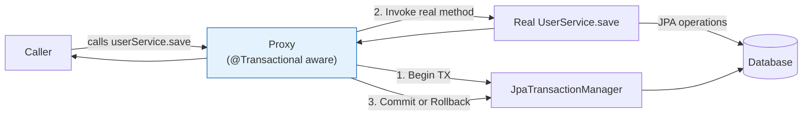
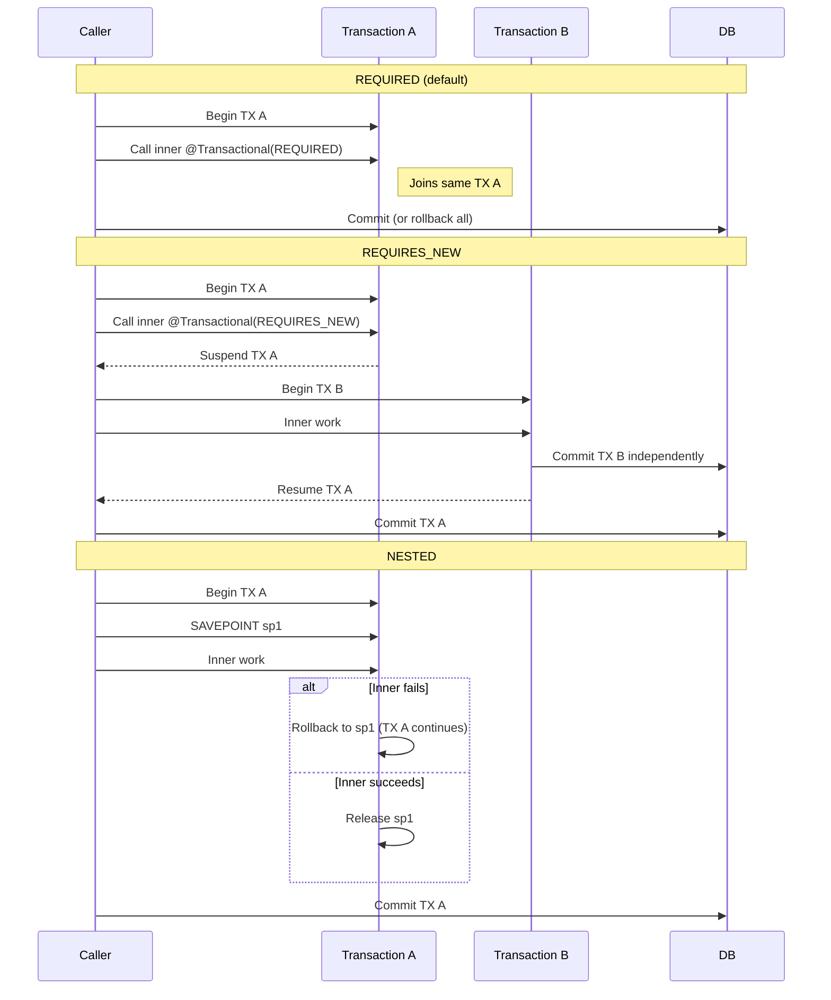
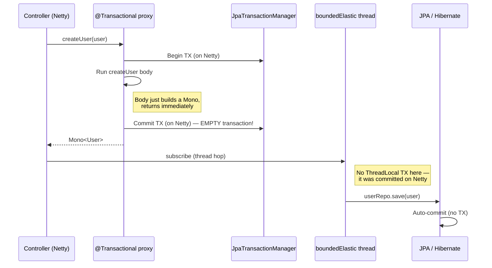

# JPA Transactions in Spring Boot — With Reactive WebFlux Caveats

**Date:** 2026-04-16 | **Updated:** 2026-04-16
**Tags:** `jpa` `transactions` `hibernate` `spring` `webflux` `reactive` `locking`

## Table of Contents

- [Summary](#summary)
- [Foundations](#foundations)
  - [ACID Properties](#acid-properties)
  - [Spring's PlatformTransactionManager](#springs-platformtransactionmanager)
  - [The @Transactional AOP Proxy Model](#the-transactional-aop-proxy-model)
- [@Transactional Basics](#transactional-basics)
  - [Declarative vs Programmatic](#declarative-vs-programmatic)
  - [Where to Place @Transactional](#where-to-place-transactional)
  - [readOnly = true Optimization](#readonly--true-optimization)
  - [Timeout](#timeout)
  - [Rollback Rules — The Checked Exception Gotcha](#rollback-rules--the-checked-exception-gotcha)
  - [Self-Invocation Pitfall](#self-invocation-pitfall)
  - [When Self-Invocation Is NOT a Problem](#when-self-invocation-is-not-a-problem)
  - [@Transactional on private Methods](#transactional-on-private-methods)
- [Propagation](#propagation)
  - [The 7 Propagation Types](#the-7-propagation-types)
  - [REQUIRED vs REQUIRES_NEW vs NESTED](#required-vs-requires_new-vs-nested)
  - [Use Cases](#use-cases)
- [Isolation Levels](#isolation-levels)
  - [The Four Phenomena](#the-four-phenomena)
  - [The Four Levels](#the-four-levels)
  - [Database Defaults](#database-defaults)
- [JPA-Specific Behavior](#jpa-specific-behavior)
  - [The Persistence Context](#the-persistence-context)
  - [Flush Modes](#flush-modes)
  - [Dirty Checking](#dirty-checking)
  - [flush() and clear()](#flush-and-clear)
  - [Cascade Types](#cascade-types)
  - [LazyInitializationException — The #1 JPA Bug](#lazyinitializationexception--the-1-jpa-bug)
  - [Open Session In View — Disable It](#open-session-in-view--disable-it)
  - [persist() vs merge()](#persist-vs-merge)
- [Concurrency and Locking](#concurrency-and-locking)
  - [Optimistic Locking with @Version](#optimistic-locking-with-version)
  - [Retry on OptimisticLockException](#retry-on-optimisticlockexception)
  - [Pessimistic Locking](#pessimistic-locking)
  - [Deadlocks](#deadlocks)
- [Transactions in Reactive WebFlux — The Critical Section](#transactions-in-reactive-webflux--the-critical-section)
  - [Why @Transactional on Mono-Returning JPA Methods Is Broken](#why-transactional-on-mono-returning-jpa-methods-is-broken)
  - [The Correct Pattern](#the-correct-pattern)
  - [Multi-Operation Transactions in Reactive](#multi-operation-transactions-in-reactive)
  - [R2DBC Contrast](#r2dbc-contrast)
  - [Rollback Across Async Boundaries](#rollback-across-async-boundaries)
- [Common Pitfalls](#common-pitfalls)
- [Testing Transactions](#testing-transactions)
  - [@DataJpaTest](#datajpatest)
  - [@Transactional on Tests](#transactional-on-tests)
  - [Testing Optimistic Lock Conflicts](#testing-optimistic-lock-conflicts)
  - [Testing Reactive + JPA](#testing-reactive--jpa)
- [Related](#related)
- [References](#references)

---

## Summary

This doc covers [Spring's `@Transactional`](https://docs.spring.io/spring-framework/reference/data-access/transaction.html) with JPA/Hibernate: declarative transactions, propagation and isolation, persistence context behavior, optimistic and pessimistic locking, and the critical pitfall of using `@Transactional` on `Mono`-returning methods when JPA is the underlying store. JPA relies on `ThreadLocal` for transaction state; Reactor hops threads via `subscribeOn`, so the naive `@Transactional` + reactive wrapper combination silently breaks. The correct pattern is to put `@Transactional` on a synchronous delegate method invoked from inside `Mono.fromCallable`.

---

## Foundations

### ACID Properties

Every transaction guarantees four properties:

| Property | Meaning |
|----------|---------|
| **Atomicity** | All operations succeed or all are rolled back |
| **Consistency** | The database moves from one valid state to another |
| **Isolation** | Concurrent transactions don't see each other's intermediate state |
| **Durability** | Once committed, changes survive crashes |

In Spring, you rarely interact with these directly — the `PlatformTransactionManager` and `@Transactional` abstract them. But isolation level is a tunable (see [Isolation Levels](#isolation-levels)).

### Spring's PlatformTransactionManager

Spring abstracts transaction management with `PlatformTransactionManager`. You don't instantiate one manually — Spring Boot auto-configures the right implementation:

| Stack | Manager | Auto-configured When |
|-------|---------|---------------------|
| JPA (Hibernate) | `JpaTransactionManager` | `spring-boot-starter-data-jpa` on classpath |
| Plain JDBC | `DataSourceTransactionManager` | JDBC starter + no JPA |
| R2DBC | `R2dbcTransactionManager` | `spring-boot-starter-data-r2dbc` |
| Distributed (JTA) | `JtaTransactionManager` | Atomikos/Bitronix + [JTA config](https://docs.spring.io/spring-boot/reference/io/jta.html) |

This doc focuses on `JpaTransactionManager`.

### The @Transactional AOP Proxy Model

`@Transactional` works via Spring AOP. When a bean has `@Transactional` methods, Spring wraps it in a proxy. The proxy intercepts the method call, starts a transaction, delegates to the real bean, then commits or rolls back.



**Critical implications of the proxy model:**

1. **Self-invocation bypasses the proxy** — calling `this.method()` inside the same bean skips the proxy entirely, so `@Transactional` is ignored.
2. **Only `public` methods are proxied** (by default, with Spring's CGLIB/JDK proxies — private methods have `@Transactional` silently ignored).
3. **`@Transactional` ends when the method returns** — if the method returns a `Mono<T>` that hasn't been subscribed yet, the transaction has already committed by the time JPA actually runs.

The last point is the entire reason [Transactions in Reactive WebFlux](#transactions-in-reactive-webflux--the-critical-section) needs its own section.

---

## @Transactional Basics

### Declarative vs Programmatic

**Declarative** with [`@Transactional`](https://docs.spring.io/spring-framework/reference/data-access/transaction/declarative/annotations.html) (preferred):

```java
@Service
public class UserService {
    private final UserRepository userRepo;

    @Transactional
    public User createUser(User user) {
        return userRepo.save(user);
    }
}
```

**Programmatic** with `TransactionTemplate` (for fine-grained control):

```java
@Service
public class UserService {
    private final TransactionTemplate txTemplate;
    private final UserRepository userRepo;

    public User createUser(User user) {
        return txTemplate.execute(status -> {
            try {
                return userRepo.save(user);
            } catch (Exception e) {
                status.setRollbackOnly();
                throw e;
            }
        });
    }
}
```

Use declarative 95% of the time. Use programmatic when you need conditional transaction boundaries within a single method.

### Where to Place @Transactional

| Layer | Place @Transactional here? |
|-------|---------------------------|
| Controller | **No** — transactions shouldn't span HTTP handling |
| Service | **Yes** — the natural transaction boundary |
| Repository | **Only for repository-level methods**, avoid mixing with service logic |
| Entity | **No** — entities are not managed beans |

Put `@Transactional` on the **service method** that represents a logical unit of work.

### readOnly = true Optimization

For queries that only read, mark the transaction read-only:

```java
@Transactional(readOnly = true)
public List<User> findAllActive() {
    return userRepo.findByActive(true);
}
```

Benefits with Hibernate:
- Sets `FlushMode.MANUAL` — no auto-flush, no dirty checking overhead
- Enables routing to read replicas (with `AbstractRoutingDataSource`)
- Some databases optimize read-only transactions

A common pattern is to default to `readOnly = true` at the class level and override for writes:

```java
@Service
@Transactional(readOnly = true)
public class UserService {

    public List<User> findAll() { ... }

    @Transactional  // Overrides class-level to allow writes
    public User create(User user) { ... }
}
```

### Timeout

Cap transaction duration to prevent runaway queries:

```java
@Transactional(timeout = 10)  // Seconds
public Report generateReport() { ... }
```

If the transaction exceeds the timeout, a `TransactionTimedOutException` is thrown. Default is `-1` (no timeout).

### Rollback Rules — The Checked Exception Gotcha

**By default, Spring rolls back only on `RuntimeException` and `Error`.** Checked exceptions do **not** trigger rollback:

```java
@Transactional
public User createUser(User user) throws ValidationException {
    userRepo.save(user);
    if (user.getAge() < 18) {
        throw new ValidationException("Too young");  // Does NOT roll back!
    }
    return user;
}
```

Fix with `rollbackFor`:

```java
@Transactional(rollbackFor = ValidationException.class)
public User createUser(User user) throws ValidationException { ... }
```

Or use `rollbackFor = Exception.class` for a blanket rule. To exclude specific unchecked exceptions from rollback, use `noRollbackFor`:

```java
@Transactional(noRollbackFor = BusinessWarning.class)
public void process() { ... }  // BusinessWarning won't roll back
```

### Self-Invocation Pitfall

[Self-invocation](https://www.baeldung.com/spring-aop-method-call-within-same-class) is the #1 cause of "`@Transactional` doesn't work" confusion:

```java
@Service
public class OrderService {

    public void placeOrder(Order order) {
        // This call goes to `this.processPayment`, NOT through the proxy
        // The @Transactional on processPayment is IGNORED
        processPayment(order);
    }

    @Transactional
    public void processPayment(Order order) {
        // No transaction exists here when called from placeOrder above!
    }
}
```

**Fixes:**

1. **Move `@Transactional` to the outer method:**

```java
@Service
public class OrderService {
    @Transactional
    public void placeOrder(Order order) {
        processPayment(order);  // Now inside the placeOrder transaction
    }

    public void processPayment(Order order) { ... }
}
```

2. **Extract to a separate bean** (often the cleanest fix):

```java
@Service
public class OrderService {
    private final PaymentService paymentService;

    public void placeOrder(Order order) {
        paymentService.processPayment(order);  // External bean — proxy kicks in
    }
}

@Service
public class PaymentService {
    @Transactional
    public void processPayment(Order order) { ... }
}
```

3. **Self-inject** (works but ugly — avoid unless no other option):

```java
@Service
public class OrderService {
    @Autowired @Lazy
    private OrderService self;

    public void placeOrder(Order order) {
        self.processPayment(order);  // Goes through the proxy
    }

    @Transactional
    public void processPayment(Order order) { ... }
}
```

### When Self-Invocation Is NOT a Problem

The pitfall above only applies when the **inner method itself has `@Transactional`** that needs proxy interception. Calling a private helper via `this.` inside a `@Transactional` method is perfectly fine — the helper just runs inside the existing transaction:

```java
@Service
public class StopCandidateService {
    private final EmailSequenceCandidateRepository candidateRepo;

    @Transactional
    public void execute(String sequenceId, String candidateId) {
        // Private helper called via this. — NO problem
        // It runs inside the transaction started by execute()
        var candidate = this.getAndValidate(sequenceId, candidateId);
        candidate.setStatus(Status.CANCELLED);
        candidateRepo.save(candidate);
    }

    private EmailSequenceCandidate getAndValidate(String seqId, String candidateId) {
        // No @Transactional here — just participates in the outer TX
        var existing = candidateRepo.findBySequenceAndCandidate(seqId, candidateId);
        if (existing.isEmpty()) throw new BusinessException("Not found");
        return existing.get();
    }
}
```

**Rule of thumb:** self-invocation is only a problem when you need the proxy to intercept the inner call — i.e., the inner method has `@Transactional` with different settings (like `REQUIRES_NEW`) or the outer method has no `@Transactional` and relies on the inner method to start one.

| Scenario | Problem? |
|----------|----------|
| `@Transactional` outer calls private helper (no annotation) | **No** — helper runs in outer TX |
| Non-transactional outer calls `this.innerTxMethod()` with `@Transactional` | **Yes** — inner `@Transactional` is ignored |
| `@Transactional` outer calls `this.innerMethod()` with `@Transactional(REQUIRES_NEW)` | **Yes** — `REQUIRES_NEW` is ignored, joins outer TX instead |

### @Transactional on private Methods

**Silently ignored.** Spring AOP proxies can only intercept `public` methods (CGLIB and JDK proxies both).

```java
@Transactional
private void internalUpdate() { ... }  // Transaction NEVER starts
```

If you need transactional behavior on a non-public method, use AspectJ weaving instead of Spring AOP (rare).

---

## Propagation

[Propagation](https://docs.spring.io/spring-framework/reference/data-access/transaction/declarative/tx-propagation.html) defines what happens when a `@Transactional` method is called from inside another transaction.

### The 7 Propagation Types

| Propagation | Behavior |
|-------------|----------|
| `REQUIRED` (default) | Join existing transaction, or create new if none |
| `REQUIRES_NEW` | **Suspend** outer transaction, start new inner; inner can commit/rollback independently |
| `NESTED` | Savepoint within outer transaction; inner rollback reverts to savepoint, outer continues |
| `SUPPORTS` | Use outer transaction if exists, else run non-transactionally |
| `MANDATORY` | Must be called inside a transaction; throws if none exists |
| `NEVER` | Must NOT be in a transaction; throws if one exists |
| `NOT_SUPPORTED` | Suspend outer transaction, run without any transaction |

```java
@Transactional(propagation = Propagation.REQUIRES_NEW)
public void auditLog(String event) { ... }

@Transactional(propagation = Propagation.MANDATORY)
public void partOfLargerUnit() { ... }
```

### REQUIRED vs REQUIRES_NEW vs NESTED

These three cause the most confusion:



**Key differences:**

| | REQUIRED | REQUIRES_NEW | NESTED |
|---|----------|--------------|--------|
| Connection | Same | **Different** | Same |
| Inner rollback affects outer? | Yes (marks outer for rollback) | No | **No** (rolls back to savepoint) |
| Inner visible to outer before commit? | Yes (same TX) | No (different TX) | Yes (same TX) |
| DB support | All | All | JDBC SAVEPOINT required |

### Use Cases

**REQUIRES_NEW** — audit logs that must persist even if outer transaction rolls back:

```java
@Service
public class OrderService {
    @Transactional
    public void placeOrder(Order order) {
        orderRepo.save(order);
        auditService.logEvent("order.placed", order.getId());  // Must survive rollback
        chargeCreditCard(order);  // If this throws, outer rolls back but audit is kept
    }
}

@Service
public class AuditService {
    @Transactional(propagation = Propagation.REQUIRES_NEW)
    public void logEvent(String type, Long refId) { ... }
}
```

**NESTED** — multi-step workflow where each step can fail independently:

```java
@Transactional
public void processOrder(Order order) {
    for (Item item : order.items()) {
        try {
            reserveInventoryNested(item);  // NESTED — can fail without killing outer
        } catch (InsufficientStockException e) {
            // Log, skip, continue with other items
        }
    }
}

@Transactional(propagation = Propagation.NESTED)
public void reserveInventoryNested(Item item) { ... }
```

**MANDATORY** — utility methods that require a caller-provided transaction:

```java
@Transactional(propagation = Propagation.MANDATORY)
public void incrementCounter(String key) {
    // Fails if called outside a transaction — enforces contract
}
```

---

## Isolation Levels

### The Four Phenomena

Isolation levels exist to prevent these four concurrency phenomena:

| Phenomenon | Description |
|-----------|-------------|
| **Dirty read** | Read uncommitted data from another transaction |
| **Non-repeatable read** | Same row returns different values on re-read (another TX updated it) |
| **Phantom read** | Same query returns different rows (another TX inserted) |
| **Lost update** | Two transactions read, modify, write — one update is lost |

### The Four Levels

[Spring's `Isolation`](https://docs.spring.io/spring-framework/docs/current/javadoc-api/org/springframework/transaction/annotation/Isolation.html) enum maps to the SQL standard:

| Level | Dirty | Non-Repeatable | Phantom |
|-------|-------|----------------|---------|
| `READ_UNCOMMITTED` | Possible | Possible | Possible |
| `READ_COMMITTED` | Prevented | Possible | Possible |
| `REPEATABLE_READ` | Prevented | Prevented | Possible |
| `SERIALIZABLE` | Prevented | Prevented | Prevented |

Higher levels = more correctness, more locking, more contention, worse performance.

```java
@Transactional(isolation = Isolation.REPEATABLE_READ)
public Report generateReport() { ... }
```

### Database Defaults

| Database | Default |
|----------|---------|
| PostgreSQL | `READ_COMMITTED` |
| MySQL (InnoDB) | `REPEATABLE_READ` |
| Oracle | `READ_COMMITTED` |
| SQL Server | `READ_COMMITTED` |
| H2 | `READ_COMMITTED` |

Use `Isolation.DEFAULT` (the enum default) to inherit the database's setting — that's usually what you want.

**When to deviate:** financial calculations, inventory reservations, anywhere a lost update or phantom would corrupt business data.

---

## JPA-Specific Behavior

### The Persistence Context

The [persistence context](https://jakarta.ee/specifications/persistence/3.0/jakarta-persistence-spec-3.0.html) is Hibernate's **first-level cache**. One per transaction. It tracks loaded entities and synchronizes changes to the database on flush.

Key properties:

- **Scoped to the transaction** — when the transaction ends, the context is cleared
- **Entities in the context are "managed"** — changes auto-flush on commit or query
- **`find()` checks the context first** before hitting the DB
- **One entity per ID per context** — calling `find(User.class, 1L)` twice returns the same instance

```java
@Transactional
public void example() {
    User u1 = userRepo.findById(1L).get();
    User u2 = userRepo.findById(1L).get();
    assert u1 == u2;  // Same instance from persistence context
}
```

### Flush Modes

[Flush](https://docs.hibernate.org/stable/orm/javadocs/org/hibernate/FlushMode.html) = synchronize in-memory entity changes to the DB (issue SQL UPDATE/INSERT/DELETE).

| FlushMode | When Flush Happens |
|-----------|-------------------|
| `AUTO` (default) | Before every query (to ensure queries see pending changes), and on commit |
| `COMMIT` | Only on commit |
| `MANUAL` | Only when explicitly called `em.flush()` |
| `ALWAYS` | Before every query — even without pending changes (Hibernate-specific) |

For `@Transactional(readOnly = true)`, Hibernate sets FlushMode to `MANUAL` — no auto-flush, no dirty checking.

### Dirty Checking

Hibernate tracks the state of each managed entity. When flushing, it compares current state to the snapshot and issues UPDATE SQL for changed fields:

```java
@Transactional
public void updateEmail(Long id, String email) {
    User user = userRepo.findById(id).get();
    user.setEmail(email);
    // No repo.save(user) needed — dirty checking triggers UPDATE on commit
}
```

This is **automatic** for managed entities. The `save()` call is redundant for entities already in the persistence context. Calling `save()` on a managed entity just returns the same instance.

### flush() and clear()

`flush()` forces SQL execution but doesn't commit. Useful for:
- Getting generated IDs before commit
- Detecting constraint violations early

`clear()` detaches all entities from the persistence context. Useful for:
- Batch processing (avoid memory bloat)
- Forcing a reload from DB

```java
@Transactional
public void batchUpdate(List<User> users) {
    int batchSize = 50;
    for (int i = 0; i < users.size(); i++) {
        em.persist(users.get(i));
        if (i % batchSize == 0) {
            em.flush();
            em.clear();  // Detach batch — prevents OOM
        }
    }
}
```

### Cascade Types

Cascade types propagate operations from parent to child entities:

| Cascade | Effect |
|---------|--------|
| `PERSIST` | Persisting parent also persists children |
| `MERGE` | Merging parent also merges children |
| `REMOVE` | Removing parent also removes children |
| `REFRESH` | Refreshing parent also refreshes children |
| `DETACH` | Detaching parent also detaches children |
| `ALL` | All of the above |

```java
@OneToMany(mappedBy = "order", cascade = CascadeType.ALL, orphanRemoval = true)
private List<OrderItem> items;
```

**Warning:** `CascadeType.ALL` + `orphanRemoval = true` can cause accidental data loss if you `.clear()` a collection. Be deliberate.

### LazyInitializationException — The #1 JPA Bug

Lazy relationships load on first access. If the persistence context has closed (transaction ended), accessing the relationship throws [`LazyInitializationException`](https://vladmihalcea.com/the-best-way-to-handle-the-lazyinitializationexception/):

```java
@Entity
class User {
    @OneToMany(fetch = FetchType.LAZY)
    private List<Order> orders;
}

@Transactional
public User getUser(Long id) {
    return userRepo.findById(id).get();
}
// Controller:
User u = userService.getUser(1L);
u.getOrders().size();  // LazyInitializationException — TX has ended
```

**Correct fixes:**

1. **`JOIN FETCH` in JPQL:**
   ```java
   @Query("SELECT u FROM User u JOIN FETCH u.orders WHERE u.id = :id")
   Optional<User> findByIdWithOrders(@Param("id") Long id);
   ```

2. **`@EntityGraph`:**
   ```java
   @EntityGraph(attributePaths = "orders")
   Optional<User> findById(Long id);
   ```

3. **DTO projections** — never expose entities to the controller layer.

**Anti-fixes to avoid:**
- Enabling OSIV (next section) — masks the problem, causes connection pool exhaustion
- `hibernate.enable_lazy_load_no_trans = true` — opens a new connection per lazy access, catastrophic for performance
- Changing everything to `FetchType.EAGER` — causes N+1 queries everywhere

### Open Session In View — Disable It

[Open Session In View (OSIV)](https://vladmihalcea.com/the-open-session-in-view-anti-pattern/) keeps the Hibernate session open for the entire HTTP request lifecycle. Spring Boot enables it by default — **turn it off**:

```yaml
spring:
  jpa:
    open-in-view: false   # CRITICAL in production
```

Why disable:
- **Hides `LazyInitializationException` in dev** — then breaks in prod with different load
- **Connection held for entire request** — exhausts connection pool under load
- **Encourages rendering entities directly** — instead of DTO-based layering
- **Especially bad in WebFlux** — reactive threads shouldn't hold DB connections while awaiting I/O

Spring Boot warns when OSIV is enabled:

```
spring.jpa.open-in-view is enabled by default. Therefore, database queries may be
performed during view rendering. Explicitly configure spring.jpa.open-in-view to
disable this warning
```

### persist() vs merge()

| Operation | Use For | Behavior |
|-----------|---------|----------|
| `persist()` | New entities (ID unset or not in DB) | Attaches entity to context; throws if already managed with different ID |
| `merge()` | Detached entities (from another context, serialized, etc.) | **Returns a new managed copy**, doesn't modify the input |

```java
@Transactional
public User saveNew(User user) {
    em.persist(user);  // user is now managed
    return user;
}

@Transactional
public User saveExisting(User user) {
    User managed = em.merge(user);  // `user` itself remains detached
    return managed;
}
```

Spring Data's `repository.save()` picks the right one automatically based on whether the entity's ID is set.

---

## Concurrency and Locking

### Optimistic Locking with @Version

Add a `@Version` column — Hibernate increments it on every update and checks it in the WHERE clause:

```java
@Entity
public class Account {
    @Id private Long id;
    private BigDecimal balance;

    @Version
    private Long version;
}
```

The generated UPDATE becomes:

```sql
UPDATE account SET balance = ?, version = version + 1
WHERE id = ? AND version = ?
```

If another transaction already incremented the version, the update affects 0 rows, and Hibernate throws `OptimisticLockException`.

Supported types: `int`/`Integer`, `long`/`Long`, `short`/`Short`, `java.sql.Timestamp`. Prefer `Long`.

### Retry on OptimisticLockException

Use [Spring Retry](https://github.com/spring-projects/spring-retry) to retry optimistic lock failures:

```xml
<dependency>
    <groupId>org.springframework.retry</groupId>
    <artifactId>spring-retry</artifactId>
</dependency>
```

```java
@Service
public class AccountService {

    @Retryable(
        retryFor = ObjectOptimisticLockingFailureException.class,
        maxAttempts = 3,
        backoff = @Backoff(delay = 100, multiplier = 2))
    @Transactional
    public void transfer(Long fromId, Long toId, BigDecimal amount) {
        Account from = accountRepo.findById(fromId).orElseThrow();
        Account to = accountRepo.findById(toId).orElseThrow();
        from.setBalance(from.getBalance().subtract(amount));
        to.setBalance(to.getBalance().add(amount));
    }
}
```

**Critical:** `@Retryable` must be on a DIFFERENT bean than `@Transactional`, or on an outer method. Each retry must start a new transaction — otherwise the retry uses the same failed transaction.

### Pessimistic Locking

[Pessimistic locking](https://vladmihalcea.com/hibernate-locking-patterns-how-do-pessimistic_read-and-pessimistic_write-work/) acquires DB-level locks at read time:

| Lock Mode | Effect |
|-----------|--------|
| `PESSIMISTIC_READ` | Shared lock — others can read but not write |
| `PESSIMISTIC_WRITE` | Exclusive lock — others can't read or write |
| `PESSIMISTIC_FORCE_INCREMENT` | `PESSIMISTIC_WRITE` + bump `@Version` column |

On repository methods:

```java
public interface AccountRepository extends JpaRepository<Account, Long> {
    @Lock(LockModeType.PESSIMISTIC_WRITE)
    @Query("SELECT a FROM Account a WHERE a.id = :id")
    Optional<Account> findByIdForUpdate(@Param("id") Long id);
}
```

Generated SQL: `SELECT ... FROM account WHERE id = ? FOR UPDATE`.

With lock timeout:

```java
@Lock(LockModeType.PESSIMISTIC_WRITE)
@QueryHints(@QueryHint(name = "jakarta.persistence.lock.timeout", value = "3000"))
@Query("SELECT a FROM Account a WHERE a.id = :id")
Optional<Account> findByIdForUpdate(@Param("id") Long id);
```

**When to choose which:**

| Situation | Lock Strategy |
|-----------|--------------|
| Low contention, read-heavy | Optimistic |
| High contention, short transactions | Pessimistic |
| Long-running edits (user editing a form) | Optimistic with offline version check |
| Hot row (popular product stock) | Pessimistic |

### Deadlocks

Deadlocks happen when two transactions each hold a lock the other needs. Prevention:

1. **Always acquire locks in the same order.** If you always lock Account X before Account Y (by sorting IDs), you can't deadlock.
2. **Keep transactions short.** Minimize the time locks are held.
3. **Use optimistic locking where possible.** It doesn't acquire DB locks upfront.
4. **Set lock timeouts** so a deadlocked transaction fails fast rather than hanging.

---

## Transactions in Reactive WebFlux — The Critical Section

This is the section that matters most for your reactive WebFlux + JPA project.

### Why @Transactional on Mono-Returning JPA Methods Is Broken

Consider this seemingly reasonable code:

```java
@Service
public class UserService {

    @Transactional  // WRONG — does not behave like you think
    public Mono<User> createUser(User user) {
        return Mono.fromCallable(() -> userRepo.save(user))
            .subscribeOn(Schedulers.boundedElastic());
    }
}
```

**What actually happens:**

1. Controller calls `userService.createUser(user)`.
2. Spring's `@Transactional` proxy intercepts the call. It starts a transaction on the **calling thread** (Netty event-loop).
3. The method body runs: `Mono.fromCallable(...)` just **constructs a Mono** — it doesn't execute `userRepo.save` yet. The method returns immediately.
4. The proxy sees the method returned normally (no exception), **commits the transaction on the Netty thread**, and returns the `Mono` to the caller.
5. Later, a subscriber materializes the `Mono`. `subscribeOn(boundedElastic)` hops to a `boundedElastic` thread. `userRepo.save(user)` runs there.
6. On the `boundedElastic` thread, there is **no transaction** — the one started by the proxy committed on the Netty thread already.
7. JPA opens a new (implicit) transaction per statement, commits per statement. There's no actual transactional boundary spanning multiple DB operations.



Even worse: if you chain multiple `Mono.fromCallable` wrapped JPA calls inside one `@Transactional` method, **they run in separate implicit transactions**, completely breaking atomicity.

**Root cause:** `@Transactional` uses `TransactionSynchronizationManager` which stores the active transaction in a `ThreadLocal`. Reactor's thread-hopping defeats `ThreadLocal`. Additionally, the proxy's lifecycle ends when the method returns — which happens before the reactive chain runs.

### The Correct Pattern

**Place `@Transactional` on a synchronous delegate method that runs ENTIRELY on the `boundedElastic` thread.** Wrap that method in `Mono.fromCallable`:

```java
@Service
public class UserService {
    private final UserRepository userRepo;
    private final AuditRepository auditRepo;

    // Reactive-facing method — NO @Transactional here
    public Mono<User> createUser(User user) {
        return Mono.fromCallable(() -> createUserTx(user))
            .subscribeOn(Schedulers.boundedElastic());
    }

    // Synchronous, transactional — all JPA work happens here on ONE thread
    @Transactional
    public User createUserTx(User user) {
        User saved = userRepo.save(user);
        auditRepo.save(new Audit(saved.getId(), "user.created"));
        return saved;
    }
}
```

**Why this works:**

1. `createUser` returns immediately with a cold `Mono` — no transaction involved.
2. Subscriber materializes the `Mono`. `subscribeOn(boundedElastic)` hops to `boundedElastic` thread.
3. `Mono.fromCallable` invokes `createUserTx(user)` **through the proxy** — because `createUserTx` is on a Spring-managed bean. The proxy intercepts.
4. The `@Transactional` proxy starts a transaction on the `boundedElastic` thread. `ThreadLocal` is set on that thread.
5. `userRepo.save` and `auditRepo.save` both see the transaction — they run atomically.
6. `createUserTx` returns, the proxy commits the transaction on the same thread.
7. `Mono.fromCallable` emits the result downstream.

**Gotcha:** calling `createUserTx` directly within the same class (via `this.createUserTx(...)` inline instead of through `Mono.fromCallable(this::createUserTx)`) still triggers the self-invocation issue — but `Mono.fromCallable(this::createUserTx)` resolves the method reference via the injected bean, which in Spring is the proxy. So the method reference pattern works naturally.

### Multi-Operation Transactions in Reactive

Keep everything transactional inside ONE `@Transactional` delegate method:

```java
// GOOD — everything atomic inside one transaction
public Mono<Order> placeOrder(OrderRequest req) {
    return Mono.fromCallable(() -> placeOrderTx(req))
        .subscribeOn(Schedulers.boundedElastic());
}

@Transactional
public Order placeOrderTx(OrderRequest req) {
    Order order = orderRepo.save(new Order(req));
    inventoryRepo.decrement(req.itemId(), req.qty());
    auditRepo.save(new Audit(order.getId(), "placed"));
    return order;
}
```

**Bad pattern — don't chain multiple `Mono.fromCallable` with per-call `@Transactional`:**

```java
// BAD — three separate transactions, no atomicity
public Mono<Order> placeOrder(OrderRequest req) {
    return saveOrderReactive(req)          // TX 1 commits
        .flatMap(o -> decrementStockReactive(req)  // TX 2 commits
            .thenReturn(o))
        .flatMap(o -> auditReactive(o));   // TX 3 commits — if this fails, TX 1 & 2 already done
}
```

If you MUST span multiple reactive operations in one transaction with blocking JPA, use `TransactionTemplate` inside a single `Mono.fromCallable`:

```java
public Mono<Order> placeOrder(OrderRequest req) {
    return Mono.fromCallable(() -> txTemplate.execute(status -> {
        Order order = orderRepo.save(new Order(req));
        inventoryRepo.decrement(req.itemId(), req.qty());
        auditRepo.save(new Audit(order.getId(), "placed"));
        return order;
    })).subscribeOn(Schedulers.boundedElastic());
}
```

### R2DBC Contrast

[R2DBC is different](https://spring.io/blog/2019/05/16/reactive-transactions-with-spring/). `@Transactional` on `Mono`-returning methods **does work** with R2DBC, because:

- `R2dbcTransactionManager` stores the transaction in Reactor Context, not `ThreadLocal`
- Reactor Context flows through the reactive chain automatically, surviving thread hops

```java
// This works with R2DBC — but NOT with JPA
@Transactional
public Mono<User> createUser(User user) {
    return userR2dbcRepo.save(user)
        .flatMap(saved -> auditR2dbcRepo.save(new Audit(saved.getId(), "created"))
            .thenReturn(saved));
}
```

For programmatic R2DBC transactions, use `TransactionalOperator`:

```java
public Mono<Order> placeOrder(OrderRequest req) {
    return orderR2dbcRepo.save(new Order(req))
        .flatMap(order -> inventoryR2dbcRepo.decrement(req.itemId(), req.qty())
            .thenReturn(order))
        .as(txOperator::transactional);  // Wraps the whole chain in a TX
}
```

See [Database Configuration](configurations/database-config.md#transactions-in-r2dbc) for more R2DBC transaction patterns.

### Rollback Across Async Boundaries

A rolled-back transaction cannot un-emit values already emitted downstream. Consider:

```java
public Mono<Order> placeOrder(OrderRequest req) {
    return Mono.fromCallable(() -> placeOrderTx(req))  // Commits on boundedElastic
        .subscribeOn(Schedulers.boundedElastic())
        .flatMap(order -> sendConfirmationEmail(order)  // Runs AFTER TX commit
            .thenReturn(order))
        .onErrorMap(e -> new OrderFailedException(e));  // Cannot undo the TX commit!
}
```

If `sendConfirmationEmail` fails **after** the transaction commits, the DB changes are already persisted. There is no `Mono` operator that can "undo" a commit that happened on a different thread. Design for this:

- **Put irreversible external side effects (email, webhook) BEFORE the transactional work** — or use an outbox pattern where the email send is itself part of the transaction (written to a `pending_notifications` table, picked up by a separate worker).
- **Make downstream operations idempotent** so retries are safe.
- **Use the saga pattern** for distributed workflows that can't fit in a single DB transaction.

---

## Common Pitfalls

| # | Pitfall | Fix |
|---|---------|-----|
| 1 | `@Transactional` on `Mono`-returning JPA method | Put `@Transactional` on a sync delegate invoked via `Mono.fromCallable` |
| 2 | Self-invocation (`this.txMethod()`) ignores `@Transactional` | Move TX to outer method, extract to another bean, or self-inject |
| 3 | `@Transactional` on `private` method silently ignored | Make it `public`, or use AspectJ weaving |
| 4 | Checked exception doesn't roll back | `@Transactional(rollbackFor = Exception.class)` |
| 5 | `LazyInitializationException` in controller | Use `JOIN FETCH` / `@EntityGraph`, disable OSIV, return DTOs |
| 6 | `spring.jpa.open-in-view = true` in production | Set to `false` — fix lazy loading properly |
| 7 | `@Retryable` + `@Transactional` on same method | Put `@Retryable` on outer method that calls the `@Transactional` method |
| 8 | Three separate transactions across `flatMap` chain | Wrap all JPA work in ONE `@Transactional` delegate |
| 9 | Forgetting `em.clear()` in batch loops | Clear every N entities to prevent OOM |
| 10 | Relying on `CascadeType.ALL` + `orphanRemoval` without testing | Explicitly test collection mutations |

---

## Testing Transactions

### @DataJpaTest

[`@DataJpaTest`](https://docs.spring.io/spring-boot/api/java/org/springframework/boot/data/jpa/test/autoconfigure/DataJpaTest.html) configures an in-memory DB, only loads JPA components, and **auto-rolls back each test**:

```java
@DataJpaTest
class UserRepositoryTest {
    @Autowired TestEntityManager em;
    @Autowired UserRepository userRepo;

    @Test
    void findByEmail_returnsUser() {
        User user = em.persistFlushFind(new User("alice@example.com"));
        assertThat(userRepo.findByEmail("alice@example.com")).contains(user);
    }
    // Rolled back automatically after the test
}
```

### @Transactional on Tests

On tests, `@Transactional` **rolls back by default** — your assertions can't see a "committed" state:

```java
@SpringBootTest
@Transactional
class UserServiceIT {
    @Autowired UserService userService;

    @Test
    void createUser_persistsToDatabase() {
        User user = userService.createUserTx(new User("alice@example.com"));
        // Visible here
        assertThat(user.getId()).isNotNull();
        // After test: rolled back, nothing persisted
    }
}
```

Override with `@Rollback(false)` or `@Commit` to keep changes:

```java
@Test
@Rollback(false)  // Or @Commit
void createUser_actuallyCommits() {
    userService.createUserTx(new User("alice@example.com"));
}
```

### Testing Optimistic Lock Conflicts

Simulate concurrent modification with two separate transactions:

```java
@SpringBootTest
class OptimisticLockIT {
    @Autowired AccountRepository accountRepo;
    @Autowired TransactionTemplate tx;

    @Test
    void concurrentUpdate_throwsOptimisticLockException() {
        Long id = tx.execute(s -> accountRepo.save(new Account(BigDecimal.TEN)).getId());

        // Load in TX A
        Account a = tx.execute(s -> accountRepo.findById(id).orElseThrow());

        // Modify and commit in TX B
        tx.executeWithoutResult(s -> {
            Account b = accountRepo.findById(id).orElseThrow();
            b.setBalance(BigDecimal.valueOf(20));
        });

        // TX A tries to update with stale version
        assertThatThrownBy(() -> tx.executeWithoutResult(s -> {
            a.setBalance(BigDecimal.valueOf(30));
            accountRepo.save(a);
        })).isInstanceOf(ObjectOptimisticLockingFailureException.class);
    }
}
```

### Testing Reactive + JPA

For your reactive WebFlux + JPA setup, test the transactional delegate directly, then test the reactive wrapper separately:

```java
@SpringBootTest
class UserServiceIT {
    @Autowired UserService service;

    @Test
    void createUserTx_savesAndAudits_atomically() {
        // Test the sync delegate as a plain transactional method
        User saved = service.createUserTx(new User("alice@example.com"));
        assertThat(saved.getId()).isNotNull();
        // Verify audit row also created
    }

    @Test
    void createUser_reactive_emitsSavedUser() {
        StepVerifier.create(service.createUser(new User("bob@example.com")))
            .assertNext(u -> assertThat(u.getEmail()).isEqualTo("bob@example.com"))
            .verifyComplete();
    }
}
```

Test the transaction boundary on the sync method (simpler, can use `@Transactional` on the test), then test that the reactive wrapper correctly delegates via `StepVerifier`.

---

## Related

- [Wrapping Blocking JPA Calls in a Reactive Chain](reactive-blocking-jpa-pattern.md) — the threading foundation this doc builds on (`subscribeOn(boundedElastic)`, Netty event-loop behavior)
- [Database Configuration in Spring Boot — MongoDB Reactive, R2DBC, and JPA](configurations/database-config.md) — JPA + HikariCP setup, R2DBC transaction snippets, `open-in-view` setting
- [Advanced Reactive Programming — Beyond the Basics](reactive-advanced-topics.md) — Reactor Context (the mechanism R2DBC uses where JPA can't), Schedulers, error recovery
- [Reactive Observability](reactive-observability.md) — tracing transactions with Micrometer, logging transaction boundaries

## References

- [Transaction Management — Spring Framework](https://docs.spring.io/spring-framework/reference/data-access/transaction.html) — top-level reference for declarative and programmatic transactions
- [Using @Transactional — Spring Framework](https://docs.spring.io/spring-framework/reference/data-access/transaction/declarative/annotations.html) — annotation-level docs, rollback rules, attribute semantics
- [Transaction Propagation — Spring Framework](https://docs.spring.io/spring-framework/reference/data-access/transaction/declarative/tx-propagation.html) — REQUIRED, REQUIRES_NEW, NESTED, etc. with diagrams
- [Propagation Javadoc](https://docs.spring.io/spring-framework/docs/current/javadoc-api/org/springframework/transaction/annotation/Propagation.html) — enum reference
- [Isolation Javadoc](https://docs.spring.io/spring-framework/docs/current/javadoc-api/org/springframework/transaction/annotation/Isolation.html) — DEFAULT, READ_UNCOMMITTED, READ_COMMITTED, REPEATABLE_READ, SERIALIZABLE
- [Hibernate FlushMode Javadoc](https://docs.hibernate.org/stable/orm/javadocs/org/hibernate/FlushMode.html) — AUTO, COMMIT, MANUAL, ALWAYS behavior
- [Jakarta Persistence 3.0 Specification](https://jakarta.ee/specifications/persistence/3.0/jakarta-persistence-spec-3.0.html) — persistence context lifecycle, entity states, EntityManager contract
- [The Open Session In View Anti-Pattern — Vlad Mihalcea](https://vladmihalcea.com/the-open-session-in-view-anti-pattern/) — why OSIV is harmful and how to disable it
- [Spring Transactional Best Practices — Vlad Mihalcea](https://vladmihalcea.com/spring-transaction-best-practices/) — `readOnly = true`, annotation placement, late connection acquisition
- [Optimistic Locking with JPA and Hibernate — Vlad Mihalcea](https://vladmihalcea.com/optimistic-locking-version-property-jpa-hibernate/) — `@Version`, supported types, OptimisticLockException
- [PESSIMISTIC_READ vs PESSIMISTIC_WRITE — Vlad Mihalcea](https://vladmihalcea.com/hibernate-locking-patterns-how-do-pessimistic_read-and-pessimistic_write-work/) — lock mode SQL behavior and escalation
- [The Best Way to Handle LazyInitializationException — Vlad Mihalcea](https://vladmihalcea.com/the-best-way-to-handle-the-lazyinitializationexception/) — JOIN FETCH and entity graphs as the correct fix
- [Reactive Transactions with Spring — Spring Blog](https://spring.io/blog/2019/05/16/reactive-transactions-with-spring/) — TransactionalOperator introduction for R2DBC
- [Self-Invocation with @Transactional — Baeldung](https://www.baeldung.com/spring-aop-method-call-within-same-class) — why `this.method()` bypasses the proxy and how to fix
- [@DataJpaTest Javadoc](https://docs.spring.io/spring-boot/api/java/org/springframework/boot/data/jpa/test/autoconfigure/DataJpaTest.html) — auto-rollback test support
