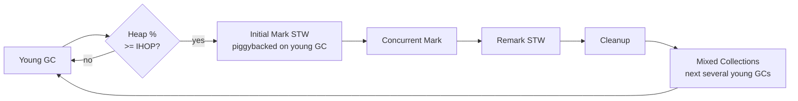
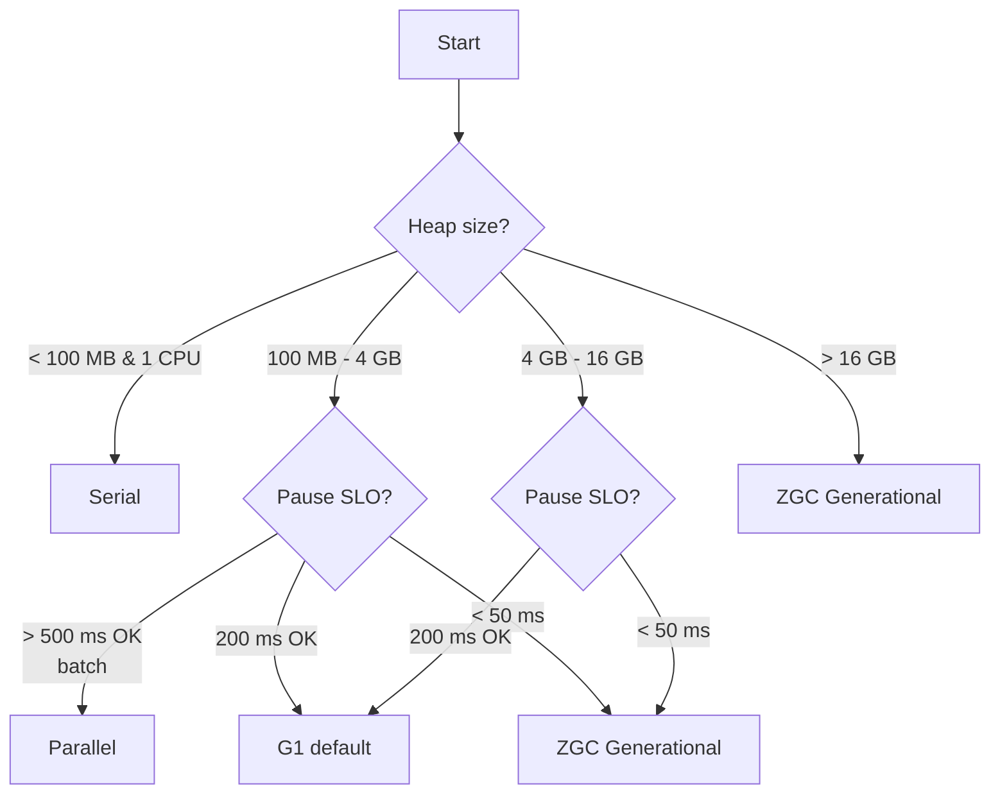

# JVM Garbage Collectors — Serial, Parallel, CMS, G1, ZGC, Shenandoah

**Date:** 2026-04-18 | **Updated:** 2026-04-18
**Tags:** `java` `jvm` `gc` `g1` `zgc` `shenandoah` `performance`

## Table of Contents

- [Summary](#summary)
- [Which Collector Is the Default](#which-collector-is-the-default)
- [Serial GC](#serial-gc)
- [Parallel GC](#parallel-gc)
- [CMS — Historical Context](#cms--historical-context)
- [G1 — Garbage First](#g1--garbage-first)
  - [Regions and Mixed Collections](#regions-and-mixed-collections)
  - [Humongous Objects](#humongous-objects)
  - [Key G1 Flags](#key-g1-flags)
- [ZGC](#zgc)
  - [Generational ZGC (JDK 21)](#generational-zgc-jdk-21)
  - [Key ZGC Flags](#key-zgc-flags)
- [Shenandoah](#shenandoah)
- [Epsilon — The No-Op Collector](#epsilon--the-no-op-collector)
- [Collector Decision Tree](#collector-decision-tree)
- [Concrete Recipes](#concrete-recipes)
  - [REST API Server on Kubernetes](#rest-api-server-on-kubernetes)
  - [Low-Latency Streaming Gateway](#low-latency-streaming-gateway)
  - [Batch ETL](#batch-etl)
  - [CLI Tool or Small Container](#cli-tool-or-small-container)
- [Flag Reference Card](#flag-reference-card)
- [Related](#related)
- [References](#references)

---

## Summary

HotSpot ships six garbage collectors. For almost every modern Spring Boot service on JDK 21, the right answer is either **G1** (the default, great for p95 ≤ 200 ms pause SLOs) or **Generational ZGC** (for p99 ≤ 1 ms pause SLOs or heaps > 16 GB). The other four collectors exist for specific situations: Parallel for batch throughput, Serial for single-CPU containers, Shenandoah for platforms where you cannot change the JDK but get OpenJDK builds that include it, and Epsilon for benchmarking. Picking a collector is a decision about pause target × heap size × allocation rate × CPU budget — there is no "best" one.

---

## Which Collector Is the Default

A common question: *which collector do I actually get if I don't set any flags?* The default has changed over time:

| JDK version | Default collector | Notes |
|-------------|-------------------|-------|
| 1.2 – 1.4 | Serial | Single-threaded, stop-the-world. |
| 1.5 – 1.8 | Parallel | Throughput collector. "Parallel" = young and old both use multiple GC threads. |
| 9 – present | **G1** | [JEP 248](https://openjdk.org/jeps/248) made G1 the default in JDK 9. |
| 14 | G1 (CMS removed) | [JEP 363](https://openjdk.org/jeps/363). |
| 15 | G1 (ZGC GA, Shenandoah GA) | ZGC and Shenandoah leave experimental, but G1 stays default. |
| 21 | G1 (Generational ZGC available) | [JEP 439](https://openjdk.org/jeps/439) adds generational ZGC behind `-XX:+ZGenerational`. |
| 24 | G1 (Generational ZGC is *the* ZGC) | [JEP 490](https://openjdk.org/jeps/490) removed non-generational mode. |

So for the last decade, if you haven't set a `-XX:+UseXxxGC` flag, you are running G1. On containers with one CPU and a tiny heap, the JVM **auto-switches to Serial** (a subtlety that bites people on lambdas and cron jobs — see [Serial GC](#serial-gc) below).

---

## Serial GC

**Flag:** `-XX:+UseSerialGC`

Single-threaded, stop-the-world, simplest implementation. Everything is one thread doing everything.

**When it's the right choice:**
- Containers with 1 CPU and heap ≤ ~100 MB. Multi-threaded collectors add coordination overhead that outweighs the parallelism on a single core.
- AWS Lambda / Cloud Functions / short-lived CLIs where a single full GC pause at shutdown is fine.
- Small desktop tools or embedded JVMs.

**Trap:** On containers with `--cpus 1` or a CFS quota near 1 CPU, the JVM picks Serial automatically. Operators who assume G1 everywhere get surprised by Serial pauses on their "tiny sidecar". Check actual collector with `-Xlog:gc*` or `jcmd <pid> VM.flags | grep GC`.

---

## Parallel GC

**Flag:** `-XX:+UseParallelGC`

Multi-threaded, stop-the-world in both young and old. Older than G1 but still the **throughput king** — it spends the least CPU per MB reclaimed. Long old-gen pauses are the cost.

**When it's the right choice:**
- Batch jobs, ETL, Spark workers, map-reduce — anything where total wall-clock time matters and occasional multi-second pauses don't.
- Any workload where "collect as much garbage as possible per CPU second" is the explicit goal.

**Key flag:** `-XX:ParallelGCThreads=<n>` controls GC thread count. Default is `min(8, CPUs)` for small machines, then `8 + (CPUs - 8) * 5/8`. On a 32-core box that's 23 GC threads — sometimes too many for containers. Set this explicitly in containers.

---

## CMS — Historical Context

**Flag (removed):** `-XX:+UseConcMarkSweepGC`

The **Concurrent Mark Sweep** collector was the production low-pause collector for the JDK 6–8 era. It collected the old generation concurrently (mostly), using incremental-update barriers. It shipped in 2004 and was **deprecated in JDK 9** ([JEP 291](https://openjdk.org/jeps/291)) and **removed in JDK 14** ([JEP 363](https://openjdk.org/jeps/363)).

**Why it mattered:**
- First mainstream concurrent old-gen collector.
- Introduced the idea that the application shouldn't be stopped for long old-gen work.
- Lacked compaction — long-running CMS apps would fragment and eventually fall back to a serial full GC that could pause for minutes. ("Promotion failure" and "concurrent mode failure" were the two feared log lines.)

**What replaced it:** G1, then ZGC/Shenandoah. If you maintain a JDK 8 service that still uses CMS, that is the primary reason to upgrade.

---

## G1 — Garbage First

**Flag:** `-XX:+UseG1GC` (default since JDK 9, so usually omitted)

G1 divides the heap into **regions** (typically 1–32 MB, sized automatically based on `-Xmx`). Young and old generations are not contiguous — any region can be young, old, or humongous. Young GC is STW and parallel. Old-gen reclamation is **mostly-concurrent** with a small STW remark pause.

### Regions and Mixed Collections

The "garbage first" name refers to G1's core trick: after marking, the collector knows how much garbage is in each old-gen region. It then does **mixed collections** that evacuate the most garbage-heavy old-gen regions alongside the next young GC. This amortizes old-gen compaction over many small pauses instead of one giant Full GC.

A G1 cycle looks like:



The pause target flag `-XX:MaxGCPauseMillis` (default 200 ms) tells G1 how much of the old generation to include in mixed collections — it is a **soft** target. Setting it very low (< 50 ms) makes G1 touch fewer regions per cycle, which can lead to the old gen growing faster than it can be cleaned and eventually a fallback **Full GC** — exactly what you were trying to avoid.

### Humongous Objects

Any object larger than 50% of a region size is **humongous**. G1 allocates it directly in old-gen regions (possibly spanning multiple contiguous regions). Humongous objects are expensive:

- They cannot share a region with other objects.
- They are only collected at old-gen cycles, not young GCs (pre-JDK 8u60).
- Arrays of byte buffers, large protobuf messages, and poorly-batched JDBC results are common culprits.

If you see lots of "humongous allocation" events in gc logs, either increase `-XX:G1HeapRegionSize` (powers of 2, 1–32 MB) or fix the allocation at source. See [Pause diagnosis — humongous allocations](pause-diagnosis.md#humongous-allocations).

### Key G1 Flags

| Flag | Purpose |
|------|---------|
| `-XX:MaxGCPauseMillis=200` | Soft pause target. |
| `-XX:G1HeapRegionSize=<N>` | Region size (1–32 MB, power of 2). Default auto. |
| `-XX:InitiatingHeapOccupancyPercent=45` | IHOP — when to start concurrent marking. |
| `-XX:G1ReservePercent=10` | Keep this % of heap as free "reserve" for evacuation. |
| `-XX:ConcGCThreads=<n>` | Concurrent marking threads. Default = `ParallelGCThreads / 4`. |
| `-XX:+UseStringDeduplication` | G1-specific — dedupe identical `String` values during GC. Rarely worth it post-JDK 11 compact strings. |

---

## ZGC

**Flag:** `-XX:+UseZGC` (add `-XX:+ZGenerational` on JDK 21)

ZGC's goal: **pauses under 1 ms regardless of heap size**. It achieves this by doing almost all work concurrently, using **colored pointers** and **load barriers** (see [Concepts — Load barriers](concepts.md#load-barriers-and-colored-pointers)).

| Property | Value |
|----------|-------|
| Typical max pause | < 1 ms (often ~100–500 μs) |
| Heap size range | 8 MB → 16 TB |
| Throughput overhead | ~5–15% vs G1 (load barrier cost) |
| Compaction | Concurrent |

ZGC is 64-bit only (it needs pointer bits for colors). It uses more CPU than G1 because every object reference load goes through a barrier. In return, your p99 latency gets dramatically tighter.

### Generational ZGC (JDK 21)

Original ZGC was **non-generational** — every cycle scanned the entire heap. Fine for low-pause, but wasteful: generational hypothesis says Eden is almost all garbage, why mark the old gen too?

[JEP 439](https://openjdk.org/jeps/439) added Generational ZGC in JDK 21. Young and old are collected separately with different frequencies. Allocation rate headroom roughly doubles vs non-generational ZGC with the same hardware.

As of JDK 24, non-generational ZGC has been removed — `-XX:+UseZGC` alone gives you Generational ZGC. On JDK 21 you need `-XX:+ZGenerational` explicitly.

### Key ZGC Flags

| Flag | Purpose |
|------|---------|
| `-XX:+UseZGC` | Enable ZGC. |
| `-XX:+ZGenerational` | Use Generational ZGC (JDK 21 only — default JDK 24+). |
| `-XX:SoftMaxHeapSize=<N>` | Tries to keep heap below this size. Cycles trigger earlier. |
| `-XX:ZCollectionInterval=<seconds>` | Minimum time between cycles. Helps avoid over-collecting. |
| `-XX:ZUncommitDelay=<seconds>` | Return unused heap memory to the OS after this idle time. |
| `-XX:ConcGCThreads=<n>` | Concurrent GC threads. Default is CPU-count / 4. |

---

## Shenandoah

**Flag:** `-XX:+UseShenandoahGC`

Red Hat's low-pause collector, shipped in OpenJDK builds (not in Oracle JDK). Similar pause profile to ZGC — sub-ms, scales to large heaps — using a different technique: **load-reference barriers** (previously Brooks pointers — an indirection word on every object).

Shenandoah's selling point was working on 32-bit pointers and supporting JDK 8 and 11 in Red Hat's backports. Today, if you're on JDK 21+, ZGC's generational mode generally beats Shenandoah on throughput. Shenandoah still wins when:
- You must stay on JDK 17 and need Generational low-pause (Generational ZGC was JDK 21+).
- You build your own OpenJDK with Shenandoah and have specific benchmarks showing it wins for your workload.

---

## Epsilon — The No-Op Collector

**Flag:** `-XX:+UseEpsilonGC -XX:+UnlockExperimentalVMOptions`

Epsilon does literally nothing — it allocates and never reclaims. When heap fills, OOM. Shipped via [JEP 318](https://openjdk.org/jeps/318).

**Uses:**
- Allocation profiling without GC noise.
- Extremely short-lived programs (e.g., AOT-compiled CLI) where you want zero runtime GC cost.
- Performance testing to measure GC overhead by comparison.

Never use in production services. You will OOM.

---

## Collector Decision Tree



The tree collapses to three practical choices for 90%+ of services:

1. **Parallel** — batch/ETL, max throughput, don't care about pauses.
2. **G1** — default. REST APIs, gRPC services, anything with p95 ≤ 200 ms pause tolerance.
3. **ZGC (Generational)** — strict p99 latency (< 1 ms pauses), very large heaps, or streaming/SSE workloads where tail latency matters.

---

## Concrete Recipes

### REST API Server on Kubernetes

Spring Boot app, 2–8 GB heap, typical REST/JSON workload, p95 latency target ~200 ms:

```bash
JAVA_OPTS="\
  -XX:MaxRAMPercentage=75.0 \
  -XX:MaxGCPauseMillis=100 \
  -XX:+HeapDumpOnOutOfMemoryError \
  -XX:HeapDumpPath=/var/log/heapdump.hprof \
  -Xlog:gc*,safepoint:file=/var/log/gc.log:time,uptime,level,tags:filecount=10,filesize=50M \
  -XX:+ExitOnOutOfMemoryError"
```

Notes:
- No explicit `-XX:+UseG1GC` — it's the default.
- `MaxRAMPercentage` is preferred over `-Xmx` in containers; it adapts to pod resource limits.
- `ExitOnOutOfMemoryError` ensures Kubernetes restarts the pod cleanly instead of running in a half-broken state.
- `HeapDumpOnOutOfMemoryError` gives you a dump to analyze after the fact.

### Low-Latency Streaming Gateway

WebFlux or gRPC server, 8–32 GB heap, SSE / long-polling connections, p99 latency < 50 ms. See [Reactive impact](reactive-impact.md#sse-and-streaming-latency) for why ZGC matters here:

```bash
JAVA_OPTS="\
  -XX:+UseZGC \
  -XX:+ZGenerational \
  -XX:MaxRAMPercentage=75.0 \
  -XX:SoftMaxHeapSize=8g \
  -XX:+AlwaysPreTouch \
  -Xlog:gc*,safepoint:file=/var/log/gc.log:time,uptime,level,tags:filecount=20,filesize=100M"
```

Notes:
- `ZGenerational` is required on JDK 21; default on JDK 24+.
- `AlwaysPreTouch` zero-fills the heap at startup so the first GC isn't slow from page faults.
- `SoftMaxHeapSize` asks ZGC to collect earlier, preferring CPU over memory footprint.

### Batch ETL

Spark executor or nightly ingestion job, 8–64 GB heap, throughput matters, pauses don't:

```bash
JAVA_OPTS="\
  -XX:+UseParallelGC \
  -Xms16g -Xmx16g \
  -XX:+AlwaysPreTouch \
  -XX:ParallelGCThreads=8 \
  -Xlog:gc:file=/var/log/gc.log:time,uptime,level,tags:filecount=5,filesize=50M"
```

Notes:
- Identical `-Xms` and `-Xmx` avoids heap resizing overhead.
- `AlwaysPreTouch` avoids first-hit page fault jitter.
- Cap `ParallelGCThreads` in multi-tenant environments; the default uses all cores.

### CLI Tool or Small Container

Single-CPU sidecar, cron job, tool:

```bash
JAVA_OPTS="\
  -XX:+UseSerialGC \
  -XX:MaxRAMPercentage=60.0"
```

Serial is often picked automatically anyway; setting it explicitly documents intent.

---

## Flag Reference Card

```bash
# Picking a collector
-XX:+UseSerialGC
-XX:+UseParallelGC
-XX:+UseG1GC                    # default since JDK 9
-XX:+UseZGC
-XX:+ZGenerational              # JDK 21+ only; default in JDK 24+
-XX:+UseShenandoahGC

# Heap sizing (container-aware)
-XX:MaxRAMPercentage=75.0       # preferred over -Xmx in containers
-XX:InitialRAMPercentage=50.0
-Xms<n>g -Xmx<n>g               # if not using percentage

# Logging (JDK 9+ unified logging)
-Xlog:gc*,safepoint:file=gc.log:time,uptime,level,tags:filecount=10,filesize=50M

# Diagnostics on failure
-XX:+HeapDumpOnOutOfMemoryError
-XX:HeapDumpPath=/var/log/heapdump.hprof
-XX:+ExitOnOutOfMemoryError
-XX:+PrintFlagsFinal            # dump every flag value at startup

# G1 tuning
-XX:MaxGCPauseMillis=200
-XX:G1HeapRegionSize=16m
-XX:InitiatingHeapOccupancyPercent=45

# ZGC tuning
-XX:SoftMaxHeapSize=8g
-XX:ZCollectionInterval=5

# General
-XX:+AlwaysPreTouch             # zero-fill heap at startup
-XX:ActiveProcessorCount=<n>    # override CPU detection (containers)
```

---

## Related

- [GC Concepts and Mental Model](concepts.md) — what collectors are actually doing.
- [GC Pause Diagnosis Playbook](pause-diagnosis.md) — figuring out why pauses happen after you've picked a collector.
- [Reactive / WebFlux / VT impact on GC](reactive-impact.md) — tying collector choice to reactive workloads.
- [Docker and Deployment](../configurations/docker-and-deployment.md) — container-aware JVM flags.

---

## References

- [OpenJDK GC Tuning Guide (JDK 21)](https://docs.oracle.com/en/java/javase/21/gctuning/) — primary source for flags and behaviors.
- [JEP 248: G1 as the default](https://openjdk.org/jeps/248)
- [JEP 291: Deprecate CMS](https://openjdk.org/jeps/291)
- [JEP 363: Remove CMS](https://openjdk.org/jeps/363)
- [JEP 318: Epsilon — No-Op GC](https://openjdk.org/jeps/318)
- [JEP 333: ZGC experimental](https://openjdk.org/jeps/333)
- [JEP 377: ZGC production](https://openjdk.org/jeps/377)
- [JEP 439: Generational ZGC](https://openjdk.org/jeps/439)
- [JEP 379: Shenandoah production](https://openjdk.org/jeps/379)
- [Shenandoah project home (Red Hat / OpenJDK)](https://wiki.openjdk.org/display/shenandoah/Main)
- [ZGC project home](https://wiki.openjdk.org/display/zgc/Main)
- [Aleksey Shipilëv — "One stop page for Shenandoah"](https://shipilev.net/talks/devoxx-Nov2017-shenandoah.pdf)
