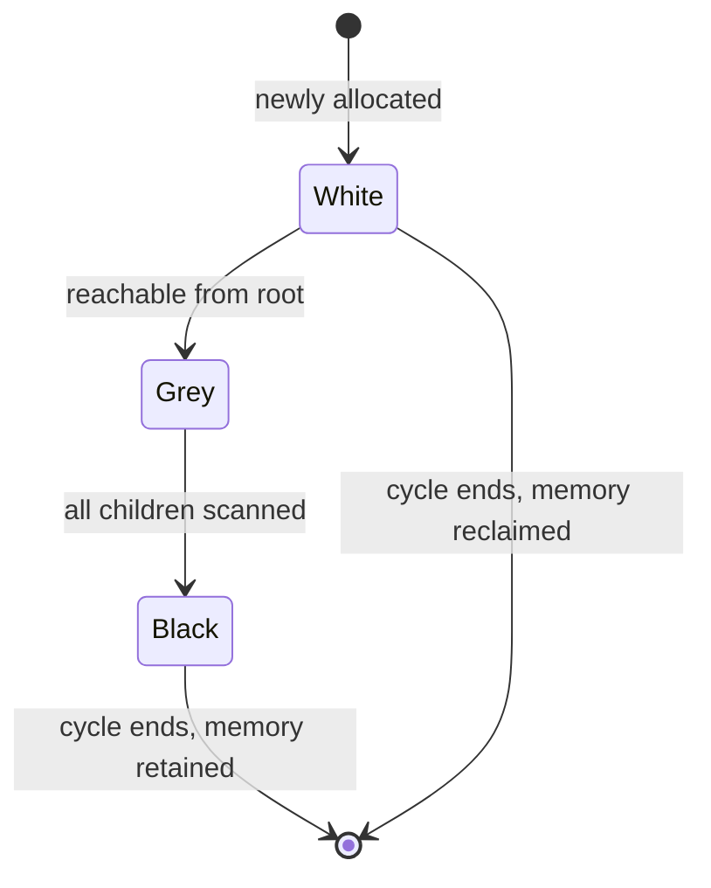

# JVM Garbage Collection — Concepts and Mental Model

**Date:** 2026-04-18 | **Updated:** 2026-04-18
**Tags:** `java` `jvm` `gc` `memory-management` `performance`

## Table of Contents

- [Summary](#summary)
- [Why the JVM Has a GC at All](#why-the-jvm-has-a-gc-at-all)
- [Heap Layout](#heap-layout)
  - [Young Generation](#young-generation)
  - [Old Generation](#old-generation)
  - [Metaspace](#metaspace)
  - [Code Cache and Direct Memory](#code-cache-and-direct-memory)
- [The Generational Hypothesis](#the-generational-hypothesis)
- [Allocation Fast Paths](#allocation-fast-paths)
  - [TLABs](#tlabs)
  - [Escape Analysis and Scalar Replacement](#escape-analysis-and-scalar-replacement)
- [The GC Cycle](#the-gc-cycle)
  - [Tri-Color Marking](#tri-color-marking)
  - [Sweep vs Compact vs Evacuate](#sweep-vs-compact-vs-evacuate)
- [GC Roots](#gc-roots)
- [Safepoints and Why STW Exists](#safepoints-and-why-stw-exists)
- [Barriers](#barriers)
  - [Write Barriers and the Card Table](#write-barriers-and-the-card-table)
  - [Load Barriers and Colored Pointers](#load-barriers-and-colored-pointers)
  - [SATB vs Incremental Update](#satb-vs-incremental-update)
- [Glossary](#glossary)
- [Related](#related)
- [References](#references)

---

## Summary

Garbage collection on the HotSpot JVM is automatic memory reclamation built on three ideas: most objects die young (generational hypothesis), threads must be paused at known points to safely scan the heap (safepoints and stop-the-world), and modern collectors do most of the expensive work concurrently with application threads using read/write barriers. Understanding these three ideas makes every collector — Serial through ZGC — easy to reason about, and makes pause-diagnosis intuitive instead of mystical. For a TypeScript developer, think of it as V8's generational GC but with pluggable collectors, exposed tuning, and a real notion of concurrent marking tied to hardware memory barriers.

---

## Why the JVM Has a GC at All

Three memory-management strategies dominate production systems:

| Strategy | Examples | Trade-off |
|----------|----------|-----------|
| Manual (`malloc`/`free`, `new`/`delete`) | C, C++ | Fast, zero overhead, footguns (UAF, leaks, double-free). |
| Reference counting | Swift ARC, CPython, Rust `Rc`/`Arc` | Deterministic, can't collect cycles without extra machinery, cache-line churn on `retain`/`release`. |
| Tracing GC | JVM, Go, .NET, V8, Lua | No cycles problem, amortized cost, but needs pauses and barriers. |

The JVM picked tracing GC in 1995 for the same reason Go and .NET later did: it lets library authors and application developers pass object graphs around without thinking about ownership. The price is pause time and throughput overhead, which is exactly what every HotSpot collector trades off differently.

A key thing to internalize: **the GC doesn't run on a schedule**. It runs when a thread tries to allocate and the allocation fails, or when a concurrent-cycle trigger fires (IHOP, soft-max heap). You cannot "turn off GC" in a long-running service — you can only tune when and how it happens.

---

## Heap Layout

HotSpot divides process memory into several regions. "The heap" colloquially means the Java object heap, but operators need to understand all of them because OOM can come from any of them.

```text
┌──────────────────────────────────────────────────────────────┐
│  JVM Process Memory                                          │
│ ┌────────────────────────────────────────────────────────┐   │
│ │ Java Heap (-Xms / -Xmx)                                │   │
│ │ ┌─────────────────────┐ ┌────────────────────────────┐ │   │
│ │ │ Young Generation    │ │ Old Generation (Tenured)   │ │   │
│ │ │ ┌─────┬────┬──────┐ │ │                            │ │   │
│ │ │ │Eden │ S0 │  S1  │ │ │                            │ │   │
│ │ │ └─────┴────┴──────┘ │ │                            │ │   │
│ │ └─────────────────────┘ └────────────────────────────┘ │   │
│ └────────────────────────────────────────────────────────┘   │
│ ┌─────────────┐ ┌────────────┐ ┌──────────────────────────┐  │
│ │ Metaspace   │ │ Code Cache │ │ Direct / Mapped Buffers  │  │
│ └─────────────┘ └────────────┘ └──────────────────────────┘  │
│ ┌─────────────┐ ┌────────────────────────────────────────┐   │
│ │ Thread      │ │ Native (JNI, malloc, glibc arenas,     │   │
│ │ Stacks      │ │         Netty pools, mmap'd files)     │   │
│ └─────────────┘ └────────────────────────────────────────┘   │
└──────────────────────────────────────────────────────────────┘
```

### Young Generation

The young generation holds newly allocated objects. It is split into **Eden** (where allocation happens) and two **survivor spaces** (S0 and S1, also called "from" and "to"). A young GC (a.k.a. minor GC) copies live objects out of Eden and the "from" survivor into the "to" survivor, flipping the roles. An object's **age** is the number of survivor copies it has survived; once age crosses the tenuring threshold (default 15, but adaptive) it is **promoted** to the old generation.

Young collections are almost always stop-the-world in every collector (including ZGC and Shenandoah — their "concurrent" work is in the old generation; the young GC itself is STW but very short). This is fine because Eden is small and almost everything in it is already dead by the time you scan it.

### Old Generation

Long-lived objects (caches, connection pools, long-running sessions, interned strings, static singletons) live here. Old-gen collections are expensive because the region is large. "Full GC" colloquially means "collect the old gen too", which traditionally meant a long pause. Modern collectors (G1, ZGC, Shenandoah) avoid full GC by doing mostly-concurrent old-gen work.

### Metaspace

Class metadata (method bytecode, class structures, constant pools) lives in **metaspace** — native memory, not the Java heap. Before Java 8 this was the **permanent generation** (PermGen) and lived on the heap; metaspace was introduced in JDK 8 precisely to avoid the PermGen OOM that plagued every Tomcat app that did hot redeploys.

Metaspace grows unbounded by default. The `-XX:MaxMetaspaceSize` flag caps it. Classloader leaks (libraries that hold references to classloaders across redeploys) cause metaspace OOM — not heap OOM. This is a common confusion.

### Code Cache and Direct Memory

- **Code cache** holds JIT-compiled native code. Default is 240 MB, split into three segments (non-profiled, profiled, non-nmethods) since JDK 9. A full code cache disables further compilation and prints a scary warning.
- **Direct memory** is off-heap `ByteBuffer.allocateDirect()` memory plus anything `Unsafe` allocated. Netty, NIO, and most network libraries use this heavily. It is not scanned by GC. Its cap is `-XX:MaxDirectMemorySize` (default ~ equal to `-Xmx`).

Your reactive apps (WebFlux, R2DBC, gRPC) sit on Netty and consume direct memory proportional to connection count. A healthy Java heap with growing RSS almost always means direct memory leaks, not heap leaks. See [Reactive impact on GC](reactive-impact.md#netty-direct-memory) for diagnosis.

---

## The Generational Hypothesis

The entire design of every HotSpot collector rests on one empirical claim: **most objects die young**. Measurements across decades of Java workloads consistently show that 80–98% of newly allocated objects are unreachable by the next young GC. Therefore:

1. Put a small, fast-to-scan region (Eden) at the front of allocation.
2. Collect Eden frequently and cheaply.
3. Only promote survivors to a larger, more expensively-collected old generation.
4. Touch the old generation rarely.

This is why JDK 21 introduced **Generational ZGC** ([JEP 439](https://openjdk.org/jeps/439)) — the original ZGC was non-generational and scanned the whole heap every cycle. Generational ZGC recovered the generational hypothesis while keeping ZGC's sub-ms pauses.

---

## Allocation Fast Paths

### TLABs

Every Java thread has a **Thread-Local Allocation Buffer** (TLAB) — a private slab carved out of Eden. Allocation inside a TLAB is a single atomic pointer bump — no locking, no CAS. This is why `new Object()` is nearly free in Java despite Eden being shared memory.

```text
thread-local TLAB:
  ┌─────────────────────────────────────────────┐
  │ allocated ▓▓▓▓▓▓▓▓▓▓                     │
  │                       ▲ bump pointer        │
  └─────────────────────────────────────────────┘
```

When a TLAB fills, the thread gets a new one from Eden. When Eden fills, a young GC runs. TLAB sizing is adaptive; `-XX:+PrintTLAB` shows per-thread utilization. Very large allocations (`> TLABSize/refillWasteLimit`) bypass the TLAB and allocate directly in shared Eden.

### Escape Analysis and Scalar Replacement

If the JIT can prove an object never "escapes" a method (never stored in a field, never returned, never passed to an opaque call), it can skip allocation entirely and **scalar-replace** the object's fields with CPU registers or stack slots. This is why benchmarks of "how fast is `new Point(x, y)` in a hot loop" often show zero allocation in a profiler — the JIT erased it.

Escape analysis is fragile. A lambda that captures a local variable is an allocation. A `var list = List.of(a, b)` passed to a mocked method that can't be inlined is an allocation. Tuning for zero-allocation hot paths usually means reading JIT decompiler output via [JITWatch](https://github.com/AdoptOpenJDK/jitwatch) or `-XX:+PrintInlining`.

---

## The GC Cycle

Every tracing collector implements the same four phases, just with different parallelism and pause tradeoffs:

1. **Mark** — find live objects by walking from roots.
2. **Sweep** or **Compact** or **Evacuate** — reclaim dead memory.
3. **Remap / Fixup** — update pointers if objects moved.
4. **Reset** — prepare data structures for the next cycle.

### Tri-Color Marking

Marking is modeled as coloring every object white (unvisited), grey (visited, children not yet scanned), or black (visited, children all scanned). The invariant a collector must maintain is:

> No black object may point directly to a white object.

If that invariant breaks mid-cycle (because the application thread modified a reference while the collector was scanning), the collector will miss a live object and free memory that is still in use. Preventing this is what GC **barriers** are for. Visually:



### Sweep vs Compact vs Evacuate

- **Sweep** (Serial/CMS old-gen, mark-sweep): walk the heap, add dead objects to a free list. Fast but fragments memory. Next allocation may need to search the free list.
- **Compact** (Serial young, Parallel): move live objects to one end of the region, so dead space becomes contiguous. Slow but produces a pristine allocation region.
- **Evacuate** (G1, ZGC, Shenandoah): copy live objects into a fresh empty region. Old region is freed wholesale. Enables incremental compaction without touching the whole heap.

Evacuation is the modern default. It lets the collector pick which regions to work on based on a cost/benefit model — this is what G1's "garbage first" name refers to.

---

## GC Roots

The marking phase starts from **roots**: references the collector assumes are live without proof. Roots include:

- **Thread stacks** — every local variable and parameter on every frame of every Java thread's stack.
- **Static fields** — of every loaded class.
- **JNI globals** — `NewGlobalRef` handles held by native code.
- **System class loader references**.
- **Synchronization monitors** held by threads.
- **ReferenceQueue entries** being processed.

Stack scanning is the most expensive root scan, and it scales with thread count. This is why naive mass-virtual-thread workloads (millions of VTs, each with a stack) stress GC more than platform-thread pools — see [Reactive impact](reactive-impact.md#virtual-threads-and-gc).

---

## Safepoints and Why STW Exists

Even the most aggressively concurrent collector (ZGC, Shenandoah) has to stop all application threads briefly at least twice per cycle. Why?

Because the collector needs a **coherent snapshot** of the thread stacks and root set. Scanning a thread stack while the thread is running is unsafe — the stack is being rewritten underneath you. So the collector asks every Java thread to reach a **safepoint** — a known location in the compiled code where the thread's state is fully described by tables the JVM emits.

The JVM inserts safepoint polls at:
- Method entry/exit.
- Back-edges of counted loops (loops with an `int` induction variable) — and [JEP 8233300](https://bugs.openjdk.org/browse/JDK-8233300) / "loop strip mining" in G1 made this cheaper.
- Native call returns.

When the collector requests a "safepoint operation", every Java thread polls and parks until the operation ends. The time from request-to-all-threads-parked is **TTSP** (time-to-safepoint), reported in `-Xlog:safepoint` output. Long TTSP is a common non-GC cause of latency spikes — e.g., a JNI call that doesn't return, an uncounted loop, or a thread stuck in a system call.

Once all threads are parked, the collector does the STW work (flipping root sets, remapping, etc.), then releases the threads. Sub-ms pause collectors keep the STW portion small and move the heavy lifting to concurrent phases.

---

## Barriers

Barriers are the trick that makes concurrent GC work. They are tiny bits of extra machine code the JIT inserts into every field access (read barrier) or field assignment (write barrier), so the collector can observe mutation while marking.

### Write Barriers and the Card Table

G1 and the older collectors use a **card table** — a byte array, one byte per 512 bytes of old-gen memory. When application code writes an old→young reference (`oldObj.field = youngObj`), a write barrier dirties the corresponding card. Young GC only scans dirty cards of the old generation, not the whole old gen. Without this, every young GC would have to scan the entire old generation for roots — making young GC O(heap) instead of O(young-gen).

### Load Barriers and Colored Pointers

ZGC uses **load barriers** instead. Every object reference load goes through a barrier that checks bits of the pointer itself. If the pointer's "color" (a few reserved bits in the 64-bit address) indicates "needs remap", the barrier does the remap inline. This is why ZGC is 64-bit only and why it costs a few % of application throughput — every field read has a barrier.

Colored pointers let ZGC move objects concurrently without stopping threads. Shenandoah uses a similar technique called **Brooks pointers** (originally) and now load-reference barriers.

### SATB vs Incremental Update

When the application mutates the graph while marking is running, there are two strategies to preserve the tri-color invariant:

- **SATB (Snapshot-At-The-Beginning)** — G1, Shenandoah. Treat the heap as it was at the start of marking. If a reference is overwritten, remember the old value so it can still be scanned. Over-approximates liveness — produces "floating garbage" that survives this cycle and is reclaimed next time.
- **Incremental update** — CMS. If a new reference is installed into a black object, re-mark the source object as grey. More precise but requires more barrier work.

Both strategies work. SATB is slightly simpler and is what modern collectors use.

---

## Glossary

| Term | Meaning |
|------|---------|
| Minor GC | Young-gen collection. |
| Major GC | Old-gen collection. Confusingly, sometimes used to mean "full GC". |
| Full GC | Collects heap + metaspace, typically stop-the-world, worst pauses. |
| Promotion | Moving a young-gen object to old gen. |
| Tenuring | Same as promotion; "tenured generation" is old synonym for old gen. |
| Humongous object | G1: any object > 50% of a region size (default 2 MB → humongous at 1 MB+). |
| Floating garbage | Dead objects that weren't reclaimed this cycle because they died after marking started. |
| STW | Stop-the-world. All application threads paused. |
| TTSP | Time-to-safepoint. How long it took to park all threads. |
| Allocation rate | MB/s of new objects per unit time. Directly drives young GC frequency. |
| IHOP | Initiating Heap Occupancy Percent. G1 trigger for starting a concurrent marking cycle. |
| Pause target | `-XX:MaxGCPauseMillis`. Soft goal; collector will try but not guarantee. |
| Evacuation failure | Not enough free regions to copy survivors into. Triggers expensive fallback. |

---

## Related

- [JVM Collectors — Serial, Parallel, CMS, G1, ZGC, Shenandoah](collectors.md) — which collector to pick and why.
- [GC Pause Diagnosis Playbook](pause-diagnosis.md) — log reading, JFR, async-profiler, heap dumps.
- [Reactive / WebFlux / VT impact on GC](reactive-impact.md) — how allocation patterns from Reactor and virtual threads shape GC behavior.
- [Virtual Threads in Java](../java-fundamentals/virtual-threads.md) — VTs interact closely with GC through stack scanning and allocation rate.
- [Build Tools and JVM](../java-fundamentals/build-tools-and-jvm.md) — general JVM-flag basics.

---

## References

- [OpenJDK HotSpot GC Tuning Guide (JDK 21)](https://docs.oracle.com/en/java/javase/21/gctuning/) — the canonical tuning document.
- [JEP 439: Generational ZGC](https://openjdk.org/jeps/439) — rationale for reintroducing generations to ZGC.
- [JEP 248: Make G1 the Default Garbage Collector](https://openjdk.org/jeps/248) — JDK 9 default switch.
- [JEP 363: Remove the Concurrent Mark Sweep (CMS) Garbage Collector](https://openjdk.org/jeps/363) — JDK 14 removal.
- [The Garbage Collection Handbook, 2nd ed.](https://gchandbook.org/) — Jones, Hosking, Moss. The definitive reference.
- ["Shenandoah: An open-source concurrent compacting garbage collector"](https://shipilev.net/talks/devoxx-Nov2017-shenandoah.pdf) — Aleksey Shipilëv, Devoxx 2017.
- [Aleksey Shipilëv — JVM Anatomy Quarks](https://shipilev.net/jvm/anatomy-quarks/) — short, focused essays on JVM internals (TLABs, safepoints, barriers).
