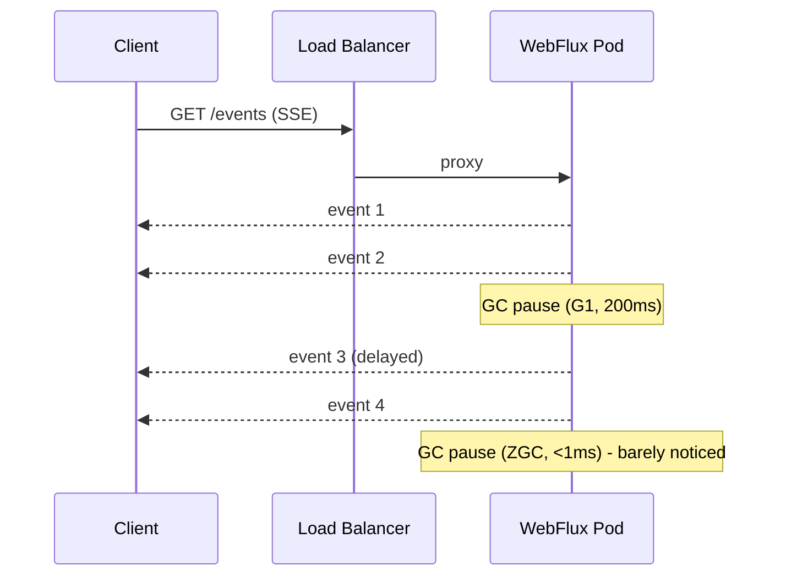

# GC Impact on Reactive, Virtual Threads, and Streaming Workloads

**Date:** 2026-04-18 | **Updated:** 2026-04-18
**Tags:** `java` `jvm` `gc` `reactive` `virtual-threads` `webflux` `netty` `performance`

## Table of Contents

- [Summary](#summary)
- [Why Reactive / Streaming Code Is GC-Sensitive](#why-reactive--streaming-code-is-gc-sensitive)
- [Virtual Threads and GC](#virtual-threads-and-gc)
  - [Stack Scanning at Scale](#stack-scanning-at-scale)
  - [Per-VT Allocation Rate](#per-vt-allocation-rate)
  - [Why Generational ZGC Pairs with Virtual Threads](#why-generational-zgc-pairs-with-virtual-threads)
- [WebFlux / Reactor Allocation Patterns](#webflux--reactor-allocation-patterns)
  - [Operator Fusion](#operator-fusion)
  - [publishOn and subscribeOn Churn](#publishon-and-subscribeon-churn)
  - [Hidden Allocations in Error Handling](#hidden-allocations-in-error-handling)
  - [Reactor Context](#reactor-context)
- [SSE and Streaming Latency](#sse-and-streaming-latency)
- [Netty Direct Memory](#netty-direct-memory)
  - [Pooled vs Unpooled](#pooled-vs-unpooled)
  - [Leak Detection Levels](#leak-detection-levels)
  - [R2DBC Off-Heap Buffers](#r2dbc-off-heap-buffers)
- [Measurement Recipes](#measurement-recipes)
- [Anti-Patterns](#anti-patterns)
- [Concrete Flag Recipes](#concrete-flag-recipes)
- [Related](#related)
- [References](#references)

---

## Summary

Reactive and streaming Java workloads — WebFlux, Reactor pipelines, SSE endpoints, gRPC, R2DBC-backed services — are more GC-sensitive than traditional MVC apps for three reasons. First, long-lived connections amplify the cost of every pause: a 200 ms stop that a request-response service barely notices shows up as a p99 latency spike for SSE subscribers. Second, operator chains allocate constantly — a naively-written `Flux` can churn GB/s of small objects. Third, reactive apps sit on Netty, which allocates off-heap direct buffers that do not participate in normal GC and can OOM the pod via RSS growth without touching the Java heap. For any service with long-lived connections or p99 latency SLOs tighter than 100 ms, Generational ZGC plus careful attention to allocation hotspots in Reactor chains is the standard answer.

---

## Why Reactive / Streaming Code Is GC-Sensitive

Classical Spring MVC apps are request-response: each request runs on its own thread, allocates a handful of objects, returns, and the objects die young in Eden. The GC story is mostly the generational hypothesis doing its job.

Reactive apps break three assumptions of that model:

1. **Long-lived connections** — SSE, WebSocket, gRPC streams keep connections open for minutes or hours. Any pause that stops the Netty event loop translates directly to end-to-end latency for all subscribers on that thread.
2. **Per-event allocation** — every `map`, `filter`, `flatMap`, and operator subscription creates at least one small object. A Flux that emits 1M events/second can easily allocate GB/s.
3. **Off-heap memory** — Netty pools direct `ByteBuf`s for network I/O. These live outside the Java heap and are reclaimed by reference counting, not tracing GC. A misuse pattern that would be a benign heap spike in MVC becomes an unbounded RSS leak in WebFlux.

Consequence: the right collector and allocation discipline matter more here than in a typical REST service.

---

## Virtual Threads and GC

[Virtual threads](../java-fundamentals/virtual-threads.md) (JEP 444, Java 21) scale to millions of concurrent threads by scheduling them on a small pool of platform carrier threads. They are a different axis of scale from reactive, but with similar GC implications.

### Stack Scanning at Scale

Every Java thread's stack is a **GC root**. Classical platform-thread apps have hundreds of threads; stack scanning is negligible. With virtual threads, you can easily have 1M+ VTs — each with its own stack. Scanning 1M stacks every young GC is not cheap.

HotSpot mitigates this with **concurrent stack scanning** in ZGC and (as of JDK 21) partial support in G1. But stack scanning stays one of the biggest GC-root costs in VT-heavy apps. Profile it with JFR (`Thread Park/Unpark`, `JVM.GCPhasePause` with VM operation breakdown).

### Per-VT Allocation Rate

A virtual thread "costs" about 256 bytes of heap for its `Thread` object plus its **continuation** — the captured stack for when it's unmounted. Continuations are `Object[]` instances on the heap. A VT that blocks on I/O, resumes, blocks again, resumes... allocates continuations repeatedly. With a million VTs, this can dominate allocation rate even if the business logic allocates nothing.

The fix is not "don't use VTs" — it's **pair VTs with a collector that handles high allocation well** (Generational ZGC).

### Why Generational ZGC Pairs with Virtual Threads

Before [JEP 439](https://openjdk.org/jeps/439) (Generational ZGC, JDK 21), ZGC scanned the whole heap every cycle. With millions of VTs allocating continuations every I/O trip, old-gen scanning became the dominant cost. Generational ZGC splits young and old gen — continuations that die young (most of them) never touch old-gen scanning — and effectively doubles the allocation rate ZGC can absorb on the same hardware.

For any production VT-heavy service, the flag set is:

```bash
-XX:+UseZGC -XX:+ZGenerational
```

This is the default behavior in JDK 24+.

---

## WebFlux / Reactor Allocation Patterns

[Project Reactor](https://projectreactor.io/) (the library behind Spring WebFlux) is an allocation-heavy library by design. Every operator you chain creates at least one subscriber object.

### Operator Fusion

Reactor has an **operator fusion** optimization: when consecutive operators are "fuseable" (pure, synchronous, stateless), Reactor merges them into a single subscriber to avoid intermediate allocation. A chain like `.map(f).filter(p).map(g)` fuses into one subscriber instead of three.

Fusion breaks when:
- You cross a thread boundary (`publishOn` / `subscribeOn`).
- You introduce a concurrent operator (`flatMap`, `concatMap`).
- You use `Hooks.onEachOperator` or other debug hooks.

Consequence: **don't sprinkle `publishOn` unnecessarily**. Each one defeats fusion and adds per-event queue allocation.

### publishOn and subscribeOn Churn

`publishOn(Schedulers.parallel())` submits each emitted element as a task to a scheduler. Every submission allocates a `Runnable` wrapper plus goes through the scheduler's queue. For a stream emitting 100k events/second, this can be tens of MB/s of allocation.

Alternatives:
- Keep reactive chains single-threaded when the work is CPU-light — Netty event loops are already highly parallel.
- Batch events with `.bufferTimeout(...)` before crossing the thread boundary.
- Use `Schedulers.boundedElastic()` only for blocking interop, not for CPU work.

### Hidden Allocations in Error Handling

`onErrorResume`, `onErrorReturn`, `retry`, and especially `retryWhen` are heavyweight. They allocate on every subscription and sometimes on every error. A pipeline that errors frequently and uses `retry()` can allocate more memory handling errors than handling the happy path.

If retries are hot, prefer a custom `retryWhen(Retry.fixedDelay(...))` spec you create once and reuse.

### Reactor Context

`Context` is an immutable map. Every `contextWrite(...)` creates a new Context instance. If you write context in a hot operator inside a Flux that emits millions of times, you are allocating millions of contexts. Write context **once at the edge** of the pipeline, not inside hot loops.

---

## SSE and Streaming Latency

Server-Sent Events and gRPC streaming share a pattern: many long-lived connections, each emitting a slow trickle of events for minutes or hours. For these endpoints, **p99 latency is dominated by GC pauses** because:

- The event interval is short (e.g., 100 ms heartbeats).
- A 200 ms GC pause means all connected clients see a 200 ms gap in their event stream, regardless of where they are in their stream.
- The *number of connected clients* multiplies the user-visible impact of a single pause.

If your SSE service runs on G1 with a 200 ms pause target, your p99 event gap is 200 ms. Moving to Generational ZGC typically drops p99 to < 5 ms.

See [SSE and streaming](../realtime/sse-and-streaming.md) for the protocol and Spring integration details. The GC angle is the same for gRPC streaming and WebSockets.

A typical flow where GC pauses matter:



---

## Netty Direct Memory

Reactor Netty (the HTTP server under WebFlux) uses [Netty's `PooledByteBufAllocator`](https://netty.io/4.1/api/io/netty/buffer/PooledByteBufAllocator.html) to allocate **direct** `ByteBuf`s for every incoming and outgoing network message. Direct memory:

- Sits outside the Java heap.
- Is allocated via `Unsafe.allocateMemory` (essentially `malloc`).
- Is reclaimed by **reference counting** — `ByteBuf.retain()` / `release()`.
- Shows up in RSS, not heap size.
- Does **not** participate in GC tracing.

### Pooled vs Unpooled

Netty's default is `PooledByteBufAllocator`. The allocator keeps a per-thread pool of arenas, so releasing a buffer doesn't immediately return it to the OS — it goes back into the pool for reuse. This is a huge win for throughput but makes leak diagnosis confusing: a leaked buffer doesn't shrink the pool, so you see steady growth of arena count.

Configure pool behavior with:

```bash
-Dio.netty.allocator.numDirectArenas=<n>       # default = 2 * cores
-Dio.netty.allocator.numHeapArenas=<n>
-Dio.netty.maxDirectMemory=<bytes>             # -1 = use -XX:MaxDirectMemorySize
-Dio.netty.allocator.type=pooled               # default
```

### Leak Detection Levels

Netty samples a fraction of allocated `ByteBuf`s and tracks them. If a tracked `ByteBuf` is GC'd without being released, Netty logs a scary "LEAK" warning with the last access stacks:

| Level | Sampling | Cost |
|-------|----------|------|
| `disabled` | 0% | 0 |
| `simple` (default) | ~1% | minimal |
| `advanced` | ~1% + last-access stacks | moderate |
| `paranoid` | 100% | 5–10% throughput hit |

Set via:

```bash
-Dio.netty.leakDetection.level=advanced
-Dio.netty.leakDetection.targetRecords=10
```

For debugging, flip to `paranoid` in staging until the leak is found. **Never leave `paranoid` on in production.**

Typical leak sources in WebFlux apps:

- Custom `WebFilter` or `HandlerFilterFunction` that forgets to pass the body downstream.
- Custom `Decoder` / `Encoder` that returns a `ByteBuf` without consuming it on the error path.
- `DataBuffer` handling where you split or slice but never release the parent.
- Using `ByteBufMono#retain()` without a matching `release()` in tests.

### R2DBC Off-Heap Buffers

[R2DBC](https://r2dbc.io/) drivers (especially R2DBC PostgreSQL over Netty) allocate direct buffers for every query result. A poorly-managed connection pool plus large result sets can blow direct memory.

See [R2DBC Deep Dive](../data-repositories/r2dbc-deep-dive.md) for pool sizing. The GC-relevant flags are:

```bash
-Dio.netty.maxDirectMemory=1073741824    # 1 GB cap
-XX:MaxDirectMemorySize=1g               # JVM-level cap
-Dio.netty.leakDetection.level=advanced
```

Cap direct memory at startup — unbounded direct memory is the most common cause of "pod killed, OOM, but heap looks fine" in reactive Spring services.

---

## Measurement Recipes

1. **Baseline allocation rate:** JFR continuous recording. Open in Mission Control → Memory → Allocation by Class or Thread. Look for top classes — are they your domain objects, or Reactor internals?

2. **Flame graph of allocation sites:**
   ```bash
   java -jar async-profiler.jar -e alloc -d 60 -f /tmp/alloc.html <pid>
   ```
   Stack frames with `reactor.core.publisher.FluxMap` etc. are Reactor internals. If they dominate, your operator chain is the hot spot, not your business logic.

3. **Direct memory growth:**
   ```bash
   jcmd <pid> VM.native_memory summary   # requires -XX:NativeMemoryTracking=summary
   ```
   Look at the "Other" / "Internal" rows. Netty arenas are also visible via `PooledByteBufAllocator.DEFAULT.dumpStats()` if you expose it as a JMX bean.

4. **Micrometer JVM metrics:** [Micrometer's JVM bindings](https://docs.micrometer.io/micrometer/reference/reference/jvm.html) publish `jvm.gc.pause`, `jvm.memory.used`, `jvm.gc.memory.promoted`, `jvm.gc.live.data.size`. Wire to Prometheus, graph in Grafana. `jvm.gc.pause.p99` over time is the single best GC health signal.

5. **Reactor-specific:** `reactor.core.publisher.Hooks.onOperatorDebug()` in dev only — catastrophic for perf in production, but gives you full allocation stacks for every operator.

---

## Anti-Patterns

- **Boxing in hot streams** — `Flux<Integer>` boxes every int. Use primitive streams (`IntStream`) for CPU-bound work, or project to `record`s early.
- **`List.copyOf` inside `map`** — creates a new ArrayList per element. If you need defensive copies, do it at the edge, not per-event.
- **Unbounded `Sinks.Many.replay()`** — holds every emitted element forever. Use `.limit(N)` or a bounded multicast sink.
- **Caching `Context` instances** — since `Context` is immutable and cheap to *compare*, caching provides no benefit and introduces mutation bugs.
- **`.flatMap` with unbounded concurrency** — defaults to 256 concurrent inner subscriptions. If inner Flux allocates heavily, you have 256× the allocation pressure.
- **Allocating lambdas inside operators** — `flux.map(x -> new Transformer(x).process())` allocates a new Transformer per event. Hoist immutable transformers outside.
- **Logging `Mono`s / `Flux`s in `toString()`** — the default `toString` is surprisingly allocation-heavy.
- **`publishOn` before every trivial operator** — defeats operator fusion.

---

## Concrete Flag Recipes

### WebFlux + Virtual Threads API Server

```bash
JAVA_OPTS="\
  -XX:+UseZGC \
  -XX:+ZGenerational \
  -XX:MaxRAMPercentage=75.0 \
  -XX:SoftMaxHeapSize=6g \
  -XX:MaxDirectMemorySize=1g \
  -Dio.netty.leakDetection.level=simple \
  -Dio.netty.maxDirectMemory=1073741824 \
  -XX:+AlwaysPreTouch \
  -XX:+HeapDumpOnOutOfMemoryError \
  -XX:HeapDumpPath=/var/log/ \
  -XX:+ExitOnOutOfMemoryError \
  -Xlog:gc*,safepoint:file=/var/log/gc.log:time,uptime,level,tags:filecount=10,filesize=50M \
  -XX:StartFlightRecording=filename=/var/log/recording.jfr,maxage=24h,maxsize=1g,settings=profile"
```

### SSE / gRPC Streaming Gateway

Identical to above, plus:

```bash
  -XX:ConcGCThreads=4 \         # reserve more CPU for concurrent GC
  -XX:ZCollectionInterval=5     # allow up to 5s between cycles when idle
```

### R2DBC-Heavy Service

```bash
JAVA_OPTS="\
  -XX:+UseG1GC \                # G1 is fine at moderate heap sizes with mostly-steady allocation
  -XX:MaxRAMPercentage=70.0 \
  -XX:MaxGCPauseMillis=100 \
  -XX:MaxDirectMemorySize=2g \  # generous — R2DBC result buffers
  -Dio.netty.maxDirectMemory=2147483648 \
  -Dio.netty.leakDetection.level=advanced \
  -XX:NativeMemoryTracking=summary \
  -Xlog:gc*:file=/var/log/gc.log:time,uptime,level,tags:filecount=10,filesize=50M"
```

---

## Related

- [GC Concepts and Mental Model](concepts.md) — vocabulary used here.
- [JVM Collectors](collectors.md) — G1 vs ZGC vs Shenandoah tradeoffs.
- [GC Pause Diagnosis Playbook](pause-diagnosis.md) — heap dumps, JFR, async-profiler.
- [Virtual Threads in Java](../java-fundamentals/virtual-threads.md) — stacks, continuations, pinning.
- [Virtual Threads and Spring Boot](../spring-virtual-threads.md) — enabling VTs in Spring, JDBC + VT traps.
- [Reactive Programming in Java](../reactive-programming-java.md) — Reactor fundamentals.
- [Reactive Advanced Topics](../reactive-advanced-topics.md) — operator internals.
- [SSE and Streaming](../realtime/sse-and-streaming.md) — the streaming protocol side.
- [R2DBC Deep Dive](../data-repositories/r2dbc-deep-dive.md) — driver buffers and pool sizing.
- [Reactive Observability](../reactive-observability.md) — Micrometer JVM metrics.

---

## References

- [Project Reactor Reference Guide](https://projectreactor.io/docs/core/release/reference/) — operator semantics, context, schedulers.
- [Reactor Netty Reference](https://projectreactor.io/docs/netty/release/reference/) — HTTP server internals.
- [Netty Reference Counted Objects](https://netty.io/wiki/reference-counted-objects.html)
- [Netty User Guide — Buffer allocation](https://netty.io/wiki/user-guide-for-4.x.html)
- [JEP 444: Virtual Threads](https://openjdk.org/jeps/444)
- [JEP 439: Generational ZGC](https://openjdk.org/jeps/439)
- [Micrometer JVM Metrics](https://docs.micrometer.io/micrometer/reference/reference/jvm.html)
- [OpenJDK GC Tuning Guide (JDK 21)](https://docs.oracle.com/en/java/javase/21/gctuning/)
- [Aleksey Shipilëv — "JVM Anatomy Quarks: Virtual Threads"](https://shipilev.net/jvm/anatomy-quarks/)
- [Oleh Dokuka & Igor Lozynskyi — "Hands-On Reactive Programming in Spring 5"](https://www.packtpub.com/product/hands-on-reactive-programming-in-spring-5/9781787284951) — Reactor operator fusion chapter.
