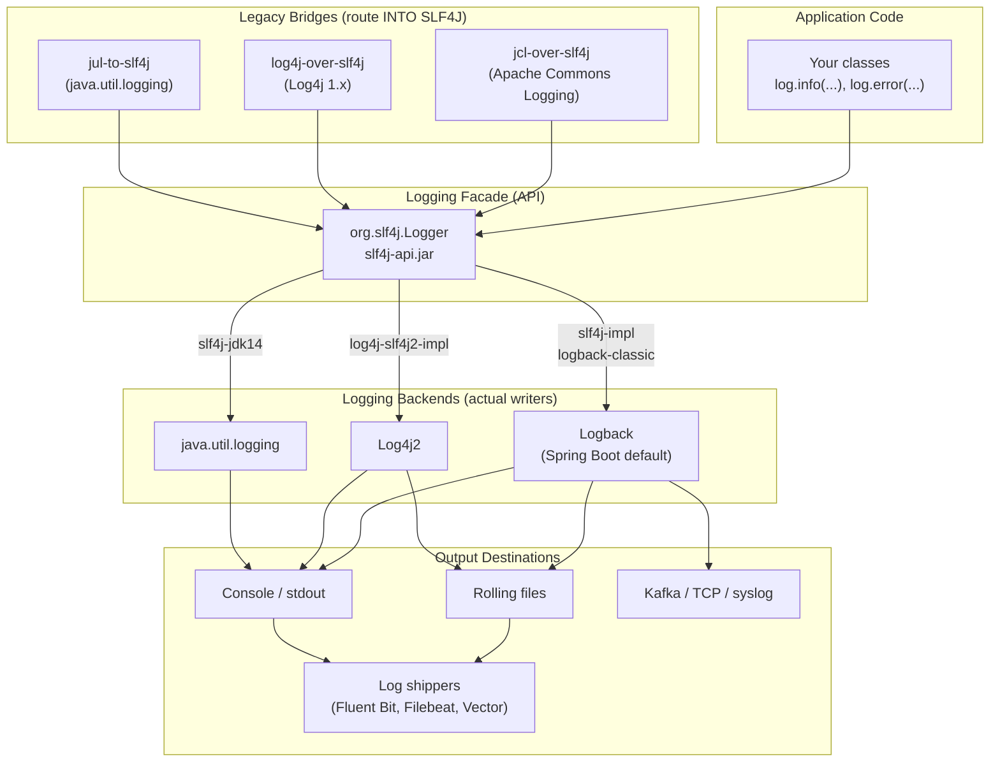

# Logging in Java and Spring Boot

**Date:** 2026-04-17
**Tags:** `logging` `slf4j` `logback` `observability` `spring-boot`

## Table of Contents

- [Summary](#summary)
- [The Java Logging Ecosystem](#the-java-logging-ecosystem)
- [Getting a Logger](#getting-a-logger)
- [Log Levels](#log-levels)
- [Parameterized Messages](#parameterized-messages)
- [Logging Exceptions](#logging-exceptions)
- [Spring Boot Logging Configuration](#spring-boot-logging-configuration)
- [Logback Configuration (logback-spring.xml)](#logback-configuration-logback-springxml)
- [Structured Logging (JSON)](#structured-logging-json)
- [MDC — Mapped Diagnostic Context](#mdc--mapped-diagnostic-context)
- [MDC in Reactive Code](#mdc-in-reactive-code)
- [Correlation and Trace IDs](#correlation-and-trace-ids)
- [Sensitive Data — What NOT to Log](#sensitive-data--what-not-to-log)
- [Performance Considerations](#performance-considerations)
- [Common Anti-Patterns](#common-anti-patterns)
- [Logback vs Log4j2](#logback-vs-log4j2)
- [Related](#related)
- [References](#references)

---

## Summary

Java logging is a **layered stack** with a separation between the **API
(facade)** your code calls and the **backend** that writes records:

- **SLF4J** (`org.slf4j.Logger`) is the facade. Your code depends on it
  and nothing else.
- **Logback** is the default backend in Spring Boot. Alternatives:
  **Log4j2**, `java.util.logging` (JUL).
- **Bridges** route legacy logging calls (Apache Commons Logging, Log4j
  1, JUL) through SLF4J so everything flows through one pipeline.

Good logging in production is **structured** (JSON for aggregators),
**context-aware** (MDC carries request/trace IDs), **level-appropriate**
(ERROR rare and actionable, DEBUG/TRACE off in prod), and **cheap when
disabled** (parameterized messages, no string concatenation).

---

## The Java Logging Ecosystem



Key points:

- **Exactly one** SLF4J backend binding should be on the classpath.
  Having both `logback-classic` and `log4j-slf4j2-impl` leads to
  undefined behaviour and a warning at startup.
- Bridge JARs replace the **real** legacy JARs. You cannot keep
  `commons-logging.jar` alongside `jcl-over-slf4j.jar` — they collide on
  class names. `spring-boot-starter-logging` handles this for you by
  pulling in `logback-classic`, `slf4j-api`, `jcl-over-slf4j`,
  `jul-to-slf4j`, and `log4j-to-slf4j`.

---

## Getting a Logger

### Classic form

```java
import org.slf4j.Logger;
import org.slf4j.LoggerFactory;

public class PaymentService {
    private static final Logger log = LoggerFactory.getLogger(PaymentService.class);

    public void charge(String customerId, long amountCents) {
        log.info("charging customer={} amountCents={}", customerId, amountCents);
    }
}
```

- `private static final` — one logger per class, allocated once.
- The logger name is typically the **fully-qualified class name**. This is
  what Logback matches against when you configure logger levels
  (`com.example.payments: DEBUG`).

### Lombok form

```java
import lombok.extern.slf4j.Slf4j;

@Slf4j
public class PaymentService {
    public void charge(String customerId, long amountCents) {
        log.info("charging customer={} amountCents={}", customerId, amountCents);
    }
}
```

`@Slf4j` expands at compile time to exactly the same
`private static final Logger log = LoggerFactory.getLogger(PaymentService.class)`
line. There is no runtime cost. See
[`java-fundamentals/lombok-and-boilerplate.md`](./java-fundamentals/lombok-and-boilerplate.md)
for the full Lombok cross-reference.

---

## Log Levels

SLF4J defines five levels, from most to least severe:

| Level | Use for | In production |
|-------|---------|---------------|
| `ERROR` | Unrecoverable failure that needs a human to act on | Always on, should be rare and actionable |
| `WARN` | Recoverable anomaly, degraded state, retried call | Always on |
| `INFO` | Business milestones, service lifecycle, request summaries | Always on — the steady heartbeat |
| `DEBUG` | Branch-level detail for troubleshooting | **Off** by default; can be toggled for a package when debugging |
| `TRACE` | Extremely fine-grained, per-step, value-level detail | **Off** in production |

### Calibration rules

- **Every `ERROR` must be actionable.** If it doesn't correspond to
  something a human needs to fix, it's probably `WARN` — noisy ERRORs
  train operators to ignore the channel.
- `WARN` is for "still working, but..." — retries, fallback paths,
  quota warnings.
- `INFO` captures what happened, the key identifiers, and the outcome.
  Don't log every method entry — that's `DEBUG` or `TRACE`.
- `DEBUG` is for active troubleshooting; `TRACE` reconstructs sequences.

Setting a logger to level X emits **X and above**: `root: INFO`
emits INFO, WARN, ERROR.

---

## Parameterized Messages

**Always** use SLF4J's `{}` placeholder form. **Never** use string
concatenation.

```java
// CORRECT — parameterized
log.info("processed {} records in {}ms", count, elapsedMs);

// WRONG — string concat evaluated even when INFO is disabled
log.info("processed " + count + " records in " + elapsedMs + "ms");
```

### Why it matters

With `"processed " + count + ...`, the concatenation happens **at the
call site**, before SLF4J is invoked. If the logger is disabled, that
work is wasted. With `{}` placeholders, SLF4J checks the level first
and only formats when the record will actually be emitted. On a hot
path at 100K req/s, with boxing or `toString()` on complex objects, the
savings are measurable.

SLF4J has special-cased overloads for 0, 1, 2, and n args. The varargs
path allocates an `Object[]`. In a truly pathological hot path with
DEBUG disabled, guard with `isDebugEnabled()` — but **only** when the
argument itself is expensive to build:

```java
if (log.isDebugEnabled()) {
    log.debug("expensive debug: {}", computeDebugPayload());
}
```

---

## Logging Exceptions

**Always pass the exception as the last argument.** SLF4J detects a
`Throwable` in the final position and emits the stack trace. Do **not**
put the exception in the format string.

```java
try {
    riskyOp(id);
} catch (IOException ex) {
    // CORRECT — SLF4J treats last Throwable arg as the cause,
    // {} placeholders bind only to the preceding args.
    log.error("riskyOp failed for id={}", id, ex);

    // WRONG — stack trace is lost, you get ex.toString() instead
    log.error("riskyOp failed for id=" + id + " ex=" + ex);

    // WRONG — {} binds to ex.toString(), stack trace is lost
    log.error("riskyOp failed for id={} ex={}", id, ex);
}
```

Rule: placeholders bind to arguments **in order**. If the last argument
is a `Throwable` and there is no `{}` left for it to fill, SLF4J treats
it as the cause and prints the stack trace.

---

## Spring Boot Logging Configuration

Spring Boot reads logging configuration from `application.yml` (or
`application.properties`) first, and falls back to
`logback-spring.xml` / `log4j2-spring.xml` for anything more complex.

### Minimal `application.yml`

```yaml
logging:
  level:
    root: INFO
    com.example: DEBUG
    org.springframework.web: INFO
    org.hibernate.SQL: DEBUG
  pattern:
    console: '%d{yyyy-MM-dd HH:mm:ss.SSS} %-5level [%thread] %logger{36} - %msg%n'
    file:    '%d{yyyy-MM-dd HH:mm:ss.SSS} %-5level [%thread] %logger{36} %X{requestId} - %msg%n'
  file:
    name: logs/app.log
  logback:
    rollingpolicy:
      max-file-size: 100MB
      max-history: 14
      total-size-cap: 3GB
```

### What each field does

- `level.root` — default for every logger. `level.<package>` overrides
  it (most specific wins).
- `pattern.console` / `pattern.file` — Logback pattern strings. Common
  conversion words: `%d`, `%level`, `%thread`, `%logger`, `%msg`, `%n`,
  `%X{key}` for MDC, `%ex` for exception.
- `file.name` enables the default file appender;
  `logback.rollingpolicy.*` controls rotation.

Spring Boot binds environment variables like
`LOGGING_LEVEL_COM_EXAMPLE=DEBUG` automatically — handy for toggling
verbose logging in a single container without redeploying.

---

## Logback Configuration (logback-spring.xml)

Once you need more than what `application.yml` exposes — per-profile
appenders, async appenders, JSON encoders — move to
`src/main/resources/logback-spring.xml`. Spring Boot reads the
`-spring.xml` variant because it supports `<springProfile>` and
`<springProperty>`.

### Production-grade example

```xml
<?xml version="1.0" encoding="UTF-8"?>
<configuration scan="true" scanPeriod="30 seconds">

    <springProperty name="appName" source="spring.application.name" defaultValue="app"/>

    <!-- Plain text console for local dev -->
    <appender name="CONSOLE" class="ch.qos.logback.core.ConsoleAppender">
        <encoder>
            <pattern>%d{HH:mm:ss.SSS} %-5level [%thread] %logger{36} %X{requestId:-} - %msg%n</pattern>
        </encoder>
    </appender>

    <!-- Rolling file with size + time policy -->
    <appender name="FILE" class="ch.qos.logback.core.rolling.RollingFileAppender">
        <file>logs/${appName}.log</file>
        <rollingPolicy class="ch.qos.logback.core.rolling.SizeAndTimeBasedRollingPolicy">
            <fileNamePattern>logs/${appName}.%d{yyyy-MM-dd}.%i.log.gz</fileNamePattern>
            <maxFileSize>100MB</maxFileSize>
            <maxHistory>14</maxHistory>
            <totalSizeCap>3GB</totalSizeCap>
        </rollingPolicy>
        <encoder>
            <pattern>%d{yyyy-MM-dd HH:mm:ss.SSS} %-5level [%thread] %logger{36} %X{requestId:-} %X{traceId:-} - %msg%n</pattern>
        </encoder>
    </appender>

    <!-- Async wrapper: offloads formatting and I/O to a background thread -->
    <appender name="ASYNC_FILE" class="ch.qos.logback.classic.AsyncAppender">
        <appender-ref ref="FILE"/>
        <queueSize>8192</queueSize>
        <discardingThreshold>0</discardingThreshold>   <!-- never drop -->
        <neverBlock>false</neverBlock>
        <includeCallerData>false</includeCallerData>
    </appender>

    <!-- Per-profile wiring -->
    <springProfile name="local,dev">
        <root level="INFO">
            <appender-ref ref="CONSOLE"/>
        </root>
        <logger name="com.example" level="DEBUG"/>
    </springProfile>

    <springProfile name="prod">
        <root level="INFO">
            <appender-ref ref="ASYNC_FILE"/>
            <appender-ref ref="CONSOLE"/>
        </root>
    </springProfile>

</configuration>
```

### What's important here

- **`scan="true"`** reloads the config every 30 seconds — flip a logger
  level without restarting.
- **`AsyncAppender`** buffers events and drains on a background thread,
  reducing latency on request threads. `discardingThreshold=0` disables
  the default behaviour of dropping events when the queue fills above
  20%.
- **`<springProfile>`** and **`<springProperty>`** let you share one
  config file across environments and pull values from
  `application.yml`.

---

## Structured Logging (JSON)

Plain text is fine for `tail -f`. It's a liability when aggregating to
Elasticsearch, Loki, Splunk, or CloudWatch — platforms that want to
index fields end up running brittle regex to extract values that were
right there at logging time. Fix: emit **JSON**.

### Add the encoder

```xml
<!-- build.gradle -->
implementation("net.logstash.logback:logstash-logback-encoder:7.4")
```

```xml
<appender name="STDOUT_JSON" class="ch.qos.logback.core.ConsoleAppender">
    <encoder class="net.logstash.logback.encoder.LogstashEncoder">
        <includeMdcKeyName>requestId</includeMdcKeyName>
        <includeMdcKeyName>traceId</includeMdcKeyName>
        <includeMdcKeyName>userId</includeMdcKeyName>
        <customFields>{"service":"payments","env":"prod"}</customFields>
    </encoder>
</appender>
```

### Sample output

```json
{"@timestamp":"2026-04-17T10:23:11.812Z","@version":"1","message":"charging customer=c-42 amountCents=1299","logger_name":"com.example.payments.PaymentService","thread_name":"http-nio-8080-exec-3","level":"INFO","level_value":20000,"service":"payments","env":"prod","requestId":"r-9a7c","traceId":"4bf92f3577b34da6a3ce929d0e0e4736","userId":"c-42"}
```

Benefits:

- **Field-typed queries**: `level=ERROR AND service=payments AND traceId=4bf9...`
- **No regex to extract `requestId`** — it's a first-class field.
- **Structured arguments** via `StructuredArguments.kv(...)`:

```java
import static net.logstash.logback.argument.StructuredArguments.kv;

log.info("order placed {} {}", kv("orderId", orderId), kv("totalCents", totalCents));
```

This emits `orderId` and `totalCents` as distinct JSON fields rather
than being embedded in the message.

---

## MDC — Mapped Diagnostic Context

MDC is a **thread-local `Map<String,String>`** that SLF4J backends
attach to every log event from that thread. Push values on the way in,
log normally, pop on the way out.

### Basic usage

```java
import org.slf4j.MDC;

public void handleRequest(HttpServletRequest req) {
    String requestId = req.getHeader("X-Request-Id");
    if (requestId == null) requestId = UUID.randomUUID().toString();

    MDC.put("requestId", requestId);
    try {
        processRequest(req);
    } finally {
        MDC.remove("requestId");  // MUST remove, thread is pooled
    }
}
```

### Accessing in patterns

In the Logback pattern, `%X{requestId}` pulls the MDC value. Every log
line from that thread — your code, Spring, Hibernate — carries
`requestId=r-9a7c` without any code change. The `:-` syntax supplies a
default:

```text
%d %-5level [%thread] %X{requestId:-} %logger{36} - %msg%n
```

### Why `finally`-remove is mandatory

Servlet containers and thread pools **reuse threads**. Without cleanup,
the next request on that thread inherits your `requestId` and logs are
cross-attributed to the wrong request. Use a filter in Spring MVC, or
a reactive equivalent in WebFlux (next section).

### Spring MVC filter example

```java
@Component
public class MdcRequestFilter extends OncePerRequestFilter {
    @Override
    protected void doFilterInternal(HttpServletRequest req,
                                    HttpServletResponse res,
                                    FilterChain chain) throws ServletException, IOException {
        String requestId = Optional.ofNullable(req.getHeader("X-Request-Id"))
                                   .orElseGet(() -> UUID.randomUUID().toString());
        MDC.put("requestId", requestId);
        res.setHeader("X-Request-Id", requestId);
        try {
            chain.doFilter(req, res);
        } finally {
            MDC.remove("requestId");
        }
    }
}
```

---

## MDC in Reactive Code

MDC is `ThreadLocal`. Reactor pipelines hop threads — `flatMap` may
continue on a different scheduler, `publishOn` changes threads, and
`subscribeOn` runs upstream on a separate pool. **ThreadLocals do not
automatically follow**. The MVC pattern (`MDC.put` + `finally remove`)
**silently fails** in WebFlux: the filter thread has the MDC, the
handler runs on `boundedElastic`, and the downstream log lines have no
`requestId`. Three approaches, in increasing sophistication:

### 1. Reactor `Context` + `doOnEach` bridge

Reactor's `Context` is the reactive analog of a ThreadLocal — it
propagates **through** the pipeline by design. You write the request ID
into the Context at the edge, then bridge each emitted signal back into
MDC for the duration of the logging call.

```java
public Mono<Response> handle(ServerRequest req) {
    String requestId = req.headers().firstHeader("X-Request-Id");
    return service.process(req)
                  .doOnEach(logOnNext(res -> log.info("processed {}", res)))
                  .contextWrite(Context.of("requestId", requestId));
}

// Helper that reads the Reactor Context, copies to MDC, runs the log call, cleans up
private static <T> Consumer<Signal<T>> logOnNext(Consumer<T> logAction) {
    return signal -> {
        if (!signal.isOnNext()) return;
        String reqId = signal.getContextView().getOrDefault("requestId", "");
        try (MDC.MDCCloseable ignored = MDC.putCloseable("requestId", reqId)) {
            logAction.accept(signal.get());
        }
    };
}
```

### 2. Micrometer Context Propagation

The `io.micrometer:context-propagation` library formalizes this bridge.
You register a `ThreadLocalAccessor<String>` for MDC and enable
automatic propagation — Reactor then copies the MDC snapshot through
every scheduler hop.

```java
ContextRegistry.getInstance().registerThreadLocalAccessor(
    "requestId",
    () -> MDC.get("requestId"),
    value -> MDC.put("requestId", value),
    () -> MDC.remove("requestId")
);
// In Spring Boot 3 with WebFlux, enable hooks:
Hooks.enableAutomaticContextPropagation();
```

This is the recommended modern approach. Spring Boot 3 wires it up when
`context-propagation` is on the classpath.

### 3. `WebFilter` populating Reactor Context

```java
@Component
public class MdcWebFilter implements WebFilter {
    @Override
    public Mono<Void> filter(ServerWebExchange exchange, WebFilterChain chain) {
        String requestId = Optional.ofNullable(exchange.getRequest().getHeaders().getFirst("X-Request-Id"))
                                   .orElseGet(() -> UUID.randomUUID().toString());
        return chain.filter(exchange)
                    .contextWrite(Context.of("requestId", requestId));
    }
}
```

Combined with automatic context propagation, every log line in the
downstream pipeline picks up the `requestId` from MDC.

See [`reactive-observability.md`](./reactive-observability.md) for the
full WebFlux observability story — Micrometer Tracing, OpenTelemetry,
and `Observation` API.

---

## Correlation and Trace IDs

Across services, a single user action fans out into many requests. You
need one ID that ties them together. Two layers:

**Application-level `requestId`** — a UUID per ingress request,
propagated downstream in `X-Request-Id`. Cheap, zero dependency.

**Distributed `traceId` + `spanId`** — generated by a tracer
(Micrometer Tracing → Brave or OpenTelemetry). A `traceId` spans the
entire call tree across services; each service contributes `spanId`s.
Propagated via W3C Trace Context (`traceparent`, `tracestate`) or
Zipkin B3 headers.

When `spring-boot-starter-actuator` + `micrometer-tracing-bridge-otel`
are on the classpath, Spring Boot 3 **automatically** puts `traceId`
and `spanId` into MDC for every request. Add them to your pattern:

```text
%d %-5level [%thread] traceId=%X{traceId:-} spanId=%X{spanId:-} %logger{36} - %msg%n
```

Or in JSON:

```xml
<includeMdcKeyName>traceId</includeMdcKeyName>
<includeMdcKeyName>spanId</includeMdcKeyName>
```

Every log line across every service with the same `traceId` can then
be pulled up together in Kibana, Grafana, or Jaeger.

---

## Sensitive Data — What NOT to Log

Logs are searched, copied to dev laptops, shipped to third-party SaaS,
and retained for months. Assume **any log line could end up somewhere
you didn't anticipate**. Never log:

| Category | Examples |
|----------|----------|
| Authentication secrets | passwords (plain or hashed), API keys, bearer tokens, JWTs, session cookies |
| Payment data | full PANs (credit card numbers), CVVs, bank account numbers |
| Personally identifiable | full name + DOB, national ID, passport, SSN, full addresses, precise geo-location |
| Health | diagnoses, medications, lab results (HIPAA) |
| Freeform user content | emails, chat messages, uploaded files — may contain any of the above |

### Mitigation

- **Mask at the source** — DTOs should have a `toString()` that
  redacts sensitive fields (Lombok's `@ToString.Exclude`).
- **Domain wrappers** — `Pan.toString()` returns `"****1111"`.
- **Logback filters** — `PatternLayout` with regex replace to redact
  bearer tokens.
- **Schema review** — before prod, grep logs for PAN-like, email-like,
  JWT-like strings.

Under GDPR, logs containing identifiers are personal data — they need
retention, deletion, and a lawful basis. Pragmatic defaults: 30-day
retention for INFO, 90 days for ERROR, shorter for verbose categories.

---

## Performance Considerations

Logging is cheap, not free. In a 100K-req/s service the choices
compound.

**Async appenders** — wrap `FILE` or `STDOUT_JSON` in `AsyncAppender`.
The logging call returns after enqueueing; formatting and `write(2)`
run on a background thread. Trade-off: on JVM crash, buffered events in
the queue are lost. Usually fine — replicas log the same events.

**Sampling** — for very-high-volume DEBUG or TRACE (per-event tracing
inside a tight loop), sample rather than log every one:

```java
if (ThreadLocalRandom.current().nextInt(100) == 0) {
    log.debug("sampled loop iteration {}", state);
}
```

Better: use Micrometer counters for high-frequency events, reserve logs
for exceptions and milestones.

**`isDebugEnabled()`** — SLF4J's level check is already free. Guard
only when the **argument** is expensive to build. For primitives,
ready-built strings, or cheap `toString()`, call `log.debug(...)`
directly.

**Log4j2 async loggers** — if logging shows up in your flame graph,
Log4j2's Disruptor-based async loggers are measurably faster than
Logback's `AsyncAppender`. See [Logback vs Log4j2](#logback-vs-log4j2).

---

## Common Anti-Patterns

### 1. Log-and-rethrow (double-log)

```java
// BAD
try {
    service.call();
} catch (IOException ex) {
    log.error("call failed", ex);
    throw ex;
}
```

The caller will catch this, log it again, and rethrow. You end up with
two (or three, or five) near-identical stack traces for one failure.

**Fix**: either log and handle, or rethrow and let the outermost layer
log once. Usually the controller advice / global exception handler is
the right place.

### 2. Swallow-and-log

```java
// BAD
try {
    service.call();
} catch (Exception ex) {
    log.error("oh well", ex);
    // continues as if nothing happened
}
```

The method has failed, but the caller has no idea. State is
inconsistent. **Fix**: if you can't recover, rethrow (wrapped if
appropriate). If you can recover, recover explicitly and log at `WARN`,
not `ERROR`.

### 3. String concatenation in messages

Covered above. Always `log.info("x={}", x)`, never `log.info("x=" + x)`.

### 4. ERROR for everything

Treat `ERROR` as "wake someone up". If it fires for every failed API
call from a flaky third party, operators ignore the channel. Use `WARN`
for "expected occasional failure, retried".

### 5. `System.out.println` / `System.err.println`

Bypasses the logging framework entirely — no level filtering, no MDC,
no routing, no JSON encoder. Always use `log.info(...)`. The only
exception is bootstrap code before the logger is initialized.

### 6. Logging exception without stack trace

`log.error("failed: " + ex.getMessage())` loses the frames. Always
`log.error("failed", ex)`.

### 7. Logging sensitive data

Passwords, tokens, PANs — never. Covered above.

### 8. Chatty `INFO`

If every method entry logs at INFO, you've built an expensive TRACE.
Method entry is DEBUG at best.

---

## Logback vs Log4j2

Both are mature, both work with SLF4J, both support structured logging
and async appenders. Quick comparison:

| Aspect | Logback | Log4j2 |
|--------|---------|--------|
| Spring Boot default | **Yes** | Requires swap |
| Config | XML / Groovy | XML / JSON / YAML / Properties |
| Async | `AsyncAppender` (lock-based) | Disruptor-based (lock-free, ~10x throughput at saturation) |
| Garbage-free mode | No | Yes (reduces GC pressure on hot paths) |
| Plugin model | Limited | Rich — custom appenders, lookups, filters |
| Reload | `scan="true"` | `monitorInterval` |
| Security history | Clean | **Log4Shell (CVE-2021-44228)** in late 2021 — a JNDI-lookup RCE that affected Log4j2 2.0–2.14.1 |

### When to choose which

- **Default to Logback** — Spring Boot ships it, it handles 99% of
  services, and the ecosystem docs assume it.
- **Switch to Log4j2** only when benchmarks show logging on the hot
  path. In Spring Boot: exclude `spring-boot-starter-logging`, add
  `spring-boot-starter-log4j2`.
- **Never use JUL directly** — clumsy API, no parameterized messages,
  worse performance. Bridge it via `jul-to-slf4j` if a legacy library
  forces it on you.

### Log4Shell as a lesson

In December 2021, Log4j2 2.0–2.14.1 had an RCE via JNDI lookups in log
messages — an attacker logged `${jndi:ldap://...}` through any header
that got logged, and the JVM executed remote code. Takeaways:
dependency freshness matters, log input is untrusted, and features
that interpret log messages (lookups, templating) should be off by
default. Patch both Logback and Log4j2 promptly.

---

## Related

- [`reactive-observability.md`](./reactive-observability.md) — Micrometer
  Tracing, OpenTelemetry, propagating MDC through reactive pipelines.
- [`java-fundamentals/lombok-and-boilerplate.md`](./java-fundamentals/lombok-and-boilerplate.md)
  — `@Slf4j` and other Lombok annotations.
- [`java-fundamentals/exceptions-and-error-handling.md`](./java-fundamentals/exceptions-and-error-handling.md)
  — what to log when exceptions are caught, rethrown, or converted.
- [`spring-fundamentals.md`](./spring-fundamentals.md) — filters,
  interceptors, profiles — the surfaces where MDC setup lives.

---

## References

- **SLF4J manual** — https://www.slf4j.org/manual.html
- **Logback manual** — https://logback.qos.ch/manual/
- **Spring Boot Logging reference** — https://docs.spring.io/spring-boot/reference/features/logging.html
- **logstash-logback-encoder** — https://github.com/logfellow/logstash-logback-encoder
- **Micrometer Context Propagation** — https://github.com/micrometer-metrics/context-propagation
- **Micrometer Tracing** — https://docs.micrometer.io/tracing/reference/
- **OpenTelemetry Java** — https://opentelemetry.io/docs/languages/java/
- **Log4j2 Async Loggers** — https://logging.apache.org/log4j/2.x/manual/async.html
- **Log4Shell (CVE-2021-44228)** — https://nvd.nist.gov/vuln/detail/CVE-2021-44228
