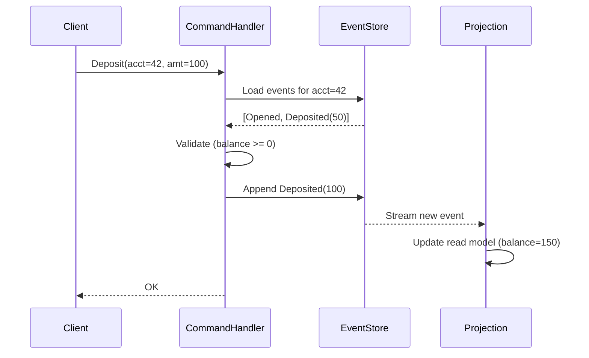
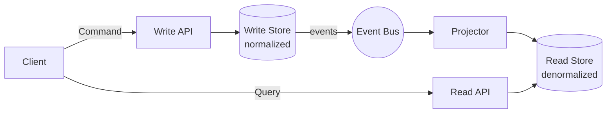
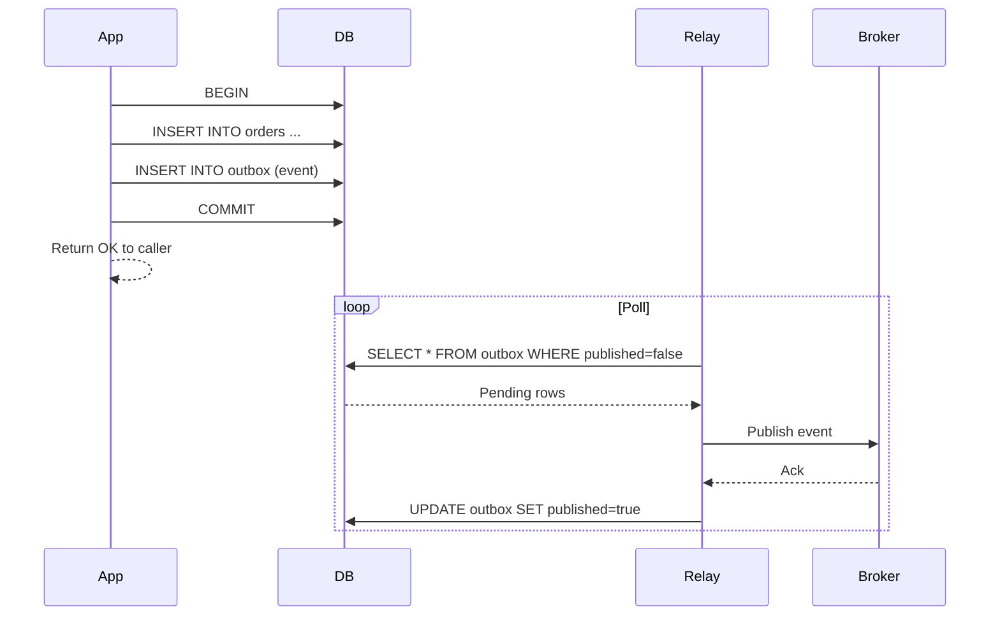
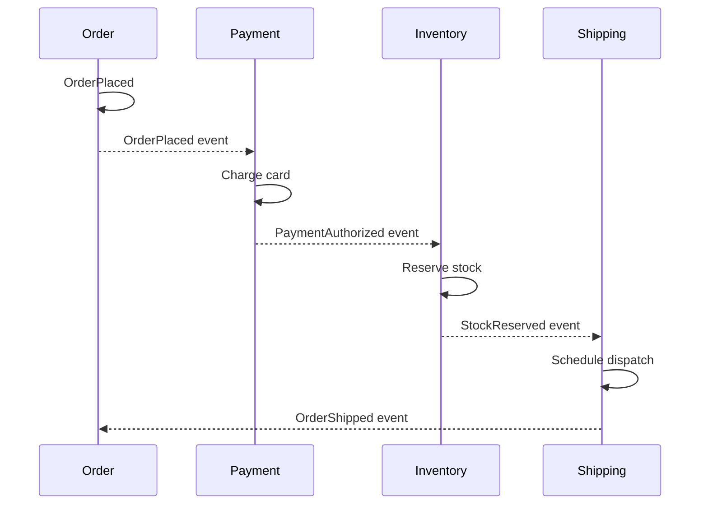
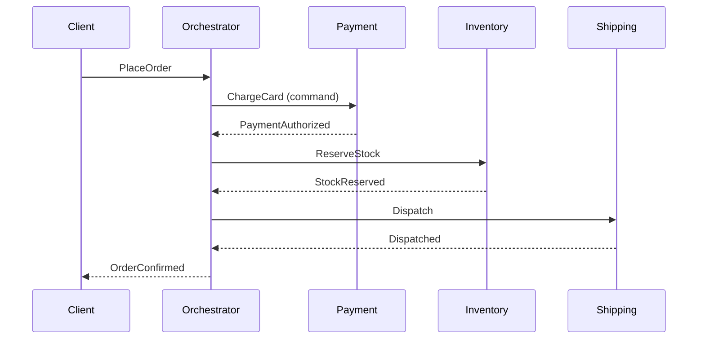
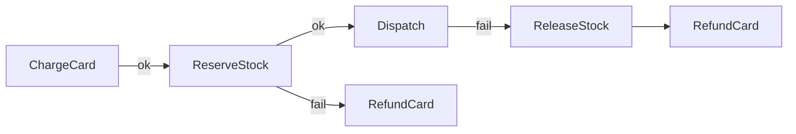
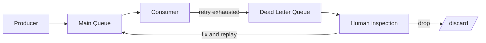
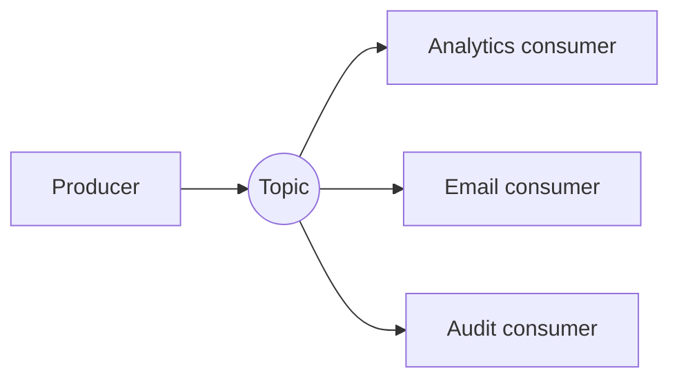
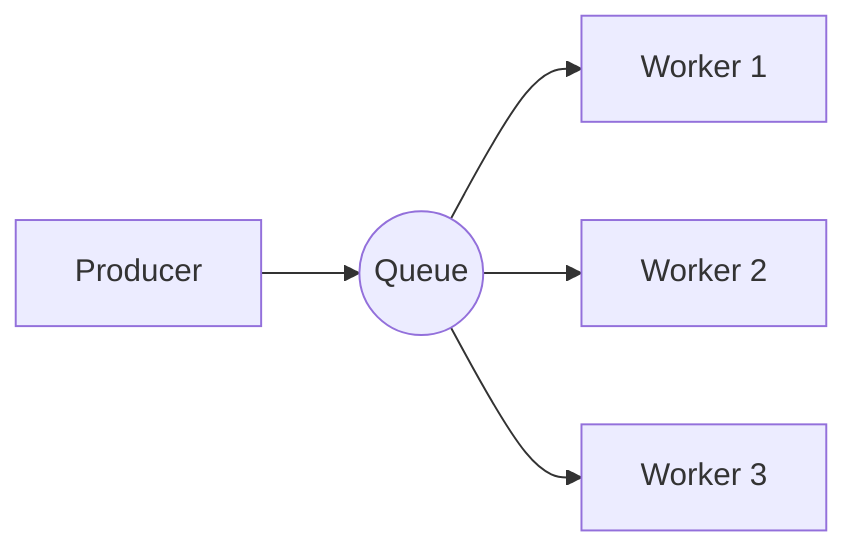
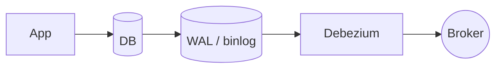

# Event-Driven Architecture Patterns

Date: 2026-04-17
Tags: `messaging` `event-driven` `architecture` `patterns`

## Table of Contents

- [Summary](#summary)
- [Events vs Commands vs Queries](#events-vs-commands-vs-queries)
- [Delivery Semantics](#delivery-semantics)
- [Idempotency](#idempotency)
- [Event Sourcing](#event-sourcing)
- [CQRS](#cqrs)
- [The Outbox Pattern](#the-outbox-pattern)
- [Saga Pattern](#saga-pattern)
- [Compensating Transactions](#compensating-transactions)
- [Dead-Letter Queues](#dead-letter-queues)
- [Retry Strategies](#retry-strategies)
- [Event Schema Evolution](#event-schema-evolution)
- [Fan-out Patterns](#fan-out-patterns)
- [Event Ordering](#event-ordering)
- [Transactional Outbox vs CDC](#transactional-outbox-vs-cdc)
- [Anti-patterns](#anti-patterns)
- [Decision Guide](#decision-guide)
- [Related](#related)
- [References](#references)

---

## Summary

Event-driven architecture (EDA) is a style where services communicate by
producing and consuming **events** — immutable facts about things that have
happened (`OrderPlaced`, `PaymentAuthorized`, `InventoryReserved`).

Instead of Service A directly calling Service B, Service A publishes an event
to a broker; interested services subscribe. This gives:

- **Temporal decoupling** — producer and consumer need not be online together.
- **Spatial decoupling** — producer doesn't know the consumers.
- **Evolutionary decoupling** — new consumers added without touching producer.

Trade-off: reasoning about state becomes harder. You gain scalability and
resilience; you lose the simplicity of "call a function, get a result".

This document covers broker-agnostic patterns — event sourcing, CQRS, outbox,
saga, idempotency, DLQ, delivery semantics, schema evolution. It is the
foundation for broker-specific docs (Kafka, etc.).

---

## Events vs Commands vs Queries

These three are often conflated but they have very different semantics.

| Aspect              | Command               | Query                  | Event                           |
|---------------------|-----------------------|------------------------|---------------------------------|
| Mood                | Imperative            | Interrogative          | Declarative (past tense)        |
| Example name        | `PlaceOrder`          | `GetOrderById`         | `OrderPlaced`                   |
| Can be rejected?    | Yes                   | Yes (not found, etc.)  | No — it already happened        |
| Side effects?       | Yes                   | No                     | It records a side effect        |
| Recipients          | Exactly one           | Exactly one            | Zero to many                    |
| Direction           | Sender → handler      | Client → service       | Publisher → subscribers         |
| Coupling            | Sender knows handler  | Client knows service   | Publisher doesn't know subs     |

### Naming convention

- **Commands**: imperative verb + noun — `CreateInvoice`, `ShipOrder`.
- **Queries**: question-like — `GetCustomerById`, `FindProductsByTag`.
- **Events**: past-tense verb phrase — `InvoiceCreated`, `OrderShipped`.

If you find yourself naming an event `ProcessPayment`, stop — that's a
command. An event would be `PaymentProcessed` or `PaymentAuthorized`.

Mixing them is the most common source of confusion in EDA. If producers
publish "commands" as "events", consumers implicitly become required handlers
— breaking pub-sub and re-introducing coupling.

---

## Delivery Semantics

Three classical levels:

| Level           | Guarantee                                                     |
|-----------------|---------------------------------------------------------------|
| At-most-once    | Message delivered zero or one times. Loss possible, no dups.  |
| At-least-once   | Message delivered one or more times. No loss, dups possible.  |
| Exactly-once    | Message delivered exactly one time. Hard to achieve.          |

### Why exactly-once is hard

Producer, broker, and consumer must coordinate through distributed consensus
surviving crashes at any point. End-to-end exactly-once is not achievable
across independent systems without shared transactional boundaries.

Brokers like Kafka offer "exactly-once semantics" within their own
transactional boundary, but once a consumer writes to an external system (DB,
HTTP), the guarantee ends.

### Effectively-once

The practical pattern:

> **at-least-once delivery + idempotent consumer = effectively-once processing**

Accept that the broker will re-deliver. Make the consumer safe to see the
same message twice.

---

## Idempotency

An operation is **idempotent** if applying it multiple times has the same
effect as applying it once.

### Techniques

1. **Idempotency keys** — every event carries a stable unique ID (often a
   UUID or a business key). Consumer records "I have processed ID X" before
   acting.

2. **Deduplication table** — consumer writes `(event_id, processed_at)` to a
   DB table in the same transaction as the side effect. A duplicate key
   violation means "already processed — skip".

3. **Conditional updates** — instead of "increment balance by 10", do
   "update balance = balance + 10 where last_event_id < current_event_id".
   State transitions become idempotent by construction.

4. **Natural idempotency** — `SET status = 'SHIPPED'` is naturally
   idempotent; `INCREMENT counter` is not.

### Minimal dedup schema

```sql
CREATE TABLE processed_events (
  event_id   UUID PRIMARY KEY,
  consumer   TEXT NOT NULL,
  processed_at TIMESTAMPTZ NOT NULL DEFAULT now()
);
```

Consumer pseudocode:

```
BEGIN;
  INSERT INTO processed_events(event_id, consumer) VALUES ($1, $2);
  -- if this fails with unique violation: ROLLBACK, ack, move on
  -- apply side effect here (same transaction when possible)
COMMIT;
```

Dedup tables grow — add a TTL matching the broker's retention window.

---

## Event Sourcing

Instead of storing the current state of an entity, store the full history of
events that led to that state. Current state is a **fold** over the event log.

### Traditional vs event-sourced

```
-- Traditional:
UPDATE account SET balance = 150 WHERE id = 42;

-- Event-sourced:
APPEND MoneyDeposited(account=42, amount=100)
APPEND MoneyDeposited(account=42, amount=50)
-- current balance = fold(events, 0, (bal, e) => bal + e.amount)
```

### Diagram



### Pros

- **Perfect audit trail** — every change is a first-class record.
- **Time travel** — reconstruct state at any past moment.
- **Debugging** — replay the log against a fixed version of the code.
- **New projections for free** — need a new read view? Replay events.
- **Natural fit with EDA** — events are already the integration unit.

### Cons

- **Complex** — developers must think in events, not state.
- **Eventual consistency** — projections lag the write model.
- **Schema evolution** — events are immutable; old events must stay readable.
- **Snapshots required** — replaying a million events is slow.
- **Queries are hard** — ad-hoc queries must hit a projection.

Use event sourcing when audit and replay are first-class requirements; avoid
it as a default.

---

## CQRS

**Command Query Responsibility Segregation** splits the model that accepts
writes (commands) from the model that serves reads (queries). The two can
have different schemas, different stores, and scale independently.



### Why split?

- Reads and writes have different shapes and scale needs. Writes are
  usually fewer; reads usually dominate volume.
- Read models can be denormalized for fast query (one document per screen).
- Write model can focus purely on invariants and validation.

### CQRS is not event sourcing

They are often paired but independent. You can do CQRS with a plain
relational write store and a read replica; event sourcing can work without
CQRS. They reinforce each other but solve different problems.

### Trade-offs

- More moving parts, more infrastructure.
- Read model is eventually consistent with the write model.
- Start with a single model; split only when read/write pressure genuinely
  differs.

---

## The Outbox Pattern

### The dual-write problem

A service handling `PlaceOrder` does two things in independent systems:

```
INSERT INTO orders(...)   -- DB
PUBLISH OrderPlaced        -- broker
```

Failure modes: DB commits but publish fails (order with no event), or publish
succeeds but ack is lost (event appears twice). These are the real pain.

### Outbox solution

Don't publish directly. Write the event to an `outbox` table **in the same DB
transaction** as the business write. A separate relay process polls the outbox
and publishes to the broker; it is safe to retry because the outbox row is the
source of truth.



### Minimal outbox schema

```sql
CREATE TABLE outbox (
  id           BIGSERIAL PRIMARY KEY,
  aggregate_id TEXT NOT NULL,
  event_type   TEXT NOT NULL,
  payload      JSONB NOT NULL,
  created_at   TIMESTAMPTZ NOT NULL DEFAULT now(),
  published_at TIMESTAMPTZ
);
CREATE INDEX outbox_unpublished ON outbox(id) WHERE published_at IS NULL;
```

### Properties

- Business write and event write are atomic (same DB tx).
- Relay can crash and restart; at-least-once delivery emerges from the
  published flag.
- Consumers must be idempotent (same as always).
- Row ID gives natural ordering per producer.

Polling has latency (100s of ms to seconds). For lower latency, use CDC
(below) or wake the relay via NOTIFY on insert.

---

## Saga Pattern

A **saga** is a sequence of local transactions across multiple services,
where each step publishes an event that triggers the next. If any step fails,
the saga runs **compensating** actions to undo earlier steps. No distributed
two-phase commit.

Two styles: **choreography** and **orchestration**.

### Choreography

No central coordinator. Each service reacts to events from others.



**Pros**

- Simple: no extra service.
- Services remain autonomous.
- Naturally loosely coupled.

**Cons**

- Flow is implicit — the whole workflow isn't visible in any single place.
- Harder to debug ("who reacts to this event?").
- Cyclic dependencies creep in if not watched carefully.
- Adding a step means editing multiple services.

### Orchestration

A central **orchestrator** service drives the flow, sending commands to each
participant and listening for replies.



**Pros**

- Workflow explicit and centralized — easy to read and modify.
- Easier to reason about failure and compensation.
- Clear place to log, observe, and monitor the saga.

**Cons**

- Orchestrator becomes a central piece of logic (single point of coupling).
- Risk of drifting back toward orchestrator-as-god-object.

### Comparison

| Aspect              | Choreography                    | Orchestration                  |
|---------------------|---------------------------------|--------------------------------|
| Central coordinator | No                              | Yes                            |
| Flow visibility     | Implicit (distributed)          | Explicit (one place)           |
| Coupling            | Event-level only                | Central orchestrator           |
| Complexity (few steps) | Simple                       | Overkill                       |
| Complexity (many steps) | Gets tangled                | Stays manageable               |
| Debuggability       | Harder                          | Easier                         |
| Good for            | 2–3 steps, stable flows         | 4+ steps, evolving flows       |

Rule of thumb: start with choreography. Move to orchestration when the number
of steps or branching paths makes the flow hard to trace.

---

## Compensating Transactions

Sagas cannot rollback because each step already committed locally. Instead,
each forward step has a **compensating** inverse that semantically undoes
the effect.

| Forward step         | Compensation                |
|----------------------|-----------------------------|
| `ChargeCard`         | `RefundCard`                |
| `ReserveStock`       | `ReleaseStock`              |
| `SendShippingLabel`  | `CancelShippingLabel`       |
| `CreateAccount`      | `DeactivateAccount`         |

### Rules for compensations

1. **Semantic undo, not physical rollback** — a refund is not an "un-charge";
   it is a new transaction that offsets the original.
2. **Must be idempotent** — compensations can themselves be retried.
3. **Must always eventually succeed** — if a compensation can fail
   permanently, the saga cannot guarantee consistency. Design steps so
   compensations are always possible.
4. **Avoid steps that cannot be compensated** — e.g. "send email" cannot be
   un-sent. Reorder the saga so such steps happen last, after all failure-prone
   steps have succeeded.

### Diagram



---

## Dead-Letter Queues

When a message cannot be processed after N retries, it is a **poison
message**. It should not block the queue forever. A dead-letter queue (DLQ)
is a side-channel destination where such messages go for human inspection
and manual replay.



### What goes to DLQ

- Malformed payloads that never parse.
- Events referencing entities that never exist.
- Events processed by a bug that throws every time.
- Expired events with downstream dependencies no longer available.

### DLQ hygiene

- Alert on DLQ depth > 0.
- Include original headers, retry count, last error, and trace ID.
- Provide tooling to replay from DLQ after a fix.
- Document the on-call runbook: inspect, replay, drop.

---

## Retry Strategies

| Strategy                    | Behavior                                | When to use                |
|-----------------------------|-----------------------------------------|----------------------------|
| Fixed delay                 | Wait N ms, retry, repeat                | Rare; debugging only       |
| Linear backoff              | N, 2N, 3N, ...                          | Mild load protection       |
| Exponential backoff         | N, 2N, 4N, 8N, ...                      | Default for transient errs |
| Exponential + jitter        | N, 2N±rand, 4N±rand, ...                | Default at scale           |
| Circuit breaker + backoff   | Stop retrying if downstream is dead     | Protect cascading failures |

### Why jitter matters

Without jitter, many consumers fail at the same instant and then retry in
perfect lockstep, hammering the recovering service on every cycle (the
**thundering herd**). Jitter spreads the retry wave.

### When NOT to retry

- **Validation errors** (HTTP 400) — the message is bad, retrying won't help.
  Send it to DLQ immediately.
- **Authentication / authorization failures** (HTTP 401 / 403) — same,
  retries don't fix permissions.
- **Not-found errors** for business entities that should exist — likely a
  data inconsistency; retries mask the real bug.
- **Semantic "already done"** — idempotency-key collision; treat as success.

### When to retry

- Network timeouts and connection errors.
- 5xx from a downstream service.
- Database deadlocks and serialization failures.
- Broker temporarily unavailable.

---

## Event Schema Evolution

Events are written now and consumed for a long time. Schemas change.
You must evolve without breaking old producers or old consumers.

### Safe changes

- **Add an optional field** — old consumers ignore unknown fields (if the
  serializer allows; JSON does, strict Protobuf does, strict Avro requires
  care).
- **Add a new event type** — new consumers subscribe; old consumers ignore.
- **Add a new enum value** — only safe if consumers have a default for
  unknown values.

### Dangerous changes

- **Remove a field** — breaks consumers that read it.
- **Rename a field** — breaks every consumer.
- **Change a field's type or meaning** — semantic breakage, often silent.
- **Change required/optional** — required → optional is fine, optional →
  required breaks old producers.

### Two-phase migration for renames

1. **Phase 1**: publish both old and new field with the same value. Deploy
   consumers to read the new name (fall back to old).
2. **Phase 2**: remove the old field from producers only after every
   consumer reads the new one. Never skip phase 1.

### Schema Registry

A **schema registry** (Confluent Schema Registry, Apicurio, AWS Glue) stores
versioned schemas and enforces compatibility rules at produce time. Each
event carries a schema ID; consumers fetch the schema and deserialize safely.

Compatibility modes:

- **Backward**: new schema can read old data. (Safe to upgrade consumers first.)
- **Forward**: old schema can read new data. (Safe to upgrade producers first.)
- **Full**: both.
- **None**: no checking — avoid.

---

## Fan-out Patterns

### Pub-sub (broadcast)

One event, many independent consumers. Each subscriber gets its own copy.
Each subscriber is a logically separate application.



- Used for: domain events that different subsystems care about for different
  reasons.
- Each consumer tracks its own position / offset.

### Competing consumers (work queue)

One event, exactly one of N parallel workers processes it. Used to scale
throughput horizontally.



- Used for: scaling stateless processing.
- Ordering is lost across workers (unless the broker partitions by key).

### Hybrid (Kafka-style consumer groups)

Each group acts like a pub-sub subscriber (every message); within a group,
partitions distribute among members (competing consumers). Kafka's default —
best of both.

---

## Event Ordering

Total global ordering is expensive and usually unnecessary. Brokers typically
offer ordering **per partition / per key**.

| Scope             | Guarantee                                    | Cost                      |
|-------------------|----------------------------------------------|---------------------------|
| Global            | All events across all producers ordered      | No parallelism            |
| Per partition     | Events within one partition ordered          | Parallelism across parts  |
| Per key           | Events with same partition key ordered       | Good default              |
| None              | No order guarantees                          | Max parallelism           |

### Choosing a partition key

The partition key determines ordering scope. Common choice: the aggregate ID
(customer ID, order ID, account ID). All events for the same aggregate land in
the same partition, preserving per-aggregate order, while different aggregates
can be processed in parallel.

Pitfall: a **hot key** (one customer with 90% of the traffic) kills
parallelism and creates a bottleneck. Audit key distribution.

---

## Transactional Outbox vs CDC

Both solve the dual-write problem. They differ in how events leave the DB.

### Outbox (application-owned)

- Application inserts into the `outbox` table explicitly.
- Relay polls the table or reads via trigger/notification.
- Event schema is whatever the application writes (first-class domain events).

### CDC (Change Data Capture)

- A connector (e.g., **Debezium**) reads the DB's replication log / binlog.
- Every committed row change is emitted as an event to the broker.
- The application never writes "events" — changes to domain tables are
  themselves the event source.



### Comparison

| Aspect                      | Outbox                         | CDC (Debezium)                |
|-----------------------------|--------------------------------|-------------------------------|
| Event schema                | First-class domain events      | Row-change events (table diff)|
| Application awareness       | Must write outbox rows         | Transparent                   |
| Setup                       | App code + relay               | Connector infra               |
| Latency                     | Polling interval               | Near-real-time (streaming)    |
| Semantic clarity            | High — events express intent   | Low — must derive intent      |
| Works for legacy systems    | Requires code change           | Yes, without touching app     |
| Schema coupling             | Decoupled from tables          | Tightly coupled to schema     |

Use **outbox** when you want clean domain events and own the code. Use
**CDC** when the application cannot be changed, or when raw table-level
replication is what you actually need. Some teams do both: CDC for
infrastructure replication, outbox for integration events.

---

## Anti-patterns

### 1. Passing commands as events

Publishing `ProcessPayment` on an event topic and relying on exactly one
consumer to handle it. This is a command in drag. You have:

- Reintroduced tight coupling (producer now depends on consumer existing).
- Broken pub-sub semantics (adding a second subscriber now double-processes).
- Hidden ownership of the action.

If you need "tell service X to do Y", use a command (direct call, RPC,
command queue) — not an event.

### 2. Ordered processing of events that should be independent

Sequentially processing an event stream "because order matters" when it
doesn't. This creates an artificial bottleneck. If two events don't share an
aggregate, they should be processable in parallel.

### 3. Using the event payload as an RPC

```
UserCreated { id, then call /users/{id} to get details }
```

Consumers should not have to call back to the producer to get useful
information. Put the data the consumers need into the event. If the event
gets too big, split into multiple event types.

### 4. Missing idempotency on consumers

"We use at-least-once delivery but we haven't needed dedup yet." Translation:
"We haven't noticed the duplicates yet." Every at-least-once consumer must be
idempotent from day one.

### 5. Fire-and-forget without observability

Publishing events without tracing, metrics, or DLQ monitoring. When something
goes wrong — and it will — you'll have no idea. At minimum:

- Producer: emit a metric per event type published.
- Broker: monitor lag and DLQ depth.
- Consumer: emit processing latency and error rate per event type.
- End-to-end: propagate trace IDs through event headers.

### 6. Event-driven as a default for synchronous flows

"User clicks button, wants a result right now." Wrapping this in events
gives you eventual consistency, extra infrastructure, and a worse UX, with
no benefit. Events are for decoupled, asynchronous integration.

### 7. Giant god events

`OrderUpdated { entire-order-blob }` with no indication of what actually
changed. Consumers must diff to figure out what happened. Prefer specific
events: `OrderShipped`, `OrderAddressChanged`, `OrderLineItemAdded`.

---

## Decision Guide

### EDA helps when

- Multiple services need to know about the same business fact.
- Producer and consumers evolve independently.
- Consumers can be added later without touching the producer.
- Load spikes should be absorbed by a queue, not propagated.
- You need an audit trail of what happened.
- You want asynchronous, non-blocking workflows.
- You need to fan out to heterogeneous downstream systems.

### EDA hurts when

- The operation is fundamentally synchronous and the caller needs a result
  immediately (authentication, payment authorization in a checkout flow).
- You need strong transactional consistency across services (traditional
  ACID), and eventual consistency is not acceptable.
- Tight latency budgets (single-digit millisecond) leave no room for broker
  round-trips.
- The team is small, the system is simple, and the operational cost of
  running a broker outweighs the coupling you'd save.
- Debugging complexity isn't budgeted for. EDA moves bugs from "bad call
  stack" to "mystery at 3am".

### A reasonable progression

1. Start synchronous. Services call each other directly.
2. When a flow has > 2 interested parties, introduce events for that flow.
3. Add outbox for reliability.
4. Introduce sagas when multi-service transactions emerge.
5. Consider event sourcing + CQRS only for aggregates that really benefit.

Don't skip to step 5. Every step adds operational load.

---

## Related

- `./reactive-kafka.md` — Kafka with Reactor Kafka (sibling, to be added).
- `./spring-kafka.md` — Spring for Apache Kafka (sibling, to be added).
- `../events-async/application-events.md` — Spring's in-process event bus
  (single JVM, no broker) — the opposite end of the spectrum.

---

## References

- Martin Fowler — ["Event Sourcing"](https://martinfowler.com/eaaDev/EventSourcing.html), ["CQRS"](https://martinfowler.com/bliki/CQRS.html), ["What do you mean by 'Event-Driven'?"](https://martinfowler.com/articles/201701-event-driven.html).
- Chris Richardson — [microservices.io Patterns](https://microservices.io/patterns/index.html): Saga, Transactional Outbox, CQRS, Event Sourcing, Domain Event.
- Chris Richardson — *Microservices Patterns* (Manning).
- Debezium documentation — <https://debezium.io/documentation/>.
- Confluent — [Event-Driven Architecture Quickstart](https://www.confluent.io/learn/event-driven-architecture/), [Exactly-Once Semantics in Kafka](https://www.confluent.io/blog/exactly-once-semantics-are-possible-heres-how-apache-kafka-does-it/).
- Gregor Hohpe — *Enterprise Integration Patterns*.
- Vaughn Vernon — *Implementing Domain-Driven Design*.
