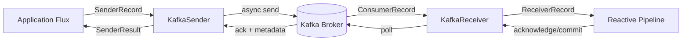

# Reactive Kafka with reactor-kafka

Date: 2026-04-17
Tags: kafka, reactive, reactor-kafka, messaging, webflux

## Table of Contents

- [Summary](#summary)
- [Kafka Basics Refresher](#kafka-basics-refresher)
- [Dependency](#dependency)
- [Producer Setup](#producer-setup)
- [Sending Records](#sending-records)
- [Consumer Setup](#consumer-setup)
- [Consuming Records](#consuming-records)
- [Offset Management](#offset-management)
- [Backpressure](#backpressure)
- [Error Handling](#error-handling)
- [Exactly-Once Semantics](#exactly-once-semantics)
- [Spring Boot Integration](#spring-boot-integration)
- [Testing with Testcontainers](#testing-with-testcontainers)
- [Reactor Kafka vs Spring for Apache Kafka](#reactor-kafka-vs-spring-for-apache-kafka)
- [Common Pitfalls](#common-pitfalls)
- [Related](#related)
- [References](#references)

---

## Summary

`reactor-kafka` is a thin reactive adapter over the standard Apache Kafka Java
client. It exposes two primary abstractions:

- **`KafkaSender<K, V>`** — send records as a `Flux<SenderRecord>` and receive
  acknowledgements as a `Flux<SenderResult>`.
- **`KafkaReceiver<K, V>`** — subscribe to topics and consume records as a
  `Flux<ReceiverRecord>`.

Under the hood it wraps Kafka's callback-based `Producer.send` and polls from
`Consumer.poll` on a dedicated scheduler, turning both into Reactor streams
with proper backpressure semantics.

It is the best fit when the surrounding service is already Spring WebFlux
based, because you can compose Kafka I/O with the rest of your reactive
pipeline (WebClient calls, R2DBC queries, Redis pubsub) without jumping in and
out of blocking code or wrapping listeners in `Mono.fromCallable`.

If the service is a classic Spring MVC app, reach for `spring-kafka` and
`@KafkaListener` instead — it is simpler and has a much larger community.

---

## Kafka Basics Refresher

Assuming familiarity, the bare minimum you need to keep in mind:

- **Topic** — named stream of records, partitioned.
- **Partition** — ordered, append-only log of records; ordering is guaranteed
  within a partition, never across partitions.
- **Offset** — monotonic position inside a partition. Consumers track their
  position per (topic, partition).
- **Consumer group** — set of consumer instances sharing a `group.id`; Kafka
  assigns partitions across instances so each partition is read by exactly one
  consumer in the group.
- **Key** — used for partitioning (same key -> same partition -> preserved
  ordering for that key).

If any of this is fuzzy, the [Apache Kafka Introduction](https://kafka.apache.org/intro)
is the canonical read; reactor-kafka does not try to hide these concepts.

---

## Dependency

```xml
<dependency>
    <groupId>io.projectreactor.kafka</groupId>
    <artifactId>reactor-kafka</artifactId>
    <version>1.3.23</version>
</dependency>
```

Gradle:

```kotlin
implementation("io.projectreactor.kafka:reactor-kafka:1.3.23")
```

Notes:

- This is **not** `spring-kafka`. `spring-kafka` provides `@KafkaListener` and
  `KafkaTemplate`; `reactor-kafka` provides `KafkaSender`/`KafkaReceiver`. They
  can coexist in one classpath, but in practice pick one style per service.
- `reactor-kafka` transitively brings in `org.apache.kafka:kafka-clients`, so
  you do not need to declare it separately. Override the version only if you
  need to match a specific broker feature.
- Add your serializer dependency separately (Spring's `JsonSerializer`,
  Confluent Avro, etc).

---

## Producer Flow Diagram



---

## Producer Setup

`SenderOptions` wraps the standard Kafka producer configuration map plus a few
reactor-specific tuning knobs.

```java
Map<String, Object> props = new HashMap<>();
props.put(ProducerConfig.BOOTSTRAP_SERVERS_CONFIG, "localhost:9092");
props.put(ProducerConfig.KEY_SERIALIZER_CLASS_CONFIG, StringSerializer.class);
props.put(ProducerConfig.VALUE_SERIALIZER_CLASS_CONFIG, JsonSerializer.class);
props.put(ProducerConfig.ACKS_CONFIG, "all");
props.put(ProducerConfig.ENABLE_IDEMPOTENCE_CONFIG, true);
props.put(ProducerConfig.CLIENT_ID_CONFIG, "orders-producer");

SenderOptions<String, Order> options = SenderOptions.<String, Order>create(props)
    .maxInFlight(1024)
    .stopOnError(false);

KafkaSender<String, Order> sender = KafkaSender.create(options);
```

Key options:

- `maxInFlight` — how many sends can be outstanding before backpressure kicks
  in. Default is 256; raise it for high-throughput producers.
- `stopOnError` — when `false`, one failed record does not terminate the whole
  `send` Flux. You still observe errors via `SenderResult.exception()`.
- `scheduler` — the scheduler used to publish results. Defaults to a dedicated
  single-threaded scheduler; rarely needs changing.

Always call `sender.close()` (or `.doFinally(sig -> sender.close())` if you
tie its lifecycle to a specific subscription) on shutdown to flush in-flight
records and release the underlying producer.

---

## Sending Records

`sender.send(Publisher<SenderRecord>)` is the primary API. It returns a
`Flux<SenderResult<T>>` where `T` is a per-record correlation value you choose
(useful for correlating results back to domain IDs).

```java
Flux<SenderRecord<String, Order, Long>> records = Flux.range(1, 10)
    .map(i -> {
        Order order = new Order("order-" + i, BigDecimal.valueOf(i * 10));
        ProducerRecord<String, Order> pr =
            new ProducerRecord<>("orders", "key-" + i, order);
        return SenderRecord.create(pr, (long) i);
    });

sender.send(records)
    .doOnNext(result -> {
        if (result.exception() != null) {
            log.error("Failed to send correlation={}", result.correlationMetadata(),
                result.exception());
        } else {
            RecordMetadata md = result.recordMetadata();
            log.debug("Sent offset={} partition={} correlation={}",
                md.offset(), md.partition(), result.correlationMetadata());
        }
    })
    .doOnError(e -> log.error("Fatal producer error", e))
    .subscribe();
```

For a single fire-and-forget record, the convenience API is:

```java
public Mono<RecordMetadata> publish(Order order) {
    ProducerRecord<String, Order> record =
        new ProducerRecord<>("orders", order.id(), order);
    return sender.send(Mono.just(SenderRecord.create(record, order.id())))
        .next()
        .handle((result, sink) -> {
            if (result.exception() != null) {
                sink.error(result.exception());
            } else {
                sink.next(result.recordMetadata());
            }
        });
}
```

`handle` turns a per-record failure into a failed `Mono`, which is usually
what you want at the service boundary.

---

## Consumer Setup

```java
Map<String, Object> props = new HashMap<>();
props.put(ConsumerConfig.BOOTSTRAP_SERVERS_CONFIG, "localhost:9092");
props.put(ConsumerConfig.GROUP_ID_CONFIG, "orders-processor");
props.put(ConsumerConfig.KEY_DESERIALIZER_CLASS_CONFIG, StringDeserializer.class);
props.put(ConsumerConfig.VALUE_DESERIALIZER_CLASS_CONFIG, JsonDeserializer.class);
props.put(ConsumerConfig.AUTO_OFFSET_RESET_CONFIG, "earliest");
props.put(ConsumerConfig.ENABLE_AUTO_COMMIT_CONFIG, false);
props.put(JsonDeserializer.TRUSTED_PACKAGES, "com.example.orders");

ReceiverOptions<String, Order> options = ReceiverOptions.<String, Order>create(props)
    .subscription(List.of("orders"))
    .commitInterval(Duration.ofSeconds(5))
    .commitBatchSize(100);

KafkaReceiver<String, Order> receiver = KafkaReceiver.create(options);
```

Required bits:

- `subscription(...)` or `assignment(...)` — you must pick one; reactor-kafka
  does not read partition assignment from the props map.
- `ENABLE_AUTO_COMMIT_CONFIG=false` — leave auto-commit off and let
  reactor-kafka manage commits, otherwise you lose at-least-once guarantees
  when combined with async processing.

Useful knobs:

- `commitInterval` — how often reactor-kafka flushes acknowledged offsets.
  Default is 5 seconds.
- `commitBatchSize` — flush early if this many acks accumulate.
- `addAssignListener` / `addRevokeListener` — hooks to run during partition
  rebalance (e.g. flush local caches).

---

## Consuming Records

```java
Disposable subscription = receiver.receive()
    .concatMap(record -> processOrder(record.value())
        .doOnSuccess(v -> record.receiverOffset().acknowledge())
        .onErrorResume(ex -> handleFailure(record, ex)))
    .subscribe(
        v -> {},
        err -> log.error("Consumer stream terminated", err)
    );
```

Important points:

- **Use `concatMap`, not `flatMap`.** Records within the same partition arrive
  in order, and `flatMap` will happily process them out of order. `concatMap`
  preserves per-partition ordering.
- `record.receiverOffset().acknowledge()` is non-blocking; it buffers the
  offset for the next scheduled commit.
- Never call `.block()` inside the pipeline. If you need side effects like
  metrics, use `.doOnNext` / `.tap`.

For higher throughput with per-partition ordering, combine `groupBy` with
`concatMap`:

```java
receiver.receive()
    .groupBy(record -> record.receiverOffset().topicPartition())
    .flatMap(partitionFlux ->
        partitionFlux.concatMap(record ->
            processOrder(record.value())
                .doOnSuccess(v -> record.receiverOffset().acknowledge())))
    .subscribe();
```

Now each partition is processed sequentially on its own inner Flux, but
partitions are processed in parallel. This is the reactor-kafka idiom for
"parallel work without breaking Kafka ordering".

---

## Offset Management

reactor-kafka exposes two commit styles on each `ReceiverOffset`:

| Call            | Semantics                                                          |
|-----------------|--------------------------------------------------------------------|
| `acknowledge()` | Queue this offset for the next scheduled commit (batched by time/size). Non-blocking. |
| `commit()`      | Return a `Mono<Void>` that completes when the offset is committed to the broker. Use when you need a hard guarantee before proceeding. |

Typical usage:

```java
// Fire-and-forget; relies on commitInterval/commitBatchSize to flush.
record.receiverOffset().acknowledge();

// Explicit sync commit before continuing.
return processOrder(record.value())
    .then(record.receiverOffset().commit());
```

**At-least-once delivery** is the default guarantee if you only acknowledge
*after* successful processing. A record that crashes before ack will be
redelivered after the next rebalance or consumer restart — design
`processOrder` to be idempotent.

**At-most-once** (rarely what you want) is achieved by acknowledging
immediately on receipt, before processing. On crash, the record is lost.

---

## Backpressure

Reactor backpressure works end-to-end with reactor-kafka:

- The inner Reactor `Flux` requests records from the receiver.
- When downstream is slow (e.g. the DB is lagging), reactor-kafka stops
  `poll`-ing with new records and lets the broker's client-side buffer
  drain.
- When that buffer fills, the broker simply does not advance this consumer's
  fetch offset — nothing is lost, nothing is queued unboundedly in JVM heap.

This is the most underrated property of reactor-kafka: naive `@KafkaListener`
code can happily pull 500 records per poll and swamp downstream, while
reactor-kafka applies classical demand propagation.

Knobs that interact with backpressure:

- `max.poll.records` — upper bound on records per poll.
- `fetch.max.bytes` — upper bound on bytes per fetch.
- `ReceiverOptions.maxDelayRebalance` — how long rebalance waits for in-flight
  records to be acked before revoking partitions.

Keep `max.poll.records` modest (100–500) unless you have measured that more
is safe.

---

## Error Handling

There are three distinct failure classes and each wants a different strategy.

### 1. Transient downstream failure (retryable)

DB timeout, a cold JVM, a flaky dependency. Retry with backoff, then give up.

```java
receiver.receive()
    .concatMap(record -> processOrder(record.value())
        .retryWhen(Retry.backoff(3, Duration.ofMillis(200))
            .maxBackoff(Duration.ofSeconds(5)))
        .doOnSuccess(v -> record.receiverOffset().acknowledge())
        .onErrorResume(ex -> sendToDlq(record, ex)))
    .subscribe();
```

### 2. Poison message (non-retryable)

Deserialization or schema failure. Retries will never succeed. Route to a
dead-letter topic and acknowledge the original offset so the consumer moves
forward.

```java
private Mono<Void> sendToDlq(ReceiverRecord<String, Order> record, Throwable cause) {
    ProducerRecord<String, byte[]> dlq = new ProducerRecord<>(
        "orders.dlq",
        record.key(),
        record.value() == null ? null : serialize(record.value())
    );
    dlq.headers().add("x-error", cause.getMessage().getBytes(UTF_8));
    return dlqSender.send(Mono.just(SenderRecord.create(dlq, record.key())))
        .then()
        .doOnSuccess(v -> record.receiverOffset().acknowledge());
}
```

Deserialization is the tricky case because it fails *inside* the Kafka client
before you see a `ReceiverRecord`. Use Spring's `ErrorHandlingDeserializer` to
turn deserialization errors into records whose value is `null` and whose
headers carry the exception — then you can route them to the DLQ like any
other record.

### 3. Fatal pipeline failure

The outer `Flux` errors. reactor-kafka does **not** auto-restart a terminated
subscription. Wrap the whole pipeline in a `Flux.defer` + `retryWhen` at the
supervisor level:

```java
Flux.defer(() -> receiver.receive()
        .concatMap(this::handleRecord))
    .retryWhen(Retry.backoff(Long.MAX_VALUE, Duration.ofSeconds(1))
        .maxBackoff(Duration.ofMinutes(1)))
    .subscribe();
```

Using `Flux.defer` ensures the receiver is re-created on each retry.

Avoid `onErrorContinue` — it quietly drops records and skips offset commits,
leaving the consumer group in a confused state.

---

## Exactly-Once Semantics

Exactly-once is possible when the consume-process-produce loop happens
entirely within Kafka. Requirements:

- Producer: set `transactional.id` (unique per producer instance) and enable
  `enable.idempotence=true`.
- Consumer: set `isolation.level=read_committed`.
- Use `sender.sendTransactionally(...)` to group sends + offset commit into one
  atomic transaction.

Sketch:

```java
Map<String, Object> producerProps = new HashMap<>(baseProps);
producerProps.put(ProducerConfig.TRANSACTIONAL_ID_CONFIG, "orders-tx-1");
producerProps.put(ProducerConfig.ENABLE_IDEMPOTENCE_CONFIG, true);

SenderOptions<String, Order> txOptions = SenderOptions.<String, Order>create(producerProps);
KafkaSender<String, Order> txSender = KafkaSender.create(txOptions);

TransactionManager tm = txSender.transactionManager();

receiver.receive()
    .window(100)
    .concatMap(window ->
        tm.begin()
            .thenMany(txSender.send(window.map(this::toSenderRecord)))
            .concatWith(tm.sendOffsets(offsetsFromWindow(window), "orders-processor"))
            .concatWith(tm.commit())
            .onErrorResume(ex -> tm.abort().then(Mono.error(ex))))
    .subscribe();
```

Trade-offs:

- Throughput drops (commit overhead per batch).
- Producer and consumer clocks must cooperate; a crashed producer leaves open
  transactions that `transaction.timeout.ms` must eventually close.
- `transactional.id` uniqueness is your responsibility; reusing the same id
  across running instances is a data-loss bug.

For most services, idempotent consumers with at-least-once delivery are
simpler and more operationally boring.

---

## Spring Boot Integration

Typical layout — configuration properties bound to a typed class, senders and
receivers exposed as beans, consumer started on `ApplicationReadyEvent`.

### Configuration properties

```java
@ConfigurationProperties(prefix = "app.kafka")
public record KafkaProps(
    String bootstrapServers,
    String clientId,
    Consumer consumer,
    Producer producer
) {
    public record Consumer(String groupId, List<String> topics,
                           Duration commitInterval, int commitBatchSize) {}
    public record Producer(int maxInFlight, String transactionalId) {}
}
```

```yaml
app:
  kafka:
    bootstrap-servers: localhost:9092
    client-id: orders-service
    consumer:
      group-id: orders-processor
      topics: [orders]
      commit-interval: 5s
      commit-batch-size: 100
    producer:
      max-in-flight: 1024
```

### Beans

```java
@Configuration
@EnableConfigurationProperties(KafkaProps.class)
public class KafkaConfig {

    @Bean
    KafkaSender<String, Order> orderSender(KafkaProps props) {
        Map<String, Object> cfg = new HashMap<>();
        cfg.put(ProducerConfig.BOOTSTRAP_SERVERS_CONFIG, props.bootstrapServers());
        cfg.put(ProducerConfig.CLIENT_ID_CONFIG, props.clientId() + "-producer");
        cfg.put(ProducerConfig.KEY_SERIALIZER_CLASS_CONFIG, StringSerializer.class);
        cfg.put(ProducerConfig.VALUE_SERIALIZER_CLASS_CONFIG, JsonSerializer.class);
        cfg.put(ProducerConfig.ENABLE_IDEMPOTENCE_CONFIG, true);
        return KafkaSender.create(
            SenderOptions.<String, Order>create(cfg)
                .maxInFlight(props.producer().maxInFlight()));
    }

    @Bean
    KafkaReceiver<String, Order> orderReceiver(KafkaProps props) {
        Map<String, Object> cfg = new HashMap<>();
        cfg.put(ConsumerConfig.BOOTSTRAP_SERVERS_CONFIG, props.bootstrapServers());
        cfg.put(ConsumerConfig.GROUP_ID_CONFIG, props.consumer().groupId());
        cfg.put(ConsumerConfig.CLIENT_ID_CONFIG, props.clientId() + "-consumer");
        cfg.put(ConsumerConfig.KEY_DESERIALIZER_CLASS_CONFIG, StringDeserializer.class);
        cfg.put(ConsumerConfig.VALUE_DESERIALIZER_CLASS_CONFIG, JsonDeserializer.class);
        cfg.put(ConsumerConfig.ENABLE_AUTO_COMMIT_CONFIG, false);
        cfg.put(JsonDeserializer.TRUSTED_PACKAGES, "com.example.orders");
        return KafkaReceiver.create(
            ReceiverOptions.<String, Order>create(cfg)
                .subscription(props.consumer().topics())
                .commitInterval(props.consumer().commitInterval())
                .commitBatchSize(props.consumer().commitBatchSize()));
    }
}
```

### Consumer lifecycle

Bind the consumer subscription to the Spring lifecycle so it starts once the
app is ready and stops cleanly on shutdown.

```java
@Component
@RequiredArgsConstructor
public class OrderConsumer {
    private final KafkaReceiver<String, Order> receiver;
    private final OrderProcessor processor;
    private Disposable subscription;

    @EventListener(ApplicationReadyEvent.class)
    public void start() {
        subscription = Flux.defer(() ->
                receiver.receive()
                    .groupBy(r -> r.receiverOffset().topicPartition())
                    .flatMap(partition ->
                        partition.concatMap(this::handle)))
            .retryWhen(Retry.backoff(Long.MAX_VALUE, Duration.ofSeconds(1))
                .maxBackoff(Duration.ofMinutes(1)))
            .subscribe();
    }

    private Mono<Void> handle(ReceiverRecord<String, Order> record) {
        return processor.process(record.value())
            .doOnSuccess(v -> record.receiverOffset().acknowledge())
            .onErrorResume(ex -> Mono.fromRunnable(
                () -> log.error("processing failed for {}", record.key(), ex)));
    }

    @PreDestroy
    public void stop() {
        if (subscription != null) subscription.dispose();
    }
}
```

Why `ApplicationReadyEvent` rather than `@PostConstruct`? Because the
subscription may produce work that depends on other beans being fully
initialised (tracing, metrics, database pools).

---

## Testing with Testcontainers

```java
@SpringBootTest
@Testcontainers
class OrderFlowIT {

    @Container
    static KafkaContainer kafka = new KafkaContainer(
        DockerImageName.parse("confluentinc/cp-kafka:7.6.0"));

    @DynamicPropertySource
    static void kafkaProps(DynamicPropertyRegistry reg) {
        reg.add("app.kafka.bootstrap-servers", kafka::getBootstrapServers);
    }

    @Autowired KafkaSender<String, Order> sender;
    @Autowired WebTestClient webClient;

    @Test
    void placesOrderAndEmitsEvent() {
        webClient.post().uri("/orders")
            .bodyValue(new CreateOrderRequest("sku-1", 2))
            .exchange()
            .expectStatus().isCreated();

        // Consume with a disposable receiver to assert the emitted event.
        try (KafkaReceiver<String, Order> probe = testReceiver()) {
            StepVerifier.create(probe.receive().next())
                .assertNext(r -> assertThat(r.value().sku()).isEqualTo("sku-1"))
                .verifyComplete();
        }
    }
}
```

Tips:

- Use a unique `group.id` per test class to avoid offset leakage between runs.
- Set `AUTO_OFFSET_RESET_CONFIG=earliest` in tests so the probe does not miss
  events produced during HTTP handling.
- Give the Kafka container enough time with Ryuk cleanup; avoid
  `StepVerifier.create(...).verifyComplete()` on an infinite Flux — always
  terminate with `.next()`, `.take(n)`, or `thenCancel()`.

---

## Reactor Kafka vs Spring for Apache Kafka

| Concern                   | reactor-kafka                                   | spring-kafka                                |
|---------------------------|-------------------------------------------------|---------------------------------------------|
| API style                 | `Flux<ReceiverRecord>` / `Flux<SenderResult>`   | `@KafkaListener`, `KafkaTemplate`           |
| Backpressure              | Native Reactor demand signalling                | Manual, via `setContainerProperties`        |
| Integrates with WebFlux   | Directly                                        | Requires bridging via `Mono.fromCallable`   |
| Transactions              | `TransactionManager` on `KafkaSender`           | `@Transactional` + `KafkaTransactionManager`|
| Batching helpers          | Basic (window, buffer)                          | Rich (`@KafkaListener(batch=true)` etc)     |
| Community examples        | Small but growing                               | Very large                                  |
| Error-handler abstraction | You write it in Reactor operators               | `DefaultErrorHandler`, `RetryTopic`         |

Choose `reactor-kafka` when:

- The service is already WebFlux end-to-end.
- You need honest backpressure from Kafka into downstream calls.
- You are comfortable expressing control flow in Reactor operators.

Choose `spring-kafka` when:

- The service is classic Servlet/MVC, or a plain streaming worker.
- Non-reactive developers will maintain the code.
- You need the `RetryTopic`/DLQ orchestration that Spring ships out of the
  box.

See the sibling doc `spring-kafka.md` for the annotation-driven alternative.

---

## Common Pitfalls

- **Forgetting to acknowledge offsets.** The Flux keeps running, records keep
  getting processed, but nothing is ever committed. On restart the group
  replays from the last committed offset and lag grows unboundedly. Fix:
  always call `acknowledge()` (or `commit()`) after successful processing.
- **Using `flatMap` instead of `concatMap`.** `flatMap` processes records
  concurrently, which silently reorders events within a partition. If you
  want parallelism, use `groupBy(topicPartition)` + `concatMap` inside each
  group.
- **Deserialization failure loops.** The Kafka client throws before reactor
  sees the record, the Flux errors, your `retryWhen` re-subscribes, the
  client polls the same bad offset, and you loop forever. Fix: use
  `ErrorHandlingDeserializer` so poison messages surface as null-valued
  records you can route to a DLQ.
- **`enable.auto.commit=true` with async processing.** Auto-commit fires on a
  timer regardless of whether you finished processing. A crash mid-processing
  will skip records. Always disable auto-commit when processing is async.
- **Not wrapping the subscription in `Flux.defer` for retry.** Once a
  `KafkaReceiver.receive()` Flux terminates, the underlying consumer is
  closed. Retrying the *same* Flux will not re-open it. Always `defer`.
- **Calling `.block()` inside the pipeline.** This pins the reactor-kafka
  scheduler thread and causes poll starvation. Use `subscribeOn`/`publishOn`
  or rewrite the call reactively.
- **Sharing one `transactional.id` across instances.** Each producer instance
  must have a unique id. Derive it from pod name + a stable suffix.
- **Ignoring rebalance callbacks.** If you maintain any local state keyed by
  partition (batching buffers, per-partition caches), flush it in the
  revocation listener — otherwise you will double-emit after rebalance.

---

## Related

- [`event-driven-patterns.md`](./event-driven-patterns.md)
- [`spring-kafka.md`](./spring-kafka.md)
- [`../reactive-programming-java.md`](../reactive-programming-java.md)
- [`../reactive/operator-catalog.md`](../reactive/operator-catalog.md)
- [`../reactive/schedulers-and-threading.md`](../reactive/schedulers-and-threading.md)

## References

- reactor-kafka on GitHub: <https://github.com/reactor/reactor-kafka>
- reactor-kafka reference: <https://projectreactor.io/docs/kafka/release/reference/>
- Apache Kafka documentation: <https://kafka.apache.org/documentation/>
- Spring Boot Kafka auto-configuration: <https://docs.spring.io/spring-boot/reference/messaging/kafka.html>
- Confluent Kafka client configuration reference: <https://docs.confluent.io/platform/current/installation/configuration/consumer-configs.html>
- Project Reactor reference guide: <https://projectreactor.io/docs/core/release/reference/>
- Kafka transactions design (KIP-98): <https://cwiki.apache.org/confluence/display/KAFKA/KIP-98>
