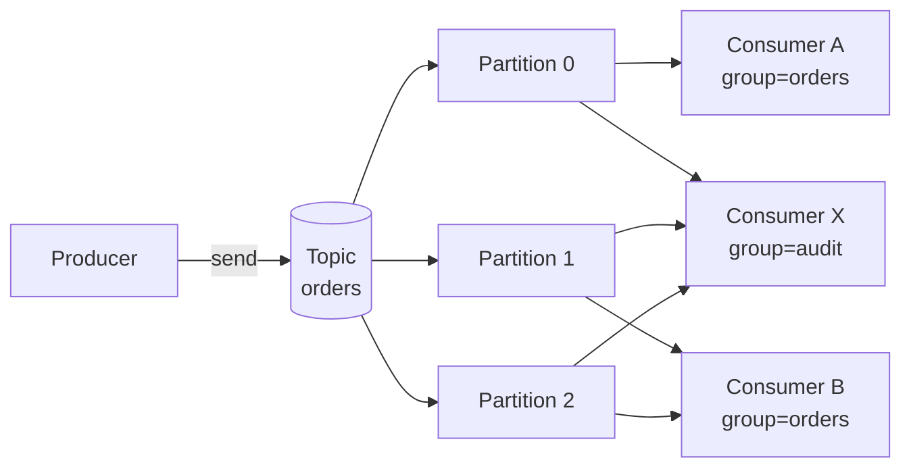
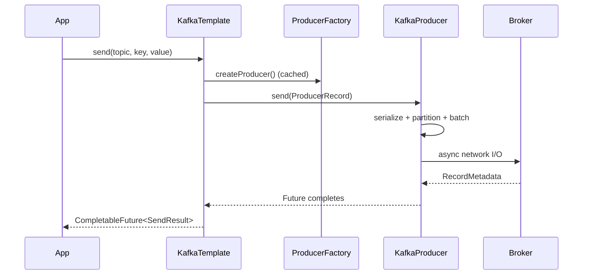
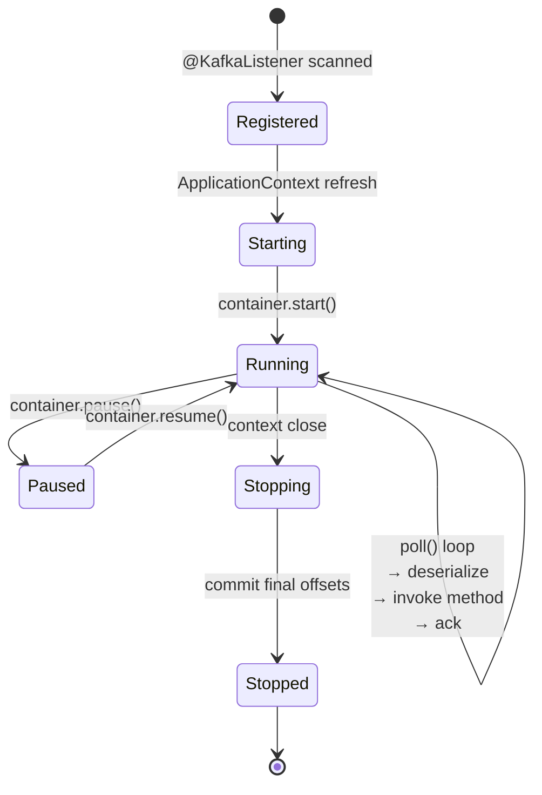

# Spring for Apache Kafka (`spring-kafka`)

_Date: 2026-04-17_ · _Tags: kafka, spring-kafka, messaging, event-driven_

## Table of Contents

- [Summary](#summary)
- [Kafka Basics Recap](#kafka-basics-recap)
- [Dependency](#dependency)
- [Producer: `KafkaTemplate`](#producer-kafkatemplate)
- [Consumer: `@KafkaListener`](#consumer-kafkalistener)
- [Listener Signatures](#listener-signatures)
- [Configuration (`application.yml`)](#configuration-applicationyml)
- [Serialization](#serialization)
- [Acknowledgment Modes](#acknowledgment-modes)
- [Containers and Concurrency](#containers-and-concurrency)
- [Error Handling](#error-handling)
- [Transactions](#transactions)
- [Exactly-Once Semantics](#exactly-once-semantics)
- [Testing](#testing)
- [`KafkaAdmin` — Topic Creation](#kafkaadmin--topic-creation)
- [Batch Listener Mode](#batch-listener-mode)
- [Comparison with `reactor-kafka`](#comparison-with-reactor-kafka)
- [Common Pitfalls](#common-pitfalls)
- [Related](#related)
- [References](#references)

---

## Summary

**Spring for Apache Kafka** (`spring-kafka`) wraps the official `KafkaProducer` /
`KafkaConsumer` clients with Spring idioms: `@KafkaListener` annotation-driven
consumers, the `KafkaTemplate` producer, and deep Spring Boot auto-configuration.

It follows the **blocking / thread-per-consumer** model and is the most common
choice in traditional Spring MVC applications. If you're on WebFlux or need
native backpressure, see the sibling [`reactive-kafka.md`](./reactive-kafka.md)
(which wraps `reactor-kafka`).

Key characteristics:

- Annotation-first: `@KafkaListener` on methods registers consumer containers
- `KafkaTemplate<K,V>` for sending (returns `CompletableFuture`)
- Configuration via `application.yml` under `spring.kafka.*`
- Threaded consumer containers — concurrency is controlled per listener
- Rich error-handling, retry, DLT, and transaction integration

---

## Kafka Basics Recap

Brief refresher (see official Apache Kafka docs for full treatment):

- **Broker** — server holding topic partitions
- **Topic** — append-only log, partitioned
- **Partition** — ordered, immutable sequence of records; unit of parallelism
- **Offset** — monotonic position inside a partition
- **Consumer group** — each partition is consumed by exactly one member; adding
  members scales horizontally up to the partition count
- **Key** — optional; same key → same partition (ordering preserved per key)



Two groups (`orders`, `audit`) each receive the full stream. Within a group,
partitions are divided among members.

---

## Dependency

Use **`spring-kafka`** — NOT `reactor-kafka`:

```xml
<dependency>
  <groupId>org.springframework.kafka</groupId>
  <artifactId>spring-kafka</artifactId>
</dependency>
```

Gradle:

```groovy
implementation 'org.springframework.kafka:spring-kafka'
```

Spring Boot's starter parent manages the version and auto-configures
`KafkaTemplate`, `ProducerFactory`, `ConsumerFactory`, and listener container
factories from `spring.kafka.*` properties.

For testing:

```xml
<dependency>
  <groupId>org.springframework.kafka</groupId>
  <artifactId>spring-kafka-test</artifactId>
  <scope>test</scope>
</dependency>
```

---

## Producer: `KafkaTemplate`

```java
@Service
@RequiredArgsConstructor
@Slf4j
public class OrderProducer {

    private final KafkaTemplate<String, Order> kafkaTemplate;

    public void publish(Order order) {
        kafkaTemplate.send("orders", order.getId().toString(), order)
            .whenComplete((result, ex) -> {
                if (ex != null) {
                    log.error("send failed", ex);
                } else {
                    log.info("sent to partition {} offset {}",
                        result.getRecordMetadata().partition(),
                        result.getRecordMetadata().offset());
                }
            });
    }
}
```

### Producer Flow



Notes:

- `send()` returns a `CompletableFuture<SendResult<K,V>>` (Spring Kafka 3.x).
  Older 2.x returned `ListenableFuture` — migrated in 3.0.
- The underlying `KafkaProducer` batches and sends asynchronously; call
  `.get()` only when you truly need synchronous semantics.
- Producers are **thread-safe and long-lived** — reuse the injected template.
- Configure `acks=all`, `retries`, `enable.idempotence=true` for durability.

---

## Consumer: `@KafkaListener`

```java
@Service
@Slf4j
@RequiredArgsConstructor
public class OrderListener {

    private final OrderService orderService;

    @KafkaListener(topics = "orders", groupId = "orders-processor")
    public void onOrder(ConsumerRecord<String, Order> record) {
        log.info("received {} from partition {} offset {}",
            record.value(), record.partition(), record.offset());
        orderService.process(record.value());
    }
}
```

### Listener Container Lifecycle



Each listener method is backed by a `MessageListenerContainer` that runs a
dedicated thread (or `concurrency` threads) executing the poll / process /
commit loop.

---

## Listener Signatures

`@KafkaListener` methods support flexible parameter binding via
`KafkaListenerAnnotationBeanPostProcessor`:

```java
@KafkaListener(topics = "orders", groupId = "orders-processor")
public void handle(
    @Payload Order order,
    @Header(KafkaHeaders.RECEIVED_KEY) String key,
    @Header(KafkaHeaders.RECEIVED_PARTITION) int partition,
    @Header(KafkaHeaders.OFFSET) long offset,
    @Header(KafkaHeaders.RECEIVED_TIMESTAMP) long ts,
    Acknowledgment ack,          // only with MANUAL ack-mode
    Consumer<?, ?> consumer      // raw Kafka consumer (careful!)
) {
    try {
        process(order);
        ack.acknowledge();
    } catch (Exception e) {
        // nack or rethrow to trigger error handler
        throw e;
    }
}
```

Supported parameter types:

| Parameter                                        | Purpose                             |
| ------------------------------------------------ | ----------------------------------- |
| `@Payload T value`                               | Deserialized value only             |
| `@Header(KafkaHeaders.RECEIVED_KEY) K key`       | Message key                         |
| `@Header(KafkaHeaders.RECEIVED_PARTITION) int`   | Partition number                    |
| `@Header(KafkaHeaders.OFFSET) long`              | Offset                              |
| `@Header(KafkaHeaders.RECEIVED_TIMESTAMP) long`  | Record timestamp                    |
| `@Headers Map<String, Object>`                   | All headers                         |
| `ConsumerRecord<K,V>`                            | Full raw record                     |
| `Acknowledgment`                                 | Manual ack (requires manual mode)   |
| `Consumer<K,V>`                                  | Underlying Kafka consumer           |

---

## Configuration (`application.yml`)

```yaml
spring:
  kafka:
    bootstrap-servers: localhost:9092

    consumer:
      group-id: orders-processor
      auto-offset-reset: earliest
      enable-auto-commit: false
      key-deserializer: org.apache.kafka.common.serialization.StringDeserializer
      value-deserializer: org.springframework.kafka.support.serializer.JsonDeserializer
      properties:
        spring.json.trusted.packages: com.example.*
        spring.json.value.default.type: com.example.orders.Order
        isolation.level: read_committed

    producer:
      key-serializer: org.apache.kafka.common.serialization.StringSerializer
      value-serializer: org.springframework.kafka.support.serializer.JsonSerializer
      acks: all
      properties:
        enable.idempotence: true

    listener:
      ack-mode: manual       # so we can use Acknowledgment
      concurrency: 3         # threads per @KafkaListener
      missing-topics-fatal: false
```

### Key properties

- `bootstrap-servers` — comma-separated `host:port` list
- `auto-offset-reset` — `earliest` | `latest` | `none`; applied when a group
  has no committed offset
- `enable-auto-commit: false` — Spring Kafka commits via the listener container
  (recommended default)
- `isolation.level: read_committed` — skip aborted transactional records
- `listener.ack-mode` — see below

---

## Serialization

Two primary patterns:

### POJO via `JsonSerializer` / `JsonDeserializer`

```yaml
spring.kafka.producer.value-serializer: org.springframework.kafka.support.serializer.JsonSerializer
spring.kafka.consumer.value-deserializer: org.springframework.kafka.support.serializer.JsonDeserializer
spring.kafka.consumer.properties.spring.json.trusted.packages: com.example.*
```

- **`trusted.packages`** is required — `JsonDeserializer` refuses to
  instantiate classes outside the allow-list to prevent deserialization
  gadget chain attacks. Use `*` only if you fully trust producers.
- Type info can travel in headers (`__TypeId__`) or be fixed via
  `spring.json.value.default.type`.

### Keys as `String`

Keys are typically `String` (user id, order id, tenant id). Use
`StringSerializer` / `StringDeserializer`.

### Alternatives

- **Avro** / **Protobuf** with Confluent Schema Registry — strong evolution
  guarantees, compact payloads
- **ByteArray** — push serialization concerns to the application layer

Never deserialize to polymorphic types without locking down
`trusted.packages`.

---

## Acknowledgment Modes

Configured via `spring.kafka.listener.ack-mode`:

| Mode                | Behavior                                                           | Notes                                |
| ------------------- | ------------------------------------------------------------------ | ------------------------------------ |
| `BATCH` (default)   | Commits after the whole poll batch processes successfully          | Good throughput; whole batch replays on failure |
| `RECORD`            | Commits after each record                                          | High overhead                        |
| `TIME`              | Commits when `ack-time` elapses                                    | Smooth commits                       |
| `COUNT`             | Commits after `ack-count` records                                  | -                                    |
| `COUNT_TIME`        | Either `ack-count` or `ack-time`                                   | -                                    |
| `MANUAL`            | Listener calls `ack.acknowledge()`; commit queued for next poll    | Full control                         |
| `MANUAL_IMMEDIATE`  | `ack.acknowledge()` commits synchronously                          | Stronger guarantees, higher cost     |

```java
@KafkaListener(topics = "orders", groupId = "orders-processor",
               containerFactory = "manualAckFactory")
public void handle(Order order, Acknowledgment ack) {
    process(order);
    ack.acknowledge();
}
```

With `MANUAL` modes you **must** call `acknowledge()` or offsets won't
advance and the same records will be re-delivered after rebalancing.

---

## Containers and Concurrency

The `ConcurrentKafkaListenerContainerFactory` creates containers that can
run multiple consumer threads:

```java
@Bean
public ConcurrentKafkaListenerContainerFactory<String, Order> kafkaListenerContainerFactory(
        ConsumerFactory<String, Order> cf) {
    var factory = new ConcurrentKafkaListenerContainerFactory<String, Order>();
    factory.setConsumerFactory(cf);
    factory.setConcurrency(3);
    factory.getContainerProperties().setAckMode(AckMode.MANUAL);
    return factory;
}
```

### Concurrency rules

- `concurrency = N` → N consumer threads, each with its own `KafkaConsumer`
- **Each thread owns disjoint partitions** — threads never share a partition
- If `partitions < concurrency`, extra threads sit idle
- Scale concurrency ≤ partition count; scale partitions if you need more
  throughput

---

## Error Handling

### `DefaultErrorHandler`

Handles retries + routing to a **Dead-Letter Topic** (DLT):

```java
@Bean
public DefaultErrorHandler errorHandler(KafkaTemplate<Object, Object> template) {
    var recoverer = new DeadLetterPublishingRecoverer(template);
    var backoff = new FixedBackOff(1000L, 3L); // 3 retries, 1s apart
    return new DefaultErrorHandler(recoverer, backoff);
}
```

After retries exhaust, the record is published to `<topic>.DLT` by default.

### `@RetryableTopic` (Spring Kafka 2.7+)

Declarative non-blocking retries with **separate topics per attempt** — the
container keeps processing new records while retries wait on their own
topics:

```java
@RetryableTopic(
    attempts = "3",
    backoff = @Backoff(delay = 1000, multiplier = 2),
    dltStrategy = DltStrategy.FAIL_ON_ERROR,
    autoCreateTopics = "true"
)
@KafkaListener(topics = "orders", groupId = "g1")
public void handle(Order order) {
    orderService.process(order);
}

@DltHandler
public void handleDlt(Order order,
                      @Header(KafkaHeaders.ORIGINAL_TOPIC) String topic,
                      @Header(KafkaHeaders.EXCEPTION_MESSAGE) String err) {
    log.error("DLT: {} from {} reason={}", order, topic, err);
}
```

Creates `orders-retry-0`, `orders-retry-1`, `orders-retry-2`, `orders-dlt`
topics. Retries do not block the main listener partition.

### Classified exception handling

```java
errorHandler.addNotRetryableExceptions(ValidationException.class);
errorHandler.addRetryableExceptions(TransientDbException.class);
```

Non-retryable exceptions go straight to the DLT.

---

## Transactions

To atomically combine publishing with DB updates:

```yaml
spring:
  kafka:
    producer:
      transaction-id-prefix: tx-orders-
      properties:
        enable.idempotence: true
```

```java
@Bean
public KafkaTransactionManager<?, ?> kafkaTxManager(ProducerFactory<?, ?> pf) {
    return new KafkaTransactionManager<>(pf);
}

@Service
public class OrderService {
    @Transactional("kafkaTxManager")
    public void handle(Command cmd) {
        repo.save(toEntity(cmd));      // DB update
        kafkaTemplate.send("events", cmd.id(), toEvent(cmd)); // produced in tx
    }
}
```

For Kafka + JDBC in one logical transaction, use
`ChainedKafkaTransactionManager` (deprecated in newer versions in favor of
Kafka-first patterns + outbox), or the **outbox pattern** — write events to a
DB table transactionally and relay to Kafka separately.

`transaction-id-prefix` must be unique per **producer instance** (add host /
pod id if running multiple replicas) to avoid zombie-producer fencing issues.

---

## Exactly-Once Semantics

Exactly-once end-to-end requires:

1. **Producer**: `enable.idempotence=true` + transactions
   (`transaction-id-prefix`) so publishing is atomic and deduplicated
2. **Consumer**: `isolation.level=read_committed` so it only reads committed
   records, never aborted ones
3. **Processor**: the consume-transform-produce loop runs inside a Kafka
   transaction (`KafkaTransactionManager`)
4. Downstream writes (e.g. DB) must be idempotent or part of the same
   transactional boundary (outbox)

Read the Confluent "exactly-once semantics" documentation before relying
on this in production — it's not free.

---

## Testing

### Unit tests — `@EmbeddedKafka`

```java
@SpringBootTest
@EmbeddedKafka(partitions = 1, topics = {"orders"})
class OrderListenerTest {

    @Autowired KafkaTemplate<String, Order> template;
    @Autowired OrderService service;

    @Test
    void receives_order() {
        template.send("orders", "1", new Order("1", 100));
        await().untilAsserted(() ->
            assertThat(service.processed()).contains("1"));
    }
}
```

Fast in-JVM broker, great for focused tests.

### Integration tests — Testcontainers

```java
@Testcontainers
@SpringBootTest
class OrderIntegrationTest {
    @Container
    static KafkaContainer kafka = new KafkaContainer(
        DockerImageName.parse("confluentinc/cp-kafka:7.5.0"));

    @DynamicPropertySource
    static void props(DynamicPropertyRegistry r) {
        r.add("spring.kafka.bootstrap-servers", kafka::getBootstrapServers);
    }
}
```

Real broker → realistic behavior (rebalances, transactions, retention).

---

## `KafkaAdmin` — Topic Creation

Boot auto-configures `KafkaAdmin`. Declare `NewTopic` beans for
programmatic creation on startup:

```java
@Configuration
public class TopicConfig {
    @Bean
    public NewTopic ordersTopic() {
        return TopicBuilder.name("orders")
            .partitions(6)
            .replicas(3)
            .config(TopicConfig.RETENTION_MS_CONFIG, "604800000")
            .build();
    }

    @Bean
    public NewTopic ordersDlt() {
        return TopicBuilder.name("orders.DLT").partitions(1).replicas(3).build();
    }
}
```

For production, prefer infra-as-code (Terraform, Strimzi KafkaTopic CRs) —
application-managed topic creation is fine in dev.

---

## Batch Listener Mode

Process a whole poll batch in one invocation:

```java
@KafkaListener(topics = "events", groupId = "bulk", batch = "true")
public void onBatch(List<ConsumerRecord<String, Event>> records,
                    Acknowledgment ack) {
    repo.saveAll(records.stream().map(r -> toEntity(r.value())).toList());
    ack.acknowledge();
}
```

Enable on the container factory:

```java
factory.setBatchListener(true);
```

Good for high-throughput DB inserts where per-record overhead dominates.

---

## Comparison with `reactor-kafka`

| Dimension            | `spring-kafka`                               | `reactor-kafka`                              |
| -------------------- | -------------------------------------------- | -------------------------------------------- |
| Programming style    | Annotation-driven, blocking                  | `Flux`-based reactive                        |
| Learning curve       | Low — familiar Spring idioms                 | Medium — requires Reactor fluency            |
| Backpressure         | Container-level (`max.poll.records`, pause)  | Natural, request-driven                      |
| Thread model         | Thread per consumer (configurable pool)      | Event-loop, few threads, non-blocking        |
| Ecosystem maturity   | Larger — DLT, retry, transactions, tooling   | Smaller, but growing                         |
| Best fit             | Spring MVC, traditional services             | WebFlux, fully reactive stacks               |
| Error handling       | `DefaultErrorHandler`, `@RetryableTopic`     | Operator-based (`retryWhen`, `onErrorResume`) |
| Blocking calls       | Fine (dedicated thread per partition)        | Must `publishOn` + schedule carefully        |

If the rest of the service is blocking (JDBC, REST templates, blocking
clients), **stay on `spring-kafka`** — switching to reactor-kafka in
isolation doesn't buy anything and complicates debugging. See
[`reactive-kafka.md`](./reactive-kafka.md) for the reactive side.

---

## Common Pitfalls

- **Missing `trusted.packages`** — `JsonDeserializer` throws
  `IllegalArgumentException: The class '...' is not in the trusted packages`.
  Set `spring.json.trusted.packages` explicitly.
- **`ack-mode: batch` combined with `ack.acknowledge()`** — the manual ack
  call is silently ignored because the container commits on its own schedule.
  Use `manual` / `manual_immediate` if you want manual control.
- **Concurrency > partitions** — excess threads sit idle forever after the
  initial rebalance. Match concurrency to partition count and scale partitions
  up when you need more parallelism.
- **No DLT configured** — poison messages cause infinite retry loops,
  stalling the partition. Always configure `DefaultErrorHandler` with a DLT
  recoverer or use `@RetryableTopic`.
- **Missing `auto-offset-reset`** — a brand-new consumer group defaults to
  `latest` and silently skips historical messages. Set `earliest` explicitly
  for replay use cases.
- **Using `@Transactional` without `KafkaTransactionManager`** — the Kafka
  send isn't enrolled in the transaction and partial failures become
  possible. Either configure the transaction manager or switch to the
  outbox pattern.
- **Long-running handlers** — blocking for longer than
  `max.poll.interval.ms` causes the consumer to be kicked out of the group,
  triggering a rebalance. Offload long work or tune the limit.
- **Shared mutable state across threads** — container concurrency means
  multiple threads invoke the same listener bean. Listener methods must be
  thread-safe or stateless.
- **Forgetting `enable.idempotence=true`** on the producer — required for
  transactional producers and for duplicate-free retries.

---

## Related

- [`reactive-kafka.md`](./reactive-kafka.md) — Reactor Kafka / reactive sibling
- [`event-driven-patterns.md`](./event-driven-patterns.md) — outbox, CDC, saga
- [`../events-async/application-events.md`](../events-async/application-events.md) — in-process events, compared with Kafka
- [`../spring-fundamentals.md`](../spring-fundamentals.md) — Spring container & DI basics

---

## References

- Spring for Apache Kafka reference: <https://docs.spring.io/spring-kafka/reference/>
- Apache Kafka documentation: <https://kafka.apache.org/documentation/>
- Confluent Spring Kafka guide: <https://developer.confluent.io/courses/spring/>
- `@RetryableTopic`: <https://docs.spring.io/spring-kafka/reference/retrytopic.html>
- Transactions & exactly-once: <https://docs.spring.io/spring-kafka/reference/kafka/transactions.html>
- Testing with `@EmbeddedKafka`: <https://docs.spring.io/spring-kafka/reference/testing.html>
- Testcontainers Kafka module: <https://java.testcontainers.org/modules/kafka/>
