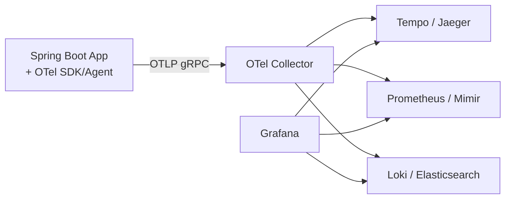

# Distributed Tracing and Metrics Beyond Logs — OpenTelemetry, Micrometer, Prometheus

**Date:** 2026-04-19 | **Updated:** 2026-04-19
**Tags:** `observability` `opentelemetry` `micrometer` `prometheus` `tracing` `java`

## Table of Contents

- [Summary](#summary)
- [Three Pillars and Why Logs Alone Fail](#three-pillars-and-why-logs-alone-fail)
- [OpenTelemetry — The Standard](#opentelemetry--the-standard)
- [W3C Trace Context Propagation](#w3c-trace-context-propagation)
- [Instrumenting a Spring Boot Service](#instrumenting-a-spring-boot-service)
- [Micrometer and Prometheus](#micrometer-and-prometheus)
- [RED and USE Methods](#red-and-use-methods)
- [Sampling Strategies](#sampling-strategies)
- [Correlating Logs, Traces, and Metrics](#correlating-logs-traces-and-metrics)
- [Dashboards That Answer Real Questions](#dashboards-that-answer-real-questions)
- [Related](#related)
- [References](#references)

---

## Summary

Logs tell you *what* happened on one server; they don't tell you the shape of a request that crosses 10 services, or whether p99 latency is drifting, or why your pod is using 3x its memory limit. Modern observability rests on three pillars — **logs, metrics, traces** — joined by a shared `trace_id` so one incident can be investigated from any angle. [OpenTelemetry](https://opentelemetry.io/) is the vendor-neutral standard for emitting all three; [Micrometer](https://micrometer.io/) is Spring's idiomatic metrics facade; [Prometheus](https://prometheus.io/) + [Grafana](https://grafana.com/) is the open-source stack most teams land on. The two measurement frameworks worth memorizing are **RED** (Rate, Errors, Duration — for request-serving services) and **USE** (Utilization, Saturation, Errors — for resources). This doc covers how to wire all of it into a Spring Boot app.

---

## Three Pillars and Why Logs Alone Fail

| Pillar | What it answers | Cost | Cardinality |
|--------|------------------|------|-------------|
| Logs | "What did this one request do?" | High (bytes per event) | Unlimited |
| Metrics | "What's the aggregate behavior over time?" | Low (time-series) | Bounded |
| Traces | "How did this request flow across services?" | Medium | Per request |

Log-only debugging breaks at scale: you can't grep 100 million log lines per hour, and without a shared `trace_id` you can't stitch a distributed request together. Metrics can't tell you *why* p99 spiked at 14:23:04, only *that* it did. Traces fill that gap. Ship all three.

---

## OpenTelemetry — The Standard

[OpenTelemetry](https://opentelemetry.io/docs/specs/otel/) (OTel) is a CNCF project defining APIs, SDKs, and a wire protocol ([OTLP](https://opentelemetry.io/docs/specs/otlp/)) for observability data. It replaces the old OpenTracing and OpenCensus projects. Key properties:

- **Vendor-neutral**: the same instrumented app can ship to Jaeger, Tempo, Honeycomb, Datadog, New Relic — just change the collector config.
- **Auto-instrumentation**: the [Java agent](https://github.com/open-telemetry/opentelemetry-java-instrumentation) adds tracing to Spring, JDBC, Kafka, gRPC, HTTP clients, etc. without code changes.
- **Unified signals**: traces, metrics, logs share the same resource attributes, so one pod's signals correlate automatically.

Architecture:



The **collector** is a stateless pipeline that receives OTLP data, batches it, and forwards it to the right backend. Always run a collector as a sidecar or DaemonSet — apps shouldn't ship directly to vendor SaaS.

---

## W3C Trace Context Propagation

Cross-service tracing only works when every hop forwards the trace context. The [W3C Trace Context](https://www.w3.org/TR/trace-context/) spec defines two HTTP headers every modern framework understands:

```text
traceparent: 00-<trace_id>-<span_id>-<flags>
tracestate:  <vendor-specific key=value>
```

- `trace_id` — 16 bytes hex, shared across the whole request.
- `span_id` — 8 bytes hex, unique per hop.
- `flags` — sampling decision (bit 0 = sampled).

Legacy formats: B3 (Zipkin), Jaeger. OTel supports all of them; configure a `propagator` list. Default to W3C for new services.

---

## Instrumenting a Spring Boot Service

Three options, increasing in control:

**Option 1 — Java agent (zero code):**

```bash
java -javaagent:opentelemetry-javaagent.jar \
     -Dotel.service.name=orders-service \
     -Dotel.exporter.otlp.endpoint=http://otel-collector:4317 \
     -jar app.jar
```

Covers Spring MVC, WebFlux, JDBC, Kafka, Redis, HTTP clients automatically. 95% of services need nothing else.

**Option 2 — Micrometer Tracing (Spring-native):**

```gradle
implementation 'org.springframework.boot:spring-boot-starter-actuator'
implementation 'io.micrometer:micrometer-tracing-bridge-otel'
implementation 'io.opentelemetry:opentelemetry-exporter-otlp'
```

`application.yaml`:

```yaml
management:
  tracing:
    sampling:
      probability: 0.1           # sample 10% by default
  otlp:
    tracing:
      endpoint: http://otel-collector:4317
```

[Micrometer Tracing](https://docs.micrometer.io/tracing/reference/) wraps OTel and integrates with Spring's `@Observed` annotation, `RestClient`, `WebClient`, and `@Transactional`.

**Option 3 — Manual spans:**

```java
@Service
@RequiredArgsConstructor
public class OrderService {
    private final Tracer tracer;   // Micrometer or OTel

    public Order place(Cmd cmd) {
        Span span = tracer.nextSpan().name("OrderService.place").start();
        try (var scope = tracer.withSpan(span)) {
            span.tag("order.id", cmd.orderId());
            return doPlace(cmd);
        } catch (Exception e) {
            span.error(e);
            throw e;
        } finally {
            span.end();
        }
    }
}
```

Reserve manual spans for business-meaningful boundaries the auto-instrumentation doesn't cover.

---

## Micrometer and Prometheus

Micrometer is Spring's metrics facade — vendor-neutral like SLF4J. Out of the box, Spring Boot Actuator publishes JVM, HTTP server, JDBC pool, and Kafka metrics to any registered registry.

Add the Prometheus endpoint:

```gradle
implementation 'io.micrometer:micrometer-registry-prometheus'
```

```yaml
management:
  endpoints:
    web:
      exposure:
        include: health, info, prometheus, metrics
  metrics:
    distribution:
      percentiles-histogram:
        http.server.requests: true   # enable histograms for p95/p99
      percentiles:
        http.server.requests: 0.5, 0.95, 0.99
```

Prometheus scrape config:

```yaml
scrape_configs:
  - job_name: 'spring-boot'
    metrics_path: '/actuator/prometheus'
    kubernetes_sd_configs:
      - role: pod
    relabel_configs:
      - source_labels: [__meta_kubernetes_pod_annotation_prometheus_io_scrape]
        action: keep
        regex: true
```

Custom metrics:

```java
@Service
@RequiredArgsConstructor
public class OrderService {
    private final MeterRegistry registry;

    private Counter placed(String result) {
        return Counter.builder("orders.placed")
            .tag("result", result)
            .description("Orders placed")
            .register(registry);
    }

    public Order place(Cmd cmd) {
        Timer.Sample sample = Timer.start(registry);
        try {
            Order o = doPlace(cmd);
            placed("success").increment();
            return o;
        } catch (Exception e) {
            placed("failure").increment();
            throw e;
        } finally {
            sample.stop(registry.timer("orders.place.duration"));
        }
    }
}
```

Rule: **tag cardinality is finite**. Never tag with user ID, order ID, or anything unbounded — that's what traces are for. Tags are for dimensions you will query by (`result`, `region`, `tier`), typically < 100 unique values each.

---

## RED and USE Methods

Two measurement frameworks cover 95% of dashboards.

**RED** (Weaveworks) — for request-driven services:

- **Rate** — requests/sec.
- **Errors** — errors/sec or error %.
- **Duration** — p50/p95/p99 latency.

**USE** (Brendan Gregg) — for resources (CPU, memory, DB pool, queue):

- **Utilization** — % busy.
- **Saturation** — queued or waiting amount.
- **Errors** — error count.

Apply RED to every service and endpoint. Apply USE to every pool (HikariCP, thread pool, Kafka consumer lag). Between them, you cover "is the service healthy?" and "is a resource the bottleneck?" — the two questions every on-call engineer asks.

---

## Sampling Strategies

Tracing 100% of production requests is expensive. Three strategies:

1. **Head-based probabilistic** — decide at ingress (e.g., sample 1%). Simple, but rare errors get missed.
2. **Tail-based** — collect all spans, decide after the trace completes. Keeps errors and slow requests. Requires a collector with buffering ([OpenTelemetry tail sampling processor](https://github.com/open-telemetry/opentelemetry-collector-contrib/tree/main/processor/tailsamplingprocessor)).
3. **Parent-based** — the ingress decides; downstream hops honor the upstream choice. Default in most SDKs.

Typical prod config: 1% head-based + tail-based override for error or p99 > threshold. Dev: 100%.

---

## Correlating Logs, Traces, and Metrics

A shared `trace_id` makes all three navigable from one incident. Wire MDC into your log pattern:

```xml
<pattern>%d{ISO8601} [%thread] %-5level [%X{traceId:-},%X{spanId:-}] %logger{36} - %msg%n</pattern>
```

Micrometer Tracing injects `traceId`/`spanId` into MDC automatically for Spring MVC. For reactive (WebFlux), use [Context Propagation](https://docs.micrometer.io/context-propagation/reference/) to carry MDC across scheduler boundaries — see [reactive-observability.md](../reactive-observability.md).

In Grafana, a panel with logs and a panel with traces linked by `trace_id` is the single most useful debug view you can build. Loki + Tempo + Prometheus all share the label and let you pivot between them with one click.

---

## Dashboards That Answer Real Questions

Bad dashboard: 40 graphs arranged alphabetically. Good dashboard answers a specific question at a glance:

- **Service health** — RED per endpoint, error budget burn rate, p99 over time.
- **Capacity** — USE per pool (JDBC, HTTP clients, Kafka consumer lag).
- **JVM** — heap used, GC pause duration, allocation rate, thread count. See [jvm-gc/pause-diagnosis.md](../jvm-gc/pause-diagnosis.md).
- **Business KPIs** — orders/sec, payment success rate, user signups.

One dashboard per audience: engineers get JVM+RED, on-call gets errors+saturation, leadership gets business KPIs. Never mix them.

Alert on **symptoms, not causes**. "p99 > 500ms" is actionable; "CPU > 80%" alone usually isn't.

---

## Related

- [Reactive Observability — Tracing, Logging, Metrics, and Health in Spring WebFlux](../reactive-observability.md) — reactive-specific context propagation.
- [Logging in Java and Spring Boot](../logging.md) — MDC, structured JSON logs, the log pillar.
- [Actuator Deep Dive](../actuator-deep-dive.md) — the Spring mechanism exposing Prometheus and health.
- [GC Pause Diagnosis Playbook](../jvm-gc/pause-diagnosis.md) — JFR plus Micrometer GC metrics.
- [Kubernetes for Spring Boot](../configurations/kubernetes-spring-boot.md) — probes and ServiceMonitor for Prometheus.
- [Federated GraphQL with Polyglot Persistence](../graphql/multi-database-patterns.md) — distributed tracing across subgraphs.

---

## References

- [OpenTelemetry documentation](https://opentelemetry.io/docs/)
- [OpenTelemetry Java Instrumentation](https://github.com/open-telemetry/opentelemetry-java-instrumentation) — auto-instrumentation agent.
- [W3C Trace Context specification](https://www.w3.org/TR/trace-context/)
- [Micrometer documentation](https://docs.micrometer.io/micrometer/reference/)
- [Micrometer Tracing](https://docs.micrometer.io/tracing/reference/)
- [Prometheus documentation](https://prometheus.io/docs/)
- [Grafana Tempo](https://grafana.com/docs/tempo/latest/) — distributed tracing backend.
- [Brendan Gregg — USE Method](https://www.brendangregg.com/usemethod.html)
- [Tom Wilkie — RED Method](https://www.weave.works/blog/the-red-method-key-metrics-for-microservices-architecture/)
- [Google SRE Book — Monitoring Distributed Systems](https://sre.google/sre-book/monitoring-distributed-systems/)
