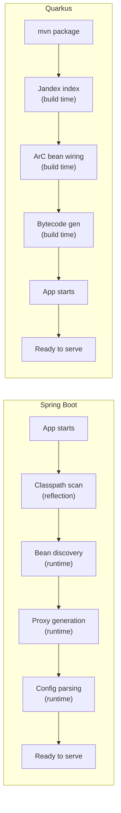

# Quarkus Overview — Supersonic Subatomic Java for Cloud-Native

**Date:** 2026-04-19 | **Updated:** 2026-04-19
**Tags:** `quarkus` `microservices` `java` `cloud-native` `graalvm`

## Table of Contents

- [Summary](#summary)
- [What Is Quarkus](#what-is-quarkus)
- [Build-Time vs Runtime — The Key Insight](#build-time-vs-runtime--the-key-insight)
- [Dev Mode](#dev-mode)
- [Configuration](#configuration)
- [Extension Model](#extension-model)
- [Framework Comparison](#framework-comparison)
- [When to Choose Quarkus](#when-to-choose-quarkus)
- [When NOT to Choose Quarkus](#when-not-to-choose-quarkus)
- [Getting Started](#getting-started)
- [Related](#related)
- [References](#references)

---

## Summary

[Quarkus](https://quarkus.io/) is Red Hat's open-source, Kubernetes-native Java framework optimized for fast startup, low memory footprint, and GraalVM native images. Its defining architectural choice is **build-time processing**: CDI bean wiring, configuration parsing, and annotation scanning happen at build time (not application startup), producing pre-baked bytecode that starts in milliseconds. Quarkus uses standards-based APIs (JAX-RS, CDI, JPA) and offers both imperative and reactive programming models, with [Mutiny](https://smallrye.io/smallrye-mutiny/) as its reactive library and [Vert.x](https://vertx.io/) as its underlying I/O engine.

---

## What Is Quarkus

Quarkus (Latin "quark" — subatomic particle, hence "subatomic Java") was created by Red Hat in 2019 to solve a specific problem: **Java was too slow and too heavy for containers and serverless**. Traditional frameworks like Spring Boot perform extensive work at startup — component scanning, proxy generation, config parsing — all via runtime reflection. Quarkus moves this work to build time.

Key characteristics:

- **Build-time DI** — [ArC](https://quarkus.io/guides/cdi-reference), Quarkus's CDI implementation, resolves beans, validates injection points, and generates wiring bytecode at build time
- **Dev mode** — `quarkus dev` provides live reload with ~1s turnaround, background compilation, and dev UI
- **Standards-based** — Jakarta CDI, JAX-RS, JPA, MicroProfile — familiar APIs, not proprietary ones
- **Dual-stack** — imperative (blocking) and reactive (Mutiny/Vert.x) in the same application
- **Native-image-first** — designed from day one for GraalVM native compilation
- **Extension ecosystem** — 600+ extensions via [Quarkiverse](https://github.com/quarkiverse)
- **Backed by Red Hat** — commercial support, enterprise customers, large contributor base

---

## Build-Time vs Runtime — The Key Insight



### How It Works

1. **[Jandex](https://github.com/smallrye/jandex)** — indexes all classes and annotations at build time, creating an in-memory annotation database. No runtime classpath scanning needed.
2. **[ArC](https://quarkus.io/guides/cdi-reference)** — Quarkus's CDI container reads the Jandex index, resolves all injection points, validates dependencies, and generates bytecode for bean instantiation. At runtime, ArC just executes pre-generated code — no reflection.
3. **[Gizmo](https://github.com/quarkusio/gizmo)** — bytecode generation library that ArC and extensions use to produce optimized `.class` files.
4. **Configuration** — parsed and validated at build time. Invalid config fails the build, not the deploy.

### What This Means in Practice

| Aspect | Spring Boot | Quarkus |
|--------|------------|---------|
| Bean validation | Runtime (`AmbiguousResolutionException` on startup) | Build time (compile error) |
| Missing `@Inject` | NPE at runtime | Build failure |
| Config errors | Startup crash | Build failure |
| Classpath scanning | Every startup | Once at build |
| Proxy generation | Every startup (CGLIB/JDK) | Once at build (Gizmo bytecode) |
| Startup time | 1.5–3s (JVM) | 0.8–1.2s (JVM), 0.02–0.05s (native) |

The tradeoff: **slower builds, faster runtime**. A Quarkus build takes longer than a plain `javac` because it's doing work that Spring Boot defers to startup. But the resulting artifact starts faster, uses less memory, and fails earlier on misconfiguration.

---

## Dev Mode

```bash
mvn quarkus:dev
# or
quarkus dev
```

Dev mode provides:

- **Live reload** — save a file, the next HTTP request triggers recompilation and hot-swap (~1s). No restart needed.
- **Dev UI** — accessible at `http://localhost:8080/q/dev-ui`, shows registered beans, config, extensions, endpoints, and allows runtime interaction.
- **Continuous testing** — tests run automatically in the background as you edit code.
- **Dev services** — Testcontainers-based services (PostgreSQL, Kafka, Redis, etc.) start automatically when a datasource is configured but no URL is provided.

This dev experience is often cited as Quarkus's strongest differentiator versus Spring Boot's slower restart cycle.

---

## Configuration

Quarkus uses [SmallRye Config](https://smallrye.io/smallrye-config/) (a MicroProfile Config implementation) with `application.properties` as the default:

```properties
# application.properties
quarkus.http.port=8080
quarkus.datasource.db-kind=postgresql
quarkus.datasource.jdbc.url=jdbc:postgresql://localhost:5432/mydb
quarkus.datasource.username=app
quarkus.datasource.password=${DB_PASSWORD}

# Profile-specific (dev, test, prod)
%dev.quarkus.datasource.jdbc.url=jdbc:postgresql://localhost:5432/devdb
%test.quarkus.datasource.jdbc.url=jdbc:postgresql://localhost:5432/testdb
```

### Injection

```java
import org.eclipse.microprofile.config.inject.ConfigProperty;
import jakarta.inject.Inject;

@ApplicationScoped
public class GreetingService {

    @Inject
    @ConfigProperty(name = "greeting.message", defaultValue = "Hello")
    String message;
}
```

### Profiles

Quarkus uses `%profile.` prefix (vs Spring's `application-{profile}.properties` files):

- `%dev.` — active in dev mode
- `%test.` — active during testing
- `%prod.` — active by default in production
- Custom: `-Dquarkus.profile=staging`

---

## Extension Model

Everything in Quarkus is an extension — even core features like REST and CDI. Extensions participate in the build-time processing pipeline:

```bash
# List available extensions
quarkus extension list

# Add an extension
quarkus extension add hibernate-orm-panache
quarkus extension add rest-jackson
quarkus extension add smallrye-health
```

Key extension categories:

| Category | Extensions |
|----------|-----------|
| **Web** | RESTEasy Reactive, REST Jackson, Qute (templating) |
| **Data** | Hibernate ORM Panache, Hibernate Reactive, Flyway, Liquibase |
| **Messaging** | SmallRye Reactive Messaging, Kafka, AMQP |
| **Observability** | SmallRye Health, Micrometer, OpenTelemetry |
| **Security** | OIDC, JWT, Keycloak |
| **Cloud** | Kubernetes, AWS Lambda, Azure Functions, Google Cloud Functions |
| **Testing** | JUnit 5, REST Assured, Testcontainers |

[Quarkiverse](https://github.com/quarkiverse) hosts 200+ community extensions beyond the core set.

---

## Framework Comparison

### Startup and Memory

| Framework | JVM Startup | Native Startup | JVM Memory | Native Memory |
|-----------|------------|---------------|------------|---------------|
| **Quarkus** | ~0.8–1.2s | ~0.02–0.05s | ~80–130 MB | ~30–50 MB |
| **Spring Boot** | ~1.5–3s | ~0.1s | ~150–250 MB | ~50–80 MB |
| **Helidon SE** | ~0.6s | ~0.06s | ~70 MB | ~34 MB |
| **Micronaut** | ~0.5–0.7s | ~0.02–0.05s | ~70–100 MB | ~30–50 MB |

### Architecture

| Aspect | Spring Boot | Quarkus | Helidon |
|--------|------------|---------|---------|
| **DI processing** | Runtime (reflection) | Build-time (ArC/Jandex) | Runtime CDI (MP) / None (SE) |
| **I/O engine** | Tomcat/Jetty/Netty | Vert.x | Nima (virtual threads) |
| **Reactive** | WebFlux (Reactor) | RESTEasy Reactive (Mutiny) | Removed in v4 |
| **Virtual threads** | Opt-in (Tomcat adapter) | Opt-in (`@RunOnVirtualThread`) | Native (only model) |
| **Native image** | Spring AOT + GraalVM | First-class (build-time design) | Good (lean SE model) |
| **Dev experience** | Spring DevTools (restart) | `quarkus dev` (hot reload) | Manual restart |
| **Standards** | Spring-proprietary + some Jakarta | Jakarta EE + MicroProfile | MicroProfile (MP) / Custom (SE) |

### Ecosystem

| Aspect | Spring Boot | Quarkus | Helidon |
|--------|------------|---------|---------|
| **GitHub stars** | ~75k | ~14k | ~3.5k |
| **Extensions/starters** | 200+ official starters | 600+ extensions | ~50 modules |
| **Community** | Massive | Large, growing | Small |
| **Job market** | Dominant | Growing (esp. Red Hat shops) | Niche (Oracle shops) |
| **Backing** | VMware/Broadcom | Red Hat/IBM | Oracle |

---

## When to Choose Quarkus

- **Container/serverless environments** — where startup time and memory matter (Lambda, Cloud Run, Kubernetes with aggressive scaling)
- **GraalVM native images** — Quarkus's build-time architecture makes native compilation more reliable than Spring Boot's
- **Dev experience** — `quarkus dev` with live reload, dev services, and continuous testing is best-in-class
- **Standards compliance** — if your team values Jakarta EE / MicroProfile portability
- **Red Hat ecosystem** — if you're already on OpenShift, RHEL, or use Red Hat middleware
- **Reactive + imperative mix** — Quarkus handles both in the same app more naturally than Spring Boot

---

## When NOT to Choose Quarkus

- **Ecosystem breadth** — Spring Boot still has more third-party integrations, and some niche libraries only have Spring starters
- **Team expertise** — most Java developers know Spring; Quarkus has a learning curve for the build-time model and extension architecture
- **Spring-specific features** — Spring Batch, Spring Integration, Spring State Machine have no Quarkus equivalent
- **Mature tooling** — Spring Boot's IDE support (IntelliJ Spring, STS) is deeper than Quarkus's
- **Legacy migration** — migrating a large Spring Boot monolith to Quarkus is a rewrite, not a refactor

---

## Getting Started

```bash
# CLI install (macOS)
brew install quarkusio/tap/quarkus

# Create a project
quarkus create app com.example:my-app \
  --extension='rest-jackson,hibernate-orm-panache,jdbc-postgresql,smallrye-health'

# Or via Maven
mvn io.quarkus.platform:quarkus-maven-plugin:create \
  -DprojectGroupId=com.example \
  -DprojectArtifactId=my-app \
  -Dextensions='rest-jackson,hibernate-orm-panache,jdbc-postgresql'

# Run in dev mode
cd my-app
quarkus dev

# Build for production
quarkus build

# Build native image
quarkus build --native
```

---

## Related

- [Quarkus Reactive with Mutiny](quarkus-reactive-mutiny.md) — Uni, Multi, RESTEasy Reactive
- [Quarkus Native Image](quarkus-native-image.md) — GraalVM compilation, Mandrel, serverless
- [Quarkus Extensions](quarkus-extensions.md) — Panache, REST Client, Qute, Quarkiverse
- [Quarkus Virtual Threads](quarkus-virtual-threads.md) — `@RunOnVirtualThread`, three concurrency models
- [Helidon Overview](../helidon/helidon-overview.md) — Oracle's alternative, virtual-thread-native
- [Spring Fundamentals](../spring-fundamentals.md) — Spring's IoC/DI for comparison
- [GraalVM Native Image for Spring Boot](../configurations/graalvm-native-image.md) — Spring's native story for comparison

## References

- [Quarkus — Official Site](https://quarkus.io/) — guides, extensions, getting started
- [Quarkus GitHub Repository](https://github.com/quarkusio/quarkus) — source code, issues
- [ArC CDI Reference — Quarkus](https://quarkus.io/guides/cdi-reference) — build-time CDI, bean discovery, interceptors
- [SmallRye Config](https://smallrye.io/smallrye-config/) — MicroProfile Config implementation used by Quarkus
- [Quarkiverse — GitHub](https://github.com/quarkiverse) — community extension ecosystem
- [Build-Time Brilliance — The Main Thread](https://www.the-main-thread.com/p/quarkus-build-time-optimizations-performance-guide) — deep dive on Quarkus build-time architecture
- [Quarkus Fundamentals — DEV Community](https://dev.to/pierregmn/quarkus-fundamentals-n77) — overview of core concepts
