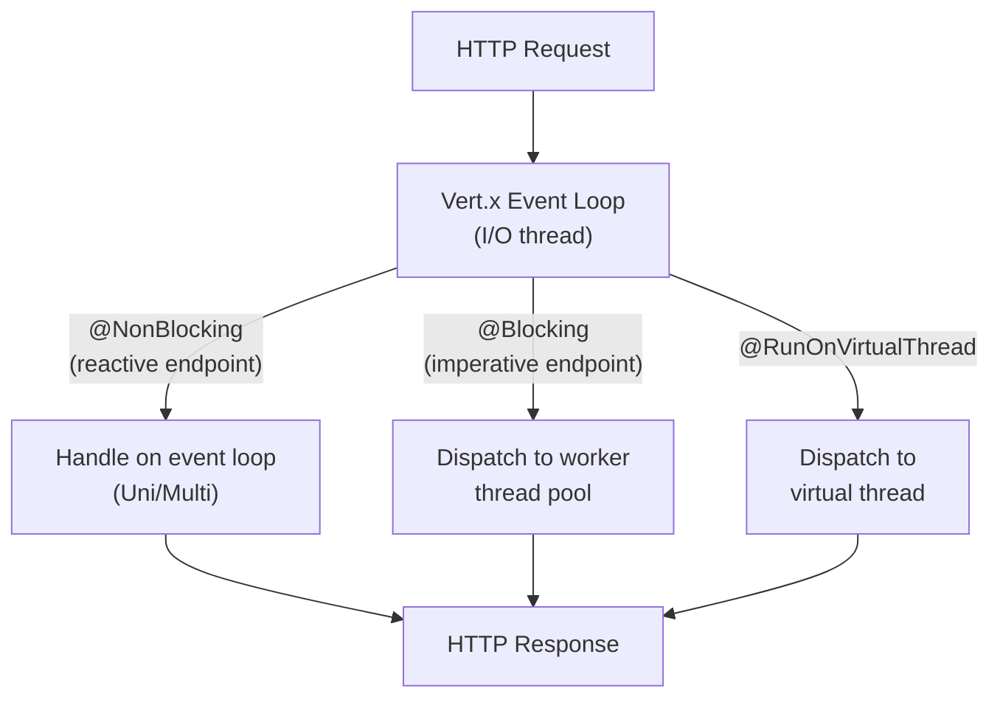

# Quarkus Reactive with Mutiny — Uni, Multi, and RESTEasy Reactive

**Date:** 2026-04-19 | **Updated:** 2026-04-19
**Tags:** `quarkus` `mutiny` `reactive` `vertx` `resteasy`

## Table of Contents

- [Summary](#summary)
- [Quarkus Reactive Architecture](#quarkus-reactive-architecture)
- [Mutiny — Uni and Multi](#mutiny--uni-and-multi)
  - [Uni — Single Value](#uni--single-value)
  - [Multi — Stream of Values](#multi--stream-of-values)
  - [Key Operators](#key-operators)
- [Mutiny vs Project Reactor](#mutiny-vs-project-reactor)
- [RESTEasy Reactive](#resteasy-reactive)
  - [Reactive Endpoints](#reactive-endpoints)
  - [Blocking vs Non-Blocking](#blocking-vs-non-blocking)
- [Reactive Data Access](#reactive-data-access)
  - [Hibernate Reactive with Panache](#hibernate-reactive-with-panache)
  - [Reactive PostgreSQL Client](#reactive-postgresql-client)
- [Reactive Messaging](#reactive-messaging)
- [Related](#related)
- [References](#references)

---

## Summary

Quarkus's reactive stack is built on [Eclipse Vert.x](https://vertx.io/) for non-blocking I/O and [SmallRye Mutiny](https://smallrye.io/smallrye-mutiny/) as the reactive programming API. Unlike Spring WebFlux (which uses Project Reactor's `Mono`/`Flux`), Quarkus uses Mutiny's `Uni<T>` (single value) and `Multi<T>` (stream). Mutiny was designed with a smaller, more discoverable API surface — fewer operators, event-driven naming (`onItem`, `onFailure`), and IDE-friendly method chains. Quarkus uniquely supports imperative, reactive, and virtual thread models in the same application.

---

## Quarkus Reactive Architecture



Quarkus uses a **small number of I/O threads** (Vert.x event loops, typically 2x CPU cores) that handle all incoming connections. What happens next depends on the endpoint type:

| Annotation | Thread | Model | When to Use |
|-----------|--------|-------|-------------|
| `@NonBlocking` (default for reactive signatures) | Event loop | Reactive (Uni/Multi) | Non-blocking I/O, high concurrency |
| `@Blocking` (default for non-reactive signatures) | Worker pool | Imperative | Blocking JDBC, file I/O, legacy libs |
| `@RunOnVirtualThread` | Virtual thread | Imperative on VT | Blocking I/O with VT efficiency (Java 21+) |

**Critical rule**: never block the event loop. If your code does blocking I/O on a `@NonBlocking` endpoint, it will stall all other requests on that event loop thread.

---

## Mutiny — Uni and Multi

[SmallRye Mutiny](https://smallrye.io/smallrye-mutiny/) is Quarkus's reactive library. It provides two types:

- **`Uni<T>`** — a lazy, asynchronous action producing 0 or 1 item (analogous to Reactor's `Mono<T>`)
- **`Multi<T>`** — a lazy, asynchronous stream producing 0 to N items (analogous to Reactor's `Flux<T>`)

### Uni — Single Value

```java
import io.smallrye.mutiny.Uni;

// Create from a value
Uni<String> greeting = Uni.createFrom().item("Hello");

// Create from an async operation
Uni<User> user = Uni.createFrom().completionStage(
    userRepository.findByIdAsync(42L)
);

// Transform
Uni<String> name = user
    .onItem().transform(u -> u.getName())
    .onFailure().recoverWithItem("Unknown");

// Combine two Uni values
Uni<OrderSummary> summary = Uni.combine().all()
    .unis(fetchOrder(id), fetchCustomer(customerId))
    .asTuple()
    .onItem().transform(tuple ->
        new OrderSummary(tuple.getItem1(), tuple.getItem2()));
```

### Multi — Stream of Values

```java
import io.smallrye.mutiny.Multi;

// Create from items
Multi<String> names = Multi.createFrom().items("Alice", "Bob", "Charlie");

// Async stream
Multi<ServerSentEvent> events = Multi.createFrom()
    .ticks().every(Duration.ofSeconds(1))
    .onItem().transform(tick -> new ServerSentEvent("tick-" + tick));

// Filter and transform
Multi<String> activeUserNames = Multi.createFrom()
    .iterable(users)
    .select().where(User::isActive)
    .onItem().transform(User::getName);
```

### Key Operators

| Category | Operator | Purpose |
|----------|---------|---------|
| **Transform** | `.onItem().transform(fn)` | Synchronous map |
| **Async transform** | `.onItem().transformToUni(fn)` | Like `flatMap` — returns Uni |
| **Error** | `.onFailure().recoverWithItem(val)` | Fallback on error |
| **Error** | `.onFailure().retry().atMost(3)` | Retry with limit |
| **Combine** | `Uni.combine().all().unis(a, b)` | Parallel composition |
| **Filter** | `.select().where(predicate)` | Filter Multi stream |
| **Timeout** | `.ifNoItem().after(Duration).fail()` | Timeout with failure |
| **Lifecycle** | `.onSubscription().invoke(...)` | Side effect on subscribe |
| **Conversion** | `.onItem().transformToMulti(fn)` | Uni to Multi expansion |

---

## Mutiny vs Project Reactor

| Aspect | Mutiny (Uni/Multi) | Project Reactor (Mono/Flux) |
|--------|-------------------|---------------------------|
| **API philosophy** | Event-driven naming (`onItem`, `onFailure`) | Operator-centric naming (`map`, `flatMap`) |
| **Operator count** | ~50 core operators | 200+ operators |
| **Discoverability** | Method chain guides you (`.onItem().` shows options) | Requires knowing operator names upfront |
| **Backpressure** | Built into Multi | Built into Flux |
| **Hot/cold** | Both (Multi) | Both (Flux) |
| **Integration** | Vert.x, Quarkus | Spring WebFlux, Spring Data |
| **Interop** | `Uni.createFrom().publisher(flux)` | `Mono.from(uni.convert().toPublisher())` |
| **Learning curve** | Gentler — fewer operators, guided API | Steeper — vast operator catalog |
| **Reactive Streams** | Implements `Publisher` | Implements `Publisher` |

Key differences:

- Reactor's `flatMap` → Mutiny's `.onItem().transformToUni(fn).merge()` (more explicit)
- Reactor's `map` → Mutiny's `.onItem().transform(fn)`
- Reactor's `onErrorReturn` → Mutiny's `.onFailure().recoverWithItem(val)`
- Reactor's `zipWith` → Mutiny's `Uni.combine().all().unis(a, b).asTuple()`

Mutiny intentionally has fewer operators. The philosophy: **if you need to check a cheat sheet to find the right operator, the API is too complex**.

---

## RESTEasy Reactive

[RESTEasy Reactive](https://quarkus.io/guides/rest) is Quarkus's default REST layer (replacing RESTEasy Classic). It runs on the Vert.x event loop by default for reactive endpoints.

### Reactive Endpoints

```java
import io.smallrye.mutiny.Uni;
import jakarta.ws.rs.GET;
import jakarta.ws.rs.POST;
import jakarta.ws.rs.Path;
import jakarta.ws.rs.PathParam;
import org.jboss.resteasy.reactive.RestResponse;

@Path("/fruits")
@ApplicationScoped
public class FruitResource {

    @GET
    public Uni<List<Fruit>> list() {
        return Fruit.listAll(Sort.by("name"));
    }

    @GET
    @Path("/{id}")
    public Uni<Fruit> get(@PathParam("id") Long id) {
        return Fruit.findById(id);
    }

    @POST
    public Uni<RestResponse<Fruit>> create(Fruit fruit) {
        return Panache.withTransaction(fruit::persist)
            .replaceWith(RestResponse.status(CREATED, fruit));
    }
}
```

RESTEasy Reactive detects the return type:
- Returns `Uni<T>` or `Multi<T>` → runs on event loop (`@NonBlocking`)
- Returns `T` directly → runs on worker pool (`@Blocking`)

### Blocking vs Non-Blocking

```java
@Path("/mixed")
public class MixedResource {

    // Reactive — runs on event loop
    @GET
    @Path("/reactive")
    public Uni<String> reactive() {
        return Uni.createFrom().item("non-blocking");
    }

    // Imperative — runs on worker pool (auto-detected from return type)
    @GET
    @Path("/blocking")
    public String blocking() {
        return legacyService.slowBlockingCall();
    }

    // Force blocking on a reactive method
    @GET
    @Path("/force-blocking")
    @Blocking
    public Uni<String> forceBlocking() {
        return Uni.createFrom().item(legacyJdbcCall());
    }

    // Virtual thread — Java 21+
    @GET
    @Path("/virtual")
    @RunOnVirtualThread
    public String onVirtualThread() {
        return legacyService.slowBlockingCall(); // blocking is fine on VT
    }
}
```

---

## Reactive Data Access

### Hibernate Reactive with Panache

```xml
<dependency>
    <groupId>io.quarkus</groupId>
    <artifactId>quarkus-hibernate-reactive-panache</artifactId>
</dependency>
<dependency>
    <groupId>io.quarkus</groupId>
    <artifactId>quarkus-reactive-pg-client</artifactId>
</dependency>
```

```java
import io.quarkus.hibernate.reactive.panache.PanacheEntity;
import jakarta.persistence.Entity;

@Entity
public class Fruit extends PanacheEntity {
    public String name;

    // Active record — static methods return Uni
    // Fruit.findById(id) → Uni<Fruit>
    // Fruit.listAll() → Uni<List<Fruit>>
    // fruit.persist() → Uni<Void>
}
```

Transactions in reactive Panache:

```java
// Explicit transaction boundary
Panache.withTransaction(() ->
    Fruit.findById(id)
        .onItem().ifNotNull().invoke(f -> f.name = "Updated")
);
```

### Reactive PostgreSQL Client

For lower-level reactive SQL without JPA:

```java
import io.vertx.mutiny.pgclient.PgPool;
import io.vertx.mutiny.sqlclient.Row;

@Inject
PgPool pgClient;

public Uni<List<Fruit>> listAll() {
    return pgClient.query("SELECT id, name FROM fruit ORDER BY name")
        .execute()
        .onItem().transform(rowSet -> {
            List<Fruit> fruits = new ArrayList<>();
            for (Row row : rowSet) {
                fruits.add(new Fruit(row.getLong("id"), row.getString("name")));
            }
            return fruits;
        });
}
```

---

## Reactive Messaging

[SmallRye Reactive Messaging](https://smallrye.io/smallrye-reactive-messaging/) provides annotation-driven messaging with Kafka, AMQP, and other brokers:

```java
import org.eclipse.microprofile.reactive.messaging.Channel;
import org.eclipse.microprofile.reactive.messaging.Emitter;
import org.eclipse.microprofile.reactive.messaging.Incoming;
import org.eclipse.microprofile.reactive.messaging.Outgoing;

@ApplicationScoped
public class OrderProcessor {

    // Consume from Kafka topic
    @Incoming("orders-in")
    @Outgoing("orders-processed")
    public Uni<ProcessedOrder> process(Order order) {
        return enrichOrder(order)
            .onItem().transform(this::validate);
    }

    // Programmatic emit
    @Inject
    @Channel("notifications")
    Emitter<Notification> notificationEmitter;

    public void notify(String message) {
        notificationEmitter.send(new Notification(message));
    }
}
```

```properties
# application.properties
mp.messaging.incoming.orders-in.connector=smallrye-kafka
mp.messaging.incoming.orders-in.topic=orders
mp.messaging.incoming.orders-in.value.deserializer=io.quarkus.kafka.client.serialization.ObjectMapperDeserializer

mp.messaging.outgoing.orders-processed.connector=smallrye-kafka
mp.messaging.outgoing.orders-processed.topic=processed-orders
```

---

## Related

- [Quarkus Overview](quarkus-overview.md) — build-time architecture, framework comparison
- [Quarkus Virtual Threads](quarkus-virtual-threads.md) — the third concurrency option alongside reactive
- [Quarkus Extensions](quarkus-extensions.md) — Panache, REST Client, and more
- [Reactive Programming in Java](../reactive-programming-java.md) — Project Reactor fundamentals for comparison
- [Reactor Operator Catalog](../reactive/operator-catalog.md) — Reactor's operators vs Mutiny's
- [Reactor Schedulers and Threading](../reactive/schedulers-and-threading.md) — Reactor's threading model vs Vert.x
- [Reactive Kafka](../messaging/reactive-kafka.md) — reactor-kafka for comparison with SmallRye

## References

- [Getting Started with Reactive — Quarkus](https://quarkus.io/guides/getting-started-reactive) — official reactive tutorial
- [SmallRye Mutiny](https://smallrye.io/smallrye-mutiny/) — Mutiny documentation, operators, guides
- [RESTEasy Reactive — Quarkus](https://quarkus.io/guides/rest) — REST layer guide
- [Hibernate Reactive with Panache — Quarkus](https://quarkus.io/guides/hibernate-reactive-panache) — reactive ORM
- [SmallRye Reactive Messaging](https://smallrye.io/smallrye-reactive-messaging/) — Kafka, AMQP messaging
- [Eclipse Vert.x](https://vertx.io/) — the I/O engine under Quarkus
- [Quarkus Reactive Architecture — Medium](https://medium.com/@mfortunat/reactive-programming-and-event-driven-design-in-java-21-with-quarkus-vert-x-and-mutiny-4a889cb8f6a8) — architecture deep dive
