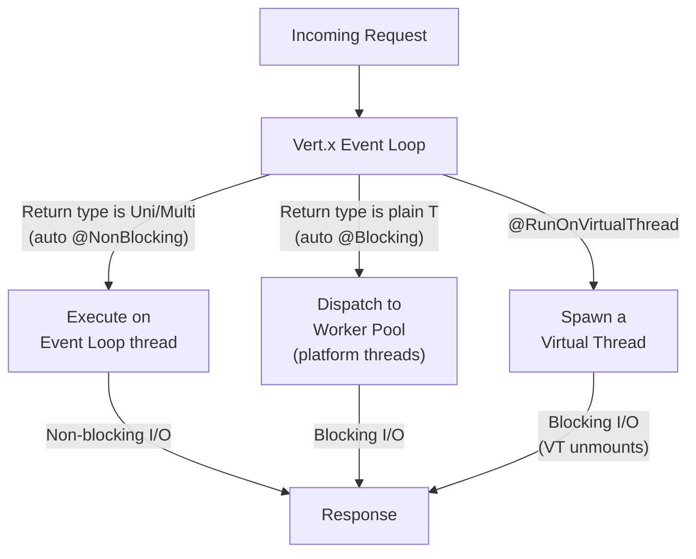
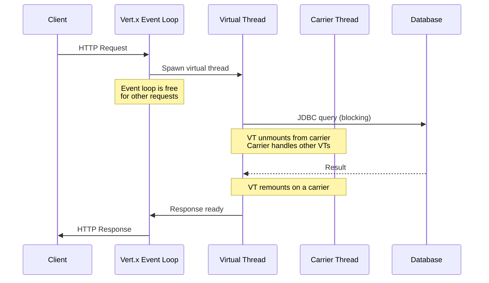
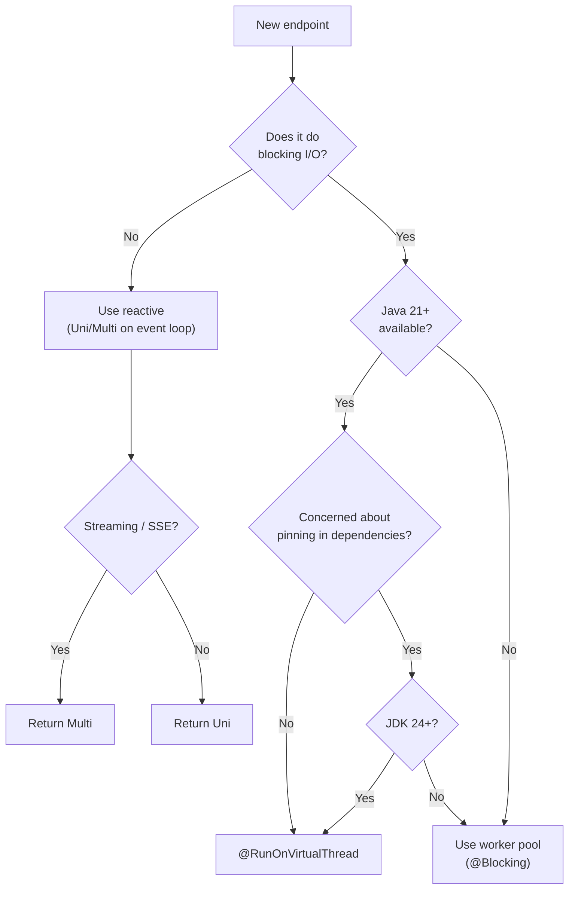

# Quarkus Virtual Threads — @RunOnVirtualThread and the Three Concurrency Models

**Date:** 2026-04-19 | **Updated:** 2026-04-19
**Tags:** `quarkus` `virtual-threads` `vertx` `concurrency` `java`

## Table of Contents

- [Summary](#summary)
- [Three Concurrency Models](#three-concurrency-models)
- [How @RunOnVirtualThread Works](#how-runonvirtualthread-works)
- [Supported Extensions](#supported-extensions)
- [Code Examples](#code-examples)
  - [REST Endpoints](#rest-endpoints)
  - [Bridging Reactive APIs with uni.await()](#bridging-reactive-apis-with-uniawait)
  - [Kafka Consumers](#kafka-consumers)
  - [Scheduled Jobs](#scheduled-jobs)
- [Virtual Threads vs Mutiny — Complementary, Not Competing](#virtual-threads-vs-mutiny--complementary-not-competing)
- [Pinning — Detection and Mitigation](#pinning--detection-and-mitigation)
- [Limitations](#limitations)
- [Three Frameworks, Three Approaches](#three-frameworks-three-approaches)
- [Decision Guide](#decision-guide)
- [Related](#related)
- [References](#references)

---

## Summary

Quarkus supports [Java 21 virtual threads](https://openjdk.org/jeps/444) via the `@RunOnVirtualThread` annotation, giving developers a third concurrency option alongside the Vert.x event loop (reactive) and the platform thread worker pool (imperative). Unlike Helidon 4, which removed reactive types entirely in favor of virtual threads, Quarkus keeps all three models available in the same application — you choose per endpoint. Unlike Spring Boot, which enables virtual threads globally via a config flag, Quarkus offers annotation-level granularity.

---

## Three Concurrency Models



| Model | Thread | Annotation | Auto-Detection | Best For |
|-------|--------|-----------|---------------|----------|
| **Event loop** | Vert.x I/O thread | `@NonBlocking` | `Uni<T>`, `Multi<T>` return type | Reactive chains, streaming, high concurrency |
| **Worker pool** | Platform thread | `@Blocking` | Plain `T` return type | Legacy blocking code, JDBC (pre-VT) |
| **Virtual thread** | Java 21 VT | `@RunOnVirtualThread` | Never auto-detected | Blocking I/O with VT efficiency |

Key insight: Quarkus **auto-detects** event loop vs worker pool based on the return type. Virtual threads require an explicit annotation — they are never the default.

---

## How @RunOnVirtualThread Works



1. The request arrives on the Vert.x event loop thread
2. Quarkus sees `@RunOnVirtualThread` and spawns a **new virtual thread** for the handler
3. The event loop is immediately freed for other requests
4. The handler runs blocking code (JDBC, HTTP calls, file I/O) — when it blocks, the JVM unmounts the virtual thread from its carrier thread
5. When the blocking call completes, the virtual thread is remounted on an available carrier
6. The response flows back through the event loop to the client

Each `@RunOnVirtualThread` invocation creates a **new** virtual thread — there is no pooling.

---

## Supported Extensions

`@RunOnVirtualThread` works with these Quarkus extensions:

| Extension | How to Use |
|-----------|-----------|
| **Quarkus REST (RESTEasy Reactive)** | Annotate resource method |
| **SmallRye Reactive Messaging (Kafka, AMQP)** | Annotate `@Incoming` method |
| **gRPC services** | Annotate service method |
| **Quarkus Scheduler / Quartz** | Annotate `@Scheduled` method |
| **WebSocket** | Annotate WebSocket endpoint method |

Not yet supported: Servlets, RESTEasy Classic (non-reactive).

---

## Code Examples

### REST Endpoints

```java
import io.smallrye.common.annotation.RunOnVirtualThread;
import jakarta.ws.rs.GET;
import jakarta.ws.rs.Path;

@Path("/users")
public class UserResource {

    @Inject
    UserRepository userRepo;  // blocking JDBC repository

    // Virtual thread — blocking JDBC is fine
    @GET
    @RunOnVirtualThread
    public List<User> list() {
        return userRepo.listAll();  // blocking call, VT handles it
    }

    // Compare: reactive approach (same result, different model)
    @GET
    @Path("/reactive")
    public Uni<List<User>> listReactive() {
        return User.listAll();  // Hibernate Reactive, runs on event loop
    }

    // Compare: worker pool (default for blocking return type)
    @GET
    @Path("/blocking")
    public List<User> listBlocking() {
        return userRepo.listAll();  // runs on platform thread worker pool
    }
}
```

### Bridging Reactive APIs with uni.await()

This is the key pattern that makes virtual threads and reactive **work together** in Quarkus. Any API returning `Uni<T>` can be consumed from a virtual thread via `uni.await().atMost(...)`:

```java
@GET
@RunOnVirtualThread
public List<Fruit> list() {
    // Call the reactive Hibernate Panache API from a virtual thread
    // .await() blocks the virtual thread (NOT the carrier thread)
    // .atMost() adds a non-blocking timeout for free
    return Fruit.<Fruit>listAll()
        .await().atMost(Duration.ofSeconds(5));
}

@GET
@Path("/{id}")
@RunOnVirtualThread
public Fruit get(@PathParam("id") Long id) {
    // Reactive find + timeout — sequential blocking code
    Fruit fruit = Fruit.<Fruit>findById(id)
        .await().atMost(Duration.ofSeconds(2));
    if (fruit == null) throw new NotFoundException();
    return fruit;
}

@POST
@RunOnVirtualThread
public Response create(Fruit fruit) {
    // Reactive transaction from a virtual thread
    Panache.withTransaction(fruit::persist)
        .await().atMost(Duration.ofSeconds(5));
    return Response.status(Status.CREATED).entity(fruit).build();
}
```

Why this matters:

- **Use the reactive data clients** (Hibernate Reactive, reactive PG client) which are more optimized in Quarkus — they're non-blocking under the hood
- **Write sequential blocking-style code** — no `onItem().transform()` chains, just `await()` and proceed
- **Free timeout support** — `.atMost(Duration)` throws `TimeoutException` if the `Uni` doesn't complete in time, without needing `@Timeout` from Fault Tolerance
- **The virtual thread unmounts** during the await — the carrier thread serves other virtual threads in the meantime

This pattern eliminates the main friction point: you don't have to choose between "reactive APIs with good Quarkus integration" and "simple blocking code on virtual threads." You get both.

### Kafka Consumers

```java
import io.smallrye.common.annotation.RunOnVirtualThread;
import org.eclipse.microprofile.reactive.messaging.Incoming;

@ApplicationScoped
public class OrderProcessor {

    @Incoming("orders")
    @RunOnVirtualThread
    public void process(Order order) {
        // Blocking calls are fine — runs on a virtual thread
        enrichmentService.enrich(order);       // HTTP call (blocking)
        orderRepository.persist(order);         // JDBC (blocking)
        notificationService.notify(order);      // HTTP call (blocking)
    }
}
```

### Scheduled Jobs

```java
import io.smallrye.common.annotation.RunOnVirtualThread;
import io.quarkus.scheduler.Scheduled;

@ApplicationScoped
public class CleanupJob {

    @Scheduled(every = "1h", identity = "cleanup")
    @RunOnVirtualThread
    void cleanup() {
        // Blocking database operations on a virtual thread
        int deleted = expiredSessionRepo.deleteExpired();
        log.info("Cleaned up {} expired sessions", deleted);
    }
}
```

---

## Virtual Threads vs Mutiny — Complementary, Not Competing

Quarkus's official stance: **virtual threads don't replace reactive; they complement it**.

| Concern | Virtual Threads | Mutiny (Reactive) |
|---------|----------------|-------------------|
| **Programming model** | Sequential, blocking | Declarative, event-driven chains |
| **Backpressure** | Not built-in | `Multi` has backpressure |
| **Streaming** | Not natural (request-response model) | `Multi<T>` is designed for streams |
| **Error handling** | try/catch | `.onFailure().recoverWith(...)` |
| **Composition** | Sequential or `StructuredTaskScope` | `.combine()`, `.merge()`, `.zip()` |
| **Debugging** | Clean stack traces | Reactive stack traces (harder) |
| **Cancellation** | Thread interruption | Subscriber cancellation |
| **Learning curve** | Low (familiar blocking code) | Higher (reactive mindset) |

### When to Use Each in Quarkus

| Scenario | Recommendation |
|----------|---------------|
| CRUD REST API with JDBC | `@RunOnVirtualThread` — simplest model |
| SSE / streaming endpoint | `Multi<T>` — designed for streams |
| Kafka consumer doing blocking I/O | `@RunOnVirtualThread` — simple consumer |
| Kafka consumer with complex stream processing | Reactive messaging with Mutiny operators |
| Fan-out (call 3 services in parallel) | Either: `Uni.combine()` or `StructuredTaskScope` |
| Existing reactive codebase | Keep Mutiny — no reason to migrate |
| New project with simple I/O patterns | Virtual threads — easier to write and maintain |

---

## Pinning — Detection and Mitigation

Virtual threads can be **pinned** to carrier threads when:

1. **`synchronized` blocks** — holds the monitor, carrier cannot be released (fixed in JDK 24 via [JEP 491](https://openjdk.org/jeps/491))
2. **Native method frames** — JNI calls pin the carrier

### Detection

**Java 21–23**: Use JVM flag to log pinning:

```properties
# application.properties
quarkus.native.additional-build-args=-Djdk.tracePinnedThreads=short
```

**Java 24+**: The `jdk.tracePinnedThreads` flag was removed because `synchronized` no longer pins. Use JFR events instead:

```java
// In tests — use junit-virtual-threads
@VirtualThreadUnit
@ShouldNotPin
class UserResourceTest {
    @Test
    void testList() { ... }
}
```

### Common Pinning Sources

| Library | Cause | Fix |
|---------|-------|-----|
| JDBC drivers (older) | `synchronized` in connection handling | Upgrade driver; JDK 24 fixes this |
| Logback | `synchronized` in appenders | Use async appender or upgrade |
| `java.util.zip` | JNI for compression | Use alternatives or accept the pin |
| Custom code | `synchronized` keyword | Replace with `ReentrantLock` |

---

## Limitations

Three concerns limit universal virtual thread adoption in Quarkus:

### 1. Monopolization

CPU-bound computations that never block I/O will occupy a carrier thread indefinitely. The JVM creates additional carriers to compensate, increasing memory use. Virtual threads are for **I/O-bound** work only.

### 2. ThreadLocal Pooling

Libraries like Jackson and Netty use `ThreadLocal` for object pooling (reusing buffers across requests handled by the same thread). With virtual threads, each request gets a new thread, so pooled objects are never reused — increasing allocation and GC pressure.

### 3. No Global Opt-In (Yet)

As of Quarkus 3.x, `@RunOnVirtualThread` must be applied per-method. There is no global config flag equivalent to Spring Boot's `spring.threads.virtual.enabled=true`. A [GitHub issue](https://github.com/quarkusio/quarkus/issues/51031) tracks adding default virtual thread mode for JDK 24+.

> **Clarification on `quarkus.virtual-threads.enabled`**: This property exists but is a **disable flag**, not an opt-in. It defaults to `true` (virtual threads are available). Setting it to `false` forces all `@RunOnVirtualThread`-annotated methods to execute on the worker thread pool instead. It does **not** enable virtual threads globally for all endpoints — you still need the annotation per method. Some third-party tutorials incorrectly describe this as a global opt-in.

---

## Three Frameworks, Three Approaches

| Aspect | Quarkus | Spring Boot | Helidon 4 |
|--------|---------|------------|-----------|
| **VT adoption** | Opt-in per method | Opt-in globally (config flag) | Mandatory (only model) |
| **Reactive coexistence** | Yes — Mutiny + VT in same app | Yes — WebFlux + VT in same app | No — reactive removed |
| **Annotation** | `@RunOnVirtualThread` | None (config-based) | None (all endpoints are VT) |
| **I/O engine** | Vert.x event loop → VT dispatch | Tomcat/Jetty VT executor | Nima blocking sockets |
| **Granularity** | Per-endpoint | Per-application | Per-application |
| **Philosophy** | "Choose the right model per endpoint" | "Enable VT for the whole app" | "VT is the only model" |

Quarkus offers the most **granular** control. Spring Boot offers the **simplest** migration path (one config line). Helidon offers the **purest** VT experience (no legacy models).

---

## Decision Guide



---

## Related

- [Quarkus Overview](quarkus-overview.md) — architecture, Vert.x, build-time processing
- [Quarkus Reactive with Mutiny](quarkus-reactive-mutiny.md) — the reactive model that VTs complement
- [Virtual Threads in Java](../java-fundamentals/virtual-threads.md) — Project Loom, JEP 444, the JVM feature
- [Virtual Threads and Spring Boot](../spring-virtual-threads.md) — Spring's global config approach
- [Helidon Nima Architecture](../helidon/nima-virtual-threads-architecture.md) — Helidon's VT-only approach

## References

- [Virtual Thread Support Reference — Quarkus](https://quarkus.io/guides/virtual-threads) — official guide, extensions, pinning, testing
- [Use Virtual Threads in REST — Quarkus](https://quarkus.io/guides/rest-virtual-threads) — REST-specific virtual thread guide
- [JEP 444: Virtual Threads](https://openjdk.org/jeps/444) — the JVM feature
- [JEP 491: Synchronize Without Pinning](https://openjdk.org/jeps/491) — JDK 24 fix for synchronized pinning
- [When Quarkus Meets Virtual Threads — GitHub Discussion](https://github.com/quarkusio/quarkus/discussions/36011) — design rationale and community feedback
- [Mastering Virtual Threads in Quarkus — The Main Thread](https://www.the-main-thread.com/p/quarkus-virtual-threads-java-tutorial) — hands-on guide
- [Quarkus and Virtual Threads — Baeldung](https://www.baeldung.com/java-quarkus-virtual-threads) — tutorial with examples
