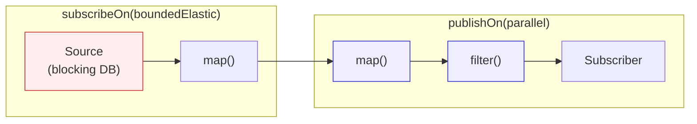
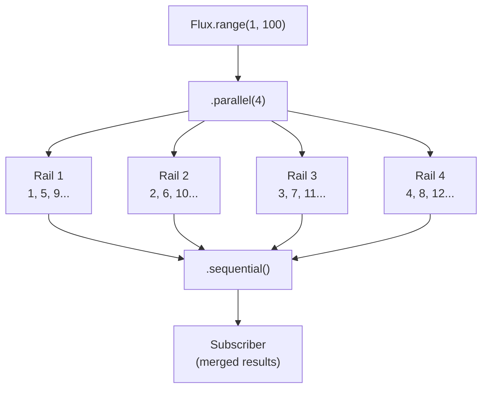
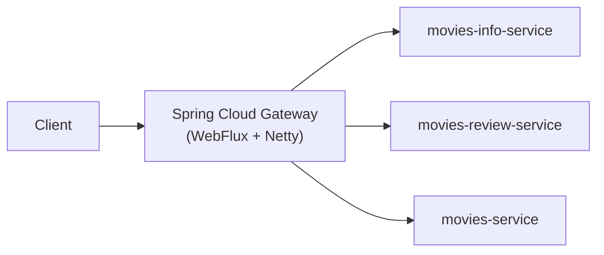
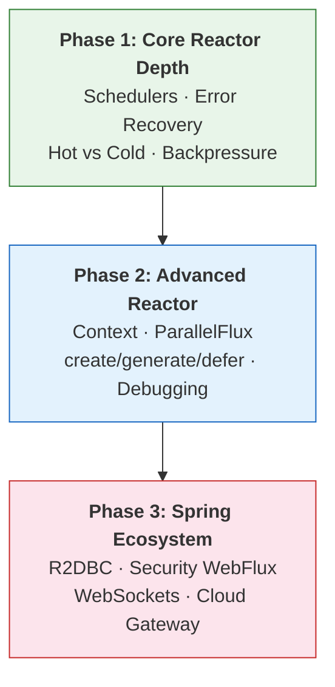

# Advanced Reactive Programming in Java — Beyond the Basics

**Date:** 2026-04-15 | **Updated:** 2026-04-15
**Tags:** `reactive` `java` `project-reactor` `schedulers` `backpressure` `context` `parallel` `r2dbc` `security`

## Table of Contents

- [Summary](#summary)
- [Schedulers and Threading](#schedulers-and-threading)
  - [The Default: No Thread Switching](#the-default-no-thread-switching)
  - [Scheduler Types](#scheduler-types)
  - [publishOn vs subscribeOn](#publishon-vs-subscribeon)
  - [Practical Threading Patterns](#practical-threading-patterns)
- [Error Recovery Operators](#error-recovery-operators)
  - [onErrorReturn — Static Fallback Value](#onerrorreturn--static-fallback-value)
  - [onErrorResume — Fallback Publisher](#onerrorresume--fallback-publisher)
  - [onErrorMap — Transform the Exception](#onerrormap--transform-the-exception)
  - [onErrorContinue — Skip and Continue](#onerrorcontinue--skip-and-continue)
  - [Error Recovery Decision Table](#error-recovery-decision-table)
- [Hot vs Cold Publishers](#hot-vs-cold-publishers)
  - [Cold Publishers (Default)](#cold-publishers-default)
  - [Hot Publishers](#hot-publishers)
  - [Converting Cold to Hot](#converting-cold-to-hot)
  - [Hot vs Cold Decision Table](#hot-vs-cold-decision-table)
- [Backpressure Strategies](#backpressure-strategies)
  - [What is Backpressure?](#what-is-backpressure)
  - [Built-in Strategies](#built-in-strategies)
  - [limitRate — Prefetch Control](#limitrate--prefetch-control)
  - [Custom Backpressure with BaseSubscriber](#custom-backpressure-with-basesubscriber)
- [Reactor Context](#reactor-context)
  - [Why ThreadLocal Breaks in Reactive](#why-threadlocal-breaks-in-reactive)
  - [Context API](#context-api)
  - [Context for Logging (MDC)](#context-for-logging-mdc)
  - [Context Propagation Library (Reactor 3.5+)](#context-propagation-library-reactor-35)
- [Custom Reactive Sources](#custom-reactive-sources)
  - [Flux.create — Bridge from Imperative Push](#fluxcreate--bridge-from-imperative-push)
  - [Flux.generate — Synchronous Stateful Generation](#fluxgenerate--synchronous-stateful-generation)
  - [Mono.defer / Flux.defer — Lazy Evaluation](#monodefer--fluxdefer--lazy-evaluation)
- [ParallelFlux](#parallelflux)
  - [How It Works](#how-it-works)
  - [When to Use ParallelFlux vs flatMap Concurrency](#when-to-use-parallelflux-vs-flatmap-concurrency)
- [Windowing, Buffering, and Grouping](#windowing-buffering-and-grouping)
  - [buffer — Collect Into Lists](#buffer--collect-into-lists)
  - [window — Collect Into Sub-Fluxes](#window--collect-into-sub-fluxes)
  - [groupBy — Partition by Key](#groupby--partition-by-key)
- [Aggregation Operators](#aggregation-operators)
  - [reduce — Final Accumulated Value](#reduce--final-accumulated-value)
  - [scan — Running Accumulation](#scan--running-accumulation)
  - [distinct, take, skip](#distinct-take-skip)
- [Debugging Reactive Streams](#debugging-reactive-streams)
  - [The Problem with Stack Traces](#the-problem-with-stack-traces)
  - [log() — Signal-Level Tracing](#log--signal-level-tracing)
  - [checkpoint — Lightweight Assembly Tracing](#checkpoint--lightweight-assembly-tracing)
  - [Hooks.onOperatorDebug — Full Assembly Tracing](#hooksonoperatordebug--full-assembly-tracing)
  - [ReactorDebugAgent — Production-Safe Tracing](#reactordebugagent--production-safe-tracing)
- [R2DBC — Reactive SQL](#r2dbc--reactive-sql)
  - [Why R2DBC Exists](#why-r2dbc-exists)
  - [Setup](#setup)
  - [ReactiveCrudRepository](#reactivecrudrepository)
  - [DatabaseClient for Complex Queries](#databaseclient-for-complex-queries)
  - [R2DBC vs JPA Comparison](#r2dbc-vs-jpa-comparison)
- [Spring Security WebFlux](#spring-security-webflux)
  - [SecurityWebFilterChain](#securitywebfilterchain)
  - [ReactiveUserDetailsService](#reactiveuserdetailsservice)
  - [Accessing the Security Context Reactively](#accessing-the-security-context-reactively)
- [Reactive WebSockets](#reactive-websockets)
  - [WebSocketHandler](#websockethandler)
  - [Client-Side WebSocket](#client-side-websocket)
- [Spring Cloud Gateway](#spring-cloud-gateway)
  - [What It Is](#what-it-is)
  - [Route Configuration](#route-configuration)
  - [Custom Filters](#custom-filters)
- [Study Roadmap](#study-roadmap)
- [Related](#related)
- [References](#references)

---

## Summary

This document covers the advanced reactive programming topics in Java that go beyond the fundamentals of Flux/Mono operators, Spring WebFlux controllers, and basic WebClient usage. It is a continuation of [reactive-programming-java.md](reactive-programming-java.md), covering threading with Schedulers, error recovery operators, hot vs cold publishers, backpressure strategies, Reactor Context, custom reactive sources, ParallelFlux, debugging techniques, R2DBC for reactive SQL, Spring Security WebFlux, reactive WebSockets, and Spring Cloud Gateway.

---

## Schedulers and Threading

### The Default: No Thread Switching

By default, Reactor executes everything on the thread that called `subscribe()`. In a Spring WebFlux application, that thread is a Netty event-loop thread. **There is no magic parallelism unless you explicitly request it.**

```java
Flux.just("A", "B", "C")
    .map(s -> {
        System.out.println(Thread.currentThread().getName()); // reactor-http-nio-2
        return s.toLowerCase();
    })
    .subscribe();
```

### Scheduler Types

[`Schedulers`](https://projectreactor.io/docs/core/snapshot/reference/coreFeatures/schedulers.html) provides factory methods for different thread pools:

| Scheduler | Thread Pool | Use Case |
|-----------|-------------|----------|
| `Schedulers.immediate()` | Current thread | Testing, no-op |
| `Schedulers.single()` | Single reusable thread | Low-latency sequential tasks |
| `Schedulers.boundedElastic()` | Cached, bounded pool (10 x cores) | **Blocking I/O** (JDBC, file reads, legacy libs) |
| `Schedulers.parallel()` | Fixed pool (= CPU cores) | **CPU-bound** computation |
| `Schedulers.fromExecutorService(exec)` | Custom executor | When you need specific pool sizing |

### publishOn vs subscribeOn

These are the two operators for switching threads. They work in **opposite directions**:

```java
Flux.just("A", "B", "C")             // [1] runs on subscribe thread
    .map(s -> s + "1")                // [2] runs on subscribe thread
    .publishOn(Schedulers.parallel()) // --- thread switch for downstream ---
    .map(s -> s + "2")                // [3] runs on parallel thread
    .subscribe();
```

| Operator | Direction | Effect | Typical Use |
|----------|-----------|--------|-------------|
| `publishOn` | **Downstream** (onNext signal) | Switches thread for all operators **after** it | Offload processing after receiving data |
| `subscribeOn` | **Upstream** (subscribe signal) | Affects the **entire chain** regardless of position | Offload the source subscription |



**Key rule:** `subscribeOn` placement doesn't matter — it always propagates upstream. `publishOn` placement matters — it affects everything downstream from where it's placed.

### Practical Threading Patterns

**Pattern 1: Offload a blocking call**

```java
Mono.fromCallable(() -> jpaRepository.findById(id))  // blocking
    .subscribeOn(Schedulers.boundedElastic())          // offload to elastic
    .flatMap(entity -> processReactively(entity));     // back to event-loop
```

**Pattern 2: CPU-intensive processing after I/O**

```java
webClient.get().uri("/data")
    .retrieve().bodyToFlux(DataPoint.class)            // I/O on event-loop
    .publishOn(Schedulers.parallel())                  // switch to parallel pool
    .map(data -> expensiveComputation(data))           // CPU-bound work
    .publishOn(Schedulers.boundedElastic())            // switch for DB write
    .flatMap(result -> saveToDatabase(result));
```

**Pattern 3: Multiple thread switches**

```java
Flux.fromIterable(largeDataset)
    .subscribeOn(Schedulers.boundedElastic())          // source iteration off event-loop
    .publishOn(Schedulers.parallel())                  // CPU processing
    .map(item -> transform(item))
    .publishOn(Schedulers.boundedElastic())            // blocking sink
    .flatMap(item -> Mono.fromCallable(() -> repo.save(item)));
```

See [Wrapping Blocking JPA Calls in a Reactive Chain](reactive-blocking-jpa-pattern.md) for a deeper treatment of `subscribeOn` placement with JPA.

---

## Error Recovery Operators

In reactive streams, errors are terminal — they kill the sequence. Unlike imperative code, you can't use `try-catch` inside a reactive chain. Reactor provides [error handling operators](https://projectreactor.io/docs/core/release/reference/coreFeatures/error-handling.html) for recovery.

### onErrorReturn — Static Fallback Value

Catches the error and emits a single fallback value, then completes:

```java
Mono.fromCallable(() -> riskyOperation())
    .onErrorReturn("default-value");

// With exception type filter
Mono.fromCallable(() -> riskyOperation())
    .onErrorReturn(TimeoutException.class, "timed-out");

// With predicate
Mono.fromCallable(() -> riskyOperation())
    .onErrorReturn(e -> e.getMessage().contains("404"), "not-found");
```

### onErrorResume — Fallback Publisher

Catches the error and switches to an alternative `Mono` or `Flux`:

```java
// Switch to a cache when the API fails
webClient.get().uri("/products/{id}", id)
    .retrieve().bodyToMono(Product.class)
    .onErrorResume(WebClientResponseException.class, ex -> {
        if (ex.getStatusCode() == HttpStatus.NOT_FOUND) {
            return Mono.empty();  // No product, complete without error
        }
        return cacheService.getCachedProduct(id);  // Fallback to cache
    });
```

This is the reactive equivalent of a `try-catch` block with recovery logic.

### onErrorMap — Transform the Exception

Catches the error, wraps or transforms it, and re-throws:

```java
repository.findById(id)
    .onErrorMap(DataAccessException.class, 
        ex -> new ServiceException("Failed to fetch entity: " + id, ex));
```

This is the reactive equivalent of `catch (X ex) { throw new Y(ex); }`.

### onErrorContinue — Skip and Continue

**Use with caution.** Catches errors on individual elements and continues processing the rest of the stream:

```java
Flux.just(1, 2, 0, 4, 5)
    .map(i -> 100 / i)  // ArithmeticException on 0
    .onErrorContinue((error, element) -> {
        log.warn("Skipping element {} due to: {}", element, error.getMessage());
    });
// Emits: 100, 50, 25, 20 — skips the division by zero
```

**Warning:** `onErrorContinue` has surprising behavior — it modifies operators upstream, not just the one that errored. Many operators don't support it. Prefer wrapping individual elements in `flatMap` with `onErrorResume` instead:

```java
// Safer alternative
Flux.just(1, 2, 0, 4, 5)
    .flatMap(i -> Mono.fromCallable(() -> 100 / i)
        .onErrorResume(e -> {
            log.warn("Skipping {} due to: {}", i, e.getMessage());
            return Mono.empty();
        }));
```

### Error Recovery Decision Table

| I want to... | Use | Example |
|--------------|-----|---------|
| Return a fixed fallback value | `onErrorReturn` | Return `"N/A"` on failure |
| Switch to an alternative stream | `onErrorResume` | Fall back to cache |
| Transform the error type | `onErrorMap` | Wrap as domain exception |
| Skip failed elements, continue | `flatMap` + `onErrorResume(Mono.empty())` | Batch processing |
| Log and re-throw unchanged | `doOnError` | Logging without recovery |
| Retry the operation | `retry` / `retryWhen` | Transient failures |

---

## Hot vs Cold Publishers

### Cold Publishers (Default)

A **cold publisher** generates data fresh for each subscriber. Every subscription replays the full sequence from the beginning:

```java
Flux<Long> cold = Flux.interval(Duration.ofSeconds(1));

cold.subscribe(i -> System.out.println("Sub1: " + i));  // 0, 1, 2, 3...
Thread.sleep(3000);
cold.subscribe(i -> System.out.println("Sub2: " + i));  // 0, 1, 2, 3... (starts over!)
```

Examples: database queries, HTTP requests, `Flux.fromIterable()`, `Flux.just()`.

### Hot Publishers

A **hot publisher** emits data regardless of subscribers. Late subscribers miss items that were already emitted:

```java
Sinks.Many<String> sink = Sinks.many().multicast().onBackpressureBuffer();

sink.tryEmitNext("A");  // Nobody is listening — lost (for multicast)
sink.asFlux().subscribe(s -> System.out.println("Sub1: " + s));
sink.tryEmitNext("B");  // Sub1 receives B
sink.asFlux().subscribe(s -> System.out.println("Sub2: " + s));
sink.tryEmitNext("C");  // Both receive C
```

Examples: user events, system events, Sinks, `WebSocket` streams.

### Converting Cold to Hot

Reactor provides operators to convert a cold publisher into a hot one:

**`share()`** — multicasts to current subscribers, restarts for late subscribers if all unsubscribe:

```java
Flux<Long> hot = Flux.interval(Duration.ofSeconds(1)).share();

hot.subscribe(i -> System.out.println("Sub1: " + i));  // 0, 1, 2...
Thread.sleep(3000);
hot.subscribe(i -> System.out.println("Sub2: " + i));  // 3, 4, 5... (joins in progress)
```

**`replay(n)`** — caches the last N items for late subscribers:

```java
Flux<Long> hot = Flux.interval(Duration.ofSeconds(1))
    .replay(2)      // cache last 2 items
    .autoConnect(); // start emitting when first subscriber attaches

hot.subscribe(i -> System.out.println("Sub1: " + i));  // 0, 1, 2, 3...
Thread.sleep(3000);
hot.subscribe(i -> System.out.println("Sub2: " + i));  // 2, 3, 4... (replays 2 and 3)
```

**`cache()`** — shorthand for `replay().autoConnect(1)`, caches all emissions:

```java
Mono<Config> config = loadConfigFromDb().cache(Duration.ofMinutes(5));
// First subscriber triggers the DB call
// Subsequent subscribers within 5 minutes get the cached result
```

**`publish().autoConnect(n)`** — starts after N subscribers:

```java
Flux<Long> hot = Flux.interval(Duration.ofSeconds(1))
    .publish()
    .autoConnect(2);  // Waits for 2 subscribers before starting

hot.subscribe(i -> System.out.println("Sub1: " + i));  // Nothing yet
hot.subscribe(i -> System.out.println("Sub2: " + i));  // Now both receive 0, 1, 2...
```

**`publish().refCount(n)`** — starts after N subscribers, stops when all unsubscribe:

```java
Flux<Long> hot = Flux.interval(Duration.ofSeconds(1))
    .publish()
    .refCount(1);  // Start on first subscriber, stop when last unsubscribes
```

### Hot vs Cold Decision Table

| I need... | Use |
|-----------|-----|
| Each subscriber gets its own independent stream | Cold (default) |
| All subscribers see the same live stream | `share()` |
| Late subscribers get the last N items | `replay(N).autoConnect()` |
| Cache a Mono result for a duration | `cache(Duration)` |
| Start emitting only when N subscribers attach | `publish().autoConnect(N)` |
| Auto-stop when all unsubscribe | `publish().refCount(N)` |

---

## Backpressure Strategies

### What is Backpressure?

[Backpressure](https://www.reactive-streams.org/) is the mechanism by which a slow consumer signals to a fast producer how many elements it can handle. Without backpressure, a fast producer would overwhelm a slow consumer's memory.

In the Reactive Streams spec, backpressure flows through `Subscription.request(n)`:

```java
publisher.subscribe(new Subscriber<T>() {
    Subscription sub;
    
    public void onSubscribe(Subscription s) {
        this.sub = s;
        s.request(10);  // "I can handle 10 items"
    }
    
    public void onNext(T item) {
        process(item);
        sub.request(1);  // "I'm ready for 1 more"
    }
});
```

### Built-in Strategies

When a producer emits faster than the consumer requests, Reactor offers several strategies via the [`onBackpressure*`](https://projectreactor.io/docs/core/release/reference/apdx-operatorChoice.html) operators:

**`onBackpressureBuffer()`** — buffer all excess items (default for most operators):

```java
fastProducer
    .onBackpressureBuffer()            // Unbounded buffer — OOM risk!
    .subscribe(slowConsumer);

fastProducer
    .onBackpressureBuffer(256)         // Bounded: error if buffer exceeds 256
    .subscribe(slowConsumer);

fastProducer
    .onBackpressureBuffer(256,         // Bounded with overflow handler
        dropped -> log.warn("Dropped: {}", dropped))
    .subscribe(slowConsumer);
```

**`onBackpressureDrop()`** — drop items the consumer can't handle:

```java
sensorStream
    .onBackpressureDrop(dropped -> metrics.increment("sensor.dropped"))
    .subscribe(processor);
```

**`onBackpressureLatest()`** — keep only the most recent item:

```java
priceStream
    .onBackpressureLatest()  // Only the latest price matters
    .subscribe(display);
```

**`onBackpressureError()`** — error immediately on overflow:

```java
criticalStream
    .onBackpressureError()  // No data loss acceptable — fail fast
    .subscribe(processor);
```

| Strategy | On Overflow | Use Case |
|----------|------------|----------|
| `buffer()` | Queue items | Bounded queues, batch processing |
| `buffer(n)` | Queue up to N, then error | Memory-safe buffering |
| `drop()` | Discard excess | Metrics, sampling |
| `latest()` | Keep newest only | UI state, live prices |
| `error()` | Signal error | Critical data, no loss acceptable |

### limitRate — Prefetch Control

`limitRate` controls how many items are prefetched from upstream:

```java
Flux.range(1, 1000)
    .limitRate(50)    // Request 50 at a time, replenish at 75% (37)
    .subscribe();

Flux.range(1, 1000)
    .limitRate(50, 10)  // Request 50, replenish when 10 consumed
    .subscribe();
```

### Custom Backpressure with BaseSubscriber

For fine-grained control, extend `BaseSubscriber`:

```java
Flux.range(1, 100)
    .subscribe(new BaseSubscriber<Integer>() {
        @Override
        protected void hookOnSubscribe(Subscription subscription) {
            request(5);  // Start with 5
        }

        @Override
        protected void hookOnNext(Integer value) {
            System.out.println("Received: " + value);
            if (value % 5 == 0) {
                request(5);  // Request 5 more every 5 items
            }
        }
    });
```

---

## Reactor Context

### Why ThreadLocal Breaks in Reactive

In traditional servlet apps, `ThreadLocal` stores request-scoped data (user ID, trace ID, MDC logging context) because one thread handles the entire request. In reactive, a single request hops across multiple threads — `ThreadLocal` data is lost at each hop.

```java
// BROKEN in reactive — MDC is ThreadLocal-based
MDC.put("traceId", "abc123");
webClient.get().uri("/api")
    .retrieve().bodyToMono(String.class)
    .map(response -> {
        // MDC.get("traceId") returns null here — different thread!
        return response;
    });
```

### Context API

[Reactor's Context](https://projectreactor.io/docs/core/release/reference/advancedFeatures/context.html) is an immutable key-value store that flows through the subscription chain (upstream):

```java
Mono.deferContextual(ctx -> {
        String traceId = ctx.get("traceId");
        log.info("Processing with trace: {}", traceId);
        return Mono.just("result");
    })
    .contextWrite(Context.of("traceId", "abc123"));
```

**Key rules:**
- `contextWrite` places data, propagates **upstream** (like `subscribeOn`)
- `deferContextual` or `transformDeferredContextual` reads Context
- Context is **immutable** — `contextWrite` creates a new Context view
- Place `contextWrite` as **close to the subscriber as possible** (bottom of the chain)

```java
// Reading context inside operators
Flux.just("A", "B", "C")
    .flatMap(item -> Mono.deferContextual(ctx -> {
        String userId = ctx.get("userId");
        return processItem(item, userId);
    }))
    .contextWrite(Context.of("userId", "user-42"));
```

### Context for Logging (MDC)

Bridge Reactor Context to SLF4J MDC for structured logging:

```java
// WebFilter that copies trace ID into Context
@Component
public class TraceIdWebFilter implements WebFilter {
    @Override
    public Mono<Void> filter(ServerWebExchange exchange, WebFilterChain chain) {
        String traceId = exchange.getRequest().getHeaders()
            .getFirst("X-Trace-Id");
        if (traceId == null) traceId = UUID.randomUUID().toString();
        
        return chain.filter(exchange)
            .contextWrite(Context.of("traceId", traceId));
    }
}
```

Then use `doOnEach` to restore MDC per signal:

```java
public static <T> Consumer<Signal<T>> logOnNext(Consumer<T> action) {
    return signal -> {
        if (signal.isOnNext()) {
            String traceId = signal.getContextView().getOrDefault("traceId", "unknown");
            try (MDC.MDCCloseable ignored = MDC.putCloseable("traceId", traceId)) {
                action.accept(signal.get());
            }
        }
    };
}

// Usage
flux.doOnEach(logOnNext(item -> log.info("Processing: {}", item)));
```

### Context Propagation Library (Reactor 3.5+)

Since Reactor 3.5, the [context-propagation library](https://spring.io/blog/2023/03/28/context-propagation-with-project-reactor-1-the-basics/) bridges `ThreadLocal` and Reactor Context automatically. With Spring Boot 3.x and Micrometer Tracing, this works out of the box:

```xml
<dependency>
    <groupId>io.micrometer</groupId>
    <artifactId>context-propagation</artifactId>
</dependency>
```

```properties
# application.properties — enable automatic context propagation
spring.reactor.context-propagation=auto
```

With this enabled, MDC, security context, and tracing context automatically propagate across thread hops without manual `contextWrite`.

---

## Custom Reactive Sources

### Flux.create — Bridge from Imperative Push

`Flux.create` bridges callback-based or listener APIs into a Flux. The `FluxSink` supports multi-threaded emission:

```java
Flux<String> eventStream = Flux.create(sink -> {
    EventListener listener = event -> {
        sink.next(event.getData());           // Push data
        if (event.isLast()) sink.complete();  // Complete signal
    };
    eventSource.register(listener);
    sink.onDispose(() -> eventSource.unregister(listener));  // Cleanup
}, FluxSink.OverflowStrategy.BUFFER);  // Backpressure strategy
```

Overflow strategies for `create`:
- `BUFFER` — buffer all (default)
- `DROP` — drop if consumer can't keep up
- `LATEST` — keep only the latest
- `ERROR` — error on overflow
- `IGNORE` — no backpressure handling

### Flux.generate — Synchronous Stateful Generation

`Flux.generate` produces items one-by-one with state. The generator function is called **per request** — it naturally supports backpressure:

```java
// Generate Fibonacci sequence
Flux<Long> fibonacci = Flux.generate(
    () -> new long[]{0, 1},               // Initial state
    (state, sink) -> {
        sink.next(state[0]);              // Emit current
        long next = state[0] + state[1];
        state[0] = state[1];
        state[1] = next;
        if (state[0] > 1_000_000) {
            sink.complete();              // Terminal condition
        }
        return state;                     // Return updated state
    }
);
// Emits: 0, 1, 1, 2, 3, 5, 8, 13, 21, ...
```

**Key difference from `create`:**
- `generate` calls the generator synchronously, one `next()` per invocation
- `create` can emit multiple items from anywhere (callbacks, other threads)

### Mono.defer / Flux.defer — Lazy Evaluation

`defer` delays the construction of the publisher until subscription time. This is critical for avoiding "eager" Mono/Flux creation:

```java
// BUG — Mono.just captures the value NOW (eager), not at subscription time
Mono<Long> eager = Mono.just(System.currentTimeMillis());
eager.subscribe(t -> System.out.println(t));  // Always the same value
Thread.sleep(1000);
eager.subscribe(t -> System.out.println(t));  // Same value!

// FIX — defer re-evaluates at each subscription
Mono<Long> lazy = Mono.defer(() -> Mono.just(System.currentTimeMillis()));
lazy.subscribe(t -> System.out.println(t));   // Current time
Thread.sleep(1000);
lazy.subscribe(t -> System.out.println(t));   // Different time!
```

Common uses:
- Wrapping methods that return `Mono.just()` or `Mono.error()` conditionally
- Preventing premature side effects
- Ensuring fresh state per subscription

```java
// Conditional error — must use defer
Mono<String> result = Mono.defer(() -> {
    if (isReady()) {
        return service.getData();
    } else {
        return Mono.error(new IllegalStateException("Not ready"));
    }
});
```

---

## ParallelFlux

### How It Works

[`ParallelFlux`](https://projectreactor.io/docs/core/release/reference/advancedFeatures/advanced-parallelizing-parralelflux.html) splits a Flux into parallel "rails" for CPU-bound processing:

```java
Flux.range(1, 100)
    .parallel()                              // Split into rails (default = CPU cores)
    .runOn(Schedulers.parallel())            // REQUIRED — assign threads
    .map(i -> expensiveCpuWork(i))           // Runs in parallel
    .sequential()                            // Merge rails back to single Flux
    .subscribe(result -> System.out.println(result));
```

**Critical:** `.parallel()` alone does NOT run in parallel. You must call `.runOn()` to assign a scheduler.



Specifying the number of rails:

```java
Flux.range(1, 100)
    .parallel(8)                // 8 rails instead of default CPU count
    .runOn(Schedulers.parallel())
    .map(this::cpuBoundWork)
    .sequential()
    .subscribe();
```

### When to Use ParallelFlux vs flatMap Concurrency

| Approach | Best For | Example |
|----------|----------|---------|
| `flatMap` with concurrency | **I/O-bound** parallel work | Parallel HTTP calls |
| `ParallelFlux` | **CPU-bound** parallel work | Data transformation, parsing |

```java
// I/O-bound: use flatMap concurrency (doesn't waste threads waiting)
Flux.fromIterable(urls)
    .flatMap(url -> webClient.get().uri(url).retrieve().bodyToMono(String.class), 
             16)  // concurrency = 16
    .subscribe();

// CPU-bound: use ParallelFlux (each rail gets a dedicated thread)
Flux.fromIterable(documents)
    .parallel()
    .runOn(Schedulers.parallel())
    .map(doc -> parseAndTransform(doc))  // CPU-intensive
    .sequential()
    .subscribe();
```

---

## Windowing, Buffering, and Grouping

### buffer — Collect Into Lists

`buffer` collects elements into `List<T>` chunks:

```java
// By count
Flux.range(1, 10)
    .buffer(3);           // [1,2,3], [4,5,6], [7,8,9], [10]

// By duration
sensorStream
    .buffer(Duration.ofSeconds(5));  // Batch every 5 seconds

// By count or duration (whichever comes first)
eventStream
    .bufferTimeout(100, Duration.ofSeconds(1));  // Max 100 items or 1 second
```

### window — Collect Into Sub-Fluxes

`window` is like `buffer`, but emits `Flux<Flux<T>>` instead of `Flux<List<T>>`. Useful when you want to process each window reactively:

```java
Flux.range(1, 10)
    .window(3)                          // Flux<Flux<Integer>>
    .flatMap(windowFlux -> windowFlux
        .reduce(0, Integer::sum))       // Sum each window
    .subscribe(System.out::println);    // 6, 15, 24, 10
```

### groupBy — Partition by Key

`groupBy` creates a `Flux<GroupedFlux<K, T>>` partitioned by a key function:

```java
Flux.just("apple", "avocado", "banana", "blueberry", "cherry")
    .groupBy(fruit -> fruit.charAt(0))          // Group by first letter
    .flatMap(group -> group.collectList()
        .map(list -> group.key() + ": " + list))
    .subscribe(System.out::println);
// a: [apple, avocado]
// b: [banana, blueberry]
// c: [cherry]
```

**Warning:** `groupBy` keeps inner groups open until they complete. If the source is infinite, each group stays open forever. Always apply a bounding operator (`take`, `buffer`, `timeout`) to inner groups.

---

## Aggregation Operators

### reduce — Final Accumulated Value

`reduce` applies a binary function across all elements and emits the final result as a `Mono`:

```java
Flux.just(1, 2, 3, 4, 5)
    .reduce(0, Integer::sum);  // Mono<Integer> = 15

Flux.just("a", "b", "c")
    .reduce((a, b) -> a + ", " + b);  // Mono<String> = "a, b, c"
```

### scan — Running Accumulation

`scan` is like `reduce`, but emits each intermediate result:

```java
Flux.just(1, 2, 3, 4, 5)
    .scan(0, Integer::sum);   // 0, 1, 3, 6, 10, 15 (running total)
```

### distinct, take, skip

```java
// Remove duplicates
Flux.just(1, 2, 2, 3, 3, 3)
    .distinct();                 // 1, 2, 3

// Distinct by key
Flux.just("apple", "avocado", "banana")
    .distinct(s -> s.charAt(0)); // "apple", "banana" (first of each initial)

// Take first N
Flux.range(1, 100)
    .take(5);                    // 1, 2, 3, 4, 5

// Take while condition
Flux.range(1, 100)
    .takeWhile(i -> i < 5);     // 1, 2, 3, 4

// Take until condition (includes the matching element)
Flux.range(1, 100)
    .takeUntil(i -> i == 5);    // 1, 2, 3, 4, 5

// Skip first N
Flux.range(1, 10)
    .skip(3);                    // 4, 5, 6, 7, 8, 9, 10

// Skip by duration
eventStream
    .skip(Duration.ofSeconds(5)); // Skip first 5 seconds of events

// Timeout
Mono.fromCallable(() -> slowOperation())
    .timeout(Duration.ofSeconds(3));  // Error if no emission within 3 seconds

// Timeout with fallback
Mono.fromCallable(() -> slowOperation())
    .timeout(Duration.ofSeconds(3), Mono.just("timeout-fallback"));
```

---

## Debugging Reactive Streams

### The Problem with Stack Traces

Reactive stack traces are notoriously unhelpful. The exception shows where the error was delivered, not where the bug was introduced:

```
java.lang.RuntimeException: boom
    at reactor.core.publisher.FluxMap$MapSubscriber.onNext(FluxMap.java:106)
    at reactor.core.publisher.FluxFilter$FilterSubscriber.onNext(FluxFilter.java:113)
    ...20 more internal Reactor frames...
```

No mention of your code's assembly point. Reactor provides [debugging tools](https://projectreactor.io/docs/core/release/reference/debugging.html) to fix this.

### log() — Signal-Level Tracing

`log()` traces all reactive signals (subscribe, request, next, error, complete, cancel):

```java
Flux.range(1, 5)
    .log("my.flux")  // Named logger
    .map(i -> i * 2)
    .log("after.map")
    .subscribe();
```

Output:
```
[my.flux] onSubscribe([Synchronous Fuseable] FluxRange.RangeSubscription)
[my.flux] request(unbounded)
[my.flux] onNext(1)
[after.map] onNext(2)
[my.flux] onNext(2)
[after.map] onNext(4)
...
```

### checkpoint — Lightweight Assembly Tracing

`checkpoint("description")` adds a marker to the assembly trace. If an error occurs, the description appears in the stack trace:

```java
Flux.just("a", "b", null, "d")
    .map(String::toUpperCase)
    .checkpoint("after uppercase mapping in UserService.getNames()")
    .subscribe();

// Error now includes:
// Assembly trace from producer [reactor.core.publisher.FluxMapFuseable],
//   described as [after uppercase mapping in UserService.getNames()]
```

**Low overhead** — use freely in production code.

### Hooks.onOperatorDebug — Full Assembly Tracing

Captures full stack traces at every operator assembly point:

```java
// Call ONCE at application startup
Hooks.onOperatorDebug();
```

**Heavy overhead** — captures a stack trace for every operator in every chain. **Development only.**

### ReactorDebugAgent — Production-Safe Tracing

The `reactor-tools` Java agent rewrites bytecode to capture assembly information without the overhead of `Hooks.onOperatorDebug()`:

```xml
<dependency>
    <groupId>io.projectreactor</groupId>
    <artifactId>reactor-tools</artifactId>
</dependency>
```

```java
// Call ONCE at application startup
ReactorDebugAgent.init();
```

Safe for production — negligible overhead compared to `Hooks.onOperatorDebug()`.

| Tool | Overhead | Use In |
|------|----------|--------|
| `log()` | Low | Development, targeted debugging |
| `checkpoint()` | Negligible | Production + development |
| `Hooks.onOperatorDebug()` | **High** | Development only |
| `ReactorDebugAgent` | Low | Production + development |

---

## R2DBC — Reactive SQL

### Why R2DBC Exists

JDBC is fundamentally blocking — it holds a thread for the entire database round-trip. [R2DBC](https://r2dbc.io/) (Reactive Relational Database Connectivity) provides a non-blocking SPI for SQL databases, completing the fully reactive stack from HTTP through to persistence.

### Setup

```xml
<!-- Spring Boot Starter -->
<dependency>
    <groupId>org.springframework.boot</groupId>
    <artifactId>spring-boot-starter-data-r2dbc</artifactId>
</dependency>

<!-- Driver (e.g., PostgreSQL) -->
<dependency>
    <groupId>org.postgresql</groupId>
    <artifactId>r2dbc-postgresql</artifactId>
    <scope>runtime</scope>
</dependency>
```

```properties
# application.properties
spring.r2dbc.url=r2dbc:postgresql://localhost:5432/mydb
spring.r2dbc.username=user
spring.r2dbc.password=pass
```

### ReactiveCrudRepository

The reactive equivalent of `JpaRepository`:

```java
public interface ProductRepository extends ReactiveCrudRepository<Product, Long> {
    Flux<Product> findByCategory(String category);
    
    @Query("SELECT * FROM products WHERE price > :minPrice ORDER BY price")
    Flux<Product> findExpensiveProducts(BigDecimal minPrice);
    
    Mono<Product> findByName(String name);
}
```

Usage is identical to reactive MongoDB:

```java
@Service
public class ProductService {
    private final ProductRepository repo;

    public Flux<Product> getByCategory(String category) {
        return repo.findByCategory(category);
    }

    public Mono<Product> create(Product product) {
        return repo.save(product);
    }

    public Mono<Product> update(Long id, Product updated) {
        return repo.findById(id)
            .flatMap(existing -> {
                existing.setName(updated.getName());
                existing.setPrice(updated.getPrice());
                return repo.save(existing);
            });
    }
}
```

### DatabaseClient for Complex Queries

For queries that `ReactiveCrudRepository` can't express:

```java
@Autowired
DatabaseClient client;

public Flux<Product> searchProducts(String keyword, BigDecimal maxPrice) {
    return client.sql("""
            SELECT p.*, c.name as category_name
            FROM products p
            JOIN categories c ON p.category_id = c.id
            WHERE p.name ILIKE :keyword AND p.price <= :maxPrice
            """)
        .bind("keyword", "%" + keyword + "%")
        .bind("maxPrice", maxPrice)
        .map(row -> new Product(
            row.get("id", Long.class),
            row.get("name", String.class),
            row.get("price", BigDecimal.class),
            row.get("category_name", String.class)))
        .all();
}
```

### R2DBC vs JPA Comparison

| Aspect | JPA / Hibernate | R2DBC |
|--------|----------------|-------|
| Blocking | Yes (JDBC) | No (non-blocking) |
| Lazy loading | Yes | No |
| Schema generation | Yes (`ddl-auto`) | No (use Flyway/Liquibase) |
| Relations | Full ORM (OneToMany, ManyToMany) | Manual joins or `DatabaseClient` |
| Caching | First/second level cache | No built-in cache |
| Maturity | 20+ years | ~5 years |
| Return types | `T`, `Optional<T>`, `List<T>` | `Mono<T>`, `Flux<T>` |
| Best with | Spring MVC (servlet) | Spring WebFlux (reactive) |

**Key trade-off:** R2DBC is fully non-blocking but lacks JPA's ORM features (lazy loading, cascading, schema generation). You trade convenience for throughput.

---

## Spring Security WebFlux

### SecurityWebFilterChain

[Reactive Security](https://docs.spring.io/spring-security/reference/reactive/configuration/webflux.html) replaces `SecurityFilterChain` with `SecurityWebFilterChain`:

```java
@Configuration
@EnableWebFluxSecurity
public class SecurityConfig {

    @Bean
    public SecurityWebFilterChain securityWebFilterChain(ServerHttpSecurity http) {
        return http
            .authorizeExchange(exchanges -> exchanges
                .pathMatchers("/api/public/**").permitAll()
                .pathMatchers("/api/admin/**").hasRole("ADMIN")
                .anyExchange().authenticated())
            .httpBasic(Customizer.withDefaults())
            .formLogin(ServerHttpSecurity.FormLoginSpec::disable)
            .csrf(ServerHttpSecurity.CsrfSpec::disable)
            .build();
    }
}
```

### ReactiveUserDetailsService

The reactive equivalent of `UserDetailsService`:

```java
@Bean
public ReactiveUserDetailsService userDetailsService(UserRepository userRepo) {
    return username -> userRepo.findByUsername(username)
        .map(user -> User.builder()
            .username(user.getUsername())
            .password(user.getPasswordHash())
            .roles(user.getRoles().toArray(new String[0]))
            .build())
        .switchIfEmpty(Mono.error(
            new UsernameNotFoundException("User not found: " + username)));
}
```

### Accessing the Security Context Reactively

In WebFlux, the security context propagates through Reactor's Context, not `ThreadLocal`:

```java
// In a controller or service
public Mono<String> getCurrentUser() {
    return ReactiveSecurityContextHolder.getContext()
        .map(ctx -> ctx.getAuthentication().getName());
}

// Or via @AuthenticationPrincipal in controllers
@GetMapping("/profile")
public Mono<Profile> getProfile(
        @AuthenticationPrincipal Mono<UserDetails> principal) {
    return principal.flatMap(user -> profileService.findByUsername(user.getUsername()));
}
```

---

## Reactive WebSockets

### WebSocketHandler

[WebFlux WebSockets](https://docs.spring.io/spring-framework/reference/web/webflux-websocket.html) provide fully reactive bidirectional communication:

```java
@Component
public class ChatWebSocketHandler implements WebSocketHandler {

    private final Sinks.Many<String> chatSink = Sinks.many().multicast().onBackpressureBuffer();

    @Override
    public Mono<Void> handle(WebSocketSession session) {
        // Receive messages from this client and broadcast
        Mono<Void> input = session.receive()
            .map(WebSocketMessage::getPayloadAsText)
            .doOnNext(msg -> chatSink.tryEmitNext(msg))
            .then();

        // Send all broadcast messages to this client
        Mono<Void> output = session.send(
            chatSink.asFlux()
                .map(session::textMessage));

        // Run both concurrently — Mono.zip completes when both complete
        return Mono.zip(input, output).then();
    }
}
```

Register the handler:

```java
@Configuration
public class WebSocketConfig {
    @Bean
    public HandlerMapping webSocketMapping(ChatWebSocketHandler handler) {
        Map<String, WebSocketHandler> map = Map.of("/ws/chat", handler);
        SimpleUrlHandlerMapping mapping = new SimpleUrlHandlerMapping();
        mapping.setUrlMap(map);
        mapping.setOrder(-1);
        return mapping;
    }

    @Bean
    public WebSocketHandlerAdapter handlerAdapter() {
        return new WebSocketHandlerAdapter();
    }
}
```

### Client-Side WebSocket

Using `WebSocketClient` for testing or inter-service communication:

```java
WebSocketClient client = new ReactorNettyWebSocketClient();

client.execute(URI.create("ws://localhost:8080/ws/chat"),
    session -> {
        Mono<Void> send = session.send(
            Flux.just("Hello", "World")
                .map(session::textMessage));
        
        Mono<Void> receive = session.receive()
            .map(WebSocketMessage::getPayloadAsText)
            .doOnNext(msg -> System.out.println("Received: " + msg))
            .then();

        return Mono.zip(send, receive).then();
    })
    .block();
```

---

## Spring Cloud Gateway

### What It Is

[Spring Cloud Gateway](https://spring.io/projects/spring-cloud-gateway/) is the reactive API gateway built on Spring WebFlux and Project Reactor. It replaces the older blocking Netflix Zuul 1.x and provides reactive routing, filtering, and rate limiting.



### Route Configuration

```yaml
# application.yml
spring:
  cloud:
    gateway:
      routes:
        - id: movies-info
          uri: http://localhost:8080
          predicates:
            - Path=/api/movieinfos/**
          filters:
            - StripPrefix=1
            - name: CircuitBreaker
              args:
                name: movies-info-cb
                fallbackUri: forward:/fallback/movies-info
                
        - id: movies-review
          uri: http://localhost:8081
          predicates:
            - Path=/api/reviews/**
            - Method=GET,POST,PUT,DELETE
          filters:
            - StripPrefix=1
            - name: RequestRateLimiter
              args:
                redis-rate-limiter.replenishRate: 10
                redis-rate-limiter.burstCapacity: 20
```

Programmatic route configuration:

```java
@Bean
public RouteLocator customRouteLocator(RouteLocatorBuilder builder) {
    return builder.routes()
        .route("movies-info", r -> r
            .path("/api/movieinfos/**")
            .filters(f -> f
                .stripPrefix(1)
                .addRequestHeader("X-Gateway", "true")
                .retry(config -> config
                    .setRetries(3)
                    .setStatuses(HttpStatus.INTERNAL_SERVER_ERROR)))
            .uri("http://localhost:8080"))
        .route("movies-review", r -> r
            .path("/api/reviews/**")
            .filters(f -> f.stripPrefix(1))
            .uri("http://localhost:8081"))
        .build();
}
```

### Custom Filters

```java
@Component
public class AuthGatewayFilterFactory extends AbstractGatewayFilterFactory<Object> {

    @Override
    public GatewayFilter apply(Object config) {
        return (exchange, chain) -> {
            String token = exchange.getRequest().getHeaders().getFirst("Authorization");
            if (token == null || !token.startsWith("Bearer ")) {
                exchange.getResponse().setStatusCode(HttpStatus.UNAUTHORIZED);
                return exchange.getResponse().setComplete();
            }
            // Add user info to downstream request
            ServerHttpRequest modified = exchange.getRequest().mutate()
                .header("X-User-Id", extractUserId(token))
                .build();
            return chain.filter(exchange.mutate().request(modified).build());
        };
    }
}
```

---

## Study Roadmap

Recommended progression from the [fundamentals doc](reactive-programming-java.md):



| Phase | Topic | Priority | Reason |
|-------|-------|----------|--------|
| 1 | Schedulers & Threading | Critical | Without this, blocking calls starve Netty |
| 1 | Error Recovery Operators | Critical | try-catch doesn't work in reactive |
| 1 | Hot vs Cold Publishers | High | Prevents replay and missed-data bugs |
| 1 | Backpressure Strategies | High | Prevents OOM in production |
| 2 | Context | High | Required for logging, tracing, security |
| 2 | Debugging | High | Reactive stack traces are useless without these tools |
| 2 | Custom Sources (create/generate/defer) | Medium | Needed for integrating non-reactive APIs |
| 2 | ParallelFlux | Medium | Needed for CPU-bound work |
| 3 | R2DBC | Medium | Fully reactive SQL (replaces JPA wrapping) |
| 3 | Spring Security WebFlux | Medium | Required for any production auth |
| 3 | WebSockets | Low | Only for real-time features |
| 3 | Spring Cloud Gateway | Low | Only for microservice routing |

---

## Related

- [Reactive Programming in Java with Project Reactor and Spring WebFlux](reactive-programming-java.md) — foundational Mono/Flux guide.
- [Wrapping Blocking JPA Calls in a Reactive Chain](reactive-blocking-jpa-pattern.md) — offloading blocking JPA to `boundedElastic`.
- [Reactor Schedulers and Threading](reactive/schedulers-and-threading.md) — `publishOn` vs `subscribeOn` deep dive.
- [Reactor Operator Catalog](reactive/operator-catalog.md) — 40+ operators by category.
- [Reactive Observability](reactive-observability.md) — tracing and MDC across reactive boundaries.
- [R2DBC Deep Dive](data-repositories/r2dbc-deep-dive.md) — reactive SQL as an alternative to blocking JPA.
- [GC Impact on Reactive and Streaming](jvm-gc/reactive-impact.md) — Reactor allocation patterns and GC pressure.

## References

- [Threading and Schedulers — Reactor Core Reference](https://projectreactor.io/docs/core/snapshot/reference/coreFeatures/schedulers.html) — publishOn, subscribeOn, and scheduler types
- [Error Handling — Reactor Core Reference](https://projectreactor.io/docs/core/release/reference/coreFeatures/error-handling.html) — onErrorReturn, onErrorResume, onErrorMap, retry
- [Hot Versus Cold — Reactor Core Reference](https://projectreactor.io/docs/core/release/reference/advancedFeatures/reactor-hotCold.html) — share(), replay(), ConnectableFlux
- [Context — Reactor Core Reference](https://projectreactor.io/docs/core/release/reference/advancedFeatures/context.html) — contextWrite, deferContextual, immutable Context API
- [Context Propagation with Project Reactor — Spring Blog](https://spring.io/blog/2023/03/28/context-propagation-with-project-reactor-1-the-basics/) — bridging ThreadLocal and Reactor Context automatically
- [Debugging Reactor — Reactor Core Reference](https://projectreactor.io/docs/core/release/reference/debugging.html) — checkpoint, Hooks.onOperatorDebug, ReactorDebugAgent
- [ParallelFlux — Reactor Core Reference](https://projectreactor.io/docs/core/release/reference/advancedFeatures/advanced-parallelizing-parralelflux.html) — parallel(), runOn(), sequential()
- [Operator Selection Guide — Reactor Core Reference](https://projectreactor.io/docs/core/release/reference/apdx-operatorChoice.html) — "Which operator do I need?" decision tree
- [Getting Started with R2DBC — Spring.io](https://spring.io/guides/gs/accessing-data-r2dbc/) — reactive SQL with ReactiveCrudRepository
- [WebFlux Security — Spring Security Reference](https://docs.spring.io/spring-security/reference/reactive/configuration/webflux.html) — SecurityWebFilterChain, reactive auth
- [WebFlux WebSockets — Spring Framework Reference](https://docs.spring.io/spring-framework/reference/web/webflux-websocket.html) — WebSocketHandler, reactive bidirectional communication
- [Spring Cloud Gateway — Spring.io](https://spring.io/projects/spring-cloud-gateway/) — reactive API gateway for microservice routing
- [Backpressure in Spring WebFlux — Baeldung](https://www.baeldung.com/spring-webflux-backpressure) — practical backpressure strategies
- [Reactive Streams Specification](https://github.com/reactive-streams/reactive-streams-jvm) — Publisher, Subscriber, Subscription interfaces with backpressure
