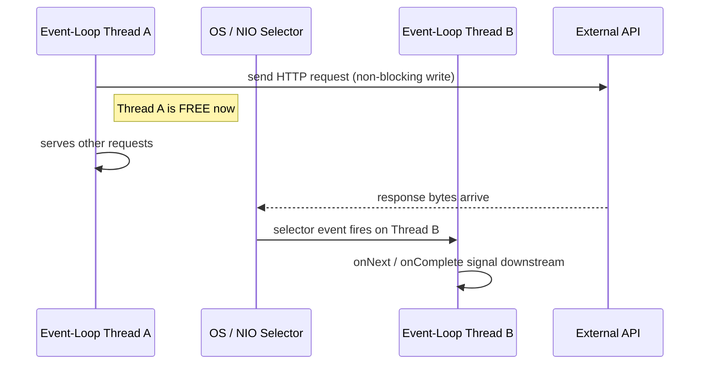
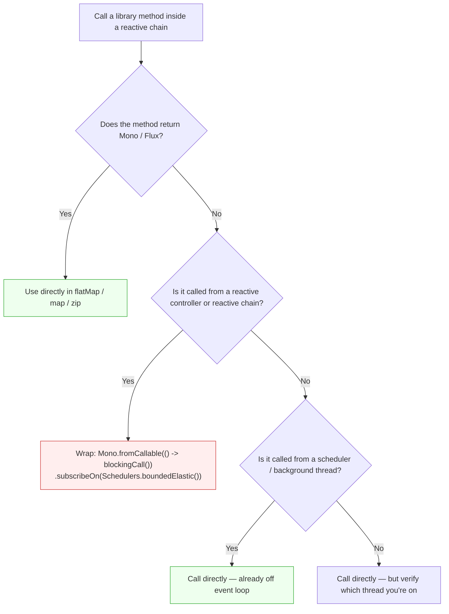
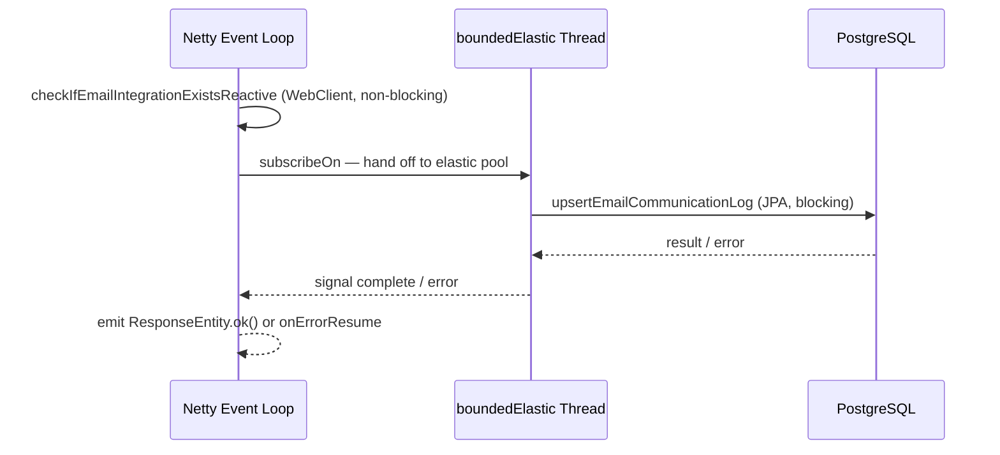

# Wrapping Blocking JPA Calls in a Reactive Chain

**Date:** 2026-04-14 | **Updated:** 2026-04-14
**Tags:** `reactor` `webflux` `jpa` `blocking` `schedulers` `reactive` `netty`

## Table of Contents

- [Summary](#summary)
- [How Netty Event-Loop Threads Handle Non-Blocking Calls](#how-netty-event-loop-threads-handle-non-blocking-calls)
- [Reactive vs Blocking Libraries in This Codebase](#reactive-vs-blocking-libraries-in-this-codebase)
  - [Decision Flowchart](#decision-flowchart)
  - [The .block() Antipattern](#the-block-antipattern)
- [The Problem](#the-problem)
- [The Fix](#the-fix)
- [subscribeOn Placement — Inner vs Outer](#subscribeon-placement--inner-vs-outer)
  - [Option A: Inner (recommended for this codebase)](#option-a-inner-recommended-for-this-codebase)
  - [Option B: Outer](#option-b-outer)
  - [When to use which](#when-to-use-which)
- [Quick Reference](#quick-reference)
- [References](#references)

## Summary

When a blocking JPA call sits inside a reactive `Mono`/`Flux` chain, it must be wrapped in [`Mono.fromCallable`](https://projectreactor.io/docs/core/release/api/reactor/core/publisher/Mono.html#fromCallable-java.util.concurrent.Callable-) and offloaded to [`Schedulers.boundedElastic()`](https://projectreactor.io/docs/core/snapshot/reference/coreFeatures/schedulers.html) to avoid blocking the Netty event loop.

## How Netty Event-Loop Threads Handle Non-Blocking Calls

Understanding **why** blocking on an event-loop thread is so damaging requires knowing how [Netty's threading model](https://netty.io/wiki/thread-model.html) works under non-blocking I/O.

Spring WebFlux runs on [Reactor Netty](https://projectreactor.io/docs/netty/release/reference/index.html), which creates a small, fixed-size pool of event-loop threads — by default [`availableProcessors() * 2`](https://www.baeldung.com/spring-webflux-concurrency). Each thread runs a tight loop: check the NIO [Selector](https://docs.oracle.com/en/java/javase/17/docs/api/java.base/java/nio/channels/Selector.html) for ready I/O events, dispatch callbacks, repeat.

When a `WebClient` call is made:

1. **Thread A** (event-loop) writes the HTTP request to the socket buffer and **returns immediately** — it does not wait for the response.
2. The OS kernel and NIO selector watch the socket asynchronously while Thread A is free to serve other requests.
3. When the response bytes arrive, **any available event-loop thread** picks up the selector event. This could be Thread A again, or Thread B — whichever is free at that moment.
4. That thread fires the `onNext` / `onComplete` signal, and the reactive chain continues from there.



This is why there are so few event-loop threads and why they must **never block**:

- A typical server has only **8-16 event-loop threads** (on a 4-8 core machine).
- Each thread can handle **thousands** of concurrent connections because it never waits.
- **One blocking call** (JPA, `Thread.sleep`, `.block()`) pins a thread and removes it from the pool — directly reducing throughput for the entire server.

This is also why inner `subscribeOn` placement matters: the non-blocking `WebClient` calls don't need a dedicated thread — they just need brief event-loop time to dispatch and receive. Only the blocking JPA call needs to be offloaded.

## Reactive vs Blocking Libraries in This Codebase

Whether you need `Mono.fromCallable` + `subscribeOn(boundedElastic)` depends entirely on whether the library is **natively reactive** or **blocking**. A reactive library returns `Mono`/`Flux` and never holds a thread while waiting — it works naturally on the event loop. A blocking library occupies the calling thread until the operation completes — it must be offloaded.

| Library | Type | Returns | Pattern in Reactive Chain |
| --- | --- | --- | --- |
| [WebClient](https://docs.spring.io/spring-framework/reference/web/webflux-webclient.html) | **Reactive** | `Mono<T>` / `Flux<T>` | Use directly — chains naturally with `flatMap`, `map`, `zip` |
| [Spring Data JPA](https://spring.io/projects/spring-data-jpa/) (Hibernate + JDBC) | **Blocking** | `T` / `Optional<T>` / `List<T>` | Wrap in `Mono.fromCallable(() -> ...)` + `.subscribeOn(Schedulers.boundedElastic())` |
| [db-scheduler](https://github.com/kagkarlsson/db-scheduler) | **Blocking** | `void` (task handlers) | No wrapping needed — runs on its own thread pool (8 threads), never on event loop |
| [Caffeine Cache](https://github.com/ben-manes/caffeine) | **Blocking** | `T` (sync API) | Wrap if called inside a reactive chain; fine in `@Cacheable` service methods called from scheduler |
| `AsyncUtils.safeExecuteInBackground` | **Reactive** | `void` (fire-and-forget) | Already wraps with `Mono.fromRunnable` + `boundedElastic` internally |

**The reactive alternative to JPA** is [Spring Data R2DBC](https://docs.spring.io/spring-data/relational/reference/r2dbc/repositories.html), which uses `ReactiveCrudRepository` and returns `Mono`/`Flux` natively. This codebase uses JPA, so every DB call is blocking.

### Decision Flowchart



### The .block() Antipattern

Calling `.block()` on a `Mono` converts a reactive call back to blocking — the calling thread waits until the result arrives. If that thread is a Netty event-loop thread, it defeats the purpose of WebFlux entirely.

```java
// BAD — blocks the event-loop thread waiting for WebClient response
var profile = sourcingMsRepository.getSdCandidateProfile(id).block();

// GOOD — stay reactive, chain with flatMap
return sourcingMsRepository.getSdCandidateProfile(id)
    .flatMap(profile -> /* continue processing */);
```

This codebase has ~14 files that still call `.block()` on WebClient results — acknowledged tech debt. Each `.block()` call pins an event-loop thread for the duration of the external HTTP call, reducing overall server throughput.

## The Problem

This project mixes Spring WebFlux (`WebClient`, `Mono`, `Flux`) with blocking JPA/Hibernate calls — an acknowledged tech-debt pattern noted in `CLAUDE.md`. The risk is that a blocking JPA call executed on the Netty event-loop thread starves the server of I/O threads.

**Real example — `EmailController.handleIncomingEmailLogs`:**

The original code called a blocking JPA method fire-and-forget inside a reactive `flatMap`:

```java
// BAD — blocking call on the event-loop thread, result ignored, errors swallowed
emailCommunicationService.checkIfEmailIntegrationExistsReactive(recipientEmail)
    .flatMap(exists -> {
        googleEmailsLogsService.upsertEmailCommunicationLog(emailLog); // blocks!
        return Mono.just(ResponseEntity.ok().build());
    });
```

Two issues:
1. **Blocks the Netty event-loop** — the JPA `save`/`findByMessageId` runs on the calling thread.
2. **Fire-and-forget** — the return value is discarded, so any DB exception is silently lost and never reaches the `.onErrorResume()` downstream.

## The Fix

Wrap the blocking call in [`Mono.fromCallable`](https://projectreactor.io/docs/core/release/api/reactor/core/publisher/Mono.html#fromCallable-java.util.concurrent.Callable-) and offload it with [`.subscribeOn(Schedulers.boundedElastic())`](https://projectreactor.io/docs/core/snapshot/reference/coreFeatures/schedulers.html):

```java
// GOOD — offloaded to boundedElastic, errors propagate, response waits for completion
return Mono.fromCallable(() -> googleEmailsLogsService.upsertEmailCommunicationLog(emailLog))
    .subscribeOn(Schedulers.boundedElastic())
    .then(Mono.just(ResponseEntity.ok().build()));
```

What this achieves:
- **`Mono.fromCallable`** — defers the blocking call into a `Mono` so it participates in the reactive chain.
- **`.subscribeOn(Schedulers.boundedElastic())`** — runs the callable on a [bounded elastic thread pool](https://projectreactor.io/docs/core/snapshot/reference/coreFeatures/schedulers.html) (default: 10 x CPU cores), designed for blocking I/O.
- **`.then()`** — the `200 OK` response is only emitted **after** the upsert completes. DB errors now propagate to `.onErrorResume()`.



## subscribeOn Placement — Inner vs Outer

[`subscribeOn`](https://spring.io/blog/2019/12/13/flight-of-the-flux-3-hopping-threads-and-schedulers/) propagates **upstream** through the entire chain regardless of where it is placed. This means you have a choice:

### Option A: Inner (recommended for this codebase)

Place `.subscribeOn(Schedulers.boundedElastic())` directly on the `Mono.fromCallable`:

```java
return checkIfThisEmailSentEarlierInTheSystemReactive(subject, sender) // WebClient calls stay on event-loop
    .flatMap(sentEarlier ->
        Mono.fromCallable(() -> blockingJpaCall())
            .subscribeOn(Schedulers.boundedElastic())  // only the JPA call moves off event-loop
            .then(Mono.just(ResponseEntity.ok().build()))
    );
```

- The upstream `WebClient` calls remain on the Netty event-loop where they belong.
- Only the blocking JPA call is offloaded.

### Option B: Outer

Place `.subscribeOn(Schedulers.boundedElastic())` on the outermost `Mono`:

```java
return checkIfThisEmailSentEarlierInTheSystemReactive(subject, sender) // also runs on boundedElastic now
    .flatMap(sentEarlier ->
        Mono.fromCallable(() -> blockingJpaCall())
            .then(Mono.just(ResponseEntity.ok().build()))
    )
    .subscribeOn(Schedulers.boundedElastic()); // entire chain on elastic pool
```

- Works correctly — the blocking call is still off the event loop.
- But the non-blocking `WebClient` calls inside `checkIfThisEmailSentEarlierInTheSystemReactive` **also** execute on `boundedElastic`, occupying a thread from the pool just to wait on non-blocking I/O.

### When to use which

| Scenario | Placement | Reason |
|----------|-----------|--------|
| Single blocking call in a mostly-reactive chain | **Inner** | Minimizes thread waste |
| Entire chain is blocking (e.g., all JPA, no WebClient) | **Outer** | Simpler, one `subscribeOn` for everything |
| Multiple blocking calls at different points | **Inner on each** | Each gets its own elastic thread |

For this codebase — where reactive `WebClient` calls precede blocking JPA calls — **inner placement is preferred**.

## Quick Reference

| Operator | Direction | Effect |
|----------|-----------|--------|
| [`subscribeOn`](https://projectreactor.io/docs/core/snapshot/reference/coreFeatures/schedulers.html) | Upstream (subscribe signal) | Affects **entire chain** regardless of position |
| [`publishOn`](https://projectreactor.io/docs/core/snapshot/reference/coreFeatures/schedulers.html) | Downstream (onNext signal) | Affects only operators **after** it |

| Scheduler | Use case |
|-----------|----------|
| `Schedulers.boundedElastic()` | Blocking I/O (JDBC, file, legacy libs) |
| `Schedulers.parallel()` | CPU-bound computation |
| `Schedulers.immediate()` | Current thread (testing) |

## Related

- [Reactive Programming in Java with Project Reactor and Spring WebFlux](reactive-programming-java.md) — foundational Mono/Flux guide.
- [Advanced Reactive Programming — Beyond the Basics](reactive-advanced-topics.md) — deeper scheduler and context propagation.
- [Reactor Schedulers and Threading](reactive/schedulers-and-threading.md) — `publishOn` vs `subscribeOn` deep dive.
- [R2DBC Deep Dive](data-repositories/r2dbc-deep-dive.md) — the reactive alternative to blocking JPA.
- [JPA Transactions in Spring Boot](jpa-transactions.md) — how `@Transactional` works with the blocking code being wrapped.
- [Virtual Threads and Spring Boot](spring-virtual-threads.md) — VTs as an alternative to reactive for blocking I/O.
- [Scaling MVC Before Virtual Threads](web-layer/mvc-high-throughput.md) — the MVC-side concurrency story.

---

## References

- [Threading and Schedulers — Reactor Core Reference Guide](https://projectreactor.io/docs/core/snapshot/reference/coreFeatures/schedulers.html) — official docs on `subscribeOn`, `publishOn`, and scheduler types
- [Netty Thread Model (Official Wiki)](https://netty.io/wiki/thread-model.html) — Netty's event-loop threading model and channel-to-thread binding
- [Flight of the Flux 3 — Hopping Threads and Schedulers (Spring Blog)](https://spring.io/blog/2019/12/13/flight-of-the-flux-3-hopping-threads-and-schedulers/) — deep dive on how `subscribeOn` propagates upstream vs `publishOn` downstream
- [Concurrency in Spring WebFlux (Baeldung)](https://www.baeldung.com/spring-webflux-concurrency) — threading model, event-loop pool sizing, and scheduler usage in WebFlux
- [Spring WebFlux Visualized: Threading and EventLoops (Stefan Kreidel)](https://www.stefankreidel.io/blog/spring-webflux) — visual walkthrough of how Netty event-loop threads handle requests without blocking
- [Handling the Blocking Method in Non-blocking Context Warning (Baeldung)](https://www.baeldung.com/java-handle-blocking-method-in-non-blocking-context-warning) — practical patterns for wrapping blocking calls in WebFlux
- [Spring Data R2DBC — R2DBC Repositories](https://docs.spring.io/spring-data/relational/reference/r2dbc/repositories.html) — the reactive alternative to JPA, using `ReactiveCrudRepository` with `Mono`/`Flux` returns
- [db-scheduler (GitHub)](https://github.com/kagkarlsson/db-scheduler) — persistent cluster-friendly scheduler for Java, JDBC-based (blocking by design)
- [reactor-core #1756 — Standard way to solve blocking that must happen](https://github.com/reactor/reactor-core/issues/1756) — community discussion on the canonical pattern for unavoidable blocking in reactive chains
