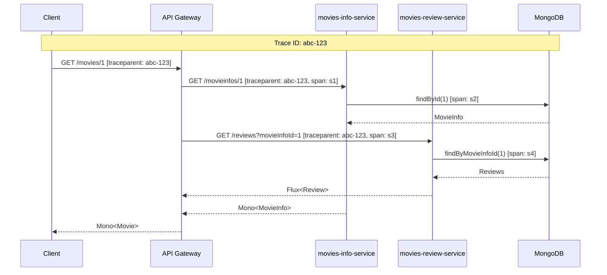
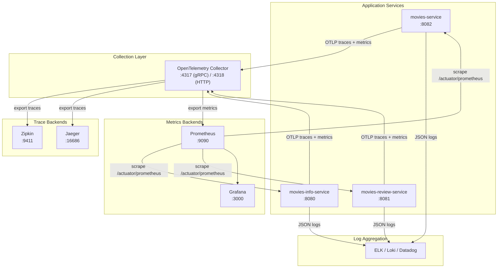

# Reactive Observability — Tracing, Logging, Metrics, and Health in Spring WebFlux

**Date:** 2026-04-15 | **Updated:** 2026-04-15
**Tags:** `reactive` `observability` `tracing` `micrometer` `opentelemetry` `prometheus` `logging` `actuator`

## Table of Contents

- [Summary](#summary)
- [Distributed Tracing](#distributed-tracing)
  - [Why Tracing is Different in Reactive](#why-tracing-is-different-in-reactive)
  - [Sleuth vs Micrometer Tracing](#sleuth-vs-micrometer-tracing)
  - [The Micrometer Observation API](#the-micrometer-observation-api)
  - [Auto-Instrumentation](#auto-instrumentation)
  - [Context Propagation — The Reactor Bridge](#context-propagation--the-reactor-bridge)
  - [Trace Propagation Headers](#trace-propagation-headers)
  - [Exporter Setup: Zipkin](#exporter-setup-zipkin)
  - [Exporter Setup: Jaeger via OTLP](#exporter-setup-jaeger-via-otlp)
  - [Exporter Setup: OpenTelemetry Collector](#exporter-setup-opentelemetry-collector)
  - [Spring Boot 4 — Native OTel Starter](#spring-boot-4--native-otel-starter)
  - [Custom Spans](#custom-spans)
- [Structured Logging](#structured-logging)
  - [Why MDC Breaks in Reactive](#why-mdc-breaks-in-reactive)
  - [JSON Logging with logstash-logback-encoder](#json-logging-with-logstash-logback-encoder)
  - [Automatic Trace ID in Logs](#automatic-trace-id-in-logs)
  - [Manual MDC Restoration](#manual-mdc-restoration)
  - [Correlation ID WebFilter](#correlation-id-webfilter)
  - [Log Level Strategy for Reactive Apps](#log-level-strategy-for-reactive-apps)
- [Metrics and Monitoring](#metrics-and-monitoring)
  - [Micrometer as the Metrics Facade](#micrometer-as-the-metrics-facade)
  - [Auto-Configured Metrics](#auto-configured-metrics)
  - [Custom Metrics](#custom-metrics)
  - [Backend: Prometheus + Grafana](#backend-prometheus--grafana)
  - [Backend: Datadog](#backend-datadog)
  - [Backend: New Relic](#backend-new-relic)
  - [Backend: OpenTelemetry Collector (OTLP)](#backend-opentelemetry-collector-otlp)
  - [Reactor-Specific Metrics](#reactor-specific-metrics)
- [Health and Actuator](#health-and-actuator)
  - [Actuator in WebFlux](#actuator-in-webflux)
  - [ReactiveHealthIndicator](#reactivehealthindicator)
  - [Custom Health Checks](#custom-health-checks)
  - [Kubernetes Probes](#kubernetes-probes)
  - [Securing Actuator Endpoints](#securing-actuator-endpoints)
- [Putting It Together](#putting-it-together)
  - [Architecture Diagram](#architecture-diagram)
  - [Docker Compose for Local Observability](#docker-compose-for-local-observability)
  - [Full Application Configuration](#full-application-configuration)
- [Related](#related)
- [References](#references)

---

## Summary

This document covers the four pillars of observability for reactive Spring Boot applications (3.x and 4.x): distributed tracing with Micrometer Tracing and OpenTelemetry, structured JSON logging with automatic trace ID correlation, metrics collection via Micrometer with Prometheus/Datadog/New Relic/OTLP backends, and reactive health checks with Spring Boot Actuator. All patterns target Micrometer Tracing (the current standard), not the legacy Spring Cloud Sleuth.

---

## Distributed Tracing

### Why Tracing is Different in Reactive

In a traditional servlet application, one thread handles one request end-to-end. Tracing libraries store the current span in a `ThreadLocal`, and every log statement and downstream call automatically picks it up.

In reactive, a single request hops across multiple threads — the Netty event-loop dispatches the request, `boundedElastic` handles a blocking call, `parallel` runs CPU work. `ThreadLocal` values are lost at each hop. Without explicit context propagation, trace IDs vanish mid-request.



### Sleuth vs Micrometer Tracing

| | Spring Cloud Sleuth | Micrometer Tracing |
|---|---|---|
| Spring Boot version | 2.x | **3.x and 4.x** |
| Status | Maintenance mode (EOL) | Active development |
| Abstraction | Sleuth-specific API | [Micrometer Observation API](https://docs.micrometer.io/micrometer/reference/observation.html) |
| Trace backends | Zipkin, Brave | OpenTelemetry, Brave, Zipkin, OTLP |
| Auto-instrumentation | Sleuth-specific | Via Spring Framework `ObservationRegistry` |

**If you're on Boot 3+ or 4+, use Micrometer Tracing exclusively.** Sleuth does not work with Boot 3.

Migration cheat sheet:
```
spring-cloud-starter-sleuth       → micrometer-tracing-bridge-otel (or -brave)
spring-cloud-sleuth-zipkin        → opentelemetry-exporter-zipkin
Tracer (Sleuth)                   → ObservationRegistry + Observation API
SpanCustomizer                    → Observation.Context
```

### The Micrometer Observation API

The [Micrometer Observation API](https://docs.micrometer.io/micrometer/reference/observation.html) is the unified abstraction — a single `Observation` produces metrics, traces, and logs simultaneously:

```java
@Autowired
ObservationRegistry observationRegistry;

public Mono<Movie> getMovie(String id) {
    return Observation.createNotStarted("movie.fetch", observationRegistry)
        .observe(() -> movieClient.retrieveMovieInfo(id)
            .flatMap(info -> reviewClient.retrieveReviews(id)
                .collectList()
                .map(reviews -> new Movie(info, reviews))));
}
```

Or with annotations (Boot 3.2+):

```java
@Observed(name = "movie.fetch", contextualName = "get-movie-by-id")
public Mono<Movie> getMovie(String id) {
    return movieClient.retrieveMovieInfo(id)
        .flatMap(info -> reviewClient.retrieveReviews(id)
            .collectList()
            .map(reviews -> new Movie(info, reviews)));
}
```

`@Observed` requires `ObservedAspect` bean registration:

```java
@Bean
ObservedAspect observedAspect(ObservationRegistry registry) {
    return new ObservedAspect(registry);
}
```

### Auto-Instrumentation

With the right starters, Spring Boot auto-instruments these components without any code changes:

| Component | What's Traced | Starter Required |
|-----------|--------------|-----------------|
| WebFlux server | Incoming HTTP requests | `spring-boot-starter-actuator` |
| WebClient | Outgoing HTTP calls | Automatic (uses ObservationRegistry) |
| Reactive MongoDB | Database operations | `spring-boot-starter-data-mongodb-reactive` |
| R2DBC | SQL operations | `spring-boot-starter-data-r2dbc` |
| Spring Security | Auth operations | `spring-boot-starter-security` |
| `@Scheduled` | Scheduled tasks | Automatic |

### Context Propagation — The Reactor Bridge

The [context-propagation library](https://docs.micrometer.io/context-propagation/reference/index.html) bridges `ThreadLocal` (where Micrometer stores the current Observation) and [Reactor's Context](https://projectreactor.io/docs/core/release/reference/advanced-contextPropagation.html) (where reactive chains carry state):

```xml
<dependency>
    <groupId>io.micrometer</groupId>
    <artifactId>context-propagation</artifactId>
</dependency>
```

Enable automatic propagation:

```properties
# application.properties
spring.reactor.context-propagation=auto
```

Or programmatically:

```java
// Call once at application startup
Hooks.enableAutomaticContextPropagation();
```

**How it works:**

1. When a reactive operator switches threads (via `publishOn`, `subscribeOn`), the context-propagation library snapshots all registered `ThreadLocal` values into the Reactor `Context`.
2. On the new thread, it restores those values from the `Context` back into `ThreadLocal`.
3. This means MDC, Micrometer Observation, and Spring Security context all survive thread hops automatically.

Without this library, you'd need manual `contextWrite` at every boundary. With it, tracing and logging work transparently.

### Trace Propagation Headers

Traces propagate between services via HTTP headers. Two standards exist:

**[W3C Trace Context](https://www.w3.org/TR/trace-context/)** (default in Spring Boot 3+):
```
traceparent: 00-0af7651916cd43dd8448eb211c80319c-b7ad6b7169203331-01
tracestate: congo=t61rcWkgMzE
```

**B3 (Zipkin legacy)**:
```
X-B3-TraceId: 0af7651916cd43dd8448eb211c80319c
X-B3-SpanId: b7ad6b7169203331
X-B3-Sampled: 1
```

Spring Boot auto-configures the propagator based on your exporter. To support both:

```properties
management.tracing.propagation.type=W3C,B3
```

### Exporter Setup: Zipkin

```xml
<dependency>
    <groupId>org.springframework.boot</groupId>
    <artifactId>spring-boot-starter-actuator</artifactId>
</dependency>
<dependency>
    <groupId>io.micrometer</groupId>
    <artifactId>micrometer-tracing-bridge-otel</artifactId>
</dependency>
<dependency>
    <groupId>io.opentelemetry</groupId>
    <artifactId>opentelemetry-exporter-zipkin</artifactId>
</dependency>
```

```yaml
# application.yml
management:
  tracing:
    sampling:
      probability: 1.0  # 100% in dev, lower in production
  zipkin:
    tracing:
      endpoint: http://localhost:9411/api/v2/spans
```

### Exporter Setup: Jaeger via OTLP

Jaeger 1.35+ supports OTLP natively, so use the OTLP exporter:

```xml
<dependency>
    <groupId>org.springframework.boot</groupId>
    <artifactId>spring-boot-starter-actuator</artifactId>
</dependency>
<dependency>
    <groupId>io.micrometer</groupId>
    <artifactId>micrometer-tracing-bridge-otel</artifactId>
</dependency>
<dependency>
    <groupId>io.opentelemetry</groupId>
    <artifactId>opentelemetry-exporter-otlp</artifactId>
</dependency>
```

```yaml
management:
  tracing:
    sampling:
      probability: 1.0
  otlp:
    tracing:
      endpoint: http://localhost:4318/v1/traces
```

### Exporter Setup: OpenTelemetry Collector

The vendor-neutral approach — send traces to the [OTel Collector](https://opentelemetry.io/docs/collector/), which fans out to any backend:

```yaml
# Same OTLP dependency as Jaeger setup
management:
  otlp:
    tracing:
      endpoint: http://localhost:4318/v1/traces
    metrics:
      export:
        endpoint: http://localhost:4318/v1/metrics
```

OTel Collector config (`otel-collector-config.yml`):

```yaml
receivers:
  otlp:
    protocols:
      grpc:
        endpoint: 0.0.0.0:4317
      http:
        endpoint: 0.0.0.0:4318

exporters:
  zipkin:
    endpoint: http://zipkin:9411/api/v2/spans
  prometheus:
    endpoint: 0.0.0.0:8889
  otlp/jaeger:
    endpoint: jaeger:4317
    tls:
      insecure: true

service:
  pipelines:
    traces:
      receivers: [otlp]
      exporters: [zipkin, otlp/jaeger]
    metrics:
      receivers: [otlp]
      exporters: [prometheus]
```

### Spring Boot 4 — Native OTel Starter

[Spring Boot 4](https://github.com/spring-projects/spring-boot/wiki/Spring-Boot-4.0-Release-Notes) introduces a first-class OpenTelemetry starter that simplifies the dependency tree:

```xml
<!-- Boot 4 only -->
<dependency>
    <groupId>org.springframework.boot</groupId>
    <artifactId>spring-boot-starter-opentelemetry</artifactId>
</dependency>
```

This single starter replaces the separate `micrometer-tracing-bridge-otel` + exporter dependencies. It auto-configures:
- OTLP span exporter
- OTLP metrics exporter
- Context propagation
- Resource attributes from `spring.application.name`

```yaml
# Boot 4 configuration
spring:
  application:
    name: movies-service
management:
  otlp:
    tracing:
      endpoint: http://collector:4318/v1/traces
    metrics:
      export:
        endpoint: http://collector:4318/v1/metrics
```

### Custom Spans

For business-critical operations that aren't auto-instrumented:

**Using ObservationRegistry directly:**

```java
@Service
public class PricingService {
    private final ObservationRegistry registry;

    public Mono<Price> calculatePrice(String productId) {
        Observation observation = Observation.createNotStarted("pricing.calculate", registry)
            .lowCardinalityKeyValue("product.type", "standard");

        return Mono.defer(() -> {
                observation.start();
                return fetchBasePrice(productId)
                    .flatMap(base -> applyDiscounts(base))
                    .doOnSuccess(price -> {
                        observation.highCardinalityKeyValue("price.value", 
                            String.valueOf(price.getAmount()));
                        observation.stop();
                    })
                    .doOnError(observation::error);
            })
            .contextWrite(ctx -> ctx.put(ObservationThreadLocalAccessor.KEY, observation));
    }
}
```

**Using `@Observed` annotation (simpler):**

```java
@Observed(
    name = "pricing.calculate",
    contextualName = "calculate-price",
    lowCardinalityKeyValues = {"product.type", "standard"}
)
public Mono<Price> calculatePrice(String productId) {
    return fetchBasePrice(productId)
        .flatMap(this::applyDiscounts);
}
```

**Using the Observation tap operator (Reactor-native):**

```java
public Mono<Price> calculatePrice(String productId) {
    return fetchBasePrice(productId)
        .flatMap(this::applyDiscounts)
        .name("pricing.calculate")
        .tag("product.type", "standard")
        .tap(Micrometer.observation(registry));
}
```

---

## Structured Logging

### Why MDC Breaks in Reactive

SLF4J's [Mapped Diagnostic Context (MDC)](https://www.slf4j.org/manual.html#mdc) stores contextual data in `ThreadLocal`. In reactive applications, the processing thread changes mid-request, and MDC values disappear:

```java
MDC.put("traceId", "abc-123");
log.info("Start");  // traceId=abc-123 ✓

webClient.get().uri("/api").retrieve().bodyToMono(String.class)
    .map(response -> {
        log.info("Got response");  // traceId=null ✗ (different thread)
        return response;
    });
```

The fix is the [context-propagation library](#context-propagation--the-reactor-bridge) from the tracing section — it automatically restores MDC across thread hops.

### JSON Logging with logstash-logback-encoder

[logstash-logback-encoder](https://github.com/logfellow/logstash-logback-encoder) produces structured JSON logs that integrate with ELK, Datadog, and any log aggregator:

```xml
<dependency>
    <groupId>net.logstash.logback</groupId>
    <artifactId>logstash-logback-encoder</artifactId>
    <version>8.0</version>
</dependency>
```

`src/main/resources/logback-spring.xml`:

```xml
<?xml version="1.0" encoding="UTF-8"?>
<configuration>
    <include resource="org/springframework/boot/logging/logback/defaults.xml"/>

    <!-- Console: structured JSON for production -->
    <appender name="JSON_CONSOLE" class="ch.qos.logback.core.ConsoleAppender">
        <encoder class="net.logstash.logback.encoder.LogstashEncoder">
            <includeMdcKeyName>traceId</includeMdcKeyName>
            <includeMdcKeyName>spanId</includeMdcKeyName>
            <includeMdcKeyName>correlationId</includeMdcKeyName>
            <fieldNames>
                <timestamp>@timestamp</timestamp>
                <version>[ignore]</version>
            </fieldNames>
        </encoder>
    </appender>

    <!-- Console: human-readable for local dev -->
    <appender name="PLAIN_CONSOLE" class="ch.qos.logback.core.ConsoleAppender">
        <encoder>
            <pattern>%d{HH:mm:ss.SSS} [%thread] [%X{traceId:-}/%X{spanId:-}] %-5level %logger{36} - %msg%n</pattern>
        </encoder>
    </appender>

    <!-- Profile-based switching -->
    <springProfile name="local">
        <root level="INFO">
            <appender-ref ref="PLAIN_CONSOLE"/>
        </root>
    </springProfile>

    <springProfile name="!local">
        <root level="INFO">
            <appender-ref ref="JSON_CONSOLE"/>
        </root>
    </springProfile>
</configuration>
```

JSON output example:

```json
{
  "@timestamp": "2026-04-15T10:30:45.123Z",
  "level": "INFO",
  "logger_name": "com.reactivespring.service.MoviesInfoService",
  "message": "Fetching movie info for id: 1",
  "thread_name": "reactor-http-nio-2",
  "traceId": "0af7651916cd43dd8448eb211c80319c",
  "spanId": "b7ad6b7169203331",
  "correlationId": "req-abc-123"
}
```

### Automatic Trace ID in Logs

With `spring.reactor.context-propagation=auto` and Micrometer Tracing configured, trace IDs automatically appear in MDC and are picked up by the log pattern. No manual code needed.

The bridge works because:
1. Micrometer Tracing stores the current span in a `ThreadLocal`
2. The context-propagation library registers a `ThreadLocalAccessor` for it
3. Reactor's automatic hook snapshots it into the Context on thread switches
4. On the new thread, it restores the `ThreadLocal`, which updates MDC

### Manual MDC Restoration

If automatic propagation is unavailable (older libraries, custom threads), restore MDC manually using `doOnEach`:

```java
public static <T> Consumer<Signal<T>> logOnNext(Consumer<T> action) {
    return signal -> {
        if (!signal.isOnNext()) return;
        ContextView ctx = signal.getContextView();
        try (MDC.MDCCloseable traceId = MDC.putCloseable("traceId", 
                ctx.getOrDefault("traceId", ""));
             MDC.MDCCloseable spanId = MDC.putCloseable("spanId", 
                ctx.getOrDefault("spanId", ""))) {
            action.accept(signal.get());
        }
    };
}

// Usage
flux.doOnEach(logOnNext(item -> log.info("Processing item: {}", item)));
```

### Correlation ID WebFilter

Inject a correlation ID into the Reactor Context at the edge of each request:

```java
@Component
@Order(Ordered.HIGHEST_PRECEDENCE)
public class CorrelationIdWebFilter implements WebFilter {

    private static final String CORRELATION_HEADER = "X-Correlation-Id";

    @Override
    public Mono<Void> filter(ServerWebExchange exchange, WebFilterChain chain) {
        String correlationId = exchange.getRequest().getHeaders()
            .getFirst(CORRELATION_HEADER);
        
        if (correlationId == null) {
            correlationId = UUID.randomUUID().toString();
        }

        // Add to response header for client correlation
        exchange.getResponse().getHeaders()
            .add(CORRELATION_HEADER, correlationId);

        String finalCorrelationId = correlationId;
        return chain.filter(exchange)
            .contextWrite(ctx -> ctx.put("correlationId", finalCorrelationId));
    }
}
```

Propagate to downstream services via `WebClient` filter:

```java
@Bean
public WebClient webClient(WebClient.Builder builder) {
    return builder
        .filter((request, next) -> Mono.deferContextual(ctx -> {
            String correlationId = ctx.getOrDefault("correlationId", "");
            ClientRequest filtered = ClientRequest.from(request)
                .header("X-Correlation-Id", correlationId)
                .build();
            return next.exchange(filtered);
        }))
        .build();
}
```

### Log Level Strategy for Reactive Apps

| Level | Use For | Example |
|-------|---------|---------|
| `ERROR` | Unrecoverable failures, data loss | DB connection failure after retries exhausted |
| `WARN` | Recoverable failures, degraded behavior | Fallback to cache after API timeout |
| `INFO` | Business events, request lifecycle | Order placed, payment processed |
| `DEBUG` | Technical flow, operator decisions | Cache hit/miss, retry attempt |
| `TRACE` | Signal-level detail, raw payloads | Full HTTP request/response body |

```yaml
logging:
  level:
    root: INFO
    com.reactivespring: DEBUG
    reactor.netty.http.client: DEBUG     # See outgoing HTTP requests
    org.springframework.data.mongodb: DEBUG  # See MongoDB queries
    io.micrometer.tracing: DEBUG         # See span lifecycle
```

**Warning:** Never log at `DEBUG` or `TRACE` in production for high-throughput reactive services — the volume will overwhelm log aggregators. Use `INFO` with structured fields instead.

---

## Metrics and Monitoring

### Micrometer as the Metrics Facade

[Micrometer](https://docs.micrometer.io/micrometer/reference/) is to metrics what SLF4J is to logging — a vendor-neutral facade. You write metrics code once, and the registry implementation ships them to Prometheus, Datadog, New Relic, or any other backend.

```xml
<dependency>
    <groupId>org.springframework.boot</groupId>
    <artifactId>spring-boot-starter-actuator</artifactId>
</dependency>
<!-- Actuator includes micrometer-core automatically -->
```

### Auto-Configured Metrics

Spring Boot auto-configures metrics for these components out of the box:

| Category | Metrics Prefix | Examples |
|----------|---------------|---------|
| HTTP Server | `http.server.requests` | Request count, duration, status codes |
| HTTP Client (WebClient) | `http.client.requests` | Outgoing call duration, status |
| MongoDB | `mongodb.driver.commands` | Command duration, type |
| JVM | `jvm.*` | Heap usage, GC pauses, thread count |
| System | `system.*` | CPU usage, load average |
| Process | `process.*` | Uptime, open file descriptors |
| Logback | `logback.events` | Log events by level |

### Custom Metrics

**Counter** — monotonically increasing value:

```java
@Service
public class OrderService {
    private final Counter orderCounter;

    public OrderService(MeterRegistry registry) {
        this.orderCounter = Counter.builder("orders.placed")
            .description("Total orders placed")
            .tag("channel", "web")
            .register(registry);
    }

    public Mono<Order> placeOrder(OrderRequest request) {
        return processOrder(request)
            .doOnSuccess(order -> orderCounter.increment());
    }
}
```

**Gauge** — current value snapshot:

```java
@Bean
public Gauge activeConnectionsGauge(MeterRegistry registry, ConnectionPool pool) {
    return Gauge.builder("connections.active", pool, ConnectionPool::getActiveCount)
        .description("Current active database connections")
        .register(registry);
}
```

**Timer** — measures duration:

```java
private final Timer processingTimer;

public OrderService(MeterRegistry registry) {
    this.processingTimer = Timer.builder("order.processing.time")
        .description("Time to process an order")
        .publishPercentiles(0.5, 0.95, 0.99)
        .register(registry);
}

public Mono<Order> placeOrder(OrderRequest request) {
    return Mono.defer(() -> {
        Timer.Sample sample = Timer.start();
        return processOrder(request)
            .doFinally(signal -> sample.stop(processingTimer));
    });
}
```

**DistributionSummary** — measures distribution of values:

```java
DistributionSummary orderSize = DistributionSummary.builder("order.item.count")
    .description("Number of items per order")
    .publishPercentiles(0.5, 0.95)
    .register(registry);

orderSize.record(order.getItems().size());
```

### Backend: Prometheus + Grafana

```xml
<dependency>
    <groupId>io.micrometer</groupId>
    <artifactId>micrometer-registry-prometheus</artifactId>
</dependency>
```

```yaml
management:
  endpoints:
    web:
      exposure:
        include: health, info, prometheus, metrics
  prometheus:
    metrics:
      export:
        enabled: true
```

This exposes a `/actuator/prometheus` scrape endpoint. Configure Prometheus to scrape it:

```yaml
# prometheus.yml
scrape_configs:
  - job_name: 'movies-service'
    metrics_path: '/actuator/prometheus'
    scrape_interval: 15s
    static_configs:
      - targets: ['movies-service:8082']
        labels:
          application: 'movies-service'
  - job_name: 'movies-info-service'
    metrics_path: '/actuator/prometheus'
    scrape_interval: 15s
    static_configs:
      - targets: ['movies-info-service:8080']
        labels:
          application: 'movies-info-service'
```

### Backend: Datadog

Two approaches — [direct HTTP API](https://docs.micrometer.io/micrometer/reference/implementations/datadog.html) or [DogStatsD](https://docs.micrometer.io/micrometer/reference/implementations/statsD.html):

**Direct API (simpler, no agent needed):**

```xml
<dependency>
    <groupId>io.micrometer</groupId>
    <artifactId>micrometer-registry-datadog</artifactId>
</dependency>
```

```yaml
management:
  datadog:
    metrics:
      export:
        api-key: ${DD_API_KEY}
        application-key: ${DD_APP_KEY}
        step: 30s
```

**DogStatsD (via local Datadog Agent):**

```xml
<dependency>
    <groupId>io.micrometer</groupId>
    <artifactId>micrometer-registry-statsd</artifactId>
</dependency>
```

```yaml
management:
  statsd:
    metrics:
      export:
        flavor: datadog
        host: localhost
        port: 8125
```

### Backend: New Relic

```xml
<dependency>
    <groupId>io.micrometer</groupId>
    <artifactId>micrometer-registry-new-relic</artifactId>
</dependency>
```

```yaml
management:
  newrelic:
    metrics:
      export:
        api-key: ${NEW_RELIC_API_KEY}
        account-id: ${NEW_RELIC_ACCOUNT_ID}
        step: 30s
```

### Backend: OpenTelemetry Collector (OTLP)

The vendor-neutral approach — push metrics to OTel Collector, which routes to any backend:

```xml
<dependency>
    <groupId>io.micrometer</groupId>
    <artifactId>micrometer-registry-otlp</artifactId>
</dependency>
```

```yaml
management:
  otlp:
    metrics:
      export:
        url: http://localhost:4318/v1/metrics
        step: 30s
        resource-attributes:
          service.name: ${spring.application.name}
          deployment.environment: ${ENVIRONMENT:local}
```

### Reactor-Specific Metrics

Enable Reactor metrics to track scheduler activity and subscription behavior:

```java
@Configuration
public class ReactorMetricsConfig {
    @PostConstruct
    public void enableReactorMetrics() {
        Schedulers.enableMetrics();  // Track scheduler thread pool usage
    }
}
```

This exposes:

| Metric | What it Shows |
|--------|--------------|
| `reactor.scheduler.tasks.pending` | Queued tasks per scheduler |
| `reactor.scheduler.tasks.completed` | Completed tasks |
| `reactor.scheduler.workers.active` | Active worker threads |

For per-pipeline metrics, use the `.metrics()` operator:

```java
webClient.get().uri("/api")
    .retrieve().bodyToFlux(Data.class)
    .name("data.pipeline")
    .metrics()  // Emits subscription, request, and onNext metrics
    .subscribe();
```

---

## Health and Actuator

### Actuator in WebFlux

[Spring Boot Actuator](https://docs.spring.io/spring-boot/reference/actuator/index.html) works identically in WebFlux and MVC — the endpoints are auto-configured for the reactive stack:

```xml
<dependency>
    <groupId>org.springframework.boot</groupId>
    <artifactId>spring-boot-starter-actuator</artifactId>
</dependency>
```

```yaml
management:
  endpoints:
    web:
      exposure:
        include: health, info, metrics, prometheus, env, loggers
  endpoint:
    health:
      show-details: when-authorized
  info:
    env:
      enabled: true
    build:
      enabled: true
    git:
      enabled: true
      mode: full
```

Key [endpoints](https://docs.spring.io/spring-boot/reference/actuator/endpoints.html):

| Endpoint | URL | Purpose |
|----------|-----|---------|
| health | `/actuator/health` | Application health status |
| info | `/actuator/info` | Build info, git info |
| metrics | `/actuator/metrics` | List all metric names |
| prometheus | `/actuator/prometheus` | Prometheus scrape endpoint |
| loggers | `/actuator/loggers` | View/change log levels at runtime |
| env | `/actuator/env` | Environment properties |

### ReactiveHealthIndicator

For reactive applications, implement [`ReactiveHealthIndicator`](https://docs.spring.io/spring-boot/docs/3.2.5/api/org/springframework/boot/actuate/health/ReactiveHealthIndicator.html) instead of the blocking `HealthIndicator`:

```java
@Component
public class MongoHealthIndicator implements ReactiveHealthIndicator {

    private final ReactiveMongoTemplate mongoTemplate;

    @Override
    public Mono<Health> health() {
        return mongoTemplate.executeCommand("{ ping: 1 }")
            .map(result -> Health.up()
                .withDetail("database", "MongoDB")
                .withDetail("status", "reachable")
                .build())
            .onErrorResume(ex -> Mono.just(Health.down()
                .withDetail("database", "MongoDB")
                .withDetail("error", ex.getMessage())
                .build()));
    }
}
```

### Custom Health Checks

**External service health check:**

```java
@Component
public class MoviesInfoServiceHealth implements ReactiveHealthIndicator {

    private final WebClient webClient;

    public MoviesInfoServiceHealth(WebClient.Builder builder) {
        this.webClient = builder.baseUrl("http://localhost:8080").build();
    }

    @Override
    public Mono<Health> health() {
        return webClient.get()
            .uri("/actuator/health")
            .retrieve()
            .bodyToMono(String.class)
            .map(body -> Health.up()
                .withDetail("service", "movies-info-service")
                .build())
            .timeout(Duration.ofSeconds(3))
            .onErrorResume(ex -> Mono.just(Health.down()
                .withDetail("service", "movies-info-service")
                .withDetail("error", ex.getMessage())
                .build()));
    }
}
```

**Using AbstractReactiveHealthIndicator** for simpler error handling:

```java
@Component
public class CacheHealthIndicator extends AbstractReactiveHealthIndicator {

    private final ReactiveCacheClient cacheClient;

    @Override
    protected Mono<Health> doHealthCheck(Health.Builder builder) {
        return cacheClient.ping()
            .map(response -> builder
                .up()
                .withDetail("cache", "Redis")
                .withDetail("response", response)
                .build());
        // Errors automatically result in Health.down() with exception details
    }
}
```

### Kubernetes Probes

Spring Boot 2.3+ auto-configures [liveness and readiness probes](https://docs.spring.io/spring-boot/reference/actuator/endpoints.html#actuator.endpoints.kubernetes-probes) when running in Kubernetes:

```yaml
management:
  endpoint:
    health:
      probes:
        enabled: true
      group:
        readiness:
          include: readinessState, mongo, moviesInfoService
        liveness:
          include: livenessState
```

Kubernetes deployment:

```yaml
apiVersion: apps/v1
kind: Deployment
spec:
  template:
    spec:
      containers:
        - name: movies-service
          livenessProbe:
            httpGet:
              path: /actuator/health/liveness
              port: 8082
            initialDelaySeconds: 15
            periodSeconds: 10
            failureThreshold: 3
          readinessProbe:
            httpGet:
              path: /actuator/health/readiness
              port: 8082
            initialDelaySeconds: 10
            periodSeconds: 5
            failureThreshold: 3
          startupProbe:
            httpGet:
              path: /actuator/health/liveness
              port: 8082
            initialDelaySeconds: 5
            periodSeconds: 5
            failureThreshold: 30
```

| Probe | Purpose | Failure Effect |
|-------|---------|---------------|
| **Startup** | Is the app still starting up? | Delays liveness/readiness checks |
| **Liveness** | Is the app stuck/deadlocked? | Kubernetes restarts the pod |
| **Readiness** | Can the app handle traffic? | Kubernetes stops routing traffic |

### Securing Actuator Endpoints

Actuator endpoints expose sensitive data. Secure them in production:

```java
@Bean
public SecurityWebFilterChain actuatorSecurity(ServerHttpSecurity http) {
    return http
        .securityMatcher(new PathPatternParserServerWebExchangeMatcher("/actuator/**"))
        .authorizeExchange(exchanges -> exchanges
            .pathMatchers("/actuator/health/**").permitAll()  // Probes are public
            .pathMatchers("/actuator/info").permitAll()
            .anyExchange().hasRole("ACTUATOR"))
        .httpBasic(Customizer.withDefaults())
        .build();
}
```

Or restrict by network:

```yaml
management:
  server:
    port: 9090  # Separate management port — only expose internally
```

---

## Putting It Together

### Architecture Diagram



### Docker Compose for Local Observability

A complete local stack for development:

```yaml
# docker-compose-observability.yml
version: '3.8'

services:
  # Trace backend
  zipkin:
    image: openzipkin/zipkin:latest
    ports:
      - "9411:9411"

  # Alternative trace backend
  jaeger:
    image: jaegertracing/all-in-one:latest
    ports:
      - "16686:16686"   # UI
      - "4317:4317"     # OTLP gRPC (if connecting directly)

  # Vendor-neutral collector
  otel-collector:
    image: otel/opentelemetry-collector-contrib:latest
    command: ["--config=/etc/otel-collector-config.yml"]
    volumes:
      - ./otel-collector-config.yml:/etc/otel-collector-config.yml
    ports:
      - "4317:4317"     # OTLP gRPC
      - "4318:4318"     # OTLP HTTP
      - "8889:8889"     # Prometheus exporter
    depends_on:
      - zipkin
      - jaeger

  # Metrics scraping
  prometheus:
    image: prom/prometheus:latest
    volumes:
      - ./prometheus.yml:/etc/prometheus/prometheus.yml
    ports:
      - "9090:9090"

  # Dashboards
  grafana:
    image: grafana/grafana:latest
    ports:
      - "3000:3000"
    environment:
      - GF_SECURITY_ADMIN_PASSWORD=admin
    volumes:
      - grafana-storage:/var/lib/grafana
    depends_on:
      - prometheus

volumes:
  grafana-storage:
```

### Full Application Configuration

A complete `application.yml` combining all observability features:

```yaml
spring:
  application:
    name: movies-service
  reactor:
    context-propagation: auto

management:
  # Actuator endpoints
  endpoints:
    web:
      exposure:
        include: health, info, prometheus, metrics, loggers
  endpoint:
    health:
      show-details: when-authorized
      probes:
        enabled: true
      group:
        readiness:
          include: readinessState, mongo
        liveness:
          include: livenessState
  info:
    build:
      enabled: true
    git:
      enabled: true

  # Tracing
  tracing:
    sampling:
      probability: ${TRACE_SAMPLING:1.0}
    propagation:
      type: W3C

  # OTLP export (traces + metrics to OTel Collector)
  otlp:
    tracing:
      endpoint: ${OTEL_EXPORTER_OTLP_ENDPOINT:http://localhost:4318}/v1/traces
    metrics:
      export:
        url: ${OTEL_EXPORTER_OTLP_ENDPOINT:http://localhost:4318}/v1/metrics
        step: 30s
        resource-attributes:
          service.name: ${spring.application.name}
          deployment.environment: ${ENVIRONMENT:local}

  # Prometheus scrape endpoint (in addition to OTLP push)
  prometheus:
    metrics:
      export:
        enabled: true

logging:
  level:
    root: INFO
    com.reactivespring: ${LOG_LEVEL:INFO}
```

Corresponding dependencies in `build.gradle`:

```groovy
dependencies {
    // Core
    implementation 'org.springframework.boot:spring-boot-starter-webflux'
    implementation 'org.springframework.boot:spring-boot-starter-actuator'
    
    // Tracing
    implementation 'io.micrometer:micrometer-tracing-bridge-otel'
    implementation 'io.opentelemetry:opentelemetry-exporter-otlp'
    
    // Context propagation (auto ThreadLocal <-> Reactor Context)
    implementation 'io.micrometer:context-propagation'
    
    // Metrics backends
    runtimeOnly 'io.micrometer:micrometer-registry-prometheus'
    // runtimeOnly 'io.micrometer:micrometer-registry-datadog'
    // runtimeOnly 'io.micrometer:micrometer-registry-otlp'
    
    // Structured logging
    implementation 'net.logstash.logback:logstash-logback-encoder:8.0'
}
```

---

## Related

- [Advanced Reactive Programming — Beyond the Basics](reactive-advanced-topics.md) — Reactor Context and context propagation.
- [Wrapping Blocking JPA Calls in a Reactive Chain](reactive-blocking-jpa-pattern.md) — how traces flow through blocking call boundaries.
- [Reactive Programming in Java](reactive-programming-java.md) — foundational Mono/Flux guide.
- [Distributed Tracing and Metrics Beyond Logs](observability/distributed-tracing.md) — OpenTelemetry, Prometheus, RED/USE — the non-reactive counterpart.
- [Logging in Java and Spring Boot](logging.md) — SLF4J, MDC, structured JSON logs.
- [Actuator Deep Dive](actuator-deep-dive.md) — health indicators, Micrometer endpoint exposure.
- [GC Impact on Reactive and Streaming](jvm-gc/reactive-impact.md) — Micrometer JVM metrics for GC.

## References

- [Tracing Support — Micrometer Tracing](https://docs.micrometer.io/tracing/reference/index.html) — official Micrometer Tracing facade docs for Brave and OpenTelemetry bridges
- [Tracing — Spring Boot Reference](https://docs.spring.io/spring-boot/reference/actuator/tracing.html) — Spring Boot auto-configuration for Micrometer Tracing with OTLP and Zipkin
- [Observability — Spring Boot Reference](https://docs.spring.io/spring-boot/reference/actuator/observability.html) — Observation API, `@Observed`, `@Timed`, `@Counted` annotations
- [Micrometer Observation API](https://docs.micrometer.io/micrometer/reference/observation.html) — unified abstraction producing metrics, traces, and logs from a single Observation
- [Context Propagation — Micrometer](https://docs.micrometer.io/context-propagation/reference/index.html) — ThreadLocalAccessor, ContextSnapshot, automatic ThreadLocal ↔ Reactor Context bridging
- [Context-Propagation Support — Reactor Core](https://projectreactor.io/docs/core/release/reference/advanced-contextPropagation.html) — Reactor's integration with the context-propagation library
- [Spring Boot 4.0 Release Notes](https://github.com/spring-projects/spring-boot/wiki/Spring-Boot-4.0-Release-Notes) — native OTel starter, `@ObservationKeyValue`, coroutine context propagation
- [Production-Ready Features — Spring Boot Actuator](https://docs.spring.io/spring-boot/reference/actuator/index.html) — health, metrics, info, and custom endpoints
- [Micrometer Prometheus Registry](https://docs.micrometer.io/micrometer/reference/implementations/prometheus.html) — Prometheus scrape endpoint configuration and histogram tuning
- [Micrometer Datadog Registry](https://docs.micrometer.io/micrometer/reference/implementations/datadog.html) — direct HTTP API publishing to Datadog
- [logstash-logback-encoder (GitHub)](https://github.com/logfellow/logstash-logback-encoder) — structured JSON logging for Logback with MDC integration
- [W3C Trace Context Specification](https://www.w3.org/TR/trace-context/) — `traceparent` and `tracestate` HTTP headers for distributed trace propagation
- [OpenTelemetry Java SDK](https://opentelemetry.io/docs/languages/java/) — OTel API, SDK, and auto-instrumentation for Java
- [ReactiveHealthIndicator Javadoc](https://docs.spring.io/spring-boot/docs/3.2.5/api/org/springframework/boot/actuate/health/ReactiveHealthIndicator.html) — reactive health check interface returning `Mono<Health>`
