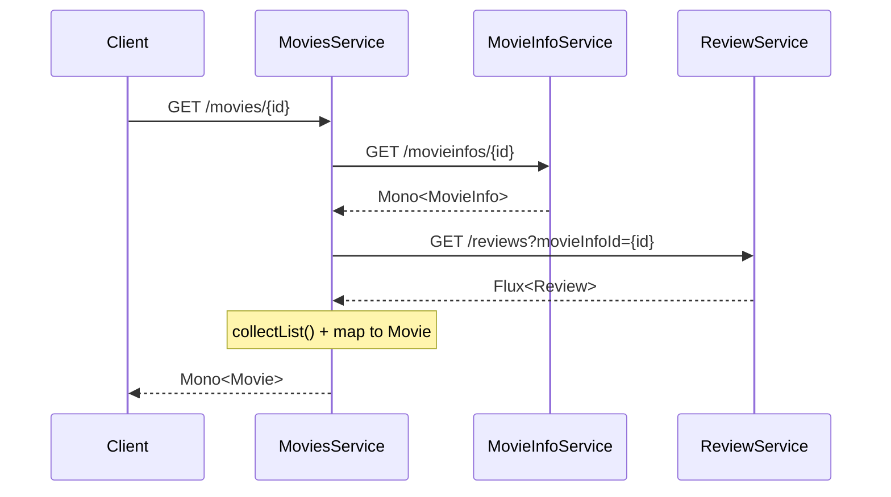
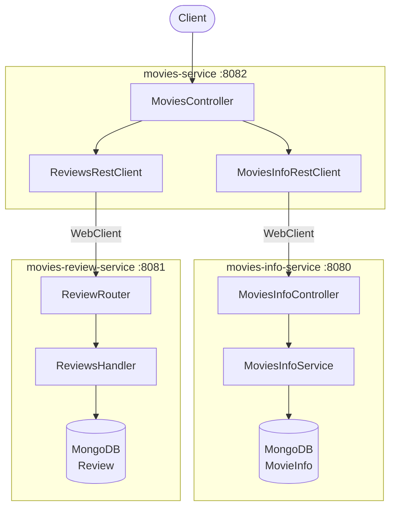

# Reactive Programming in Java with Project Reactor and Spring WebFlux

**Date:** 2026-04-14 | **Updated:** 2026-04-14
**Tags:** `reactive` `java` `project-reactor` `spring-webflux` `flux` `mono` `webclient`

## Table of Contents

- [Summary](#summary)
- [Foundations](#foundations)
  - [What is Reactive Programming?](#what-is-reactive-programming)
  - [Reactive Streams Specification](#reactive-streams-specification)
  - [Project Reactor](#project-reactor)
- [Core Types: Flux and Mono](#core-types-flux-and-mono)
  - [Flux (0..N elements)](#flux-0n-elements)
  - [Mono (0..1 element)](#mono-01-element)
  - [Immutability of Reactive Chains](#immutability-of-reactive-chains)
- [Operators](#operators)
  - [Transformation: map](#transformation-map)
  - [Async Transformation: flatMap vs concatMap](#async-transformation-flatmap-vs-concatmap)
  - [Filtering: filter](#filtering-filter)
  - [Combining: concat, merge, zip](#combining-concat-merge-zip)
  - [Empty Handling: defaultIfEmpty vs switchIfEmpty](#empty-handling-defaultifempty-vs-switchifempty)
  - [Composition: transform](#composition-transform)
  - [Type Conversion: flatMapMany and collectList](#type-conversion-flatmapmany-and-collectlist)
  - [Side Effects: doOn* Operators](#side-effects-doon-operators)
  - [Operator Selection Quick Reference](#operator-selection-quick-reference)
- [Spring WebFlux](#spring-webflux)
  - [Annotated Controllers](#annotated-controllers)
  - [Functional Routing](#functional-routing)
- [Reactive Data Access with MongoDB](#reactive-data-access-with-mongodb)
  - [ReactiveMongoRepository](#reactivemongorepository)
  - [Reactive Service Layer](#reactive-service-layer)
- [WebClient: Non-Blocking HTTP](#webclient-non-blocking-http)
  - [Basic Request/Response](#basic-requestresponse)
  - [Error Handling with onStatus](#error-handling-with-onstatus)
  - [Lower-Level Control with exchangeToMono](#lower-level-control-with-exchangetomono)
  - [Retry Strategies](#retry-strategies)
  - [Service Composition](#service-composition)
- [Sinks: Programmatic Emission](#sinks-programmatic-emission)
  - [Replay Sinks](#replay-sinks)
  - [Multicast Sinks](#multicast-sinks)
  - [Server-Sent Events / Streaming](#server-sent-events--streaming)
- [Error Handling Patterns](#error-handling-patterns)
  - [@ControllerAdvice (Annotation-Based)](#controlleradvice-annotation-based)
  - [ErrorWebExceptionHandler (Functional)](#errorwebexceptionhandler-functional)
  - [Custom Exception Hierarchy](#custom-exception-hierarchy)
- [Validation](#validation)
  - [Bean Validation (JSR-303)](#bean-validation-jsr-303)
  - [Programmatic Validation](#programmatic-validation)
- [Testing Reactive Streams](#testing-reactive-streams)
  - [StepVerifier Basics](#stepverifier-basics)
  - [Virtual Time for Delayed Emissions](#virtual-time-for-delayed-emissions)
- [Architecture: Reactive Microservices](#architecture-reactive-microservices)
- [References](#references)

---

## Summary

This document is a comprehensive guide to reactive programming in Java using [Project Reactor](https://projectreactor.io/docs/core/release/reference/coreFeatures.html) and [Spring WebFlux](https://docs.spring.io/spring-framework/reference/web/webflux.html). It covers the foundational theory (Reactive Streams, backpressure, push-based data flow), the two core types (`Flux` and `Mono`), all major operators, and practical patterns for building reactive microservices with Spring Boot including reactive MongoDB access, non-blocking HTTP with WebClient, streaming with Sinks, error handling, validation, and testing with StepVerifier.

---

## Foundations

### What is Reactive Programming?

Reactive programming is a declarative programming paradigm built around **asynchronous data streams**. Instead of pulling data synchronously (request-response), the data is **pushed** to subscribers as it becomes available.

The [Reactive Manifesto](https://www.reactivemanifesto.org/) defines four properties of reactive systems:

| Property | Meaning |
|----------|---------|
| **Responsive** | The system responds in a timely manner |
| **Resilient** | The system stays responsive in the face of failure |
| **Elastic** | The system stays responsive under varying workload |
| **Message-Driven** | Components communicate via asynchronous message passing |

**Why reactive in Java?**

Traditional Java web applications use a thread-per-request model (Servlet API). Under high concurrency, threads become the bottleneck — each blocked thread waiting for I/O consumes memory and CPU scheduling overhead. Reactive programming solves this with **non-blocking I/O** and **event-loop** architectures, enabling thousands of concurrent connections on a small thread pool.

### Reactive Streams Specification

The [Reactive Streams specification](https://github.com/reactive-streams/reactive-streams-jvm) defines four interfaces that form the contract for asynchronous stream processing with **non-blocking backpressure**:

```java
public interface Publisher<T> {
    void subscribe(Subscriber<? super T> s);
}

public interface Subscriber<T> {
    void onSubscribe(Subscription s);
    void onNext(T t);
    void onError(Throwable t);
    void onComplete();
}

public interface Subscription {
    void request(long n);  // Backpressure: subscriber controls demand
    void cancel();
}

public interface Processor<T, R> extends Subscriber<T>, Publisher<R> {
}
```

**Backpressure** is the mechanism by which a subscriber signals to the publisher how many elements it can handle. This prevents fast producers from overwhelming slow consumers.

Key rule: **Nothing happens until you subscribe.** A reactive chain is a blueprint — it only executes when a subscriber attaches.

### Project Reactor

[Project Reactor](https://projectreactor.io/docs/core/release/reference/coreFeatures.html) is the reactive library that implements the Reactive Streams specification for Java. It provides two primary types:

- **`Flux<T>`** — a reactive stream of 0 to N elements
- **`Mono<T>`** — a reactive stream of 0 to 1 element

Reactor is the foundation of Spring WebFlux. It adds a rich operator vocabulary on top of the raw Reactive Streams interfaces.

---

## Core Types: Flux and Mono

### Flux (0..N elements)

[`Flux<T>`](https://projectreactor.io/docs/core/release/api/reactor/core/publisher/Flux.html) represents a sequence of 0 to N items, followed by either a completion signal or an error signal.

```java
// Create from static values
Flux<String> flux = Flux.just("A", "B", "C");

// Create from a collection
List<String> names = List.of("alex", "ben", "chloe");
Flux<String> namesFlux = Flux.fromIterable(names);

// Create from an array
Flux<String> arrayFlux = Flux.fromArray(new String[]{"A", "B", "C"});

// Empty Flux
Flux<String> emptyFlux = Flux.empty();
```

Subscribing triggers execution:

```java
namesFlux.subscribe(name -> System.out.println("Name is: " + name));
```

### Mono (0..1 element)

`Mono<T>` represents a sequence of at most 1 item:

```java
// Single value
Mono<String> mono = Mono.just("alex");

// Empty Mono
Mono<String> emptyMono = Mono.empty();

// Mono from a Callable
Mono<String> deferredMono = Mono.fromCallable(() -> expensiveOperation());
```

### Immutability of Reactive Chains

Reactive operators return **new** publisher instances. They never modify the original:

```java
var namesFlux = Flux.fromIterable(List.of("alex", "ben", "chloe"));
namesFlux.map(String::toUpperCase);  // Returns a NEW Flux — does NOT modify namesFlux
return namesFlux;  // Still returns lowercase names!
```

You must chain the result:

```java
return Flux.fromIterable(List.of("alex", "ben", "chloe"))
        .map(String::toUpperCase);  // Correct: use the returned Flux
```

This immutability is fundamental — it prevents hidden side effects and makes reactive chains safe for concurrent execution.

---

## Operators

### Transformation: map

`map` applies a synchronous function to each element:

```java
Flux.fromIterable(List.of("alex", "ben", "chloe"))
    .map(String::toUpperCase)       // "ALEX", "BEN", "CHLOE"
    .map(s -> s.length() + "-" + s) // "4-ALEX", "3-BEN", "5-CHLOE"
```

`map` is for **1-to-1 synchronous transformations**. If you need to call an async operation or return a `Mono`/`Flux`, use `flatMap`.

### Async Transformation: flatMap vs concatMap

Both `flatMap` and `concatMap` transform each element into a `Publisher` and flatten the results. The critical difference is **ordering**.

**`flatMap`** — subscribes eagerly, results may interleave (unordered):

```java
public Flux<String> namesFlux_flatmap(int stringLength) {
    return Flux.fromIterable(List.of("alex", "ben", "chloe"))
            .map(String::toUpperCase)
            .filter(s -> s.length() > stringLength)
            .flatMap(this::splitString);  // "ALEX" -> "A","L","E","X" (unordered)
}

private Flux<String> splitString(String name) {
    return Flux.fromArray(name.split(""));
}
```

With async delays, `flatMap` interleaves results from different elements:

```java
// With random delays per character, output might be: C,A,H,L,L,E,O,X,E
Flux.fromIterable(names)
    .flatMap(this::splitString_withDelay);
```

**`concatMap`** — subscribes sequentially, results maintain source order:

```java
// Always outputs in order: A,L,E,X,C,H,L,O,E
Flux.fromIterable(names)
    .concatMap(this::splitString_withDelay);
```

**When to use which:**

| Operator | Ordering | Concurrency | Use When |
|----------|----------|-------------|----------|
| `flatMap` | Not guaranteed | Parallel | Order doesn't matter, maximize throughput |
| `concatMap` | Preserved | Sequential | Order matters, willing to sacrifice throughput |
| `flatMapSequential` | Preserved | Parallel | Order matters AND need concurrency |

### Filtering: filter

`filter` keeps elements matching a predicate:

```java
Flux.fromIterable(List.of("alex", "ben", "chloe"))
    .filter(s -> s.length() > 3)  // "alex", "chloe"
```

### Combining: concat, merge, zip

#### concat — sequential subscription

`concat` subscribes to the next source only after the previous completes. Order is guaranteed:

```java
var abcFlux = Flux.just("A", "B", "C");
var defFlux = Flux.just("D", "E", "F");

Flux.concat(abcFlux, defFlux);  // A, B, C, D, E, F

// Instance method
abcFlux.concatWith(defFlux);    // A, B, C, D, E, F

// Mono + Flux
Mono.just("A").concatWith(Flux.just("B"));  // A, B
```

#### merge — eager subscription, interleaved

`merge` subscribes to all sources eagerly. Emissions interleave based on timing:

```java
var abcFlux = Flux.just("A", "B", "C").delayElements(Duration.ofMillis(100));
var defFlux = Flux.just("D", "E", "F").delayElements(Duration.ofMillis(125));

Flux.merge(abcFlux, defFlux);  // A, D, B, E, C, F (interleaved by timing)
```

To maintain order with early subscription, use `mergeSequential`:

```java
Flux.mergeSequential(abcFlux, defFlux);  // A, B, C, D, E, F (ordered)
```

#### zip — pair elements by index

`zip` combines elements at the same index position across multiple sources:

```java
var abcFlux = Flux.just("A", "B", "C");
var defFlux = Flux.just("D", "E", "F");

// Static zip with combinator
Flux.zip(abcFlux, defFlux, (a, d) -> a + d);  // "AD", "BE", "CF"

// Instance method
abcFlux.zipWith(defFlux, (a, d) -> a + d);    // "AD", "BE", "CF"

// Zip with 4 sources using Tuple
Flux.zip(flux1, flux2, flux3, flux4)
    .map(t4 -> t4.getT1() + t4.getT2() + t4.getT3() + t4.getT4());
// "AD14", "BE25", "CF36"

// Zip with Mono
Mono.just("A").zipWith(Mono.just("B"))
    .map(t2 -> t2.getT1() + t2.getT2());  // "AB"
```

`zip` terminates when the shortest source completes.

### Empty Handling: defaultIfEmpty vs switchIfEmpty

When a stream completes without emitting any element:

**`defaultIfEmpty`** — provides a single fallback value:

```java
Mono.<String>empty()
    .defaultIfEmpty("Default");  // Emits "Default"
```

**`switchIfEmpty`** — switches to an entirely different publisher:

```java
Mono<String> fallback = Mono.just("Default");
Mono.<String>empty()
    .switchIfEmpty(fallback);  // Delegates to fallback publisher
```

`switchIfEmpty` is more powerful — the fallback can be a reactive chain with its own logic:

```java
Flux.fromIterable(names)
    .transform(filterMap)
    .switchIfEmpty(Flux.just("default").transform(filterMap));
```

### Composition: transform

`transform` applies a `Function<Flux<T>, Flux<R>>` to compose reusable operator chains:

```java
Function<Flux<String>, Flux<String>> filterAndUpperCase = flux -> flux
        .map(String::toUpperCase)
        .filter(s -> s.length() > 3);

Flux.fromIterable(List.of("alex", "ben", "chloe"))
    .transform(filterAndUpperCase)  // Apply composed pipeline
    .flatMap(this::splitString);
```

This is useful for extracting common operator chains into reusable functions.

### Type Conversion: flatMapMany and collectList

**`flatMapMany`** — converts a `Mono` into a `Flux`:

```java
Mono.just("alex")
    .map(String::toUpperCase)
    .flatMapMany(name -> Flux.fromArray(name.split("")));
// Emits: "A", "L", "E", "X"
```

**`collectList`** — converts a `Flux` into a `Mono<List<T>>`:

```java
Flux.just("A", "B", "C")
    .collectList();  // Mono<List<String>> containing ["A", "B", "C"]
```

**`flatMap` on Mono** — returns a wrapped type:

```java
Mono.just("alex")
    .flatMap(name -> Mono.just(List.of(name.split(""))));
// Mono<List<String>> containing ["a", "l", "e", "x"]
```

### Side Effects: doOn* Operators

Side-effect operators don't modify the stream — they observe events:

```java
Flux.fromIterable(names)
    .doOnNext(name -> log.info("Processing: {}", name))
    .doOnSubscribe(sub -> log.info("Subscription started"))
    .doOnComplete(() -> log.info("All items emitted"))
    .doFinally(signalType -> log.info("Signal: {}", signalType));
```

| Operator | Fires When |
|----------|-----------|
| `doOnNext` | Each element emitted |
| `doOnSubscribe` | A subscriber attaches |
| `doOnComplete` | Stream completes successfully |
| `doOnError` | An error signal is emitted |
| `doFinally` | Any terminal signal (complete, error, cancel) |

### Operator Selection Quick Reference

The [Project Reactor operator selection guide](https://projectreactor.io/docs/core/release/reference/apdx-operatorChoice.html) is the authoritative reference. Here is a condensed version:

| I want to... | Use |
|--------------|-----|
| Transform each element synchronously | `map` |
| Transform each element asynchronously | `flatMap` / `concatMap` |
| Filter elements | `filter` |
| Combine streams sequentially | `concat` |
| Combine streams eagerly (interleaved) | `merge` |
| Pair elements by index | `zip` |
| Provide a fallback value | `defaultIfEmpty` |
| Provide a fallback stream | `switchIfEmpty` |
| Convert Mono -> Flux | `flatMapMany` |
| Convert Flux -> Mono\<List> | `collectList` |
| Compose reusable pipelines | `transform` |
| Observe without modifying | `doOnNext`, `doOnError`, etc. |
| Ignore upstream value, continue with new Mono | `then` |
| Add logging | `log()` |

---

## Spring WebFlux

[Spring WebFlux](https://docs.spring.io/spring-framework/reference/web/webflux.html) is Spring's reactive-stack web framework. It runs on non-blocking servers like Netty (default) and supports two programming models.

### Annotated Controllers

The familiar `@RestController` model, but with reactive return types:

```java
@RestController
public class MoviesInfoController {

    @GetMapping("/movieinfos")
    public Flux<MovieInfo> getAllMovieInfos(
            @RequestParam(value = "year", required = false) Integer year) {
        if (year != null) {
            return moviesInfoService.getMovieInfoByYear(year);
        }
        return moviesInfoService.getAllMovieInfos();
    }

    @GetMapping("/movieinfos/{id}")
    public Mono<ResponseEntity<MovieInfo>> getMovieInfoById(@PathVariable String id) {
        return moviesInfoService.getMovieInfoById(id)
                .map(info -> ResponseEntity.ok().body(info))
                .switchIfEmpty(Mono.just(ResponseEntity.notFound().build()));
    }

    @PostMapping("/movieinfos")
    @ResponseStatus(HttpStatus.CREATED)
    public Mono<MovieInfo> addMovieInfo(@RequestBody @Valid MovieInfo movieInfo) {
        return moviesInfoService.addMovieInfo(movieInfo);
    }

    @PutMapping("/movieinfos/{id}")
    public Mono<ResponseEntity<MovieInfo>> updateMovieInfo(
            @RequestBody MovieInfo movieInfo, @PathVariable String id) {
        return moviesInfoService.updateMovieInfo(movieInfo, id)
                .map(info -> ResponseEntity.ok().body(info))
                .switchIfEmpty(Mono.just(ResponseEntity.notFound().build()));
    }

    @DeleteMapping("/movieinfos/{id}")
    @ResponseStatus(HttpStatus.NO_CONTENT)
    public Mono<Void> deleteMovieInfoById(@PathVariable String id) {
        return moviesInfoService.deleteMovieInfoById(id);
    }
}
```

Key patterns:
- Return `Flux<T>` for collections, `Mono<T>` for single items
- Wrap in `Mono<ResponseEntity<T>>` when you need to control status codes (e.g., 404 via `switchIfEmpty`)
- Use `@Valid` for bean validation
- Use `@ResponseStatus` for default status codes

### Functional Routing

An alternative to annotations, using `RouterFunction` and handler functions:

```java
@Configuration
public class ReviewRouter {

    @Bean
    public RouterFunction<ServerResponse> reviewsRoute(ReviewsHandler handler) {
        return route()
                .nest(path("/v1/reviews"), builder -> builder
                        .GET("", handler::getReviews)
                        .POST("", handler::addReview)
                        .PUT("/{id}", handler::updateReview)
                        .DELETE("/{id}", handler::deleteReview)
                        .GET("/stream", handler::getReviewsStream))
                .build();
    }
}
```

Handler functions work with `ServerRequest` and return `Mono<ServerResponse>`:

```java
@Component
public class ReviewsHandler {

    public Mono<ServerResponse> getReviews(ServerRequest request) {
        var movieInfoId = request.queryParam("movieInfoId");
        Flux<Review> reviews = movieInfoId.isPresent()
                ? repository.findReviewsByMovieInfoId(Long.valueOf(movieInfoId.get()))
                : repository.findAll();
        return ServerResponse.ok().body(reviews, Review.class);
    }

    public Mono<ServerResponse> addReview(ServerRequest request) {
        return request.bodyToMono(Review.class)
                .doOnNext(this::validate)
                .flatMap(repository::save)
                .flatMap(saved -> ServerResponse.status(HttpStatus.CREATED)
                        .bodyValue(saved));
    }

    public Mono<ServerResponse> updateReview(ServerRequest request) {
        var reviewId = request.pathVariable("id");
        return repository.findById(reviewId)
                .flatMap(existing -> request.bodyToMono(Review.class)
                        .map(req -> {
                            existing.setComment(req.getComment());
                            existing.setRating(req.getRating());
                            return existing;
                        })
                        .flatMap(repository::save)
                        .flatMap(saved -> ServerResponse.ok().bodyValue(saved)))
                .switchIfEmpty(ServerResponse.notFound().build());
    }

    public Mono<ServerResponse> deleteReview(ServerRequest request) {
        var reviewId = request.pathVariable("id");
        return repository.findById(reviewId)
                .flatMap(review -> repository.deleteById(reviewId))
                .then(ServerResponse.noContent().build());
    }
}
```

**When to use which:**

| Aspect | @RestController | Functional Routing |
|--------|----------------|-------------------|
| Familiarity | Spring MVC developers | Functional programming fans |
| Route definition | Scattered across controllers | Centralized in router beans |
| Testability | MockMvc / WebTestClient | Direct handler unit tests |
| Flexibility | Annotation magic | Explicit, composable |

---

## Reactive Data Access with MongoDB

### ReactiveMongoRepository

[Spring Data MongoDB Reactive](https://docs.spring.io/spring-data/mongodb/reference/mongodb/repositories/repositories.html) provides `ReactiveMongoRepository` — the reactive equivalent of `MongoRepository`:

```java
public interface MovieInfoRepository extends ReactiveMongoRepository<MovieInfo, String> {
    Flux<MovieInfo> findByYear(Integer year);
    Mono<MovieInfo> findByName(String name);
}
```

All standard CRUD methods return reactive types:
- `findAll()` -> `Flux<T>`
- `findById(ID)` -> `Mono<T>`
- `save(T)` -> `Mono<T>`
- `deleteById(ID)` -> `Mono<Void>`

Derived query methods also return `Flux`/`Mono` instead of `List`/`Optional`.

### Reactive Service Layer

The service layer chains repository calls reactively:

```java
@Service
public class MoviesInfoService {

    public Flux<MovieInfo> getAllMovieInfos() {
        return movieInfoRepository.findAll();
    }

    public Mono<MovieInfo> addMovieInfo(MovieInfo movieInfo) {
        return movieInfoRepository.save(movieInfo);
    }

    public Mono<MovieInfo> getMovieInfoById(String id) {
        return movieInfoRepository.findById(id);
    }

    public Mono<MovieInfo> updateMovieInfo(MovieInfo movieInfo, String id) {
        return movieInfoRepository.findById(id)
                .flatMap(existing -> {
                    existing.setCast(movieInfo.getCast());
                    existing.setName(movieInfo.getName());
                    existing.setRelease_date(movieInfo.getRelease_date());
                    existing.setYear(movieInfo.getYear());
                    return movieInfoRepository.save(existing);
                });
    }

    public Mono<Void> deleteMovieInfoById(String id) {
        return movieInfoRepository.deleteById(id);
    }
}
```

Note how `updateMovieInfo` uses `flatMap` to chain `findById` (returns `Mono<MovieInfo>`) with `save` (also returns `Mono<MovieInfo>`). Using `map` here would produce a `Mono<Mono<MovieInfo>>` — `flatMap` flattens the nested `Mono`.

---

## WebClient: Non-Blocking HTTP

[Spring WebClient](https://docs.spring.io/spring-framework/reference/web/webflux-webclient.html) is the reactive, non-blocking HTTP client that replaces `RestTemplate`.

### Basic Request/Response

```java
@Configuration
public class WebClientConfig {
    @Bean
    public WebClient webClient(WebClient.Builder builder) {
        return builder.build();
    }
}
```

```java
public Mono<MovieInfo> retrieveMovieInfo(String movieId) {
    return webClient.get()
            .uri(moviesInfoUrl + "/{id}", movieId)
            .retrieve()
            .bodyToMono(MovieInfo.class);
}

public Flux<Review> retrieveReviews(String movieId) {
    var url = UriComponentsBuilder.fromHttpUrl(reviewsUrl)
            .queryParam("movieInfoId", movieId)
            .buildAndExpand().toString();

    return webClient.get()
            .uri(url)
            .retrieve()
            .bodyToFlux(Review.class);
}
```

### Error Handling with onStatus

Map HTTP error statuses to domain exceptions:

```java
public Mono<MovieInfo> retrieveMovieInfo(String movieId) {
    return webClient.get()
            .uri(moviesInfoUrl + "/{id}", movieId)
            .retrieve()
            .onStatus(HttpStatus::is4xxClientError, response -> {
                if (response.statusCode().equals(HttpStatus.NOT_FOUND)) {
                    return Mono.error(new MoviesInfoClientException(
                        "No MovieInfo for id: " + movieId,
                        response.statusCode().value()));
                }
                return response.bodyToMono(String.class)
                        .flatMap(body -> Mono.error(new MoviesInfoClientException(
                            body, response.statusCode().value())));
            })
            .onStatus(HttpStatus::is5xxServerError, response ->
                response.bodyToMono(String.class)
                        .flatMap(body -> Mono.error(
                            new MoviesInfoServerException(body))))
            .bodyToMono(MovieInfo.class)
            .retryWhen(RetryUtil.retrySpec());
}
```

### Lower-Level Control with exchangeToMono

For full control over the response, use `exchangeToMono` instead of `retrieve`:

```java
public Mono<MovieInfo> retrieveMovieInfo_exchange(String movieId) {
    return webClient.get()
            .uri(moviesInfoUrl + "/{id}", movieId)
            .exchangeToMono(response -> {
                switch (response.statusCode()) {
                    case OK:
                        return response.bodyToMono(MovieInfo.class);
                    case NOT_FOUND:
                        return Mono.error(new MoviesInfoClientException(
                            "Not found: " + movieId,
                            response.statusCode().value()));
                    default:
                        return response.bodyToMono(String.class)
                                .flatMap(body -> Mono.error(
                                    new MoviesInfoServerException(body)));
                }
            })
            .retryWhen(RetryUtil.retrySpec());
}
```

### Retry Strategies

Reactor provides `RetrySpec` for configurable retry logic:

```java
public class RetryUtil {
    public static Retry retrySpec() {
        return RetrySpec.fixedDelay(3, Duration.ofSeconds(1))
                .filter(ex -> ex instanceof MoviesInfoServerException
                           || ex instanceof ReviewsServerException)
                .onRetryExhaustedThrow((spec, signal) ->
                    Exceptions.propagate(signal.failure()));
    }
}
```

| Configuration | Purpose |
|---------------|---------|
| `fixedDelay(3, 1s)` | Retry up to 3 times with 1-second delay |
| `filter(...)` | Only retry on specific exception types (5xx errors) |
| `onRetryExhaustedThrow` | Re-throw the original exception when retries are exhausted |

**Important:** Only retry on server errors (5xx). Client errors (4xx) indicate a problem with the request itself — retrying won't help.

### Service Composition

Composing multiple service calls into a single response using `flatMap`:

```java
@GetMapping("/{id}")
public Mono<Movie> retrieveMovieById(@PathVariable String movieId) {
    return moviesInfoRestClient.retrieveMovieInfo(movieId)
            .flatMap(movieInfo -> {
                var reviewsMono = reviewsRestClient.retrieveReviews(movieId)
                        .collectList();  // Flux<Review> -> Mono<List<Review>>
                return reviewsMono.map(reviews -> new Movie(movieInfo, reviews));
            });
}
```



---

## Sinks: Programmatic Emission

`Sinks` provide a way to programmatically emit elements into a reactive stream. They bridge imperative code with reactive streams.

### Replay Sinks

`Sinks.many().replay().latest()` caches the most recent value for late subscribers:

```java
Sinks.Many<MovieInfo> movieInfoSink = Sinks.many().replay().latest();

// Emit programmatically
movieInfoSink.tryEmitNext(savedMovieInfo);

// Expose as Flux for subscribers
Flux<MovieInfo> stream = movieInfoSink.asFlux();
```

| Replay Variant | Behavior |
|---------------|----------|
| `replay().latest()` | Cache only the latest emitted value |
| `replay().all()` | Cache all emitted values |
| `replay().limit(n)` | Cache the last N values |

### Multicast Sinks

`Sinks.many().multicast().onBackpressureBuffer()` supports multiple subscribers with buffering:

```java
Sinks.Many<Integer> multicast = Sinks.many().multicast().onBackpressureBuffer();

multicast.tryEmitNext(1);
multicast.tryEmitNext(2);

// Subscriber 1 receives: 1, 2, (future emissions)
multicast.asFlux().subscribe(s -> System.out.println("Sub1: " + s));

multicast.tryEmitNext(3);

// Subscriber 2 receives: 3, (future emissions only — missed 1 and 2)
multicast.asFlux().subscribe(s -> System.out.println("Sub2: " + s));
```

### Server-Sent Events / Streaming

Combine Sinks with NDJSON content type for real-time streaming:

```java
// Controller — expose the Sink as a streaming endpoint
@GetMapping(value = "/movieinfos/stream", produces = MediaType.APPLICATION_NDJSON_VALUE)
public Flux<MovieInfo> streamMovieInfos() {
    return movieInfoSink.asFlux();
}

// POST — emit to the Sink after saving
@PostMapping("/movieinfos")
@ResponseStatus(HttpStatus.CREATED)
public Mono<MovieInfo> addMovieInfo(@RequestBody @Valid MovieInfo movieInfo) {
    return moviesInfoService.addMovieInfo(movieInfo)
            .doOnNext(saved -> movieInfoSink.tryEmitNext(saved));
}
```

Clients connecting to `/movieinfos/stream` receive a continuous stream of new items as they are created.

---

## Error Handling Patterns

### @ControllerAdvice (Annotation-Based)

For `@RestController` based services:

```java
@ControllerAdvice
public class GlobalErrorHandler {

    @ExceptionHandler(MoviesInfoClientException.class)
    public ResponseEntity<String> handleClientException(MoviesInfoClientException ex) {
        return ResponseEntity.status(ex.getStatusCode()).body(ex.getMessage());
    }

    @ExceptionHandler(WebExchangeBindException.class)
    public ResponseEntity<String> handleValidationError(WebExchangeBindException ex) {
        var errors = ex.getBindingResult().getAllErrors().stream()
                .map(DefaultMessageSourceResolvable::getDefaultMessage)
                .sorted()
                .collect(Collectors.joining(", "));
        return ResponseEntity.badRequest().body(errors);
    }

    @ExceptionHandler(RuntimeException.class)
    public ResponseEntity<String> handleRuntimeException(RuntimeException ex) {
        return ResponseEntity.internalServerError().body(ex.getMessage());
    }
}
```

### ErrorWebExceptionHandler (Functional)

For functional routing (`RouterFunction`), implement `ErrorWebExceptionHandler`:

```java
@Component
public class GlobalErrorHandler implements ErrorWebExceptionHandler {

    @Override
    public Mono<Void> handle(ServerWebExchange exchange, Throwable ex) {
        DataBufferFactory bufferFactory = exchange.getResponse().bufferFactory();
        var errorMessage = bufferFactory.wrap(ex.getMessage().getBytes());

        if (ex instanceof ReviewNotFoundException) {
            exchange.getResponse().setStatusCode(HttpStatus.NOT_FOUND);
            return exchange.getResponse().writeWith(Mono.just(errorMessage));
        }
        if (ex instanceof ReviewDataException) {
            exchange.getResponse().setStatusCode(HttpStatus.BAD_REQUEST);
            return exchange.getResponse().writeWith(Mono.just(errorMessage));
        }

        exchange.getResponse().setStatusCode(HttpStatus.INTERNAL_SERVER_ERROR);
        return exchange.getResponse().writeWith(Mono.just(errorMessage));
    }
}
```

### Custom Exception Hierarchy

Design exceptions to carry context for proper error mapping:

```java
// Client errors (4xx) — do NOT retry
public class MoviesInfoClientException extends RuntimeException {
    private Integer statusCode;
    public MoviesInfoClientException(String message, Integer statusCode) {
        super(message);
        this.statusCode = statusCode;
    }
}

// Server errors (5xx) — eligible for retry
public class MoviesInfoServerException extends RuntimeException {
    public MoviesInfoServerException(String message) {
        super(message);
    }
}
```

This separation enables the retry filter to distinguish retriable errors from permanent failures.

---

## Validation

### Bean Validation (JSR-303)

Use standard annotations on domain classes:

```java
@Document
public class MovieInfo {
    @Id
    private String movieInfoId;

    @NotBlank(message = "movieInfo.name must be present")
    private String name;

    @NotNull
    @Positive(message = "movieInfo.year must be a Positive Value")
    private Integer year;

    @NotNull
    private List<@NotBlank(message = "movieInfo.cast must be present") String> cast;

    private LocalDate release_date;
}
```

Trigger validation with `@Valid` on the controller parameter:

```java
@PostMapping("/movieinfos")
public Mono<MovieInfo> addMovieInfo(@RequestBody @Valid MovieInfo movieInfo) { ... }
```

Validation errors are caught by `@ExceptionHandler(WebExchangeBindException.class)`.

### Programmatic Validation

For functional routing where `@Valid` isn't available:

```java
@Component
public class ReviewValidator implements Validator {

    @Override
    public boolean supports(Class<?> clazz) {
        return Review.class.equals(clazz);
    }

    @Override
    public void validate(Object target, Errors errors) {
        ValidationUtils.rejectIfEmpty(errors, "movieInfoId",
            "movieInfoId.null", "Pass a valid movieInfoId");
        Review review = (Review) target;
        if (review.getRating() != null && review.getRating() < 0.0) {
            errors.rejectValue("rating", "rating.negative",
                "rating is negative and please pass a non-negative value");
        }
    }
}
```

Invoke in the handler with `doOnNext`:

```java
public Mono<ServerResponse> addReview(ServerRequest request) {
    return request.bodyToMono(Review.class)
            .doOnNext(this::validate)  // Throws on validation failure
            .flatMap(repository::save)
            .flatMap(saved -> ServerResponse.status(HttpStatus.CREATED)
                    .bodyValue(saved));
}
```

---

## Testing Reactive Streams

[StepVerifier](https://projectreactor.io/docs/core/release/reference/testing.html) from [reactor-test](https://projectreactor.io/docs/test/release/api/reactor/test/StepVerifier.html) is the primary tool for testing reactive streams.

### StepVerifier Basics

```java
// Verify specific values
StepVerifier.create(Flux.just("alex", "ben", "chloe"))
    .expectNext("alex")
    .expectNext("ben")
    .expectNext("chloe")
    .verifyComplete();

// Verify count only
StepVerifier.create(Flux.just("alex", "ben", "chloe"))
    .expectNextCount(3)
    .verifyComplete();

// Mix specific values and count
StepVerifier.create(namesFlux)
    .expectNext("alex")
    .expectNextCount(2)
    .verifyComplete();

// Verify multiple values at once
StepVerifier.create(splitFlux)
    .expectNext("A", "L", "E", "X", "C", "H", "L", "O", "E")
    .verifyComplete();

// Verify empty with default
StepVerifier.create(Mono.<String>empty().defaultIfEmpty("Default"))
    .expectNext("Default")
    .verifyComplete();
```

### Virtual Time for Delayed Emissions

For streams with `delayElements`, use `VirtualTimeScheduler` to avoid real-time waiting:

```java
@Test
void namesFlux_concatmap_withVirtualTime() {
    VirtualTimeScheduler.getOrSet();

    var namesFlux = service.namesFlux_concatmap(3);

    StepVerifier.withVirtualTime(() -> namesFlux)
            .thenAwait(Duration.ofSeconds(10))  // Advance virtual clock
            .expectNext("A", "L", "E", "X", "C", "H", "L", "O", "E")
            .verifyComplete();
}
```

Without virtual time, this test would block for the actual delay duration. With virtual time, it completes instantly.

---

## Architecture: Reactive Microservices

The codebase demonstrates a reactive microservice architecture:



| Service | Port | Pattern | Role |
|---------|------|---------|------|
| movies-info-service | 8080 | @RestController | Movie metadata CRUD |
| movies-review-service | 8081 | Functional Router | Review CRUD |
| movies-service | 8082 | @RestController | Orchestrator — composes Movie from info + reviews |

**Key architectural decisions:**
- **Non-blocking end-to-end:** From WebClient calls through service logic to reactive MongoDB — no blocking anywhere in the chain
- **Resilience:** WebClient calls include retry logic (3 retries, 1s delay, server-error filter)
- **Streaming:** Sinks enable real-time data push via NDJSON endpoints
- **Error propagation:** Custom exception hierarchy distinguishes client errors (no retry) from server errors (retry eligible)

---

## References

- [Project Reactor Core Reference Guide](https://projectreactor.io/docs/core/release/reference/coreFeatures.html) — Comprehensive guide to Flux, Mono, operators, threading, and error handling
- [Reactive Streams Specification (JVM)](https://github.com/reactive-streams/reactive-streams-jvm) — The Publisher/Subscriber/Subscription interfaces with backpressure semantics
- [The Reactive Manifesto](https://www.reactivemanifesto.org/) — Foundational document defining Responsive, Resilient, Elastic, Message-Driven systems
- [Spring WebFlux Reference](https://docs.spring.io/spring-framework/reference/web/webflux.html) — Official Spring Framework reactive-stack web framework documentation
- [Spring Data MongoDB Reactive Repositories](https://docs.spring.io/spring-data/mongodb/reference/mongodb/repositories/repositories.html) — ReactiveMongoRepository and reactive query derivation
- [Spring WebClient Reference](https://docs.spring.io/spring-framework/reference/web/webflux-webclient.html) — Non-blocking HTTP client: request building, response handling, error mapping
- [Project Reactor Operator Selection Guide](https://projectreactor.io/docs/core/release/reference/apdx-operatorChoice.html) — "Which operator do I need?" decision tree
- [Flux API Javadoc](https://projectreactor.io/docs/core/release/api/reactor/core/publisher/Flux.html) — Complete Flux method signatures and marble diagrams
- [Testing with StepVerifier (Reactor Reference)](https://projectreactor.io/docs/core/release/reference/testing.html) — StepVerifier usage, virtual time, and post-verification assertions
- [StepVerifier API Javadoc](https://projectreactor.io/docs/test/release/api/reactor/test/StepVerifier.html) — Full StepVerifier interface documentation
