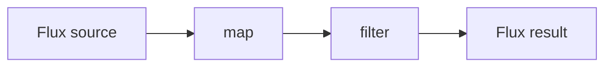

# Reactor Operator Catalog

**Date:** 2026-04-17
**Tags:** reactor, reactive, webflux, operators

## Table of Contents

- [Summary](#summary)
- [How to Read Marble Diagrams](#how-to-read-marble-diagrams)
- [Creating Publishers](#creating-publishers)
- [Transforming Operators](#transforming-operators)
- [Filtering Operators](#filtering-operators)
- [Combining Two Sources](#combining-two-sources)
- [Combining N Sources](#combining-n-sources)
- [Aggregating to Mono](#aggregating-to-mono)
- [Grouping and Windowing](#grouping-and-windowing)
- [Side Effects](#side-effects)
- [Time-Based Operators](#time-based-operators)
- [Error Handling (Brief)](#error-handling-brief)
- [Decision Tables](#decision-tables)
- [Related](#related)
- [References](#references)

---

## Summary

Project Reactor ships with **300+ operators** across `Mono` and `Flux`. You will never use them all. In practice, a production Spring WebFlux codebase leans on **40-50 operators** spread across roughly ten categories. This catalog organizes that working set.

This is a reference, not a tutorial. It assumes you already use `map`, `filter`, and `flatMap` comfortably and want to expand your vocabulary — to recognize the right tool when you reach for it, and to know the name of the operator you are about to reinvent.

Operators in Reactor compose into a **pipeline**: each returns a new `Mono` or `Flux` that *describes* additional work. Nothing executes until subscription. Read every operator through that lens: it is a description of a transformation on an eventual stream of signals, not an imperative action on data.

The categories:

1. **Creating** — how a stream enters the reactive world
2. **Transforming** — 1:1 and 1:N element changes
3. **Filtering** — choosing which elements pass
4. **Combining** — merging, zipping, concatenating across publishers
5. **Aggregating** — collapsing a `Flux` into a `Mono`
6. **Grouping and windowing** — partitioning a stream
7. **Side effects** — peek without altering
8. **Time** — delays, timeouts, intervals
9. **Error handling** — recover, translate, retry
10. **Decision tables** — intent-to-operator cheatsheet

---

## How to Read Marble Diagrams

A marble diagram is a text sketch of a stream over time. Throughout this doc:

```
time ─────────────────────────────▶
-a--b--c--|
```

- `-` is a unit of time with no signal
- Letters like `a`, `b`, `c` are emitted elements
- `|` is the `onComplete` signal (stream finished normally)
- `X` or `x` is an `onError` signal (stream terminated with error)
- `>` at the end means "unbounded, never completes"

Example — `map(String::toUpperCase)`:

```
source:  -a---b---c---|
         └── map(upper) ──┘
result:  -A---B---C---|
```

Two sources are stacked:

```
src1:    -a-----b-----c---|
src2:    ---1-------2-----3--|
```

A `Mono` marble has at most one element:

```
Mono:    -------a|     (just one value, then complete)
Mono:    --------|     (empty, no value, completes)
Mono:    ----X         (error)
```

Mermaid-style dataflow is also used for operators whose timing isn't the interesting bit:



---

## Creating Publishers

This is where streams enter the reactive world. The method you pick controls **when** the value is produced (eagerly at assembly vs. lazily per-subscriber), which matters far more than it sounds.

### Mono factories

| Factory | Purpose | Lazy? |
|---------|---------|-------|
| `Mono.just(x)` | Wrap a known, already-computed value | No — captured at assembly |
| `Mono.empty()` | Completes with no value | N/A |
| `Mono.error(ex)` | Terminates with the given exception | No — exception captured eagerly |
| `Mono.error(Supplier<Throwable>)` | Defers exception creation to subscription | Yes |
| `Mono.defer(Supplier<Mono>)` | Build a fresh Mono per subscriber | Yes |
| `Mono.fromCallable(Callable)` | Wrap a blocking/throwing synchronous call | Yes |
| `Mono.fromFuture(CompletableFuture)` | Bridge from `CompletableFuture` | Future runs eagerly; subscription observes |
| `Mono.fromRunnable(Runnable)` | Fire-and-forget side effect, completes with no value | Yes |
| `Mono.never()` | Never emits anything (useful in tests) | — |

**Eager vs. lazy — the trap.**

```java
// WRONG: userRepo.findById runs NOW, even if no one subscribes
Mono<User> m1 = Mono.just(userRepo.findById(id).block());

// RIGHT: deferred until subscription
Mono<User> m2 = Mono.fromCallable(() -> userRepo.findById(id).block());

// BETTER: don't block at all if the repo is already reactive
Mono<User> m3 = userRepo.findById(id);
```

`Mono.just` is for values you already have in hand. For anything computed — a DB call, an HTTP call, reading a file — use `fromCallable` or `defer`.

### Flux factories

| Factory | Purpose |
|---------|---------|
| `Flux.just(a, b, c)` | Emit a fixed sequence, then complete |
| `Flux.fromIterable(List)` | Emit every element of a `Collection` / `Iterable` |
| `Flux.fromStream(Supplier<Stream>)` | Emit every element of a `Stream` (use the `Supplier` overload for replayability) |
| `Flux.fromArray(T[])` | Emit every element of an array |
| `Flux.range(start, count)` | Emit `count` sequential integers |
| `Flux.interval(Duration)` | Emit `0L, 1L, 2L, ...` every tick on the parallel scheduler |
| `Flux.empty()` | Complete immediately with no elements |
| `Flux.error(ex)` | Terminate with error |
| `Flux.defer(Supplier<Flux>)` | Fresh Flux per subscriber |
| `Flux.generate(stateFn, emitFn)` | Synchronous, single-threaded generator (one emit per invocation) |
| `Flux.create(sink -> ...)` | Multi-threaded programmatic emission with backpressure |
| `Flux.push(sink -> ...)` | Single-producer programmatic emission with backpressure |

Marble for `Flux.range(1, 4)`:

```
Flux.range(1,4):  -1-2-3-4-|
```

**`generate` vs. `create` vs. `push`.**

- `generate` — pull-based, one element at a time, strictly single-threaded. Use for stateful finite sequences.
- `create` — push-based, can emit from multiple threads, handles backpressure. Use to bridge from callback APIs (listeners, queues).
- `push` — push-based, single producer. Like `create` but asserts a single caller. Lighter weight.

```java
// Bridging a listener-style API with Flux.create
Flux<Event> events = Flux.create(sink -> {
    EventListener listener = sink::next;
    source.addListener(listener);
    sink.onDispose(() -> source.removeListener(listener));
});
```

---

## Transforming Operators

Transformations change the **value** of elements. The critical distinction is **1:1 synchronous** (`map`) vs. **1:N asynchronous** (`flatMap` family).

### `map(Function<T, R>)` — synchronous 1:1

```
src:  -a---b---c---|
      map(x -> x.toUpper())
out:  -A---B---C---|
```

- Purely synchronous; the function must not return a `Publisher`.
- No concurrency, no reordering.
- Throwing from `map` propagates as `onError`.

### `flatMap(Function<T, Publisher<R>>)` — async, interleaved

Every input produces an inner `Publisher`; Reactor subscribes to all inner publishers (up to a concurrency limit, default 256) and merges their emissions as they arrive.

```
src:  -a-------b-------c-------|
      flatMap(x -> httpCall(x))
out:  -----a1--b1-a2---c1-b2---c2-|   // order NOT preserved
```

- Use when the transformation is itself async (HTTP, DB, another reactive call).
- **Order is not preserved** — a slow `a` can finish after a fast `b`.
- Use `flatMap(fn, concurrency)` to cap in-flight inner subscriptions.

### `concatMap(Function<T, Publisher<R>>)` — async, ordered (sequential)

Processes one inner publisher to completion before starting the next.

```
src:  -a-------b-------c---|
      concatMap(x -> httpCall(x))
out:  -----a1--a2------b1--b2------c1--c2-|
```

- Order is preserved.
- No parallelism — each inner call waits for the previous to finish.
- Use when downstream cares about order, or when back-to-back calls would overload a resource.

### `flatMapSequential(Function<T, Publisher<R>>)` — parallel execution, ordered emission

Subscribes to inner publishers in parallel (like `flatMap`), but **buffers** their output so emissions downstream are in the original source order.

```
src:  -a-------b-------c---|
      flatMapSequential(x -> httpCall(x))
out:  -----a1--a2--b1--b2--c1--c2-|
```

- Best of both worlds when you can afford the memory for buffering.
- Slow `a` holds up downstream emission of already-completed `b`, `c`.

### `switchMap(Function<T, Publisher<R>>)` — cancel previous on new

When a new source element arrives, **cancel** the in-flight inner publisher from the previous element and subscribe to the new one.

```
src:  -a---------b---c---|
      switchMap(x -> httpCall(x))
out:  -----a1--a2  cancel          -c1--c2-|
```

- Classic use: search-as-you-type (cancel stale requests when a new keystroke arrives).
- Familiar to TypeScript/RxJS devs — semantically identical to RxJS `switchMap`.

### `handle(BiConsumer<T, SynchronousSink<R>>)` — fused map + filter

Like `map`, but the callback can also choose *not* to emit (filter) or emit an error.

```java
flux.handle((value, sink) -> {
    if (value.isValid()) {
        sink.next(value.transform());
    } else if (value.isFatal()) {
        sink.error(new InvalidException(value));
    }
    // else: silently drop (filter behavior)
});
```

- Useful when you would otherwise chain `filter().map()` or throw inside `map`.
- Synchronous only; do not return `Publisher`.

### `cast(Class<R>)` and `ofType(Class<R>)`

```java
Flux<Object> objects = ...;
Flux<String> strings   = objects.cast(String.class);   // emits ClassCastException on mismatch
Flux<String> filtered  = objects.ofType(String.class); // silently drops non-matches
```

- `cast` — asserts; failure is an error signal.
- `ofType` — filters; non-matches are dropped.

---

## Filtering Operators

Filtering operators choose **which** elements pass through. No element value is changed.

### `filter(Predicate<T>)`

```
src:  -1-2-3-4-5-6-|
      filter(x -> x % 2 == 0)
out:  ---2---4---6-|
```

### `filterWhen(Function<T, Mono<Boolean>>)`

Predicate is itself async (returns a `Mono<Boolean>`). Useful when permission checks or enrichment requires a call.

```java
flux.filterWhen(user -> authService.isAdmin(user.id())) // Mono<Boolean>
```

- Inner `Mono<Boolean>` subscriptions run one-at-a-time in the order elements arrive.

### Take / skip

| Operator | Behavior |
|----------|----------|
| `take(n)` | Emit the first `n`, then cancel upstream |
| `takeLast(n)` | Buffer the whole stream, emit only the last `n` on complete |
| `takeWhile(p)` | Emit while predicate is true; stop on first false |
| `takeUntil(p)` | Emit until predicate becomes true (inclusive of the element that triggered it) |
| `skip(n)` | Drop the first `n` |
| `skipLast(n)` | Buffer and drop the last `n` (requires buffering) |
| `skipWhile(p)` | Drop while predicate true, then emit the rest |
| `skipUntil(other Publisher)` | Drop until `other` emits its first signal |

```
src:        -a-b-c-d-e-|
take(3):    -a-b-c-|
skip(2):    -----c-d-e-|
```

### `distinct()` and `distinctUntilChanged()`

- `distinct()` — remembers every element seen so far (memory grows with cardinality).
- `distinctUntilChanged()` — drops consecutive duplicates only.

```
src:                    -a-a-b-a-c-c-c-a-|
distinct():             -a---b-----c-----|
distinctUntilChanged(): -a---b-a---c-----a-|
```

Both accept key extractors: `distinct(User::id)`.

### Single-element reducers (Flux → Mono)

| Operator | Behavior |
|----------|----------|
| `single()` | Emit the single element; error if 0 or >1 |
| `singleOrEmpty()` | Emit the single element or complete empty; error if >1 |
| `last()` | Emit the last element; error if source is empty |
| `last(default)` | Emit the last or the default on empty |
| `next()` | Emit the first element (ignores the rest) as a `Mono<T>` |

Prefer `next()` when you only need the first value and are fine cancelling the rest.

---

## Combining Two Sources

Reactor provides instance methods (`a.zipWith(b)`) and static methods (`Flux.zip(a, b)`). Choose based on readability; they do the same thing.

### `zip(a, b)` — wait for both pairs, combine

Waits for one element from each side, emits a combined value, then waits for the next pair.

```
a:      -a1------a2------a3--|
b:      ----b1----b2------b3---|
zip:    ----(a1,b1)-(a2,b2)-(a3,b3)-|
```

- Shorter source tears down the longer one on complete.
- A zipped pair is emitted only when **both** sides have produced the matching index.
- Variants accept up to 8 sources.

```java
Mono<User>    user    = userService.byId(id);
Mono<Profile> profile = profileService.byUser(id);
Mono<Tuple2<User, Profile>> both = Mono.zip(user, profile);

// or reduce into a DTO directly
Mono<UserView> view = Mono.zip(user, profile, UserView::new);
```

### `zipWith(other)` — instance form

```java
userMono.zipWith(profileMono, UserView::new);
```

### `merge(a, b)` — interleave as they emit

```
a:       -a1-----a2-----a3---|
b:       ---b1----b2------b3---|
merge:   -a1-b1--a2-b2--a3-b3--|
```

- No ordering guarantee — elements appear in the order they arrive.
- Subscribes to both eagerly and concurrently.
- Errors in either source terminate the merged flux immediately (see `mergeDelayError` below).

### `concat(a, b)` — a first, then b

```
a:        -a1--a2--|
b:        -b1--b2--|
concat:   -a1--a2--b1--b2--|
```

- Subscribes to `b` only after `a` completes.
- Use when order across sources matters and you do not want parallelism.

### `combineLatest(a, b, combiner)` — emit on each update once both have emitted once

```
a:               -a1---------a2--------------a3---|
b:               -----b1-----------b2-------------|
combineLatest:   -----(a1,b1)(a2,b1)(a2,b2)-(a3,b2)-|
```

- Emits every time **either** side emits, pairing with the latest value from the other.
- Waits until each source has emitted at least once before emitting anything.
- Common in UI-like scenarios where two independent feeds drive a joint view.

---

## Combining N Sources

For arbitrarily many publishers, use the static collection overloads.

| Operator | Semantics |
|----------|-----------|
| `Flux.merge(Iterable<Publisher>)` | Interleaved, concurrent subscriptions, fail-fast on error |
| `Flux.merge(Iterable, concurrency)` | Limit concurrent subscriptions |
| `Flux.mergeSequential(Iterable)` | Subscribe in parallel but emit in source order |
| `Flux.mergeDelayError(concurrency, ps...)` | Keep merging after an inner error; surface errors at the end |
| `Flux.zip(Iterable, combinator)` | N-way zip into a combined value |
| `Flux.concat(Iterable)` | Sequential concatenation of all sources |

```java
List<Mono<Product>> calls = ids.stream()
    .map(catalog::lookup)
    .toList();

// Concurrent fan-out, results as soon as each is ready
Flux<Product> results = Flux.merge(calls);

// Concurrent fan-out, results in original id order
Flux<Product> ordered = Flux.mergeSequential(calls);

// Concurrent fan-out, results zipped into a single list when all done
Mono<List<Product>> collected = Flux.zip(calls, array -> Stream.of(array)
    .map(Product.class::cast)
    .toList());
```

`mergeDelayError` is underused. When you have many independent calls and want to surface all results even if some fail, it delivers a single error at the end rather than aborting on the first failure.

---

## Aggregating to Mono

A `Flux<T>` becomes a `Mono<R>` by collapsing all its elements. Every aggregator buffers — use with bounded sources only.

| Operator | Result |
|----------|--------|
| `collectList()` | `Mono<List<T>>` |
| `collectSortedList(Comparator<T>)` | `Mono<List<T>>` sorted |
| `collectMap(keyFn)` | `Mono<Map<K, T>>` (last-wins on duplicate keys) |
| `collectMap(keyFn, valueFn)` | `Mono<Map<K, V>>` |
| `collectMultimap(keyFn)` | `Mono<Map<K, Collection<T>>>` |
| `reduce(seed, BiFunction)` | Fold into an accumulator with an initial value |
| `reduce(BiFunction)` | Fold without a seed; empty source emits empty Mono |
| `count()` | `Mono<Long>` count of elements |
| `all(Predicate)` | `Mono<Boolean>` — true iff every element matches |
| `any(Predicate)` | `Mono<Boolean>` — true iff at least one matches; short-circuits |
| `hasElement(T)` | `Mono<Boolean>` — whether any element equals `T` |
| `hasElements()` | `Mono<Boolean>` — whether the flux emits at least one element |

```java
Mono<Integer> sum = Flux.range(1, 10).reduce(0, Integer::sum);
// 55

Mono<Map<Long, User>> byId = userFlux.collectMap(User::id);

Mono<Boolean> anyActive = userFlux.any(User::isActive);
```

`reduce` is the general-purpose fold. Most of the specific operators above are just reductions with a specific accumulator.

---

## Grouping and Windowing

When a single linear stream isn't enough and you need to partition it.

### `groupBy(keyFn)` — partition by key

```java
Flux<Event> events = ...;
Flux<GroupedFlux<Category, Event>> byCategory = events.groupBy(Event::category);

byCategory.flatMap(group ->
    group.take(10)                     // each group's first 10
         .collectList()
         .map(list -> Map.entry(group.key(), list))
);
```

- Returns `Flux<GroupedFlux<K, T>>`. Each `GroupedFlux` exposes `.key()` and behaves as a sub-`Flux`.
- Critical: you **must** consume every inner group. Unsubscribed groups block upstream emission.
- Cardinality matters — an unbounded number of groups with long-lived subscriptions leaks memory.

```
src:             -a1-b1-a2-c1-b2-a3-|   (keyed by letter)
groupBy(letter):
  group("a"):    -a1----a2----a3-|
  group("b"):    ----b1------b2---|
  group("c"):    ---------c1------|
```

### `window(n)` / `window(Duration)` — Flux of Flux

Break a `Flux<T>` into a `Flux<Flux<T>>` where each inner flux is a chunk.

```
src:                -a-b-c-d-e-f-g-|
window(3):          -[a-b-c]-[d-e-f]-[g-|]
```

- `window(n)` — fixed-size chunks.
- `window(Duration)` — time-based chunks.
- `windowUntil(pred)`, `windowWhile(pred)`, `windowTimeout(maxSize, Duration)` — more specialized splits.
- Inner fluxes stream; ideal when a downstream operator wants to process chunks incrementally.

### `buffer(n)` / `buffer(Duration)` — Flux of List

Same as `window` but collects each chunk into a `List<T>` before emitting.

```
src:                -a-b-c-d-e-f-g-|
buffer(3):          ------[a,b,c]---[d,e,f]---[g]-|
```

- Simpler to work with downstream (`List` vs. nested `Flux`).
- Every buffer is materialized in memory before emission — pick a chunk size your heap can handle.
- Use `bufferTimeout(maxSize, Duration)` for "batch until full OR timeout" semantics common in batching writers.

**Rule of thumb:** `buffer` for batching writes; `window` for streaming analytics over chunks.

---

## Side Effects

"Peek" operators. They do not alter the stream — they let you log, increment metrics, or trigger cleanup as signals pass.

| Operator | Fires On |
|----------|----------|
| `doOnNext(Consumer)` | Each element |
| `doOnError(Consumer)` | `onError` signal |
| `doOnComplete(Runnable)` | `onComplete` signal |
| `doOnCancel(Runnable)` | Subscription cancellation |
| `doOnSubscribe(Consumer<Subscription>)` | Subscription is established |
| `doOnRequest(LongConsumer)` | Downstream requests N items |
| `doOnTerminate(Runnable)` | Either complete or error (not cancel) |
| `doFinally(Consumer<SignalType>)` | Any terminal signal including cancel |

```java
order.findById(id)
    .doOnSubscribe(s -> log.info("Fetching order {}", id))
    .doOnNext(o -> meter.counter("orders.fetched").increment())
    .doOnError(e -> log.error("Order fetch failed", e))
    .doFinally(signal -> timer.stop(Tags.of("signal", signal.toString())));
```

**`doFinally` is the right place for cleanup** — it runs on complete, error, AND cancel. `doOnTerminate` misses cancel.

### `log()`

Emits signals to SLF4J at configurable level. Invaluable for debugging assembly-time vs. subscription-time issues. Noisy — drop it before merging.

```java
flux.log()                          // default category, INFO
    .log("orders", Level.FINE)      // named category
```

---

## Time-Based Operators

All time-based operators schedule onto `Schedulers.parallel()` by default. Override with the overload taking a `Scheduler`.

### `delayElements(Duration)`

```
src:               -a-b-c-|
delayElements(2s): ---a---b---c---|   (each shifted right by 2s)
```

- Inserts a per-element delay.
- Useful for throttling, debugging, fake-clock testing.

### `delaySubscription(Duration)`

Defers the upstream subscription itself. The whole stream shifts right by the duration, with nothing emitted until the delay elapses.

```java
userService.findAll().delaySubscription(Duration.ofMillis(500));
```

### `timeout(Duration)` / `timeout(Duration, fallback)`

```
src:                -----a-------|
timeout(3s):        -----a---X            (no emission within 3s after a => error)
timeout(3s, fall):  -----a---[switches to fallback]
```

- Fires if no emission arrives within the duration between elements (per-element timeout).
- Per-signal version: `timeout(firstTimeout, betweenTimeout)`.
- The fallback overload keeps the pipeline alive on timeout.

### `interval(Duration)` and `interval(Duration, Duration)`

```
Flux.interval(Duration.ofSeconds(1)):  0-1-2-3-4-...
```

- `interval(initialDelay, period)` — delayed first emission.
- Infinite by default; pair with `take(n)` or `takeUntil` to bound.
- Uses the parallel scheduler, so each tick runs off the calling thread.

---

## Error Handling (Brief)

Error handling is a deep topic; this is the shortlist. A dedicated doc (future: `error-operators.md`) can cover semantics around `Retry` backoff strategies, `onErrorContinue` caveats, and signal-type filtering.

| Operator | Purpose |
|----------|---------|
| `onErrorReturn(fallback)` | Swap any error for a fallback value, complete |
| `onErrorReturn(Class<? extends Throwable>, fallback)` | Same, scoped to an exception type |
| `onErrorResume(ex -> Publisher)` | Switch to a recovery publisher on error |
| `onErrorMap(ex -> newEx)` | Translate one exception type to another |
| `onErrorComplete()` | Swallow the error, treat as normal completion |
| `onErrorContinue((ex, elem) -> ...)` | Drop the failing element and keep going *(use with care; not all operators support it)* |
| `retry()` | Resubscribe on error, infinitely |
| `retry(n)` | Resubscribe up to `n` times |
| `retryWhen(Retry.backoff(...))` | Backoff strategies, jitter, exception filters |

```java
userService.findById(id)
    .timeout(Duration.ofMillis(500))
    .retryWhen(Retry.backoff(3, Duration.ofMillis(100))
                    .filter(IOException.class::isInstance))
    .onErrorResume(NotFoundException.class, ex -> Mono.empty())
    .onErrorMap(ex -> new ServiceFailure("user lookup", ex));
```

**`onErrorContinue` warning.** It works by intercepting errors in upstream operators, and not every operator supports it cleanly. Prefer `onErrorResume` with a per-element structure (e.g., `flatMap(x -> doWork(x).onErrorResume(...))`) for reliability.

---

## Decision Tables

### By intent

| I want to... | Operator |
|--------------|----------|
| Transform each element synchronously | `map` |
| Transform each into a Publisher, run in parallel | `flatMap` |
| Transform each into a Publisher, preserve order | `concatMap` |
| Transform each into a Publisher, parallel but ordered emission | `flatMapSequential` |
| Cancel previous async work on new input | `switchMap` |
| Combine map + filter | `handle` |
| Drop elements by predicate | `filter` |
| Drop duplicates consecutively | `distinctUntilChanged` |
| Drop all duplicates | `distinct` |
| Wait for N results and combine | `zip` |
| Emit whichever publisher signals first, cancel the rest | `Mono.firstWithSignal` (or `Flux.firstWithSignal`) |
| Emit first success, ignore errors | `Mono.firstWithValue` |
| Merge two streams, interleave | `merge` |
| Append two streams end-to-end | `concat` |
| Re-emit each time either of two sources changes | `combineLatest` |
| Collect Flux into a List | `collectList` |
| Fold Flux into a single value | `reduce` |
| Partition by key | `groupBy` |
| Batch into fixed-size lists | `buffer(n)` |
| Batch by time | `buffer(Duration)` |
| Log each element | `doOnNext` + `log()` |
| Add a per-element delay | `delayElements` |
| Bound a call's latency | `timeout` |
| Retry on error with backoff | `retryWhen(Retry.backoff(...))` |
| Provide a fallback value on error | `onErrorReturn` |
| Swap to a fallback publisher on error | `onErrorResume` |

### Transforming: which `*Map`?

| Need | Use |
|------|-----|
| Sync 1:1 | `map` |
| Async 1:1, parallel, order irrelevant | `flatMap` |
| Async 1:1, parallel, order matters downstream | `flatMapSequential` |
| Async 1:1, strictly serialized (no parallelism) | `concatMap` |
| Cancel prior work on new input (typeahead) | `switchMap` |
| Filter + transform fused | `handle` |

### Combining: which?

| Need | Use |
|------|-----|
| Wait for both, emit pairs | `zip` |
| Wait for first emission, ignore rest | `Mono.firstWithValue` / `firstWithSignal` |
| Interleave concurrent streams | `merge` |
| Append one after the other | `concat` |
| Re-emit on any update after both seeded | `combineLatest` |

### Aggregating: which?

| Need | Use |
|------|-----|
| All elements as a List | `collectList` |
| All elements as a Map | `collectMap` |
| Count | `count` |
| Fold with accumulator | `reduce` |
| Short-circuit truthy check | `any` |
| Short-circuit falsy check | `all` |

### Grouping/windowing

| Need | Use |
|------|-----|
| Split by key | `groupBy` |
| Fixed-size batches as Lists | `buffer(n)` |
| Time-window batches as Lists | `buffer(Duration)` |
| "Size or time" batches | `bufferTimeout(n, Duration)` |
| Streaming chunks (no list materialization) | `window(...)` |

---

## Related

- [`../reactive-programming-java.md`](../reactive-programming-java.md) — reactive fundamentals and Reactor assembly model
- [`schedulers-and-threading.md`](schedulers-and-threading.md) — where operators execute (`publishOn`, `subscribeOn`, scheduler selection)
- [`../sync-vs-async-transformation.md`](../sync-vs-async-transformation.md) — when to reach for `flatMap` vs `map`
- [`../reactive-advanced-topics.md`](../reactive-advanced-topics.md) — backpressure, context, hot vs. cold streams

## References

- Project Reactor Reference Guide — https://projectreactor.io/docs/core/release/reference/
- Project Reactor — "Which operator do I need?" decision tree — https://projectreactor.io/docs/core/release/reference/#which-operator
- `Mono` Javadoc — https://projectreactor.io/docs/core/release/api/reactor/core/publisher/Mono.html
- `Flux` Javadoc — https://projectreactor.io/docs/core/release/api/reactor/core/publisher/Flux.html
- Reactive Streams specification — https://www.reactive-streams.org/
- "Appendix A: Which operator do I need?" — Reactor reference, the canonical lookup table
