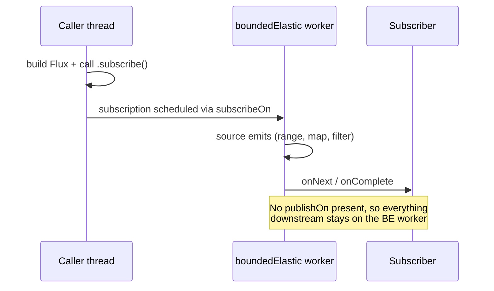

# Schedulers and Threading in Reactor

*Date: 2026-04-17*
*Tags: reactor, schedulers, threading, concurrency, webflux*

## Table of Contents

- [Summary](#summary)
- [What a Scheduler Is](#what-a-scheduler-is)
- [Built-in Schedulers](#built-in-schedulers)
- [Default Threading Behavior](#default-threading-behavior)
- [subscribeOn — Where the Source Runs](#subscribeon--where-the-source-runs)
- [publishOn — Switching Threads Downstream](#publishon--switching-threads-downstream)
- [Worked Example: Both Operators Together](#worked-example-both-operators-together)
- [Choosing the Right Scheduler](#choosing-the-right-scheduler)
- [Never Cross the Streams](#never-cross-the-streams)
- [BlockHound — Detecting Accidental Blocking](#blockhound--detecting-accidental-blocking)
- [Virtual Threads (Java 21+)](#virtual-threads-java-21)
- [WebFlux Server Threads](#webflux-server-threads)
- [Common Bugs](#common-bugs)
- [ParallelFlux — True Parallel Fan-Out](#parallelflux--true-parallel-fan-out)
- [Related](#related)
- [References](#references)

---

## Summary

Reactor's `Scheduler` is an abstraction over thread pools. Two operators control
which scheduler runs which part of a chain:

- `subscribeOn(scheduler)` — chooses the thread that drives the **source** (and
  everything from the source up to the first `publishOn`).
- `publishOn(scheduler)` — switches the thread used for **downstream** operators
  from that point on.

Default behavior: a reactive pipeline is lazy. If you never call `subscribeOn`
or `publishOn`, everything runs on the thread that called `.subscribe()`. There
is no magic background pool.

Two rules to remember:

1. Only the **first** `subscribeOn` in a chain has effect. Later ones are ignored.
2. `publishOn` can appear **many times**; each one reroutes everything below it
   until the next `publishOn`.

---

## What a Scheduler Is

A `Scheduler` in Reactor is an abstraction that wraps an underlying thread pool
or executor. The API is intentionally small:

```java
public interface Scheduler extends Disposable {
    Disposable schedule(Runnable task);
    Disposable schedule(Runnable task, long delay, TimeUnit unit);
    Disposable schedulePeriodically(Runnable task, long initialDelay, long period, TimeUnit unit);
    Worker createWorker();
    void dispose();
}
```

Key ideas:

- `schedule` submits a one-shot task.
- `createWorker()` returns a `Worker` with its own ordering guarantee; Reactor
  operators usually acquire a worker per subscription so emissions stay ordered
  per-subscriber.
- `dispose()` shuts the scheduler down.

A scheduler is not tied to any specific JDK executor — it's an abstraction over
one or many threads. You rarely implement it yourself. You pick one from
`Schedulers.*` factory methods.

---

## Built-in Schedulers

`reactor.core.scheduler.Schedulers` exposes a small set of shared, cached
schedulers plus factories for custom ones.

| Factory | Threads | Purpose |
|---------|---------|---------|
| `Schedulers.immediate()` | current thread | No thread switch; run inline. |
| `Schedulers.single()` | 1 shared | Serial work on a dedicated thread. |
| `Schedulers.parallel()` | `N = cores` | CPU-bound transformations. |
| `Schedulers.boundedElastic()` | up to `10 * cores` by default, queue-bounded | Blocking I/O (JDBC, blocking HTTP, file I/O). |
| `Schedulers.newParallel(name, size)` | fixed, custom | Dedicated CPU pool. |
| `Schedulers.newSingle(name)` | 1, custom | Dedicated single thread. |
| `Schedulers.newBoundedElastic(cap, queueCap, name)` | bounded elastic, custom | Dedicated blocking pool. |
| `Schedulers.fromExecutor(exec)` | whatever the executor provides | Wrap an existing `Executor`. |
| `Schedulers.fromExecutorService(execSvc)` | same | Wrap an `ExecutorService` (can be disposed). |

Notes:

- `immediate()` is the default when no scheduler is specified by a timed
  operator's overload that doesn't take a scheduler.
- `single()`, `parallel()`, and `boundedElastic()` are **shared globals**
  maintained by Reactor. You usually want these unless you have a reason not to.
- `boundedElastic()` has both a **thread cap** and a **task queue cap**
  (default queue is 100k tasks per thread). When the queue saturates you get a
  `RejectedExecutionException`. This is deliberate — it prevents unbounded
  resource consumption.
- `parallel()` is **not** elastic. Its size equals available processors. Do not
  submit blocking tasks to it.

---

## Default Threading Behavior

A reactive pipeline is just a recipe until subscribed. When you finally call
`.subscribe(...)`:

- Subscription propagates **upward** from the terminal subscriber toward the
  source.
- Each operator runs on whatever thread its upstream emits on.
- If no scheduler hop is specified, everything runs on the thread that called
  `.subscribe()`.

```java
Flux.range(1, 3)
    .map(i -> i * 2)
    .filter(i -> i > 2)
    .subscribe(System.out::println); // runs on the caller thread
```

The example above never touches another thread. `map`, `filter`, and the
terminal subscriber all execute synchronously on the caller.

This is why adding `.log()` to an otherwise synchronous chain shows all events
on `main` (or your HTTP handler thread) — there's no implicit thread pool.

---

## subscribeOn — Where the Source Runs

`subscribeOn(scheduler)` decides which thread the **source** starts on. It
affects:

- The source `Publisher`'s subscription and initial emissions.
- Every operator downstream **until** a `publishOn` reroutes things.

Position in the chain does not matter — `subscribeOn` acts on the whole
subscription. Putting it near the end is a common source of confusion.

Only the **first** `subscribeOn` wins. Multiple `subscribeOn` calls compose
from the source outward, and later ones are effectively ignored for source
thread assignment.



Mental model: `subscribeOn` answers "where does the faucet open?" It doesn't
choose a thread for each operator; it picks the starting thread, and
everything flows on that thread until something says otherwise.

---

## publishOn — Switching Threads Downstream

`publishOn(scheduler)` moves emission for **downstream** operators onto the
given scheduler. Each operator after `publishOn` runs on the chosen scheduler
until another `publishOn` swaps threads again.

Unlike `subscribeOn`, `publishOn` is strictly positional. You can have as many
as you want, and each segment of the chain uses the most recent upstream
`publishOn`.

```mermaid
sequenceDiagram
    participant Caller as Caller thread
    participant BE as boundedElastic
    participant Par as parallel worker
    participant Subscriber

    Caller->>Caller: .subscribe() invoked
    Caller->>BE: subscribeOn(boundedElastic)
    BE->>BE: source + map run here
    BE->>Par: publishOn(parallel) hands off element
    Par->>Par: filter + transform run here
    Par->>Subscriber: onNext / onComplete on parallel thread
```

Mental model: `publishOn` is a pipe fitting. Everything upstream keeps its
thread, and everything downstream hops onto the new scheduler until the next
`publishOn`.

---

## Worked Example: Both Operators Together

```java
private static void log(String msg) {
    System.out.printf("[%s] %s%n", Thread.currentThread().getName(), msg);
}

Flux.range(1, 5)
    .doOnNext(x -> log("emit " + x))            // (1) source-side
    .subscribeOn(Schedulers.boundedElastic())   // (2) source runs on BE
    .map(x -> {                                 // (3) still on BE
        log("map");
        return x * 2;
    })
    .publishOn(Schedulers.parallel())           // (4) switch thread pool
    .filter(x -> {                              // (5) runs on parallel
        log("filter");
        return x > 4;
    })
    .subscribe(x -> log("final " + x));         // (6) parallel thread
```

What runs where:

| Step | Operator | Thread |
|------|----------|--------|
| 1 | `doOnNext("emit ...")` | boundedElastic worker (before `publishOn`) |
| 2 | `subscribeOn` | configuration only — no runtime work |
| 3 | `map` | boundedElastic worker |
| 4 | `publishOn` | handoff; does not run user code itself |
| 5 | `filter` | parallel worker |
| 6 | `subscribe` consumer | parallel worker |

Counterintuitive detail: `doOnNext` is placed **before** `subscribeOn` in the
chain, yet it runs on the boundedElastic thread. That's because `subscribeOn`
does not care about position — it picks the source thread, and `doOnNext` is
downstream from the source.

```mermaid
sequenceDiagram
    participant Main as main / caller
    participant BE as boundedElastic worker
    participant Par as parallel worker
    participant Sub as subscriber

    Main->>Main: build chain
    Main->>BE: .subscribe() triggers subscribeOn(boundedElastic)
    BE->>BE: range emits 1..5
    BE->>BE: doOnNext logs "emit N"
    BE->>BE: map returns N*2
    BE->>Par: publishOn hands off values
    Par->>Par: filter keeps >4
    Par->>Sub: onNext "final ..."
    Par->>Sub: onComplete
```

If you add a second `publishOn(Schedulers.single())` after `filter`, the final
subscriber log would run on the `single()` thread instead. If you added a
second `subscribeOn(Schedulers.parallel())` anywhere, it would be ignored —
the source remains on boundedElastic.

---

## Choosing the Right Scheduler

| Need | Use |
|------|-----|
| CPU-bound transformation (encoding, hashing, serialization) | `Schedulers.parallel()` |
| Blocking I/O: JDBC, blocking HTTP, `Files.read*`, legacy SDKs | `Schedulers.boundedElastic()` |
| Periodic or one-shot timers | `Schedulers.parallel()` or `Schedulers.single()` |
| Run on the caller thread explicitly | `Schedulers.immediate()` |
| Already have an `ExecutorService` (e.g. Spring `TaskExecutor`) | `Schedulers.fromExecutorService(exec)` |
| Dedicated pool for a specific bounded workload | `Schedulers.newBoundedElastic(cap, queueCap, name)` |
| Single serial task queue | `Schedulers.single()` or `newSingle(name)` |

Heuristics:

- If the operation **waits** (for I/O, a lock, a socket), it belongs on
  `boundedElastic()` or a dedicated elastic pool. "Waiting" includes JDBC,
  `RestTemplate`, `Files`, SFTP, AWS SDK v1, anything that parks a thread.
- If the operation **computes** (hot CPU), it belongs on `parallel()`.
- If the thing you're calling is already non-blocking (WebClient, R2DBC,
  reactive Kafka), don't add a scheduler hop. The underlying driver manages
  its own threads.

---

## Never Cross the Streams

**Do not run CPU-heavy work on `boundedElastic`.** BoundedElastic can spawn up
to `10 * cores` threads by default. Throwing CPU-bound tasks at it will
oversubscribe the CPU, cause context-switching storms, and hurt latency. Use
`parallel()` (sized to cores) instead.

**Do not run blocking calls on `parallel`.** The `parallel()` pool is sized to
the number of cores. A single blocking call occupies one thread for the full
wait time. Run a handful of those in parallel and the pool is exhausted —
every other reactive computation stalls.

**Do not run blocking calls on Netty's event loop.** WebFlux's Reactor Netty
server runs on a small event-loop pool (cores-sized). One blocking call there
halts the entire server for every request assigned to that loop.

Result of getting this wrong:

- CPU on `boundedElastic`: degraded throughput, latency spikes, increased GC
  pressure.
- Blocking on `parallel` or Netty: deadlocks, timeouts, stalled requests,
  cascading failures.

---

## BlockHound — Detecting Accidental Blocking

[BlockHound](https://github.com/reactor/BlockHound) is a JVM agent that
instruments the JDK and fails the process (with a stack trace) when it detects
a blocking call on a thread marked as non-blocking (Reactor's parallel and
Netty event loops).

Gradle:

```groovy
testImplementation 'io.projectreactor.tools:blockhound:1.0.10.RELEASE'
```

Install in tests or at startup:

```java
BlockHound.install();
```

Whitelist known-safe blocking calls (use sparingly — every allow is a
landmine):

```java
BlockHound.install(builder -> builder
    .allowBlockingCallsInside("com.example.LegacyLib", "slowCall"));
```

Use BlockHound in development and CI, not in production. It catches the easy
mistakes: a `Thread.sleep`, a `synchronized` on a contended monitor, a
`FileInputStream#read` accidentally left on `parallel()`.

---

## Virtual Threads (Java 21+)

Java 21 introduced virtual threads: JVM-managed lightweight threads that
unmount from carrier threads during blocking operations. They change the
"blocking is forbidden" picture — on a virtual thread, a JDBC call does not
pin a real platform thread for the entire wait.

Wrap a virtual-thread executor as a Reactor scheduler:

```java
Scheduler virtualScheduler = Schedulers.fromExecutorService(
    Executors.newVirtualThreadPerTaskExecutor(),
    "virtual"
);

Flux.fromIterable(ids)
    .publishOn(virtualScheduler)
    .map(this::blockingJdbcLookup) // OK on a virtual thread
    .subscribe(...);
```

Caveats:

- Virtual threads are not a drop-in replacement for `parallel()`. They're
  optimized for blocking, not CPU-bound compute.
- BlockHound will still flag blocking calls unless you whitelist your virtual
  scheduler or reconfigure it. In JDK 21+, many JDK internals that used to
  block platform threads now use `LockSupport.park` on virtual threads.
- Synchronized blocks can still pin virtual threads on older JDKs. Prefer
  `ReentrantLock` in hot paths until you're on a version with full
  unpinning (this was addressed in later JDK 21/22 updates).
- Do not mix virtual threads with reactive backpressure-sensitive code unless
  you understand both models. For most Spring apps in 2026, sticking with
  `boundedElastic()` is still a fine default unless you have measured
  improvements from virtual threads.

See [`../java-fundamentals/virtual-threads.md`](../java-fundamentals/virtual-threads.md)
for the deeper Project Loom treatment.

---

## WebFlux Server Threads

Spring WebFlux (with Reactor Netty by default) runs HTTP handlers on Netty
event-loop threads. The pool is tiny: one per core by default. That pool
handles **every** connection's I/O.

Rules of engagement:

1. **Never block** on a Netty event-loop thread. A single blocking call stalls
   every request multiplexed onto that loop.
2. **Never call `.block()`** from a handler. This is the reactive equivalent of
   the self-inflicted deadlock foot-gun (see Common Bugs).
3. For legacy blocking dependencies (JDBC, a blocking SDK), use
   `publishOn(Schedulers.boundedElastic())` to offload the blocking step. Keep
   the rest of the pipeline on Netty's event loop.

Illustrative pattern:

```java
@GetMapping("/orders/{id}")
public Mono<Order> getOrder(@PathVariable String id) {
    return Mono.fromCallable(() -> jpaRepository.findById(id).orElseThrow())
        .subscribeOn(Schedulers.boundedElastic()); // blocking JDBC offloaded
}
```

`Mono.fromCallable` defers the blocking call until subscribe, then
`subscribeOn(boundedElastic())` ensures it runs off the event loop. See
[`../reactive-blocking-jpa-pattern.md`](../reactive-blocking-jpa-pattern.md)
for the full treatment.

---

## Common Bugs

### 1. `.block()` on a reactive thread

```java
Mono<String> result = webClient.get().uri("/slow").retrieve().bodyToMono(String.class);
String value = result.block(); // BOOM if this runs on a Netty event loop
```

Reactor Netty checks for this and throws `IllegalStateException: block()/blockFirst()/blockLast() are blocking, which is not supported in thread reactor-http-nio-...`. Outside Reactor Netty, `.block()` can silently deadlock if the subscriber needs the same thread to complete.

Fix: don't call `.block()`. Return the `Mono`/`Flux` from your handler and let
the framework subscribe.

### 2. JDBC on `parallel()`

```java
.publishOn(Schedulers.parallel())
.map(id -> jdbc.queryForObject("SELECT ...", id)) // blocking on a cores-sized pool
```

Each in-flight request consumes a `parallel()` thread for its full DB latency.
With eight cores and eight concurrent requests, the pool is fully saturated
and all other reactive work stalls.

Fix: `publishOn(Schedulers.boundedElastic())` for the blocking segment.

### 3. `subscribeOn` placed at the end

```java
Flux.just(1, 2, 3)
    .map(i -> heavy(i))
    .subscribeOn(Schedulers.parallel()); // expected to parallelize map
```

Developers often assume this parallelizes `heavy()`. It does not. `subscribeOn`
picks the source thread, and the entire chain runs sequentially on that
thread. It's a single-thread execution, just a different thread than the
caller.

Fix for per-element parallelism: use `ParallelFlux` with `runOn`, or
`flatMap` with `subscribeOn` inside the inner publisher. See the ParallelFlux
section below.

### 4. Confusing `publishOn` with `subscribeOn`

A useful two-line mental model:

- `subscribeOn` = "where is the source's faucet opened?" — affects everything
  up until a `publishOn`.
- `publishOn` = "pipe elbow" — everything downstream uses the new scheduler.

If you find yourself reasoning about "does this operator run on X?", walk
backward: find the closest `publishOn` above it, or the `subscribeOn`
otherwise, or the caller thread if neither is present.

### 5. Multiple `subscribeOn` calls

Only the first one (closest to the source in application order) takes effect
for source thread assignment. The later ones are not errors; they are silently
dead code. If you need different threads for different parts of the chain,
use `publishOn`.

---

## ParallelFlux — True Parallel Fan-Out

For genuine parallel per-element computation, `Flux.parallel().runOn(scheduler)`
splits emissions across N rails, each bound to a worker on the chosen
scheduler.

```java
Flux.range(1, 1000)
    .parallel(8)                          // 8 rails
    .runOn(Schedulers.parallel())         // each rail on a parallel worker
    .map(this::cpuHeavyTransform)         // runs on any of 8 threads
    .sequential()                         // merge rails back into a single Flux
    .subscribe();
```

Compare with `flatMap`:

```java
Flux.range(1, 1000)
    .flatMap(i -> Mono.fromCallable(() -> cpuHeavyTransform(i))
                      .subscribeOn(Schedulers.parallel()),
             8) // concurrency
    .subscribe();
```

Both do concurrent work, but they have different shapes:

| Aspect | `ParallelFlux` + `runOn` | `flatMap` + `subscribeOn` |
|--------|--------------------------|----------------------------|
| Ordering | Per-rail ordered; overall unordered unless `sequential()` | Unordered; use `concatMap` for strict order |
| Backpressure | Per-rail | Per-inner-publisher |
| Typical use | CPU fan-out over a known-size stream | Async I/O per element |
| API feel | Map/reduce | Composition |

Rule of thumb:

- Many CPU-bound transforms on a finite stream → `ParallelFlux` + `runOn`.
- Per-element async calls (e.g. WebClient requests) → `flatMap` (no explicit
  scheduler needed; the network driver handles threading).

---

## Related

- [`operator-catalog.md`](operator-catalog.md)
- [`../reactive-programming-java.md`](../reactive-programming-java.md)
- [`../reactive-advanced-topics.md`](../reactive-advanced-topics.md)
- [`../reactive-blocking-jpa-pattern.md`](../reactive-blocking-jpa-pattern.md)
- [`../java-fundamentals/virtual-threads.md`](../java-fundamentals/virtual-threads.md)
- [`../java-fundamentals/concurrency-basics.md`](../java-fundamentals/concurrency-basics.md)

---

## References

- Project Reactor reference guide — Schedulers section: <https://projectreactor.io/docs/core/release/reference/#schedulers>
- `reactor.core.scheduler.Schedulers` javadoc: <https://projectreactor.io/docs/core/release/api/reactor/core/scheduler/Schedulers.html>
- `Scheduler` interface javadoc: <https://projectreactor.io/docs/core/release/api/reactor/core/scheduler/Scheduler.html>
- BlockHound on GitHub: <https://github.com/reactor/BlockHound>
- JEP 444 — Virtual Threads (Java 21): <https://openjdk.org/jeps/444>
- Reactor Netty threading model: <https://projectreactor.io/docs/netty/release/reference/#_threading_model>
