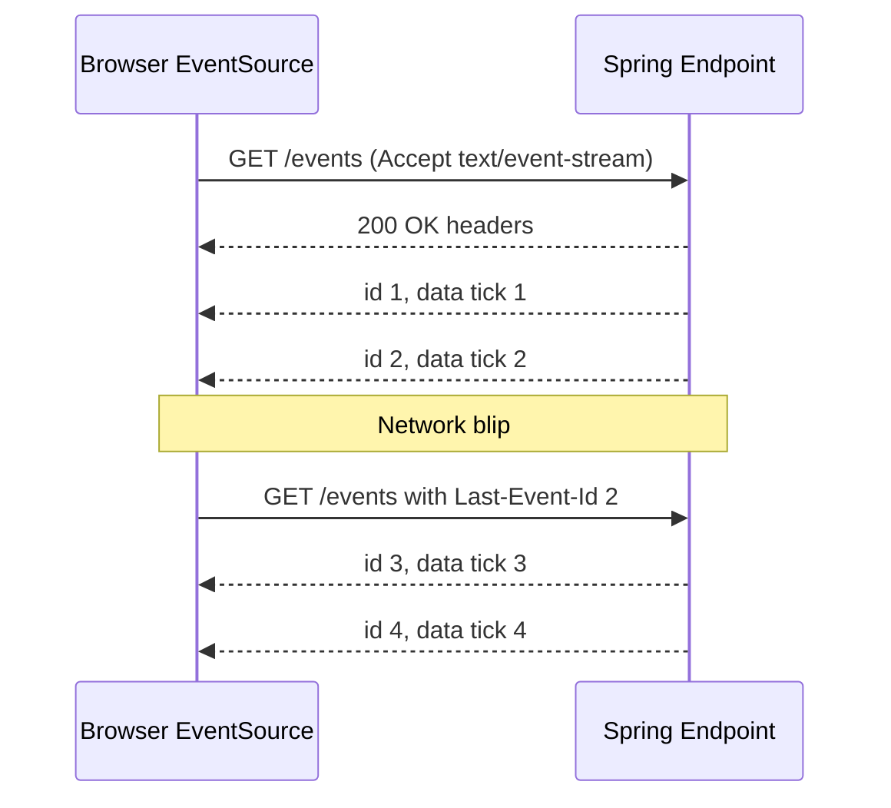
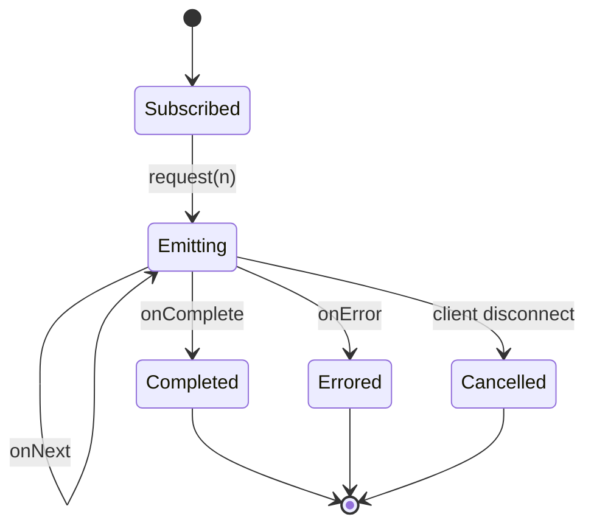

# Server-Sent Events and HTTP Streaming in Spring

Date: 2026-04-18 · Tags: sse, streaming, webflux, spring-mvc, realtime

## Table of Contents

- [Summary](#summary)
- [SSE Protocol Basics](#sse-protocol-basics)
  - [Wire Format](#wire-format)
  - [Reconnection and Last-Event-Id](#reconnection-and-last-event-id)
  - [Keep-Alive](#keep-alive)
- [WebFlux Approach](#webflux-approach)
  - [Minimal Flux Endpoint](#minimal-flux-endpoint)
  - [ServerSentEvent Builder](#serversentevent-builder)
  - [Backpressure and Cancellation](#backpressure-and-cancellation)
- [MVC Approach with SseEmitter](#mvc-approach-with-sseemitter)
  - [Emitter Basics](#emitter-basics)
  - [Thread Model and Virtual Threads](#thread-model-and-virtual-threads)
  - [Lifecycle Callbacks](#lifecycle-callbacks)
- [NDJSON Alternative](#ndjson-alternative)
- [Heartbeats](#heartbeats)
- [Client Side](#client-side)
  - [Browser EventSource](#browser-eventsource)
  - [Fetch with ReadableStream](#fetch-with-readablestream)
  - [Spring WebClient](#spring-webclient)
- [Reverse Proxy Gotchas](#reverse-proxy-gotchas)
- [Backpressure and Slow Consumers](#backpressure-and-slow-consumers)
- [Error Handling and Reconnect](#error-handling-and-reconnect)
- [Security](#security)
- [Testing](#testing)
- [SSE vs WebSocket vs NDJSON vs gRPC](#sse-vs-websocket-vs-ndjson-vs-grpc)
- [Sinks-Based Broadcast Pattern](#sinks-based-broadcast-pattern)
- [Common Bugs](#common-bugs)
- [Related](#related)
- [References](#references)

---

## Summary

Server-Sent Events (SSE) is a lightweight, one-way server-to-client push protocol that runs over plain HTTP using the `text/event-stream` content type. Compared to WebSocket, it is dramatically simpler for unidirectional streams: no handshake upgrade, no framing protocol, and automatic reconnection baked into the browser `EventSource` API.

Spring supports SSE natively in both stacks:

- **WebFlux** returns `Flux<ServerSentEvent<T>>` (or a plain `Flux<T>` for simple cases).
- **Spring MVC** uses `SseEmitter`, a push-style handle that cooperates with Servlet async.

Use SSE when you need server-push to browsers for notifications, log tailing, price ticks, progress updates, or AI token streaming. Use NDJSON for server-to-server streaming where the browser EventSource contract is not needed, and use WebSocket or gRPC streaming when you truly need bidirectional traffic.

---

## SSE Protocol Basics

### Wire Format

Each event is a block of UTF-8 lines separated by a blank line. Fields:

| Field | Purpose |
|-------|---------|
| `event:` | Named event type, maps to `addEventListener` on the client |
| `data:` | Event payload; repeat for multi-line values |
| `id:` | Event identifier, persisted by the browser for reconnection |
| `retry:` | Suggested reconnection delay in milliseconds |
| `:` prefix | Comment line, ignored by the client but keeps the stream alive |

Example over the wire:

```
event: tick
id: 42
data: {"value": 3.14}
retry: 5000

: heartbeat

event: tick
id: 43
data: {"value": 3.15}

```

A blank line terminates each event. Comment lines starting with `:` are discarded by the client.

### Reconnection and Last-Event-Id

When the connection drops, the browser `EventSource` waits for `retry` milliseconds (default 3000) and then reconnects. On reconnect, it sets the header `Last-Event-Id` to the id of the most recently received event, letting the server resume from that point.



Treat `Last-Event-Id` as untrusted input: validate its format, and cap how far back your server is willing to replay.

### Keep-Alive

SSE connections are long-lived. Between events, the server should periodically send a comment (`: ping\n\n`) so that intermediaries (load balancers, reverse proxies, corporate firewalls) do not close what they perceive as an idle connection. See [Heartbeats](#heartbeats).

---

## WebFlux Approach

Reactive Spring is a natural fit for SSE: a `Flux<T>` already models an asynchronous sequence, and Reactor Netty streams it out without blocking a thread per client.

### Minimal Flux Endpoint

For trivial cases, returning a plain `Flux<T>` with the SSE content type is enough. Spring serializes each element as a `data:` frame.

```java
@RestController
public class TickController {

    @GetMapping(value = "/events", produces = MediaType.TEXT_EVENT_STREAM_VALUE)
    public Flux<String> events() {
        return Flux.interval(Duration.ofSeconds(1))
            .map(tick -> "tick " + tick);
    }
}
```

### ServerSentEvent Builder

When you need `event`, `id`, or `retry` fields, wrap payloads in `ServerSentEvent<T>`:

```java
@GetMapping(value = "/events", produces = MediaType.TEXT_EVENT_STREAM_VALUE)
public Flux<ServerSentEvent<String>> events() {
    return Flux.interval(Duration.ofSeconds(1))
        .map(tick -> ServerSentEvent.<String>builder()
            .id(String.valueOf(tick))
            .event("tick")
            .data("tick " + tick)
            .retry(Duration.ofSeconds(5))
            .build());
}
```

This lets the browser distinguish different event types via `es.addEventListener("tick", ...)` and lets you control reconnection timing.

### Backpressure and Cancellation

Reactor applies backpressure end-to-end. If the TCP send buffer fills up because a client is slow, Reactor stops requesting from upstream until the socket drains. When the client closes the connection, the `Flux` subscription is cancelled and the publisher sees a cancel signal, so you must make upstream work cancel-aware (for example, by avoiding blocking work inside `map`).



---

## MVC Approach with SseEmitter

On the servlet stack, Spring MVC exposes `SseEmitter`, a push handle returned from a controller method. Spring MVC treats it as an async response: the request thread returns to the container immediately, and events are written by whichever thread calls `emitter.send`.

### Emitter Basics

```java
@RestController
public class TickEmitterController {

    private final ExecutorService executor = Executors.newVirtualThreadPerTaskExecutor();

    @GetMapping("/events")
    public SseEmitter events() {
        SseEmitter emitter = new SseEmitter(Long.MAX_VALUE);
        executor.submit(() -> {
            try {
                for (int i = 0; i < 100; i++) {
                    emitter.send(SseEmitter.event()
                        .id(String.valueOf(i))
                        .name("tick")
                        .data("tick " + i));
                    Thread.sleep(1000);
                }
                emitter.complete();
            } catch (Exception e) {
                emitter.completeWithError(e);
            }
        });
        return emitter;
    }
}
```

The default `SseEmitter` timeout is 30 seconds; for long-lived streams, pass an explicit large value or configure `spring.mvc.async.request-timeout`.

### Thread Model and Virtual Threads

Each emitter needs a worker to push events. Historically this meant one platform thread per connection, which was expensive. With JDK 21 virtual threads, the cost is negligible, so MVC SSE at scale is viable again. See [../spring-virtual-threads.md](../spring-virtual-threads.md).

Still, offload the work to an executor. Never block inside the controller method itself: the request thread must return for Spring to register the emitter.

### Lifecycle Callbacks

Always register cleanup so you stop producing when the client leaves:

```java
emitter.onCompletion(() -> log.info("SSE completed"));
emitter.onTimeout(() -> { emitter.complete(); });
emitter.onError(err -> log.warn("SSE error", err));
```

If you subscribe the emitter to an external source (queue, topic, database change feed), unsubscribe in these callbacks or you leak resources.

---

## NDJSON Alternative

Newline-delimited JSON streams each record as one complete JSON object per line. The content type is `application/x-ndjson` (`MediaType.APPLICATION_NDJSON_VALUE`). There is no `event`, `id`, or `retry`: the framing is just the newline.

WebFlux controller:

```java
@GetMapping(value = "/records", produces = MediaType.APPLICATION_NDJSON_VALUE)
public Flux<Record> records() {
    return recordService.streamRecords();
}
```

Tradeoffs:

- Simpler than SSE, good for server-to-server and CLI clients.
- Not supported by `EventSource`. Browsers consume NDJSON via `fetch` + `ReadableStream` + manual line parsing.
- No built-in reconnect semantics; you implement resume logic at the application layer if needed.
- Works well for bulk export endpoints that want streaming without WebSocket machinery.

---

## Heartbeats

Load balancers, ingress controllers, and WAFs often close connections that appear idle for 30-60 seconds. SSE has a built-in solution: send comment lines that the client ignores but that still count as traffic.

WebFlux:

```java
Flux<ServerSentEvent<String>> data = tickerFlux.map(this::toEvent);
Flux<ServerSentEvent<String>> beats = Flux.interval(Duration.ofSeconds(25))
    .map(i -> ServerSentEvent.<String>builder().comment("ping").build());
return Flux.merge(data, beats);
```

MVC:

```java
@Scheduled(fixedDelay = 25_000)
public void heartbeat() {
    activeEmitters.forEach(e -> {
        try { e.send(SseEmitter.event().comment("ping")); }
        catch (IOException ex) { activeEmitters.remove(e); }
    });
}
```

Pick a heartbeat interval shorter than the tightest idle timeout in your path. 25 seconds is a common sweet spot for AWS ALB (60s default) and Nginx (60s default).

---

## Client Side

### Browser EventSource

The simplest SSE client, built into every modern browser:

```javascript
const es = new EventSource('/events');

es.addEventListener('tick', (e) => {
  console.log('tick event:', e.data, 'id:', e.lastEventId);
});

es.onmessage = (e) => {
  console.log('default message:', e.data);
};

es.onerror = (e) => {
  console.warn('SSE error, browser will auto-reconnect', e);
};
```

Key facts:

- Auto-reconnect is built in; `retry` field on the server controls the delay.
- `Last-Event-Id` is sent automatically on reconnect.
- `EventSource` cannot set custom request headers. Auth must use cookies or query parameters.
- Subject to the HTTP/1.1 six-connections-per-origin browser limit. HTTP/2 removes this.

### Fetch with ReadableStream

For NDJSON or when you need custom headers (for example, `Authorization: Bearer ...`), use `fetch`:

```javascript
const res = await fetch('/records', {
  headers: { Authorization: `Bearer ${token}`, Accept: 'application/x-ndjson' },
});
const reader = res.body.getReader();
const decoder = new TextDecoder();
let buffer = '';
while (true) {
  const { value, done } = await reader.read();
  if (done) break;
  buffer += decoder.decode(value, { stream: true });
  let newline;
  while ((newline = buffer.indexOf('\n')) >= 0) {
    const line = buffer.slice(0, newline);
    buffer = buffer.slice(newline + 1);
    if (line) handle(JSON.parse(line));
  }
}
```

### Spring WebClient

For Java-to-Java SSE consumption:

```java
ParameterizedTypeReference<ServerSentEvent<String>> type =
    new ParameterizedTypeReference<>() {};

Flux<ServerSentEvent<String>> stream = webClient.get()
    .uri("/events")
    .retrieve()
    .bodyToFlux(type);

stream.subscribe(ev ->
    log.info("event={} id={} data={}", ev.event(), ev.id(), ev.data()));
```

WebClient handles chunking and exposes each event as a `ServerSentEvent`. Add `.retryWhen(Retry.backoff(...))` for resilient consumers.

---

## Reverse Proxy Gotchas

SSE breaks easily when intermediaries buffer or transform the response. Checklist:

- **Nginx buffering.** Default `proxy_buffering on` holds bytes until a full buffer fills. Disable with `proxy_buffering off;` or set the header `X-Accel-Buffering: no` from Spring.
- **Gzip.** Some proxies and CDNs gzip responses with `text/event-stream`, which breaks framing for streaming clients. Disable compression for the SSE path, or set `Content-Encoding: identity`.
- **Idle timeout.** AWS ALB defaults to 60 seconds; GCP HTTPS LB to 30. Your heartbeat must be shorter.
- **HTTP/2 multiplexing.** Removes the per-origin browser connection cap, which matters when a user has many SSE tabs open.
- **CDN middleboxes.** Some (CloudFront historically) strip or buffer `text/event-stream`. Verify end-to-end, ideally with a production-shaped staging environment.

Spring controller snippet to hint intermediaries:

```java
@GetMapping(value = "/events", produces = MediaType.TEXT_EVENT_STREAM_VALUE)
public ResponseEntity<Flux<ServerSentEvent<String>>> events() {
    return ResponseEntity.ok()
        .header("X-Accel-Buffering", "no")
        .header("Cache-Control", "no-cache")
        .body(stream);
}
```

---

## Backpressure and Slow Consumers

A slow client eventually fills the TCP send buffer. What happens next differs by stack:

- **WebFlux.** Reactor stops requesting upstream. If the source is a hot publisher (like `Sinks.Many`), you must choose an overflow strategy: buffer, drop, or error. See [../reactive-advanced-topics.md](../reactive-advanced-topics.md).
- **MVC SseEmitter.** `emitter.send(...)` blocks or throws `IOException` depending on container config. You own the policy: disconnect slow clients, drop events, or buffer to an application queue.

Design choice: for a notification stream, dropping is usually acceptable. For financial ticks, drop-latest or conflation may be preferable. For durable messaging, SSE is the wrong tool — use a proper broker.

---

## Error Handling and Reconnect

On the server:

- WebFlux terminal errors become an HTTP error status if headers have not been sent, otherwise they abort the stream. Log before propagating so you can correlate disconnects.
- Convert recoverable exceptions to an event with `event: error` and a structured payload, then complete gracefully. This is friendlier than aborting.
- For MVC, use `emitter.completeWithError(ex)` so Spring forwards the exception through the standard handler chain.

On the client:

- `EventSource` auto-reconnects on transport errors but not on HTTP 4xx with no retry header. On 401/403 you typically want to refresh the token and reconnect manually.
- Use `Last-Event-Id` on the server to support exactly-once semantics at a per-connection level. Truly durable exactly-once requires a broker.

---

## Security

Authentication over SSE has one sharp edge: **browsers do not let you set custom headers on `EventSource`**.

Options:

1. **Cookie-based session.** Easiest. Same-site cookies reach the SSE endpoint just like any other request. Pair with CSRF protection if the SSE endpoint mutates state (it normally does not).
2. **Query parameter token.** `new EventSource('/events?token=' + jwt)`. Risk: token leaks into server logs and browser history. Use short-lived tokens dedicated to SSE, never your primary bearer token.
3. **Fetch plus ReadableStream.** Supports custom `Authorization` headers but requires manual SSE parsing (or switch to NDJSON).
4. **Subprotocol tokens.** Issue a one-shot exchange token: client POSTs its bearer to `/sse-tickets`, receives a short-lived opaque ticket, opens SSE with `?ticket=...`. This keeps the long-lived bearer off URLs.

Always validate origin, scope, and expiry on every new connection. See [../security/oauth2-jwt.md](../security/oauth2-jwt.md).

Rate-limit and bound concurrent SSE connections per user: an attacker opening thousands of connections can exhaust your proxy file descriptors faster than they can exhaust your application threads.

---

## Testing

WebFlux with `WebTestClient`:

```java
@Test
void streamsTicks() {
    FluxExchangeResult<ServerSentEvent<String>> result = webTestClient.get()
        .uri("/events")
        .accept(MediaType.TEXT_EVENT_STREAM)
        .exchange()
        .expectStatus().isOk()
        .returnResult(new ParameterizedTypeReference<ServerSentEvent<String>>() {});

    StepVerifier.create(result.getResponseBody().take(3))
        .expectNextMatches(ev -> "tick".equals(ev.event()))
        .expectNextMatches(ev -> "tick".equals(ev.event()))
        .expectNextMatches(ev -> "tick".equals(ev.event()))
        .verifyComplete();
}
```

MVC with `MockMvc`:

```java
@Test
void emitsEvents() throws Exception {
    MvcResult mvcResult = mockMvc.perform(get("/events").accept("text/event-stream"))
        .andExpect(request().asyncStarted())
        .andReturn();

    mockMvc.perform(asyncDispatch(mvcResult))
        .andExpect(status().isOk())
        .andExpect(content().contentTypeCompatibleWith("text/event-stream"))
        .andExpect(content().string(containsString("data:tick 0")));
}
```

Integration test tips:

- Always bound the subscription with `.take(n)` or a timeout, otherwise the test hangs.
- For virtual-time testing of heartbeats, use `VirtualTimeScheduler.getOrSet()` in Reactor.

---

## SSE vs WebSocket vs NDJSON vs gRPC

| Need | Use |
|------|-----|
| Server to client only, browser | SSE |
| Server to client, server-to-server | NDJSON |
| Bidirectional, browser | WebSocket |
| Bidirectional, typed contracts, polyglot | gRPC streaming |
| Durable, exactly-once, fanout | Broker (Kafka, Pulsar) in front of SSE or WebSocket |

Decision hints:

- Pick SSE first if you only need push-to-browser. It is the simplest and most HTTP-friendly.
- Pick WebSocket if the client sends frequent non-trivial messages. Do not use WebSocket just for reconnection: SSE reconnects too.
- Pick NDJSON for bulk streaming APIs consumed by servers, scripts, or CLIs.
- Pick gRPC streaming for typed, schema-first internal services.

---

## Sinks-Based Broadcast Pattern

Most real systems have one producer and many SSE subscribers (every logged-in browser gets notifications). Reactor sinks turn a cold `Flux` into a hot, shared stream:

```java
@Component
public class NotificationHub {

    private final Sinks.Many<Notification> sink =
        Sinks.many().multicast().onBackpressureBuffer(1024, false);

    public void publish(Notification n) {
        Sinks.EmitResult result = sink.tryEmitNext(n);
        if (result.isFailure()) {
            log.warn("dropped notification: {}", result);
        }
    }

    public Flux<Notification> asFlux() {
        return sink.asFlux();
    }
}

@RestController
@RequiredArgsConstructor
public class NotificationController {
    private final NotificationHub hub;

    @GetMapping(value = "/notifications", produces = MediaType.TEXT_EVENT_STREAM_VALUE)
    public Flux<Notification> stream() {
        return hub.asFlux();
    }
}
```

Cautions:

- `tryEmitNext` returns a result; do not ignore failures, especially `FAIL_OVERFLOW`.
- Choose `multicast`, `replay`, or `unicast` deliberately. `replay().limit(n)` is handy for late subscribers who want the last N events.
- Sinks are in-memory, single-JVM state. For multi-node fanout, put a broker in front (Redis pub/sub, Kafka) and have each node subscribe that broker into its local sink.

See [../reactive-advanced-topics.md](../reactive-advanced-topics.md) for hot publishers and backpressure strategies.

---

## Common Bugs

| Bug | Symptom | Fix |
|-----|---------|-----|
| Missing `produces = TEXT_EVENT_STREAM_VALUE` | Client receives JSON array or single object, never streams | Set `produces` explicitly |
| Gzip compression on SSE path | Browser never fires events | Exclude path from compression |
| No heartbeats | Connections drop every 30-60s with no error | Merge comment pings every 25s |
| Leaky sinks | Memory grows as clients come and go | Use `doFinally` to remove subscribers, pick an overflow strategy |
| Default `SseEmitter` timeout | Stream dies at 30s silently | Construct with explicit large timeout |
| Blocking in WebFlux controller | One slow client stalls all clients on a Netty event loop | Offload blocking work with `publishOn(boundedElastic())` |
| Relying on `EventSource` for bearer tokens | Cannot set `Authorization` header | Use cookies, ticket exchange, or fetch-based parsing |
| No `Last-Event-Id` handling | Lost events on every reconnect | Persist event ids, replay on reconnect |
| Nginx buffering | Events delivered in large batches, not real time | `proxy_buffering off` or `X-Accel-Buffering: no` |
| No max-connections guard | File descriptor exhaustion under load or attack | Per-user connection cap plus global rate limit |

---

## Related

- [websockets.md](websockets.md)
- [../web-layer/rest-controller-patterns.md](../web-layer/rest-controller-patterns.md)
- [../web-layer/spring-mvc-fundamentals.md](../web-layer/spring-mvc-fundamentals.md)
- [../reactive-programming-java.md](../reactive-programming-java.md)
- [../reactive-advanced-topics.md](../reactive-advanced-topics.md)
- [../spring-virtual-threads.md](../spring-virtual-threads.md)
- [../security/oauth2-jwt.md](../security/oauth2-jwt.md)

## References

- WHATWG HTML Living Standard, Server-Sent Events section: https://html.spec.whatwg.org/multipage/server-sent-events.html
- MDN, Using server-sent events: https://developer.mozilla.org/en-US/docs/Web/API/Server-sent_events/Using_server-sent_events
- MDN, EventSource: https://developer.mozilla.org/en-US/docs/Web/API/EventSource
- Spring Framework reference, WebFlux streaming responses: https://docs.spring.io/spring-framework/reference/web/webflux.html
- Spring Framework reference, Spring MVC async requests and SseEmitter: https://docs.spring.io/spring-framework/reference/web/webmvc/mvc-ann-async.html
- Project Reactor reference, Sinks and hot publishers: https://projectreactor.io/docs/core/release/reference/
- Nginx, SSE and proxy buffering: https://nginx.org/en/docs/http/ngx_http_proxy_module.html
- NDJSON specification: https://github.com/ndjson/ndjson-spec
