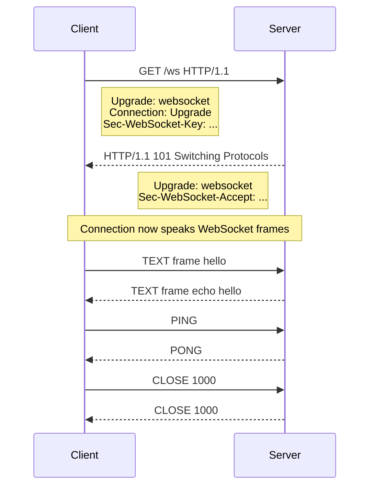
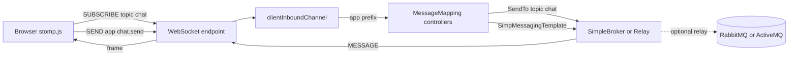

# WebSockets in Spring — WebFlux and MVC

Date: 2026-04-18
Tags: websocket, webflux, spring-mvc, stomp, realtime

## Table of Contents

- [Summary](#summary)
- [Protocol Basics](#protocol-basics)
- [WebFlux — WebSocketHandler](#webflux--websockethandler)
- [WebFlux Broadcast Pattern](#webflux-broadcast-pattern)
- [Backpressure](#backpressure)
- [MVC — Raw WebSocketHandler](#mvc--raw-websockethandler)
- [MVC STOMP — The Common MVC Approach](#mvc-stomp--the-common-mvc-approach)
- [STOMP Setup](#stomp-setup)
- [@MessageMapping Handlers](#messagemapping-handlers)
- [Server-Initiated Push](#server-initiated-push)
- [SockJS Fallback](#sockjs-fallback)
- [Client Side](#client-side)
- [Security](#security)
- [Testing](#testing)
- [Session Management](#session-management)
- [Message Size Limits](#message-size-limits)
- [External Brokers in Production](#external-brokers-in-production)
- [SSE vs WebSocket](#sse-vs-websocket)
- [Common Bugs](#common-bugs)
- [Related](#related)
- [References](#references)

---

## Summary

A WebSocket is a persistent, bidirectional, TCP-like channel multiplexed over HTTP. It is established via an HTTP Upgrade handshake (RFC 6455) and then carries framed messages in both directions with very low overhead. Once open, either peer can push data at any time — no polling, no new requests, no HTTP headers per message.

Spring supports WebSockets on both stacks:

- **Spring WebFlux** — reactive, non-blocking. You implement `WebSocketHandler` and compose `Flux`/`Mono` around `session.receive()` and `session.send(...)`.
- **Spring MVC** — two flavors:
  - Low-level `WebSocketHandler` (servlet-based, less common).
  - STOMP — a simple text messaging protocol layered over WebSocket that gives you pub/sub semantics, destination-based routing, and `@MessageMapping` controllers. This is the typical choice for chat, notifications, and collaborative UIs on the MVC stack.

Use raw WebSocket for custom binary protocols, games, or when you don't need pub/sub. Use STOMP when you want a framework-native messaging model (subscribe to `/topic/x`, publish to `/app/y`) with minimal glue code.

---

## Protocol Basics

### The Handshake

WebSocket starts life as an HTTP/1.1 request with `Upgrade: websocket`. If the server accepts, the same TCP connection is repurposed for WebSocket framing — no more HTTP semantics after that point.



### Frame Types

- **TEXT** — UTF-8 payload (most application messages, JSON).
- **BINARY** — opaque bytes (protobuf, msgpack, media chunks).
- **PING / PONG** — keep-alive and liveness probes. Either peer can send a PING; the other must PONG with the same payload.
- **CLOSE** — signals shutdown with a 2-byte code and optional UTF-8 reason.

### Close Codes

| Code | Meaning |
|------|---------|
| 1000 | Normal closure |
| 1001 | Going away (server shutdown, browser navigating) |
| 1002 | Protocol error |
| 1003 | Unsupported data |
| 1006 | Abnormal closure (no CLOSE frame — network drop) |
| 1008 | Policy violation |
| 1009 | Message too big |
| 1011 | Server error |

`1006` is special — it is never sent on the wire. It means the library inferred the connection died without a CLOSE frame. Treat it as a network failure, not a server decision.

### Compression

`permessage-deflate` (RFC 7692) negotiates per-message DEFLATE compression during handshake. It saves bandwidth on text-heavy payloads but costs CPU and memory (context takeover). Enable it for chat/JSON workloads; disable it for already-compressed binary (images, audio) or latency-critical paths.

---

## WebFlux — WebSocketHandler

On WebFlux you implement `org.springframework.web.reactive.socket.WebSocketHandler`. The method receives a `WebSocketSession` and must return a `Mono<Void>` that completes when the session is finished.

```java
@Component
public class EchoHandler implements WebSocketHandler {

    @Override
    public Mono<Void> handle(WebSocketSession session) {
        return session.send(
            session.receive()
                .map(WebSocketMessage::getPayloadAsText)
                .map(msg -> "echo: " + msg)
                .map(session::textMessage)
        );
    }
}
```

`session.receive()` returns a `Flux<WebSocketMessage>`. `session.send(Publisher<WebSocketMessage>)` subscribes to your stream and writes each message to the wire. Because everything is reactive, the handler naturally applies backpressure.

### Registration

WebFlux does not use `@Controller` for WebSocket endpoints — you register them with a `HandlerMapping`:

```java
@Configuration
public class WsConfig {

    @Bean
    public HandlerMapping handlerMapping(EchoHandler echoHandler) {
        var map = Map.of("/ws/echo", echoHandler);
        return new SimpleUrlHandlerMapping(map, 10);
    }

    @Bean
    public WebSocketHandlerAdapter wsHandlerAdapter() {
        return new WebSocketHandlerAdapter();
    }
}
```

The `order` (10) gives this mapping higher priority than the default request mappings, so `/ws/echo` is captured before it falls through to a 404.

---

## WebFlux Broadcast Pattern

A chat room or live dashboard needs one-to-many fan-out. Use `Sinks.Many` as a shared hub:

```java
@Component
public class BroadcastHandler implements WebSocketHandler {

    private final Sinks.Many<String> sink =
        Sinks.many().multicast().onBackpressureBuffer();

    @Override
    public Mono<Void> handle(WebSocketSession session) {
        Mono<Void> in = session.receive()
            .map(WebSocketMessage::getPayloadAsText)
            .doOnNext(sink::tryEmitNext)
            .then();

        Mono<Void> out = session.send(
            sink.asFlux().map(session::textMessage)
        );

        return Mono.zip(in, out).then();
    }
}
```

Each connection subscribes to `sink.asFlux()` (multicast) and publishes into the same sink. `Mono.zip(in, out)` keeps the session alive until either side completes or errors.

Choose the sink flavor deliberately:

- `multicast().onBackpressureBuffer()` — fan-out with an unbounded buffer per subscriber. Simple; watch memory.
- `multicast().directBestEffort()` — drops for slow subscribers. Prefer for live telemetry where staleness is worse than gaps.
- `replay().limit(N)` — new subscribers see the last N messages. Useful for chat backfill.

---

## Backpressure

`session.send(Flux<>)` honors the transport's write window: the reactive pipeline only pulls the next message when the socket can accept it. If your producer outruns a slow consumer, the framework buffers. Unbounded buffering is how you OOM a server.

Strategies:

- **Bound the buffer** — `onBackpressureBuffer(capacity)` with an overflow strategy (`DROP_LATEST`, `DROP_OLDEST`, `ERROR`).
- **Sample or throttle** — `sample(Duration)` for metrics, `buffer(Duration)` to batch.
- **Disconnect slow clients** — call `session.close(CloseStatus.POLICY_VIOLATION)` after an overflow threshold.

Do not silently ignore overflow. Emit a metric and decide a policy per use case.

---

## MVC — Raw WebSocketHandler

The servlet-stack equivalent is `org.springframework.web.socket.WebSocketHandler` plus `@EnableWebSocket`:

```java
@Configuration
@EnableWebSocket
public class WsConfig implements WebSocketConfigurer {

    @Override
    public void registerWebSocketHandlers(WebSocketHandlerRegistry registry) {
        registry.addHandler(new EchoHandler(), "/ws/echo");
    }
}
```

Your handler extends `TextWebSocketHandler` or `BinaryWebSocketHandler` and overrides `handleTextMessage(session, message)`. Each session is a thread-bound object; writes are synchronous by default. In a typical servlet container this is one blocked thread per active WebSocket — fine with virtual threads (see `../spring-virtual-threads.md`), painful with a classic thread pool.

Most MVC apps don't use this directly. They layer STOMP on top.

---

## MVC STOMP — The Common MVC Approach

STOMP (Streaming Text Oriented Messaging Protocol) is a tiny text protocol that runs *inside* WebSocket frames. It gives you:

- **Destinations** — string paths like `/topic/chat` or `/queue/orders`.
- **Pub/sub** — clients SUBSCRIBE to destinations; the broker MESSAGEs them.
- **Send/receive** — clients SEND to application destinations (prefixed `/app`), server routes to `@MessageMapping`.
- **Heartbeats** — keep intermediaries from dropping idle connections.

### Architecture



Frames you care about: `CONNECT`, `CONNECTED`, `SUBSCRIBE`, `UNSUBSCRIBE`, `SEND`, `MESSAGE`, `DISCONNECT`, `ERROR`. Each is a one-line command, headers, blank line, then a body terminated by `\0`.

Spring ships two broker options:

- **`SimpleBroker`** — in-memory, single-instance, great for dev and small apps.
- **Broker relay** — forwards to an external STOMP broker (RabbitMQ, ActiveMQ). Required for multi-instance fan-out.

---

## STOMP Setup

```java
@Configuration
@EnableWebSocketMessageBroker
public class StompConfig implements WebSocketMessageBrokerConfigurer {

    @Override
    public void registerStompEndpoints(StompEndpointRegistry registry) {
        registry.addEndpoint("/ws-stomp")
                .setAllowedOriginPatterns("https://app.example.com")
                .withSockJS();
    }

    @Override
    public void configureMessageBroker(MessageBrokerRegistry registry) {
        registry.enableSimpleBroker("/topic", "/queue")
                .setHeartbeatValue(new long[]{ 10_000, 10_000 })
                .setTaskScheduler(heartbeatScheduler());
        registry.setApplicationDestinationPrefixes("/app");
        registry.setUserDestinationPrefix("/user");
    }

    @Bean
    public TaskScheduler heartbeatScheduler() {
        ThreadPoolTaskScheduler s = new ThreadPoolTaskScheduler();
        s.setPoolSize(1);
        s.setThreadNamePrefix("ws-heartbeat-");
        s.initialize();
        return s;
    }
}
```

Conventions:

- `/topic/*` — broadcast (one-to-many).
- `/queue/*` — point-to-point (often per-user).
- `/app/*` — client-to-server commands routed to controllers.
- `/user/*` — user-scoped destinations; Spring rewrites them to a session-specific queue.

---

## @MessageMapping Handlers

Controllers look almost like REST controllers, but for STOMP frames:

```java
@Controller
public class ChatController {

    @MessageMapping("/chat.send")
    @SendTo("/topic/messages")
    public ChatMessage send(ChatMessage msg, Principal principal) {
        return new ChatMessage(principal.getName(), msg.text(), Instant.now());
    }

    @MessageMapping("/chat.private")
    @SendToUser("/queue/reply")
    public Reply privateSend(Principal principal, ChatMessage msg) {
        return new Reply("seen: " + msg.text());
    }

    @SubscribeMapping("/topic/presence")
    public List<String> onSubscribePresence() {
        return presenceService.currentUsers();
    }

    @MessageExceptionHandler
    @SendToUser("/queue/errors")
    public ErrorPayload onError(Throwable t) {
        return new ErrorPayload(t.getMessage());
    }
}
```

Key annotations:

- `@MessageMapping("/x")` — receives SEND frames to `/app/x`.
- `@SendTo("/topic/y")` — return value is broadcast to `/topic/y`.
- `@SendToUser("/queue/y")` — return value goes only to the sending user's session.
- `@SubscribeMapping` — respond on SUBSCRIBE (handy for priming initial state).
- `@MessageExceptionHandler` — STOMP's equivalent of `@ExceptionHandler`.

Message converters (Jackson by default) handle JSON payloads automatically.

---

## Server-Initiated Push

For messages that originate outside a controller (timer, DB change, external event), inject `SimpMessagingTemplate`:

```java
@Service
@RequiredArgsConstructor
public class NotificationService {

    private final SimpMessagingTemplate messagingTemplate;

    public void broadcast(Notification n) {
        messagingTemplate.convertAndSend("/topic/notifications", n);
    }

    public void notifyUser(String userId, Notification n) {
        messagingTemplate.convertAndSendToUser(
            userId, "/queue/notifications", n
        );
    }
}
```

`convertAndSendToUser` translates to `/user/{userId}/queue/notifications`, and Spring's `UserDestinationMessageHandler` resolves it to the right session(s).

---

## SockJS Fallback

Some environments block WebSocket (strict proxies, corporate firewalls, ancient browsers). SockJS negotiates a fallback: long polling, streaming, etc., using an HTTP transport that mimics a WebSocket API on the client.

Enable with `.withSockJS()` on the endpoint. The server handles it transparently. Clients use `sockjs-client` plus `@stomp/stompjs`:

```javascript
const client = new Client({
  webSocketFactory: () => new SockJS('/ws-stomp'),
});
```

In 2026, modern browsers and infrastructure almost always speak WebSocket natively. Prefer native WS unless you have a concrete reason — SockJS adds overhead and changes the wire protocol.

---

## Client Side

### Raw WebSocket

```javascript
const ws = new WebSocket('wss://api.example.com/ws/echo');

ws.onopen    = () => ws.send('hello');
ws.onmessage = (e) => console.log('recv', e.data);
ws.onclose   = (e) => console.log('closed', e.code, e.reason);
ws.onerror   = (e) => console.error(e);
```

The browser API does not auto-reconnect. Wrap it yourself with exponential backoff and jitter.

### STOMP Client

```javascript
import { Client } from '@stomp/stompjs';

const client = new Client({
  brokerURL: 'wss://api.example.com/ws-stomp',
  connectHeaders: { Authorization: `Bearer ${token}` },
  reconnectDelay: 2000,
  heartbeatIncoming: 10000,
  heartbeatOutgoing: 10000,
});

client.onConnect = () => {
  client.subscribe('/topic/messages', (msg) => {
    console.log('msg', JSON.parse(msg.body));
  });
  client.publish({
    destination: '/app/chat.send',
    body: JSON.stringify({ text: 'hi' }),
  });
};

client.onStompError = (frame) => console.error('broker', frame.headers.message);

client.activate();
```

stomp.js handles reconnection, heartbeats, and subscription bookkeeping.

---

## Security

WebSocket security has two distinct checkpoints:

1. **The HTTP handshake** — a normal HTTP request. Spring Security applies your `SecurityFilterChain` to it. Authenticate here (session cookie, JWT, Basic, mTLS).
2. **Post-upgrade frames** — Spring Security does not run on every frame. You secure message flow using message-level interceptors.

### MVC STOMP Authorization

Use `AbstractSecurityWebSocketMessageBrokerConfigurer` (or the newer `MessageMatcherDelegatingAuthorizationManager`) to authorize by destination:

```java
@Configuration
@EnableWebSocketSecurity
public class StompSecurity {

    @Bean
    AuthorizationManager<Message<?>> messageAuthorizationManager(
            MessageMatcherDelegatingAuthorizationManager.Builder messages) {
        return messages
            .simpDestMatchers("/app/admin/**").hasRole("ADMIN")
            .simpSubscribeDestMatchers("/topic/**").authenticated()
            .simpTypeMatchers(SimpMessageType.CONNECT, SimpMessageType.HEARTBEAT,
                              SimpMessageType.UNSUBSCRIBE, SimpMessageType.DISCONNECT).permitAll()
            .anyMessage().denyAll()
            .build();
    }
}
```

CSRF is required by default on the STOMP CONNECT frame. Browser clients should send the `X-CSRF-TOKEN` header in the CONNECT frame headers. Pure API clients (mobile, server-to-server) using JWT can disable CSRF for the endpoint — make the decision explicitly.

### WebFlux

WebFlux has no native per-destination authorization model equivalent to MVC STOMP. Patterns:

- Authenticate at handshake with the usual `SecurityWebFilterChain`.
- Read `session.getHandshakeInfo().getPrincipal()` inside the handler and enforce per-message rules there.
- For STOMP on WebFlux, libraries exist but the ecosystem is smaller — most teams keep STOMP on the MVC side.

Cross-reference: `../security/security-filter-chain.md`.

---

## Testing

### WebFlux

```java
@SpringBootTest(webEnvironment = RANDOM_PORT)
class EchoIntegrationTest {

    @LocalServerPort int port;

    @Test
    void echoes() {
        var client = new ReactorNettyWebSocketClient();
        var uri = URI.create("ws://localhost:" + port + "/ws/echo");

        var received = new ArrayList<String>();
        client.execute(uri, session ->
            session.send(Mono.just(session.textMessage("ping")))
                   .thenMany(session.receive().take(1)
                       .map(WebSocketMessage::getPayloadAsText)
                       .doOnNext(received::add))
                   .then()
        ).block(Duration.ofSeconds(5));

        assertThat(received).containsExactly("echo: ping");
    }
}
```

For the JSR-356 client, use `StandardWebSocketClient`.

### MVC STOMP

`WebSocketStompClient` gives you a full STOMP session in tests:

```java
var transport = new WebSocketStompClient(new StandardWebSocketClient());
transport.setMessageConverter(new MappingJackson2MessageConverter());

StompSession session = transport.connectAsync("ws://localhost:" + port + "/ws-stomp",
        new StompSessionHandlerAdapter() {}).get(5, SECONDS);

var queue = new LinkedBlockingQueue<ChatMessage>();
session.subscribe("/topic/messages", new StompFrameHandler() {
    public Type getPayloadType(StompHeaders h) { return ChatMessage.class; }
    public void handleFrame(StompHeaders h, Object payload) {
        queue.offer((ChatMessage) payload);
    }
});

session.send("/app/chat.send", new ChatMessage(null, "hello", null));
assertThat(queue.poll(2, SECONDS).text()).isEqualTo("hello");
```

For external brokers, run RabbitMQ or ActiveMQ via Testcontainers.

---

## Session Management

`WebSocketSession.getAttributes()` returns a `ConcurrentMap<String, Object>` scoped to the session. Use it for connection-local state (user id, subscription cursors, feature flags). Spring clears the map when the socket closes — no leak if you stay within the session lifecycle.

Distributed considerations:

- In-memory session maps work only if the same client always hits the same instance. That means **sticky sessions** at the load balancer, or you lose the session on reconnection.
- For multi-instance deployments, offload shared state (rooms, presence) to Redis, Hazelcast, or the broker itself.
- Heartbeats (WebSocket PING/PONG for raw, STOMP heartbeats for STOMP) detect dead peers. Configure an interval shorter than any intermediary's idle timeout — 10–30 s is typical.

---

## Message Size Limits

### WebFlux

```java
@Bean
public WebSocketHandlerAdapter wsHandlerAdapter() {
    var strategy = new ReactorNettyRequestUpgradeStrategy(
        WebsocketServerSpec.builder().maxFramePayloadLength(128 * 1024)
    );
    var service = new HandshakeWebSocketService(strategy);
    return new WebSocketHandlerAdapter(service);
}
```

### MVC STOMP

```java
@Override
public void configureWebSocketTransport(WebSocketTransportRegistration registry) {
    registry.setMessageSizeLimit(128 * 1024)
            .setSendBufferSizeLimit(512 * 1024)
            .setSendTimeLimit(20_000);
}
```

Big messages (file uploads, large snapshots) are almost always a smell on a WebSocket. Use HTTP for those and keep the socket for small events.

---

## External Brokers in Production

For anything beyond a single instance, swap the simple broker for a relay:

```java
@Override
public void configureMessageBroker(MessageBrokerRegistry registry) {
    registry.enableStompBrokerRelay("/topic", "/queue")
            .setRelayHost("rabbitmq.internal")
            .setRelayPort(61613)
            .setClientLogin("app")
            .setClientPasscode(secret)
            .setSystemLogin("app")
            .setSystemPasscode(secret)
            .setUserDestinationBroadcast("/topic/unresolved-user-dest")
            .setUserRegistryBroadcast("/topic/user-registry");
    registry.setApplicationDestinationPrefixes("/app");
}
```

- **Fan-out across instances** — any app instance publishing to `/topic/chat` reaches every subscriber no matter which instance they are connected to.
- **Durability** — the broker can persist messages and survive app restarts.
- **User destinations across the cluster** — `setUserDestinationBroadcast` and `setUserRegistryBroadcast` let instances share who is connected where.

RabbitMQ with the STOMP plugin is the most common choice.

---

## SSE vs WebSocket

| Factor | SSE | WebSocket |
|--------|-----|-----------|
| Direction | Server to client only | Bidirectional |
| Auto-reconnect | Built-in (EventSource) | Manual |
| Protocol overhead | Tiny (HTTP, text) | Tiny (binary frames) |
| Browser support | Excellent (not IE) | Excellent |
| Auth with JWT | Awkward (EventSource ignores custom headers) | Easy (subprotocol, initial frame, or handshake cookie) |
| Proxy friendliness | Excellent (it is HTTP) | Sometimes blocked by strict proxies |
| Multiplexing | No — one stream per connection | Yes (app-defined) |
| Binary | No (text only) | Yes |
| Natural use case | Live updates, logs, progress feeds | Chat, collab editing, games, signaling |

Rule of thumb: if the client only needs to *receive*, SSE is simpler, more cache/proxy friendly, and reconnects for free. Reach for WebSocket when you need bidirectional chatter or binary.

Cross-reference: `sse-and-streaming.md`.

---

## Common Bugs

- **No sticky sessions** with in-memory `SimpleBroker` — reconnections land on another instance and lose subscriptions. Fix: sticky LB, or use a broker relay.
- **Using SockJS by default on modern browsers** — you pay the polyfill overhead for no benefit. Only enable `.withSockJS()` when you have evidence of a blocked WebSocket in the field.
- **STOMP heartbeats disabled** — intermediaries (nginx, AWS ALB, corporate proxies) silently drop idle TCP after 30–60 s. Configure heartbeats shorter than the idle timeout.
- **Blocking work inside `@MessageMapping`** — message handlers run on the `clientInboundChannel` executor. Slow DB calls there back up *every* message for *every* user. Offload to a separate executor or `CompletableFuture`.
- **Authenticating only the handshake, then trusting frames blindly** — once the socket is open, the channel stays even if the session is revoked. Re-check authorization on sensitive sends, and proactively close sessions on logout.
- **Unbounded broadcast sinks** — a slow subscriber buffers forever and eventually OOMs the JVM. Bound the buffer and enforce an overflow policy.
- **Sending large payloads over the socket** — breaks message size limits and causes head-of-line blocking. Use HTTP for big blobs; signal availability over the socket.
- **Forgetting CSRF on browser STOMP CONNECT** — browsers blocked, APIs fine. Know which one you have and configure accordingly.
- **Treating close code 1006 as a protocol error** — it means the TCP died without a CLOSE frame. Reconnect.
- **Reusing `SimpMessagingTemplate` across tenants without user-scoping** — accidental cross-tenant leaks. Always prefer `convertAndSendToUser` or tenant-prefixed destinations.

---

## Related

- `sse-and-streaming.md`
- `../web-layer/spring-mvc-fundamentals.md`
- `../reactive-programming-java.md`
- `../reactive-advanced-topics.md`
- `../security/security-filter-chain.md`
- `../spring-virtual-threads.md`

## References

- RFC 6455 — The WebSocket Protocol
- RFC 7692 — Compression Extensions for WebSocket (permessage-deflate)
- STOMP Protocol Specification 1.2
- Spring Framework Reference — WebSocket (MVC stack)
- Spring Framework Reference — WebFlux WebSocket
- Spring Security Reference — WebSocket / Messaging Security
- SockJS Protocol
- @stomp/stompjs documentation
- Project Reactor — `Sinks` and backpressure
