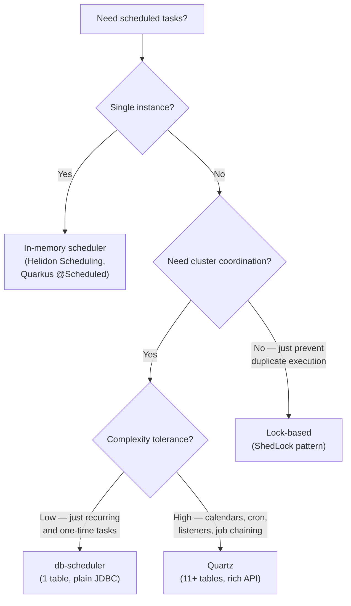
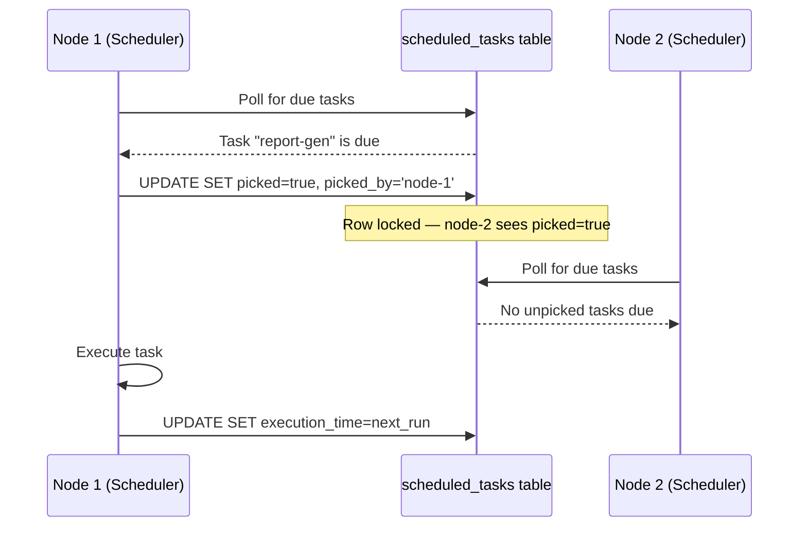

# Scheduling Beyond Spring — db-scheduler, Helidon Scheduling, and Quarkus Quartz

**Date:** 2026-04-19 | **Updated:** 2026-04-19
**Tags:** `scheduling` `db-scheduler` `helidon` `quarkus` `quartz`

## Table of Contents

- [Summary](#summary)
- [Landscape — When You Need More Than @Scheduled](#landscape--when-you-need-more-than-scheduled)
- [db-scheduler — One Table, Zero Framework Coupling](#db-scheduler--one-table-zero-framework-coupling)
  - [Core Concepts](#core-concepts)
  - [Schema](#schema)
  - [Task Types](#task-types)
  - [Creating the Scheduler](#creating-the-scheduler)
  - [Failure Handling and Dead Executions](#failure-handling-and-dead-executions)
  - [Polling Strategies](#polling-strategies)
- [db-scheduler with Helidon](#db-scheduler-with-helidon)
  - [Helidon SE Integration](#helidon-se-integration)
  - [Helidon MP Integration](#helidon-mp-integration)
- [db-scheduler with Quarkus](#db-scheduler-with-quarkus)
- [Helidon Built-in Scheduling](#helidon-built-in-scheduling)
  - [Helidon SE — Builder API](#helidon-se--builder-api)
  - [Helidon MP — @Scheduled](#helidon-mp--scheduled)
- [Quarkus Scheduling — @Scheduled and Quartz](#quarkus-scheduling--scheduled-and-quartz)
  - [quarkus-scheduler — Lightweight In-Memory](#quarkus-scheduler--lightweight-in-memory)
  - [quarkus-quartz — Clustered and Persistent](#quarkus-quartz--clustered-and-persistent)
  - [Clustered Mode Configuration](#clustered-mode-configuration)
  - [Programmatic Job Scheduling](#programmatic-job-scheduling)
  - [Misfire Policies](#misfire-policies)
- [Decision Guide](#decision-guide)
- [Related](#related)
- [References](#references)

---

## Summary

Distributed scheduling in Java requires cluster-safe, database-persisted task execution — something in-memory `@Scheduled` cannot provide. This doc covers three approaches outside the Spring ecosystem: [db-scheduler](https://github.com/kagkarlsson/db-scheduler) (a framework-agnostic library using a single DB table), [Helidon's built-in scheduling](https://helidon.io/docs/latest/apidocs/io.helidon.scheduling/io/helidon/scheduling/Scheduling.html) (in-memory only), and [Quarkus Quartz](https://quarkus.io/guides/quartz) (Quartz integration with clustering and JDBC persistence). For the Spring equivalent, see [Task Scheduling in Spring](events-async/scheduling.md).

---

## Landscape — When You Need More Than @Scheduled



| Need | In-Memory | db-scheduler | Quartz |
|------|-----------|-------------|--------|
| Single instance, simple cron | Yes | Overkill | Overkill |
| Multi-instance, prevent duplicates | No | Yes | Yes |
| Persistent across restarts | No | Yes | Yes |
| Dynamic task creation at runtime | Limited | Yes (OneTimeTask) | Yes (JobDetail) |
| Complex calendars / job chaining | No | No | Yes |
| Schema overhead | 0 tables | 1 table | 11+ tables |
| Framework coupling | Framework-specific | None (plain JDBC) | None (or Quarkus extension) |

---

## db-scheduler — One Table, Zero Framework Coupling

[db-scheduler](https://github.com/kagkarlsson/db-scheduler) is a lightweight alternative to Quartz by [Gustav Karlsson](https://github.com/kagkarlsson). Its only hard dependency is SLF4J. It works with any `javax.sql.DataSource` — no Spring, no CDI, no framework required.

### Core Concepts

- **RecurringTask** — executes on a schedule (cron or fixed delay); one logical instance in the DB
- **OneTimeTask** — executes once at a specified time; many instances can be scheduled dynamically
- **Scheduler** — polls the DB, picks tasks due for execution, runs them on a thread pool
- **Cluster-safe** — uses database row-level locking to guarantee a task runs on exactly one node



### Schema

A single table — contrast with Quartz's 11+ tables:

```sql
-- PostgreSQL
CREATE TABLE scheduled_tasks (
    task_name       TEXT                     NOT NULL,
    task_instance   TEXT                     NOT NULL,
    task_data       BYTEA,
    execution_time  TIMESTAMPTZ              NOT NULL,
    picked          BOOLEAN                  NOT NULL,
    picked_by       TEXT,
    last_success    TIMESTAMPTZ,
    last_failure    TIMESTAMPTZ,
    consecutive_failures INT,
    last_heartbeat  TIMESTAMPTZ,
    version         BIGINT                   NOT NULL,
    PRIMARY KEY (task_name, task_instance)
);

CREATE INDEX execution_time_idx ON scheduled_tasks (execution_time);
CREATE INDEX last_heartbeat_idx ON scheduled_tasks (last_heartbeat);
```

Column purposes:

| Column | Role |
|--------|------|
| `task_name` | Identifies the task type (e.g., `"send-report"`) |
| `task_instance` | Unique instance ID — for recurring: fixed (e.g., `"DEFAULT"`); for one-time: caller-provided |
| `task_data` | Serialized payload (Java serialization or JSON) |
| `execution_time` | When to run next |
| `picked` / `picked_by` | Cluster lock — which node claimed this execution |
| `last_heartbeat` | Liveness signal — detects dead executions |
| `version` | Optimistic locking for concurrent updates |

### Task Types

#### RecurringTask

Runs on a schedule. After completion, the next `execution_time` is calculated automatically.

```java
import com.github.kagkarlsson.scheduler.task.helper.RecurringTask;
import com.github.kagkarlsson.scheduler.task.helper.Tasks;
import com.github.kagkarlsson.scheduler.task.schedule.FixedDelay;
import com.github.kagkarlsson.scheduler.task.schedule.Schedules;

// Fixed delay — 1 hour after last completion
RecurringTask<Void> hourlyCleanup = Tasks.recurring("hourly-cleanup",
        FixedDelay.ofHours(1))
    .execute((taskInstance, ctx) -> {
        cleanupExpiredSessions();
    });

// Cron expression — every day at 02:00
RecurringTask<Void> dailyReport = Tasks.recurring("daily-report",
        Schedules.cron("0 0 2 * * *"))
    .execute((taskInstance, ctx) -> {
        generateAndSendReport();
    });
```

#### OneTimeTask

Scheduled dynamically with a specific execution time and optional data payload.

```java
import com.github.kagkarlsson.scheduler.task.TaskDescriptor;
import com.github.kagkarlsson.scheduler.task.helper.OneTimeTask;

// Define the task descriptor (reusable reference)
TaskDescriptor<EmailData> SEND_EMAIL =
    TaskDescriptor.of("send-email", EmailData.class);

// Define the task implementation
OneTimeTask<EmailData> sendEmailTask = Tasks.oneTime(SEND_EMAIL)
    .execute((taskInstance, ctx) -> {
        EmailData data = taskInstance.getData();
        emailService.send(data.to(), data.subject(), data.body());
    });

// Schedule an instance at runtime
scheduler.schedule(
    SEND_EMAIL
        .instanceWithId("order-confirm-1045")
        .data(new EmailData("user@example.com", "Order Confirmed", "..."))
        .scheduledTo(Instant.now().plusSeconds(30))
);
```

### Creating the Scheduler

```java
import com.github.kagkarlsson.scheduler.Scheduler;
import javax.sql.DataSource;

Scheduler scheduler = Scheduler.create(dataSource)
    .startTasks(hourlyCleanup, dailyReport)  // recurring tasks auto-schedule
    .registerTasks(sendEmailTask)             // one-time tasks registered but not auto-scheduled
    .threads(5)                               // execution thread pool size
    .pollingInterval(Duration.ofSeconds(10))  // how often to check for due tasks
    .build();

scheduler.start();  // begins polling
// scheduler.stop();  // graceful shutdown
```

### Failure Handling and Dead Executions

```java
RecurringTask<Void> resilientTask = Tasks.recurring("resilient-task",
        FixedDelay.ofMinutes(30))
    .onFailure((executionComplete, executionOperations) -> {
        // Default: retry with exponential backoff
        // Custom: reschedule to a specific time
        executionOperations.reschedule(
            executionComplete, Instant.now().plusSeconds(60));
    })
    .onDeadExecution((execution, executionOperations) -> {
        // Triggered when heartbeat is stale (node crashed mid-execution)
        // Default: reschedule to now()
        executionOperations.reschedule(execution, Instant.now());
    })
    .execute((inst, ctx) -> {
        riskyOperation();
    });
```

**Heartbeat mechanism**: While a task executes, the scheduler periodically updates `last_heartbeat` in the DB (default: every 5 minutes). If a node crashes, other nodes detect the stale heartbeat after `missedHeartbeatsLimit` (default: 6) missed beats and reclaim the task.

### Polling Strategies

| Strategy | How It Works | Best For |
|----------|-------------|----------|
| **fetch-and-lock-on-execute** (default) | Fetch due tasks, then compete for locks at execution time | Low-to-moderate throughput |
| **lock-and-fetch** | `SELECT ... FOR UPDATE SKIP LOCKED` — atomically lock and fetch | High throughput, PostgreSQL/MySQL |

```java
// Enable lock-and-fetch (requires PostgreSQL or MySQL)
Scheduler scheduler = Scheduler.create(dataSource)
    .pollUsingLockAndFetch(0.5, 1.0)  // lower/upper limit fractions
    .startTasks(myTask)
    .build();
```

---

## db-scheduler with Helidon

There is no official Helidon starter for db-scheduler. Integration is manual but straightforward since db-scheduler only needs a `DataSource`.

### Helidon SE Integration

```java
import com.github.kagkarlsson.scheduler.Scheduler;
import io.helidon.webserver.WebServer;
import io.helidon.webserver.http.HttpRouting;
import javax.sql.DataSource;
import com.zaxxer.hikari.HikariDataSource;

public class Main {

    public static void main(String[] args) {
        // 1. Create DataSource
        HikariDataSource dataSource = createDataSource();

        // 2. Define tasks
        RecurringTask<Void> cleanup = Tasks.recurring("cleanup",
                FixedDelay.ofHours(1))
            .execute((inst, ctx) -> cleanupExpired());

        TaskDescriptor<NotifyData> NOTIFY =
            TaskDescriptor.of("send-notification", NotifyData.class);

        OneTimeTask<NotifyData> notifyTask = Tasks.oneTime(NOTIFY)
            .execute((inst, ctx) -> sendNotification(inst.getData()));

        // 3. Build and start scheduler
        Scheduler scheduler = Scheduler.create(dataSource)
            .startTasks(cleanup)
            .registerTasks(notifyTask)
            .threads(5)
            .build();
        scheduler.start();

        // 4. Start Helidon web server — expose scheduling endpoint
        WebServer server = WebServer.builder()
            .routing(routing -> routing
                .post("/schedule-notification", (req, res) -> {
                    NotifyData data = req.content().as(NotifyData.class);
                    scheduler.schedule(
                        NOTIFY.instanceWithId(UUID.randomUUID().toString())
                            .data(data)
                            .scheduledTo(Instant.now().plusSeconds(5))
                    );
                    res.status(202).send("Scheduled");
                })
            )
            .port(8080)
            .build()
            .start();

        // 5. Shutdown hook
        Runtime.getRuntime().addShutdownHook(new Thread(() -> {
            scheduler.stop();
            server.stop();
            dataSource.close();
        }));
    }

    private static HikariDataSource createDataSource() {
        HikariDataSource ds = new HikariDataSource();
        ds.setJdbcUrl("jdbc:postgresql://localhost:5432/mydb");
        ds.setUsername("app");
        ds.setPassword(System.getenv("DB_PASSWORD"));
        return ds;
    }
}
```

Maven dependency:

```xml
<dependency>
    <groupId>com.github.kagkarlsson</groupId>
    <artifactId>db-scheduler</artifactId>
    <version>16.7.0</version>
</dependency>
```

### Helidon MP Integration

In MP, use a CDI `@ApplicationScoped` bean with `@Observes` for lifecycle:

```java
import com.github.kagkarlsson.scheduler.Scheduler;
import jakarta.enterprise.context.ApplicationScoped;
import jakarta.enterprise.event.Observes;
import jakarta.inject.Inject;
import io.helidon.microprofile.cdi.RuntimeStart;

@ApplicationScoped
public class SchedulerProducer {

    @Inject
    private DataSource dataSource;

    private Scheduler scheduler;

    void onStart(@Observes RuntimeStart event) {
        RecurringTask<Void> cleanup = Tasks.recurring("cleanup",
                FixedDelay.ofHours(1))
            .execute((inst, ctx) -> cleanupExpired());

        scheduler = Scheduler.create(dataSource)
            .startTasks(cleanup)
            .threads(5)
            .build();
        scheduler.start();
    }

    void onStop(@Observes @jakarta.enterprise.event.shutdown Object event) {
        if (scheduler != null) {
            scheduler.stop();
        }
    }

    public Scheduler getScheduler() {
        return scheduler;
    }
}
```

---

## db-scheduler with Quarkus

Same approach — no official extension exists. Use the plain library with a CDI startup bean:

```java
import com.github.kagkarlsson.scheduler.Scheduler;
import io.quarkus.runtime.ShutdownEvent;
import io.quarkus.runtime.StartupEvent;
import jakarta.enterprise.context.ApplicationScoped;
import jakarta.enterprise.event.Observes;
import jakarta.inject.Inject;
import javax.sql.DataSource;

@ApplicationScoped
public class DbSchedulerProducer {

    @Inject
    DataSource dataSource;  // Quarkus injects the default datasource

    private Scheduler scheduler;

    void onStart(@Observes StartupEvent event) {
        RecurringTask<Void> cleanup = Tasks.recurring("cleanup",
                FixedDelay.ofHours(1))
            .execute((inst, ctx) -> cleanupExpired());

        scheduler = Scheduler.create(dataSource)
            .startTasks(cleanup)
            .threads(5)
            .build();
        scheduler.start();
    }

    void onStop(@Observes ShutdownEvent event) {
        if (scheduler != null) {
            scheduler.stop();
        }
    }
}
```

Quarkus injects `javax.sql.DataSource` from `quarkus.datasource.*` config. db-scheduler works immediately — no additional wiring needed.

> **Note**: If your Quarkus app already uses `quarkus-quartz` for cluster-safe scheduling, adding db-scheduler is likely redundant. db-scheduler shines when you want cluster-safe scheduling **without** Quartz's complexity or when using Helidon (which has no Quartz integration).

---

## Helidon Built-in Scheduling

Helidon includes an in-memory scheduling module. It is **not** cluster-safe and **not** persistent — tasks are lost on restart. Use it for lightweight, single-instance recurring work.

### Helidon SE — Builder API

```java
import io.helidon.scheduling.Scheduling;

// Cron-based
Scheduling.cron()
    .expression("0 0 2 * * *")  // daily at 02:00
    .task(inv -> generateDailyReport())
    .build();

// Fixed-rate
Scheduling.fixedRate()
    .delay(10)
    .initialDelay(0)
    .timeUnit(TimeUnit.SECONDS)
    .task(inv -> checkHealthOfDependencies())
    .build();
```

Cron format: `<seconds> <minutes> <hours> <day-of-month> <month> <day-of-week> <year>`.

Configuration-driven alternative:

```yaml
# application.yaml
scheduling:
  daily-report:
    cron: "0 0 2 * * *"
  health-check:
    fixed-rate:
      delay-seconds: 10
```

### Helidon MP — @Scheduled

```java
import io.helidon.microprofile.scheduling.Scheduled;
import jakarta.enterprise.context.ApplicationScoped;

@ApplicationScoped
public class ScheduledTasks {

    @Scheduled("0 0 2 * * *")  // cron expression
    void dailyReport() {
        generateDailyReport();
    }

    @Scheduled(value = "0/10 * * * * *")  // every 10 seconds
    void healthCheck() {
        checkHealthOfDependencies();
    }
}
```

### Limitations

- **Not cluster-safe** — every instance runs every scheduled task independently
- **Not persistent** — no DB table, no surviving restarts
- **No dynamic scheduling** — you cannot schedule a task at runtime with custom data

For cluster-safe scheduling in Helidon, use db-scheduler (above) or a message broker-based approach.

---

## Quarkus Scheduling — @Scheduled and Quartz

Quarkus has two scheduler extensions with a shared API:

| Extension | Persistence | Clustering | Use Case |
|-----------|------------|------------|----------|
| `quarkus-scheduler` | No (in-memory) | No | Simple cron/interval on a single instance |
| `quarkus-quartz` | Yes (JDBC) | Yes | Multi-instance, persistent, complex scheduling |

Both use the same `@Scheduled` annotation — swapping from in-memory to Quartz requires only a dependency change and config.

### quarkus-scheduler — Lightweight In-Memory

```bash
quarkus extension add scheduler
```

```java
import io.quarkus.scheduler.Scheduled;
import jakarta.enterprise.context.ApplicationScoped;

@ApplicationScoped
public class ScheduledTasks {

    @Scheduled(every = "10s", identity = "health-check")
    void checkHealth() {
        pingDependencies();
    }

    @Scheduled(cron = "0 0 2 * * ?", identity = "daily-report")
    void dailyReport() {
        generateReport();
    }
}
```

Same limitation as Helidon's built-in: not cluster-safe, not persistent.

### quarkus-quartz — Clustered and Persistent

```bash
quarkus extension add quartz
```

When `quarkus-quartz` is on the classpath, it **replaces** `quarkus-scheduler` as the scheduling implementation. The same `@Scheduled` annotations work, but now tasks are persisted in the database and coordinated across nodes.

```xml
<dependency>
    <groupId>io.quarkus</groupId>
    <artifactId>quarkus-quartz</artifactId>
</dependency>
```

### Clustered Mode Configuration

```properties
# application.properties

# Enable clustering
quarkus.quartz.clustered=true
quarkus.quartz.cluster-checkin-interval=15000

# Use JDBC job store
quarkus.quartz.store-type=jdbc-cmt
quarkus.quartz.datasource=<default>

# Instance identification (AUTO generates hostname + timestamp)
quarkus.quartz.instance-id=AUTO

# Start mode: forced starts even if tables are empty
quarkus.quartz.start-mode=forced
```

**Database tables**: Quartz requires 11+ tables. Create them via Flyway migration using the DDL scripts from the [Quartz repository](https://github.com/quartz-scheduler/quartz/tree/main/quartz/src/main/resources/org/quartz/impl/jdbcjobstore):

```sql
-- V1__quartz_tables.sql (PostgreSQL)
-- Download from: https://github.com/quartz-scheduler/quartz/blob/main/quartz/src/main/resources/org/quartz/impl/jdbcjobstore/tables_postgres.sql
-- Tables include: QRTZ_JOB_DETAILS, QRTZ_TRIGGERS, QRTZ_SIMPLE_TRIGGERS,
-- QRTZ_CRON_TRIGGERS, QRTZ_BLOB_TRIGGERS, QRTZ_FIRED_TRIGGERS,
-- QRTZ_PAUSED_TRIGGER_GRPS, QRTZ_SCHEDULER_STATE, QRTZ_LOCKS,
-- QRTZ_CALENDARS, QRTZ_SIMPROP_TRIGGERS
```

### Programmatic Job Scheduling

For dynamic job creation (beyond `@Scheduled`), inject the native Quartz `Scheduler`:

```java
import org.quartz.JobBuilder;
import org.quartz.JobDetail;
import org.quartz.Scheduler;
import org.quartz.SimpleScheduleBuilder;
import org.quartz.TriggerBuilder;
import jakarta.inject.Inject;

@ApplicationScoped
public class DynamicJobService {

    @Inject
    org.quartz.Scheduler quartz;

    public void scheduleOneTimeJob(String orderId, Instant runAt) throws Exception {
        JobDetail job = JobBuilder.newJob(OrderFollowUpJob.class)
            .withIdentity("follow-up-" + orderId, "orders")
            .usingJobData("orderId", orderId)
            .build();

        var trigger = TriggerBuilder.newTrigger()
            .withIdentity("trigger-" + orderId, "orders")
            .startAt(Date.from(runAt))
            .build();

        quartz.scheduleJob(job, trigger);
    }
}
```

The `Job` implementation:

```java
import org.quartz.Job;
import org.quartz.JobExecutionContext;

// Must be registered for CDI injection in Quarkus
@ApplicationScoped
public class OrderFollowUpJob implements Job {

    @Inject
    OrderService orderService;

    @Override
    public void execute(JobExecutionContext context) {
        String orderId = context.getJobDetail()
            .getJobDataMap().getString("orderId");
        orderService.sendFollowUp(orderId);
    }
}
```

### Misfire Policies

When a trigger misfires (e.g., the app was down when the job was due), configure per-job behavior:

```properties
# Options: smart-policy (default), fire-now, ignore-misfire-policy,
#          do-nothing, next-with-existing-count, next-with-remaining-count,
#          now-with-existing-count, now-with-remaining-count
quarkus.quartz.misfire-policy.daily-report=fire-now
quarkus.quartz.misfire-policy.health-check=ignore-misfire-policy
```

### Quarkus Quartz Specifics

Key differences from standalone Quartz:

- **Thread pool**: Quartz threads are not used to execute `@Scheduled` methods — the regular Quarkus thread pool is used by default
- **Virtual threads**: Annotate with `@RunOnVirtualThread` to execute jobs on virtual threads (requires Java 21+)
- **Native image**: `JobDataMap` values that are serialized require GraalVM reflection registration
- **Instance ID**: Auto-generated from hostname + timestamp — no manual configuration needed per node

---

## Decision Guide

| Scenario | Recommendation |
|----------|---------------|
| Single Helidon instance, simple cron | Helidon built-in `Scheduling.cron()` or `@Scheduled` |
| Single Quarkus instance, simple cron | `quarkus-scheduler` with `@Scheduled` |
| Multi-instance Helidon, need cluster-safe | **db-scheduler** (only option — no Quartz integration) |
| Multi-instance Quarkus, need cluster-safe | **quarkus-quartz** (native extension, easy setup) |
| Multi-instance Quarkus, want simpler schema | **db-scheduler** (1 table vs 11+), manual CDI wiring |
| Complex calendars, job chaining, listeners | **Quartz** (Quarkus extension or standalone) |
| Framework-agnostic, reusable across stacks | **db-scheduler** (works with any `DataSource`) |
| Already using Spring Boot | `db-scheduler-spring-boot-starter` or Spring Quartz (see [Spring scheduling doc](events-async/scheduling.md)) |

### db-scheduler vs Quartz — Quick Comparison

| Aspect | db-scheduler | Quartz |
|--------|-------------|--------|
| **Tables** | 1 | 11+ |
| **Dependencies** | SLF4J only | Quartz JAR + JDBC |
| **API style** | Functional builders | XML/annotation + `JobDetail`/`Trigger` |
| **Recurring tasks** | `RecurringTask` with `FixedDelay` or cron | `CronTrigger` / `SimpleTrigger` |
| **One-time tasks** | `OneTimeTask` with data | `JobDetail` with `JobDataMap` |
| **Cluster coordination** | Row-level DB locks | DB locks (QRTZ_LOCKS table) |
| **Misfire handling** | `onFailure` callback | Misfire instructions on triggers |
| **Heartbeat** | Built-in (configurable interval) | Cluster check-in interval |
| **Dynamic scheduling** | `scheduler.schedule(...)` | `scheduler.scheduleJob(...)` |
| **Spring integration** | Official starter | Official starter |
| **Helidon integration** | Manual (plain JDBC) | None |
| **Quarkus integration** | Manual (CDI bean) | Official extension |
| **Job chaining** | Not built-in | `JobChainingJobListener` |
| **Calendars** | Not supported | Full calendar support |

---

## Related

- [Task Scheduling in Spring](events-async/scheduling.md) — `@Scheduled`, ShedLock, Quartz in Spring Boot
- [Helidon Overview](helidon/helidon-overview.md) — framework positioning and when to choose Helidon
- [Helidon SE](helidon/helidon-se.md) — functional model, Config API, WebServer
- [Helidon MP](helidon/helidon-mp.md) — CDI, MicroProfile specs
- [Database Configuration in Spring Boot](configurations/database-config.md) — DataSource setup for comparison

## References

- [db-scheduler — GitHub](https://github.com/kagkarlsson/db-scheduler) — source, README, examples, schema DDL
- [db-scheduler Javadoc — Tasks API](https://javadoc.io/static/com.github.kagkarlsson/db-scheduler/5.1/com/github/kagkarlsson/scheduler/task/helper/Tasks.html) — RecurringTask, OneTimeTask builders
- [Quarkus Quartz Guide](https://quarkus.io/guides/quartz) — official clustering, JDBC, misfire config
- [Quarkus Scheduler Reference](https://quarkus.io/guides/scheduler-reference) — `@Scheduled` annotation, in-memory scheduler
- [Helidon Scheduling API — Javadoc](https://helidon.io/docs/latest/apidocs/io.helidon.scheduling/io/helidon/scheduling/Scheduling.html) — cron and fixed-rate builders
- [Helidon MP @Scheduled — Javadoc](https://helidon.io/docs/latest/apidocs/io.helidon.microprofile.scheduling/io/helidon/microprofile/scheduling/Scheduled.html) — MP annotation
- [Quartz PostgreSQL DDL Scripts](https://github.com/quartz-scheduler/quartz/tree/main/quartz/src/main/resources/org/quartz/impl/jdbcjobstore) — table creation scripts
- [Persistent Job Scheduling Without Quartz — Bekk](https://www.bekk.christmas/post/2019/12/persistent-job-scheduling-without-quartz) — db-scheduler introduction
