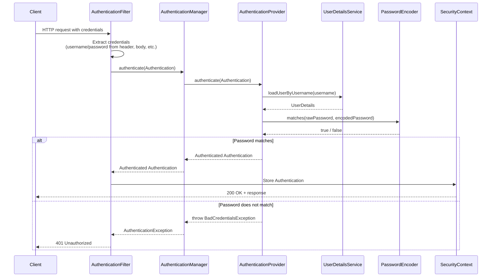
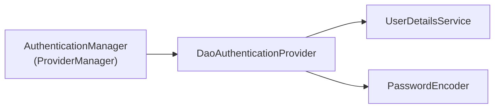
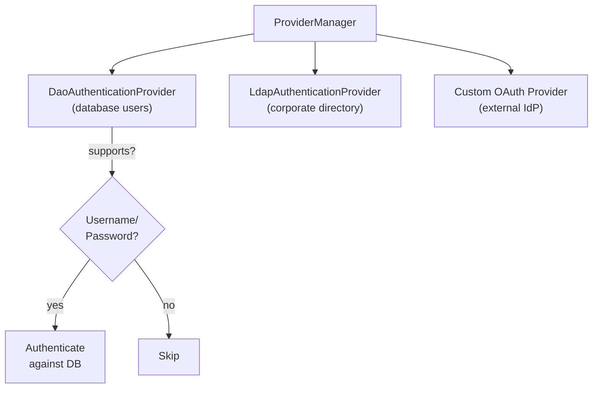
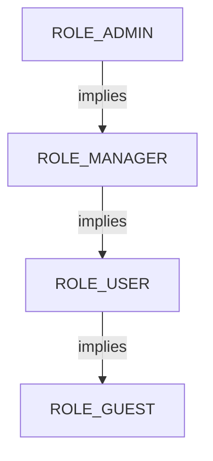

# Authentication and Authorization in Spring Security

**Date:** 2026-04-17 | **Updated:** 2026-04-17
**Tags:** `spring-security` `authentication` `authorization` `userdetailsservice` `password-encoder` `method-security` `role-hierarchy` `webflux`

## Table of Contents

- [Summary](#summary)
- [Authentication Architecture](#authentication-architecture)
  - [The Full Authentication Flow](#the-full-authentication-flow)
  - [Key Interfaces](#key-interfaces)
- [UserDetailsService](#userdetailsservice)
  - [In-Memory Implementation](#in-memory-implementation)
  - [JDBC Implementation](#jdbc-implementation)
  - [Custom JPA Implementation](#custom-jpa-implementation)
  - [The UserDetails Contract](#the-userdetails-contract)
- [PasswordEncoder](#passwordencoder)
  - [BCryptPasswordEncoder](#bcryptpasswordencoder)
  - [DelegatingPasswordEncoder](#delegatingpasswordencoder)
  - [Other Encoders](#other-encoders)
- [AuthenticationManager and AuthenticationProvider](#authenticationmanager-and-authenticationprovider)
  - [DaoAuthenticationProvider](#daoauthenticationprovider)
  - [Multiple Providers](#multiple-providers)
  - [Custom AuthenticationProvider](#custom-authenticationprovider)
- [SecurityContext](#securitycontext)
  - [SecurityContextHolder](#securitycontextholder)
  - [Accessing the Principal in Controllers](#accessing-the-principal-in-controllers)
  - [Reactive SecurityContext](#reactive-securitycontext)
- [URL-Based Authorization](#url-based-authorization)
  - [SecurityFilterChain Configuration](#securityfilterchain-configuration)
  - [Authorization Methods Reference](#authorization-methods-reference)
- [Method-Level Authorization](#method-level-authorization)
  - [@PreAuthorize](#preauthorize)
  - [@PostAuthorize](#postauthorize)
  - [@Secured and @RolesAllowed](#secured-and-rolesallowed)
  - [Comparison Table](#comparison-table)
- [Role Hierarchy](#role-hierarchy)
- [Session Management](#session-management)
  - [Session Creation Policies](#session-creation-policies)
  - [Stateless Configuration for REST APIs](#stateless-configuration-for-rest-apis)
  - [Session Fixation Protection](#session-fixation-protection)
- [Custom AccessDeniedHandler and AuthenticationEntryPoint](#custom-accessdeniedhandler-and-authenticationentrypoint)
- [Reactive Authentication](#reactive-authentication)
  - [ReactiveUserDetailsService](#reactiveuserdetailsservice)
  - [ReactiveAuthenticationManager](#reactiveauthenticationmanager)
  - [Reactive SecurityFilterChain](#reactive-securityfilterchain)
- [Related](#related)
- [References](#references)

---

## Summary

Spring Security separates **authentication** (who are you?) from **authorization** (what can you do?) through distinct, composable components. Authentication flows through a chain of `AuthenticationFilter` -> `AuthenticationManager` -> `AuthenticationProvider` -> `UserDetailsService`, producing a validated `Authentication` object stored in the `SecurityContext`. Authorization evaluates that principal against rules defined at the URL level (`authorizeHttpRequests`) or method level (`@PreAuthorize`, `@PostAuthorize`). This separation means you can swap authentication strategies (database, LDAP, OAuth2) without changing authorization rules, and vice versa.

---

## Authentication Architecture

### The Full Authentication Flow



### Key Interfaces

| Interface | Responsibility |
|---|---|
| `Authentication` | Token holding credentials (pre-auth) or principal + authorities (post-auth) |
| `AuthenticationManager` | Single `authenticate()` method — the entry point for authentication logic |
| `ProviderManager` | Default `AuthenticationManager` implementation — delegates to a list of `AuthenticationProvider`s |
| `AuthenticationProvider` | Performs actual authentication against a specific mechanism |
| `UserDetailsService` | Loads user-specific data by username |
| `UserDetails` | Core user information (username, password, authorities, account status) |
| `PasswordEncoder` | Encodes and verifies passwords |
| `GrantedAuthority` | Represents a permission or role granted to the principal |

---

## UserDetailsService

`UserDetailsService` is the core contract Spring Security uses to retrieve user data during authentication. It has a single method: `loadUserByUsername(String username)` that returns a `UserDetails` object.

### In-Memory Implementation

Suitable for development and testing only. Never use this in production.

```java
@Bean
public InMemoryUserDetailsManager userDetailsService() {
    UserDetails user = User.withDefaultPasswordEncoder()
        .username("user")
        .password("password")
        .roles("USER")
        .build();

    UserDetails admin = User.withDefaultPasswordEncoder()
        .username("admin")
        .password("password")
        .roles("ADMIN")
        .build();

    return new InMemoryUserDetailsManager(user, admin);
}
```

> `User.withDefaultPasswordEncoder()` is deprecated for production use because it stores passwords with a weak encoder. It remains useful for quick prototyping.

### JDBC Implementation

For applications that store users in a relational database with Spring Security's default schema:

```java
@Bean
public JdbcUserDetailsManager userDetailsService(DataSource dataSource) {
    return new JdbcUserDetailsManager(dataSource);
}
```

This expects the standard `users` and `authorities` tables. You can customize the queries:

```java
@Bean
public JdbcUserDetailsManager userDetailsService(DataSource dataSource) {
    JdbcUserDetailsManager manager = new JdbcUserDetailsManager(dataSource);
    manager.setUsersByUsernameQuery(
        "SELECT username, password, enabled FROM app_users WHERE username = ?");
    manager.setAuthoritiesByUsernameQuery(
        "SELECT username, authority FROM app_authorities WHERE username = ?");
    return manager;
}
```

### Custom JPA Implementation

Most real applications implement `UserDetailsService` directly to work with their own entity model:

```java
@Service
public class CustomUserDetailsService implements UserDetailsService {

    private final UserRepository userRepository;

    public CustomUserDetailsService(UserRepository userRepository) {
        this.userRepository = userRepository;
    }

    @Override
    public UserDetails loadUserByUsername(String username) throws UsernameNotFoundException {
        return userRepository.findByUsername(username)
            .orElseThrow(() -> new UsernameNotFoundException(
                "User not found: " + username));
    }
}
```

The `User` entity must implement `UserDetails` or you must map it to a `UserDetails` instance:

```java
@Entity
@Table(name = "app_users")
public class AppUser implements UserDetails {

    @Id
    @GeneratedValue(strategy = GenerationType.IDENTITY)
    private Long id;
    private String username;
    private String password;
    private boolean enabled;

    @ElementCollection(fetch = FetchType.EAGER)
    private Set<String> roles;

    @Override
    public Collection<? extends GrantedAuthority> getAuthorities() {
        return roles.stream()
            .map(role -> new SimpleGrantedAuthority("ROLE_" + role))
            .toList();
    }

    @Override public String getUsername() { return username; }
    @Override public String getPassword() { return password; }
    @Override public boolean isEnabled() { return enabled; }
    @Override public boolean isAccountNonExpired() { return true; }
    @Override public boolean isAccountNonLocked() { return true; }
    @Override public boolean isCredentialsNonExpired() { return true; }
}
```

### The UserDetails Contract

| Method | Purpose |
|---|---|
| `getAuthorities()` | Roles and permissions granted to the user |
| `getPassword()` | Encoded password for verification |
| `getUsername()` | Unique identifier for lookup |
| `isAccountNonExpired()` | `false` blocks authentication |
| `isAccountNonLocked()` | `false` blocks authentication |
| `isCredentialsNonExpired()` | `false` blocks authentication |
| `isEnabled()` | `false` blocks authentication |

---

## PasswordEncoder

**Never store passwords in plain text.** Spring Security requires a `PasswordEncoder` to hash passwords before storage and to verify them during authentication.

### BCryptPasswordEncoder

The default and recommended choice for most applications. BCrypt automatically handles salting and is deliberately slow to resist brute-force attacks:

```java
@Bean
public PasswordEncoder passwordEncoder() {
    return new BCryptPasswordEncoder();
}
```

You can tune the strength (log rounds). The default is 10:

```java
// Strength 12 — roughly 4x slower than default 10
@Bean
public PasswordEncoder passwordEncoder() {
    return new BCryptPasswordEncoder(12);
}
```

### DelegatingPasswordEncoder

Handles password migration across encoding schemes. Each stored password is prefixed with its encoder ID (e.g., `{bcrypt}`, `{noop}`, `{scrypt}`):

```java
@Bean
public PasswordEncoder passwordEncoder() {
    return PasswordEncoderFactories.createDelegatingPasswordEncoder();
}
```

Stored passwords look like:

```text
{bcrypt}$2a$10$dXJ3SW6G7P50lGmMQoeF3eK1...
{noop}plainTextPassword
{scrypt}$e0801$8bWJaSu2IKSn9Z...
```

This is the approach to use when migrating from an old encoder — new passwords get the current default (BCrypt), while existing passwords continue to verify against their original encoder.

### Other Encoders

| Encoder | Use Case |
|---|---|
| `BCryptPasswordEncoder` | General purpose — the standard choice |
| `Argon2PasswordEncoder` | Memory-hard — better resistance to GPU attacks |
| `SCryptPasswordEncoder` | Memory-hard — similar to Argon2 |
| `Pbkdf2PasswordEncoder` | NIST-approved — use when compliance requires it |
| `NoOpPasswordEncoder` | **Testing only** — stores plain text, never for production |

---

## AuthenticationManager and AuthenticationProvider

### DaoAuthenticationProvider

The most common `AuthenticationProvider` — it combines a `UserDetailsService` with a `PasswordEncoder`:



Spring Boot auto-configures this when it detects a `UserDetailsService` bean and a `PasswordEncoder` bean. Explicit configuration looks like:

```java
@Bean
public AuthenticationManager authenticationManager(
        UserDetailsService userDetailsService,
        PasswordEncoder passwordEncoder) {

    DaoAuthenticationProvider provider = new DaoAuthenticationProvider();
    provider.setUserDetailsService(userDetailsService);
    provider.setPasswordEncoder(passwordEncoder);

    return new ProviderManager(provider);
}
```

### Multiple Providers

`ProviderManager` iterates through providers in order. The first provider that **supports** the given `Authentication` type and **succeeds** produces the result. If a provider throws `AuthenticationException`, the next one is tried:



```java
@Bean
public AuthenticationManager authenticationManager(
        DaoAuthenticationProvider daoProvider,
        LdapAuthenticationProvider ldapProvider) {

    return new ProviderManager(daoProvider, ldapProvider);
}
```

### Custom AuthenticationProvider

For authentication mechanisms beyond username/password (API keys, tokens from external services):

```java
@Component
public class ApiKeyAuthenticationProvider implements AuthenticationProvider {

    private final ApiKeyService apiKeyService;

    public ApiKeyAuthenticationProvider(ApiKeyService apiKeyService) {
        this.apiKeyService = apiKeyService;
    }

    @Override
    public Authentication authenticate(Authentication authentication)
            throws AuthenticationException {

        String apiKey = (String) authentication.getCredentials();
        ApiKeyDetails details = apiKeyService.validate(apiKey)
            .orElseThrow(() -> new BadCredentialsException("Invalid API key"));

        return new UsernamePasswordAuthenticationToken(
            details.getOwner(), null, details.getAuthorities());
    }

    @Override
    public boolean supports(Class<?> authentication) {
        return ApiKeyAuthenticationToken.class.isAssignableFrom(authentication);
    }
}
```

---

## SecurityContext

### SecurityContextHolder

After successful authentication, the `Authentication` object is stored in the `SecurityContext`, accessible via `SecurityContextHolder`:

```java
Authentication auth = SecurityContextHolder.getContext().getAuthentication();
String username = auth.getName();
Collection<? extends GrantedAuthority> authorities = auth.getAuthorities();
boolean isAdmin = authorities.stream()
    .anyMatch(a -> a.getAuthority().equals("ROLE_ADMIN"));
```

By default, `SecurityContextHolder` uses a `ThreadLocal` strategy — the context is bound to the current thread. This works naturally in the servlet stack where each request is handled by a single thread.

### Accessing the Principal in Controllers

Use `@AuthenticationPrincipal` to inject the principal directly into controller methods:

```java
@GetMapping("/me")
public ResponseEntity<UserProfile> currentUser(
        @AuthenticationPrincipal AppUser user) {
    return ResponseEntity.ok(new UserProfile(user.getUsername(), user.getRoles()));
}
```

You can also access it via `Principal`:

```java
@GetMapping("/me")
public ResponseEntity<String> currentUser(Principal principal) {
    return ResponseEntity.ok("Hello, " + principal.getName());
}
```

### Reactive SecurityContext

In WebFlux, there is no `ThreadLocal` — the context propagates through the Reactor context:

```java
@GetMapping("/me")
public Mono<String> currentUser() {
    return ReactiveSecurityContextHolder.getContext()
        .map(SecurityContext::getAuthentication)
        .map(Authentication::getName)
        .map(name -> "Hello, " + name);
}
```

Or with `@AuthenticationPrincipal` in reactive controllers:

```java
@GetMapping("/me")
public Mono<UserProfile> currentUser(
        @AuthenticationPrincipal AppUser user) {
    return Mono.just(new UserProfile(user.getUsername(), user.getRoles()));
}
```

---

## URL-Based Authorization

### SecurityFilterChain Configuration

Define access rules for URL patterns inside the `SecurityFilterChain`:

```java
@Bean
public SecurityFilterChain securityFilterChain(HttpSecurity http) throws Exception {
    return http
        .authorizeHttpRequests(auth -> auth
            .requestMatchers(HttpMethod.GET, "/api/public/**").permitAll()
            .requestMatchers("/api/admin/**").hasRole("ADMIN")
            .requestMatchers("/api/user/**").hasAnyRole("USER", "ADMIN")
            .requestMatchers(HttpMethod.POST, "/api/reports/**").hasAuthority("WRITE_REPORTS")
            .anyRequest().authenticated())
        .build();
}
```

**Rule ordering matters.** Spring evaluates matchers top to bottom and uses the first match. Place more specific rules before general ones. `.anyRequest()` must always come last.

### Authorization Methods Reference

| Method | Description | Example |
|---|---|---|
| `permitAll()` | No authentication required | Public endpoints, health checks |
| `authenticated()` | Any authenticated user | General protected resources |
| `hasRole("X")` | User has `ROLE_X` authority | `.hasRole("ADMIN")` checks for `ROLE_ADMIN` |
| `hasAnyRole("X","Y")` | User has any of the listed roles | `.hasAnyRole("USER", "ADMIN")` |
| `hasAuthority("X")` | User has exact authority string | `.hasAuthority("WRITE_REPORTS")` |
| `hasAnyAuthority("X","Y")` | User has any of the listed authorities | `.hasAnyAuthority("READ", "WRITE")` |
| `denyAll()` | Always rejects | Disabled endpoints |
| `access(AuthorizationManager)` | Custom logic via `AuthorizationManager` | Complex SpEL or programmatic rules |

> **Role vs Authority:** `hasRole("ADMIN")` automatically prepends `ROLE_` and checks for `ROLE_ADMIN`. `hasAuthority("ROLE_ADMIN")` checks the exact string. Use roles for coarse-grained access and authorities for fine-grained permissions.

---

## Method-Level Authorization

Enable method-level security with `@EnableMethodSecurity`:

```java
@Configuration
@EnableMethodSecurity  // replaces @EnableGlobalMethodSecurity in Spring Security 6+
public class MethodSecurityConfig { }
```

### @PreAuthorize

Evaluated **before** the method executes. Use SpEL expressions to define access rules:

```java
@PreAuthorize("hasRole('ADMIN')")
public List<User> getAllUsers() {
    return userRepository.findAll();
}

// Access method parameters via #paramName
@PreAuthorize("#userId == authentication.principal.id or hasRole('ADMIN')")
public UserProfile getUser(@Param("userId") Long userId) {
    return userRepository.findById(userId).orElseThrow();
}

// Delegate to a service bean
@PreAuthorize("@permissionService.canAccessProject(#projectId, authentication.principal)")
public Project getProject(Long projectId) {
    return projectRepository.findById(projectId).orElseThrow();
}
```

### @PostAuthorize

Evaluated **after** the method executes. Has access to the return value via `returnObject`:

```java
@PostAuthorize("returnObject.owner == authentication.name or hasRole('ADMIN')")
public Document getDocument(Long documentId) {
    return documentRepository.findById(documentId).orElseThrow();
}
```

> Use `@PostAuthorize` sparingly — the method runs fully before the check. Avoid it when the method has side effects.

### @Secured and @RolesAllowed

Simpler annotations that support only role-based checks (no SpEL):

```java
// @Secured — Spring-specific
@Secured("ROLE_ADMIN")
public void deleteUser(Long userId) { ... }

@Secured({"ROLE_USER", "ROLE_ADMIN"})
public List<Report> getReports() { ... }

// @RolesAllowed — JSR-250 standard
@RolesAllowed("ADMIN")
public void resetSystem() { ... }
```

To enable `@Secured` and `@RolesAllowed`:

```java
@EnableMethodSecurity(securedEnabled = true, jsr250Enabled = true)
```

### Comparison Table

| Feature | `@PreAuthorize` | `@PostAuthorize` | `@Secured` | `@RolesAllowed` |
|---|---|---|---|---|
| SpEL support | Yes | Yes | No | No |
| Access method params | Yes (`#param`) | Yes (`#param`) | No | No |
| Access return value | No | Yes (`returnObject`) | No | No |
| When evaluated | Before execution | After execution | Before execution | Before execution |
| Requires | `@EnableMethodSecurity` | `@EnableMethodSecurity` | `securedEnabled = true` | `jsr250Enabled = true` |
| Origin | Spring | Spring | Spring | JSR-250 |

---

## Role Hierarchy

Configure role inheritance so higher roles automatically include lower role permissions:

```java
@Bean
static RoleHierarchy roleHierarchy() {
    return RoleHierarchyImpl.withDefaultRolePrefix()
        .role("ADMIN").implies("MANAGER")
        .role("MANAGER").implies("USER")
        .role("USER").implies("GUEST")
        .build();
}
```

This creates the chain: `ADMIN` > `MANAGER` > `USER` > `GUEST`. An admin automatically has all permissions granted to manager, user, and guest.



Without role hierarchy, an endpoint requiring `hasRole('USER')` would reject an admin. With the hierarchy configured, the admin inherits all lower roles.

---

## Session Management

### Session Creation Policies

| Policy | Behavior |
|---|---|
| `ALWAYS` | Always creates an `HttpSession` |
| `IF_REQUIRED` | Creates a session only when needed (default) |
| `NEVER` | Never creates a session, but uses one if it already exists |
| `STATELESS` | Never creates or uses a session — each request is independent |

### Stateless Configuration for REST APIs

REST APIs should be stateless. No server-side session is needed when using token-based authentication (JWT, API keys):

```java
@Bean
public SecurityFilterChain securityFilterChain(HttpSecurity http) throws Exception {
    return http
        .sessionManagement(session -> session
            .sessionCreationPolicy(SessionCreationPolicy.STATELESS))
        .csrf(csrf -> csrf.disable())  // CSRF not needed for stateless APIs
        .build();
}
```

### Session Fixation Protection

For session-based applications, Spring Security protects against session fixation attacks by default. After authentication, the session ID is changed while preserving session attributes:

```java
.sessionManagement(session -> session
    .sessionFixation().migrateSession())  // default — creates new session, copies attributes
```

| Strategy | Behavior |
|---|---|
| `migrateSession()` | New session ID, attributes copied (default) |
| `newSession()` | New session ID, attributes discarded |
| `changeSessionId()` | Changes the ID of the existing session (Servlet 3.1+) |
| `none()` | No protection — not recommended |

---

## Custom AccessDeniedHandler and AuthenticationEntryPoint

Customize the HTTP responses for 401 (unauthenticated) and 403 (unauthorized) errors:

```java
@Bean
public SecurityFilterChain securityFilterChain(HttpSecurity http) throws Exception {
    return http
        .exceptionHandling(ex -> ex
            .authenticationEntryPoint((request, response, authException) -> {
                response.setStatus(HttpServletResponse.SC_UNAUTHORIZED);
                response.setContentType(MediaType.APPLICATION_JSON_VALUE);
                response.getWriter().write("""
                    {"error": "unauthorized", "message": "Authentication required"}
                    """);
            })
            .accessDeniedHandler((request, response, accessDeniedException) -> {
                response.setStatus(HttpServletResponse.SC_FORBIDDEN);
                response.setContentType(MediaType.APPLICATION_JSON_VALUE);
                response.getWriter().write("""
                    {"error": "forbidden", "message": "Insufficient permissions"}
                    """);
            }))
        .build();
}
```

- **AuthenticationEntryPoint** is invoked when an unauthenticated user tries to access a protected resource (HTTP 401)
- **AccessDeniedHandler** is invoked when an authenticated user lacks the required authority (HTTP 403)

---

## Reactive Authentication

The reactive stack (WebFlux) uses the same concepts but with reactive types (`Mono`, `Flux`) instead of blocking calls.

### ReactiveUserDetailsService

The reactive equivalent of `UserDetailsService`:

```java
@Service
public class ReactiveCustomUserDetailsService implements ReactiveUserDetailsService {

    private final ReactiveUserRepository userRepository;

    public ReactiveCustomUserDetailsService(ReactiveUserRepository userRepository) {
        this.userRepository = userRepository;
    }

    @Override
    public Mono<UserDetails> findByUsername(String username) {
        return userRepository.findByUsername(username)
            .cast(UserDetails.class)
            .switchIfEmpty(Mono.error(
                new UsernameNotFoundException("User not found: " + username)));
    }
}
```

### ReactiveAuthenticationManager

For custom reactive authentication:

```java
@Bean
public ReactiveAuthenticationManager reactiveAuthenticationManager(
        ReactiveUserDetailsService userDetailsService,
        PasswordEncoder passwordEncoder) {

    UserDetailsRepositoryReactiveAuthenticationManager manager =
        new UserDetailsRepositoryReactiveAuthenticationManager(userDetailsService);
    manager.setPasswordEncoder(passwordEncoder);
    return manager;
}
```

### Reactive SecurityFilterChain

```java
@Bean
public SecurityWebFilterChain securityWebFilterChain(ServerHttpSecurity http) {
    return http
        .authorizeExchange(exchange -> exchange
            .pathMatchers(HttpMethod.GET, "/api/public/**").permitAll()
            .pathMatchers("/api/admin/**").hasRole("ADMIN")
            .anyExchange().authenticated())
        .httpBasic(Customizer.withDefaults())
        .formLogin(ServerHttpSecurity.FormLoginSpec::disable)
        .csrf(ServerHttpSecurity.CsrfSpec::disable)
        .build();
}
```

Key differences from the servlet stack:

| Servlet (MVC) | Reactive (WebFlux) |
|---|---|
| `SecurityFilterChain` | `SecurityWebFilterChain` |
| `HttpSecurity` | `ServerHttpSecurity` |
| `authorizeHttpRequests()` | `authorizeExchange()` |
| `requestMatchers()` | `pathMatchers()` |
| `anyRequest()` | `anyExchange()` |
| `UserDetailsService` | `ReactiveUserDetailsService` |
| `AuthenticationManager` | `ReactiveAuthenticationManager` |
| `SecurityContextHolder` (ThreadLocal) | `ReactiveSecurityContextHolder` (Reactor Context) |

---

## Related

- [Security Filter Chain](security-filter-chain.md) — `SecurityFilterChain` configuration and filter ordering.
- [OAuth2 and JWT](oauth2-jwt.md) — OAuth2 Resource Server and JWT authentication.
- [OIDC and Modern Auth Flows](oidc-and-modern-auth.md) — PKCE, refresh rotation, WebAuthn, MFA.
- [Secrets Management](secrets-management.md) — where credentials and signing keys live.
- [Exception Handling](../validation/exception-handling.md) — global exception handling patterns.
- [API Gateway Patterns](../web-layer/api-gateway-patterns.md) — gateway-level auth and header forwarding.

---

## References

- [Spring Security Reference — Authentication](https://docs.spring.io/spring-security/reference/servlet/authentication/index.html)
- [Spring Security Reference — Authorization](https://docs.spring.io/spring-security/reference/servlet/authorization/index.html)
- [Spring Security Reference — Reactive Authentication](https://docs.spring.io/spring-security/reference/reactive/authentication/index.html)
- [Spring Security Reference — Method Security](https://docs.spring.io/spring-security/reference/servlet/authorization/method-security.html)
- [Spring Security Reference — Password Storage](https://docs.spring.io/spring-security/reference/features/authentication/password-storage.html)
- [Spring Security Reference — Session Management](https://docs.spring.io/spring-security/reference/servlet/authentication/session-management.html)
