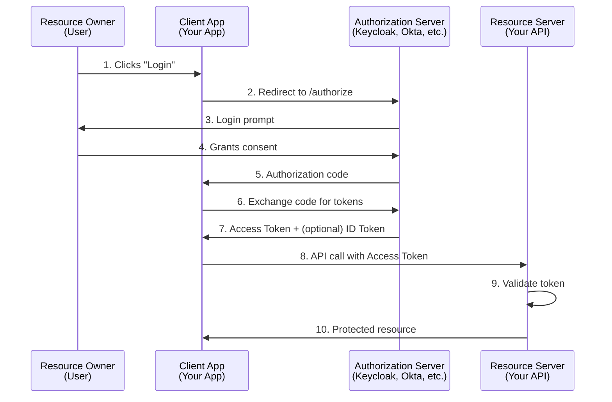
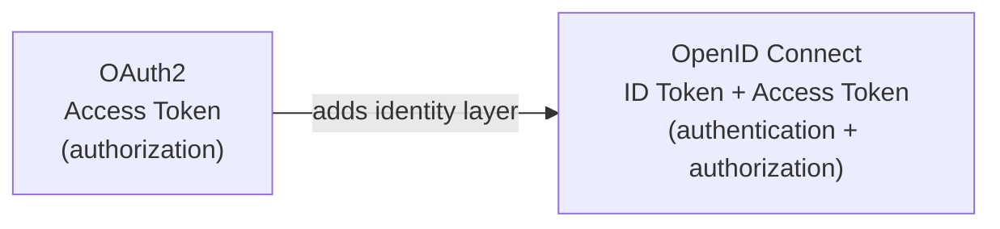

# OAuth2 and JWT in Spring Security — Resource Server, Client, and Token Handling

**Date:** 2026-04-17 | **Updated:** 2026-04-17
**Tags:** `spring-security` `oauth2` `jwt` `resource-server` `oauth2-client` `opaque-tokens` `openid-connect` `webflux`

## Table of Contents

- [Summary](#summary)
- [OAuth2 Concepts](#oauth2-concepts)
  - [Roles](#roles)
  - [Grant Types](#grant-types)
- [JWT Structure](#jwt-structure)
  - [Decoded Example](#decoded-example)
  - [Why Self-Contained](#why-self-contained)
- [Spring as a Resource Server](#spring-as-a-resource-server)
  - [Dependency](#dependency)
  - [Configuration](#configuration)
  - [SecurityFilterChain](#securityfilterchain)
- [JwtAuthenticationConverter — Mapping Claims to Authorities](#jwtauthenticationconverter--mapping-claims-to-authorities)
- [Custom JwtDecoder — Adding Validation Rules](#custom-jwtdecoder--adding-validation-rules)
- [Opaque Tokens — Introspection-Based Validation](#opaque-tokens--introspection-based-validation)
  - [When to Use Opaque vs JWT](#when-to-use-opaque-vs-jwt)
- [Spring as an OAuth2 Client](#spring-as-an-oauth2-client)
  - [Dependency and Configuration](#dependency-and-configuration)
  - [Accessing the Token](#accessing-the-token)
- [Client Credentials Flow — Service-to-Service](#client-credentials-flow--service-to-service)
  - [Configuration](#configuration-1)
  - [Using with WebClient](#using-with-webclient)
- [OpenID Connect](#openid-connect)
- [Reactive Resource Server](#reactive-resource-server)
  - [SecurityWebFilterChain with JWT](#securitywebfilterchain-with-jwt)
  - [ReactiveJwtDecoder](#reactivejwtdecoder)
- [Testing Secured Endpoints](#testing-secured-endpoints)
  - [MockJwt with WebTestClient](#mockjwt-with-webtestclient)
  - [MockJwt with MockMvc](#mockjwt-with-mockmvc)
- [Related](#related)
- [References](#references)

---

## Summary

OAuth2 handles **delegated authorization** — allowing a client application to act on behalf of a user without receiving the user's credentials. JWT (JSON Web Token) is a **self-contained token format** where the token itself carries the claims (identity, roles, expiry) so the resource server can validate it locally without calling back to the authorization server.

Spring Security supports both sides of this equation:
- **Resource Server** — validates incoming tokens (JWT or opaque) and maps them to Spring authorities
- **OAuth2 Client** — obtains tokens from an authorization server on behalf of a user or a service

This doc covers the configuration, customization, and testing of both roles.

---

## OAuth2 Concepts



### Roles

| Role | Description |
|------|-------------|
| **Resource Owner** | The end user who owns the data |
| **Client** | The application requesting access (web app, mobile app, CLI) |
| **Authorization Server** | Issues tokens after authenticating the user (Keycloak, Auth0, Okta, Spring Authorization Server) |
| **Resource Server** | The API that hosts protected resources and validates tokens |

### Grant Types

| Grant Type | Use Case | User Involved? |
|------------|----------|----------------|
| **Authorization Code** | Web apps, SPAs (with PKCE) | Yes |
| **Client Credentials** | Service-to-service (machine-to-machine) | No |
| **Refresh Token** | Renewing an expired access token silently | Indirectly |

Authorization Code is the most common for user-facing web applications. Client Credentials is used when one backend service calls another without any user context.

---

## JWT Structure

A JWT consists of three Base64URL-encoded parts separated by dots:

```
Header.Payload.Signature
```

```
eyJhbGciOiJSUzI1NiIsInR5cCI6IkpXVCJ9.eyJpc3MiOiJodHRwczovL2F1dGguZXhhbXBsZS5jb20iLC....<signature>
```

### Decoded Example

**Header:**
```json
{
  "alg": "RS256",
  "typ": "JWT",
  "kid": "abc-123"
}
```

**Payload (Claims):**
```json
{
  "iss": "https://auth.example.com/",
  "sub": "user-42",
  "aud": ["my-api", "other-api"],
  "exp": 1745000000,
  "iat": 1744996400,
  "scope": "read write",
  "roles": ["ADMIN", "USER"]
}
```

| Claim | Full Name | Purpose |
|-------|-----------|---------|
| `iss` | Issuer | Who issued the token |
| `sub` | Subject | The user or principal the token represents |
| `aud` | Audience | Intended recipient(s) of the token |
| `exp` | Expiration | Unix timestamp after which the token is invalid |
| `iat` | Issued At | Unix timestamp when the token was created |
| `scope` | Scope | OAuth2 scopes granted to the client |

### Why Self-Contained

The resource server can validate a JWT **without contacting the authorization server** on every request:
1. Fetch the authorization server's public key (from the JWK Set endpoint) once and cache it
2. Verify the token's signature locally using that public key
3. Check `exp`, `iss`, `aud` claims

This makes JWT validation fast and stateless, but the tradeoff is that a JWT cannot be revoked before its expiry without additional infrastructure (blocklist, short TTL + refresh token rotation).

---

## Spring as a Resource Server

### Dependency

```xml
<dependency>
    <groupId>org.springframework.boot</groupId>
    <artifactId>spring-boot-starter-oauth2-resource-server</artifactId>
</dependency>
```

### Configuration

```yaml
spring:
  security:
    oauth2:
      resourceserver:
        jwt:
          issuer-uri: https://auth.example.com/
          # OR specify the JWK Set URI directly:
          # jwk-set-uri: https://auth.example.com/.well-known/jwks.json
```

- **`issuer-uri`** — Spring discovers the JWK Set URI automatically by fetching `{issuer-uri}/.well-known/openid-configuration`. It also validates the `iss` claim.
- **`jwk-set-uri`** — Use this when the authorization server does not support OpenID Connect discovery, or when you want to skip the discovery call.

### SecurityFilterChain

```java
@Configuration
@EnableWebSecurity
public class ResourceServerConfig {

    @Bean
    SecurityFilterChain filterChain(HttpSecurity http) throws Exception {
        return http
            .authorizeHttpRequests(auth -> auth
                .requestMatchers("/api/public/**").permitAll()
                .anyRequest().authenticated()
            )
            .oauth2ResourceServer(oauth2 -> oauth2
                .jwt(Customizer.withDefaults())
            )
            .build();
    }
}
```

With this configuration, every request to a protected endpoint must include a valid `Authorization: Bearer <jwt>` header. Spring automatically:
1. Extracts the token from the header
2. Fetches the JWK Set (cached) and verifies the signature
3. Validates standard claims (`exp`, `iss`, `nbf`)
4. Creates a `JwtAuthenticationToken` in the `SecurityContext`

---

## JwtAuthenticationConverter — Mapping Claims to Authorities

By default, Spring maps the `scope` claim to authorities prefixed with `SCOPE_`. To use a custom claim such as `roles`:

```java
@Bean
JwtAuthenticationConverter jwtAuthenticationConverter() {
    JwtGrantedAuthoritiesConverter authoritiesConverter =
        new JwtGrantedAuthoritiesConverter();
    authoritiesConverter.setAuthoritiesClaimName("roles");
    authoritiesConverter.setAuthorityPrefix("ROLE_");

    JwtAuthenticationConverter converter = new JwtAuthenticationConverter();
    converter.setJwtGrantedAuthoritiesConverter(authoritiesConverter);
    return converter;
}
```

Wire it into the security chain:

```java
.oauth2ResourceServer(oauth2 -> oauth2
    .jwt(jwt -> jwt.jwtAuthenticationConverter(jwtAuthenticationConverter()))
)
```

Now a JWT with `"roles": ["ADMIN", "USER"]` produces authorities `ROLE_ADMIN` and `ROLE_USER`, enabling `@PreAuthorize("hasRole('ADMIN')")` checks.

---

## Custom JwtDecoder — Adding Validation Rules

For audience validation or other custom checks beyond what the defaults provide:

```java
@Bean
JwtDecoder jwtDecoder(
    @Value("${spring.security.oauth2.resourceserver.jwt.jwk-set-uri}") String jwkSetUri,
    @Value("${spring.security.oauth2.resourceserver.jwt.issuer-uri}") String issuerUri
) {
    NimbusJwtDecoder decoder = NimbusJwtDecoder
        .withJwkSetUri(jwkSetUri)
        .build();

    OAuth2TokenValidator<Jwt> defaultValidators =
        JwtValidators.createDefaultWithIssuer(issuerUri);

    OAuth2TokenValidator<Jwt> audienceValidator =
        new JwtClaimValidator<List<String>>(
            "aud",
            aud -> aud != null && aud.contains("my-api")
        );

    decoder.setJwtValidator(
        new DelegatingOAuth2TokenValidator<>(defaultValidators, audienceValidator)
    );

    return decoder;
}
```

The `DelegatingOAuth2TokenValidator` runs all validators in sequence. If any fail, the token is rejected with a `401` response.

---

## Opaque Tokens — Introspection-Based Validation

An opaque token is a random string with no embedded claims. The resource server validates it by calling the authorization server's **introspection endpoint** on every request:

```yaml
spring:
  security:
    oauth2:
      resourceserver:
        opaquetoken:
          introspection-uri: https://auth.example.com/oauth/introspect
          client-id: my-resource-server
          client-secret: ${INTROSPECTION_SECRET}
```

```java
@Bean
SecurityFilterChain filterChain(HttpSecurity http) throws Exception {
    return http
        .authorizeHttpRequests(auth -> auth.anyRequest().authenticated())
        .oauth2ResourceServer(oauth2 -> oauth2
            .opaqueToken(Customizer.withDefaults())
        )
        .build();
}
```

### When to Use Opaque vs JWT

| Aspect | JWT | Opaque Token |
|--------|-----|-------------|
| **Validation** | Local (public key) | Remote (introspection call) |
| **Latency** | Lower — no network call per request | Higher — network call per request |
| **Revocation** | Hard — token valid until `exp` | Easy — authorization server can revoke immediately |
| **Token size** | Larger (contains claims) | Smaller (just a random string) |
| **Best for** | High-throughput APIs, microservices | Short-lived sessions, strict revocation requirements |

---

## Spring as an OAuth2 Client

### Dependency and Configuration

```xml
<dependency>
    <groupId>org.springframework.boot</groupId>
    <artifactId>spring-boot-starter-oauth2-client</artifactId>
</dependency>
```

```yaml
spring:
  security:
    oauth2:
      client:
        registration:
          my-app:
            client-id: my-app
            client-secret: ${CLIENT_SECRET}
            scope: openid,profile,email
            redirect-uri: "{baseUrl}/login/oauth2/code/{registrationId}"
            authorization-grant-type: authorization_code
        provider:
          my-app:
            authorization-uri: https://auth.example.com/authorize
            token-uri: https://auth.example.com/oauth/token
            user-info-uri: https://auth.example.com/userinfo
            jwk-set-uri: https://auth.example.com/.well-known/jwks.json
```

### Accessing the Token

In a controller, inject the authorized client to access the access token:

```java
@GetMapping("/dashboard")
public String dashboard(
    @RegisteredOAuth2AuthorizedClient("my-app")
    OAuth2AuthorizedClient authorizedClient
) {
    String accessToken = authorizedClient.getAccessToken().getTokenValue();
    // Use the token to call a downstream API
    return "dashboard";
}
```

---

## Client Credentials Flow — Service-to-Service

When one backend service calls another without a user context, use the client credentials grant:

### Configuration

```yaml
spring:
  security:
    oauth2:
      client:
        registration:
          my-service:
            authorization-grant-type: client_credentials
            client-id: my-service
            client-secret: ${CLIENT_SECRET}
            scope: read,write
        provider:
          my-service:
            token-uri: https://auth.example.com/oauth/token
```

### Using with WebClient

**Servlet stack** — use `ServletOAuth2AuthorizedClientExchangeFilterFunction`:

```java
@Bean
WebClient webClient(OAuth2AuthorizedClientManager authorizedClientManager) {
    ServletOAuth2AuthorizedClientExchangeFilterFunction filter =
        new ServletOAuth2AuthorizedClientExchangeFilterFunction(authorizedClientManager);
    filter.setDefaultClientRegistrationId("my-service");

    return WebClient.builder()
        .apply(filter.oauth2Configuration())
        .build();
}
```

**Reactive stack** — use `ServerOAuth2AuthorizedClientExchangeFilterFunction`:

```java
@Bean
WebClient webClient(ReactiveOAuth2AuthorizedClientManager authorizedClientManager) {
    ServerOAuth2AuthorizedClientExchangeFilterFunction filter =
        new ServerOAuth2AuthorizedClientExchangeFilterFunction(authorizedClientManager);
    filter.setDefaultClientRegistrationId("my-service");

    return WebClient.builder()
        .filter(filter)
        .build();
}
```

Both filters automatically obtain, cache, and refresh the access token. Downstream calls include the `Authorization: Bearer <token>` header transparently.

---

## OpenID Connect

OpenID Connect (OIDC) is a layer built **on top of OAuth2** that adds:

| Concept | What It Adds |
|---------|-------------|
| **ID Token** | A JWT containing user identity claims (`name`, `email`, `picture`) |
| **UserInfo Endpoint** | An API to fetch additional user profile data |
| **Discovery** | `.well-known/openid-configuration` endpoint for automatic setup |
| **Standard Scopes** | `openid`, `profile`, `email`, `address`, `phone` |



When `scope: openid` is included in the client registration, Spring auto-discovers the OIDC configuration from `{issuer-uri}/.well-known/openid-configuration` and:
1. Validates the **ID token** (used for authentication)
2. Populates `OidcUser` with claims from the ID token and optionally the UserInfo endpoint
3. The **access token** is still used for calling resource servers

---

## Reactive Resource Server

### SecurityWebFilterChain with JWT

For WebFlux-based applications, use `SecurityWebFilterChain` instead of `SecurityFilterChain`:

```java
@Configuration
@EnableWebFluxSecurity
public class ReactiveResourceServerConfig {

    @Bean
    SecurityWebFilterChain securityWebFilterChain(ServerHttpSecurity http) {
        return http
            .authorizeExchange(exchanges -> exchanges
                .pathMatchers("/api/public/**").permitAll()
                .anyExchange().authenticated()
            )
            .oauth2ResourceServer(oauth2 -> oauth2
                .jwt(Customizer.withDefaults())
            )
            .build();
    }
}
```

The application.yml configuration for `issuer-uri` or `jwk-set-uri` is identical to the servlet stack.

### ReactiveJwtDecoder

For custom validation in a reactive context:

```java
@Bean
ReactiveJwtDecoder reactiveJwtDecoder(
    @Value("${spring.security.oauth2.resourceserver.jwt.jwk-set-uri}") String jwkSetUri,
    @Value("${spring.security.oauth2.resourceserver.jwt.issuer-uri}") String issuerUri
) {
    NimbusReactiveJwtDecoder decoder = NimbusReactiveJwtDecoder
        .withJwkSetUri(jwkSetUri)
        .build();

    OAuth2TokenValidator<Jwt> validators = new DelegatingOAuth2TokenValidator<>(
        JwtValidators.createDefaultWithIssuer(issuerUri),
        new JwtClaimValidator<List<String>>("aud", aud -> aud.contains("my-api"))
    );

    decoder.setJwtValidator(validators);
    return decoder;
}
```

For mapping claims to authorities in the reactive stack, use `ReactiveJwtAuthenticationConverterAdapter`:

```java
@Bean
Converter<Jwt, Mono<AbstractAuthenticationToken>> reactiveJwtAuthConverter() {
    JwtGrantedAuthoritiesConverter authoritiesConverter =
        new JwtGrantedAuthoritiesConverter();
    authoritiesConverter.setAuthoritiesClaimName("roles");
    authoritiesConverter.setAuthorityPrefix("ROLE_");

    JwtAuthenticationConverter delegate = new JwtAuthenticationConverter();
    delegate.setJwtGrantedAuthoritiesConverter(authoritiesConverter);

    return new ReactiveJwtAuthenticationConverterAdapter(delegate);
}
```

---

## Testing Secured Endpoints

Spring Security Test provides utilities for mocking JWT tokens without needing a real authorization server.

**Dependency** (usually included transitively via `spring-boot-starter-test`):
```xml
<dependency>
    <groupId>org.springframework.security</groupId>
    <artifactId>spring-security-test</artifactId>
    <scope>test</scope>
</dependency>
```

### MockJwt with WebTestClient

```java
import static org.springframework.security.test.web.reactive.server.SecurityMockServerConfigurers.mockJwt;

@WebFluxTest(MovieController.class)
class MovieControllerTest {

    @Autowired
    private WebTestClient webTestClient;

    @Test
    void protectedEndpoint_withValidJwt_returns200() {
        webTestClient
            .mutateWith(mockJwt()
                .authorities(new SimpleGrantedAuthority("ROLE_USER"))
            )
            .get().uri("/api/movies")
            .exchange()
            .expectStatus().isOk();
    }

    @Test
    void protectedEndpoint_withoutJwt_returns401() {
        webTestClient
            .get().uri("/api/movies")
            .exchange()
            .expectStatus().isUnauthorized();
    }

    @Test
    void adminEndpoint_withUserRole_returns403() {
        webTestClient
            .mutateWith(mockJwt()
                .authorities(new SimpleGrantedAuthority("ROLE_USER"))
            )
            .get().uri("/api/admin/settings")
            .exchange()
            .expectStatus().isForbidden();
    }

    @Test
    void adminEndpoint_withAdminRole_returns200() {
        webTestClient
            .mutateWith(mockJwt()
                .authorities(new SimpleGrantedAuthority("ROLE_ADMIN"))
            )
            .get().uri("/api/admin/settings")
            .exchange()
            .expectStatus().isOk();
    }

    @Test
    void endpoint_withCustomClaims_returnsExpectedUser() {
        webTestClient
            .mutateWith(mockJwt()
                .jwt(jwt -> jwt
                    .subject("user-42")
                    .claim("email", "user@example.com")
                    .claim("roles", List.of("USER"))
                )
                .authorities(new SimpleGrantedAuthority("ROLE_USER"))
            )
            .get().uri("/api/profile")
            .exchange()
            .expectStatus().isOk()
            .expectBody()
            .jsonPath("$.email").isEqualTo("user@example.com");
    }
}
```

### MockJwt with MockMvc

For servlet-based applications:

```java
import static org.springframework.security.test.web.servlet.request.SecurityMockMvcRequestPostProcessors.jwt;

@WebMvcTest(MovieController.class)
class MovieControllerMvcTest {

    @Autowired
    private MockMvc mockMvc;

    @Test
    void protectedEndpoint_withValidJwt_returns200() throws Exception {
        mockMvc.perform(get("/api/movies")
                .with(jwt().authorities(new SimpleGrantedAuthority("ROLE_USER")))
            )
            .andExpect(status().isOk());
    }
}
```

---

## Related

- [Security Filter Chain](security-filter-chain.md) — how the filter chain processes requests, custom filters, exception handling.
- [Authentication and Authorization](authentication-authorization.md) — `@PreAuthorize`, method security, role hierarchies.
- [OIDC and Modern Auth Flows](oidc-and-modern-auth.md) — PKCE, refresh rotation, WebAuthn, MFA — the next-level auth doc.
- [Secrets Management](secrets-management.md) — where JWT signing keys and client secrets live.
- [API Gateway Patterns](../web-layer/api-gateway-patterns.md) — gateway-level JWT validation and header forwarding.
- [WebClient Config](../configurations/webclient-config.md) — configuring WebClient with OAuth2 token propagation.

## References

- [OAuth2 Resource Server — Spring Security Reference](https://docs.spring.io/spring-security/reference/servlet/oauth2/resource-server/index.html) — JWT and opaque token configuration for the servlet stack
- [OAuth2 Client — Spring Security Reference](https://docs.spring.io/spring-security/reference/servlet/oauth2/client/index.html) — client registration, authorization grant types, token management
- [Reactive OAuth2 Resource Server — Spring Security Reference](https://docs.spring.io/spring-security/reference/reactive/oauth2/resource-server/index.html) — WebFlux-specific JWT and opaque token support
- [JWT — Spring Security Reference](https://docs.spring.io/spring-security/reference/servlet/oauth2/resource-server/jwt.html) — JwtDecoder, JwtAuthenticationConverter, custom validators
- [OpenID Connect — Spring Security Reference](https://docs.spring.io/spring-security/reference/servlet/oauth2/login/core.html) — OIDC login, ID token, UserInfo endpoint
- [RFC 7519 — JSON Web Token (JWT)](https://datatracker.ietf.org/doc/html/rfc7519) — the JWT specification defining structure and standard claims
- [RFC 6749 — The OAuth 2.0 Authorization Framework](https://datatracker.ietf.org/doc/html/rfc6749) — the core OAuth2 specification
- [Spring Security Testing — Spring Security Reference](https://docs.spring.io/spring-security/reference/servlet/test/index.html) — mockJwt, mockOpaqueToken, and other test utilities
