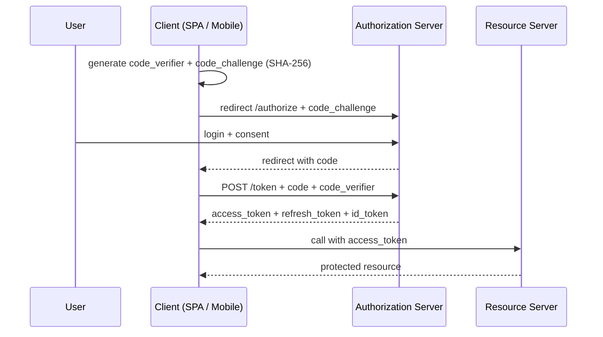
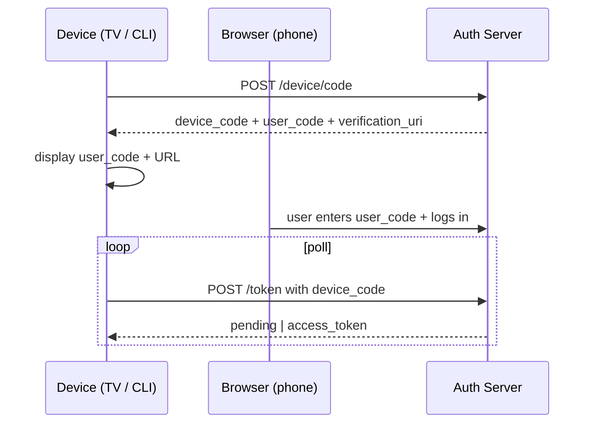
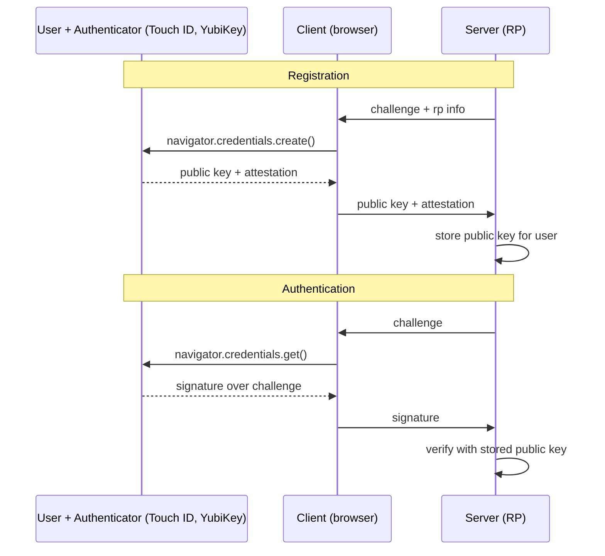

# OIDC and Modern Auth Flows — PKCE, Refresh Rotation, WebAuthn, MFA

**Date:** 2026-04-19 | **Updated:** 2026-04-19
**Tags:** `security` `oidc` `oauth2` `authentication` `webauthn` `spring-security`

## Table of Contents

- [Summary](#summary)
- [OIDC vs OAuth2](#oidc-vs-oauth2)
- [Authorization Code Flow with PKCE](#authorization-code-flow-with-pkce)
- [Refresh Token Rotation](#refresh-token-rotation)
- [Device Authorization Flow](#device-authorization-flow)
- [Client Credentials (Service to Service)](#client-credentials-service-to-service)
- [WebAuthn and Passkeys](#webauthn-and-passkeys)
- [MFA Patterns](#mfa-patterns)
- [Token Validation at the Resource Server](#token-validation-at-the-resource-server)
- [Related](#related)
- [References](#references)

---

## Summary

[OAuth 2.0](https://datatracker.ietf.org/doc/html/rfc6749) is a delegation framework — "let app X act on my behalf at resource Y." [OpenID Connect (OIDC)](https://openid.net/developers/how-connect-works/) is an identity layer on top of OAuth 2.0 — "prove who the user is." In 2026, modern best practice is: **authorization code + PKCE** for all public clients (SPAs, mobile, CLIs), **client credentials** for service-to-service, **refresh token rotation** to contain token theft, **device flow** for TVs/CLIs, and **WebAuthn / passkeys** instead of passwords whenever possible. The implicit flow is dead ([RFC 9700](https://datatracker.ietf.org/doc/html/rfc9700) retired it); password grant is dead; opaque session cookies inside a BFF (backend-for-frontend) is a valid alternative to tokens in the browser. This doc shows the shapes of each flow and how Spring Security wires them.

---

## OIDC vs OAuth2

| Feature | OAuth 2.0 | OIDC |
|---------|-----------|------|
| Purpose | Authorization (access) | Authentication (identity) |
| Token returned | `access_token` | `access_token` + `id_token` |
| Token format | Opaque or JWT | `id_token` is always JWT |
| Userinfo endpoint | No | Yes |
| Discovery | No | `.well-known/openid-configuration` |

If you need "who is this user?", use OIDC. If you need "can this client call this API?", OAuth2 alone suffices. Most modern auth providers (Auth0, Okta, Keycloak, Google, Microsoft Entra) speak both.

---

## Authorization Code Flow with PKCE

[PKCE](https://datatracker.ietf.org/doc/html/rfc7636) (Proof Key for Code Exchange) is required for public clients since [RFC 9700](https://datatracker.ietf.org/doc/html/rfc9700) and strongly recommended for confidential clients. It defends against authorization-code interception.



Spring Security client (BFF pattern):

```gradle
implementation 'org.springframework.boot:spring-boot-starter-oauth2-client'
```

```yaml
spring:
  security:
    oauth2:
      client:
        registration:
          auth0:
            client-id: ${CLIENT_ID}
            client-secret: ${CLIENT_SECRET}
            scope: openid,profile,email,offline_access
            authorization-grant-type: authorization_code
            redirect-uri: "{baseUrl}/login/oauth2/code/{registrationId}"
        provider:
          auth0:
            issuer-uri: https://example.auth0.com/
```

Spring Security 6 enables PKCE automatically for public clients (no `client-secret`). For confidential clients, enable manually via `DefaultAuthorizationCodeTokenResponseClient` customizer.

---

## Refresh Token Rotation

A stolen refresh token is a stolen session forever — unless you rotate.

**Rotation rule:** every time a client uses a refresh token, the auth server issues a new one and invalidates the old. If the old one is used again (meaning someone copied it), the whole chain is invalidated and the user is logged out.

Required auth server config (most modern IdPs support it):

- Refresh token rotation: ON.
- Reuse detection: ON.
- Refresh token lifetime: 7–30 days (sliding).
- Access token lifetime: 5–15 min.

Spring Security's `OAuth2AuthorizedClientManager` handles rotation transparently — the new refresh token replaces the old in `OAuth2AuthorizedClientRepository`.

---

## Device Authorization Flow

[RFC 8628](https://datatracker.ietf.org/doc/html/rfc8628) — for devices that can't show a browser (TVs, CLIs, IoT).



Google Cloud SDK, GitHub CLI, Azure CLI all use this. Spring Security 6.3+ supports it server-side.

---

## Client Credentials (Service to Service)

No user involved — one service authenticates to another:

```yaml
spring:
  security:
    oauth2:
      client:
        registration:
          orders-service:
            client-id: orders-service
            client-secret: ${SECRET}
            authorization-grant-type: client_credentials
            scope: orders:read,orders:write
        provider:
          orders-service:
            token-uri: https://auth.example.com/oauth/token
```

```java
@Autowired OAuth2AuthorizedClientManager clientManager;

WebClient webClient = WebClient.builder()
    .filter(new ServletOAuth2AuthorizedClientExchangeFilterFunction(clientManager))
    .build();

webClient.get().uri("https://other-service/api/data")
    .attributes(clientRegistrationId("orders-service"))
    .retrieve();
```

Access tokens are cached and refreshed transparently.

---

## WebAuthn and Passkeys

[WebAuthn](https://www.w3.org/TR/webauthn-3/) is the browser API for public-key authentication. [Passkeys](https://fidoalliance.org/passkeys/) are WebAuthn credentials that sync across a user's devices via iCloud Keychain / Google Password Manager / 1Password.

Why it matters: no passwords to phish, no secrets stored in your DB, unphishable by design (credentials are scoped to the origin).



Spring Security 6.4+ has [native WebAuthn support](https://docs.spring.io/spring-security/reference/servlet/authentication/passkeys.html). Libraries to know: `webauthn4j` for the JVM server side, `@simplewebauthn/browser` for client.

Rollout strategy: offer passkey as an additional factor first, then as a primary factor, eventually let users remove the password. Don't ship passwordless on day one — users freak out.

---

## MFA Patterns

Three factors (classic):

1. Something you know — password.
2. Something you have — phone, security key.
3. Something you are — fingerprint, face.

Modern strong auth = two factors from different categories. TOTP (Google Authenticator) + password is OK; password + SMS is barely MFA (SIM swap). WebAuthn + device biometric is strongest.

Spring Security MFA via [spring-security-webauthn](https://docs.spring.io/spring-security/reference/servlet/authentication/passkeys.html) or third-party like [Keycloak](https://www.keycloak.org/). Don't roll MFA yourself; use an IdP.

**Step-up auth**: require additional factor only for sensitive operations (change email, delete account, transfer money). Keeps login fast for 99% of traffic.

---

## Token Validation at the Resource Server

Backend API validating JWTs issued by the auth server:

```gradle
implementation 'org.springframework.boot:spring-boot-starter-oauth2-resource-server'
```

```yaml
spring:
  security:
    oauth2:
      resourceserver:
        jwt:
          issuer-uri: https://auth.example.com/
          # JWKS auto-discovered at {issuer}/.well-known/jwks.json
```

```java
@Bean
SecurityFilterChain api(HttpSecurity http) throws Exception {
    return http
        .authorizeHttpRequests(a -> a
            .requestMatchers("/api/admin/**").hasAuthority("SCOPE_admin")
            .requestMatchers("/api/**").authenticated()
            .anyRequest().permitAll())
        .oauth2ResourceServer(o -> o.jwt(Customizer.withDefaults()))
        .csrf(CsrfConfigurer::disable)
        .sessionManagement(s -> s.sessionCreationPolicy(STATELESS))
        .build();
}
```

Validation checks:

- Signature against JWKS (cached, rotated).
- `iss` matches configured issuer.
- `exp` not expired; `nbf`/`iat` sane.
- `aud` matches this resource server.
- Optional: allowed `scope` claim set.

Never cache validation results longer than the token's lifetime. Never accept `none` as `alg`. Always use asymmetric keys (RS256/ES256) — HS256 shared secrets across services is an outage waiting to happen.

---

## Related

- [OAuth2 and JWT in Spring Security](oauth2-jwt.md) — the original doc; this one adds PKCE, rotation, WebAuthn, device flow.
- [Secrets Management](secrets-management.md) — where client secrets and signing keys actually live.
- [API Gateway Patterns](../web-layer/api-gateway-patterns.md) — gateway-level token validation.
- [Authentication and Authorization in Spring Security](authentication-authorization.md) — broader Spring Security concepts.
- [Distributed Systems Primer](../architecture/distributed-systems-primer.md) — token revocation is eventually consistent.

---

## References

- [OpenID Connect Core 1.0](https://openid.net/specs/openid-connect-core-1_0.html)
- [RFC 6749 — OAuth 2.0](https://datatracker.ietf.org/doc/html/rfc6749)
- [RFC 7636 — PKCE](https://datatracker.ietf.org/doc/html/rfc7636)
- [RFC 9700 — OAuth 2.0 Best Current Practice](https://datatracker.ietf.org/doc/html/rfc9700)
- [RFC 8628 — Device Authorization Grant](https://datatracker.ietf.org/doc/html/rfc8628)
- [W3C — WebAuthn Level 3](https://www.w3.org/TR/webauthn-3/)
- [FIDO Alliance — Passkeys](https://fidoalliance.org/passkeys/)
- [Spring Security documentation](https://docs.spring.io/spring-security/reference/)
- [Spring Security — Passkeys](https://docs.spring.io/spring-security/reference/servlet/authentication/passkeys.html)
- [Auth0 — The OAuth 2.0 Game](https://auth0.com/resources/ebooks/the-state-of-security-in-the-software-industry)
