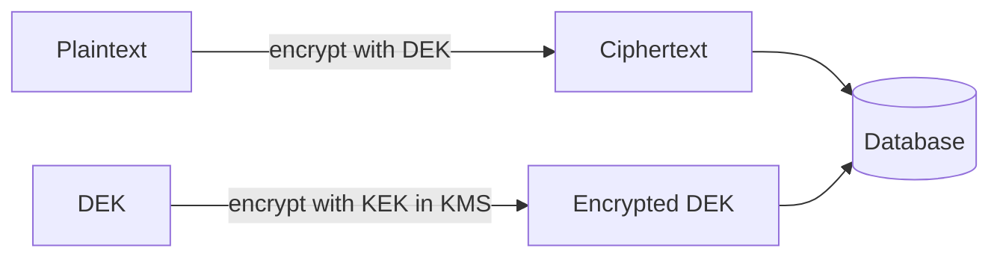

# Secrets Management — Vault, Kubernetes Secrets, Envelope Encryption, KMS

**Date:** 2026-04-19 | **Updated:** 2026-04-19
**Tags:** `security` `secrets` `vault` `kubernetes` `kms` `spring-boot`

## Table of Contents

- [Summary](#summary)
- [What Counts as a Secret](#what-counts-as-a-secret)
- [Kubernetes Secrets Alone Are Not Enough](#kubernetes-secrets-alone-are-not-enough)
- [External Secret Operators](#external-secret-operators)
- [HashiCorp Vault and Spring Cloud Vault](#hashicorp-vault-and-spring-cloud-vault)
- [Envelope Encryption and KMS](#envelope-encryption-and-kms)
- [Secret Rotation](#secret-rotation)
- [Developer Workflow](#developer-workflow)
- [Related](#related)
- [References](#references)

---

## Summary

Secrets — database passwords, API keys, signing certificates, JWT keys — are the highest-leverage targets an attacker has. Spring Boot's `@Value("${db.password}")` is not the problem; how that value *gets there* is. Modern stacks layer three things: a **secret store** ([HashiCorp Vault](https://www.vaultproject.io/), AWS Secrets Manager, GCP Secret Manager), an **injection mechanism** (sidecar, CSI driver, [External Secrets Operator](https://external-secrets.io/)), and a **KMS** ([AWS KMS](https://aws.amazon.com/kms/), [GCP KMS](https://cloud.google.com/kms), [Azure Key Vault](https://azure.microsoft.com/en-us/products/key-vault)) that encrypts data at rest using envelope encryption. Kubernetes Secrets alone are base64, not encrypted — they're an index, not a safe. This doc covers the layers, the trade-offs, and enough Spring Cloud Vault code to wire your first service.

---

## What Counts as a Secret

Every one of these needs secrets management:

- Database passwords, connection strings.
- API keys (Stripe, Twilio, OAuth client secrets, GitHub tokens).
- TLS private keys and certificates.
- JWT signing keys (HMAC secrets, RSA/EC private keys).
- Encryption keys for PII/PHI fields.
- Webhook signing secrets.
- SSH keys for deployment.
- Cloud service account credentials (AWS access keys, GCP JSON keys).

NOT secrets: feature flags (see [feature-flags.md](../configurations/feature-flags.md)), public endpoints, log levels, anything you could post on GitHub without losing sleep.

---

## Kubernetes Secrets Alone Are Not Enough

`kubectl create secret` stores data **base64-encoded, not encrypted**, in etcd. Defaults:

- etcd encryption at rest: off unless configured.
- RBAC: cluster-admin can read any secret in any namespace.
- Logs: `kubectl describe pod` shows secret names (not values, but metadata leaks).
- Audit: `kubectl` access to secrets is logged in API server audit, not per-secret.

Minimum hardening:

1. Enable [etcd encryption at rest](https://kubernetes.io/docs/tasks/administer-cluster/encrypt-data/) with a KMS provider.
2. Tight RBAC: only the specific deployment's SA can read the specific secret.
3. Use `immutable: true` on secrets that never change (prevents accidental update).
4. Never mount all secrets in a namespace; reference by name only.
5. Prefer **projected volumes** over env vars (env vars show up in `/proc/<pid>/environ`).

Even hardened, k8s secrets are a *cache*. The source of truth should be an external store.

---

## External Secret Operators

[External Secrets Operator](https://external-secrets.io/) (ESO) syncs from a backing store (Vault, AWS, GCP, Azure) into native k8s Secret objects:

```yaml
apiVersion: external-secrets.io/v1beta1
kind: SecretStore
metadata: { name: vault-store }
spec:
  provider:
    vault:
      server: https://vault.internal:8200
      path: kv
      auth:
        kubernetes:
          mountPath: kubernetes
          role: orders-service
---
apiVersion: external-secrets.io/v1beta1
kind: ExternalSecret
metadata: { name: orders-db }
spec:
  refreshInterval: 1h
  secretStoreRef: { name: vault-store, kind: SecretStore }
  target: { name: orders-db-secret }
  data:
    - secretKey: password
      remoteRef: { key: orders/prod, property: db_password }
```

Now your deployment references `orders-db-secret` the normal k8s way; ESO keeps it in sync with Vault, rotates when Vault rotates. App doesn't need to know Vault exists.

Alternative: [Secrets Store CSI Driver](https://secrets-store-csi-driver.sigs.k8s.io/) mounts secrets as a volume without creating k8s Secret objects. Slightly more secure (no etcd copy), slightly more complex (pod restart on rotation unless using `secretProviderClass` with k8s-secret sync).

---

## HashiCorp Vault and Spring Cloud Vault

Vault is the gold standard for secret stores — KV, PKI, database dynamic credentials, transit (encryption-as-a-service), all via one API.

Spring integration:

```gradle
implementation 'org.springframework.cloud:spring-cloud-starter-vault-config'
```

`bootstrap.yaml`:

```yaml
spring:
  application:
    name: orders
  cloud:
    vault:
      uri: https://vault.internal:8200
      authentication: KUBERNETES
      kubernetes:
        role: orders-service
      kv:
        enabled: true
        backend: kv
        default-context: orders
      database:
        enabled: true
        backend: database
        role: orders-db-role
```

At startup, Spring reads `kv/orders/default` and maps keys to properties — `db.password` shows up as `${db.password}`.

**Dynamic database credentials** is the killer feature: Vault issues a fresh DB username/password per app instance with a 24-hour lease. Leak one, rotate one. No human ever sees a prod DB password.

```yaml
spring:
  datasource:
    username: ${spring.datasource.username}    # injected by Spring Cloud Vault
    password: ${spring.datasource.password}
```

Spring Cloud Vault renews leases automatically; if the DB credential expires, it re-fetches.

---

## Envelope Encryption and KMS

For data-at-rest encryption of user data (PII, PHI) — not config secrets — use **envelope encryption**:

1. Generate a random **data encryption key** (DEK) per record or per tenant.
2. Encrypt the data with the DEK.
3. Encrypt the DEK with a **key encryption key** (KEK) stored in KMS.
4. Store encrypted data + encrypted DEK in your database.
5. To decrypt: ask KMS to decrypt the DEK (a fast call, auditable), use DEK to decrypt data.



Why: the KEK never leaves KMS. Your database leak yields encrypted blobs + encrypted DEKs; attacker still needs KMS access to decrypt. KMS access is tightly audited (CloudTrail, GCP audit logs).

Java: AWS Encryption SDK, Google Tink, or Envelope mode in Spring Cloud AWS. See [spring-boot-aws-gcp.md](../cloud/spring-boot-aws-gcp.md).

---

## Secret Rotation

Three dimensions:

1. **Automatic vs manual** — DB credentials with Vault dynamic secrets rotate automatically; manually-provisioned API keys rotate manually on a schedule.
2. **Zero-downtime** — app handles overlap (old and new valid simultaneously during cutover).
3. **Audit trail** — who rotated what and when.

For JWT signing keys specifically: publish multiple active keys via JWKS, rotate by adding the new key before removing the old. Clients caching JWKS may be seconds to minutes stale; the overlap period must exceed that.

Rotation cadence (loose guide):

- DB credentials: 24 h (dynamic) or quarterly (static).
- API keys to third parties: quarterly.
- TLS certs: auto-renew via cert-manager / Let's Encrypt.
- JWT signing keys: 90 days.
- Root CA: annual or per-incident.

---

## Developer Workflow

Local dev without real secrets:

- Check `.env.example` into git with dummy values.
- `.env` is gitignored.
- Devs fetch secrets via `vault login` + a personal role with `dev` scope.
- Or use [direnv](https://direnv.net/) + [1Password CLI](https://developer.1password.com/docs/cli/secret-references/) for fetch-on-use.

Never:

- Commit `.env` with real values.
- Paste secrets in Slack, tickets, or emails.
- Log secrets (add `@ToString.Exclude` on Lombok, sanitize at Logback level).
- Store in environment variables on shared dev machines.

Pre-commit hook: [gitleaks](https://github.com/gitleaks/gitleaks) or [detect-secrets](https://github.com/Yelp/detect-secrets) catches pasted credentials. Integrate in CI too.

---

## Related

- [OIDC and Modern Auth Flows](oidc-and-modern-auth.md) — JWT signing keys live in KMS or a secret store.
- [Kubernetes for Spring Boot](../configurations/kubernetes-spring-boot.md) — Secret mounting and RBAC.
- [Spring Boot on AWS and GCP](../cloud/spring-boot-aws-gcp.md) — cloud-native KMS integration.
- [Database Configuration in Spring Boot](../configurations/database-config.md) — connection strings as secrets.
- [Feature Flags](../configurations/feature-flags.md) — config ≠ secrets; different tooling.

---

## References

- [HashiCorp Vault documentation](https://developer.hashicorp.com/vault/docs)
- [Spring Cloud Vault reference](https://docs.spring.io/spring-cloud-vault/reference/)
- [External Secrets Operator documentation](https://external-secrets.io/)
- [Kubernetes Secrets documentation](https://kubernetes.io/docs/concepts/configuration/secret/)
- [AWS KMS documentation](https://docs.aws.amazon.com/kms/latest/developerguide/)
- [GCP KMS documentation](https://cloud.google.com/kms/docs)
- [NIST SP 800-57 — Key Management](https://csrc.nist.gov/pubs/sp/800/57/pt1/r5/final)
- [OWASP Secrets Management Cheat Sheet](https://cheatsheetseries.owasp.org/cheatsheets/Secrets_Management_Cheat_Sheet.html)
- [Google Tink](https://github.com/google/tink)
- [gitleaks](https://github.com/gitleaks/gitleaks)
