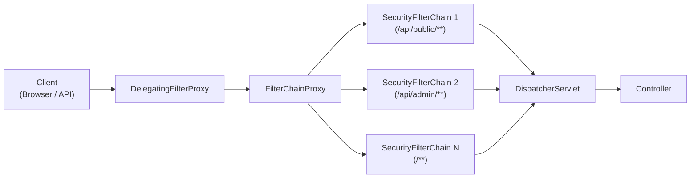
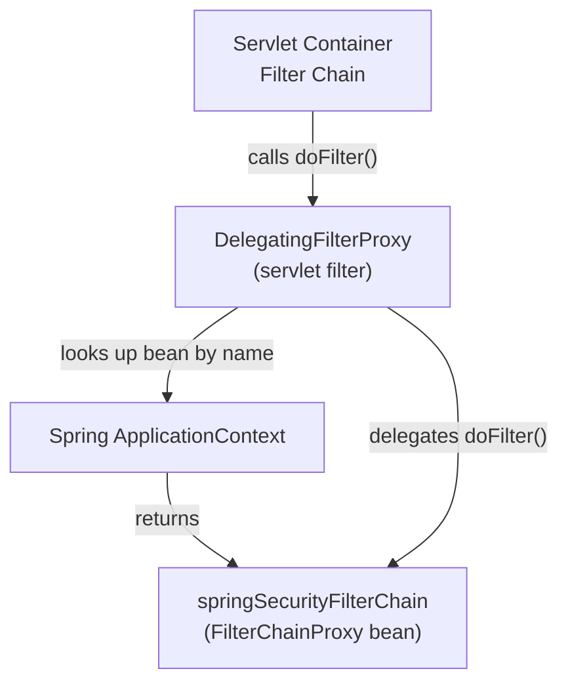
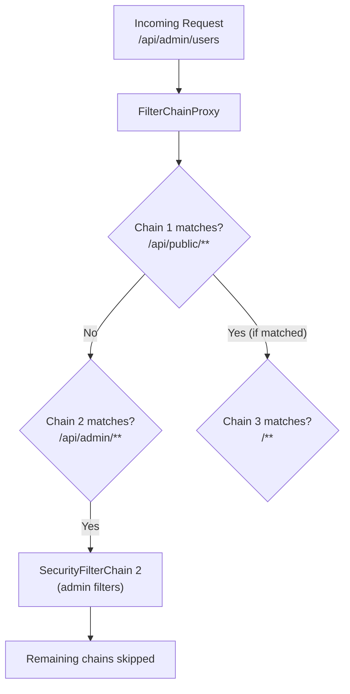
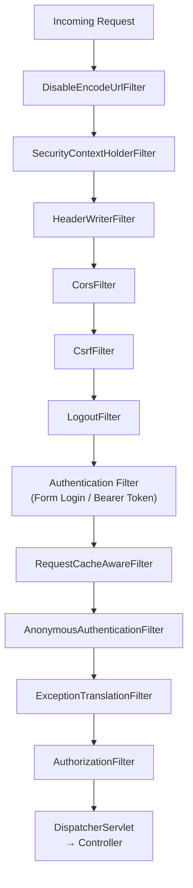
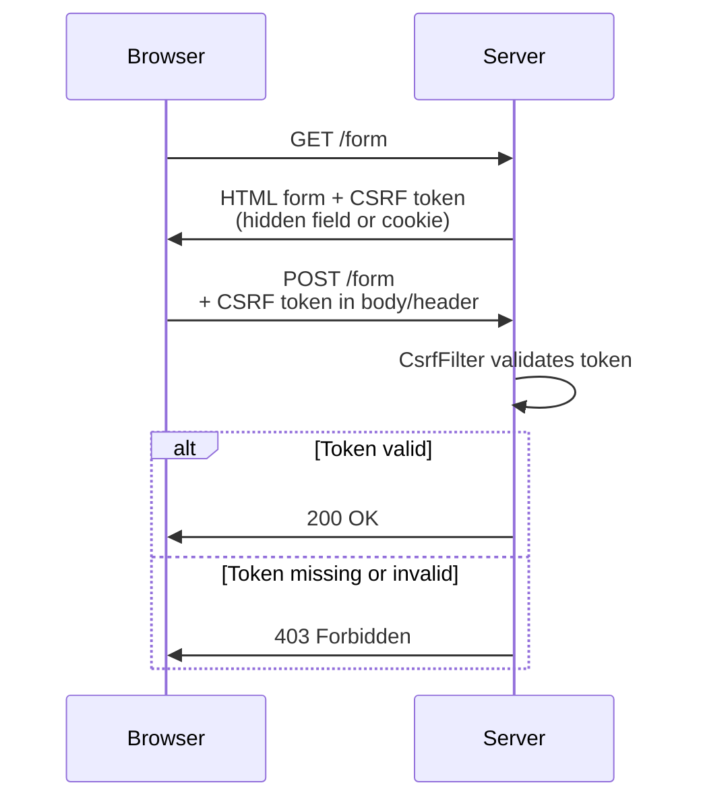

# Spring Security Architecture — The Filter Chain

**Date:** 2026-04-17 | **Updated:** 2026-04-17
**Tags:** `spring-security` `filter-chain` `security-filter-chain` `delegating-filter-proxy` `csrf` `cors` `webflux` `servlet-filter` `authorization`

## Table of Contents

- [Summary](#summary)
- [The Big Picture](#the-big-picture)
- [DelegatingFilterProxy](#delegatingfilterproxy)
- [FilterChainProxy](#filterchainproxy)
- [SecurityFilterChain Bean](#securityfilterchain-bean)
  - [The Modern Configuration Style](#the-modern-configuration-style)
  - [What the Lambda DSL Does](#what-the-lambda-dsl-does)
- [Key Filters in Order](#key-filters-in-order)
  - [Filter Order Table](#filter-order-table)
  - [Filter Order Diagram](#filter-order-diagram)
- [CSRF Protection](#csrf-protection)
  - [What CSRF Prevents](#what-csrf-prevents)
  - [Token Flow](#token-flow)
  - [When to Disable CSRF](#when-to-disable-csrf)
  - [SPA Configuration with CookieCsrfTokenRepository](#spa-configuration-with-cookiecsrftokenrepository)
- [CORS Configuration](#cors-configuration)
  - [CorsConfigurationSource Bean](#corsconfigurationsource-bean)
  - [Wiring CORS into the Security Chain](#wiring-cors-into-the-security-chain)
- [Security Headers](#security-headers)
  - [Default Headers](#default-headers)
  - [Customizing Headers](#customizing-headers)
- [Multiple SecurityFilterChain Beans](#multiple-securityfilterchain-beans)
- [Reactive Security (WebFlux)](#reactive-security-webflux)
  - [SecurityWebFilterChain](#securitywebfilterchain)
  - [MVC vs WebFlux Comparison](#mvc-vs-webflux-comparison)
- [Debugging Security](#debugging-security)
  - [Enable Debug Mode](#enable-debug-mode)
  - [Trace Logging](#trace-logging)
  - [Reading the Filter Chain Dump](#reading-the-filter-chain-dump)
- [Related](#related)
- [References](#references)

---

## Summary

Spring Security is a **filter-based framework**. Every security decision — authentication, authorization, CSRF protection, CORS handling, header injection — happens inside a chain of servlet filters (Spring MVC) or `WebFilter` instances (Spring WebFlux) that intercept HTTP requests **before** they reach your controllers. Understanding this architecture is essential because misconfiguring the filter chain is the root cause of most Spring Security issues: requests silently blocked, CORS errors in production, CSRF tokens rejected, or endpoints accidentally left open.

The core flow is: the servlet container delegates to `DelegatingFilterProxy`, which hands off to `FilterChainProxy`, which selects the first matching `SecurityFilterChain` and runs its ordered list of security filters. After all filters pass, the request finally reaches the `DispatcherServlet` and your controller.

---

## The Big Picture



Each layer has a distinct responsibility:

| Layer | Responsibility |
|-------|----------------|
| **Servlet Container** | Manages the raw `Filter` chain. Knows nothing about Spring beans. |
| **DelegatingFilterProxy** | A standard servlet `Filter` registered with the container. Bridges into Spring's `ApplicationContext` by delegating to a named Spring bean. |
| **FilterChainProxy** | The Spring bean (`springSecurityFilterChain`). Holds one or more `SecurityFilterChain` instances and dispatches to the first one whose `RequestMatcher` matches the incoming request. |
| **SecurityFilterChain** | An ordered list of security-specific filters (CSRF, CORS, authentication, authorization, etc.) that execute in sequence. |
| **DispatcherServlet** | The standard Spring MVC front controller. Only reached if the security chain allows the request through. |
| **Controller** | Your application code. |

---

## DelegatingFilterProxy

`DelegatingFilterProxy` is the **bridge** between the servlet container and Spring's `ApplicationContext`. The servlet container manages its own filter chain but has no awareness of Spring beans. `DelegatingFilterProxy` solves this by:

1. Being registered as a standard servlet `Filter` (usually via Spring Boot auto-configuration)
2. Looking up a Spring bean by name — by default `"springSecurityFilterChain"`
3. Delegating every `doFilter` call to that bean



Key points:
- `DelegatingFilterProxy` itself contains **no security logic** — it is purely a delegation bridge
- The bean lookup is lazy by default, so it waits until the first request to resolve the target bean (the `ApplicationContext` may not be ready at filter registration time)
- Spring Boot registers this automatically when `spring-boot-starter-security` is on the classpath

---

## FilterChainProxy

`FilterChainProxy` is the Spring bean that `DelegatingFilterProxy` delegates to. It holds a `List<SecurityFilterChain>` and, for each incoming request:

1. Iterates through the list in order
2. Calls `securityFilterChain.matches(request)` on each chain
3. Delegates to the **first chain that matches**
4. Skips all remaining chains



Why `FilterChainProxy` instead of chaining servlet filters directly:
- **Single entry point** for all security logic — easier to debug and audit
- **URL-based dispatching** to different security configurations via `RequestMatcher`
- **Firewall protection** — `FilterChainProxy` applies `HttpFirewall` to reject malicious requests (path traversal, non-printable characters) before any security filter runs
- **Cleans up** the `SecurityContext` after each request to prevent thread-local leaks

---

## SecurityFilterChain Bean

### The Modern Configuration Style

Since Spring Security 5.7+, the recommended approach is to declare a `SecurityFilterChain` as a `@Bean`. This replaces the deprecated `WebSecurityConfigurerAdapter` pattern.

```java
@Configuration
@EnableWebSecurity
public class SecurityConfig {

    @Bean
    public SecurityFilterChain filterChain(HttpSecurity http) throws Exception {
        return http
            .authorizeHttpRequests(auth -> auth
                .requestMatchers("/api/public/**").permitAll()
                .requestMatchers("/api/admin/**").hasRole("ADMIN")
                .anyRequest().authenticated())
            .httpBasic(Customizer.withDefaults())
            .csrf(csrf -> csrf.disable())
            .build();
    }
}
```

### What the Lambda DSL Does

Each method call on `HttpSecurity` adds or configures filters in the chain:

| DSL Method | Filter Added / Configured |
|------------|---------------------------|
| `.authorizeHttpRequests(...)` | `AuthorizationFilter` |
| `.httpBasic(...)` | `BasicAuthenticationFilter` |
| `.formLogin(...)` | `UsernamePasswordAuthenticationFilter` |
| `.csrf(...)` | `CsrfFilter` |
| `.cors(...)` | `CorsFilter` |
| `.oauth2ResourceServer(...)` | `BearerTokenAuthenticationFilter` |
| `.logout(...)` | `LogoutFilter` |
| `.sessionManagement(...)` | `SessionManagementFilter` |
| `.headers(...)` | `HeaderWriterFilter` |

When you call `.build()`, `HttpSecurity` sorts all configured filters by their defined order and assembles them into a `SecurityFilterChain` instance. The order is fixed by Spring Security — you do not need to sort them yourself.

---

## Key Filters in Order

### Filter Order Table

The following table lists the most important filters in the order Spring Security executes them. The full chain contains more filters, but these are the ones you will encounter most during configuration and debugging.

| Order | Filter | Purpose |
|-------|--------|---------|
| 1 | `DisableEncodeUrlFilter` | Prevents session IDs from being appended to URLs (mitigates session fixation via URL) |
| 2 | `SecurityContextHolderFilter` | Loads the `SecurityContext` from the `SecurityContextRepository` and makes it available via `SecurityContextHolder`. Replaces the older `SecurityContextPersistenceFilter`. |
| 3 | `HeaderWriterFilter` | Writes security response headers (`X-Content-Type-Options`, `X-Frame-Options`, `Strict-Transport-Security`, etc.) |
| 4 | `CorsFilter` | Handles CORS preflight (`OPTIONS`) requests and adds CORS response headers |
| 5 | `CsrfFilter` | Validates CSRF tokens on state-changing requests (`POST`, `PUT`, `DELETE`, `PATCH`) |
| 6 | `LogoutFilter` | Intercepts the logout URL, invalidates the session, clears the `SecurityContext` |
| 7 | `UsernamePasswordAuthenticationFilter` | Processes form login submissions (`POST /login` by default) |
| 7a | `BearerTokenAuthenticationFilter` | Extracts and validates a Bearer token from the `Authorization` header (OAuth2 resource servers) |
| 8 | `RequestCacheAwareFilter` | Restores the original request after a redirect to the login page |
| 9 | `SecurityContextHolderAwareRequestFilter` | Wraps the `HttpServletRequest` to support `isUserInRole()`, `getRemoteUser()`, etc. |
| 10 | `AnonymousAuthenticationFilter` | Assigns an anonymous `Authentication` token if no authentication is present |
| 11 | `ExceptionTranslationFilter` | Catches `AccessDeniedException` and `AuthenticationException` from downstream and triggers the appropriate response (redirect to login, 401, 403) |
| 12 | `AuthorizationFilter` | Final gatekeeper. Evaluates authorization rules defined in `authorizeHttpRequests(...)`. Replaces the older `FilterSecurityInterceptor`. |

### Filter Order Diagram



The critical takeaway: **authentication happens before authorization**. If you see a 403 when you expected a 401, the request likely reached the `AuthorizationFilter` with an anonymous token instead of being rejected earlier by the authentication filter.

---

## CSRF Protection

### What CSRF Prevents

Cross-Site Request Forgery exploits the fact that browsers automatically attach cookies to every request to a domain. A malicious site can trick a logged-in user's browser into sending a state-changing request (e.g., `POST /transfer?amount=10000`) to your application, and the browser will include the session cookie automatically.

CSRF protection defeats this by requiring a **secret token** that the malicious site cannot know.

### Token Flow



### When to Disable CSRF

CSRF protection is **on by default** and should stay on for browser-based applications that use session cookies. Disable it when:

- The API is **stateless** and uses token-based authentication (JWT in `Authorization` header) — the browser does not automatically attach the `Authorization` header, so the CSRF vector does not apply
- The server is a pure REST API consumed only by non-browser clients (mobile apps, service-to-service)

```java
http.csrf(csrf -> csrf.disable())
```

### SPA Configuration with CookieCsrfTokenRepository

For single-page applications that need CSRF protection but use JavaScript to submit requests, Spring provides `CookieCsrfTokenRepository`. It stores the CSRF token in a cookie that JavaScript can read, while the server validates the token submitted in a header.

```java
http.csrf(csrf -> csrf
    .csrfTokenRepository(CookieCsrfTokenRepository.withHttpOnlyFalse())
    .csrfTokenRequestHandler(new SpaCsrfTokenRequestHandler()))
```

The flow:
1. Server sets the CSRF token in a cookie named `XSRF-TOKEN` (readable by JavaScript because `HttpOnly` is `false`)
2. JavaScript reads the cookie and includes the value in the `X-XSRF-TOKEN` request header
3. `CsrfFilter` compares the header value to the expected token

---

## CORS Configuration

CORS (Cross-Origin Resource Sharing) is enforced by browsers when your frontend makes requests to a different origin (different domain, port, or protocol). Without proper CORS headers, the browser blocks the response.

### CorsConfigurationSource Bean

```java
@Bean
CorsConfigurationSource corsConfigurationSource() {
    CorsConfiguration config = new CorsConfiguration();
    config.setAllowedOrigins(List.of("https://example.com"));
    config.setAllowedMethods(List.of("GET", "POST", "PUT", "DELETE"));
    config.setAllowedHeaders(List.of("*"));
    config.setAllowCredentials(true);
    config.setMaxAge(3600L);

    UrlBasedCorsConfigurationSource source = new UrlBasedCorsConfigurationSource();
    source.registerCorsConfiguration("/api/**", config);
    return source;
}
```

| Property | Purpose |
|----------|---------|
| `allowedOrigins` | Origins permitted to make requests. Use explicit origins, not `"*"`, when `allowCredentials` is `true`. |
| `allowedMethods` | HTTP methods allowed (`GET`, `POST`, etc.). |
| `allowedHeaders` | Request headers the client may send. `"*"` allows all. |
| `allowCredentials` | Whether the browser should send cookies/auth headers. |
| `maxAge` | How long (seconds) the browser caches the preflight response. |

### Wiring CORS into the Security Chain

```java
http.cors(Customizer.withDefaults())
```

When you call `.cors(Customizer.withDefaults())`, Spring Security looks for a `CorsConfigurationSource` bean in the context and configures its `CorsFilter` to use it. This is important: if you define CORS only on your `@RestController` via `@CrossOrigin`, the CORS preflight (`OPTIONS`) request may be rejected by the security chain before it reaches your controller. Always configure CORS at the security level.

---

## Security Headers

### Default Headers

Spring Security automatically adds several security headers to every response:

| Header | Default Value | Purpose |
|--------|---------------|---------|
| `X-Content-Type-Options` | `nosniff` | Prevents MIME-type sniffing |
| `X-Frame-Options` | `DENY` | Prevents clickjacking via iframes |
| `Strict-Transport-Security` | `max-age=31536000; includeSubDomains` | Enforces HTTPS (only sent over HTTPS connections) |
| `Cache-Control` | `no-cache, no-store, max-age=0, must-revalidate` | Prevents caching of authenticated responses |
| `X-XSS-Protection` | `0` | Disabled (modern recommendation; CSP is preferred) |

### Customizing Headers

```java
http.headers(headers -> headers
    .contentSecurityPolicy(csp -> csp
        .policyDirectives("default-src 'self'; script-src 'self'; style-src 'self' 'unsafe-inline'"))
    .referrerPolicy(referrer -> referrer
        .policy(ReferrerPolicyHeaderWriter.ReferrerPolicy.STRICT_ORIGIN_WHEN_CROSS_ORIGIN))
    .permissionsPolicy(permissions -> permissions
        .policy("camera=(), microphone=(), geolocation=()"))
    .frameOptions(frame -> frame.sameOrigin()));
```

The lambda DSL lets you keep defaults and override selectively. For example, `.frameOptions(frame -> frame.sameOrigin())` changes the default from `DENY` to `SAMEORIGIN` while keeping all other default headers intact.

---

## Multiple SecurityFilterChain Beans

When different URL patterns need different security rules, declare multiple `SecurityFilterChain` beans with `@Order`. **The first matching chain wins** — `FilterChainProxy` stops checking after the first match.

```java
@Configuration
@EnableWebSecurity
public class MultiChainConfig {

    @Bean
    @Order(1)
    public SecurityFilterChain publicApiChain(HttpSecurity http) throws Exception {
        return http
            .securityMatcher("/api/public/**")
            .authorizeHttpRequests(auth -> auth.anyRequest().permitAll())
            .csrf(csrf -> csrf.disable())
            .build();
    }

    @Bean
    @Order(2)
    public SecurityFilterChain adminApiChain(HttpSecurity http) throws Exception {
        return http
            .securityMatcher("/api/admin/**")
            .authorizeHttpRequests(auth -> auth
                .anyRequest().hasRole("ADMIN"))
            .httpBasic(Customizer.withDefaults())
            .csrf(csrf -> csrf.disable())
            .build();
    }

    @Bean
    @Order(3)
    public SecurityFilterChain defaultChain(HttpSecurity http) throws Exception {
        return http
            .authorizeHttpRequests(auth -> auth
                .anyRequest().authenticated())
            .formLogin(Customizer.withDefaults())
            .build();
    }
}
```

Rules for multiple chains:
- Every chain except the last **must** have a `.securityMatcher(...)` — otherwise it matches all requests and no subsequent chain is ever reached
- Lower `@Order` values have higher priority
- The catch-all chain (no `securityMatcher`) should always be last with the highest `@Order` value
- Each chain is independent — its filters are configured separately

---

## Reactive Security (WebFlux)

### SecurityWebFilterChain

In Spring WebFlux, the servlet filter architecture does not exist. Instead, security is implemented as a chain of `WebFilter` instances managed by a `SecurityWebFilterChain`.

```java
@Configuration
@EnableWebFluxSecurity
public class ReactiveSecurityConfig {

    @Bean
    public SecurityWebFilterChain securityWebFilterChain(ServerHttpSecurity http) {
        return http
            .authorizeExchange(exchanges -> exchanges
                .pathMatchers("/api/public/**").permitAll()
                .anyExchange().authenticated())
            .httpBasic(Customizer.withDefaults())
            .csrf(ServerHttpSecurity.CsrfSpec::disable)
            .build();
    }
}
```

### MVC vs WebFlux Comparison

| Concept | Spring MVC (Servlet) | Spring WebFlux (Reactive) |
|---------|----------------------|---------------------------|
| **Annotation** | `@EnableWebSecurity` | `@EnableWebFluxSecurity` |
| **Config parameter** | `HttpSecurity` | `ServerHttpSecurity` |
| **Return type** | `SecurityFilterChain` | `SecurityWebFilterChain` |
| **Filter type** | Servlet `Filter` | `WebFilter` |
| **URL matching** | `.requestMatchers(...)` | `.pathMatchers(...)` |
| **Auth rules** | `.authorizeHttpRequests(...)` | `.authorizeExchange(...)` |
| **Request/Response** | `HttpServletRequest` / `HttpServletResponse` | `ServerWebExchange` |
| **Security context** | `SecurityContextHolder` (ThreadLocal) | `ReactiveSecurityContextHolder` (Reactor Context) |
| **Authentication** | `Authentication` on the thread | `Mono<Authentication>` in reactive context |

Key differences in the reactive stack:
- **No `ThreadLocal`** — the `SecurityContext` is stored in the Reactor `Context` and accessed via `ReactiveSecurityContextHolder.getContext()`
- **No `DelegatingFilterProxy` / `FilterChainProxy`** — the reactive stack uses `WebFilterChainProxy` directly, which Spring Boot auto-configures
- **Non-blocking throughout** — every filter in the chain returns `Mono<Void>`, so the reactive pipeline is never broken by blocking calls

Accessing the current user in a reactive controller:

```java
@GetMapping("/me")
public Mono<String> currentUser() {
    return ReactiveSecurityContextHolder.getContext()
        .map(SecurityContext::getAuthentication)
        .map(Authentication::getName);
}
```

---

## Debugging Security

When requests are blocked and the reason is not obvious, Spring Security provides several debugging tools.

### Enable Debug Mode

```java
@EnableWebSecurity(debug = true)
```

This logs a full dump of every request, including which `SecurityFilterChain` was selected and all filters in the chain. **Never enable in production** — it logs sensitive information including request headers and parameters.

### Trace Logging

Add to `application.yml`:

```yaml
logging:
  level:
    org.springframework.security: TRACE
```

This produces detailed output for every filter invocation, including:
- Which filter is executing
- Whether authentication was attempted and the result
- Which authorization rule matched
- Why a request was denied

### Reading the Filter Chain Dump

With debug mode enabled, you will see output like:

```
Security filter chain: [
  DisableEncodeUrlFilter
  WebAsyncManagerIntegrationFilter
  SecurityContextHolderFilter
  HeaderWriterFilter
  CorsFilter
  CsrfFilter
  LogoutFilter
  UsernamePasswordAuthenticationFilter
  RequestCacheAwareFilter
  SecurityContextHolderAwareRequestFilter
  AnonymousAuthenticationFilter
  ExceptionTranslationFilter
  AuthorizationFilter
]
```

Check this dump to verify:
- The expected authentication filter is present (e.g., `BearerTokenAuthenticationFilter` when using JWT)
- `CorsFilter` is present if you need CORS support
- `CsrfFilter` is absent if you disabled CSRF
- The overall order matches your expectations

If a filter is missing, the corresponding `.httpBasic(...)`, `.csrf(...)`, or similar DSL call was not made in your `SecurityFilterChain` configuration.

---

## Related

- [Filters, Interceptors, and the Request Processing Pipeline](../web-layer/filters-and-interceptors.md) — how the security filter chain fits into the broader servlet/WebFilter pipeline.
- [Authentication and Authorization](authentication-authorization.md) — `UserDetailsService`, `@PreAuthorize`, role hierarchy.
- [OAuth2 and JWT](oauth2-jwt.md) — OAuth2 resource server and JWT token validation.
- [OIDC and Modern Auth Flows](oidc-and-modern-auth.md) — PKCE, WebAuthn, MFA — builds on the filter chain.
- [Secrets Management](secrets-management.md) — where signing keys and client secrets live.
- [API Gateway Patterns](../web-layer/api-gateway-patterns.md) — gateway-level auth forwarding.

---

## References

- [Spring Security Architecture](https://docs.spring.io/spring-security/reference/servlet/architecture.html) — official documentation on `DelegatingFilterProxy`, `FilterChainProxy`, and `SecurityFilterChain`
- [Spring Security Filter Chain](https://docs.spring.io/spring-security/reference/servlet/architecture.html#servlet-security-filters) — filter ordering and the list of built-in filters
- [HttpSecurity Lambda DSL](https://docs.spring.io/spring-security/reference/migration-7/configuration.html) — migration guide from `WebSecurityConfigurerAdapter` to the component-based approach
- [Spring Security CSRF](https://docs.spring.io/spring-security/reference/servlet/exploits/csrf.html) — CSRF protection reference
- [Spring Security CORS](https://docs.spring.io/spring-security/reference/servlet/integrations/cors.html) — CORS configuration reference
- [Spring Security Headers](https://docs.spring.io/spring-security/reference/servlet/exploits/headers.html) — security response headers reference
- [WebFlux Security](https://docs.spring.io/spring-security/reference/reactive/configuration/webflux.html) — reactive security configuration
- [Spring Security Debugging](https://docs.spring.io/spring-security/reference/servlet/test/debugging.html) — debug mode and logging
