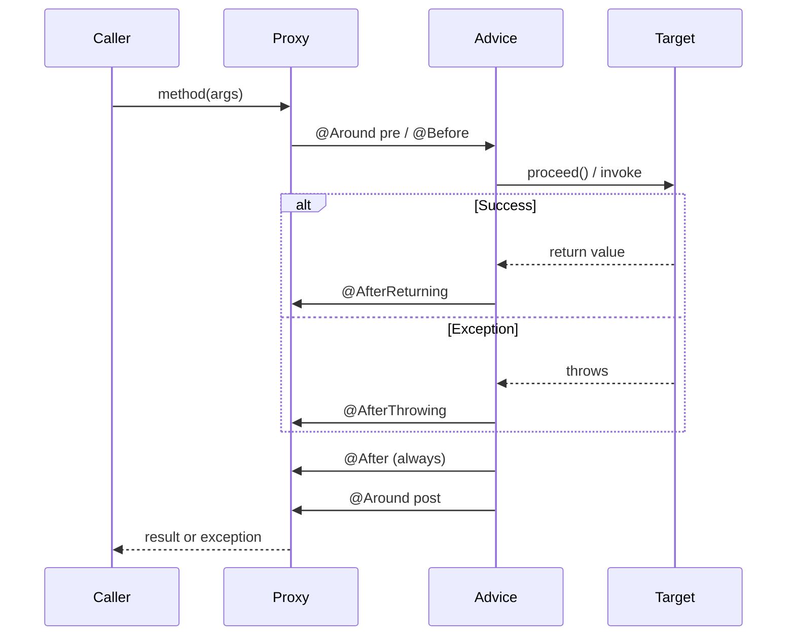
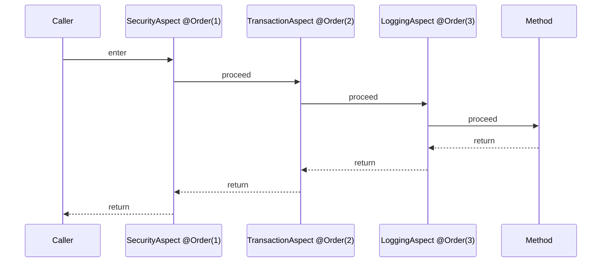

# Spring AOP Deep Dive: Writing Custom Aspects

**Date:** 2026-04-17
**Tags:** spring, aop, aspect, cross-cutting, proxy

## Table of Contents

1. [Summary](#summary)
2. [Core Concepts](#core-concepts)
3. [Dependency](#dependency)
4. [Enabling AOP](#enabling-aop)
5. [Writing Your First Aspect](#writing-your-first-aspect)
6. [Advice Types](#advice-types)
7. [Pointcut Expressions](#pointcut-expressions)
8. [Named Pointcuts](#named-pointcuts)
9. [Custom Annotations as Pointcuts](#custom-annotations-as-pointcuts)
10. [Aspect Ordering](#aspect-ordering)
11. [Accessing Method Metadata](#accessing-method-metadata)
12. [Limitations of Spring AOP](#limitations-of-spring-aop)
13. [When to Use AspectJ Instead](#when-to-use-aspectj-instead)
14. [Practical Use Cases](#practical-use-cases)
15. [Common Bugs](#common-bugs)
16. [Related](#related)
17. [References](#references)

---

## Summary

Spring AOP (Aspect-Oriented Programming) lets you apply **cross-cutting logic** — logging, security, metrics, transactions, auditing, caching — without touching the target code. It's the mechanism behind `@Transactional`, `@Async`, `@Cacheable`, and `@PreAuthorize`.

The magic is proxies: Spring wraps your beans in a dynamic proxy (JDK for interfaces, CGLIB for concrete classes), and the proxy intercepts method calls to run your advice before/after/around the real method. See [`spring-fundamentals.md#aop-and-proxies--the-magic-explained`](./spring-fundamentals.md) for the proxy mechanics.

This doc is the next step: **how to write your own aspects** — declaring pointcuts, choosing advice types, hooking them to custom annotations, and avoiding the common traps (self-invocation, wrong advice type, pointcut typos).

---

## Core Concepts

A quick vocabulary refresher. These terms map directly to annotations and APIs you'll use.

- **Aspect** — a module that encapsulates a cross-cutting concern. In Spring, a class annotated with `@Aspect`.
- **Join point** — a point during program execution where an aspect can be applied. In Spring AOP, **always a method execution** (AspectJ supports more, but Spring doesn't).
- **Pointcut** — a predicate that matches join points. Written as an expression: `execution(* com.example.service.*.*(..))`.
- **Advice** — the action taken by an aspect at a join point. Types: `@Before`, `@After`, `@AfterReturning`, `@AfterThrowing`, `@Around`.
- **Target object** — the real bean being advised (wrapped by the proxy).
- **Introduction** — declaring additional methods or interfaces on behalf of the target (rare; uses `@DeclareParents`).
- **Weaving** — linking aspects with target objects. Spring AOP does this at **runtime** via proxies. AspectJ can weave at compile-time or load-time.

---

## Dependency

Spring Boot bundles everything:

```xml
<dependency>
    <groupId>org.springframework.boot</groupId>
    <artifactId>spring-boot-starter-aop</artifactId>
</dependency>
```

This pulls in `spring-aop` and `aspectjweaver` (Spring uses the AspectJ annotations and pointcut parser, but runs its own proxy-based weaving).

Gradle equivalent:

```groovy
implementation 'org.springframework.boot:spring-boot-starter-aop'
```

---

## Enabling AOP

Spring Boot auto-configures `@EnableAspectJAutoProxy` as soon as `spring-boot-starter-aop` is on the classpath. No manual wiring.

Under the hood, the auto-configuration registers an `AnnotationAwareAspectJAutoProxyCreator` bean post-processor that scans for `@Aspect`-annotated beans and wraps matching targets with proxies.

If you're in a plain Spring (non-Boot) app:

```java
@Configuration
@EnableAspectJAutoProxy
public class AopConfig { }
```

Add `proxyTargetClass = true` to force CGLIB proxies for concrete classes. Boot defaults to CGLIB when it auto-configures AOP — you rarely need to think about this.

---

## Writing Your First Aspect

A logging aspect that times every service method:

```java
@Aspect
@Component
@Slf4j
public class LoggingAspect {

    @Around("execution(public * com.example.service.*.*(..))")
    public Object log(ProceedingJoinPoint pjp) throws Throwable {
        long start = System.currentTimeMillis();
        try {
            Object result = pjp.proceed();
            log.info("{} took {}ms",
                pjp.getSignature(),
                System.currentTimeMillis() - start);
            return result;
        } catch (Throwable t) {
            log.error("{} failed: {}", pjp.getSignature(), t.getMessage());
            throw t;
        }
    }
}
```

Two requirements:

1. **`@Aspect`** — marks this class as an aspect. AspectJ annotation, parsed by Spring.
2. **`@Component`** (or any stereotype) — Spring must know about this bean. `@Aspect` alone does nothing; Spring needs to instantiate it.

That's it. Any call to a public method of any class in `com.example.service.*` now gets timed and logged.

---

## Advice Types

Five flavors. Pick the least powerful one that does the job — `@Around` is the Swiss army knife but also the most error-prone.

| Advice | Annotation | When runs | Can modify return? | Notes |
|--------|-----------|-----------|--------------------|-------|
| Before | `@Before` | Before method | No | Side effects only (logging, auth check) |
| After (finally) | `@After` | After method, always | No | Runs whether it returned or threw |
| After returning | `@AfterReturning` | After successful return | Can inspect, not replace | Bind return value with `returning` |
| After throwing | `@AfterThrowing` | After exception | No (but can rethrow/wrap) | Bind exception with `throwing` |
| Around | `@Around` | Wraps method | **Yes** | Most flexible; you control `proceed()` |

### Lifecycle diagram



### Examples of each

```java
@Before("execution(* com.example.service.*.*(..))")
public void logEntry(JoinPoint jp) {
    log.debug("Entering {}", jp.getSignature().getName());
}

@AfterReturning(
    pointcut = "execution(* com.example.service.*.*(..))",
    returning = "result")
public void logSuccess(JoinPoint jp, Object result) {
    log.debug("{} returned {}", jp.getSignature().getName(), result);
}

@AfterThrowing(
    pointcut = "execution(* com.example.service.*.*(..))",
    throwing = "ex")
public void logFailure(JoinPoint jp, Throwable ex) {
    log.warn("{} threw {}", jp.getSignature().getName(), ex.getClass().getSimpleName());
}

@After("execution(* com.example.service.*.*(..))")
public void logExit(JoinPoint jp) {
    log.debug("Exiting {}", jp.getSignature().getName());
}
```

If you need to time a method, `@Around` is the only choice — `@Before` can't measure "after", and `@After` can't see "before" state.

---

## Pointcut Expressions

Spring AOP supports a subset of AspectJ's pointcut language. `execution()` covers 90% of real use.

### `execution()` anatomy

```
execution(modifiers? return-type declaring-type?.method-name(params) throws?)
```

- `*` — matches any single token (return type, class, method name)
- `..` — matches any number (in package, in parameter list)
- Modifiers (`public`, `protected`) optional
- `throws` clause optional

### Common patterns

```java
// Any public method on any class in com.example.service (one level deep)
"execution(public * com.example.service.*.*(..))"

// save() on any class ending in Repository, any subpackage of com.example
"execution(* com.example..*Repository.save(..))"

// Methods annotated with @GetMapping
"execution(@org.springframework.web.bind.annotation.GetMapping * *(..))"

// Methods with any return type, taking exactly one String
"execution(* *(String))"

// Methods taking a String first, anything after
"execution(* *(String, ..))"
```

### Other designators

```java
// Every method of every class inside a @Service-annotated class
"within(@org.springframework.stereotype.Service *)"

// Every method in a specific package (class-level, faster than execution)
"within(com.example.service..*)"

// Methods carrying a specific annotation
"@annotation(com.example.Audited)"

// Classes carrying an annotation (applies to all their methods)
"@within(com.example.AuditedType)"

// Bind method arguments by type into advice params
"args(String, ..)"

// Match by Spring bean name (supports wildcards: "*Service")
"bean(orderService)"

// this() vs target() — proxy vs target type (rarely needed)
"this(com.example.MyInterface)"
"target(com.example.MyImpl)"
```

### Combining

```java
@Around("execution(* com.example.service.*.*(..)) && !execution(* *.toString())")
public Object around(ProceedingJoinPoint pjp) throws Throwable { ... }

@Around("serviceLayer() && @annotation(audited)")
public Object around(ProceedingJoinPoint pjp, Audited audited) throws Throwable { ... }
```

Note the binding trick: when the pointcut names a parameter (`@annotation(audited)`), the advice method receives that annotation instance as an argument.

---

## Named Pointcuts

Don't repeat expressions. Declare once, reference everywhere:

```java
@Aspect
@Component
public class ServiceAspects {

    @Pointcut("execution(* com.example.service.*.*(..))")
    public void serviceLayer() {}

    @Pointcut("execution(* com.example.repository.*.*(..))")
    public void repositoryLayer() {}

    @Pointcut("serviceLayer() || repositoryLayer()")
    public void backendLayer() {}

    @Around("backendLayer()")
    public Object time(ProceedingJoinPoint pjp) throws Throwable {
        long start = System.nanoTime();
        try {
            return pjp.proceed();
        } finally {
            log.info("{} {}ns", pjp.getSignature(), System.nanoTime() - start);
        }
    }
}
```

Pointcuts are just empty methods — Spring reads their signature and annotation, not their body. You can reference them across aspects using their fully-qualified name: `com.example.aop.ServiceAspects.serviceLayer()`.

---

## Custom Annotations as Pointcuts

The idiomatic Spring pattern. Instead of package-based pointcuts (fragile when you move classes), declare your intent with an annotation.

### 1. Define the annotation

```java
@Retention(RetentionPolicy.RUNTIME)
@Target(ElementType.METHOD)
public @interface Audited {
    String action() default "";
}
```

`RetentionPolicy.RUNTIME` is mandatory — the proxy reads it at runtime.

### 2. Write the aspect

```java
@Aspect
@Component
@RequiredArgsConstructor
public class AuditAspect {

    private final AuditLog auditLog;

    @Around("@annotation(audited)")
    public Object audit(ProceedingJoinPoint pjp, Audited audited) throws Throwable {
        String user = SecurityContextHolder.getContext().getAuthentication().getName();
        String action = audited.action().isEmpty()
            ? pjp.getSignature().getName()
            : audited.action();

        try {
            Object result = pjp.proceed();
            auditLog.record(user, action, "SUCCESS");
            return result;
        } catch (Throwable t) {
            auditLog.record(user, action, "FAILURE: " + t.getMessage());
            throw t;
        }
    }
}
```

### 3. Annotate methods

```java
@Service
public class OrderService {

    @Audited(action = "create_order")
    public Order create(OrderRequest req) { ... }

    @Audited
    public void cancel(Long orderId) { ... }
}
```

Benefits over package-based pointcuts:

- Self-documenting — reading the method tells you it's audited.
- Refactor-safe — move the class, the annotation stays.
- Opt-in — no accidental advising of helper methods.

This is exactly how `@Transactional`, `@Cacheable`, `@Async`, `@PreAuthorize`, and `@Timed` (Micrometer) work.

---

## Aspect Ordering

When multiple aspects match the same join point, order matters. Use `@Order` (lower runs first on the way in, last on the way out — think Russian dolls):

```java
@Aspect
@Component
@Order(1)
public class SecurityAspect { ... }

@Aspect
@Component
@Order(2)
public class TransactionAspect { ... }

@Aspect
@Component
@Order(3)
public class LoggingAspect { ... }
```

Execution order for a call:



Without `@Order`, the order is undefined. Always set it if two aspects on the same join point could interact.

Implementing `Ordered` works too:

```java
@Aspect
@Component
public class SecurityAspect implements Ordered {
    @Override public int getOrder() { return 1; }
}
```

---

## Accessing Method Metadata

Every advice can take a `JoinPoint` (or `ProceedingJoinPoint` for `@Around`) as its first parameter.

```java
@Around("@annotation(com.example.Audited)")
public Object audit(ProceedingJoinPoint pjp) throws Throwable {
    MethodSignature sig = (MethodSignature) pjp.getSignature();
    Method method = sig.getMethod();
    String className = sig.getDeclaringType().getSimpleName();
    String methodName = sig.getName();
    Class<?>[] paramTypes = sig.getParameterTypes();
    String[] paramNames = sig.getParameterNames();
    Object[] args = pjp.getArgs();
    Object target = pjp.getTarget();     // the real bean
    Object proxy  = pjp.getThis();       // the proxy wrapping it

    // Re-run with mutated args
    Object[] mutated = Arrays.copyOf(args, args.length);
    mutated[0] = sanitize(mutated[0]);
    return pjp.proceed(mutated);
}
```

Useful bits:

- `getSignature()` — returns a `Signature`; cast to `MethodSignature` for method-level info.
- `getArgs()` — the actual arguments passed.
- `getTarget()` — the real target bean (use for reading target-side state).
- `getThis()` — the proxy (what callers see).
- `proceed()` — run the next advice or the target method.
- `proceed(Object[])` — run with replaced arguments.

If you need annotation values that aren't bound by name, pull them reflectively:

```java
Audited audited = method.getAnnotation(Audited.class);
```

---

## Limitations of Spring AOP

Spring AOP is **proxy-based**. This is fast, simple, and covers most needs, but has real constraints:

### 1. Only externally-called methods get advised

The proxy intercepts calls coming through it. Calls made via `this` inside the same class bypass the proxy entirely.

```java
@Service
public class OrderService {

    @Audited
    public Order create(OrderRequest req) {
        return validateAndSave(req);   // NOT advised
    }

    @Audited
    public Order validateAndSave(OrderRequest req) { ... }
}
```

A caller invoking `orderService.create(...)` hits the proxy → `create` is audited. But `create`'s internal call to `validateAndSave` is `this.validateAndSave(...)` — no proxy involved, no advice. Same trap as `@Transactional` self-invocation.

**Fixes:** split into two beans, or inject self (`@Autowired OrderService self;`), or use AspectJ load-time weaving.

### 2. Visibility

- **JDK dynamic proxies** (interface-based): only `public` methods on the interface.
- **CGLIB** (subclass-based, Boot's default): `public` and `protected`. Package-private and private are invisible.

### 3. `final` classes and methods

CGLIB proxies by subclassing. `final` classes can't be subclassed; `final` methods can't be overridden. Either gets skipped or the proxy creation fails.

### 4. What Spring AOP cannot advise

- `static` methods (not virtual, no proxy dispatch)
- Constructors
- Field access
- Methods on non-Spring-managed objects (e.g., `new Foo()`)

For any of these, you need full AspectJ.

---

## When to Use AspectJ Instead

Reach for AspectJ proper (not Spring AOP) when:

- You need to advise constructors, field access, or static methods.
- Self-invocation must be advised (e.g., you can't refactor the code).
- You need to advise non-Spring objects.
- Performance matters and proxy overhead is unacceptable (weaving is zero-cost at call time).
- You need the full AspectJ pointcut language (`call()`, `set()`, `get()`, `initialization()`, `staticinitialization()`).

Two AspectJ modes:

- **Compile-time weaving (CTW)** — `aspectjtools` Maven/Gradle plugin, modifies `.class` files at build.
- **Load-time weaving (LTW)** — a java agent modifies classes as the classloader loads them. Spring supports this via `@EnableLoadTimeWeaving`.

More setup, more power, steeper learning curve. For 95% of business code, stay with Spring AOP.

---

## Practical Use Cases

### Method-level caching decorator

```java
@Retention(RUNTIME) @Target(METHOD)
public @interface MemoCache { long ttlSeconds() default 60; }

@Aspect @Component @RequiredArgsConstructor
public class CacheAspect {
    private final Cache cache;

    @Around("@annotation(memo)")
    public Object cache(ProceedingJoinPoint pjp, MemoCache memo) throws Throwable {
        String key = pjp.getSignature().toShortString() + Arrays.toString(pjp.getArgs());
        return cache.get(key, memo.ttlSeconds(), () -> {
            try { return pjp.proceed(); } catch (Throwable t) { throw new RuntimeException(t); }
        });
    }
}
```

In practice, prefer `@Cacheable` from Spring Cache — same idea, battle-tested.

### Structured logging with start/end/duration

```java
@Around("within(@org.springframework.stereotype.Service *)")
public Object log(ProceedingJoinPoint pjp) throws Throwable {
    MDC.put("method", pjp.getSignature().toShortString());
    long start = System.currentTimeMillis();
    try {
        Object result = pjp.proceed();
        MDC.put("durationMs", String.valueOf(System.currentTimeMillis() - start));
        log.info("ok");
        return result;
    } finally {
        MDC.remove("method");
        MDC.remove("durationMs");
    }
}
```

### Method-level metrics (Micrometer)

Micrometer provides `@Timed` out of the box. If you're writing your own:

```java
@Around("@annotation(timed)")
public Object time(ProceedingJoinPoint pjp, Timed timed) throws Throwable {
    return meterRegistry.timer(timed.value()).recordCallable(() -> {
        try { return pjp.proceed(); } catch (Throwable t) { throw new CompletionException(t); }
    });
}
```

### Authorization on custom annotations

```java
@Retention(RUNTIME) @Target(METHOD)
public @interface RequiresRole { String value(); }

@Aspect @Component
public class AuthzAspect {
    @Before("@annotation(req)")
    public void check(RequiresRole req) {
        var auth = SecurityContextHolder.getContext().getAuthentication();
        boolean ok = auth.getAuthorities().stream()
            .anyMatch(a -> a.getAuthority().equals("ROLE_" + req.value()));
        if (!ok) throw new AccessDeniedException("role required: " + req.value());
    }
}
```

Spring Security's `@PreAuthorize` does this properly — use it. Roll your own only when the rules don't fit.

### Multi-tenant data filtering

```java
@Around("@within(com.example.TenantScoped)")
public Object scope(ProceedingJoinPoint pjp) throws Throwable {
    String tenant = TenantContext.current();
    TenantFilter.apply(tenant);
    try {
        return pjp.proceed();
    } finally {
        TenantFilter.clear();
    }
}
```

---

## Common Bugs

### Proxy not applied

Symptoms: the aspect compiles and starts, but advice never runs.

- Target isn't a Spring bean. `new MyService()` bypasses the proxy. Always inject.
- Calling the method via `this` from another method of the same class. Self-invocation bypasses the proxy. Inject self, split the bean, or go AspectJ.
- The method isn't `public` (or `protected` under CGLIB).
- You mistyped the pointcut — no error, just silent no-match.

### Pointcut not matching

- Check package paths. `com.example.service.*` matches one level — classes directly in the package. Use `com.example.service..*` for subpackages.
- `*` matches one token, `..` matches any number. Confusing them is the #1 cause.
- `execution(@Service *)` does **not** match classes annotated with `@Service` — that's `within(@Service *)`.

### Wrong advice type

- `@Before` cannot modify arguments or replace the return value. For that, `@Around` is the only option.
- `@AfterReturning` can **observe** the return value (via `returning = "result"`) but not replace it.
- `@After` runs whether the method threw or not — don't put "success" logic there.

### Modified args via reflection don't propagate

```java
// WRONG — mutating pjp.getArgs() does nothing
Object[] args = pjp.getArgs();
args[0] = sanitize(args[0]);
return pjp.proceed();   // still uses originals

// RIGHT — pass the modified array to proceed()
Object[] args = pjp.getArgs();
args[0] = sanitize(args[0]);
return pjp.proceed(args);
```

Only `proceed(Object[])` threads new arguments through to the target.

### Exception swallowing in advice

```java
@Around("...")
public Object bad(ProceedingJoinPoint pjp) {
    try { return pjp.proceed(); } catch (Throwable t) { return null; }  // NO
}
```

Silently converts failures into `null` returns. Callers have no idea anything went wrong. Either rethrow or wrap:

```java
} catch (Throwable t) {
    log.error("...", t);
    throw t;
}
```

### Advice order assumed

Two aspects on the same method without `@Order` run in undefined order. A security check that runs **after** a transaction has already started is a bug. Always declare order when it matters.

### Forgetting `RetentionPolicy.RUNTIME`

```java
@Retention(RetentionPolicy.SOURCE)   // WRONG — annotation is gone at runtime
public @interface Audited {}
```

The proxy looks for the annotation at runtime. `SOURCE` or `CLASS` retention means it's not there. Use `RUNTIME`.

---

## Related

- [Spring Fundamentals](spring-fundamentals.md) — AOP and proxies section; the big-picture intro this doc builds on.
- [JPA Transactions](jpa-transactions.md) — `@Transactional` is the canonical AOP example; same proxy mechanics, same self-invocation trap.
- [Async Processing](events-async/async-processing.md) — `@Async` is another proxy-based feature with identical limitations.
- [Lombok and Boilerplate](java-fundamentals/lombok-and-boilerplate.md) — `@Slf4j` and constructor injection patterns.
- [Common Design Patterns — Proxy](java-fundamentals/common-design-patterns.md#proxy-pattern--the-heart-of-spring-aop) — Proxy as a design pattern.
- [Structural Patterns Deep Dive](design-patterns/structural-patterns.md#proxy-vs-decorator-vs-adapter--when-people-confuse-them) — Proxy vs Decorator vs Adapter.
- [Security Filter Chain](security/security-filter-chain.md) — AOP-adjacent: Spring Security uses filter chains, not AOP proxies.

---

## References

- Spring Framework Reference — AOP: https://docs.spring.io/spring-framework/reference/core/aop.html
- Spring Boot — Aspect-Oriented Programming: https://docs.spring.io/spring-boot/docs/current/reference/html/using.html
- AspectJ Programming Guide: https://www.eclipse.org/aspectj/doc/released/progguide/index.html
- AspectJ Pointcut Expression Language: https://www.eclipse.org/aspectj/doc/released/progguide/semantics-pointcuts.html
- Micrometer `@Timed` annotation: https://docs.micrometer.io/micrometer/reference/concepts/timers.html
- Spring Security method security: https://docs.spring.io/spring-security/reference/servlet/authorization/method-security.html
