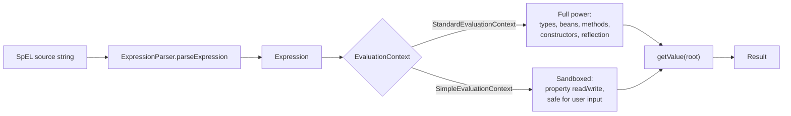

# Spring Expression Language (SpEL)

**Date:** 2026-04-17
**Tags:** `spring`, `spel`, `expressions`

## Table of Contents

- [Summary](#summary)
- [`${...}` vs `#{...}`](#-vs-)
- [Where SpEL Appears](#where-spel-appears)
- [Core Syntax](#core-syntax)
- [Variables and Functions](#variables-and-functions)
- [Method-Argument Context](#method-argument-context)
- [Security SpEL](#security-spel)
- [Evaluation Contexts](#evaluation-contexts)
- [Using SpEL Programmatically](#using-spel-programmatically)
- [Performance and Compilation](#performance-and-compilation)
- [Security Risks](#security-risks)
- [Common Pitfalls](#common-pitfalls)
- [Related](#related)
- [References](#references)

---

## Summary

Spring Expression Language (SpEL) is a small, purpose-built expression language
embedded in the Spring ecosystem. It lets you write short expressions inside
annotations, XML, YAML, and programmatic APIs that are parsed and evaluated at
runtime against a Spring-aware context (beans, the current request, method
arguments, security principal, and so on).

SpEL is **not Java** and **not JavaScript**. It is its own mini-language with
its own parser, its own grammar, and its own evaluation model. It borrows
familiar operators from Java (`+`, `==`, `&&`) but adds features Java lacks
(safe navigation, collection projection/selection, Elvis operator, bean
references with `@`, static references with `T()`).

You will encounter SpEL in:

- `@Value` on fields and constructor parameters
- `@PreAuthorize` / `@PostAuthorize` / `@PreFilter` / `@PostFilter` (Spring Security)
- `@Cacheable` / `@CacheEvict` / `@CachePut` (Spring Cache)
- `@ConditionalOnExpression` (Spring Boot autoconfiguration)
- Spring Data `@Query` parameter binding with `?#{...}` / `:#{...}`
- `@Scheduled(cron = "#{...}")` for dynamic schedules
- Event routing: `@EventListener(condition = "#event.type == 'X'")`
- XML/YAML configuration values

Understanding the grammar and the evaluation model removes a lot of the
"how does Spring know that" mystery.

---

## `${...}` vs `#{...}`

This is the single most important distinction. Both appear in the same
annotations and both feel magical, but they come from entirely different
subsystems.

| Syntax   | Name                  | Resolved by                              | When          | Source                              |
|----------|-----------------------|------------------------------------------|---------------|-------------------------------------|
| `${...}` | Property placeholder  | `PropertySourcesPlaceholderConfigurer`   | Bean init     | `Environment` / `PropertySource`    |
| `#{...}` | SpEL expression       | `ExpressionParser` / `BeanExpressionResolver` | Runtime  | SpEL evaluation context             |

### `${...}` — property placeholder

Looks up a **property key** in Spring's `Environment` (merged from
`application.yml`, `application.properties`, OS env vars, system properties,
command-line args, etc.). Performed early, during bean definition
post-processing.

```java
@Value("${app.api.base-url}")
private String apiBaseUrl;

@Value("${app.api.timeout-ms:5000}")  // ":5000" is a default
private int timeoutMs;
```

If the key is missing and no default is supplied, startup fails.

### `#{...}` — SpEL expression

Parses the content as a SpEL expression and evaluates it against an
`EvaluationContext`. This runs arbitrary code, in the sense that it can call
methods, reference beans, and use operators.

```java
@Value("#{2 * 60 * 1000}")          // arithmetic -> 120000
private int refreshMs;

@Value("#{systemProperties['user.home']}")
private String home;

@Value("#{@clock.instant()}")        // call method on bean named "clock"
private Instant startedAt;
```

### Combining them

You often see both in one string. The placeholder is resolved first, then the
resulting string is fed into the SpEL expression:

```java
// Read "csv.list" (say "a,b,c"), then split into a String[]
@Value("#{'${csv.list}'.split(',')}")
private String[] items;

// Gate on both a property AND a SpEL check
@ConditionalOnExpression("${feature.x.enabled:false} and '${env}' == 'prod'")
```

The mental model: `${}` is "string substitution from config"; `#{}` is
"evaluate an expression". They compose in that order.

---

## Where SpEL Appears

### `@Value`

```java
@Value("#{systemProperties['user.region']}")
private String region;

@Value("#{T(java.lang.Math).random() * 100}")
private double seed;                       // 'T(...)' is the static reference

@Value("#{orderService.currentDiscount()}")
private BigDecimal discount;               // calls a bean method

@Value("#{environment['JAVA_HOME']}")
private String javaHome;
```

### Spring Security (`@PreAuthorize`, etc.)

```java
@PreAuthorize("hasRole('ADMIN') and #id == authentication.principal.id")
public User get(Long id) { ... }

@PostAuthorize("returnObject.ownerId == authentication.principal.id")
public Document load(Long docId) { ... }
```

### Spring Cache

```java
@Cacheable(cacheNames = "user-locale",
           key = "#user.id + '-' + #locale.language")
public Profile render(User user, Locale locale) { ... }

@CacheEvict(cacheNames = "orders",
            condition = "#order.total > 1000",
            key = "#order.id")
public void record(Order order) { ... }
```

### Conditional Beans

```java
@Bean
@ConditionalOnExpression("${feature.x.enabled:false} and '${env}' == 'prod'")
public XService xService() { ... }
```

### Spring Data `@Query` with SpEL

Spring Data allows `?#{...}` (positional) and `:#{...}` (named) SpEL fragments
inside JPQL or native queries. Useful for injecting the current principal,
tenant, or a computed value without adding it as a method parameter.

```java
public interface UserRepo extends JpaRepository<User, Long> {

    @Query("SELECT u FROM User u WHERE u.org = ?#{principal.orgId}")
    List<User> findInMyOrg();
}
```

### `@Scheduled` with a dynamic cron

```java
@Scheduled(cron = "#{@settings.cronForJobX()}")
public void runJobX() { ... }
```

The cron string is resolved once at registration. If you need it to change
live, you need a dynamically scheduled task, not just SpEL.

### Event filtering

```java
@EventListener(condition = "#event.severity == 'HIGH'")
public void handle(AlertEvent event) { ... }
```

---

## Core Syntax

### Literals

```text
'hello'     "hello"     42      3.14      1.2e3      0xFF      true      false      null
```

### Arithmetic

```text
1 + 2       10 - 3      4 * 5      10 / 3      10 % 3      2 ^ 10  (power)
```

### Comparison

Symbolic **or** word form (word form exists because XML/YAML dislike `<`/`>`):

| Symbol | Word |
|--------|------|
| `==`   | `eq` |
| `!=`   | `ne` |
| `<`    | `lt` |
| `>`    | `gt` |
| `<=`   | `le` |
| `>=`   | `ge` |

### Logical

```text
a and b        a or b        not a
a && b         a || b        !a
```

### Ternary and Elvis

```text
age >= 18 ? 'adult' : 'minor'
name ?: 'anonymous'            // if name is null, use 'anonymous'
```

### Safe navigation

```text
user?.address?.city     // null if user or address is null; no NPE
```

### Regex

```text
'abc123' matches '[a-z]+\d+'    // true
```

### Inline lists and maps

```text
{1, 2, 3, 4}
{'a': 1, 'b': 2}
```

### Property and indexed access

```text
user.name
user['name']
orders[0]
headers['Content-Type']
```

### Collection projection (`.![]`)

Collect a field from every element:

```text
customers.![name]         // List<String> of customer names
orders.![total]           // List<BigDecimal> of totals
```

### Collection selection (`.?[]`)

Filter elements that match a predicate:

```text
customers.?[age > 18]
orders.?[status == 'PAID']
customers.^[age > 18]     // first match
customers.$[age > 18]     // last match
```

---

## Variables and Functions

- `#this` — the current evaluation element (inside a projection/selection this
  is the current item).
- `#root` — the root object of the evaluation, whatever was passed into
  `getValue(root)`.
- `#varName` — a named variable set on the `EvaluationContext` (or a
  method-argument name in cache/security annotations).
- `T(fully.qualified.Class)` — a **type reference**; required for static method
  or static field access. Example: `T(java.time.Instant).now()`.
- `@beanName` — reference to a Spring bean in the current application context.
  `@beanName.someMethod(#x)` is the canonical way to call bean logic.
- `&beanName` — the **factory bean** itself (rarely needed).

Example combining several:

```java
@Value("#{@pricing.discountFor(T(java.time.LocalDate).now()) * 0.5}")
private BigDecimal promo;
```

---

## Method-Argument Context

In `@Cacheable`, `@PreAuthorize`, and similar annotations, Spring binds the
intercepted method's arguments into the evaluation context by name. You can
then reference them as `#argName`:

```java
@Cacheable(cacheNames = "user", key = "#user.id")
public Result find(User user) { ... }

@PreAuthorize("#req.userId == authentication.principal.id")
public void update(UpdateReq req) { ... }
```

For this to work, Spring must know the real argument names. That requires one
of the following:

1. **Compile with `-parameters`** so parameter names are preserved in the
   bytecode. This is the clean option. See
   [`javac-parameters-flag.md`](./javac-parameters-flag.md).
2. **Annotate with `@Param("user")`** (Spring Data) or `@P("user")`
   (Spring Security's `@P` annotation) to name the argument explicitly.

Without either, you fall back to positional access (`#a0`, `#p0`) which is
fragile and unreadable.

You can also reach positional arguments unconditionally via `#root.args[0]`.

---

## Security SpEL

Spring Security exposes a fixed vocabulary on top of SpEL inside
`@PreAuthorize` / `@PostAuthorize` / `@PreFilter` / `@PostFilter`.

### Role and authority checks

```text
hasRole('ADMIN')
hasAnyRole('ADMIN','OPS')
hasAuthority('SCOPE_read')
hasAnyAuthority('SCOPE_read','SCOPE_write')
permitAll
denyAll
isAuthenticated()
isAnonymous()
isRememberMe()
isFullyAuthenticated()
```

Note: `hasRole('ADMIN')` checks for the authority `ROLE_ADMIN` (the prefix is
added automatically). `hasAuthority('ADMIN')` does **not** add the prefix.

### Principal, authentication, return value

```text
principal                       // the logged-in principal object
authentication                  // the full Authentication
authentication.principal.id
#returnObject                   // available only in @PostAuthorize
```

### Combining with method arguments

```java
@PreAuthorize("hasRole('USER') and #ownerId == authentication.principal.id")
public Account view(Long ownerId) { ... }

@PostAuthorize("returnObject.ownerId == authentication.principal.id")
public Account load(Long id) { ... }
```

### Filtering collections

```java
@PostFilter("filterObject.ownerId == authentication.principal.id")
public List<Note> list() { ... }      // removes notes not owned by caller
```

---

## Evaluation Contexts

SpEL is parsed once into an `Expression` and then evaluated against an
`EvaluationContext`. There are two stock implementations, and they differ
sharply in what they allow.



- **`StandardEvaluationContext`** — the default inside Spring. Allows type
  references (`T(...)`), bean references (`@beanName`), constructor calls,
  method calls via reflection, and more. This is what makes `@Value("#{...}")`
  so powerful. It is **unsafe for untrusted input**.
- **`SimpleEvaluationContext`** — a deliberately limited context. No `T(...)`,
  no bean references, no arbitrary method resolution. Use this when you
  evaluate expressions supplied by end users (reporting filters, rules engines,
  etc.).

---

## Using SpEL Programmatically

The public API lives in `org.springframework.expression`.

```java
ExpressionParser parser = new SpelExpressionParser();

// 1. Simple literal expression
Expression exp1 = parser.parseExpression("'hello world'.length()");
Integer len = exp1.getValue(Integer.class);     // 11

// 2. Against a root object
record Person(String name, int age) {}
Expression exp2 = parser.parseExpression("name.toUpperCase()");
String shouty = exp2.getValue(new Person("ada", 36), String.class);

// 3. With variables via a context
StandardEvaluationContext ctx = new StandardEvaluationContext();
ctx.setVariable("factor", 3);
Expression exp3 = parser.parseExpression("#factor * 10");
Integer result = exp3.getValue(ctx, Integer.class);   // 30

// 4. Sandboxed context for untrusted input
SimpleEvaluationContext safe = SimpleEvaluationContext
        .forReadOnlyDataBinding()
        .build();
parser.parseExpression("age >= 18").getValue(safe, new Person("ada", 36), Boolean.class);
```

`Expression` instances are thread-safe and reusable. Parse once, evaluate many.

---

## Performance and Compilation

By default SpEL is interpreted. For hot paths, SpEL can **compile expressions
to JVM bytecode**, which removes reflection overhead.

```java
SpelParserConfiguration config = new SpelParserConfiguration(
        SpelCompilerMode.MIXED,           // OFF, IMMEDIATE, or MIXED
        this.getClass().getClassLoader());

ExpressionParser parser = new SpelExpressionParser(config);
```

Modes:

- `OFF` — always interpreted (default).
- `IMMEDIATE` — compile on first evaluation; failure aborts evaluation.
- `MIXED` — interpret first, compile in the background once the expression
  has stabilized; safe fallback to interpretation on compile failure.

Compilation has restrictions: the expression must be type-stable, and not all
nodes compile. Good candidates are short, hot expressions with predictable
types. Measure before assuming you need it.

---

## Security Risks

SpEL is **code execution**. With `StandardEvaluationContext` it can:

- instantiate arbitrary classes (`T(java.lang.Runtime).getRuntime().exec(...)`)
- read and write bean properties
- call any reachable method

Rules:

1. **Never pass user-controlled strings to `parseExpression` against a
   `StandardEvaluationContext`.** If you need user expressions, use
   `SimpleEvaluationContext`.
2. **Never interpolate user input into `#{...}` strings** that end up in
   `@Value`, `@Query`, or similar. This is the SpEL equivalent of SQL
   injection.
3. Be aware of historical CVEs in Spring products where SpEL evaluation on
   untrusted input led to RCE (e.g., routing headers, error responses, and
   framework integrations). Keep Spring versions current.
4. Review any annotation whose expression string is dynamically built from
   request data — that pattern should essentially never exist.

---

## Common Pitfalls

- **Forgetting `#{}`.** `@Value("2 * 60 * 1000")` injects the literal string
  `"2 * 60 * 1000"`. You need `@Value("#{2 * 60 * 1000}")` to get `120000`.
- **Mixing up `${}` and `#{}` order.** Remember: property placeholders are
  replaced first, then SpEL runs on the result. If you wrote
  `@Value("${#{...}}")` you almost certainly meant `@Value("#{'${...}'}")`.
- **`T()` classpath issues.** `T(com.example.Foo)` must be reachable from the
  classloader used by SpEL. If Foo lives in a module not visible to the
  application context, you will get a parse-time or eval-time error.
- **Argument names missing.** `@Cacheable(key = "#user.id")` silently
  degrades if the class was compiled without `-parameters` and there is no
  `@Param`. You end up caching by `"null"` or throwing a resolution error.
- **Variable scope confusion.** In security annotations, `#foo` refers to a
  method argument. In cache annotations, it is the same, but inside
  `@PostAuthorize` you additionally have `returnObject`. In `@Value`, there
  are no method arguments at all — only beans, the environment, and types.
- **Word vs symbol operators.** `lt`, `gt`, `and`, `or` are needed in XML/YAML
  where `<`/`>`/`&` are reserved. In Java annotations, symbol form is fine.
- **Quoting inside annotations.** Java strings already need `\"`, so nested
  SpEL strings are ugly: `@Cacheable(key = "'x-' + #id")`. Prefer single
  quotes inside SpEL to keep the Java side readable.
- **Compilation surprises.** Compiled expressions may bind types tighter than
  interpreted ones. If you change the shape of a referenced bean, invalidate
  and re-parse.
- **Overuse.** SpEL in annotations is convenient, but a three-line Java helper
  method is usually easier to read, test, and debug. Reach for SpEL when you
  need declarative composition (security rules, cache keys, condition gates),
  not as a general scripting layer.

---

## Related

- [`configurations/externalized-config.md`](./configurations/externalized-config.md) — `${...}` placeholders and `Environment`
- [`spring-fundamentals.md`](./spring-fundamentals.md) — ApplicationContext, bean lifecycle
- [`security/authentication-authorization.md`](./security/authentication-authorization.md) — `@PreAuthorize`/`@PostAuthorize` in context
- [`javac-parameters-flag.md`](./javac-parameters-flag.md) — why `#user.id` needs `-parameters`

## References

- Spring Framework Reference — Spring Expression Language (SpEL)
- Javadoc — `org.springframework.expression.spel.support.StandardEvaluationContext`
- Javadoc — `org.springframework.expression.spel.support.SimpleEvaluationContext`
- Javadoc — `org.springframework.expression.spel.SpelCompilerMode`
- Spring Security Reference — Method Security expressions
- Spring Data JPA Reference — SpEL support in `@Query` (`?#{...}` / `:#{...}`)
- CVE history — historical RCE issues involving SpEL evaluation on untrusted input (kept as a reminder to avoid that pattern, not as a how-to)
