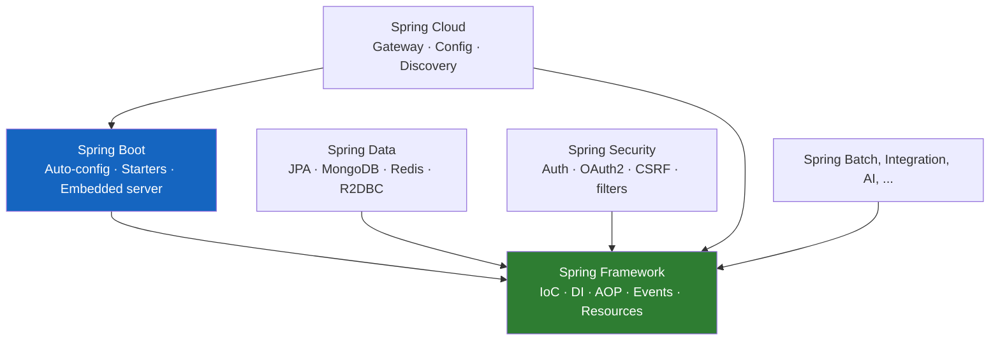
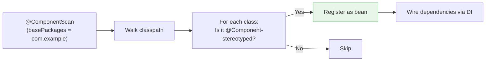
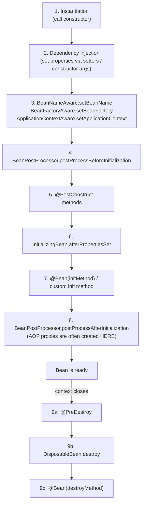
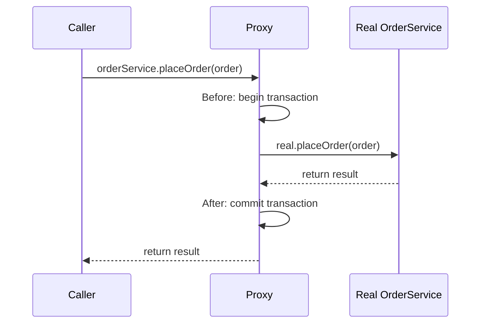
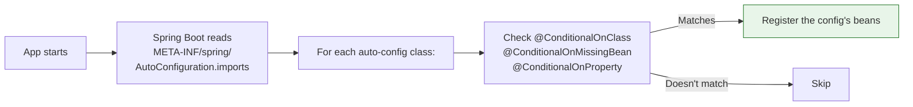
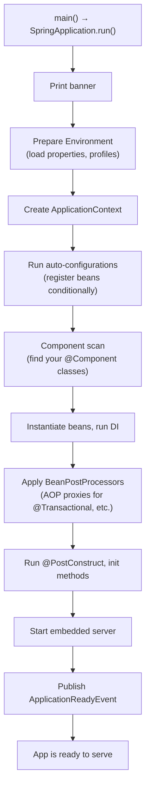

# Spring Fundamentals — IoC, DI, AOP, Auto-Configuration, and the Ecosystem

**Date:** 2026-04-16 | **Updated:** 2026-04-16
**Tags:** `spring` `spring-boot` `ioc` `dependency-injection` `aop` `fundamentals`

## Table of Contents

- [Summary](#summary)
- [The Spring Ecosystem](#the-spring-ecosystem)
  - [Spring Framework — The Core](#spring-framework--the-core)
  - [Spring Boot — The Opinionated Layer](#spring-boot--the-opinionated-layer)
  - [Spring Data, Security, Cloud, etc.](#spring-data-security-cloud-etc)
  - [Spring MVC vs Spring WebFlux](#spring-mvc-vs-spring-webflux)
- [Inversion of Control — The Core Idea](#inversion-of-control--the-core-idea)
  - [The "Before Spring" Problem](#the-before-spring-problem)
  - [What IoC Actually Inverts](#what-ioc-actually-inverts)
  - [The ApplicationContext](#the-applicationcontext)
  - [What's a "Bean"?](#whats-a-bean)
  - [Stereotype Beans vs Configuration-Produced Beans](#stereotype-beans-vs-configuration-produced-beans)
- [Dependency Injection](#dependency-injection)
  - [Three Injection Styles](#three-injection-styles)
  - [Why Constructor Injection Wins](#why-constructor-injection-wins)
  - [@Autowired — What It Actually Does](#autowired--what-it-actually-does)
  - [Resolving Ambiguity: @Qualifier and @Primary](#resolving-ambiguity-qualifier-and-primary)
  - [Optional Dependencies](#optional-dependencies)
- [Stereotype Annotations — @Component Family](#stereotype-annotations--component-family)
  - [The Four Stereotypes](#the-four-stereotypes)
  - [What's Actually Different Between Them](#whats-actually-different-between-them)
  - [@Configuration is Also a Stereotype](#configuration-is-also-a-stereotype)
- [Component Scanning](#component-scanning)
  - [How Spring Finds Your Beans](#how-spring-finds-your-beans)
  - [The Default Base Package Rule](#the-default-base-package-rule)
  - [Customizing the Scan](#customizing-the-scan)
- [Bean Lifecycle](#bean-lifecycle)
  - [The Nine Lifecycle Stages](#the-nine-lifecycle-stages)
  - [Hooks You Can Use](#hooks-you-can-use)
  - [Bean Scopes](#bean-scopes)
- [AOP and Proxies — The Magic Explained](#aop-and-proxies--the-magic-explained)
  - [What a Proxy Is](#what-a-proxy-is)
  - [JDK Dynamic Proxies vs CGLIB](#jdk-dynamic-proxies-vs-cglib)
  - [Why @Transactional, @Cacheable, @Async Work](#why-transactional-cacheable-async-work)
  - [The Self-Invocation Trap](#the-self-invocation-trap)
- [Spring Boot — The Opinionated Layer](#spring-boot--the-opinionated-layer-1)
  - [@SpringBootApplication Decoded](#springbootapplication-decoded)
  - [How Auto-Configuration Works](#how-auto-configuration-works)
  - [What "Starters" Actually Are](#what-starters-actually-are)
  - [The Embedded Server](#the-embedded-server)
- [Startup Lifecycle — What Happens When You Run main()](#startup-lifecycle--what-happens-when-you-run-main)
- ["Magic Demystified" — Common Confusions](#magic-demystified--common-confusions)
- [Related](#related)
- [References](#references)

---

## Summary

Spring is a Java framework built on one core idea — **Inversion of Control (IoC)**: instead of your code creating its dependencies with `new`, Spring creates them and hands them to you via **Dependency Injection (DI)**. Everything else — `@Autowired`, `@Transactional`, `@RestController`, auto-configuration, stereotype annotations — is built on this foundation. Spring Boot adds opinionated auto-configuration and embedded servers on top of the Spring Framework, and the wider ecosystem (Spring Data, Security, Cloud) provides focused modules that all plug into the same IoC container.

---

## The Spring Ecosystem

The word "Spring" gets used imprecisely. It refers to at least four different things:



### Spring Framework — The Core

[Spring Framework](https://docs.spring.io/spring-framework/reference/overview.html) is the foundation. It provides:

- **IoC container** (`ApplicationContext`) — manages object lifecycle and wiring
- **Dependency injection** — how objects get their collaborators
- **AOP** — cross-cutting concerns (transactions, security, logging)
- **Abstractions** for data access, web, messaging, events

When people say "Spring" without further qualification, they usually mean Spring Framework or Spring Boot.

### Spring Boot — The Opinionated Layer

[Spring Boot](https://spring.io/projects/spring-boot/) is an opinionated layer **on top of** Spring Framework. It adds:

- **Auto-configuration** — sensible defaults based on your classpath
- **Starters** — curated dependency bundles (`spring-boot-starter-web`, `-webflux`, `-data-jpa`)
- **Embedded servers** — Tomcat, Jetty, Netty bundled in the JAR
- **Production-ready features** — Actuator for health/metrics/info

You can use Spring Framework without Spring Boot — but almost nobody does anymore. Boot eliminates so much boilerplate that it's the default starting point.

### Spring Data, Security, Cloud, etc.

Focused sub-projects that plug into the IoC container:

| Project | Purpose |
|---------|---------|
| **Spring Data** | Database repositories (JPA, MongoDB, Redis, R2DBC, ...) |
| **Spring Security** | Authentication, authorization, CSRF, OAuth2 |
| **Spring Cloud** | Distributed systems (config server, gateway, service discovery) |
| **Spring Batch** | Large-volume batch processing |
| **Spring Integration** | Enterprise integration patterns |
| **Spring AI** | LLM integrations |

All of these register their own beans into your `ApplicationContext` — they're not separate runtimes.

### Spring MVC vs Spring WebFlux

Two **different** web frameworks, both from Spring. Pick one per app:

| | Spring MVC | Spring WebFlux |
|---|-----------|----------------|
| Stack | Servlet (blocking) | Reactive (non-blocking) |
| Default server | Tomcat | Netty |
| Programming model | `@RestController` returning `T` | `@RestController` returning `Mono<T>`/`Flux<T>` |
| Best with | JPA, traditional apps | R2DBC, reactive Mongo, high-concurrency |
| API similarity | 95% — same annotations, same patterns | 95% — same annotations, same patterns |

---

## Inversion of Control — The Core Idea

### The "Before Spring" Problem

Without Spring, your code creates and wires its dependencies manually:

```java
// Each class owns its dependencies
public class OrderService {
    private final OrderRepository repo = new OrderRepositoryImpl(
        new DataSource("jdbc:postgres://..."));
    private final EmailSender mailer = new EmailSender(
        new SmtpClient("smtp.example.com", 587));
    // ...
}
```

Problems:
- **Hard to test** — you can't swap `OrderRepository` for a mock without modifying the class
- **Coupled** — `OrderService` knows how to construct its dependencies, not just use them
- **Wiring lives everywhere** — every class assembles its own dependency graph

### What IoC Actually Inverts

"Inversion of Control" inverts **who owns object creation**. Instead of your class creating dependencies, **the framework creates them and hands them to your class**:

```java
public class OrderService {
    private final OrderRepository repo;
    private final EmailSender mailer;

    // Spring creates OrderRepository and EmailSender,
    // then calls this constructor with them.
    public OrderService(OrderRepository repo, EmailSender mailer) {
        this.repo = repo;
        this.mailer = mailer;
    }
}
```

[This is the core of Spring IoC](https://docs.spring.io/spring-framework/reference/core/beans/introduction.html) — the framework inverts the control of object instantiation from you to itself.

### The ApplicationContext

The [`ApplicationContext`](https://docs.spring.io/spring-framework/reference/core/beans/basics.html) is the IoC container. At runtime it holds:

- Every bean Spring has created
- Metadata about how beans relate to each other
- Configuration (properties, profiles, etc.)
- Event publishing and other infrastructure

You rarely interact with it directly — you just declare your classes, and the context takes care of creating and wiring them. When you run a Spring Boot app, `SpringApplication.run(...)` creates the `ApplicationContext` and keeps it alive until shutdown.

### What's a "Bean"?

A **bean** is any object Spring manages. Bean is a vague word, but at runtime it's very concrete: an entry in the `ApplicationContext` with:

- A **name** (usually the class name in camelCase, e.g., `orderService`)
- A **type** (the class)
- A **scope** (default: singleton)
- **Dependencies** on other beans
- **Lifecycle hooks** (init, destroy)

How classes become beans:

| Your code | How it becomes a bean |
|-----------|----------------------|
| `@Component`, `@Service`, `@Repository`, `@Controller` on a class | Component scan discovers it |
| `@Bean` method inside a `@Configuration` class | Explicit bean definition |
| `@ConfigurationProperties` class with `@EnableConfigurationProperties` or `@ConfigurationPropertiesScan` | Registered by Spring Boot |
| Auto-configured by a starter | Registered conditionally |

### Stereotype Beans vs Configuration-Produced Beans

A common mental-model question: *"With `@Service` the class is the bean, but with `@Configuration` each method is the bean — right?"* Almost, but not quite. The truth is cleaner:

- **Stereotype classes** (`@Service`, `@Repository`, `@Controller`, `@Component`) — Spring instantiates the class itself. **One class → one bean**.
- **`@Configuration` classes** — Spring instantiates the class itself AND calls its `@Bean` methods to produce additional beans. **One class → one bean for the class + one bean per `@Bean` method.**

`@Configuration` is *also* meta-annotated with `@Component`, so the config class itself becomes a bean just like `@Service` does. What makes it special is its second responsibility: it's a **factory** for other beans.

Concrete example — this single file produces **three** beans:

```java
@Configuration
public class AppConfig {
    @Bean public WebClient webClient() { return WebClient.builder().build(); }
    @Bean public ObjectMapper objectMapper() { return new ObjectMapper(); }
}
```

| Bean name | Type | Where it came from |
|-----------|------|--------------------|
| `appConfig` | `AppConfig` (actually a CGLIB subclass) | The `@Configuration` class itself |
| `webClient` | `WebClient` | Return value of `webClient()` |
| `objectMapper` | `ObjectMapper` | Return value of `objectMapper()` |

Compare to an `@Service` class, which produces exactly one bean:

```java
@Service
public class OrderService { ... }   // One bean: `orderService` of type OrderService
```

**One-sentence summary:** every stereotyped class becomes a bean; a `@Configuration` class is *also* a bean, and on top of that it acts as a factory whose `@Bean` methods produce more beans.

**Why the config class itself must be a bean:** Spring needs a live instance to call its `@Bean` methods on. When a `WebClient` is needed, Spring looks up the `appConfig` bean, calls `.webClient()` on it, and (in full mode) the CGLIB proxy intercepts the call to return the cached singleton. See [java-bean-config.md](configurations/java-bean-config.md#full-mode-vs-lite-mode) for the proxy mechanics.

---

## Dependency Injection

### Three Injection Styles

```java
// 1. Constructor injection (RECOMMENDED)
@Service
public class OrderService {
    private final OrderRepository repo;

    public OrderService(OrderRepository repo) {  // Spring calls this with the repo bean
        this.repo = repo;
    }
}

// 2. Setter injection
@Service
public class OrderService {
    private OrderRepository repo;

    @Autowired
    public void setRepo(OrderRepository repo) {
        this.repo = repo;
    }
}

// 3. Field injection (DISCOURAGED)
@Service
public class OrderService {
    @Autowired
    private OrderRepository repo;
}
```

### Why Constructor Injection Wins

The Spring team [explicitly recommends constructor injection](https://docs.spring.io/spring-framework/reference/core/beans/annotation-config/autowired.html):

| Benefit | Why It Matters |
|---------|----------------|
| Immutability | Fields can be `final`, thread-safe by construction |
| Required deps are obvious | The compiler enforces that every dependency is passed |
| No `null` surprises | A constructed object is fully initialized |
| Testable | You can instantiate the class without Spring — just pass mocks |
| Fails fast | Circular dependencies are caught at startup, not at runtime |
| No reflection into private fields | Cleaner for readers and for security frameworks |

**Since Spring 4.3**, constructor injection doesn't even need `@Autowired` if there's only one constructor:

```java
@Service
public class OrderService {
    private final OrderRepository repo;

    // No @Autowired needed — single constructor
    public OrderService(OrderRepository repo) {
        this.repo = repo;
    }
}
```

Use Lombok's `@RequiredArgsConstructor` to cut further boilerplate:

```java
@Service
@RequiredArgsConstructor
public class OrderService {
    private final OrderRepository repo;
    private final EmailSender mailer;
    // Generated constructor accepts both, Spring uses it
}
```

### @Autowired — What It Actually Does

`@Autowired` marks a point where Spring should **look up a bean from the context and inject it**. At that point Spring:

1. Looks at the target type (e.g., `OrderRepository`)
2. Finds all beans in the context matching that type
3. If exactly one match — inject it
4. If zero matches — throw `NoSuchBeanDefinitionException`
5. If multiple matches — throw `NoUniqueBeanDefinitionException` unless `@Qualifier` or `@Primary` disambiguates

**On a constructor parameter** (the recommended use), Spring calls the constructor with the resolved beans. **On a field**, Spring sets the field via reflection after construction.

### Resolving Ambiguity: @Qualifier and @Primary

```java
@Configuration
public class DataSourceConfig {
    @Bean
    public DataSource primaryDataSource() { ... }

    @Bean
    public DataSource auditDataSource() { ... }
}

// Multiple DataSource beans exist — must disambiguate
@Service
public class MyService {
    public MyService(
        @Qualifier("primaryDataSource") DataSource primary,
        @Qualifier("auditDataSource") DataSource audit
    ) { ... }
}
```

Or mark one as default with `@Primary`:

```java
@Bean
@Primary
public DataSource primaryDataSource() { ... }

@Bean
public DataSource auditDataSource() { ... }

// No @Qualifier needed — @Primary wins
public MyService(DataSource dataSource) { ... }  // Injects primary
```

### Optional Dependencies

Inject a dependency that might not exist:

```java
// Option 1: Java Optional
public MyService(Optional<MetricsReporter> reporter) {
    this.reporter = reporter.orElse(NoOpReporter.INSTANCE);
}

// Option 2: @Autowired(required = false) — field/setter only
@Autowired(required = false)
private MetricsReporter reporter;

// Option 3: ObjectProvider (Spring's type-safe optional)
public MyService(ObjectProvider<MetricsReporter> reporter) {
    this.reporter = reporter.getIfAvailable(() -> NoOpReporter.INSTANCE);
}
```

---

## Stereotype Annotations — @Component Family

### The Four Stereotypes

Stereotype annotations mark classes for [component scanning](https://docs.spring.io/spring-framework/reference/core/beans/classpath-scanning.html):

| Annotation | Semantic Meaning |
|-----------|------------------|
| `@Component` | Generic managed component |
| `@Service` | Business logic / service layer |
| `@Repository` | Data access layer |
| `@Controller` / `@RestController` | Web layer |

Any class annotated with one of these becomes a bean when component scanning runs.

### What's Actually Different Between Them

**Mostly nothing.** `@Service`, `@Repository`, and `@Controller` are all meta-annotated with `@Component`:

```java
@Target(TYPE)
@Retention(RUNTIME)
@Component   // <-- meta-annotation
public @interface Service { ... }
```

Spring discovers them identically. The differences are:

| Stereotype | Special Behavior |
|-----------|------------------|
| `@Component` | None beyond being a bean |
| `@Service` | **None beyond @Component** — purely semantic |
| `@Repository` | Enables **persistence exception translation** (SQL/JPA exceptions → Spring's `DataAccessException` hierarchy) |
| `@Controller` | Discovered by Spring MVC for request mapping |
| `@RestController` | `@Controller` + `@ResponseBody` (bodies serialized as JSON/XML) |

So the practical answer: use them as documentation for your layers. Use `@Repository` on DAOs to get exception translation for free. Use `@RestController` on REST endpoints.

### @Configuration is Also a Stereotype

`@Configuration` is also meta-annotated with `@Component`:

```java
@Target(TYPE)
@Component   // <-- yes, this is here
public @interface Configuration { ... }
```

So `@Configuration` classes are beans too — component scanning picks them up the same way it picks up `@Service` or `@Repository`. The difference is that a `@Configuration` class has a **second job**: it's a factory for more beans via its `@Bean` methods (see [Stereotype Beans vs Configuration-Produced Beans](#stereotype-beans-vs-configuration-produced-beans) above for the producer-vs-product distinction).

Two practical differences from a plain `@Component`:

1. **CGLIB proxy by default.** `@Configuration` classes are wrapped in a CGLIB subclass so inter-`@Bean` method calls (e.g., `serviceB()` calling `serviceA()` inside the same config) return the cached singleton instead of creating a new instance every call.
2. **Lite mode opt-out.** `@Configuration(proxyBeanMethods = false)` disables the proxy for faster startup, but then inter-bean method calls behave like plain Java calls and can create duplicate instances. See [java-bean-config.md — Full Mode vs Lite Mode](configurations/java-bean-config.md#full-mode-vs-lite-mode) for the full trap and the safe "inject via method parameter" pattern.

---

## Component Scanning

### How Spring Finds Your Beans

[`@ComponentScan`](https://docs.spring.io/spring-framework/docs/current/javadoc-api/org/springframework/context/annotation/ComponentScan.html) walks the classpath looking for classes annotated with `@Component` (or meta-annotated like `@Service`, `@Repository`, etc.).



### The Default Base Package Rule

`@SpringBootApplication` includes `@ComponentScan` with **no explicit `basePackages`**. In that case, Spring scans the package containing the main class **and all sub-packages**.

```text
com.example.myapp/
├── MyApplication.java         <-- @SpringBootApplication here
├── controller/
│   └── OrderController.java   ✓ discovered
├── service/
│   └── OrderService.java      ✓ discovered
└── repository/
    └── OrderRepository.java   ✓ discovered
```

**Gotcha:** A class in `com.example.other` (outside the main-class package) will NOT be discovered. This trips up beginners who put their main class too deep in the package structure.

### Customizing the Scan

```java
@SpringBootApplication
@ComponentScan(basePackages = {
    "com.example.myapp",
    "com.example.shared"
})
public class MyApplication { }
```

Or use `basePackageClasses` (safer against package renames):

```java
@ComponentScan(basePackageClasses = {OrderMarker.class, SharedMarker.class})
```

Exclude specific classes:

```java
@ComponentScan(
    basePackages = "com.example",
    excludeFilters = @ComponentScan.Filter(
        type = FilterType.ASSIGNABLE_TYPE,
        classes = LegacyService.class
    )
)
```

---

## Bean Lifecycle

### The Nine Lifecycle Stages

[Every bean](https://docs.spring.io/spring-framework/reference/core/beans/factory-nature.html) goes through these stages:



### Hooks You Can Use

```java
@Component
public class CacheWarmer {

    @PostConstruct
    public void warmUp() {
        // Runs after DI is complete, before the bean is served to others
        // Safe to use injected dependencies
    }

    @PreDestroy
    public void flush() {
        // Runs on context shutdown
        // Safe to clean up resources
    }
}
```

Or via `@Bean`:

```java
@Bean(initMethod = "start", destroyMethod = "shutdown")
public ConnectionPool pool() {
    return new ConnectionPool();
}
```

**Don't mix all three** (`@PostConstruct` + `InitializingBean.afterPropertiesSet` + `@Bean(initMethod)`) for the same bean. Pick one. `@PostConstruct` is the modern default.

### Bean Scopes

| Scope | Lifetime |
|-------|----------|
| `singleton` (**default**) | One instance per `ApplicationContext` |
| `prototype` | New instance per injection / lookup |
| `request` | Per HTTP request (web only) |
| `session` | Per HTTP session (web only) |
| `application` | Per `ServletContext` (web only) |

99% of your beans are singletons. Stateless services, repositories, controllers — all singletons. Only use other scopes when you have a real reason.

---

## AOP and Proxies — The Magic Explained

This is where `@Transactional`, `@Cacheable`, `@Async`, and `@Secured` get their "magic" from. Understanding it resolves 80% of the confusion beginners have with Spring.

### What a Proxy Is

A **proxy** is a stand-in object that wraps your real object. When you call a method on the proxy, the proxy can do extra work before and after delegating to the real object.



When you `@Autowired` a bean that has `@Transactional` methods, **Spring doesn't inject the real object** — it injects a **proxy**. You don't notice because the proxy implements the same interface / extends the same class.

### JDK Dynamic Proxies vs CGLIB

Spring supports [two proxy mechanisms](https://docs.spring.io/spring-framework/reference/core/aop/proxying.html):

| Proxy Type | How It Works | Used When |
|-----------|--------------|-----------|
| **JDK dynamic proxy** | Creates a proxy implementing the bean's interface | The bean implements any interface |
| **CGLIB proxy** | Generates a subclass extending the bean's class | The bean has no interface OR `proxyTargetClass = true` |

Spring Boot defaults to CGLIB since Spring Boot 2.0 (via `spring.aop.proxy-target-class=true`). This means:

- Your bean **can't be `final`** — CGLIB subclasses it
- Methods **can't be `final`** or `private` — CGLIB overrides them
- Methods **must be `public`** — only `public` methods are proxied

### Why @Transactional, @Cacheable, @Async Work

All of these rely on the proxy model:

```java
@Service
public class OrderService {
    @Transactional
    public void placeOrder(Order order) {
        orderRepo.save(order);
    }
}
```

At startup:
1. Spring creates an `OrderService` instance
2. A `BeanPostProcessor` sees `@Transactional` and wraps the instance in a CGLIB proxy
3. The proxy is stored in the `ApplicationContext` instead of the raw instance
4. Everywhere you `@Autowired OrderService`, you get the proxy

At runtime, when anything calls `orderService.placeOrder(order)`:
1. The call goes to the proxy
2. The proxy begins a transaction (via `PlatformTransactionManager`)
3. The proxy delegates to the real `placeOrder`
4. The proxy commits (or rolls back on exception)

Same pattern for `@Cacheable` (proxy checks cache before calling real method), `@Async` (proxy submits to thread pool), `@Secured` (proxy checks auth).

### The Self-Invocation Trap

**Calls within the same class bypass the proxy.** This is the #1 source of "why doesn't my `@Transactional` work?" questions:

```java
@Service
public class OrderService {
    public void placeOrder(Order order) {
        // This call uses 'this' directly — the proxy is skipped!
        validateAndSave(order);
    }

    @Transactional
    public void validateAndSave(Order order) {
        // @Transactional IS IGNORED when called from placeOrder above
    }
}
```

The caller goes through the proxy, but once inside the real object, `this` refers to the real instance, not the proxy. Calls via `this` (explicit or implicit) skip the proxy and its annotations.

**Fixes** (pick one):

1. Move the annotation to the outer method
2. Extract to a separate bean (cleanest)
3. Self-inject the bean into itself (ugly but works)

See [JPA Transactions](jpa-transactions.md#self-invocation-pitfall) for a deeper treatment.

---

## Spring Boot — The Opinionated Layer

### @SpringBootApplication Decoded

[`@SpringBootApplication`](https://docs.spring.io/spring-boot/reference/using/using-the-springbootapplication-annotation.html) is a composite annotation combining three others:

```java
@SpringBootConfiguration   // (1) Marks this as @Configuration for Spring Boot
@EnableAutoConfiguration   // (2) Triggers Spring Boot's auto-configuration
@ComponentScan              // (3) Scans current package + sub-packages for @Component
public @interface SpringBootApplication { ... }
```

Every Spring Boot app has exactly one class with this annotation — the entry point.

### How Auto-Configuration Works

[Auto-configuration](https://docs.spring.io/spring-boot/reference/using/auto-configuration.html) is Spring Boot's killer feature. It registers beans based on **what's on your classpath** and **what beans you haven't defined yourself**:



For example, `DataSourceAutoConfiguration`:

```java
@AutoConfiguration
@ConditionalOnClass({ DataSource.class, EmbeddedDatabaseType.class })
@ConditionalOnMissingBean(type = "io.r2dbc.spi.ConnectionFactory")
public class DataSourceAutoConfiguration {

    @Bean
    @ConditionalOnMissingBean
    public DataSource dataSource(DataSourceProperties properties) { ... }
}
```

Translation:
- Only activate IF `DataSource` class is on the classpath (from JDBC driver dep)
- AND IF no R2DBC `ConnectionFactory` bean already exists
- AND within it, only create a `DataSource` bean IF the user hasn't defined their own

This is why **adding `spring-boot-starter-data-jpa` "just works"** — auto-config sees the JPA classes, sees no existing DataSource bean, and creates everything.

**You can always override** by defining your own bean with matching type — auto-config steps back.

### What "Starters" Actually Are

A **starter** is just a Maven/Gradle dependency with **no code of its own** — only a curated list of transitive dependencies. For example:

```xml
<dependency>
    <groupId>org.springframework.boot</groupId>
    <artifactId>spring-boot-starter-webflux</artifactId>
</dependency>
```

Pulls in:
- `spring-webflux` (the framework)
- `reactor-core` and `reactor-netty`
- `jackson-databind` and related JSON libraries
- `spring-boot-starter` (core starter: logging, YAML, auto-config machinery)

That's it. The "magic" is: having those classes on the classpath triggers the auto-configurations that wire up WebFlux.

### The Embedded Server

Spring Boot embeds a servlet/reactive server **inside your JAR**. No more deploying WAR files to an external Tomcat:

```bash
java -jar myapp.jar   # Tomcat (or Netty for WebFlux) starts inside the JVM
```

Which server:

| Starter | Default Server | Reactive? |
|---------|---------------|-----------|
| `spring-boot-starter-web` | Tomcat | No |
| `spring-boot-starter-webflux` | Netty | Yes |
| `spring-boot-starter-jetty` | Jetty | Either |
| `spring-boot-starter-undertow` | Undertow | No |

---

## Startup Lifecycle — What Happens When You Run main()



When you see "Started MyApplication in 2.345 seconds" in the logs, you're seeing the moment the `ApplicationReadyEvent` fires at the end of this chain.

---

## "Magic Demystified" — Common Confusions

| Question | Answer |
|----------|--------|
| **"Why is my bean `null`?"** | You probably used `new` instead of `@Autowired` / constructor injection. Spring only manages beans it creates. |
| **"Why doesn't my `@Autowired` work?"** | The class isn't a bean (no `@Component` stereotype), OR it's not in a scanned package, OR you used `new` to instantiate it. |
| **"Why doesn't `@Transactional` apply?"** | Self-invocation (`this.method()`), OR method is `private`, OR the class isn't a Spring bean, OR you called it from outside a Spring-managed caller. |
| **"What's the difference between `@Component` and `@Configuration`?"** | Both are beans. `@Configuration` is proxied so inter-`@Bean` calls return singletons. Use `@Configuration` for classes with `@Bean` methods. |
| **"Is `@Service` different from `@Component`?"** | No behavioral difference. Purely semantic labeling. |
| **"What does `@SpringBootApplication` actually do?"** | Three things: marks this as a configuration class, enables auto-configuration, enables component scanning from this package down. |
| **"How does Spring know to create a `DataSource`?"** | Auto-configuration class `DataSourceAutoConfiguration` matches on classpath (JDBC driver present) and absence of user-defined `DataSource`. |
| **"Why can't I put `final` on a `@Service` class?"** | Spring creates CGLIB subclass proxies for AOP. `final` classes can't be subclassed. |
| **"Why does my test work with `@SpringBootTest` but not as a plain JUnit test?"** | `@SpringBootTest` starts the `ApplicationContext`. Without it, `@Autowired` does nothing — no container, no beans. |
| **"Where do application.yml values go?"** | Into the `Environment` bean. Read via `@Value`, `@ConfigurationProperties`, or `environment.getProperty(...)`. |

---

## Related

### Configuration & Bean Management
- [Java @Configuration Classes in Spring Boot 3.x/4.x](configurations/java-bean-config.md) — deep dive on `@Configuration`, `@Bean` lifecycle, conditional config, auto-configuration patterns
- [Externalized Configuration in Spring Boot 3.x/4.x](configurations/externalized-config.md) — how properties/YAML/env vars feed into the IoC container
- [Spring Profiles and the Environment Abstraction](configurations/environment-and-profiles.md) — `@Profile`, `Environment` API, profile groups
- [Conditional Beans and Custom Auto-Configuration](configurations/custom-auto-configuration.md) — all `@Conditional` annotations, writing custom starters

### Web Layer
- [REST Controller Patterns](web-layer/rest-controller-patterns.md) — `@RestController`, functional endpoints, streaming, content negotiation
- [Filters, Interceptors, and the Request Processing Pipeline](web-layer/filters-and-interceptors.md) — `Filter`, `HandlerInterceptor`, `WebFilter`
- [Bean Validation](validation/bean-validation.md) — `@Valid`, constraint annotations, custom validators
- [Exception Handling](validation/exception-handling.md) — `@ControllerAdvice`, `@ExceptionHandler`, Problem Details

### Data Access
- [Spring Data Repository Interfaces](data-repositories/repository-interfaces.md) — repository hierarchy, derived queries, projections
- [Queries, Pagination, and Advanced Spring Data Features](data-repositories/queries-and-pagination.md) — `@Query`, `Pageable`, Specifications, auditing
- [JPA Transactions in Spring Boot](jpa-transactions.md) — the canonical example of Spring AOP/proxies in action, with the self-invocation trap

### Security
- [Spring Security Architecture — The Filter Chain](security/security-filter-chain.md) — `SecurityFilterChain`, CSRF, CORS, security headers
- [Authentication and Authorization](security/authentication-authorization.md) — `UserDetailsService`, `@PreAuthorize`, role hierarchy
- [OAuth2 and JWT](security/oauth2-jwt.md) — JWT validation, OAuth2 Resource Server, testing secured endpoints

### Testing
- [Spring Boot Testing Fundamentals](testing/spring-boot-test-basics.md) — `@SpringBootTest`, test slices, `@MockBean`, Mockito
- [Web Layer Testing](testing/web-layer-testing.md) — `WebTestClient`, `MockMvc`, streaming tests
- [Testcontainers](testing/testcontainers.md) — integration testing with real Docker infrastructure

### Async & Events
- [Spring Application Events](events-async/application-events.md) — `@EventListener`, `@TransactionalEventListener`
- [Async Processing](events-async/async-processing.md) — `@Async`, executors, virtual threads
- [Task Scheduling](events-async/scheduling.md) — `@Scheduled`, cron expressions, distributed scheduling

### Reactive
- [Reactive Programming in Java with Project Reactor and Spring WebFlux](reactive-programming-java.md) — the reactive web stack built on these Spring fundamentals

## References

- [The IoC Container — Spring Framework](https://docs.spring.io/spring-framework/reference/core/beans.html) — top-level chapter covering IoC, beans, and configuration
- [Introduction to the Spring IoC Container and Beans](https://docs.spring.io/spring-framework/reference/core/beans/introduction.html) — IoC as a form of DI; how objects declare dependencies
- [Container Overview — Spring Framework](https://docs.spring.io/spring-framework/reference/core/beans/basics.html) — `ApplicationContext` as the container
- [Dependency Injection — Spring Framework](https://docs.spring.io/spring-framework/reference/core/beans/dependencies/factory-collaborators.html) — constructor vs setter injection, best practices
- [Using @Autowired — Spring Framework](https://docs.spring.io/spring-framework/reference/core/beans/annotation-config/autowired.html) — the Spring team's constructor-injection recommendation
- [Spring Beans and Dependency Injection — Spring Boot](https://docs.spring.io/spring-boot/reference/using/spring-beans-and-dependency-injection.html) — practical DI guidance in Spring Boot
- [Classpath Scanning and Managed Components — Spring Framework](https://docs.spring.io/spring-framework/reference/core/beans/classpath-scanning.html) — `@Component`, `@Service`, `@Repository`, `@Controller`
- [Stereotype Package Javadoc](https://docs.spring.io/spring-framework/docs/current/javadoc-api/org/springframework/stereotype/package-summary.html) — complete list of stereotype annotations
- [@ComponentScan Javadoc](https://docs.spring.io/spring-framework/docs/current/javadoc-api/org/springframework/context/annotation/ComponentScan.html) — basePackages, filters, lazy-init
- [AOP Proxies — Spring Framework](https://docs.spring.io/spring-framework/reference/core/aop/introduction-proxies.html) — why Spring AOP is proxy-based
- [Proxying Mechanisms — Spring Framework](https://docs.spring.io/spring-framework/reference/core/aop/proxying.html) — JDK vs CGLIB proxy selection
- [Customizing the Nature of a Bean — Spring Framework](https://docs.spring.io/spring-framework/reference/core/beans/factory-nature.html) — bean lifecycle callbacks
- [Auto-configuration — Spring Boot](https://docs.spring.io/spring-boot/reference/using/auto-configuration.html) — how auto-config works, conditional annotations
- [@SpringBootApplication — Spring Boot](https://docs.spring.io/spring-boot/reference/using/using-the-springbootapplication-annotation.html) — composite annotation breakdown
- [Creating Your Own Auto-configuration](https://docs.spring.io/spring-boot/reference/features/developing-auto-configuration.html) — writing custom auto-config classes
- [Spring Framework Overview](https://docs.spring.io/spring-framework/reference/overview.html) — history, design philosophy, modularity
- [Spring Projects Index](https://spring.io/projects/) — the entire Spring ecosystem landing page
