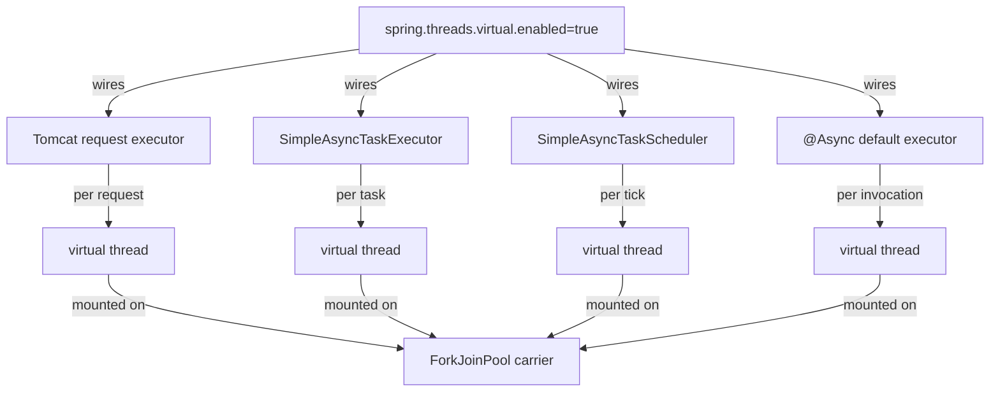
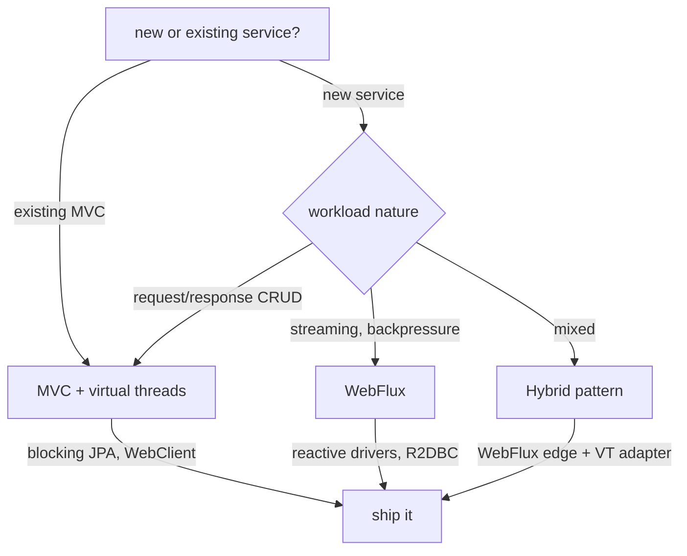
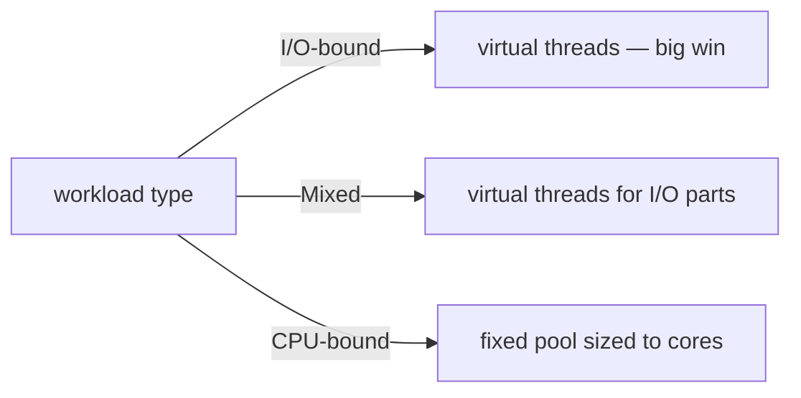
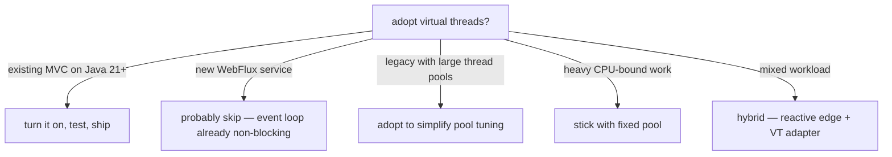

# Virtual Threads and Spring Boot — Integration, @Async, MVC Migration

Date: 2026-04-18
Tags: virtual-threads, spring-boot, loom, async, mvc

## Table of Contents

- [Summary](#summary)
- [Prerequisites](#prerequisites)
- [Enabling Virtual Threads in Spring Boot](#enabling-virtual-threads-in-spring-boot)
- [Tomcat on Virtual Threads](#tomcat-on-virtual-threads)
- [`@Async` with Virtual Threads](#async-with-virtual-threads)
- [`@Scheduled` with Virtual Threads](#scheduled-with-virtual-threads)
- [MVC Migration Guide](#mvc-migration-guide)
- [Virtual Threads vs WebFlux](#virtual-threads-vs-webflux)
- [Blocking JDBC on Virtual Threads](#blocking-jdbc-on-virtual-threads)
- [Hybrid Pattern — Reactive + Virtual Threads](#hybrid-pattern--reactive--virtual-threads)
- [Common Spring-Specific Pinning Scenarios](#common-spring-specific-pinning-scenarios)
- [`@Transactional` + Virtual Threads](#transactional--virtual-threads)
- [Spring Security + Virtual Threads](#spring-security--virtual-threads)
- [Testing Virtual Threads](#testing-virtual-threads)
- [Performance Characteristics](#performance-characteristics)
- [Observability](#observability)
- [Gotchas When Upgrading](#gotchas-when-upgrading)
- [Pre-3.2 Manual Wiring](#pre-32-manual-wiring)
- [Decision Guide — When to Adopt](#decision-guide--when-to-adopt)
- [Related](#related)
- [References](#references)

---

## Summary

Java 21 virtual threads combined with Spring Boot 3.2+ bring practically free
concurrency to servlet-stack applications. A single property —
`spring.threads.virtual.enabled=true` — wires Tomcat request handling,
`@Async` executors, and `@Scheduled` to virtual threads. This document
focuses on the **Spring-integration surface**. For language-level thread-model
details, pinning diagnostics, and carrier-thread internals, see
[`java-fundamentals/concurrency/virtual-threads.md`](java-fundamentals/concurrency/virtual-threads.md).

The practical promise: keep writing straightforward imperative Spring MVC
code, drop the careful thread-pool tuning, and handle an order of magnitude
more concurrent I/O-bound requests per JVM.

---

## Prerequisites

- **Java 21+** — virtual threads are finalized in JEP 444 (Java 21). Java 24
  adds JEP 491, which removes most `synchronized` pinning.
- **Spring Boot 3.2+** — adds the `spring.threads.virtual.enabled` property
  and auto-configuration of virtual-thread executors.
- Familiarity with the language-level concepts: carrier threads, pinning,
  continuations. See
  [`java-fundamentals/concurrency/virtual-threads.md`](java-fundamentals/concurrency/virtual-threads.md).

---

## Enabling Virtual Threads in Spring Boot

One flag flips the whole framework to virtual threads for servlet-stack apps:

```yaml
spring:
  threads:
    virtual:
      enabled: true
```

When this property is `true`, Spring Boot auto-configuration wires virtual
threads into four major subsystems:

- **Servlet container** — Tomcat or Jetty request-handler executor uses
  virtual threads. Each HTTP request runs on its own virtual thread.
- **`SimpleAsyncTaskExecutor` bean** — switches to a virtual-thread factory,
  so the default `applicationTaskExecutor` produces virtual threads.
- **`SimpleAsyncTaskScheduler` bean** — uses virtual threads for
  `@Scheduled` tasks.
- **`@Async` default executor** — any `@Async`-annotated method runs on a
  virtual thread unless overridden.



No code change is required for the typical MVC app — only the property.

---

## Tomcat on Virtual Threads

Under the virtual-thread model, Tomcat's request-handling shifts from a
fixed worker pool to a virtual-thread-per-request design.

- Each inbound HTTP request is handled on its **own virtual thread**, not a
  thread borrowed from a pool.
- Blocking I/O inside the handler (JDBC, RestTemplate, file I/O) parks the
  virtual thread, not the OS thread. The carrier thread moves on.
- **`server.tomcat.threads.max`** loses most of its tuning significance —
  you are no longer capacity-constrained by platform threads. It still bounds
  accepted concurrency, so keep a reasonable ceiling (e.g. 1000–10000) as a
  safety valve against runaway traffic.
- **WebFlux / Netty**: virtual threads do **not** apply. WebFlux uses an
  event-loop model, not thread-per-request. See
  [Virtual Threads vs WebFlux](#virtual-threads-vs-webflux) below.

Practical tuning advice:

- Delete or relax `server.tomcat.threads.max` tuning that was sized around
  expected concurrency.
- Keep `server.tomcat.accept-count` and connection limits tuned to protect
  downstream systems — virtual threads remove a bottleneck, they do not
  magically protect your database.

---

## `@Async` with Virtual Threads

With `spring.threads.virtual.enabled=true`, Spring Boot auto-configures
the default `@Async` executor as a virtual-thread-per-task executor.

```java
@EnableAsync
@Configuration
public class AsyncConfig {
    // With spring.threads.virtual.enabled=true,
    // Boot auto-configures a virtual-thread task executor.
    // No @Bean required for the default case.
}

@Service
public class ReportService {

    @Async
    public CompletableFuture<Report> generate() {
        var data = slowExternalCall();  // blocks virtual thread, not OS thread
        return CompletableFuture.completedFuture(new Report(data));
    }

    private byte[] slowExternalCall() {
        // Any blocking HTTP, JDBC, or file I/O is fine here.
        return restTemplate.getForObject("/slow", byte[].class);
    }
}
```

Key implications:

- No thread-pool sizing anxiety for `@Async`. Creating thousands of
  concurrent `@Async` tasks is cheap.
- Blocking inside an `@Async` method is the expected shape. No need to push
  toward reactive adapters for background work.
- You can still define a dedicated named executor bean when you want a
  distinct concurrency domain (rate-limited queues, bulkhead isolation).

Cross-ref:
[`events-async/async-processing.md`](events-async/async-processing.md).

---

## `@Scheduled` with Virtual Threads

`@Scheduled` tasks also move to virtual threads:

```yaml
spring:
  threads:
    virtual:
      enabled: true
  task:
    scheduling:
      simple:
        concurrency-limit: 100   # cap concurrent scheduled tasks
```

- Each scheduled firing runs on a fresh virtual thread.
- Long-running scheduled jobs no longer compete against a small
  platform-thread scheduler pool.
- `concurrency-limit` provides a useful ceiling so a stuck scheduler does
  not spawn unbounded work.

Cross-ref:
[`events-async/scheduling.md`](events-async/scheduling.md).

---

## MVC Migration Guide

Steps to move an existing Spring MVC app from platform-thread pools to
virtual threads:

1. **Upgrade to Java 21+**. Java 24 is preferred where available for
   pinning fixes.
2. **Upgrade to Spring Boot 3.2+**.
3. **Enable virtual threads** in `application.yml`:
   `spring.threads.virtual.enabled=true`.
4. **Remove or loosen thread-pool sizing**. `server.tomcat.threads.max`,
   custom `ThreadPoolTaskExecutor` sizes, and `@Async` pool sizing are
   mostly unnecessary now. Keep bulkheads only where you need them.
5. **Audit `synchronized` blocks that surround I/O**. On Java 21–23 these
   pin the carrier thread. See pinning guidance in
   [`java-fundamentals/concurrency/virtual-threads.md`](java-fundamentals/concurrency/virtual-threads.md).
6. **Switch `synchronized` to `ReentrantLock`** on Java 21–23 for any
   hotspot that wraps blocking I/O. On Java 24+, JEP 491 resolves most
   pinning — you can often leave `synchronized` alone.
7. **Load-test** and compare throughput, latency tails, and memory.
8. **Review downstream capacity**. Virtual threads let you issue more
   concurrent DB queries — make sure the pool and DB can absorb it.


---

## Virtual Threads vs WebFlux

Both solve the C10K problem, but differently.

| Factor             | MVC + Virtual Threads        | WebFlux                     |
|--------------------|------------------------------|-----------------------------|
| Programming model  | Imperative, blocking code    | Reactive, Mono/Flux         |
| Learning curve     | Flat (existing Java)         | Steep                       |
| Library compat     | Any blocking library         | Reactive libraries needed   |
| Max concurrency    | Millions (virtual threads)   | Millions (event loop)       |
| Backpressure       | No explicit mechanism        | Built-in                    |
| Streaming (SSE/WS) | OK                           | Natural fit                 |
| Debugging          | Normal stack traces          | Fragmented reactive traces  |
| When to pick       | CRUD apps, existing MVC code | Streams, backpressure, async|



Cross-ref:
[`reactive-programming-java.md`](reactive-programming-java.md) and
[`java-fundamentals/concurrency/virtual-threads.md`](java-fundamentals/concurrency/virtual-threads.md).

---

## Blocking JDBC on Virtual Threads

Historically, mixing JPA with WebFlux meant wrapping JPA calls to avoid
blocking the Netty event loop:

```java
// Before — reactive-blocking workaround
Mono.fromCallable(() -> jpaRepository.findById(id))
    .subscribeOn(Schedulers.boundedElastic());
```

With virtual threads in MVC you can stop working around the issue:

```java
// After — just call JPA normally on a virtual thread
@GetMapping("/users/{id}")
public User getUser(@PathVariable Long id) {
    return userRepository.findById(id).orElseThrow();
}
```

The virtual thread parks on the JDBC call. The carrier keeps working.
Throughput matches or beats the reactive workaround for typical CRUD
workloads, and the code is ordinary Spring MVC.

See
[`reactive-blocking-jpa-pattern.md`](reactive-blocking-jpa-pattern.md) for
the workaround that virtual threads largely replace.

---

## Hybrid Pattern — Reactive + Virtual Threads

When you keep WebFlux at the edge (Netty event loop, SSE streaming,
backpressure) but still have blocking dependencies, route blocking calls to
a virtual-thread scheduler:

```java
@Configuration
public class ReactorSchedulers {

    @Bean
    public Scheduler virtualThreadScheduler() {
        return Schedulers.fromExecutor(
            Executors.newVirtualThreadPerTaskExecutor());
    }
}

@Service
public class OrderService {

    private final Scheduler vtScheduler;
    private final OrderRepository repo;

    public Mono<Order> findOrder(Long id) {
        return Mono.fromCallable(() -> repo.findById(id).orElseThrow())
                   .subscribeOn(vtScheduler);
    }
}
```

Benefits:

- Event loop stays thin and non-blocking.
- Blocking escape hatches are cheap — millions of virtual threads are fine.
- Replaces `Schedulers.boundedElastic()` for blocking adapters; removes the
  bounded-pool sizing decision.

---

## Common Spring-Specific Pinning Scenarios

On Java 21–23, pinning happens when a virtual thread is inside a
`synchronized` block and performs a blocking operation. In Spring apps the
usual suspects are:

- **Older JDBC drivers** — many use `synchronized` inside driver code.
  Prefer current versions of HikariCP and drivers that avoid heavy
  `synchronized` around I/O.
- **Third-party HTTP clients** that synchronize around native calls.
- **Jackson internals** — mostly fixed in recent versions.
- **Custom caches or adapters** that wrap I/O in `synchronized`.

Detection:

```
-Djdk.tracePinnedThreads=short
```

Prints a stack trace every time a virtual thread pins. Start there, then
refactor hotspots to `ReentrantLock` or upgrade the offending library.

See
[`java-fundamentals/concurrency/virtual-threads.md`](java-fundamentals/concurrency/virtual-threads.md)
for a detailed pinning workflow.

---

## `@Transactional` + Virtual Threads

`@Transactional` continues to work identically.

- Spring's transaction manager stores `EntityManager` and connection handles
  in **`ThreadLocal`**.
- Virtual threads support `ThreadLocal` normally (unlike reactive chains,
  which hop threads and need `ThreadLocal`-free propagation via
  `ReactiveSecurityContextHolder` and friends).
- No changes needed to transaction configuration, propagation, or isolation
  semantics.

Cross-ref:
[`jpa-transactions.md`](jpa-transactions.md) and
[`jpa-transaction-propagation.md`](jpa-transaction-propagation.md).

---

## Spring Security + Virtual Threads

`SecurityContextHolder` uses `ThreadLocal` under the hood
(`MODE_THREADLOCAL` by default). Because each request runs on its own
virtual thread and stays on it for the duration of the handler, the
security context propagates naturally — no need for the reactive
`ReactiveSecurityContextHolder` or `Context` plumbing.

If you hand work off to `@Async`, the usual
`DelegatingSecurityContextExecutor` pattern still applies. Virtual threads
do not change propagation rules; they just run the same code faster with
cheaper stacks.

---

## Testing Virtual Threads

Simple runtime assertion:

```java
@Test
void runsOnVirtualThread() {
    assertTrue(Thread.currentThread().isVirtual());
}
```

For a Spring Boot integration test, enable the property in a test profile:

```yaml
# src/test/resources/application-test.yml
spring:
  threads:
    virtual:
      enabled: true
```

```java
@SpringBootTest
@ActiveProfiles("test")
class VirtualThreadIntegrationTest {

    @Autowired
    private MyController controller;

    @Test
    void handlerRunsOnVirtualThread() {
        // Trigger the controller and assert Thread.currentThread().isVirtual()
        // inside the handler under test or via a probe.
    }
}
```

For pinning regression tests, run the suite with
`-Djdk.tracePinnedThreads=short` and fail on unexpected pinned stack frames.

---

## Performance Characteristics

Rough shape of what to expect:

- **Throughput (I/O-bound)** — comparable or better than a well-tuned
  platform-thread pool, especially as concurrency rises.
- **Memory per virtual thread** — around 2–5 KB idle, versus ~1 MB stack
  allocation for a platform thread.
- **Context-switch cost** — much lower; virtual threads are scheduled by
  the JVM, not the kernel.
- **CPU-bound workloads** — **no benefit**. You still need a fixed-size
  pool sized to core count. Do not run CPU-bound work on the default
  virtual-thread executor; it will oversubscribe the carriers.



---

## Observability

- **Micrometer** — recent versions expose thread metrics that distinguish
  virtual vs platform threads. Use them to confirm request handlers actually
  run on virtual threads and to spot runaway creation.
- **JFR (Java Flight Recorder)** — ships dedicated events:
  - `jdk.VirtualThreadStart` / `jdk.VirtualThreadEnd`
  - `jdk.VirtualThreadPinned`
  - `jdk.VirtualThreadSubmitFailed`
- **`-Djdk.tracePinnedThreads=short`** for pinning diagnosis.
- **Logs** — platform threads have names like `http-nio-8080-exec-N` in the
  old world. With virtual threads, names look like `VirtualThread[#NNN]/...`.
  Update log patterns and alert rules that parsed old names.

Cross-ref:
[`actuator-deep-dive.md`](actuator-deep-dive.md).

---

## Gotchas When Upgrading

- **`ThreadLocal` still works**, but beware creating millions of virtual
  threads each holding a large `ThreadLocal` map — memory grows.
  Use [`ScopedValue`](java-fundamentals/modern-java-features.md#java-25-lts--what-changed-since-21) (preview in Java 21, delivered in Java 25) for new code where
  appropriate. See the [Java 25 section](java-fundamentals/modern-java-features.md#scoped-values-jep-506) for usage.
- **Do not pool virtual threads.** Always create per-task. Pooling defeats
  the model and reintroduces all the pool-sizing problems you just removed.
- **Do not use `Thread.sleep` as a pacing mechanism** in a hot loop.
  It is cheap on virtual threads, but it still serializes work.
- **Debuggers** — IntelliJ supports virtual threads natively in 2024+.
  Older IDEs or attach-style profilers may miss virtual-thread frames or
  misreport thread state.
- **Metrics dashboards** tuned to `tomcat.threads.busy` may go flat —
  that metric becomes meaningless because Tomcat no longer uses a worker
  pool for request handling.
- **Thread-dump noise** — expect many more threads in dumps. Use
  filtering.

---

## Pre-3.2 Manual Wiring

For apps stuck on pre-3.2 Spring Boot but already on Java 21, you can wire
virtual threads manually:

```java
@Configuration
public class VirtualThreadConfig {

    @Bean
    public AsyncTaskExecutor applicationTaskExecutor() {
        return new TaskExecutorAdapter(
            Executors.newVirtualThreadPerTaskExecutor());
    }

    @Bean
    public TomcatProtocolHandlerCustomizer<?> protocolHandlerVirtualThreadExecutorCustomizer() {
        return protocolHandler ->
            protocolHandler.setExecutor(
                Executors.newVirtualThreadPerTaskExecutor());
    }
}
```

This gets you virtual threads for request handling and for the default
`@Async` executor. `@Scheduled` still needs its own scheduler wired
manually in this configuration.

Prefer upgrading to Boot 3.2+ rather than maintaining this bridge code.

---

## Decision Guide — When to Adopt



Rules of thumb:

- **Existing MVC on Java 21+** — enable the flag, run the test suite, load
  test, ship. This is the highest-leverage change.
- **New WebFlux service** — virtual threads do not help Netty's event
  loop. Use them in the hybrid pattern for blocking adapters only.
- **Legacy code with large thread pools** — adopting virtual threads is
  a good excuse to delete tuning parameters.
- **CPU-bound workloads** — keep fixed pools sized to cores.
- **Mixed workloads** — hybrid pattern: reactive edge, virtual-thread
  adapters for blocking escape hatches.

---

## Related

- [`java-fundamentals/concurrency/virtual-threads.md`](java-fundamentals/concurrency/virtual-threads.md) — language-level model
- [`java-fundamentals/concurrency/concurrency-basics.md`](java-fundamentals/concurrency/concurrency-basics.md)
- [`java-fundamentals/concurrency/structured-concurrency.md`](java-fundamentals/concurrency/structured-concurrency.md)
- [`events-async/async-processing.md`](events-async/async-processing.md)
- [`events-async/scheduling.md`](events-async/scheduling.md)
- [`reactive-blocking-jpa-pattern.md`](reactive-blocking-jpa-pattern.md)
- [`reactive-programming-java.md`](reactive-programming-java.md)
- [`jpa-transactions.md`](jpa-transactions.md)
- [`jpa-transaction-propagation.md`](jpa-transaction-propagation.md)
- [`actuator-deep-dive.md`](actuator-deep-dive.md)

## References

- Spring Boot 3.2 Release Notes — Virtual Threads section
- Spring Boot Reference — Task Execution and Scheduling
- JEP 444 — Virtual Threads (Java 21)
- JEP 491 — Synchronize Virtual Threads without Pinning (Java 24)
- Spring Blog — "Embracing Virtual Threads"
- Oracle — Programmer's Guide to Virtual Threads
