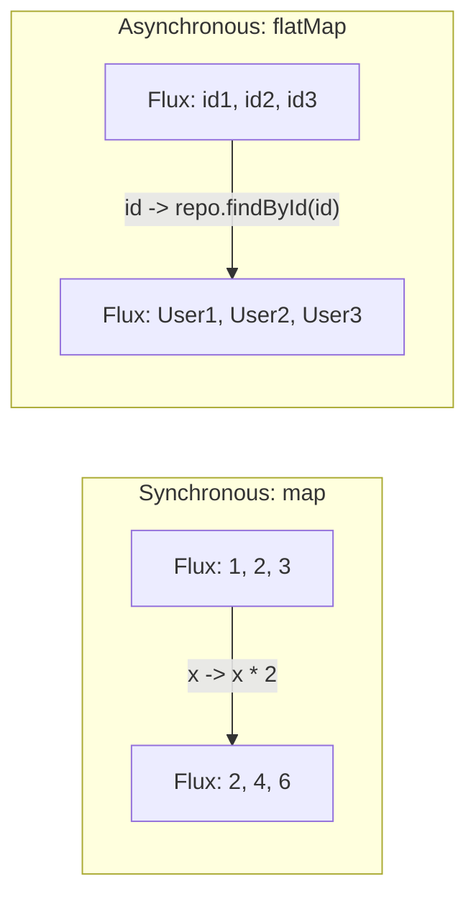
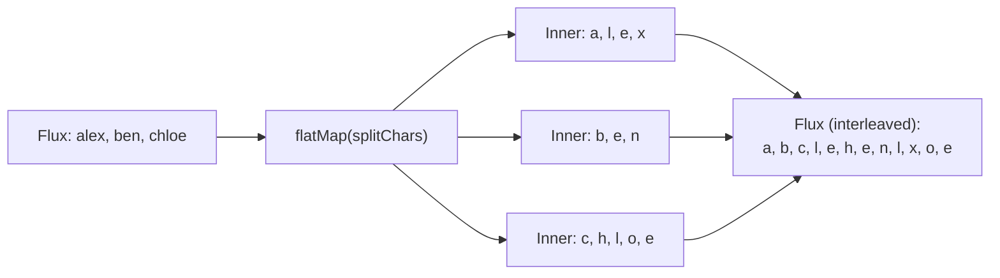
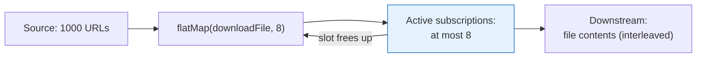
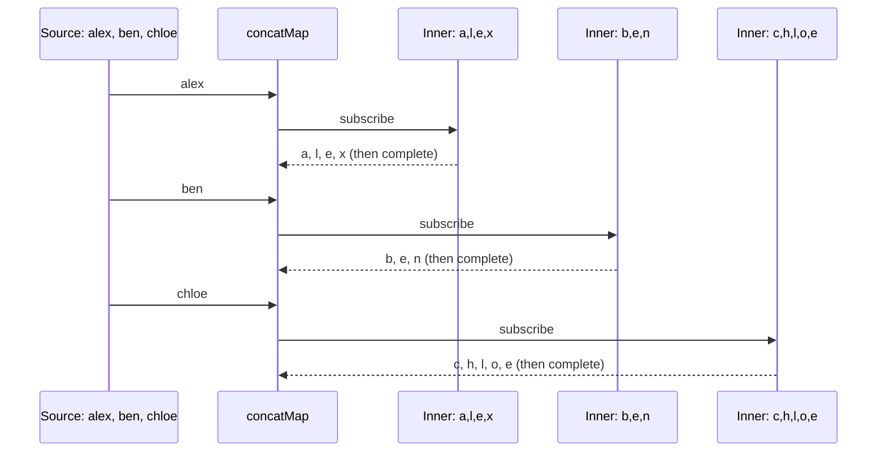
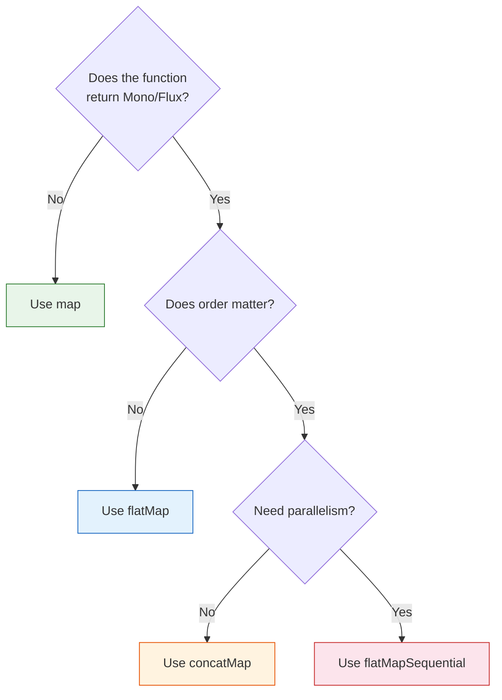

# Synchronous vs Asynchronous Transformation in Project Reactor

**Date:** 2026-04-15 | **Updated:** 2026-04-16
**Tags:** `reactive` `project-reactor` `map` `flatmap` `concatmap` `operators`

## Table of Contents

- [Summary](#summary)
- [The Core Distinction](#the-core-distinction)
- [Synchronous Transformation: map](#synchronous-transformation-map)
  - [How map Works](#how-map-works)
  - [When to Use map](#when-to-use-map)
  - [Common Mistake: map with an Async Function](#common-mistake-map-with-an-async-function)
- [Asynchronous Transformation: flatMap](#asynchronous-transformation-flatmap)
  - [How flatMap Works](#how-flatmap-works)
  - [Concurrency and Ordering](#concurrency-and-ordering)
  - [Controlling Concurrency](#controlling-concurrency)
- [Asynchronous and Ordered: concatMap](#asynchronous-and-ordered-concatmap)
- [Asynchronous, Concurrent, and Ordered: flatMapSequential](#asynchronous-concurrent-and-ordered-flatmapsequential)
- [Side-by-Side Comparison](#side-by-side-comparison)
- [Choosing the Right Operator](#choosing-the-right-operator)
- [Performance and Backpressure](#performance-and-backpressure)
- [Real-World Examples](#real-world-examples)
  - [Example 1: Compose Two Service Calls](#example-1-compose-two-service-calls)
  - [Example 2: Sequential Database Updates](#example-2-sequential-database-updates)
  - [Example 3: Parallel Independent Calls](#example-3-parallel-independent-calls)
- [Related](#related)
- [References](#references)

---

## Summary

In [Project Reactor](https://projectreactor.io/docs/core/release/api/reactor/core/publisher/Flux.html), the difference between synchronous and asynchronous transformation comes down to whether your transformation function returns a value (`T`) or another reactive publisher (`Mono<T>`/`Flux<T>`). Use `map` for synchronous, fast, in-memory transformations; use `flatMap`, `concatMap`, or `flatMapSequential` when the transformation itself is asynchronous (database call, HTTP request, another reactive operation).

---

## The Core Distinction

| | Synchronous | Asynchronous |
|---|---|---|
| Operator | `map` | `flatMap`, `concatMap`, `flatMapSequential` |
| Function signature | `T -> R` | `T -> Publisher<R>` |
| Execution | Inline, immediate | Subscribes to inner Publisher |
| Use case | CPU-bound, in-memory | I/O-bound, returns Mono/Flux |
| Returns nested? | No — `Flux<R>` | No — flattens `Publisher<Publisher<R>>` to `Publisher<R>` |



---

## Synchronous Transformation: map

### How map Works

[`map`](https://projectreactor.io/docs/core/release/api/reactor/core/publisher/Flux.html#map-java.util.function.Function-) applies a function to each element and emits the result. The function is **synchronous and pure** — it returns a value immediately, on the same thread.

```java
Flux.just(1, 2, 3)
    .map(i -> i * 2);     // Flux<Integer>: 2, 4, 6

Flux.just("alex", "ben", "chloe")
    .map(String::toUpperCase);  // Flux<String>: ALEX, BEN, CHLOE

Mono.just("hello")
    .map(s -> s.length());  // Mono<Integer>: 5
```

**Key properties:**
- One-to-one mapping (1 input → 1 output)
- No new thread, no subscription, no waiting
- Order is always preserved
- Cannot return a `Mono` or `Flux` (compile error if you try)

### When to Use map

Use `map` when the transformation:
- Is fast and CPU-bound (string manipulation, arithmetic, type conversion)
- Reads from in-memory data (HashMap lookup, field extraction)
- Doesn't involve any I/O, async operation, or another reactive stream

```java
// Field extraction
userFlux.map(User::getEmail);

// Type conversion
stringFlux.map(Integer::parseInt);

// Domain transformation
movieInfoFlux.map(info -> new MovieDto(info.getName(), info.getYear()));

// Arithmetic
Flux.range(1, 10).map(i -> i * i);
```

### Common Mistake: map with an Async Function

A frequent beginner mistake is using `map` with a function that returns a `Mono` or `Flux`. The result is a nested type that never gets subscribed to:

```java
// BUG — this returns Flux<Mono<User>>, the inner Mono is never subscribed!
Flux<Mono<User>> wrong = userIdFlux
    .map(id -> userRepository.findById(id));  // findById returns Mono<User>

// FIX — use flatMap to subscribe to the inner Mono and flatten
Flux<User> correct = userIdFlux
    .flatMap(id -> userRepository.findById(id));  // Flux<User>
```

The compiler won't catch this — it's perfectly valid Java. The runtime symptom is that nothing happens: the inner Monos are constructed but never subscribed.

---

## Asynchronous Transformation: flatMap

### How flatMap Works

[`flatMap`](https://projectreactor.io/docs/core/release/api/reactor/core/publisher/Flux.html#flatMap-java.util.function.Function-) takes a function that returns a `Publisher<R>` (a `Mono` or `Flux`), subscribes to each inner Publisher, and **flattens** all emissions into a single output stream.

```java
Flux.just("alex", "ben", "chloe")
    .flatMap(name -> Flux.fromArray(name.split("")));
// Possible output (interleaved): a, l, b, e, e, n, c, h, l, o, e
// Order NOT guaranteed because flatMap subscribes eagerly
```



### Concurrency and Ordering

`flatMap` subscribes to inner publishers **eagerly and concurrently**. This means:

- It can process multiple inner publishers at the same time (great for I/O parallelism)
- The output order is **not guaranteed** — fast inner publishers emit before slow ones
- Errors in any inner publisher terminate the entire stream

```java
// Parallel HTTP calls — order doesn't matter
Flux.fromIterable(userIds)
    .flatMap(id -> webClient.get().uri("/users/{id}", id)
        .retrieve().bodyToMono(User.class));
// All HTTP calls fire in parallel, results emitted as they arrive
```

### Controlling Concurrency

`flatMap` has three overloads. Understanding the two numeric parameters is critical for production tuning:

```java
flatMap(Function<T, Publisher<R>> mapper)                           // (1) defaults
flatMap(Function<T, Publisher<R>> mapper, int concurrency)          // (2) cap concurrency
flatMap(Function<T, Publisher<R>> mapper, int concurrency, int prefetch)  // (3) cap both
```

| Parameter | Default | What It Controls |
|-----------|---------|------------------|
| `concurrency` | 256 (`Queues.SMALL_BUFFER_SIZE`) | **How many inner publishers can run at once** |
| `prefetch` | 32 (`Queues.XS_BUFFER_SIZE`) | **How many items to request from each inner publisher upfront** |

#### Concurrency — The "Outer" Parallelism Limit

`concurrency` caps how many inner publishers `flatMap` subscribes to **simultaneously**. With `concurrency = 8`, `flatMap` keeps at most 8 inner publishers in flight; the 9th source item waits until one of the 8 completes.

```java
// Without a cap: up to 256 simultaneous downloads — likely overwhelms the server
Flux.fromIterable(thousandUrls)
    .flatMap(url -> downloadFile(url));

// With concurrency=8: at most 8 downloads in flight at any time
Flux.fromIterable(thousandUrls)
    .flatMap(url -> downloadFile(url), 8);
```



#### Prefetch — The "Inner" Backpressure Request

`prefetch` controls how many items `flatMap` requests **from each inner publisher** when it subscribes. This is the initial `request(n)` sent upstream — the backpressure signal.

For inner publishers that are themselves a `Flux` of many items:

```java
Flux.fromIterable(largeFiles)
    .flatMap(file -> readLines(file), 4, 100);  // 4 files in parallel,
                                                 // 100 lines requested per file at a time
```

- For each of the 4 active `readLines(file)` Flux, `flatMap` requests 100 lines upfront
- As lines are consumed downstream, more are requested (replenishment kicks in at 75% consumption)
- Smaller prefetch = less memory used per inner publisher, but more `request()` round-trips
- Larger prefetch = more memory, but fewer `request()` calls

For `Mono` inner publishers (the most common case), prefetch barely matters — a Mono emits at most 1 item.

#### How They Interact

```java
Flux.fromIterable(thousandUrls)
    .flatMap(url -> downloadFile(url), 8, 32);
//                                     ^  ^
//                                     |  └─ prefetch: request 32 items from each inner Publisher
//                                     └──── concurrency: max 8 inner Publishers subscribed at once
```

Total worst-case in-flight items = `concurrency × prefetch` = `8 × 32` = **256 items buffered at any time**.

For a Flux of Monos (each download returns one file), the effective in-flight count is just `concurrency` (8) since prefetch=32 is unreachable on a Mono.

#### Tuning Guidance

| Scenario | Concurrency | Prefetch | Why |
|----------|-------------|----------|-----|
| **Calling a rate-limited API** | Low (e.g., 4-10) | Default (32) | Stay under the rate limit |
| **Calling a high-throughput internal service** | Default (256) | Default (32) | Maximize parallelism |
| **Streaming large inner Fluxes** | Low (e.g., 2-4) | Low (e.g., 8-16) | Limit memory per inner Flux |
| **Heavy DB writes per item** | Match DB pool size | Default | Don't exceed connection pool |
| **CPU-bound inner work** | = `Runtime.getRuntime().availableProcessors()` | Default | One per core |

#### Why Limit Concurrency?

Without a cap, [flatMap can subscribe to up to 256 inner publishers simultaneously](https://pandepra.medium.com/project-reactors-flatmap-and-backpressure-fba97472d625). For 1,000 URLs that means 256 concurrent HTTP calls firing immediately, which can:

- Overwhelm downstream services (HTTP 429 rate limits, connection refused)
- Exhaust your WebClient connection pool (default 500 connections in Reactor Netty)
- Exhaust JDBC/R2DBC pools (typical default 10-20 connections)
- Cause memory pressure from buffered results awaiting downstream consumption
- Trigger circuit breakers on the downstream service

#### Why Tune Prefetch?

Prefetch tuning matters most when inner publishers are **multi-element Fluxes**:

```java
// BAD — default prefetch=32 means each of 256 active reads buffers up to 32 lines
//       worst case: 256 × 32 = 8,192 lines in memory at once
Flux.fromIterable(thousandLogFiles)
    .flatMap(file -> readLinesFromFile(file));

// BETTER — limit concurrency AND reduce prefetch for large inner Fluxes
Flux.fromIterable(thousandLogFiles)
    .flatMap(file -> readLinesFromFile(file), 4, 8);
//   4 files in parallel × 8 lines buffered each = 32 lines max in flight
```

For Mono inner publishers (one-shot HTTP calls, single DB lookups), keep prefetch at the default — it has no real effect.

---

## Asynchronous and Ordered: concatMap

[`concatMap`](https://projectreactor.io/docs/core/release/api/reactor/core/publisher/Flux.html#concatMap-java.util.function.Function-) is like `flatMap`, but **subscribes to inner publishers one at a time**. It waits for the current inner Publisher to complete before subscribing to the next:

```java
Flux.just("alex", "ben", "chloe")
    .concatMap(name -> Flux.fromArray(name.split(""))
        .delayElements(Duration.ofMillis(100)));
// Always emits in order: a, l, e, x, b, e, n, c, h, l, o, e
```



**Trade-off:** `concatMap` preserves order but loses concurrency. Use it when:
- Order matters more than throughput
- Downstream operations have side effects that must run sequentially
- You're writing to a database in a specific order

---

## Asynchronous, Concurrent, and Ordered: flatMapSequential

[`flatMapSequential`](https://projectreactor.io/docs/core/release/api/reactor/core/publisher/Flux.html#flatMapSequential-java.util.function.Function-) is the best of both worlds — it subscribes to inner publishers **eagerly (concurrent like flatMap)** but emits results in source order:

```java
Flux.just("alex", "ben", "chloe")
    .flatMapSequential(name -> webClient.get()
        .uri("/process/{name}", name)
        .retrieve().bodyToMono(String.class));
// All 3 HTTP calls fire in parallel
// But output is always: result-for-alex, result-for-ben, result-for-chloe
```

This is achieved by buffering out-of-order results internally until the next-in-source-order item is ready.

**Use when:**
- You need parallel I/O for performance
- AND order matters for downstream processing

---

## Side-by-Side Comparison

| Operator | Sync/Async | Concurrent | Ordered | Use Case |
|----------|-----------|------------|---------|----------|
| `map` | Synchronous | N/A | Yes | Pure transformation |
| `flatMap` | Asynchronous | Yes (max 256) | **No** | Parallel I/O, order doesn't matter |
| `concatMap` | Asynchronous | **No** (1 at a time) | Yes | Sequential async, order matters |
| `flatMapSequential` | Asynchronous | Yes | Yes | Parallel I/O + ordered output |



---

## Choosing the Right Operator

Use the [official "Which operator do I need?" guide](https://projectreactor.io/docs/core/release/reference/apdx-operatorChoice.html) as your reference. Quick decision flow:

1. **Does my function return a plain value?** → `map`
2. **Does it return a `Mono` or `Flux`?** → ask:
   - **Don't care about order?** → `flatMap` (fastest)
   - **Need strict order, sequential execution?** → `concatMap`
   - **Need order AND parallelism?** → `flatMapSequential`

---

## Performance and Backpressure

| Operator | Throughput | Memory | Notes |
|----------|-----------|--------|-------|
| `map` | Highest | Lowest | No buffering, no subscription overhead |
| `flatMap` | High (parallel I/O) | Moderate | Default concurrency 256 — can be heavy |
| `concatMap` | Lowest | Lowest | Sequential, one at a time |
| `flatMapSequential` | High | **Highest** | Buffers out-of-order results |

**`flatMapSequential` memory warning:** If element 1 takes 10 seconds and elements 2–100 each take 1 second, the operator buffers elements 2–100 in memory waiting for element 1 to complete. For large or unbounded sources, this can cause memory issues.

---

## Real-World Examples

### Example 1: Compose Two Service Calls

A movies aggregator that fetches movie info, then fetches reviews for that movie:

```java
public Mono<Movie> getMovieById(String movieId) {
    return moviesInfoClient.retrieveMovieInfo(movieId)        // Mono<MovieInfo>
        .flatMap(info -> reviewsClient.retrieveReviews(movieId)
            .collectList()                                     // Flux<Review> -> Mono<List<Review>>
            .map(reviews -> new Movie(info, reviews)));        // map (sync) for the final compose
}
```

- `flatMap` because the function returns `Mono<List<Review>>` — async
- `map` for the final composition because `new Movie(...)` is synchronous

### Example 2: Sequential Database Updates

Update a user, then update an audit log, then send a notification — order matters:

```java
public Mono<Void> updateUserAndAudit(User user) {
    return userRepository.save(user)                                // Mono<User>
        .concatMap(saved -> auditService.recordChange(saved))       // wait for save
        .concatMap(audit -> notificationService.send(audit))        // wait for audit
        .then();
}
```

`concatMap` ensures each step completes before the next starts.

### Example 3: Parallel Independent Calls

Fetch enrichment data from 5 independent services for each user — fire them all in parallel:

```java
public Flux<EnrichedUser> enrichUsers(Flux<User> users) {
    return users.flatMap(user -> 
        Mono.zip(
            profileService.getProfile(user.getId()),
            preferencesService.getPrefs(user.getId()),
            activityService.getActivity(user.getId()))
        .map(tuple -> new EnrichedUser(user, tuple.getT1(), tuple.getT2(), tuple.getT3())),
        16);  // limit to 16 users in flight
}
```

`flatMap` with concurrency 16 lets 16 users be enriched in parallel; `Mono.zip` parallelizes the 3 enrichment calls per user.

---

## Related

- [Reactive Programming in Java with Project Reactor and Spring WebFlux](reactive-programming-java.md) — foundational guide covering all major operators.
- [Advanced Reactive Programming — Beyond the Basics](reactive-advanced-topics.md) — parallel processing with `ParallelFlux`.
- [Reactor Operator Catalog](reactive/operator-catalog.md) — comprehensive operator reference by category.
- [Reactor Schedulers and Threading](reactive/schedulers-and-threading.md) — threading context for `flatMap` concurrency.
- [Wrapping Blocking JPA Calls in a Reactive Chain](reactive-blocking-jpa-pattern.md) — when `flatMap` + `subscribeOn` is the right pattern.

## References

- [Flux Javadoc — projectreactor.io](https://projectreactor.io/docs/core/release/api/reactor/core/publisher/Flux.html) — canonical API reference for all Flux operators with inline marble diagrams
- [Mono Javadoc — projectreactor.io](https://projectreactor.io/docs/core/release/api/reactor/core/publisher/Mono.html) — canonical API reference for Mono operators
- [Which operator do I need? — Reactor Reference](https://projectreactor.io/docs/core/release/reference/apdx-operatorChoice.html) — official decision guide for choosing between map, flatMap, concatMap, and flatMapSequential
- [How to read marble diagrams? — Reactor Reference](https://projectreactor.io/docs/core/release/reference/apdx-howtoReadMarbles.html) — reading the visual diagrams used throughout Reactor docs
- [ReactiveX FlatMap operator](https://reactivex.io/documentation/operators/flatmap.html) — cross-language ReactiveX specification with marble diagrams
- [Notes on Reactive Programming Part II — Spring Blog](https://spring.io/blog/2016/06/13/notes-on-reactive-programming-part-ii-writing-some-code/) — Spring's official blog post on practical operator usage
- [Project Reactor: map() vs flatMap() — Baeldung](https://www.baeldung.com/java-reactor-map-flatmap) — focused tutorial comparing the two operators with examples
- [Project Reactor's flatMap And Backpressure — Medium](https://pandepra.medium.com/project-reactors-flatmap-and-backpressure-fba97472d625) — deep dive on flatMap's maxConcurrency parameter and backpressure interaction

## Changelog

- 2026-04-16: Expanded the "Controlling Concurrency" section with a detailed explanation of the `concurrency` and `prefetch` parameters in `flatMap(mapper, concurrency, prefetch)`, including how they interact, tuning guidance per scenario, and a worked example for multi-element inner Fluxes.
