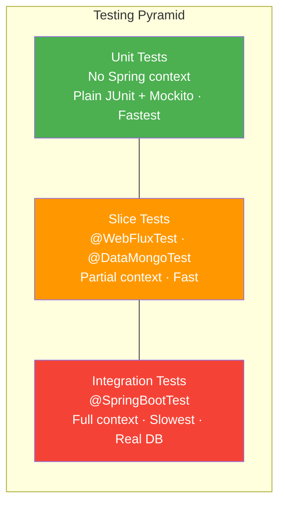
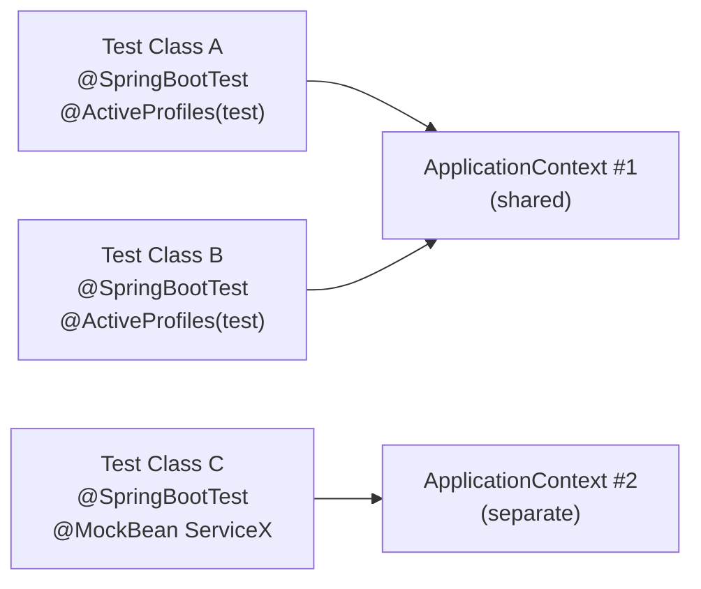

# Spring Boot Testing Fundamentals — @SpringBootTest, Test Slices, and Mocking

**Date:** 2026-04-17 | **Updated:** 2026-04-17
**Tags:** `spring-boot` `testing` `junit5` `mockito` `webfluxtest` `datamongtest` `stepverifier`

## Table of Contents

- [Summary](#summary)
- [The Testing Pyramid in Spring](#the-testing-pyramid-in-spring)
- [@SpringBootTest — The Full Integration Test](#springboottest--the-full-integration-test)
  - [webEnvironment Options](#webenvironment-options)
  - [Project Pattern: Integration Test](#project-pattern-integration-test)
  - [When to Use @SpringBootTest](#when-to-use-springboottest)
- [Test Slices — Targeted Context Loading](#test-slices--targeted-context-loading)
  - [Available Slices](#available-slices)
  - [Project Pattern: @WebFluxTest](#project-pattern-webfluxtest)
  - [Project Pattern: @DataMongoTest](#project-pattern-datamongtest)
  - [Functional Router Testing with @WebFluxTest](#functional-router-testing-with-webfluxtest)
- [@MockBean and @SpyBean — Replacing Beans in the Context](#mockbean-and-spybean--replacing-beans-in-the-context)
  - [@MockBean](#mockbean)
  - [@SpyBean](#spybean)
  - [Spring Boot 3.4+: @MockitoBean and @MockitoSpyBean](#spring-boot-34-mockitobean-and-mockitospybean)
  - [Context Cache Impact](#context-cache-impact)
- [Test Configuration — Customizing the Test Context](#test-configuration--customizing-the-test-context)
  - [@TestConfiguration](#testconfiguration)
  - [@Import](#import)
  - [@TestPropertySource and @ActiveProfiles](#testpropertysource-and-activeprofiles)
  - [application-test.yml](#application-testyml)
- [Mockito Fundamentals in Spring — Quick Reference](#mockito-fundamentals-in-spring--quick-reference)
  - [Stubbing](#stubbing)
  - [Verification](#verification)
  - [Argument Capture](#argument-capture)
  - [Reactive Stubs](#reactive-stubs)
- [Test Data Setup Patterns](#test-data-setup-patterns)
  - [@BeforeEach / @AfterEach](#beforeeach--aftereach)
  - [The Project's Data Setup Pattern](#the-projects-data-setup-pattern)
  - [@DirtiesContext](#dirtiescontext)
  - [@TestMethodOrder and @Order](#testmethodorder-and-order)
- [Assertions — JUnit 5, AssertJ, and Reactive](#assertions--junit-5-assertj-and-reactive)
  - [JUnit 5 Assertions](#junit-5-assertions)
  - [AssertJ Assertions](#assertj-assertions)
  - [StepVerifier for Reactive Assertions](#stepverifier-for-reactive-assertions)
- [Context Caching — How Spring Reuses ApplicationContext](#context-caching--how-spring-reuses-applicationcontext)
- [Related](#related)
- [References](#references)

---

## Summary

Spring Boot testing provides a layered set of annotations that control how much of the application context gets loaded for each test class. At one extreme, `@SpringBootTest` loads the full `ApplicationContext` for true integration tests. At the other, **test slices** like `@WebFluxTest` and `@DataMongoTest` load only the beans relevant to a specific layer, reducing startup time and isolating the component under test. Combined with `@MockBean` for replacing dependencies and `StepVerifier` for reactive assertions, these tools form a comprehensive testing strategy that scales from fast unit tests to full end-to-end integration tests.

---

## The Testing Pyramid in Spring



| Level | Annotation | Context Loaded | Speed | Use Case |
|-------|-----------|---------------|-------|----------|
| Unit | None (plain JUnit 5 + Mockito) | None | Fastest | Service logic, utilities, pure functions |
| Slice | `@WebFluxTest`, `@DataMongoTest`, etc. | Partial | Fast | Single-layer isolation (controller, repository) |
| Integration | `@SpringBootTest` | Full | Slowest | Full request lifecycle, service-to-database flow |

**Guideline:** Write many unit tests, a moderate number of slice tests, and fewer integration tests. Each layer catches different categories of bugs — unit tests catch logic errors, slice tests catch wiring errors within a layer, integration tests catch cross-layer and configuration errors.

---

## @SpringBootTest — The Full Integration Test

`@SpringBootTest` loads the **complete** `ApplicationContext`, including all auto-configurations, beans, and your application code. It is the closest a test can get to running the real application.

### webEnvironment Options

| Option | Behavior | Server Started? |
|--------|----------|----------------|
| `MOCK` (default) | Mock web environment with `MockServerHttpRequest` | No |
| `RANDOM_PORT` | Real embedded server on a random port | Yes |
| `DEFINED_PORT` | Real embedded server on the configured port | Yes |
| `NONE` | No web environment at all | No |

- **`RANDOM_PORT`** is the most common choice for integration tests — it starts a real Netty (or Tomcat) server and avoids port conflicts when tests run in parallel.
- **`MOCK`** is useful when you only need to test through `WebTestClient` without binding a real port.
- **`NONE`** is for testing non-web beans (services, repositories) without the web layer overhead.

### Project Pattern: Integration Test

This is the pattern used throughout this project for controller integration tests:

```java
@SpringBootTest(webEnvironment = SpringBootTest.WebEnvironment.RANDOM_PORT)
@ActiveProfiles("test")
@AutoConfigureWebTestClient
public class MovieInfoControllerIntgTest {

    @Autowired
    private WebTestClient webTestClient;

    @Autowired
    private MovieInfoRepository movieInfoRepository;

    static String MOVIES_INFO_URL = "/v1/movieinfos";

    @BeforeEach
    void setUp() {
        var movieinfos = List.of(
            new MovieInfo(null, "Batman Begins",
                2005, List.of("Christian Bale", "Michael Cane"),
                LocalDate.parse("2005-06-15")),
            new MovieInfo(null, "The Dark Knight",
                2008, List.of("Christian Bale", "HeathLedger"),
                LocalDate.parse("2008-07-18")),
            new MovieInfo("abc", "Dark Knight Rises",
                2012, List.of("Christian Bale", "Tom Hardy"),
                LocalDate.parse("2012-07-20")));

        movieInfoRepository
            .deleteAll()
            .thenMany(movieInfoRepository.saveAll(movieinfos))
            .blockLast();
    }
}
```

Key observations:
- **`@AutoConfigureWebTestClient`** provides a pre-configured `WebTestClient` bound to the random port.
- **`@ActiveProfiles("test")`** loads `application-test.yml` with a test-specific MongoDB connection.
- The `@BeforeEach` block cleans and re-seeds data before every test, ensuring test isolation.
- **`blockLast()`** forces the reactive pipeline to complete synchronously — acceptable only in test setup code.

### When to Use @SpringBootTest

- Testing the full HTTP request lifecycle (controller -> service -> repository -> database)
- Verifying auto-configuration wires everything correctly
- Testing streaming endpoints (SSE, WebSocket) with a real server
- Smoke-testing the complete application startup

---

## Test Slices — Targeted Context Loading

Test slices load **only the beans relevant to a specific layer**. Spring Boot auto-configures the minimum context needed, making these tests significantly faster than full `@SpringBootTest`.

### Available Slices

| Slice Annotation | What It Loads | Use Case |
|-----------------|--------------|----------|
| `@WebMvcTest` | `@Controller`, `@ControllerAdvice`, MVC filters, converters | Spring MVC controller unit tests |
| `@WebFluxTest` | `@Controller`, `@ControllerAdvice`, WebFlux infrastructure | WebFlux controller unit tests |
| `@DataJpaTest` | JPA repositories, `EntityManager`, `DataSource`, Flyway/Liquibase | Repository tests (JPA) |
| `@DataMongoTest` | MongoDB repositories, `MongoTemplate`, `ReactiveMongoTemplate` | Repository tests (MongoDB) |
| `@JsonTest` | Jackson `ObjectMapper`, `JacksonTester`, `JsonbTester` | Serialization and deserialization |
| `@RestClientTest` | `RestTemplate`, `MockRestServiceServer` | REST client tests |
| `@DataR2dbcTest` | R2DBC repositories, `DatabaseClient` | Reactive SQL repository tests |
| `@JdbcTest` | `JdbcTemplate`, `DataSource` (no JPA) | Plain JDBC repository tests |

**Important:** Slice tests do **not** load `@Service`, `@Repository` (for web slices), or `@Component` beans automatically. You must provide them via `@MockBean` or `@Import`.

### Project Pattern: @WebFluxTest

The project uses `@WebFluxTest` to test controllers in isolation, replacing service dependencies with mocks:

```java
@WebFluxTest(controllers = MoviesInfoController.class)
@AutoConfigureWebTestClient
public class MovieInfoControllerUnitTest {

    @MockBean
    private MoviesInfoService moviesInfoServiceMock;

    @Autowired
    private WebTestClient webTestClient;

    @Test
    void getAllMovieInfos() {
        var movieInfos = List.of(
            new MovieInfo(null, "Batman Begins",
                2005, List.of("Christian Bale", "Michael Cane"),
                LocalDate.parse("2005-06-15")),
            new MovieInfo(null, "The Dark Knight",
                2008, List.of("Christian Bale", "HeathLedger"),
                LocalDate.parse("2008-07-18")),
            new MovieInfo("abc", "Dark Knight Rises",
                2012, List.of("Christian Bale", "Tom Hardy"),
                LocalDate.parse("2012-07-20")));

        when(moviesInfoServiceMock.getAllMovieInfos())
            .thenReturn(Flux.fromIterable(movieInfos));

        webTestClient
            .get()
            .uri("/v1/movieinfos")
            .exchange()
            .expectStatus().is2xxSuccessful()
            .expectBodyList(MovieInfo.class)
            .hasSize(3);
    }
}
```

The `controllers` parameter limits the scan to a single controller. Without it, `@WebFluxTest` loads all `@Controller` classes — which can pull in unexpected dependencies.

### Project Pattern: @DataMongoTest

The project uses `@DataMongoTest` to test the repository layer with a real (or embedded) MongoDB instance:

```java
@DataMongoTest
@ActiveProfiles("test")
public class MoviesInfoRepositoryIntgTest {

    @Autowired
    MovieInfoRepository movieInfoRepository;

    @BeforeEach
    void setUp() {
        var movieinfos = List.of(
            new MovieInfo(null, "Batman Begins",
                2005, List.of("Christian Bale", "Michael Cane"),
                LocalDate.parse("2005-06-15")),
            new MovieInfo(null, "The Dark Knight",
                2008, List.of("Christian Bale", "HeathLedger"),
                LocalDate.parse("2008-07-18")),
            new MovieInfo("abc", "Dark Knight Rises",
                2012, List.of("Christian Bale", "Tom Hardy"),
                LocalDate.parse("2012-07-20")));

        movieInfoRepository.saveAll(movieinfos).blockLast();
    }

    @AfterEach
    void tearDown() {
        movieInfoRepository.deleteAll().block();
    }

    @Test
    void findAll() {
        var moviesFlux = movieInfoRepository.findAll().log();

        StepVerifier.create(moviesFlux)
            .expectNextCount(3)
            .verifyComplete();
    }
}
```

`@DataMongoTest` loads only Mongo-related beans — no controllers, no services. The `@ActiveProfiles("test")` ensures a test database is used.

### Functional Router Testing with @WebFluxTest

When using the functional routing style (`RouterFunction` + `HandlerFunction`), `@WebFluxTest` does not auto-detect routers. You must explicitly provide the components via `@ContextConfiguration`:

```java
@WebFluxTest
@ContextConfiguration(classes = {
    ReviewRouter.class,
    ReviewsHandler.class,
    GlobalErrorHandler.class
})
@AutoConfigureWebTestClient
public class ReviewsUnitTest {

    @MockBean
    private ReviewReactiveRepository reviewReactiveRepository;

    @MockBean
    private ReviewValidator reviewValidator;

    @Autowired
    private WebTestClient webTestClient;
}
```

This is necessary because the functional style bypasses `@Controller` detection entirely.

---

## @MockBean and @SpyBean — Replacing Beans in the Context

### @MockBean

`@MockBean` creates a Mockito mock and **replaces** the bean of that type in the Spring `ApplicationContext`. If no bean of that type exists, it adds one.

```java
@MockBean
private MoviesInfoService moviesInfoServiceMock;

// In the test method:
when(moviesInfoServiceMock.getAllMovieInfos())
    .thenReturn(Flux.fromIterable(movieInfoList));

when(moviesInfoServiceMock.addMovieInfo(isA(MovieInfo.class)))
    .thenReturn(Mono.just(new MovieInfo("mockId", "Batman Begins",
        2005, List.of("Christian Bale", "Michael Cane"),
        LocalDate.parse("2005-06-15"))));
```

Every method on a `@MockBean` returns `null` (or an empty reactive type) by default. You define behavior with `when(...).thenReturn(...)`.

### @SpyBean

`@SpyBean` wraps the **real bean** with a Mockito spy. The real implementation runs unless you explicitly override a method:

```java
@SpyBean
private MoviesInfoService moviesInfoServiceSpy;

// Override one method, let others run for real:
when(moviesInfoServiceSpy.getMovieInfoById("abc"))
    .thenReturn(Mono.just(customMovieInfo));

// Verify a call happened:
verify(moviesInfoServiceSpy).getMovieInfoById("abc");
```

Use `@SpyBean` when you want the real behavior but need to verify interactions or override a single method.

### Spring Boot 3.4+: @MockitoBean and @MockitoSpyBean

Starting with Spring Boot 3.4, new annotations `@MockitoBean` and `@MockitoSpyBean` are available as direct replacements:

```java
// Before (still works but deprecated path)
@MockBean
private MoviesInfoService moviesInfoServiceMock;

// After (Spring Boot 3.4+)
@MockitoBean
private MoviesInfoService moviesInfoServiceMock;
```

The behavior is identical. The new annotations live in `org.springframework.test.context.bean.override.mockito` and are part of the Spring Framework (not Spring Boot), making them available in non-Boot test contexts.

### Context Cache Impact

**Critical:** Every unique combination of `@MockBean` fields produces a separate cached `ApplicationContext`. If test class A mocks `ServiceX` and test class B mocks `ServiceY`, Spring cannot share the context between them. This can dramatically increase total test suite time.

**Strategy:** Group tests that mock the same set of beans together. Avoid adding `@MockBean` to integration test classes that should share a context.

---

## Test Configuration — Customizing the Test Context

### @TestConfiguration

Defines additional beans that exist only during testing. Does not replace the main configuration — it **adds** to it:

```java
@TestConfiguration
static class TestConfig {

    @Bean
    public Clock testClock() {
        return Clock.fixed(
            Instant.parse("2026-01-01T00:00:00Z"),
            ZoneId.of("UTC")
        );
    }
}
```

Place `@TestConfiguration` as a static inner class of the test, or as a standalone class imported with `@Import`.

### @Import

Explicitly imports configuration classes into a slice test. Necessary when the slice does not auto-detect your configuration:

```java
@WebFluxTest(controllers = MoviesInfoController.class)
@Import(SecurityConfig.class)
class SecuredControllerTest { ... }
```

### @TestPropertySource and @ActiveProfiles

**`@TestPropertySource`** overrides specific properties for a single test class:

```java
@TestPropertySource(properties = {
    "spring.data.mongodb.database=test-db",
    "app.feature.flag=true"
})
class FeatureToggleTest { ... }
```

**`@ActiveProfiles("test")`** activates the `test` profile, which loads `application-test.yml` or `application-test.properties`. This project uses `@ActiveProfiles("test")` on virtually every test class.

### application-test.yml

The test profile typically overrides database connection details and disables unnecessary features:

```yaml
# application-test.yml
spring:
  data:
    mongodb:
      host: localhost
      port: 27017
      database: movies-info-test
```

Place this file in `src/test/resources/`. Spring Boot picks it up automatically when the `test` profile is active.

---

## Mockito Fundamentals in Spring — Quick Reference

### Stubbing

```java
// Return a value
when(service.findById("abc")).thenReturn(Mono.just(movieInfo));

// Return different values on successive calls
when(service.findAll())
    .thenReturn(Flux.just(movie1))
    .thenReturn(Flux.just(movie1, movie2));

// Throw an exception
when(service.findById("bad"))
    .thenThrow(new RuntimeException("DB error"));

// Match any argument
when(service.addMovieInfo(isA(MovieInfo.class)))
    .thenReturn(Mono.just(savedMovieInfo));

// Void methods (use doXxx form)
doNothing().when(validator).validate(any(), any());
doCallRealMethod().when(validator).validate(any(), any());
doThrow(new RuntimeException("fail")).when(service).deleteById("abc");
```

### Verification

```java
// Verify a method was called
verify(service).findById("abc");

// Verify call count
verify(service, times(1)).findById("abc");
verify(service, never()).deleteById(any());
verify(service, atLeastOnce()).findAll();
verify(service, atMost(3)).findAll();

// Verify no more interactions
verifyNoMoreInteractions(service);
```

### Argument Capture

```java
ArgumentCaptor<MovieInfo> captor = ArgumentCaptor.forClass(MovieInfo.class);
verify(service).addMovieInfo(captor.capture());

MovieInfo captured = captor.getValue();
assertEquals("Batman Begins", captured.getName());
assertEquals(2005, captured.getYear());
```

### Reactive Stubs

Reactive methods return `Mono` or `Flux`, so stubs must return reactive types:

```java
// Mono stubs
when(service.findById("abc"))
    .thenReturn(Mono.just(movieInfo));
when(service.findById("missing"))
    .thenReturn(Mono.empty());
when(service.findById("error"))
    .thenReturn(Mono.error(new RuntimeException("DB down")));

// Flux stubs
when(service.findAll())
    .thenReturn(Flux.fromIterable(movieInfoList));
when(service.findAll())
    .thenReturn(Flux.empty());
```

Never return `null` from a reactive stub — always return `Mono.empty()` or `Flux.empty()` for absent values.

---

## Test Data Setup Patterns

### @BeforeEach / @AfterEach

JUnit 5 lifecycle callbacks run before and after each test method:

```java
@BeforeEach
void setUp() {
    // Seed data, reset mocks, prepare state
}

@AfterEach
void tearDown() {
    // Clean up resources, delete test data
}
```

There are also `@BeforeAll` / `@AfterAll` for class-level setup (methods must be `static` or the class must use `@TestInstance(PER_CLASS)`).

### The Project's Data Setup Pattern

This project follows a consistent pattern for reactive data setup:

```java
@BeforeEach
void setUp() {
    var movieinfos = List.of(/* test data */);

    // Pattern 1: delete-then-save chain (integration tests)
    movieInfoRepository
        .deleteAll()
        .thenMany(movieInfoRepository.saveAll(movieinfos))
        .blockLast();
}

@AfterEach
void tearDown() {
    // Pattern 2: cleanup in @AfterEach (repository tests)
    movieInfoRepository.deleteAll().block();
}
```

- **`blockLast()`** subscribes to the entire chain and blocks until the last element completes. Used when the chain produces multiple items.
- **`block()`** subscribes and blocks until the single `Mono` completes. Used for `deleteAll()` which returns `Mono<Void>`.
- Both are acceptable in test code but should never appear in production reactive code.

### @DirtiesContext

Forces Spring to destroy and recreate the `ApplicationContext` after the test class (or method) runs:

```java
@DirtiesContext
class StatefulIntegrationTest { ... }

// Or at method level:
@Test
@DirtiesContext
void testThatCorruptsContext() { ... }
```

**Use sparingly.** `@DirtiesContext` defeats context caching and slows the test suite. Prefer explicit data cleanup in `@BeforeEach` / `@AfterEach` instead. Reserve `@DirtiesContext` for cases where a test genuinely corrupts shared state (e.g., modifying a singleton bean's internal state).

### @TestMethodOrder and @Order

By default, JUnit 5 does not guarantee test execution order. When order matters (rare — usually a sign of test coupling), you can enforce it:

```java
@TestMethodOrder(MethodOrderer.OrderAnnotation.class)
class OrderedTest {

    @Test
    @Order(1)
    void createResource() { ... }

    @Test
    @Order(2)
    void readResource() { ... }

    @Test
    @Order(3)
    void deleteResource() { ... }
}
```

Prefer independent tests. Use `@TestMethodOrder` only when testing a stateful sequence where each step depends on the previous one.

---

## Assertions — JUnit 5, AssertJ, and Reactive

### JUnit 5 Assertions

```java
import static org.junit.jupiter.api.Assertions.*;

assertEquals("Dark Knight Rises", movieInfo.getName());
assertNotNull(movieInfo.getMovieInfoId());
assertTrue(movieInfo.getYear() > 2000);
assertThrows(RuntimeException.class, () -> service.findById("bad"));
```

### AssertJ Assertions

AssertJ provides a fluent API with richer failure messages:

```java
import static org.assertj.core.api.Assertions.*;

assertThat(movieInfo.getName()).isEqualTo("Dark Knight Rises");
assertThat(movieInfo.getMovieInfoId()).isNotNull();
assertThat(movieInfoList).hasSize(3);
assertThat(movieInfoList)
    .extracting(MovieInfo::getName)
    .containsExactlyInAnyOrder("Batman Begins", "The Dark Knight", "Dark Knight Rises");

assertThatThrownBy(() -> service.findById("bad"))
    .isInstanceOf(MovieInfoNotFoundException.class)
    .hasMessageContaining("bad");
```

### StepVerifier for Reactive Assertions

`StepVerifier` from Project Reactor's `reactor-test` module is the primary tool for testing `Mono` and `Flux`:

```java
import reactor.test.StepVerifier;

// Verify element count
StepVerifier.create(movieInfoRepository.findAll())
    .expectNextCount(3)
    .verifyComplete();

// Verify specific elements
StepVerifier.create(movieInfoRepository.findById("abc"))
    .assertNext(movieInfo -> {
        assertEquals("Dark Knight Rises", movieInfo.getName());
    })
    .verifyComplete();

// Verify error
StepVerifier.create(service.findById("error"))
    .expectErrorMatches(throwable ->
        throwable instanceof RuntimeException
        && throwable.getMessage().equals("DB down"))
    .verify();

// Verify empty
StepVerifier.create(service.findById("missing"))
    .verifyComplete();  // completes with zero elements

// Verify multiple elements in order
StepVerifier.create(service.findAll())
    .expectNext(movie1)
    .expectNext(movie2)
    .expectNext(movie3)
    .verifyComplete();
```

**Important:** Always call `.verifyComplete()` or `.verify()` at the end. Without it, the `StepVerifier` never subscribes and the test passes vacuously.

---

## Context Caching — How Spring Reuses ApplicationContext

Spring's test framework caches `ApplicationContext` instances between test classes. Two test classes that use the **same configuration** share the same context, which avoids the cost of restarting the application for every test class.



The cache key is determined by:
- The set of configuration classes / component scan packages
- Active profiles (`@ActiveProfiles`)
- Property overrides (`@TestPropertySource`)
- Mock beans (`@MockBean`, `@SpyBean`)
- `@DirtiesContext` usage

**What invalidates the cache:**

| Cause | Effect |
|-------|--------|
| Different `@MockBean` set | New context created |
| Different `@ActiveProfiles` | New context created |
| `@DirtiesContext` on a test class | Context destroyed after the class |
| Different `@TestPropertySource` | New context created |

**Optimization strategy:**
1. Keep the same `@MockBean` set across test classes that test the same layer
2. Avoid `@DirtiesContext` unless absolutely necessary
3. Use `@ActiveProfiles("test")` consistently
4. Group integration tests and slice tests separately — they cannot share a context anyway

---

## Related

- [Web Layer Testing](web-layer-testing.md) — WebTestClient patterns, response validation, streaming test techniques
- [Testcontainers](testcontainers.md) — running real MongoDB, PostgreSQL, and other services in Docker for integration tests
- [Spring Fundamentals](../spring-fundamentals.md) — IoC, DI, ApplicationContext, and the bean lifecycle that underpins all test annotations

## References

- [Testing — Spring Boot Reference](https://docs.spring.io/spring-boot/reference/testing/index.html) — top-level testing chapter covering all annotations and slices
- [Spring Boot Test Auto-configuration Annotations](https://docs.spring.io/spring-boot/reference/testing/spring-boot-applications.html#testing.spring-boot-applications.autoconfigured-tests) — complete list of test slice annotations
- [@SpringBootTest — Spring Boot Reference](https://docs.spring.io/spring-boot/reference/testing/spring-boot-applications.html) — webEnvironment options, context loading, WebTestClient
- [JUnit 5 User Guide](https://junit.org/junit5/docs/current/user-guide/) — lifecycle callbacks, parameterized tests, extensions
- [Mockito Reference](https://javadoc.io/doc/org.mockito/mockito-core/latest/org/mockito/Mockito.html) — stubbing, verification, argument captors
- [StepVerifier — Reactor Test](https://projectreactor.io/docs/core/release/reference/#testing) — reactive stream assertions with StepVerifier
- [AssertJ — Core Assertions](https://assertj.github.io/doc/) — fluent assertion library for Java
- [Context Caching — Spring Testing](https://docs.spring.io/spring-framework/reference/testing/testcontext-framework/ctx-management/caching.html) — how Spring caches and reuses ApplicationContext in tests
