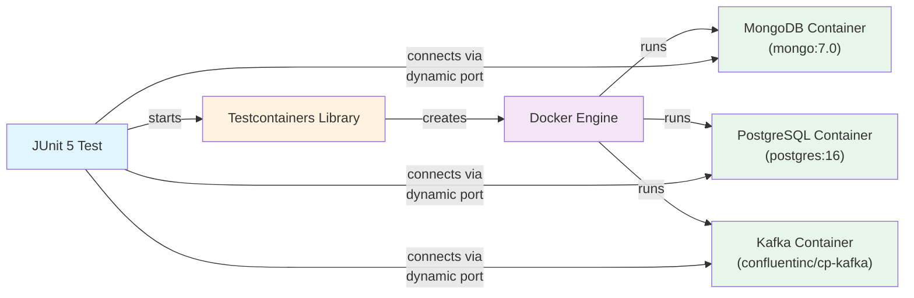
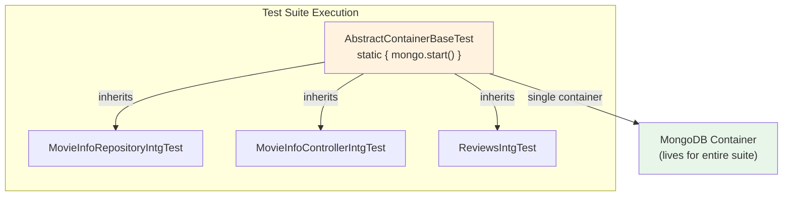

# Testcontainers — Integration Testing with Real Infrastructure

**Date:** 2026-04-17 | **Updated:** 2026-04-17
**Tags:** `testcontainers` `integration-testing` `docker` `mongodb` `spring-boot` `junit5` `reactive`

## Table of Contents

- [Summary](#summary)
- [Why Testcontainers](#why-testcontainers)
  - [The H2 / Embedded Database Problem](#the-h2--embedded-database-problem)
  - [How Testcontainers Solves This](#how-testcontainers-solves-this)
- [Setup](#setup)
  - [Gradle Dependencies](#gradle-dependencies)
  - [Maven Dependencies](#maven-dependencies)
  - [Docker Requirement](#docker-requirement)
- [Basic Usage with JUnit 5](#basic-usage-with-junit-5)
  - [@Testcontainers + @Container](#testcontainers--container)
  - [@DynamicPropertySource](#dynamicpropertysource)
- [@ServiceConnection (Spring Boot 3.1+)](#serviceconnection-spring-boot-31)
  - [Supported Containers](#supported-containers)
- [Singleton Container Pattern](#singleton-container-pattern)
- [Common Containers](#common-containers)
- [Reactive Repository Tests](#reactive-repository-tests)
  - [Project Pattern: @DataMongoTest with Testcontainers](#project-pattern-datamongtest-with-testcontainers)
  - [StepVerifier Assertions](#stepverifier-assertions)
- [GenericContainer — Any Docker Image](#genericcontainer--any-docker-image)
  - [Exposing Ports](#exposing-ports)
  - [Wait Strategies](#wait-strategies)
- [Performance Tips](#performance-tips)
- [Testcontainers in CI](#testcontainers-in-ci)
  - [GitHub Actions](#github-actions)
  - [Testcontainers Cloud](#testcontainers-cloud)
- [Related](#related)
- [References](#references)

---

## Summary

Testcontainers is a Java library that launches real Docker containers during integration tests.
Instead of relying on in-memory substitutes like embedded MongoDB (`de.flapdoodle.embed.mongo`)
or H2, tests run against the same database engine used in production. Containers start before
the test suite, provide randomized connection details via dynamic properties, and are destroyed
after tests complete. The result is higher-fidelity integration tests that catch dialect
mismatches, missing indexes, and driver-level bugs that in-memory alternatives silently hide.

---

## Why Testcontainers

### The H2 / Embedded Database Problem

| Problem | Example |
|---------|---------|
| SQL dialect differences | H2 does not support `JSONB`, `ILIKE`, or Postgres-specific window functions |
| Missing features | Embedded Mongo lacks full aggregation pipeline support |
| False-green tests | Tests pass against H2 but fail against real Postgres in staging |
| Version skew | Embedded libraries lag behind production database versions |
| Driver differences | Connection pool behavior, timeout semantics, and error codes differ |

This project currently uses `de.flapdoodle.embed.mongo` for MongoDB integration tests. While
convenient for quick feedback, flapdoodle downloads a platform-specific MongoDB binary and runs
it outside Docker. Testcontainers replaces this with an actual MongoDB instance inside a
container, matching the exact version and behavior of production.

### How Testcontainers Solves This



The test only sees a connection URL. Testcontainers handles image pulling, container lifecycle,
port mapping, and readiness checks behind the scenes.

---

## Setup

### Gradle Dependencies

```groovy
// build.gradle
dependencies {
    // Testcontainers BOM — keeps all module versions aligned
    testImplementation platform('org.testcontainers:testcontainers-bom:1.20.4')

    // Core + JUnit 5 integration
    testImplementation 'org.testcontainers:testcontainers'
    testImplementation 'org.testcontainers:junit-jupiter'

    // Database-specific module (pick what you need)
    testImplementation 'org.testcontainers:mongodb'
    // testImplementation 'org.testcontainers:postgresql'
    // testImplementation 'org.testcontainers:mysql'
    // testImplementation 'org.testcontainers:kafka'

    // Spring Boot 3.1+ — optional service connection support
    // testImplementation 'org.springframework.boot:spring-boot-testcontainers'
}
```

For this project, replacing flapdoodle with Testcontainers means swapping one test dependency:

```groovy
// BEFORE
testImplementation 'de.flapdoodle.embed:de.flapdoodle.embed.mongo'

// AFTER
testImplementation platform('org.testcontainers:testcontainers-bom:1.20.4')
testImplementation 'org.testcontainers:testcontainers'
testImplementation 'org.testcontainers:junit-jupiter'
testImplementation 'org.testcontainers:mongodb'
```

### Maven Dependencies

```xml
<dependencyManagement>
    <dependencies>
        <dependency>
            <groupId>org.testcontainers</groupId>
            <artifactId>testcontainers-bom</artifactId>
            <version>1.20.4</version>
            <type>pom</type>
            <scope>import</scope>
        </dependency>
    </dependencies>
</dependencyManagement>

<dependencies>
    <dependency>
        <groupId>org.testcontainers</groupId>
        <artifactId>testcontainers</artifactId>
        <scope>test</scope>
    </dependency>
    <dependency>
        <groupId>org.testcontainers</groupId>
        <artifactId>junit-jupiter</artifactId>
        <scope>test</scope>
    </dependency>
    <dependency>
        <groupId>org.testcontainers</groupId>
        <artifactId>mongodb</artifactId>
        <scope>test</scope>
    </dependency>
</dependencies>
```

### Docker Requirement

Testcontainers requires a running Docker daemon. Verify with:

```bash
docker info
```

If Docker Desktop is running, no further configuration is needed. For rootless Docker or
Podman, set `DOCKER_HOST` or configure `~/.testcontainers.properties` accordingly.

---

## Basic Usage with JUnit 5

### @Testcontainers + @Container

`@Testcontainers` activates the JUnit 5 extension that manages container lifecycle.
`@Container` marks fields that the extension should start and stop.

```java
import org.testcontainers.containers.MongoDBContainer;
import org.testcontainers.junit.jupiter.Container;
import org.testcontainers.junit.jupiter.Testcontainers;
import org.springframework.boot.test.autoconfigure.data.mongo.DataMongoTest;
import org.springframework.test.context.DynamicPropertyRegistry;
import org.springframework.test.context.DynamicPropertySource;

@Testcontainers
@DataMongoTest
class MovieInfoRepositoryTest {

    @Container
    static MongoDBContainer mongo = new MongoDBContainer("mongo:7.0");

    @DynamicPropertySource
    static void setProperties(DynamicPropertyRegistry registry) {
        registry.add("spring.data.mongodb.uri", mongo::getReplicaSetUrl);
    }

    // @Autowired repository, @BeforeEach data setup, @Test methods...
}
```

**Lifecycle:** the `static` field means one container shared across all `@Test` methods in this
class. A non-static field would create a fresh container per test method (slow, rarely needed).

### @DynamicPropertySource

`@DynamicPropertySource` injects container connection details into Spring's `Environment`
before the application context loads. This replaces hardcoded `spring.data.mongodb.uri` values
in `application-test.yml`.

```java
@DynamicPropertySource
static void setProperties(DynamicPropertyRegistry registry) {
    // MongoDB
    registry.add("spring.data.mongodb.uri", mongo::getReplicaSetUrl);

    // PostgreSQL (if using JDBC)
    registry.add("spring.datasource.url", postgres::getJdbcUrl);
    registry.add("spring.datasource.username", postgres::getUsername);
    registry.add("spring.datasource.password", postgres::getPassword);

    // R2DBC (reactive SQL)
    registry.add("spring.r2dbc.url", () ->
        "r2dbc:postgresql://" + postgres.getHost() + ":" + postgres.getFirstMappedPort()
            + "/" + postgres.getDatabaseName());
}
```

Each `registry.add()` call takes a property name and a `Supplier`. The supplier is evaluated
lazily, after the container is running and its port is known.

---

## @ServiceConnection (Spring Boot 3.1+)

Spring Boot 3.1 introduced `@ServiceConnection`, which eliminates `@DynamicPropertySource`
entirely. Spring Boot inspects the container type and auto-configures the matching connection
properties.

```java
import org.springframework.boot.testcontainers.service.connection.ServiceConnection;

@Testcontainers
@DataMongoTest
class MovieInfoRepositoryTest {

    @Container
    @ServiceConnection
    static MongoDBContainer mongo = new MongoDBContainer("mongo:7.0");

    // No @DynamicPropertySource needed.
    // Spring Boot detects MongoDBContainer and sets spring.data.mongodb.uri automatically.
}
```

### Supported Containers

| Container Class | Auto-configured Properties |
|----------------|---------------------------|
| `MongoDBContainer` | `spring.data.mongodb.uri` |
| `PostgreSQLContainer` | `spring.datasource.*`, `spring.r2dbc.*` |
| `MySQLContainer` | `spring.datasource.*` |
| `MariaDBContainer` | `spring.datasource.*` |
| `RedisContainer` | `spring.data.redis.*` |
| `KafkaContainer` | `spring.kafka.bootstrap-servers` |
| `RabbitMQContainer` | `spring.rabbitmq.*` |
| `ElasticsearchContainer` | `spring.elasticsearch.*` |

> **Note:** This project uses Spring Boot 2.7.x. `@ServiceConnection` requires upgrading to
> 3.1+. Until then, use `@DynamicPropertySource` as shown in the basic usage section.

---

## Singleton Container Pattern

Starting a Docker container per test class adds up. The singleton pattern starts one container
for the entire test suite by using a `static` initializer block in a shared base class.

```java
import org.springframework.test.context.DynamicPropertyRegistry;
import org.springframework.test.context.DynamicPropertySource;
import org.testcontainers.containers.MongoDBContainer;

public abstract class AbstractContainerBaseTest {

    static final MongoDBContainer mongo;

    static {
        mongo = new MongoDBContainer("mongo:7.0");
        mongo.start();
    }

    @DynamicPropertySource
    static void setProperties(DynamicPropertyRegistry registry) {
        registry.add("spring.data.mongodb.uri", mongo::getReplicaSetUrl);
    }
}
```

All integration test classes extend this base:

```java
@DataMongoTest
class MovieInfoRepositoryIntgTest extends AbstractContainerBaseTest {

    @Autowired
    MovieInfoRepository movieInfoRepository;

    @BeforeEach
    void setUp() {
        var movieInfos = List.of(
            new MovieInfo(null, "Batman Begins", 2005,
                List.of("Christian Bale", "Michael Cane"),
                LocalDate.parse("2005-06-15")),
            new MovieInfo("abc", "Dark Knight Rises", 2012,
                List.of("Christian Bale", "Tom Hardy"),
                LocalDate.parse("2012-07-20"))
        );
        movieInfoRepository.saveAll(movieInfos).blockLast();
    }

    @AfterEach
    void tearDown() {
        movieInfoRepository.deleteAll().block();
    }

    @Test
    void findAll() {
        StepVerifier.create(movieInfoRepository.findAll())
            .expectNextCount(2)
            .verifyComplete();
    }
}
```



The container starts once when the JVM loads `AbstractContainerBaseTest` and shuts down when
the JVM exits. Ryuk (Testcontainers' cleanup sidecar) ensures containers are removed even
if the process crashes.

---

## Common Containers

| Container | Class | Spring Boot Property | Default Port |
|-----------|-------|---------------------|-------------|
| MongoDB | `MongoDBContainer` | `spring.data.mongodb.uri` | 27017 |
| PostgreSQL | `PostgreSQLContainer` | `spring.datasource.url`, `username`, `password` | 5432 |
| MySQL | `MySQLContainer` | `spring.datasource.url`, `username`, `password` | 3306 |
| MariaDB | `MariaDBContainer` | `spring.datasource.url`, `username`, `password` | 3306 |
| Redis | `GenericContainer` | `spring.data.redis.host`, `spring.data.redis.port` | 6379 |
| Kafka | `KafkaContainer` | `spring.kafka.bootstrap-servers` | 9093 |
| RabbitMQ | `RabbitMQContainer` | `spring.rabbitmq.host`, `spring.rabbitmq.port` | 5672 |
| Elasticsearch | `ElasticsearchContainer` | `spring.elasticsearch.uris` | 9200 |

---

## Reactive Repository Tests

### Project Pattern: @DataMongoTest with Testcontainers

The existing `MoviesInfoRepositoryIntgTest` in this project uses `@DataMongoTest` with
embedded MongoDB. Converting it to Testcontainers changes only the container setup — the
actual test logic and StepVerifier assertions remain identical.

```java
@Testcontainers
@DataMongoTest
@ActiveProfiles("test")
class MoviesInfoRepositoryIntgTest {

    @Container
    static MongoDBContainer mongo = new MongoDBContainer("mongo:7.0");

    @DynamicPropertySource
    static void setProperties(DynamicPropertyRegistry registry) {
        registry.add("spring.data.mongodb.uri", mongo::getReplicaSetUrl);
    }

    @Autowired
    MovieInfoRepository movieInfoRepository;

    @BeforeEach
    void setUp() {
        var movieInfos = List.of(
            new MovieInfo(null, "Batman Begins", 2005,
                List.of("Christian Bale", "Michael Cane"),
                LocalDate.parse("2005-06-15")),
            new MovieInfo(null, "The Dark Knight", 2008,
                List.of("Christian Bale", "HeathLedger"),
                LocalDate.parse("2008-07-18")),
            new MovieInfo("abc", "Dark Knight Rises", 2012,
                List.of("Christian Bale", "Tom Hardy"),
                LocalDate.parse("2012-07-20"))
        );
        movieInfoRepository.saveAll(movieInfos).blockLast();
    }

    @AfterEach
    void tearDown() {
        movieInfoRepository.deleteAll().block();
    }

    @Test
    void findAll() {
        StepVerifier.create(movieInfoRepository.findAll().log())
            .expectNextCount(3)
            .verifyComplete();
    }

    @Test
    void findById() {
        StepVerifier.create(movieInfoRepository.findById("abc"))
            .assertNext(movieInfo -> {
                assertEquals("Dark Knight Rises", movieInfo.getName());
            })
            .verifyComplete();
    }
}
```

### StepVerifier Assertions

StepVerifier is the standard way to assert reactive streams in tests. Common patterns:

```java
// Verify count
StepVerifier.create(movieInfoRepository.findAll())
    .expectNextCount(3)
    .verifyComplete();

// Verify specific values
StepVerifier.create(movieInfoRepository.findById("abc"))
    .assertNext(info -> {
        assertNotNull(info.getMovieInfoId());
        assertEquals("Dark Knight Rises", info.getName());
        assertEquals(2012, info.getYear());
    })
    .verifyComplete();

// Verify empty result
StepVerifier.create(movieInfoRepository.findById("nonexistent"))
    .expectNextCount(0)
    .verifyComplete();

// Verify save returns generated ID
StepVerifier.create(movieInfoRepository.save(newMovieInfo))
    .assertNext(saved -> assertNotNull(saved.getMovieInfoId()))
    .verifyComplete();
```

---

## GenericContainer — Any Docker Image

For services without a dedicated Testcontainers module, use `GenericContainer` with any
Docker image.

### Exposing Ports

```java
@Container
static GenericContainer<?> redis = new GenericContainer<>("redis:7.2-alpine")
    .withExposedPorts(6379);

@DynamicPropertySource
static void setRedisProperties(DynamicPropertyRegistry registry) {
    registry.add("spring.data.redis.host", redis::getHost);
    registry.add("spring.data.redis.port", () -> redis.getMappedPort(6379));
}
```

`withExposedPorts()` maps the container's internal port to a random available host port.
Retrieve the mapped port with `getMappedPort(internalPort)`.

### Wait Strategies

Testcontainers waits for the container to be ready before returning. Custom wait strategies
handle services that need extra time:

```java
// Wait for a log message
new GenericContainer<>("custom-service:1.0")
    .withExposedPorts(8080)
    .waitingFor(Wait.forLogMessage(".*Server started.*\\n", 1));

// Wait for an HTTP endpoint
new GenericContainer<>("custom-service:1.0")
    .withExposedPorts(8080)
    .waitingFor(Wait.forHttp("/health").forStatusCode(200));

// Wait for a specific port to be listening
new GenericContainer<>("custom-service:1.0")
    .withExposedPorts(8080)
    .waitingFor(Wait.forListeningPort());

// Combine with timeout
new GenericContainer<>("slow-service:1.0")
    .withExposedPorts(8080)
    .waitingFor(
        Wait.forHttp("/ready")
            .forStatusCode(200)
            .withStartupTimeout(Duration.ofSeconds(60))
    );
```

---

## Performance Tips

| Technique | Speedup | How |
|-----------|---------|-----|
| Singleton container | Large | One container for the entire suite (see pattern above) |
| Container reuse | Large | Keep containers alive between test runs |
| Parallel tests | Medium | Run independent test classes in parallel |
| Lighter images | Small | Use Alpine variants where available |
| Testcontainers Cloud | Large | Offload containers to remote Docker in CI |

**Container reuse** keeps containers running between `./gradlew test` invocations during
local development. Enable it in `~/.testcontainers.properties`:

```properties
testcontainers.reuse.enable=true
```

Then mark containers as reusable in code:

```java
static MongoDBContainer mongo = new MongoDBContainer("mongo:7.0")
    .withReuse(true);
```

> **Warning:** Reusable containers are not cleaned between runs. Tests must handle residual
> data — use `@BeforeEach` cleanup or unique collection names per run.

**Parallel test execution** with Gradle:

```groovy
test {
    useJUnitPlatform()
    maxParallelForks = Runtime.runtime.availableProcessors().intdiv(2) ?: 1
}
```

When running tests in parallel, use the singleton container pattern so all forks share the
same container. Avoid parallel writes to the same collection without isolation.

---

## Testcontainers in CI

### GitHub Actions

GitHub Actions runners include Docker by default. No special configuration needed:

```yaml
name: Integration Tests

on: [push, pull_request]

jobs:
  test:
    runs-on: ubuntu-latest

    steps:
      - uses: actions/checkout@v4

      - uses: actions/setup-java@v4
        with:
          java-version: '17'
          distribution: 'temurin'

      - name: Run integration tests
        run: ./gradlew test

      # Docker is pre-installed on ubuntu-latest.
      # Testcontainers uses it automatically.
```

**Docker-in-Docker vs sidecar services:** GitHub Actions provides Docker natively on the
runner, so Testcontainers works without Docker-in-Docker (DinD). For environments that
restrict Docker access (e.g., Kubernetes-based CI runners), consider:

- **Sidecar services** defined in the CI config (loses dynamic port mapping benefits)
- **Testcontainers Cloud** for environments without Docker

### Testcontainers Cloud

Testcontainers Cloud offloads container execution to a remote Docker environment. Useful when:

- CI runners do not have Docker installed
- Local machines have limited resources
- Tests need large containers (databases with seed data)

```bash
# Install the agent
curl -fsSL https://get.testcontainers.cloud | sh

# Tests use Testcontainers Cloud automatically after agent setup
./gradlew test
```

No code changes required. The Testcontainers library detects the cloud agent and routes
container operations to the remote Docker environment.

---

## Related

- [Spring Boot Test Basics](spring-boot-test-basics.md) — `@SpringBootTest`, test slices, `@MockBean`, StepVerifier.
- [Web Layer Testing](web-layer-testing.md) — `WebTestClient` and `@WebFluxTest` patterns.
- [Database Configuration](../configurations/database-config.md) — MongoDB and R2DBC connection configuration.
- [Performance Testing](performance-testing.md) — Gatling, k6, JMH for load and benchmark tests.
- [Kubernetes for Spring Boot](../configurations/kubernetes-spring-boot.md) — Testcontainers in CI on K8s runners.

---

## References

- [Testcontainers Official Documentation](https://testcontainers.com/guides/)
- [Testcontainers for Java — Getting Started](https://java.testcontainers.org/)
- [Spring Boot Testcontainers Support (3.1+)](https://docs.spring.io/spring-boot/reference/testing/testcontainers.html)
- [Testcontainers MongoDB Module](https://java.testcontainers.org/modules/databases/mongodb/)
- [JUnit 5 Testcontainers Extension](https://java.testcontainers.org/test_framework_integration/junit_5/)
- [@DynamicPropertySource Javadoc](https://docs.spring.io/spring-framework/docs/current/javadoc-api/org/springframework/test/context/DynamicPropertySource.html)
- [Testcontainers Reusable Containers](https://java.testcontainers.org/features/reuse/)
